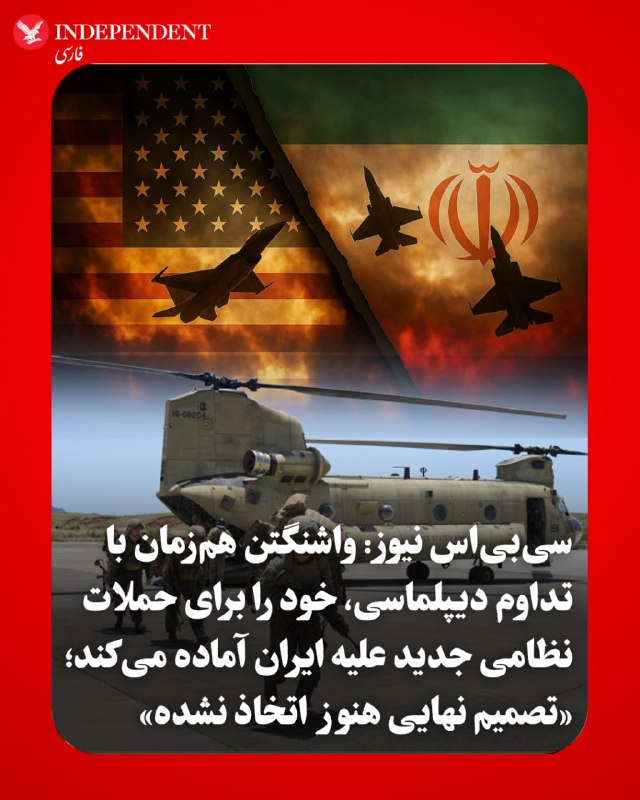
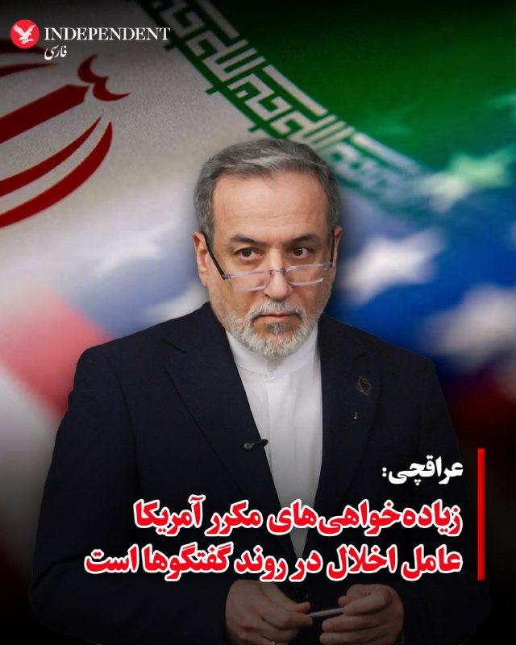
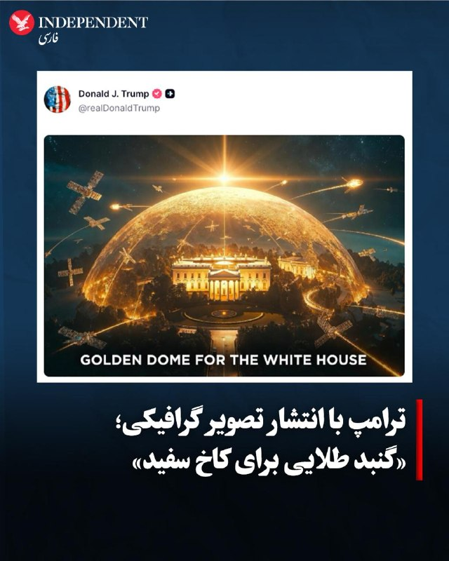
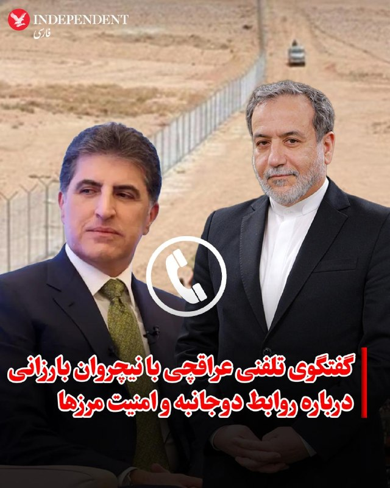
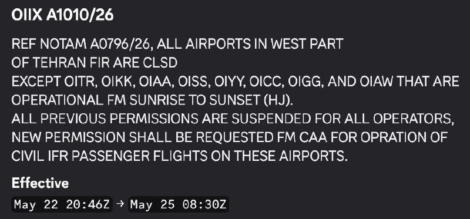
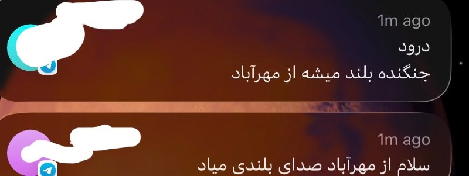
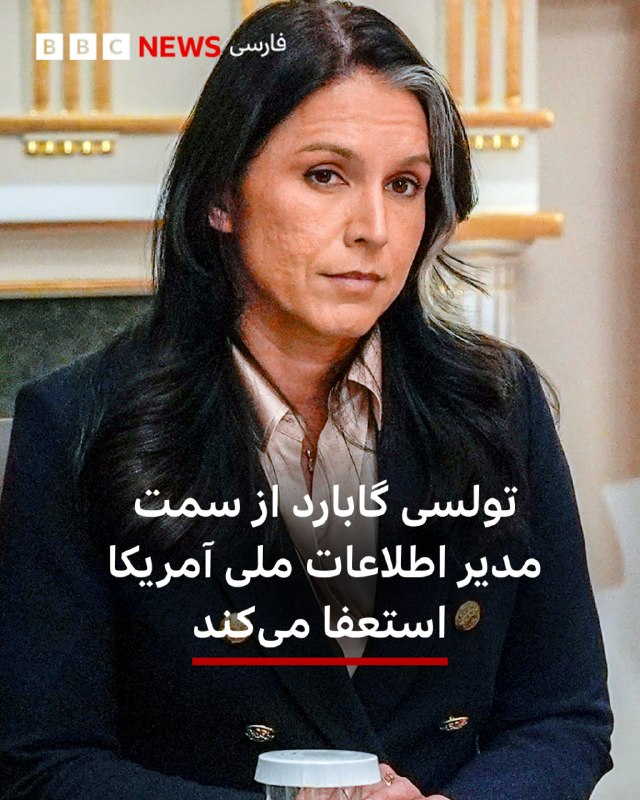
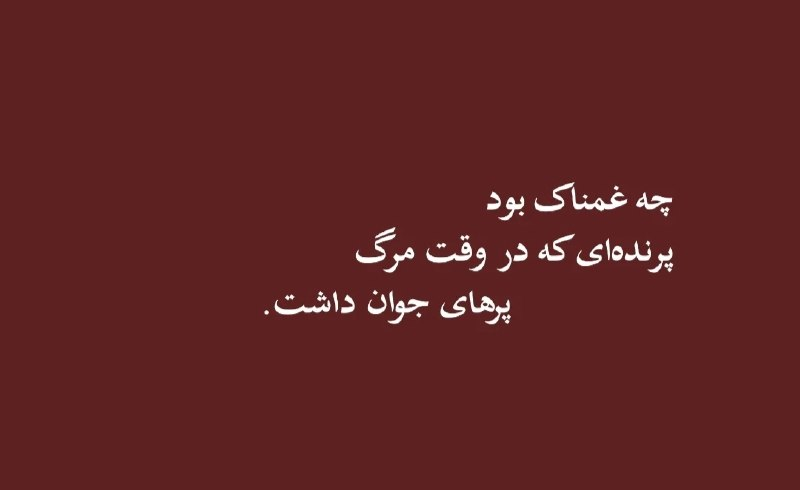

# خواننده تلگرام

<!-- TOP_NAV START -->

<a href="https://github.com/ERAGON007/aio-downloader-testing/blob/main/telegram/content/archive_1.md" style="display:inline-block; padding:6px 12px; margin:0 4px; background-color:#2ea44f; color:white; text-decoration:none; border-radius:4px; font-weight:bold;">صفحه بعد</a>

<!-- TOP_NAV END -->

<!-- MSG START -->

---
📅 بروزرسانی: 1405/03/02 03:41
---

## VahidOOnLine — post 241621

جاویدنامان انقلاب ملی ایرانیان؛ هشت جوان دیگر، هشت زندگی ناتمامی که هرکدام می‌توانستند بخشی از آینده این سرزمین باشند، اما جمهوری سرکوب و خشونت، زندگی را از آنان گرفت.
حیدر کریمی، عباس برزوخانی، مجتبی رضوانی میشامندی، محمدابراهیم داداشی، عرفان خضریان، محمد شاکرمی چگنی، امیرحسین حیدر دوست و فرهاد امین؛ هشت نام از میان ده‌ها هزار زندگی ناتمام.
این روایت‌های کوتاه‌ برای ثبت حقیقت و برای زنده نگه داشتن نام‌هایی که با گلوله، شکنجه و سرکوب از مردم ایران گرفته شدند، اما از حافظه جمعی پاک نخواهند شد.
#جاویدنامان_انقلاب_ملی_ایرانیان
‌🏁 🇬🇧 IranintlTV

🤖 @VahidOOnLine

## VahidOOnLine — post 241620

  

♦️«سی‌بی‌اس نیوز» به نقل از منابع آگاه گزارش داد که دولت ترامپ به‌رغم تداوم رایزنی‌های دیپلماتیک، در حال آماده‌سازی مقدمات دور جدیدی از حملات نظامی علیه ایران است؛ هرچند تا بعدازظهر جمعه تصمیم نهایی در این زمینه اتخاذ نشده است. دونالد ترامپ با انتشار پیامی در شبکه‌های اجتماعی اعلام کرد که به دلیل «شرایط مربوط به دولت» از شرکت در مراسم عروسی پسرش، دونالد ترامپ جونیور، خودداری کرده و با لغو برنامه تفریحی خود در نیوجرسی به کاخ سفید بازمی‌گردد. در همین راستا، گزارش‌ها از لغو مرخصی آخر هفته برخی از اعضای ارتش و جامعه اطلاعاتی آمریکا حکایت دارد و مقامات دفاعی در حال به‌روزرسانی لیست آماده‌باش پایگاه‌های خارجی خود هستند. آنا کلی، سخنگوی کاخ سفید، با تأکید بر اینکه ترامپ خطوط قرمز خود را مبنی بر عدم دست‌یابی ایران به سلاح هسته‌ای و غنی‌سازی اورانیوم صراحتاً روشن کرده است، به سی‌بی‌اس گفت: «رئیس‌جمهوری همواره تمام گزینه‌ها را روی میز نگه می‌دارد و وظیفه پنتاگون آمادگی برای اجرای هرگونه تصمیم فرمانده کل قواست؛ ترامپ درباره عواقب عدم دستیابی به توافق کاملاً شفاف بوده است.»
این تحرکات نظامی در شرایطی صورت می‌گیرد که تهران در حال بررسی آخرین پیشنهاد ایالات متحده برای پایان دادن به جنگ سه‌ماهه اخیر است؛ پیشنهادی که روز چهارشنبه به همراه یک هشدار جدی به ایران ابلاغ شد مبنی بر اینکه رد این «پیشنهاد نهایی» به معنای ازسرگیری حملات نظامی خواهد بود. دونالد ترامپ روز جمعه با بیان اینکه «ایران برای رسیدن به توافق دست‌وپا می‌زند و باید دید چه رخ خواهد داد»، ضرب‌الاجلی چند روزه برای پاسخ تهران تعیین کرد؛ پاسخی که انتظار می‌رود به زودی از طریق پاکستان به عنوان میانجی منتقل شود. در همین حال، مارکو روبیو، وزیر امور خارجه آمریکا، با اشاره به پیشرفت‌های دیپلماتیک اعلام کرد که ترامپ دیپلماسی را به حمله ترجیح می‌دهد، اما هم‌زمان به گفتگوهای خود با اعضای ناتو در سوئد برای بازگشایی اجباری تنگه هرمز تحت عنوان «نقشه ب» اشاره کرد. این در حالی است که سپاه پاسداران نیز پیش از این هشدار داده بود که هرگونه حمله جدید از سوی آمریکا یا اسرائیل می‌تواند جنگ را به خارج از خاورمیانه بکشاند و با «ضربات کوبنده در مکان‌هایی که حتی فکرش را نمی‌کنید» همراه خواهد بود.
‌🇸🇦 Indypersian

🤖 @VahidOOnLine

## VahidOOnLine — post 241619

  

♦️سفارت جمهوری اسلامی ایران در ارمنستان با بازنشر نامه کناره‌گیری «تولسی گابارد» از سمت مدیریت اطلاعات ملی ایالات متحده، واکنش متفاوتی به این رویداد نشان داد و برای او آرزوی موفقیت و بهبودی کرد.
در بخشی از این نامه که توسط سفارت بازنشر شده، آمده است: «ما برای آبراهام (همسر گابارد) آرزوی بهبودی سریع و کامل داریم. شما پیش از این نشان داده‌اید که گاهی برای منافع آمریکا کار می‌کنید و نه برای اسرائیل، و حقایقی را درباره ایران بیان کردید که ترامپ از آن متنفر بود. جای تاسف است که فردی مثل شما با این دولت همکاری کرد؛ دولتی که آمریکا را به حاشیه رانده و به نیابت از اسرائیل عمل می‌کند.»
پیش‌تر نیز تولسی گابارد در نامه استعفای خود خطاب به دونالد ترامپ اعلام کرده بود به دلیل شرایط خانوادگی از سمتش کناره‌گیری می‌کند. او نوشته بود همسرش، آبراهام، به نوعی بسیار نادر از سرطان استخوان مبتلا شده و به همین دلیل تصمیم گرفته است برای همراهی و حمایت از او، از مسئولیت خود در مدیریت اطلاعات ملی آمریکا کنار برود.
‌🇸🇦 Indypersian

🤖 @VahidOOnLine

## VahidOOnLine — post 241618

  

♦️همزمان با افزایش تنش‌ها میان تهران و واشنگتن، عباس عراقچی، وزیر امور خارجه جمهوری اسلامی ایران در گفتگوی تلفنی با آنتونیو گوترش، دبیرکل سازمان ملل متحد، درباره تحولات منطقه به‌ویژه وضعیت خلیج فارس و دریای عمان، با انتقاد شدید از سیاست‌های واشنگتن تصریح کرد: «سوابق بدعهدی آمریکا، خصوصا خیانت‌های مکرر به دیپلماسی، تجاوز نظامی علیه ایران، موضع‌گیری‌های ضد و نقیض و زیاده‌خواهی‌های مکرر، عامل اصلی اخلال در روند گفتگوها به میانجی‌گری پاکستان است.» او با تاکید بر اینکه «جمهوری اسلامی به‌رغم سوءظن شدید به آمریکا، با رویکردی مسئولانه و با جدیت تمام وارد این روند دیپلماتیک شده و برای رسیدن به نتیجه معقول و عادلانه تلاش می‌کند»، تحرکات واشنگتن را مانع صلح دانست. در مقابل، دبیرکل سازمان ملل متحد نیز در این تبادل نظر بر «ضرورت پایبندی به اصول منشور ملل متحد و استفاده از راه‌های دیپلماتیک به منظور برقراری صلح و ثبات در منطقه» تاکید کرد.
‌🇸🇦 Indypersian

🤖 @VahidOOnLine

## VahidOOnLine — post 241617

  

امیر سعید ایروانی، نماینده جمهوری اسلامی در سازمان ملل، در نامه‌ای به شورای امنیت با اشاره به مشارکت قطر، بحرین، کویت، عربستان سعودی، امارات متحده عربی و اردن در حملات آمریکا و اسرائیل علیه جمهوری اسلامی، خواستار جبران کامل خسارات شد.
او گفت در اختیار گذاشتن پایگاه‌ها، پشتیبانی لجستیکی، اطلاعات و هماهنگی پدافند هوایی، این کشورها را از نظر حقوق بین‌الملل مسئول می‌کند.
ایروانی افزود با وجود آن‌که شورای امنیت این کشورها را پاسخگو نکرده است، دولت‌های یادشده موظف‌اند تمامی خسارات مادی و معنوی ناشی از «اقدامات غیرقانونی» خود را به‌طور کامل به جمهوری اسلامی جبران کنند.

‌🏁 🇬🇧 IranintlTV

🤖 @VahidOOnLine

## VahidOOnLine — post 241616

  

♦️امیرسعید ایروانی، نماینده دایم جمهوری اسلامی در سازمان ملل، روز جمعه در نامه‌ای به شورای امنیت، ضمن متهم کردن همسایگان جنوبی خلیج فارس و اردن  به داشتن نقش فعال در حمله آمریکا علیه ایران، گفت: «این کشورها عملا شانه‌به‌شانه آمریکا عمل کرده‌اند و با در اختیار گذاشتن پایگاه‌ها و تاسیسات نظامی، حمایت‌های لجستیکی و عملیاتی، تبادل اطلاعات، هماهنگی پدافند هوایی، اعطای دسترسی به حریم هوایی و مشارکت در فعالیت‌های نظامی علیه سرزمین و منافع ایران مسئول هستند». ایروانی در ادامه گفت با وجود آن‌که شورای امنیت این کشورها را پاسخگو نکرده، دولت‌های قطر، بحرین، کویت، عربستان سعودی، امارات متحده عربی و اردن موظف‌اند تمامی خسارات مادی و معنوی ناشی از «اقدامات غیرقانونی» خود را به‌طور کامل به جمهوری اسلامی ایران جبران کنند.
‌🇸🇦 Indypersian

🤖 @VahidOOnLine

## VahidOOnLine — post 241615

♦️فیلم سینمایی «طهران ۵۷» به کارگردانی ایمان یزدی، سال ۱۴۰۴ پس از اکران در سینماها، طی روزهای گذشته با اعمال «حذفیات» وارد شبکه نمایش خانگی شده و مورد توجه کاربران شبکه‌های اجتماعی قرار گرفته است. این فیلم طنز با بازی احمد مهران‌فر، حامد آهنگی و پژمان جمشیدی، داستان خیالیِ ورود دونالد ترامپ در دوران جوانی‌اش به همراه دو ستاره هالیوود یعنی جک نیکلسون و وارن بیتی به ایران در اوایل سال ۱۳۵۷ را روایت می‌کند که قصد تاسیس یک کازینو در شمال کشور را دارند. یکی از سکانس‌های این فیلم که در فضای مجازی دست‌به‌دست می‌شود، رقص معروف «وای‌ام‌سی‌ای» (YMCA) ترامپ با ترانه قدیمی «بعد از تو» از حسن شماعی‌زاده است؛ سوژه‌ای که ریشه در یک شایعه قدیمی و جنجالی در فضای مجازی ایران دارد.
پایه و اساس داستان این فیلم، یک ادعای نادرست است که سال‌هاست هم‌زمان با مناسبت‌های سیاسی آمریکا در شبکه‌های اجتماعی فارسی، انگلیسی و عربی مورد توجه قرار می‌گیرد. در این شایعه، با انتشار یک عکس، ادعا می‌شود ترامپ در ۳۷ سالگی برای خرید «هتل قدیم رامسر» و راه‌اندازی کازینو به تهران آمده بود؛ ادعایی که حتی یک‌بار توسط یک توریست آلمانی در بازدید از رامسر نیز تکرار شد. با این حال، بررسی‌های دقیق نشان می‌دهد این عکس دستکاری‌شده نیست، بلکه ده سال بعد از انقلاب ایران (۲۷ ژوئن ۱۹۸۸) توسط «ران گاللا» در جریان مسابقه بوکس مایک تایسون در هتل برج ترامپ در آتلانتیک سیتی ثبت شده و هیچ سند، گزارش یا فکتی مبنی بر سفر دونالد ترامپ به ایران در قبل یا بعد از انقلاب وجود ندارد.
‌🇸🇦 Indypersian

🤖 @VahidOOnLine

## VahidOOnLine — post 241614

  

سفارت جمهوری اسلامی در ارمنستان با بازنشر نامه کناره‌گیری تولسی گبرد از مدیریت اطلاعات ملی آمریکا به دلیل ابتلای همسرش به سرطان، برای همسر گبرد سلامتی و برای این مقام آمریکایی «بهترین‌ها» را آرزو کرد و مواضع او را درباره مواردی همچون اسرائیل و جمهوری اسلامی مورد تحسین قرار داد.
این سفارت‌خانه خطاب به گبرد در ایکس نوشت: «تو پیش‌تر در مقاطعی نشان دادی که برای آمریکا کار می‌کنی نه اسرائیل، و گاهی درباره ایران واقعیت‌هایی را بیان کردی که ترامپ از آن‌ها خوشش نمی‌آمد. تاسف‌آور بود که فردی مانند تو با این دولت همکاری کرد؛ دولتی که آمریکا را به حاشیه رانده و به نیابت از اسرائیل عمل می‌کند.»

‌🏁 🇬🇧 IranintlTV

🤖 @VahidOOnLine

## VahidOOnLine — post 241613

  

♦️به گزارش رویترز، سازمان خدمات شهروندی و مهاجرت ایالات متحده در دستورالعملی جدید اعلام کرد متقاضیانی که در خاک آمریکا حضور دارند و به دنبال تغییر وضعیت مهاجرتی خود برای دریافت «کارت سبز» (گرین‌کارت) هستند، دیگر نمی‌توانند این فرایند را از داخل آمریکا پیگیری کنند. طبق این سیاست، متقاضیان ملزم هستند برای تکمیل مراحل قانونی، به کشور مبدا بازگشته و از طریق وزارت امور خارجه اقدام کنند.
وزارت امنیت داخلی آمریکا هدف از این تصمیم را جلوگیری از سوءاستفاده از خلأهای قانونی و اصلاح عملکرد سیستم مهاجرتی طبق قانون اعلام کرده است. بر اساس این گزارش سازمان‌های حقوق بشری و حامیان پناهجویان به شدت به این تصمیم اعتراض کرده‌اند.  به گزارش رویترز، این سیاست، قربانیان قاچاق انسان و کودکان آسیب‌دیده‌ای را که از شرایط خطرناک کشورهای خود گریخته‌اند، مجبور می‌کند برای دریافت اقامت دائم، دوباره به همان محیط‌های ناامن بازگردند.
‌🇸🇦 Indypersian

🤖 @VahidOOnLine

## VahidOOnLine — post 241612

  

♦️دونالد ترامپ، رئیس‌جمهوری آمریکا، با انتشار تصویری گرافیکی با عبارت «گنبد طلایی برای کاخ سفید» در شبکه اجتماعی «تروث سوشال»، بار دیگر بر ایده خود مبنی بر ایجاد یک سپر دفاع موشکی همه‌جانبه تاکید کرد. ترامپ که از زمان مبارزات انتخاباتی خود بارها بر لزوم ساخت یک چتر پدافندی بزرگ برای کل خاک آمریکا (مشابه گنبد آهنین اسرائیل اما بسیار پیشرفته‌تر) تاکید کرده، در این تصویر مفهومی، کاخ سفید را زیر یک پوشش حفاظتی درخشان مجهز به سیستم‌های راداری و ماهواره‌های مداری به تصویر کشیده است. به گزارش منابع آگاه، پروژه ۱۸۵ میلیارد دلاری «گنبد طلایی» به عنوان یک سپر فضامحور با تکیه بر هوش‌مصنوعی برای رهگیری موشک‌های بالستیک، کروز و هایپرسونیک طراحی شده و صدها شرکت برای مشارکت در آن رقابت می‌کنند. بر اساس گزارش‌ها، غول‌های فناوری نظامی مانند «اندوریل» و «پالانتیر» در حال همکاری برای ارتقای نرم‌افزاری این سامانه هستند و پیش از این نیز در بخش‌هایی از پروژه با شرکت «اسپیس‌اکس» متعلق به ایلان ماسک مشارکت داشته‌اند.
‌🇸🇦 Indypersian

🤖 @VahidOOnLine

## WithYashar — post 12081

دوستانی که فوحش خاستن تست کردن و خوردن و بلاک کردم 😃 دیکتاتور خشن یاشار

## WithYashar — post 12080

دایرکت بی مورد ندید مخوصوصا کسی بپرسه امشب میزنه یا بپرسه بخوابم یا نه …. خستم و با شدیدترین پاسخ ممکن جواب میدم !

## WithYashar — post 12079

## WithYashar — post 12078

منابع دولتی گزارش می‌دهند که ارتش جمهوری اسلامی به بالاترین سطح هشدار رسیده است.
@withyashar

## WithYashar — post 12077

  

نقشه فعلی اختلالات مداوم GPS در خلیج فارس

GPS Jamming
یعنی فرستادن پارازیت روی سیگنال ماهواره‌ای تا پهپاد، موشک، هواپیما یا موبایل نتواند موقعیت دقیقش را پیدا کند.
این کار را معمولاً اطراف مناطق حساس نظامی انجام می‌دهند تا سلاح‌ها و پهپادهای دشمن دقتشان کم شود یا مسیر را گم کنند.
نوع پیشرفته‌ترش «Spoofing» است که موقعیت جعلی نشان می‌دهد و هدف را به مسیر اشتباه می‌برد.
@withyashar

## WithYashar — post 12076

  <a href="telegram/content/WithYashar_12076_1779495087.mp4" target="_blank">🎬 Download video</a>

ترامپ به کاخ سفید رسیده است و به تیم خبری رسماً اطلاع داده شده که ترامپ در بقیه روز هیچ حضور عمومی، بیانیه یا فرصت عکسبرداری نخواهد داشت.
@withyashar

## WithYashar — post 12075

طبق گزارش CBS نیوز: دولت ترامپ در حال آماده‌سازی برای دور جدیدی از حملات علیه ایران است، علی‌رغم تلاش‌های دیپلماتیک در جریان، در حالی که چندین مقام نظامی و اطلاعاتی ایالات متحده برنامه‌های آخر هفته روز یادبود خود را لغو کرده‌اند با انتظار اینکه اقدام نظامی ممکن است دستور داده شود.

@withyashar

## WithYashar — post 12074

## WithYashar — post 12073

  <a href="telegram/content/WithYashar_12073_1779495089.mp4" target="_blank">🎬 Download video</a>

پست جدید ترامپ 🤣
@withyashar

## WithYashar — post 12072

تعطیلی مراسم یادبود آخر هفته(دوشنبه) برای برخی از نیروهای نظامی آمریکایی لغو شد.
@withyashar

## WithYashar — post 12071

  <a href="telegram/content/WithYashar_12071_1779495090.mp4" target="_blank">🎬 Download video</a>

🎬 Video

## WithYashar — post 12070

مهدی طارمی نمیدونم کیه ولی میگن به اردوی آنتالیا تیم‌ملی اضافه شد
@withyashar

## WithYashar — post 12069

## WithYashar — post 12068

جت های جنگی اسرائیلی به صورت گسترده در حال پرواز به سمت آسمان عراق و عربستان مشاهده شدند.
@withyashar

## WithYashar — post 12067

توجه کنید این خبر فعلا فقط توسط رسانه های اسرائیل گفته شده هنوز تایید نشده

## WithYashar — post 12066

گزارشها حاکی از این است که هیئت پاکستانی با عجله تهران را ترک کردند. @withyashar

## WithYashar — post 12065

کلاً یه دونه تانکر سوخت رسان تو آسمون اسرائیله. من نمیدونم چرا یه خبر فیک میزنن همه هم همونو کپی میکنن همه جا پخش میکنن.

## WithYashar — post 12064

کلاً یه دونه تانکر سوخت رسان تو آسمون اسرائیله. من نمیدونم چرا یه خبر فیک میزنن همه هم همونو کپی میکنن همه جا پخش میکنن.

## WithYashar — post 12063

یه هم زبون افغان نیست اینجا ؟😃

## WithYashar — post 12062

گزارشها حاکی از این است که هیئت پاکستانی با عجله تهران را ترک کردند.
@withyashar

## mwarmonitor — post 9511

  

✈️نیروهای آمریکایی در آسمان بیابان سماوه در جنوب عراق فعال شده‌اند و با استقرار هواپیماهای سوخت‌رسان هوایی فعالیت می‌کنند؛ موضوعی که نشان می‌دهد پروازهای جنگی دیگری نیز در آسمان عراق حضور دارند.

@mwarmonitor

## mwarmonitor — post 9510

  

🔴در میان گزارش‌هایی مبنی بر اینکه ایران با صدور اطلاعیه هوانوردان (NOTAM) حریم هوایی خود را تا روز دوشنبه بسته است، یک هواپیمای قطری که به‌عنوان هواپیمای تشریفاتی (VIP) دولت قطر شناخته می‌شود، در حال ترک تهران مشاهده شده است.

🔸این پرواز پس از سفر هیأت قطری به تهران برای تسهیل دستیابی به توافقی میان آمریکا و ایران انجام می‌شود.

🔹در حالی که Asim Munir، تصمیم‌گیرنده اصلی پاکستان، قرار است فردا با همتایان ایرانی خود دیدار کند.

@mwarmonitor

## FoxNewsTwitter — post 342150

  

Fox News (Twitter/X)

WATCH LIVE: Press conference after massive explosion injures 16, including firefighters https://twitter.com/i/broadcasts/1jxXggegoRLJZ

## DEJradio — post 4858

  <a href="telegram/content/DEJradio_4858_1779495093.webm" target="_blank">🎬 Download video</a>

👑
🔺 شاهزاده رضا پهلوی روز آدینه ابتدای خرداد، در کنگره آمریکا، با دریک ون اوردن و دن میوزر، دو نفر از نمایندگان مجلس ایالات متحده دیدار کرد.

دریک ون اوردن با انتشار تصاویری از این دیدار در ایکس، بر حمایت از مبارزه مردم ایران برای آزادی تاکید کرد و نوشت: «آن‌ها به پایان دادن به جنگی که ملایان رادیکال ۴۷سال پیش علیه آمریکا و جهان آزاد آغاز کردند، کمک می‌کنند.» دن میوزر نیز با قدردانی از ایستادگی شاهزاده رضا پهلوی در برابر رژیم حاکم، پایداری او در دفاع از هموطنانش را که نزدیک به ۵۰سال تحت ستم بوده‌اند، ستود.

شاهزاده رضا پهلوی نیز در ایکس نوشت، «خوشحالم که دن مویزر دیدار کردم. از حمایت او از مردم ایران در مبارزه برای بازپس‌گیری کشورمان از رژیم اشغالگر و بازگرداندن ایران به صلح، رفاه و جامعه جهانی سپاسگزارم».

#شاهزاده_رضا_پهلوی
@DEJradio

## IranIntlTV — post 338505

جاویدنامان انقلاب ملی ایرانیان؛ هشت جوان دیگر، هشت زندگی ناتمامی که هرکدام می‌توانستند بخشی از آینده این سرزمین باشند، اما جمهوری سرکوب و خشونت، زندگی را از آنان گرفت.
حیدر کریمی، عباس برزوخانی، مجتبی رضوانی میشامندی، محمدابراهیم داداشی، عرفان خضریان، محمد شاکرمی چگنی، امیرحسین حیدر دوست و فرهاد امین؛ هشت نام از میان ده‌ها هزار زندگی ناتمام.
این روایت‌های کوتاه‌ برای ثبت حقیقت و برای زنده نگه داشتن نام‌هایی که با گلوله، شکنجه و سرکوب از مردم ایران گرفته شدند، اما از حافظه جمعی پاک نخواهند شد.
#جاویدنامان_انقلاب_ملی_ایرانیان

## IranIntlTV — post 338504

  

امیر سعید ایروانی، نماینده جمهوری اسلامی در سازمان ملل، در نامه‌ای به شورای امنیت با اشاره به مشارکت قطر، بحرین، کویت، عربستان سعودی، امارات متحده عربی و اردن در حملات آمریکا و اسرائیل علیه جمهوری اسلامی، خواستار جبران کامل خسارات شد.
او گفت در اختیار گذاشتن پایگاه‌ها، پشتیبانی لجستیکی، اطلاعات و هماهنگی پدافند هوایی، این کشورها را از نظر حقوق بین‌الملل مسئول می‌کند.
ایروانی افزود با وجود آن‌که شورای امنیت این کشورها را پاسخگو نکرده است، دولت‌های یادشده موظف‌اند تمامی خسارات مادی و معنوی ناشی از «اقدامات غیرقانونی» خود را به‌طور کامل به جمهوری اسلامی جبران کنند.

https://iranintl.com/202605227902

## IranIntlTV — post 338503

  

سفارت جمهوری اسلامی در ارمنستان با بازنشر نامه کناره‌گیری تولسی گبرد از مدیریت اطلاعات ملی آمریکا به دلیل ابتلای همسرش به سرطان، برای همسر گبرد سلامتی و برای این مقام آمریکایی «بهترین‌ها» را آرزو کرد و مواضع او را درباره مواردی همچون اسرائیل و جمهوری اسلامی مورد تحسین قرار داد.
این سفارت‌خانه خطاب به گبرد در ایکس نوشت: «تو پیش‌تر در مقاطعی نشان دادی که برای آمریکا کار می‌کنی نه اسرائیل، و گاهی درباره ایران واقعیت‌هایی را بیان کردی که ترامپ از آن‌ها خوشش نمی‌آمد. تاسف‌آور بود که فردی مانند تو با این دولت همکاری کرد؛ دولتی که آمریکا را به حاشیه رانده و به نیابت از اسرائیل عمل می‌کند.»

https://iranintl.com/202605227176

## FarsiVOA — post 218403

🔺گزارش سی‌بی‌اس از تحرکات تازه جامعه نظامی و اطلاعاتی آمریکا با محوریت ایران؛ برخی اعضای ارتش مرخصی‌های خود را لغو کردند

◾️شبکه آمریکایی سی‌بی‌اس به نقل از منابع مطلع گزارش داد که دولت دونالد ترامپ، رئیس‌جمهوری آمریکا، روز جمعه ۱ خرداد و هم‌زمان با ادامه تلاش‌های دیپلماتیک، خود را برای دور تازه‌ای از حملات نظامی به جمهوری اسلامی ایران آماده می‌کرد.

⬇️ بیشتر بخوانید:
https://ir.voanews.com/a/8152870.html
@FarsiVOA

## FarsiVOA — post 218402

⚡️پشت پرده سفر پنج روزه ژنرال پترائوس به بغداد؛ قطع نفوذ جمهوری اسلامی شرط واشنگتن برای عراق
@FarsiVOA

## FarsiVOA — post 218401

  <a href="telegram/content/FarsiVOA_218401_1779495095.mp4" target="_blank">🎬 Download video</a>

⚡️مخالفت جمهوری‌خواهان با تلاش دموکرات‌ها برای محدود کردن اختیارات جنگی رئیس جمهوری آمریکا
@FarsiVOA

## FarsiVOA — post 218400

⚡️اعزام ۵ هزار نیروی آمریکا به لهستان؛ تقویت حضور نظامی در جناح شرقی ناتو
@FarsiVOA

## FarsiVOA — post 218399

  

⚡️به گزارش‌ سایت نوتیافی، سازمان هواپیمایی کشوری جمهوری اسلامی با صدور اطلاعیه هوانوردی برای حریم هوایی ایران، اعلام کرد که همه فرودگاه‌های بخش غربی منطقه اطلاعات پروازی تهران به‌جز چند فرودگاه، از (جمعه) ۲۲ مه تا ۲۵ مه بسته خواهند بود و فرودگاه‌های باز در آن محدوده نیز فقط از طلوع تا غروب آفتاب پذیرای پروازهای تجاری هستند.
@FarsiVOA

## Persian_Trend_Official — post 14702

  <a href="telegram/content/Persian_Trend_Official_14702_1779495096.webm" target="_blank">🎬 Download video</a>

🔴 الحدث: فضای مذاکرات ایران و آمریکا مثبت است اما توافق نهایی حاصل نشده

💢شبکه الحدث به نقل از منابع مطلع گزارش داد فضای مذاکرات میان تهران و واشینگتن «مثبت» ارزیابی می‌شود، اما دو طرف هنوز به توافق نهایی نرسیده‌اند.

💢بر اساس این گزارش:
▪️ پیش‌نویس یک توافق آماده شده و اکنون نیازمند تأیید نهایی دو طرف است

▪️ مذاکرات فعلی بر روی نهایی‌کردن متن و حل اختلافات باقی‌مانده متمرکز شده

▪️ طرف‌های میانجی منطقه‌ای همچنان در تلاش برای نزدیک‌کردن مواضع تهران و واشینگتن هستند
💢همزمان گزارش‌ها حاکی است:
▪️ هنوز اختلافاتی بر سر برنامه هسته‌ای، تحریم‌ها و نحوه اجرای توافق وجود دارد

▪️ برخی منابع ایرانی ادعای رسیدن به «پیش‌نویس نهایی» را رد کرده‌اند

▪️باوجودفضاینسبتاًمثبت،خطربازگشتتنشنظامیهمچنانپابرجاست

🫆:Tony

📌 @persian_trend_official
پرشین ترند | متفاوت‌ترین کانال نظامی

## Persian_Trend_Official — post 14701

  <a href="telegram/content/Persian_Trend_Official_14701_1779495096.webm" target="_blank">🎬 Download video</a>

🔴 نقشه اختلالات GPS در خلیج فارس

💢گزارش‌ها و داده‌های ناوبری نشان می‌دهد اختلالات گسترده GPS همچنان در بخش‌های مختلف خلیج فارس ادامه دارد.

▪️ بیشترین اختلال‌ها در اطراف تنگه هرمز، سواحل جنوبی ایران و مسیرهای کشتیرانی بین‌المللی ثبت شده است
▪️ این اختلالات می‌تواند بر ناوبری کشتی‌ها، پهپادها و برخی پروازهای عبوری تأثیر بگذارد
▪️ طی هفته‌های اخیر بارها گزارش‌هایی از «اسپوفینگ» و اخلال الکترونیکی در منطقه منتشر شده است

🫆:Tony

📌 @persian_trend_official
پرشین ترند | متفاوت‌ترین کانال نظامی

## Persian_Trend_Official — post 14699

⭕️ ساعتی پیش، تولسی گابارد، از سمت خود به‌عنوان مدیر اطلاعات ملی کابینه دونالد ترامپ، استعفا داد.
در نامه استعفای خود، گابارد گفته است که همسرش، آبراهام، اخیراً به «نوعی بسیار نادر از سرطان استخوان» مبتلا شده و او برای حمایت از همسرش در این مبارزه، تصمیم گرفته از خدمت عمومی کناره‌گیری کند. استعفای او از ۳۰ ژوئن اجرایی می‌شود.

گابارد از جمله کسانی بود که مانند معاونش، جو، با جنگ با ایران مخالف بود.

📝 Nick

📌 @persian_trend_official
پرشین ترند | متفاوت‌ترین کانال نظامی

## Persian_Trend_Official — post 14698

  <a href="telegram/content/Persian_Trend_Official_14698_1779495096.mp4" target="_blank">🎬 Download video</a>

💢متبرک کردن سربند با پهپاد شاهد ۱۳۶ ...

🫆:Tony

📌 @persian_trend_official
پرشین ترند | متفاوت‌ترین کانال نظامی

## IranianMinds — post 20577

  

🔴وضعیت پروازهای نظامی در منطقه.

@IranianMinds

## IranianMinds — post 20576

🔴با تعطیلی ۹۰ ساعت آینده بورس آمریکا ، وارد حساس‌ترین فاز زمانی شدیم.

@IranianMinds

## IranianMinds — post 20575

🔴سی‌بی‌اس نیوز:

دولت ترامپ برای دور جدیدی از حملات علیه ایران آماده شده است.
چندین عضو ارتش و جامعه اطلاعاتی ایالات متحده، برنامه‌های روز یادبود خود را به دلیل پیش‌بینی حملات احتمالی لغو کرده‌اند.

@IranianMinds

## BBCPersian — post 281822

  

🔻دو مقام آمریکایی به شبکه خبری اکسیوس گفتند که دونالد ترامپ، نشستی را با اعضای ارشد تیم امنیت ملی خود درباره جنگ با ایران برگزار کرده است.

این گزارش حاکیست که رئیس جمهور آمریکا در صورت شکست مذاکرات در آخرین لحظات، به‌طور جدی در حال بررسی انجام حملات تازه علیه ایران است.

گفته می‌شود که این نشست همزمان با سفر عاصم منیر، فرمانده ارتش پاکستان، به تهران برگزار شده است، سفری که ظاهرا آخرین تلاش‌ها برای کاهش اختلاف‌ها و جلوگیری از شروع دوباره جنگ به شمار می‌رود.

همزمان یک هیئت از قطر هم با «هماهنگی آمریکا» در تهران به‌سر می‌برد.

برپایه گزارش آکسیوس همچنین در این جلسه، جی‌دی ونس، معاون رئیس‌جمهور، پیت هگست، وزیر دفاع، جان رتکلیف، رئیس سازمان سیا، سوزی وایلز، رئیس دفتر کاخ سفید، و شماری دیگر از مقام‌ها در کنار دونالد ترامپ حضور داشتند.

گفته شده که مارکو روبیو، وزیر خارجه آمریکا، و ژنرال دن کین، رئیس ستاد مشترک ارتش، در جلسه حضور نداشتند؛ زیرا اولی در اروپا بود و دومی در مراسم فارغ‌التحصیلی آکادمی نیروی دریایی شرکت داشت.

📷 Bloomberg via Getty Image
https://bbc.in/4f2mcqz
@BBCPersian

## BBCPersian — post 281815

🖋سوچیرا مگوایر و رها کانسارا
واحد جهانی مقابله با اطلاعات نادرست، بی‌بی‌سی

داخل یک دکه کوچک بامبویی در میانمار، مین مشغول آماده کردن مغازه‌اش برای آغاز روز است.

کابل‌های درهم‌پیچیده، سامانه برق خورشیدی و مستقل از شبکه برق را به چند پریز متصل کرده‌اند. چند صندلی پلاستیکی برای مشتریان چیده شده و روی منوی دست‌نویس، نام خوراکی‌هایی نوشته شده است.

مین، که به دلایل نگرانی‌های امنیتی نامش را تغییر داده‌ایم، می‌داند مشتری‌ها قرار است مدت زیادی اینجا بمانند. آن‌ها فقط برای یک چیز به این کافه می‌آیند: اینترنت.

او می‌گوید هر روز حدود ۳۰ نفر به کافه‌اش مراجعه می‌کنند. زمانی که بیش از دو سال پیش کارش را آغاز کرد، چنین کافه‌هایی کمیاب بودند و روزانه بین ۳۰۰ تا ۴۰۰ نفر به آنجا می‌آمدند. او می‌گوید: «تقاضا سرسام‌آور بود.»

آلبوم را ورق بزنید و ادامه مطلب را از لینک زیر در وبسایت بی‌بی‌سی فارسی بخوانید.

📸BBC/ GettyImages/ LightRocket via Getty Images/ AFP via Getty Images/ Future Publishing via Getty Images/ NurPhoto via Getty Images
https://bbc.in/4ulh4m2
@BBCPersian

## BBCPersian — post 281814

  

🔻مقامات ایالت بلوچستان پاکستان در حال تحقیق درباره دزدیده شدن بیش از ۴۰۰ گوسفند ممتاز از یک دامداری تحت نظارت دولت هستند.

کارکنان این دامداری می‌گویند که گروهی از مردان مسلح سوار بر موتورسیکلت این گوسفندها را که از نژاد قره‌قل هستند، دزدیدند.

پشم گوسفند قره‌قل که به گوسفند پرشین یا ایرانی هم معروف است، ضخیم، چین‌دار، مخملی، درخشنده و بسیار قیمتی است.

این گونه از پشم لوکس محسوب می‌شود و تجارت آن سودآور است. پشم قره‌قل در صنایع مختلفی از جمله منسوجات و فرشبافی استفاده دارد. نخ حاصل از این پشم در لباس‌های ضخیم زمستانی با دوام بالا استفاده می‌شود و به‌علت تاب‌آوری بالا، پشم قره‌قل از مواد با دوام بافت قالی در پاکستان، افغانسان و ایران است.

مقامات محلی بلوچستان پاکستان می‌گویند که گوسفندها برای تحقیقات و بره‌کشی در آن مرکز نگهداری می‌شدند. آن‌ها می‌گویند که سرقتی در این ابعاد از یک مرکز دولتی کم‌سابقه است.

📷 NurPhoto via Getty Images
@BBCPersian

---
📅 بروزرسانی: 1405/03/02 02:08
---

## VahidOOnLine — post 241611

  

♦️تام کاتن، سناتور جمهوری‌خواه، در نامه‌ای رسمی به اسکات بسنت، وزیر خزانه‌داری ایالات متحده، ضمن هشدار درباره راه‌اندازی «عوارضی تهران» توسط سپاه پاسداران خواستار اعمال تحریم‌های تنبیهی فوری علیه حامیان این طرح شد. کاتن با مواضع تند خود علیه اقدام غیرقانونی ایران در ایجاد «سازمان تنگه خلیج فارس» (PGSA) نوشت: «این سازمان که مستقیما زیر نظر سپاه پاسداران (به عنوان یک سازمان تروریستی) فعالیت می‌کند، حق حاکمیت برای تنظیم تردد و دریافت عوارض تا سقف ۲ میلیون دلار برای هر کشتی را ادعا کرده است؛ بنابراین هر دلار جمع‌آوری‌شده، مستقیما برای تأمین مالی تروریسم هزینه می‌شود.» این سناتور آمریکایی با تأکید بر اینکه این اقدام آزادی کشتیرانی بین‌المللی را به خطر می‌اندازد، صراحتا اعلام کرد: «این سازمان بدون رضایت سایر کشورها نمی‌تواند فعالیت کند و ایالات متحده باید اطمینان حاصل کند که هر بازیگری که به رژیم تروریستی ایران کمک می‌کند، پاسخگو خواهد شد؛ به همین دلیل من از به کارگیری اختیارات موجود برای اعمال تحریم بر این سازمان، مقامات آن و هر نهاد خارجی که این باج‌ها را به ایران پرداخت، پردازش یا تسهیل می‌کند، کاملا حمایت می‌کنم.»
‌🇸🇦 Indypersian

🤖 @VahidOOnLine

## VahidOOnLine — post 241610

  

♦️به گزارش فارس، خبرگزاری وابسته به سپاه پاسداران، عباس عراقچی، وزیر امور خارجه جمهوری اسلامی روز جمعه در تماس تلفنی با نیچروان بارزانی، رئیس اقلیم کردستان عراق، درباره روابط دوجانبه ایران و عراق و آخرین تحولات منطقه گفتگو کرد. براساس این گزارش، محورهای اصلی و مهم این تبادل نظر بر مناسباتی از جمله توسعه مراودات اقتصادی-تجاری، تقویت هماهنگی‌ها برای حفظ امنیت مرزهای مشترک و مقابله با تروریسم متمرکز بود. فارس نوشت، دو طرف همچنین در خصوص تحولات منطقه‌ای رایزنی کرده و بر اهمیت اهتمام و هم‌گرایی کشورهای منطقه جهت تقویت امنیت درون‌زا تأکید کردند.
‌🇸🇦 Indypersian

🤖 @VahidOOnLine

## VahidOOnLine — post 241609

  <a href="telegram/content/VahidOOnLine_241609_1779489506.mp4" target="_blank">🎬 Download video</a>

⭕️«صبحانه زنان»؛ بنیاد زنان نیویورک ۱۵۰۰ زن تاثیرگذار را در نیویورک گرد هم آورد

📌یکی از نمادهای مشهور این مراسم اهدای جایزه «عصای راه‌پیمایی» است؛ تندیسی نمادین که مفاهیمی چون قدرت، خرد و حرکت روبه‌جلو را نمایندگی می‌کند

♦️برگزارکنندگان این مراسم تاکید کردند این بنیاد طی سال‌ها توانسته است زنان آمریکایی را، فارغ از وابستگی‌های حزبی و تفاوت‌های سیاسی، کنار یکدیگر گرد آورد و از طریق فعالیت‌های مدنی، آموزشی و اقتصادی، بر جامعه آمریکا تاثیر بگذارد.

یکی از نمادهای این مراسم «عصای راه‌پیمایی» (Walking Stick Award) است؛ هدیه‌ای نمادین و دست‌ساز که با الهام از هنرهای بومی، مختص به هر فرد ساخته و تزیین و به زنان تاثیرگذار، فعالان اجتماعی و رهبران مدنی اهدا می‌شود و مفاهیمی چون قدرت، خرد و حرکت روبه‌جلو را نمایندگی می‌کند.
ایده ساخت و اهدای این عصای تزیین‌شده که گوناگونی و جمعیت رنگارنگ آمریکا را به تصویر می‌کشد، یکی از سازمان‌های تحت‌حمایت بنیاد که در حوزه توانمند سازی زنان فعالیت می‌کند، مطرح و اجرا کرد.

بیشتر بخوانید...
‌🇸🇦 Indypersian

🤖 @VahidOOnLine

## VahidOOnLine — post 241608

  

♦️بر اساس گزارش‌های تحلیلی آژانس رتبه‌بندی مودیز (Moody's)، رتبه اعتباری بلندمدت عربستان سعودی با وجود انسداد تنگه هرمز، همچنان «پایدار» است. مودیز در گزارش روز جمعه خود اعلام کرد که این تصمیم بازتاب‌دهنده اقتصاد بزرگ، ثروتمند و جایگاه رقابتی بالا و هزینه پایین تولید هیدروکربن در این کشور، در کنار بهبود اثربخشی سیاست‌ها و پیشرفت در چارچوب چشم‌انداز ۲۰۳۰ است. این آژانس تایید کرد که رشد بخش خصوصی غیرنفتی عربستان سعودی با نرخ پیش‌بینی‌شده ۴ تا ۵ درصد پس از فروکش کردن تنش‌ها، از قوی‌ترین‌ها در میان کشورهای شورای همکاری خلیج فارس خواهد بود. اگرچه اقتصاد پادشاهی سعودی به دلیل درگیری‌های جاری در خاورمیانه و انسداد عملی تنگه هرمز از اوایل ماه مارس، با کاهش ۱۰ درصدی تولید هیدروکربن و انقباض ۱.۷ درصدی کلِ جی‌دی‌پی (GDP) در سال ۲۰۲۶ مواجه است، اما مودیز پیش‌بینی می‌کند که در سال ۲۰۲۷ و با عادی‌سازی جریان تجارت، رشد اقتصادی عربستان سعودی جهش چشمگیر ۸ درصدی را تجربه کند.
طبق تحلیل سناریوی مرکزی این آژانس رتبه‌بندی، ساختار اعتباری عربستان سعودی در برابر اختلالات طولانی‌مدت و انسداد تنگه هرمز تا پایان سال ۲۰۲۶ تاب‌آور خواهد بود. این ثبات و انعطاف‌پذیری به دلیل توانایی ریاض در تغییر مسیر بخش عمده‌ای از صادرات نفت خود از طریق خط لوله شرق به غرب به سمت پایانه‌های دریای سرخ است؛ به‌طوری‌که این بنادر اکنون قادر به بارگیری تا ۵ میلیون بشکه در روز معادل نفت (دو‌سوم سطوح پیش از نزاع منطقه) هستند. علاوه بر این، جهش قیمت نفت به محدوده ۹۰ تا ۱۱۰ دلار در هر بشکه در سال ۲۰۲۶ و وجود دارایی‌های مالی قدرتمند دولت (معادل ۱۸ درصد جی‌دی‌پی در سال ۲۰۲۵)، ظرفیت بالایی را برای جذب نوسانات ایجاد کرده و درآمدها را فراتر از پیش‌بینی‌های قبل از جنگ برده است.
‌🇸🇦 Indypersian

🤖 @VahidOOnLine

## VahidOOnLine — post 241607

  

ترامپ در یک سخنرانی در سوفرن نیویورک گفت: «با عملیات خشم حماسی، رزمندگان ما اطمینان حاصل خواهند کرد که جمهوری اسلامی به عنوان بزرگ‌ترین حامی «تروریسم» دولتی در جهان، هرگز به سلاح هسته‌ای دست نخواهد یافت و خودشان هم این را می‌دانند.»
ترامپ گفت: حکومت ایران به عنوان بزرگ‌ترین حامی تروریسم دولتی، به سراسر جهان پول می‌فرستد تا مشکل ایجاد کند.

‌🏁 🇬🇧 IranintlTV

🤖 @VahidOOnLine

## VahidOOnLine — post 241606

  

خبرگزاری تسنیم، وابسته به سپاه پاسداران، به نقل از یک منبع نظامی گزارش داد نیروهای مسلح جمهوری اسلامی «به‌طور کامل» تحولات را زیر نظر دارند و در صورت آنچه «حماقت دشمن» و هرگونه بهانه‌جویی از سوی آمریکا و متحدانش خوانده شده، سناریوهای تازه‌ای آماده کرده‌اند.

به گفته این منبع، در صورت اقدام نظامی احتمالی آمریکا، «نسخه سوم مبارزه جمهوری اسلامی» اجرا خواهد شد؛ نسخه‌ای که به ادعای او در حوزه تجهیزات جدید، اهداف نوین، تاکتیک‌ها و راهبردهای جنگی نمود خواهد داشت و حتی می‌تواند جبهه‌های جدیدی در سطح فرامنطقه‌ای ایجاد کند.

این منبع نظامی همچنین مدعی شد آمریکا در صورت «زیاده‌خواهی و اقدام نظامی»، «تنبیه بزرگ سوم» را در کمتر از یک سال تجربه خواهد کرد؛ تنبیهی که به گفته او «به شکلی خاص‌تر و جدیدتر» خواهد بود.
‌🏁 🇬🇧 IranintlTV

🤖 @VahidOOnLine

## VahidOOnLine — post 241605

  

♦️تسنیم، خبرگزاری وابسته به سپاه پاسداران، روز جمعه به نقل از «یک منبع نظامی» نوشت: «نیروهای مسلح جمهوری اسلامی کاملا اوضاع را زیر نظر دارند و در صورت حماقت دشمن با هرگونه بهانه جویی، سناریوهای تازه‌ای برای آمریکا و متحدانش آماده کرده‌اند. این منبع نظامی در گفتگو با تسنیم ضمن اشاره به اینکه اگر دشمن حماقت کند، «نسخه سوم مبارزه ایران» را مشاهده خواهد کرد مدعی شد: «این نسخه سوم هم در حوزه تجهیزات جدید و هم در حوزه اهداف نوین و نیز در حوزه تاکتیک‌ها و استراتژی جنگ نمایان خواهد شد. به نحوی که جبهه‌های جدید فرامنطقه‌ای نیز آنها را پشیمان‌تر خواهد کرد. آمریکا در صورت زیاده‌خواهی و بهانه‌جویی و اقدام نظامی احتمالی، تنبیه بزرگ سوم خود را در کمتر از یکسال تجربه خواهد کرد؛ این بار به شکل خاص‌تر و جدیدتر».
‌🇸🇦 Indypersian

🤖 @VahidOOnLine

## WithYashar — post 12054

کسایی که بلاک میشن بیان محترمانه عذرخواهی کنند بدون حرف اضافی آنبلاک میکنم
قوربان شوما دیکتاتور مهربون یاشار 🤣❤️‍🩹🙌🏾

## WithYashar — post 12053

بیتکوین شلوار خودشو خیس کرد داره میریزه🥴
@withyashar

## WithYashar — post 12052

  <a href="telegram/content/WithYashar_12052_1779489511.mp4" target="_blank">🎬 Download video</a>

ترامپ خیلی فوری‌ نیویورک رو ترک و مستقیم برگشت کاخ‌سفید.
او پیشتر خبر از کنسل کردن تعطیلات اخر هفته خود و رفتن به عروسی پسر ارشدش رو به علت مسائل ایران داده بود..
@withyashar

## WithYashar — post 12051

لطفا از ‌دایرکت بی مورد پرهیز کنید در زمان شلوغی … دایرکته محل کامنت و احساسات شما نیست ، هواپیمای هیئت قطری هم میره ترکیه ! قبل از ارسال خبر ببینید که در چنل نیسن بعد بفرستید ، دایرکت فقط یک پیغام ارسال کنید هر چند خط شد … ممنون از توجه شما به این موضوع

## WithYashar — post 12050

  

جنگندههای ایرانی که از مهرآباد بلند شدند برای اسکورت هواپیمای مقامات قطری بودند.
@withyashar

## WithYashar — post 12049

  

همکنون هواپیمای گشت دریایی چندمنظوره (بویینگ P-8 پوزایدن) و یک پهپاد ناشناس بدون شک آمریکایی بر فراز خلیج فارس !
@withyashar

## WithYashar — post 12048

هیئت قطری تهران را ترک کرد

گزارش‌ها حاکی است هیئت قطری پس از رایزنی‌های دیپلماتیک، تهران را ترک کرده است.

این سفر در حالی انجام شد که قطر در کنار پاکستان و چند کشور منطقه، در تلاش برای میانجیگری میان ایران و آمریکا جهت دستیابی به توافقی برای پایان جنگ و ادامه مذاکرات هسته‌ای بود.
@withyashar

## WithYashar — post 12047

گزارش‌های متعددی درباره برخاستن اضطراری (اسکرامبل) جنگنده‌ها از فرودگاه مهرآباد، تهران دریافت شده است.
@withyashar
جنگنده های خود رژیمن از ترسه …. شانه کسکم

## WithYashar — post 12046

کردان سمت هشتگرد صدای جنگنده میاد

## WithYashar — post 12045

یاشار جان کرج صدای جنگنده میاد
ساعت 01:06

## WithYashar — post 12044

  

فضای هوایی غرب ایران طبق یک NOTAM جدید تا صبح روز دوشنبه بسته شده است، به‌جز پروازهای روزانه (در ساعات روشنایی روز)
@withyashar

## WithYashar — post 12043

۸۹ ساعت و ۳۰ دقیقه دقیقا الان خوبه ؟
چون ویس و حتی تکست ها رو که بالا هست نمیری ‌نگاه کنی …🤬۵۰ بار گفتم

## WithYashar — post 12042

چرا ۹۰ساعت؟

## WithYashar — post 12041

دقایقی پیش بازار بورس آمریکا برای حدود ۹۰ ساعت آینده بسته شد.
@withyashar
رفتیم تو وضعیت قرمز 💥

## WithYashar — post 12040

  <a href="telegram/content/WithYashar_12040_1779489514.mp4" target="_blank">🎬 Download video</a>

یاد این سکانس افتادم 😔
@withyashar

## WithYashar — post 12039

این دوتا غذا آخری که گفتی چی هست اصن🥲🙁

## WithYashar — post 12038

## mwarmonitor — post 9509

🔴 یک منبع آمریکایی به Al Jazeera گفت:

🔸رئیس ستاد مشترک ارتش آمریکا در نشست شورای امنیت ملی شرکت کرده و گزینه‌هایی را در صورت شکست مذاکرات با ایران به رئیس‌جمهور ارائه داده است.

@mwarmonitor

## mwarmonitor — post 9508

🔴بر اساس گزارش CBS News به نقل از چند منبع، برخی از مقامات نظامی و اطلاعاتی آمریکا برنامه‌های آخر هفته تعطیلات روز یادبود (Memorial Day) را لغو کرده‌اند؛ این اقدام در پی انتظار برای احتمال حملات علیه ایران صورت گرفته است.

🔸دولت ترامپ در حال آماده‌سازی برای دور تازه‌ای از حملات نظامی است، هرچند تا بعدازظهر جمعه هیچ تصمیم نهایی در این‌باره اتخاذ نشده بود.

@mwarmonitor

## mwarmonitor — post 9507

ترامپ حرکت جدید به رقص معروف خودش اضافه کرد 🏌 @mwarmonitor

## mwarmonitor — post 9506

  <a href="telegram/content/mwarmonitor_9506_1779489516.mp4" target="_blank">🎬 Download video</a>

ترامپ حرکت جدید به رقص معروف خودش اضافه کرد 🏌

@mwarmonitor

## mwarmonitor — post 9505

  

🔴فضای هوایی غرب ایران طبق یک NOTAM جدید تا صبح روز دوشنبه بسته شده است، به‌جز پروازهای روزانه (در ساعات روشنایی روز).

@mwarmonitor

## FoxNewsTwitter — post 342149

  

Fox News (Twitter/X)

BREAKING: President Trump announces that 9/11 hero Welles Crowther will posthumously receive the Presidential Medal of Freedom.

Known as “The Man in the Red Bandana,” Crowther repeatedly ran back into the South Tower on 9/11 to help others escape, saving as many as 18 lives before losing his own.

Allison Crowther said her son’s legacy continues to endure nearly 25 years later: “Welles’ light still shines brightly.”

## FoxNewsTwitter — post 342148

  <a href="telegram/content/FoxNewsTwitter_342148_1779489519.mp4" target="_blank">🎬 Download video</a>

Fox News (Twitter/X)

WATCH: President Trump breaks out his staple 'YMCA' dance moves — with a bonus golf swing — as he wraps up a midterm campaign event in upstate New York.

## FoxNewsTwitter — post 342147

  <a href="telegram/content/FoxNewsTwitter_342147_1779489520.mp4" target="_blank">🎬 Download video</a>

Fox News (Twitter/X)

NEW: Tom Gorman, father of slain Sheridan Gorman, shared the devastating reality his family faces following his daughter’s murder at the hands of an illegal immigrant.

Gorman addressed the agonizing grief he and his wife endure, describing a heartbreaking moment on Mother’s Day that underscores the human cost of the border crisis.

“I am a husband who had to hold his wife on Mother’s Day when she asked the question no mother should ever have to ask. Through tears, Jess looked at Maddy and me and asked, ‘Am I still the mother of two?’ There’s no answer big enough for that pain.”

“All I could do was hold her and tell her the truth: ‘Yes, Jess. You’re still the mother of two because Sheridan will always be our daughter.’”

## FoxNewsTwitter — post 342146

  <a href="telegram/content/FoxNewsTwitter_342146_1779489522.mp4" target="_blank">🎬 Download video</a>

Fox News (Twitter/X)

BREAKING: President Trump blasts Democrats as “bulls**** artists” for trying to blame his admin for rising costs just days after he took office:

“The Democrats are the ones that caused all the costs.”

“They would constantly come out with the word ‘affordability.’ I said they’re the ones that caused the problem.”

“I’m in office two days, and the costs have gone through the roof under four years of Sleepy Joe or Crooked Joe — or both — Biden.”

“They’re the greatest ‘bulls**** artists.’”

## FoxNewsTwitter — post 342145

Fox News (Twitter/X)

BREAKING: Jessica Gorman, the mother of slain Sheridan Gorman, delivers a powerful rebuke of far-left sanctuary policies, saying that her daughter’s life was stolen by an illegal migrant who should have never been released into the community:

“No mother should ever have to wonder if her child called out for her in her final moments.”

“No mother should ever have to imagine her baby lying alone and bleeding on the cold pavement.”

“No family should ever have to bury a child because public officials failed to put innocent American lives first.”

“Please, please support leaders and policies that protect your child and mine. Because a city, a state, or a country that does not protect its children has lost its way. And together, we must be brave enough to demand that it find its way back.”

## FoxNewsTwitter — post 342144

Fox News (Twitter/X)

BREAKING: The mother of Welles Crowther — the 9/11 hero known for the red bandana he wore as he repeatedly ran back into the South Tower to save as many as 18 lives — joins President Trump on stage as he announces that Welles will posthumously receive the Presidential Medal of Freedom.

TRUMP: “I just want to congratulate his great mother on doing a phenomenal job raising that young man. Boy, what bravery. He saved those people and became a legend, in a sense. Nobody else would have done what he did.”

ALLISON CROWTHER: “It’s such a beautiful thing that even 25 years later, Welles’ light still shines brightly.”

## VahidOnline — post 75629

  

به گزارش اکسیوس، دونالد ترامپ، رئیس‌جمهوری آمریکا، روز جمعه با تیم ارشد امنیت ملی خود در کاخ سفید دیدار کرد تا سناریوهای مختلف در صورت شکست مذاکرات و احتمال آغاز حملات جدید علیه ایران را بررسی کند.

در این نشست حساس که با حضور مقامات کلیدی از جمله جِی‌دی ونس، معاون رئیس‌جمهوری، پیت هگست، وزیر جنگ و جان راتکلیف، رئیس سی‌آی‌ای، برگزار شد، ترامپ در جریان آخرین وضعیت دیپلماسی قرار گرفت.

نشانه‌های جدی از تغییر برنامه آخر هفته رئیس‌جمهوری، از جمله لغو سفر به باشگاه گلف بدمینستر، بازگشت به واشنگتن و حتی عدم شرکت در مراسم عروسی پسرش، دونالد ترامپ جوان، نشان‌دهنده وضعیت اضطراری در کاخ سفید است.
منابع نزدیک به ترامپ می‌گویند او از روند کند مذاکرات ناامید شده و به سمت گزینه نظامی متمایل شده است، هرچند هنوز تصمیم قطعی برای از سرگیری جنگ اتخاذ نشده است.

در همین حال، تهران به کانون تلاش‌های دیپلماتیک «لحظه آخری» برای جلوگیری از شعله‌ور شدن دوباره جنگ تبدیل شده است.
عاصم منیر، فرمانده کل ارتش پاکستان، به عنوان میانجی اصلی، در سفری حساس وارد تهران شده و قرار است با احمد وحیدی، از فرماندهان کلیدی سپاه پاسداران دیدار کند.
@VahidOOnLine

📡 @VahidOnline

## kianmeli1 — post 87570

  <a href="telegram/content/kianmeli1_87570_1779489525.mp4" target="_blank">🎬 Download video</a>

🔴ترامپ سوار هواپیمای نیروی هوایی در نیویورک شد، اقامت آخر هفته خود در نیوجرسی را لغو کرد و به کاخ سفید بازگشت.
https://t.me/kianmeli1

## kianmeli1 — post 87569

  

🔴هیئت قطر تهران را ترک کرد.
https://t.me/kianmeli1

## kianmeli1 — post 87568

🔴جمهوری اسلامی تهدیدات حمله را کاملا جدی گرفته است و تمام پایگاه ها آماده باش کامل است

باید دید آیا برنامه ترامپ حمله است یا خیر
https://t.me/kianmeli1

## kianmeli1 — post 87567

  

🔴امشب ایران آماده جنگ احتمالی شد

فضای هوایی غرب ایران طبق یک NOTAM جدید تا صبح روز دوشنبه بسته شده است، به‌جز پروازهای روزانه (در ساعات روشنایی روز).
https://t.me/kianmeli1

## kianmeli1 — post 87566

🔴دقایقی پیش بازار بورس آمریکا برای حدود ۹۰ ساعت آینده بسته شد.

اگر قرار است ترامپ فرمان حمله صادر کند امشب یا فرداشب صادر میشود
https://t.me/kianmeli1

## kianmeli1 — post 87565

🔴خبرگزاری تسنیم، وابسته به سپاه پاسداران، به نقل از یک منبع نظامی می‌گوید نیروهای مسلح ایران در حال آماده شدن برای از سرگیری احتمالی جنگ با آمریکا هستند و طرح جدیدی برای «مبارزه سوم» آماده کرده‌اند که آمریکا و متحدان آمریکا را به شیوه‌ای «جدید و خاص» هدف قرار خواهد داد.
https://t.me/kianmeli1

## kianmeli1 — post 87564

🔴طرفداران نظام در میدان انقلاب خطاب به ترامپ

حمله امشب چی شد منتظریم
https://t.me/kianmeli1

## IranIntlTV — post 338502

  <a href="telegram/content/IranIntlTV_338502_1779489528.mp4" target="_blank">🎬 Download video</a>

وال‌استریت ژورنال گزارش داد پر شدن مخازن نفت و فشارهای آمریکا، جمهوری اسلامی را با بحران نفتی روبه‌رو کرده است. کارشناسان هشدار داده‌اند تهران ممکن است ناچار به تعطیلی برخی چاه‌های نفت شود؛ اقدامی که می‌تواند به صنعت نفت ایران آسیب بزند.

گفت‌وگو با مهدی مصلحی، کارشناس بازار نفت
@iranintltv

## IranIntlTV — post 338501

  <a href="telegram/content/IranIntlTV_338501_1779489529.mp4" target="_blank">🎬 Download video</a>

مشاور رییس دولت امارات متحده عربی گفت حملات جمهوری اسلامی باعث تغییر نگاه امنیتی کشورهای منطقه شده و برخی دولت‌های عربی اکنون تهران را تهدیدی بزرگ‌تر از اسرائیل می‌دانند.

گفت‌وگو با امیرحسین میراسماعیلی، روزنامه‌نگار
@iranintltv

## IranIntlTV — post 338500

  <a href="telegram/content/IranIntlTV_338500_1779489531.mp4" target="_blank">🎬 Download video</a>

همزمان با سفر فرمانده ارتش پاکستان به ایران، رویترز از اعزام تیم مذاکره‌کننده قطری به تهران با هماهنگی آمریکا خبر داد. رسانه‌های عربی نیز گزارش دادند پیش‌نویس توافق اولیه شامل آتش‌بس، توقف حملات و آغاز مذاکرات در هفت روز آینده است.

گفت‌وگو با جمشید برزگر، روزنامه‌نگار
@iranintltv

## IranIntlTV — post 338499

  <a href="telegram/content/IranIntlTV_338499_1779489532.mp4" target="_blank">🎬 Download video</a>

همزمان با تشدید تنش‌ها میان تهران و واشینگتن و گمانه‌زنی‌ها درباره احتمال توافق، ترامپ گفت آمریکا رفتاری مشابه آنچه در ونزوئلا رخ داد، با جمهوری اسلامی انجام می‌دهد. او گفت ایران بی‌صبرانه به‌دنبال رسیدن به توافق با آمریکا است.

گفت‌وگو با امیر گیتی، عضو تحریریه ایران‌اینترنشنال
@iranintltv

## IranIntlTV — post 338498

  

ترامپ در یک سخنرانی در سوفرن نیویورک گفت: «با عملیات خشم حماسی، رزمندگان ما اطمینان حاصل خواهند کرد که جمهوری اسلامی به عنوان بزرگ‌ترین حامی «تروریسم» دولتی در جهان، هرگز به سلاح هسته‌ای دست نخواهد یافت و خودشان هم این را می‌دانند.»
ترامپ گفت: حکومت ایران به عنوان بزرگ‌ترین حامی تروریسم دولتی، به سراسر جهان پول می‌فرستد تا مشکل ایجاد کند.

https://iranintl.com/202605221757

## IranIntlTV — post 338497

  

خبرگزاری تسنیم، وابسته به سپاه پاسداران، به نقل از یک منبع نظامی گزارش داد نیروهای مسلح جمهوری اسلامی «به‌طور کامل» تحولات را زیر نظر دارند و در صورت آنچه «حماقت دشمن» و هرگونه بهانه‌جویی از سوی آمریکا و متحدانش خوانده شده، سناریوهای تازه‌ای آماده کرده‌اند.

به گفته این منبع، در صورت اقدام نظامی احتمالی آمریکا، «نسخه سوم مبارزه جمهوری اسلامی» اجرا خواهد شد؛ نسخه‌ای که به ادعای او در حوزه تجهیزات جدید، اهداف نوین، تاکتیک‌ها و راهبردهای جنگی نمود خواهد داشت و حتی می‌تواند جبهه‌های جدیدی در سطح فرامنطقه‌ای ایجاد کند.

این منبع نظامی همچنین مدعی شد آمریکا در صورت «زیاده‌خواهی و اقدام نظامی»، «تنبیه بزرگ سوم» را در کمتر از یک سال تجربه خواهد کرد؛ تنبیهی که به گفته او «به شکلی خاص‌تر و جدیدتر» خواهد بود.
https://iranintl.com/202605226156

## Shin_Persian — post 6162

  

Faytuks Network ✓ @FaytuksNetwork
Fri, 22 May 2026 21:32:12 UTC

Details of the NOTAM

فارسی

جزئیات نوتام (NOTAM):

𝕏 · @shin_persian

## Shin_Persian — post 6161

  

Shin ✓ @hey_itsmyturn
Fri, 22 May 2026 21:37:46 UTC

Jet activity over Karaj, Alborz Province, #Iran

فارسی

فعالیت جنگنده‌ها بر فراز کرج، استان البرز، #Iran

𝕏 · @shin_persian

## Shin_Persian — post 6160

  

Shin ✓ @hey_itsmyturn
Fri, 22 May 2026 21:33:16 UTC

Received multiple reports regarding jet scramble from Mehrabad airport, Tehran
Tehran Province, #Iran

فارسی

گزارش‌های متعددی درباره برخاستن اضطراری (اسکرامبل) جنگنده‌ها از فرودگاه مهرآباد، تهران دریافت شده است.
استان تهران، #Iran

𝕏 · @shin_persian

## FarsiVOA — post 218398

🔺هواپیماهای ای-۱۰ آمریکا در خاورمیانه مجهز به سامانه جدید سوخت‌گیری شدند

◾️بر اساس تصاویر تازه‌منتشرشده، نیروی هوایی آمریکا هواپیماهای تهاجمی «ای-۱۰ تاندر بولت ۲» را با یک سامانه جدید سوخت‌گیری هوایی که پیشتر آزمایش‌شده است به خاورمیانه اعزام کرده است.

⬇️ بیشتر بخوانید:
https://ir.voanews.com/a/8152863.html
@FarsiVOA

## FarsiVOA — post 218397

🔺سناتور آمریکایی به‌دنبال تحریم کشورهای همکار با طرح عوارض‌گیری جمهوری اسلامی در تنگه هرمز

◾️به گزارش «واشنگتن فری‌بیکن»، تام کاتن، سناتور جمهوری‌خواه آمریکا، در حال تهیه طرحی قانونی است که بر اساس آن هر کشوری که به جمهوری اسلامی برای اجرای طرح دریافت عوارض در تنگه هرمز کمک کند، به‌سرعت تحریم خواهد شد.

⬇️ بیشتر بخوانید:
https://ir.voanews.com/a/8152861.html
@FarsiVOA

## FarsiVOA — post 218396

⚡️قتل شهروند مازندرانی با شلیک مستقیم مامور نیروی انتظامی؛ دو هزار ساعت خاموشی دیجیتال در ایران
@FarsiVOA

## FarsiVOA — post 218395

⚡️جزئیات ناپدید شدن مشکوک ٣ خدمه عراقی کشتی «بریج ۱ و ۲» در حوالی جزیره کیش
@FarsiVOA

## FarsiVOA — post 218394

  

⚡️دونالد ترامپ، رئیس‌جمهوری آمریکا، روز جمعه ۱ خرداد در یک سخنرانی در شهر سافرن ایالت نیویورک، با اشاره به اینکه آمریکا «بهترین و قدرتمندترین ارتش جهان» را دارد گفت «با عملیات خشم حماسی، نیروهای ما دارند اطمینان حاصل می‌کنند که [جمهوری اسلامی] ایران، بزرگ‌ترین حامی حکومتی تروریسم در جهان» و حکومت حامی تروریسم «شماره یک» در جهان دیگر هرگز موفق نشود.

او گفت جمهوری اسلامی «پولش را به سراسر دنیا می‌فرستد تا مشکل‌تراشی کند.»

آقای ترامپ گفت: «آن‌ها هرگز به سلاح هسته‌ای دست پیدا نخواهند کرد، و خودشان هم این را می‌دانند. می‌دانند. و آمریکا دوباره در حال پیروزی است.»
@FarsiVOA

## Persian_Trend_Official — post 14696

🔴 سی‌بی‌اس: دولت ترامپ در حال آماده‌سازی برای حملات جدید به ایران است

💢شبکه CBS News گزارش داد دولت ترامپ امروز در حال آماده‌سازی برای دور جدیدی از حملات نظامی علیه ایران بوده است، هرچند تاکنون تصمیم نهایی اتخاذ نشده است.

بر اساس این گزارش‌ها:

▪️ چندین عضو ارتش و جامعه اطلاعاتی آمریکا برنامه‌های تعطیلات Memorial Day خود را لغو کرده‌اند

▪️ این اقدام در پی احتمال انجام حملات جدید علیه ایران صورت گرفته است

▪️ ترامپ همزمان جلسات فشرده‌ای با مشاوران امنیت ملی و فرماندهان نظامی برگزار کرده است

همچنین گزارش شده:

▪️ کاخ سفید همچنان در حال بررسی گزینه‌های نظامی و پیامدهای احتمالی تشدید درگیری است
▪️ مذاکرات غیرمستقیم با ایران هنوز ادامه دارد اما پیشرفت قابل‌توجهی حاصل نشده
▪️ برخی منابع آمریکایی می‌گویند در صورت شکست دیپلماسی، گزینه نظامی دوباره فعال خواهد شد

🫆:Tony

📌 @persian_trend_official
پرشین ترند | متفاوت‌ترین کانال نظامی

## Persian_Trend_Official — post 14694

🔴 آکسیوس: ترامپ در حال بررسی حملات نظامی جدید علیه ایران است

💢آکسیوس به نقل از مقام‌های آمریکایی گزارش داد دونالد ترامپ روز جمعه با مشاوران ارشد امنیت ملی خود دیدار کرده تا درباره احتمال انجام حملات نظامی جدید علیه ایران گفت‌وگو کند.

💢بر اساس این گزارش:

▪️ ترامپ به‌شدت در حال بررسی ازسرگیری حملات در صورت شکست مذاکرات است

▪️ جلسه با حضور مقام‌های ارشد امنیتی و اطلاعاتی آمریکا برگزار شده

▪️ همزمان تلاش‌های میانجیگرانه پاکستان و قطر برای جلوگیری از بازگشت جنگ ادامه دارد

💢آکسیوس همچنین نوشته:

▪️ ترامپ طی روزهای اخیر از روند مذاکرات با ایران ناراضی‌تر شده است

▪️ هنوز تصمیم نهایی برای حمله اتخاذ نشده

▪️ برخی منابع معتقدند در صورت عدم پیشرفت ناگهانی در مذاکرات، گزینه نظامی دوباره فعال خواهد شد

🫆:Tony

📌 @persian_trend_official
پرشین ترند | متفاوت‌ترین کانال نظامی

## Persian_Trend_Official — post 14693

  <a href="telegram/content/Persian_Trend_Official_14693_1779489537.webm" target="_blank">🎬 Download video</a>

🔴 هیئت قطری تهران را ترک کرد

💢گزارش‌ها حاکی است هیئت قطری پس از رایزنی‌های دیپلماتیک، تهران را ترک کرده است.

💢این سفر در حالی انجام شد که قطر در کنار پاکستان و چند کشور منطقه، در تلاش برای میانجیگری میان ایران و آمریکا جهت دستیابی به توافقی برای پایان جنگ و ادامه مذاکرات هسته‌ای بود.

🫆:Tony

📌 @persian_trend_official
پرشین ترند | متفاوت‌ترین کانال نظامی

## Persian_Trend_Official — post 14692

  <a href="telegram/content/Persian_Trend_Official_14692_1779489538.mp4" target="_blank">🎬 Download video</a>

💢 ترامپ

💢باور کنید من توانستم این معادله را حل‌ کنم
!
‌‌(203 × 9 ÷2+ 1324 − 1292) × 19

🫆:Tony

📌 @persian_trend_official
پرشین ترند | متفاوت‌ترین کانال نظامی

## Persian_Trend_Official — post 14691

  <a href="telegram/content/Persian_Trend_Official_14691_1779489539.webm" target="_blank">🎬 Download video</a>

🔴 ایران بخشی از حریم هوایی غرب کشور را تا دوشنبه بست

💢گزارش‌ها حاکی است ایران بخشی از حریم هوایی غرب کشور را برای پروازهای شبانه از غروب تا طلوع خورشید تا روز دوشنبه بسته است.

🫆:Tony

📌 @persian_trend_official
پرشین ترند | متفاوت‌ترین کانال نظامی

## Persian_Trend_Official — post 14689

  <a href="telegram/content/Persian_Trend_Official_14689_1779489539.mp4" target="_blank">🎬 Download video</a>

🔥هم اکنون بندر نووروسییسک، روسیه مورد حمله موشکی پهپادی اوکراینی ها قرارگرفت،

👩‍💻☆Phantom☆

🆔 @persian_trend_official
پرشین ترند | متفاوت‌ترین کانال نظامی

## IranianMinds — post 20574

  

🔴هیئت ارسالی قطر که برای ارسال پیام و میانجی به تهران آمده بودند، تهران را ترک کردند.

@IranianMinds

## IranianMinds — post 20573

  

🔴فضای هوایی غرب ایران طبق یک NOTAMجدید تا صبح روز دوشنبه بسته شده است.

@IranianMinds

## BBCPersian — post 281813

  

🔻تولسی گابارد اعلام کرد که از سمت خود به‌عنوان مدیر اطلاعات ملی ایالات متحده آمریکا در دولت دونالد ترامپ کناره‌گیری خواهد کرد. او دلیل این تصمیم را تشخیص سرطان استخوان همسرش عنوان کرده است.

خانم گابارد در نامه استعفای خود که به دست شبکه سی‌بی‌اس نیوز رسیده، نوشته است: «قدرت و عشق او در همه چالش‌ها پشتیبان من بوده است. نمی‌توانم با وجدان آسوده از او بخواهم این مبارزه را به تنهایی پشت سر بگذارد، در حالی که من همچنان در این مسئولیت دشوار و پرمشغله باقی بمانم.»

دونالد ترامپ، رئیس جمهور آمریکا نیز در پیامی در شبکه‌های اجتماعی نوشت که گابارد «کار فوق‌العاده‌ای انجام داده و دلتنگش خواهیم شد.»

استعفای او از ۳۰ ژوئن، ۹ تیر ۱۴۰۵، اجرایی می‌شود و به گفته آقای ترامپ، آرون لوکاس، معاون اصلی مدیر اطلاعات ملی، به‌طور موقت این سمت را برعهده خواهد گرفت.

ادامه خبر را از لینک زیر در وبسایت بی‌بی‌سی فارسی بخوانید.

📷 Bloomberg via Getty Images
https://bbc.in/4dqxAv9
‌@BBCPersian

## BBCPersian — post 281812

🔻مارکو روبیو، وزیر خارجه آمریکا درحاشیه نشست وزرای خارجه کشورهای عضو ناتو با هاکان فیدان، وزیر خارجه ترکیه گفت‌وگو کرد.

آقای روبیو با اشاره به این دیدار در شبکه ایکس نوشت: «در دیدار با هاکان فیدان درباره ضرورت پایبندی همه متحدان به تعهدات دفاعی و همچنین برنامه‌های مربوط به نشست آینده ناتو در ترکیه گفت‌و‌گو کردیم.»

او همچنین گفت که در این دیدار درباره بازگشایی تنگه هرمز و تلاش برای دستیابی به ثبات در منطقه با آقای فیدان مذاکره کرده است.

نشست وزرای خارجه عضو ناتو امروز در سوئد برگزار شده است.

https://bbc.in/4nNPWtx
@BBCPersian

## Dirty_Kids — post 389987

  <a href="telegram/content/Dirty_Kids_389987_1779489543.webm" target="_blank">🎬 Download video</a>

☢️خفن ترین و‌ قدیمی ترین  انالیزور  ایران ینی دکتر بت 
👍 
🔴هیچ سایت بتی دوست نداره شما کانال دکتر بت رو پیدا کنین چون خیلی سود میکنید🤷‍♂ رایگان بهترین شرط هارو براتون میذاره حتی هزار تومن هم دریافت نمیکنه روزانه میتونی از پیش بینی فوتبال باهاش پول در بیاری…

## Dirty_Kids — post 389986

  <a href="telegram/content/Dirty_Kids_389986_1779489544.webm" target="_blank">🎬 Download video</a>

☢️خفن ترین و‌ قدیمی ترین  انالیزور  ایران ینی دکتر بت 
👍

🔴هیچ سایت بتی دوست نداره شما کانال دکتر بت رو پیدا کنین چون خیلی سود میکنید🤷‍♂

رایگان بهترین شرط هارو براتون میذاره
حتی هزار تومن هم دریافت نمیکنه
روزانه میتونی از پیش بینی فوتبال باهاش پول در بیاری 👌
A1
اگ اهل پیش بینی فوتبالی این کانال اصلا از دست ندین👇

✅https://t.me/+4_ADqwB9e-QwYjlk

✅https://t.me/+4_ADqwB9e-QwYjlk

## Dirty_Kids — post 389985

  

#بخوابیم

@Dirty_Kids 👻

## Dirty_Kids — post 389984

  

سریال (Rooster) با میانگین بیننده ۶.۵ میلیون نفر برای هر قسمت، موفق ترین سریال شبکه HBO در ۱۵ سال اخیر شده! یعنی خییییلی خفنه

این سریال در فصل اولش به یکی از ۳ سریال کمدی پربیننده تاریخ این شبکه تبدیل شده. موفقیتی خارق‌العاده به لطف استیو کارل عزیز.

@Dirty_Kids 👻

## Dirty_Kids — post 389983

  

ببخشین این سایز بزرگتر نداره؟
مثلا اندازه یه دختر ۲۳ ساله؟؟؟؟؟

@Dirty_Kids 👻

## Dirty_Kids — post 389982

به فرزندان خود راهنما زدن، دنگ دادن، حرمت نون و نمک نگه داشتن، با دهن بسته غذا خوردن و متعهد بودن رو بیاموزید.

@Dirty_Kids 👻

## Dirty_Kids — post 389981

‏جمهوری اسلامی هم مملکتمو ازم گرفت، هم زندگیمو، هم آینده‌مو، هم سلامت روانمو و هم عفّت کلاممو.

@Dirty_Kids 👻

## Dirty_Kids — post 389980

  <a href="telegram/content/Dirty_Kids_389980_1779489545.mp4" target="_blank">🎬 Download video</a>

🔴 پشماتون بریزه؛ این صحبتای مراد ویسی مربوط به ۴ سال پیشه که مو به مو اتفاقات فعلی رو پیش بینی کرده بود!

به محض اینکه ایران بره سمت بمب اتم، اسرائیل بهش حمله می‌کنه. آمریکا چه بخواد چه نخواد مجبور میشه پشت دست اسرائیل بازی کنه.
اگه جنگ بشه، آسیبی که ایران می‌بینه خیلی بیشتر از جنگ ایران و عراقه. زیرساخت های کشور نابود و ایران تقریبا ویران میشه!
متاسفانه توی جنگ چه بخواین چه نخواین، مردم عادی و غیر نظامیام کشته میشن...

@Dirty_Kids 👻

## Dirty_Kids — post 389979

  <a href="telegram/content/Dirty_Kids_389979_1779489547.mp4" target="_blank">🎬 Download video</a>

🔴 همه منتظرن ترامپ در مورد حمله به ایران صحبت کنه، ترامپ تو سخنرانی امشبش:

باور کنین من یه نابغه‌م، من تونستم این معادله رو حل کنم.
(203 × 9 ÷ 2 + 1324 − 1292) × 19‌‌

@Dirty_Kids 👻

## alonews — post 121911

  <a href="telegram/content/alonews_121911_1779489547.webm" target="_blank">🎬 Download video</a>

👈حمله هوایی اسرائیل به ساختمانی در صور در جنوب لبنان

✅ @AloNews خبر جنگ

## alonews — post 121910

  <a href="telegram/content/alonews_121910_1779489547.webm" target="_blank">🎬 Download video</a>

👈عراقچی هم اکنون:
زیاده‌خواهی آمریکا مانع اصلی در روند گفتگوها است

✅ @AloNews خبر جنگ

## alonews — post 121909

  <a href="telegram/content/alonews_121909_1779489548.mp4" target="_blank">🎬 Download video</a>

👈ترامپ به سمت کاخ سفید رفت

✅ @AloNews خبر جنگ

## alonews — post 121908

  <a href="telegram/content/alonews_121908_1779489549.webm" target="_blank">🎬 Download video</a>

👈فضای هوایی غرب ایران طبق یک NOTAM جدید تا صبح روز دوشنبه بسته شده است، به‌جز پروازهای روزانه (در ساعات روشنایی روز).

✅ @AloNews خبر جنگ

## alonews — post 121907

  <a href="telegram/content/alonews_121907_1779489549.webm" target="_blank">🎬 Download video</a>

👈دقایقی پیش بازار بورس آمریکا برای حدود ۹۰ ساعت آینده بسته شد.

اگر قرار است ترامپ فرمانی صادر کند امشب یا فرداشب صادر میشود

✅ @AloNews خبر جنگ

## alonews — post 121906

  <a href="telegram/content/alonews_121906_1779489550.webm" target="_blank">🎬 Download video</a>

👈منبعی عالی‌رتبه به العربیه: فضای مذاکرات مثبت است، اما تاکنون به توافق نهایی نرسیده‌اند.

🔴«پیش‌نویس توافق آماده است که نیاز به موافقت تهران و واشنگتن دارد.»

🔴«تهران خواستار تضمین‌های روشن در مورد آزادی دارایی‌های مسدودشده و تحریم‌های نفتی است.»

🔴کار برای کاهش فاصله بین خواسته‌های مشروع ما و خواسته‌های واشنگتن در جریان است

✅ @AloNews خبر جنگ

## alonews — post 121905

  <a href="telegram/content/alonews_121905_1779489550.mp4" target="_blank">🎬 Download video</a>

👈کسشرهای ترامپ تموم؛ آخرش هم یه رقص معروفشو زد قمار باز

‎
✅ @AloNews خبر جنگ

<!-- MSG END -->

<!-- NAV START -->

<a href="https://github.com/ERAGON007/aio-downloader-testing/blob/main/telegram/content/archive_1.md" style="display:inline-block; padding:6px 12px; margin:0 4px; background-color:#2ea44f; color:white; text-decoration:none; border-radius:4px; font-weight:bold;">صفحه بعد</a>

<!-- NAV END -->
