# خواننده تلگرام

<!-- TOP_NAV START -->

<a href="https://github.com/ERAGON007/aio-downloader-testing/blob/main/telegram/content/archive_1.md" style="display:inline-block; padding:6px 12px; margin:0 4px; background-color:#2ea44f; color:white; text-decoration:none; border-radius:4px; font-weight:bold;">صفحه بعد</a>

<!-- TOP_NAV END -->

<!-- MSG START -->

---
📅 بروزرسانی: 1405/03/05 08:18
---

## VahidOOnLine — post 242220

  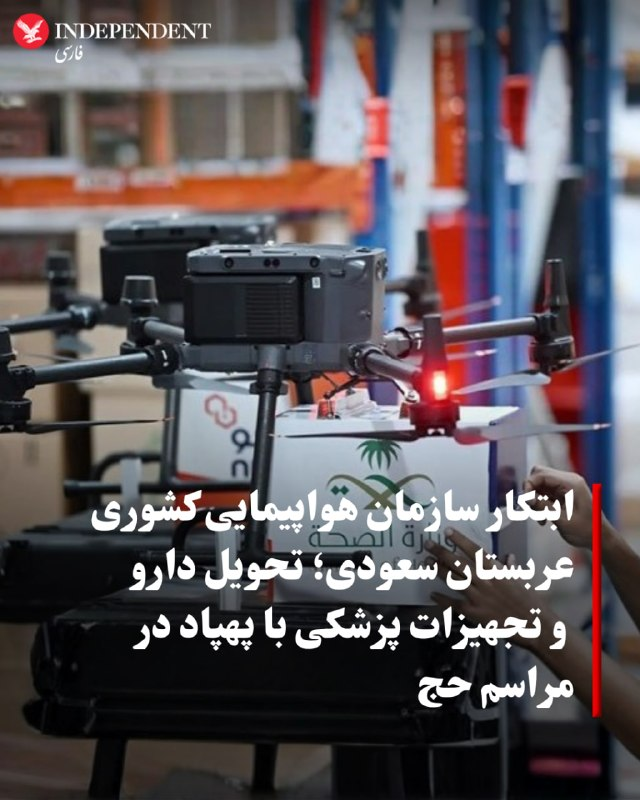

♦️به گزارش گلف‌نیوز، عربستان سعودی به‌طور فزاینده‌ای از هوش مصنوعی و فناوری پهپاد در مراسم حج استفاده می‌کند.
براساس این گزارش، سازمان هواپیمایی کشوری عربستان سعودی نخستین مجوز عملیاتی این کشور را برای تحویل دارو و تجهیزات پزشکی با استفاده از پهپاد در نقاط مختلف مکه در موسم حج ۲۰۲۶ صادر کرد.
این سازمان اعلام کرد این اقدام بخشی از تلاش‌های گسترده‌تر برای گسترش استفاده از فناوری‌های پیشرفته و راهکارهای نوآورانه هوانوردی است؛ راهکارهایی که با هدف افزایش کارایی عملیاتی و تسریع خدمات پزشکی و لجستیکی در جریان حج به کار گرفته می‌شوند.
بر اساس این مجوز، پهپادها اجازه خواهند داشت در چارچوب ضوابط نظارتی و عملیاتی مشخص‌شده و مطابق با استانداردهای ایمنی، کیفیت و بهره‌وری، در محدوده اماکن مقدس فعالیت کنند.
مقام‌های سعودی گفتند این طرح بر پایه عملیات آزمایشی سال گذشته بنا شده است؛ زمانی که پهپادها برای انتقال تجهیزات پزشکی و خدمات لجستیکی در مناطق حج آزمایش شدند.
‌🇸🇦 Indypersian

🤖 @VahidOOnLine

## VahidOOnLine — post 242219

  

در پی یک هفته اعتراضات کارگری در بندر امام و ماهشهر، فرمانداری و مسئولان اداره کار دستور بازگشت به کار بیش از ۶۰ نفر از کارگران اخراجی دو واحد صنعتی در این شهرها را صادر کردند.
ایلنا به نقل از «منابع کارگری» نوشت پس از یک هفته تجمع کارگران در مقابل دفتر شرکت و فرمانداری بندرامام، در جلسه یکشنبه فرماندار و سایر مسئولان شهرستان با حضور مدیرعامل شرکت پتروناد و مدیرکل کار بندر امام «دستوری تنظیم و ابلاغ شد» مبنی بر اینکه کارگران اخراجی «باید ظرف ۲۴ ساعت به کار برگردند.»
همچنین در پی جلسه بررسی مشکلات کارگران قراردادی شرکت پایانه‌ها و مخازن ماهشهر از سوی شورای تامین شهرستان ماهشهر، دستور بازگشت به کار هشت کارگر اخراجی در سریع‌ترین زمان ممکن صادر شد.
این جلسه پس از سه روز اعتراضات صنفی کارگران قراردادی این شرکت برگزار شد.

‌🏁 🇬🇧 IranintlTV

🤖 @VahidOOnLine

## VahidOOnLine — post 242218

  

گروه جهانی بی‌تی‌اس در مراسم امسال جوایز موسیقی آمریکا در لاس‌وگاس، برنده جایزه هنرمند سال شد. این گروه برای کسب عنوان هنرمند سال با هنرمندان مطرحی چون بد بانی، برونو مارس، تیلور سوییفت، هری استایلز، لیدی گاگا، جاستین بیبر، کندریک لامار، مورگان والن و سابرینا کارپنتر رقابت کرد.
این دومین بار است که بی‌تی‌اس این جایزه را دریافت می‌کند. آن‌ها نخستین بار در سال ۲۰۲۱ برنده این جایزه شدند و این اولین باری بود که هنرمندان آسیایی در این مراسم که بر اساس رای هواداران برگزار می‌شود، برنده می‌شد.
اعضای گروه شامل آر‌ام، جین، شوگا، جی‌هوپ، جیمین، وی و جونگ کوک همگی برای دریافت جایزه در مراسم حضور داشتند. آن‌ها به‌تازگی دومین اجرای خود از چهار شب کنسرت پیاپی و کاملا فروخته‌شده در ورزشگاه الیجنت در لاس‌وگاس را به پایان رسانده بودند.
این گروه از هواداران خود که با نام «آرمی» شناخته می‌شوند، قدردانی کرد. آر‌ام در سخنرانی خود به جمعیت تشویق‌کننده گفت: «افتخار بزرگی است که پس از پایان خدمت نظامی همه اعضا، بار دیگر این جایزه ارزشمند را دریافت می‌کنیم.»

‌🏁 🇬🇧 IranintlTV

🤖 @VahidOOnLine

## VahidOOnLine — post 242217

  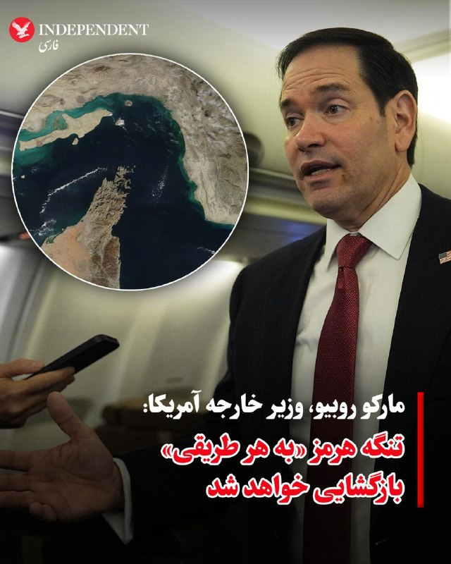

♦️به گزارش خبرگزاری فرانسه، مارکو روبیو، وزیر امور خارجه ایالات متحده، روز سه‌شنبه با تاکید بر بازگشایی تنگه هرمز که در حال حاضر تحت محاصره است، اعلام کرد که این آبراه حیاتی «به هر طریقی» باز خواهد شد. این اظهارات در حالی مطرح می‌شود که درگیری دوشنبه‌شب واشنگتن و تهران، توافق احتمالی برای پایان دادن به جنگ خاورمیانه را در هاله‌ای از ابهام قرار داده است.
روبیو در جریان سفر رسمی خود به شهر جایپور هند، در گفتگو با خبرنگاران گفت: «تنگه باید باز شود؛ این اتفاق به هر طریقی رخ خواهد داد، بنابراین آن باید بازگشایی شود.» او در ادامه افزود: «آنچه در آنجا رخ می‌دهد غیرقانونی، نامشروع و برای جهان غیرقابل تحمل و غیرقابل قبول است.»
‌🇸🇦 Indypersian

🤖 @VahidOOnLine

## VahidOOnLine — post 242216

  

♦️خبرگزاری تسنیم گزارش داد هیات‌رییسه فدراسیون فوتبال روز دوشنبه چهار خرداد، پرداخت ۲۵۰ میلیارد تومان پاداش برای بازیکنان، مربیان و سایر اعضای تیم ملی فوتبال ایران بابت صعود به جام جهانی ۲۰۲۶ را تصویب کرده است.

بر اساس این گزارش، این مبلغ میان تمامی اعضای تیم ملی تقسیم خواهد شد و قرار است از محل مطالبات فدراسیون فوتبال از فیفا تامین شود.

تسنیم نوشت در جلسه هیات‌رییسه، ابتدا رقم بالاتری برای پاداش صعود به جام جهانی مطرح شده بود، اما در نهایت اعضا با پرداخت ۲۵۰ میلیارد تومان موافقت کردند.
‌🇸🇦 Indypersian

🤖 @VahidOOnLine

## VahidOOnLine — post 242215

  

♦️به دنبال افزایش دوباره قیمت لبنیات، قیمت مصوب شیر بطری به ۹۸ هزار تومان و قیمت ماست دبه‌ای (۲ کیلویی) به دست‌کم ۲۲۸ هزار و ۷۰۰ تومان رسیده است. این در حالی است که در فروشگاه‌‌های آنلاین و سوپر‌ها، قیمت لبنیات بسیار بیشتر است. برای مثال شیر پرچرب یک لیتری میهن در فروشگاه‌های آنلاین دست‌کم ۱۳۰ هزار تومان فروخته می‌شود و پنیر نیم کیلویی روزانه ۲۸۳ هزار تومان قیمت دارد.کره ۱۰۰ گرمی دامداران ۹۲ هزار و ۶۰۰ تومان و بستنی وانیلی دومینو (۲ لیتری) ۴۷۵ هزار تومان به فروش می‌رسد. قیمت ماست ۹۰۰ گرمی کاله نیز در فروشگاه‌های آنلاین ۲۴۸ هزار تومان است. افزایش شدید قیمت‌ها به حذف با محدودیت مصرف لبنیات در بین خانوارهای ایرانی منجر شده است که تاثیرات آن بر سلامتی مردم به ویژه کودکان و نوجوانان در سال‌های پیش‌رو نمایان خواهد شد. این در حالی است که گوشت نیز برای بسیار از خانواده‌ها دست نیافتنی شده است.
‌🇸🇦 Indypersian

🤖 @VahidOOnLine

## VahidOOnLine — post 242214

  

مارکو روبیو، وزیر خارجه آمریکا، در واکنش به حمله روز دوشنبه ایالات‌متحده به اهداف ایرانی گفت: «تنگه‌ها باید باز بمانند و به هر شکلی باز خواهند ماند.» او درباره مذاکرات حکومت ایران در قطر گفت چانه‌زنی بر سر متن اولیه توافق ادامه دارد و نهایی‌کردن زبان توافق ممکن است چند روز طول بکشد.
‌🏁 🇬🇧 IranintlTV

🤖 @VahidOOnLine

## VahidOOnLine — post 242213

  <a href="telegram/content/VahidOOnLine_242213_1779770919.mp4" target="_blank">🎬 Download video</a>

♦️امیره حشوی، ملکه زیبایی لبنانی‌تبار اهل دیربورن‌ هایتس ایالت میشیگان که در تاریخ ۱۰ اوت ۲۰۲۵ با کسب عنوان «ملکه زیبایی شهرستان وین» (Miss Wayne County) در ایالت میشیگان، به عنوان نخستین زن محجبه در تاریخ مسابقات سازمان «دوشیزه آمریکا» تاج بر سر گذاشت در رژه صد‌مین سالگرد روز یادبود در شهر دیربورن شرکت کرد. او در این ویدیو تاج ملکه زیبایی را روی روسری گذاشته است. دیربورن یکی از بالاترین تمرکزهای جمعیت عرب‌ و مسلمان در آمریکا را دارد و در برخی برآوردها جمعیت عرب‌تبار این منطقه حدود ۴۰ درصد کل جمعیت برآورد می‌شود. به‌طور کلی ایالت میشیگان نیز یکی از بزرگترین و قدیمی‌ترین جمعیت‌های مسلمان و عرب را در آمریکا دارد.
‌🇸🇦 Indypersian

🤖 @VahidOOnLine

## VahidOOnLine — post 242212

  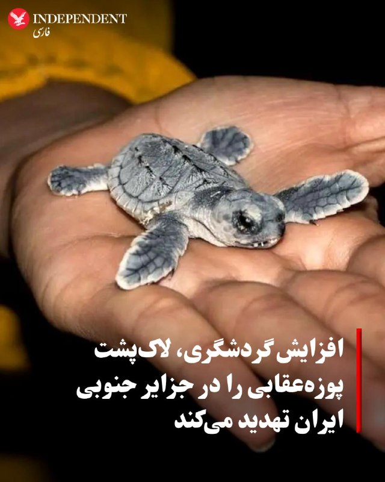

♦️مشاهده‌های میدانی در سواحل بوشهر و هرمزگان نشان می‌دهد افزایش گردشگری و تخریب زیستگاه‌های حساس، به‌ویژه در جزیره هنگام، لاک‌پشت پوزه‌عقابی را که در فهرست گونه‌های «به‌شدت در معرض انقراض» قرار دارد، با تهدیدهای جدی روبه‌رو کرده است.

لاک‌پشت پوزه‌عقابی، از گونه‌های ارزشمند و در حال انقراض دریایی جهان، سواحل جنوبی ایران را به‌عنوان یکی از زیستگاه‌های اصلی تخم‌گذاری و زادآوری انتخاب کرده، اما توسعه بی‌ضابطه گردشگری، تخریب زیستگاه‌ها و آلودگی نوری، چرخه زادآوری این گونه را با خطر روبه‌رو کرده است.
مجید عسگری، مسئول پروژه حفاظت از لاک‌پشت پوزه‌عقابی در بوشهر و هرمزگان، به «همشهری‌آنلاین» گفت روند پایش این گونه در بوشهر از سال ۱۳۹۴ به‌طور مستمر انجام شده، اما در هرمزگان پایش‌ها مقطعی و محدود بوده است.

او با اشاره به نتایج ثبت‌شده در جزیره هنگام گفت تعداد لاک‌پشت‌های ثبت‌شده از ۷۱ مورد در سال ۱۳۹۹ به ۴۳ مورد در سال ۱۴۰۴ کاهش یافته است. به گفته عسگری، افزایش حضور گردشگران در فصل تخم‌گذاری، کمپ‌زدن در سواحل حساس، تخریب زیستگاه‌ها و کاهش نظارت اجرایی از مهم‌ترین دلایل این کاهش است.

عسگری گفت در برخی سال‌ها لاک‌پشت‌ها چندین بار به ساحل بازگشتند، اما به‌دلیل فرسایش سواحل و نبود عمق مناسب شن، موفق به لانه‌سازی و تخم‌گذاری نشدند.

او جزیره شیب‌دراز در قشم را نمونه موفق گردشگری کنترل‌شده دانست و گفت مدیریت متمرکز و مشارکت جامعه محلی باعث شده آسیب کمتری به زیستگاه‌های تخم‌گذاری وارد شود.

به گفته مسئول پروژه حفاظت از لاک‌پشت پوزه‌عقابی، در استان بوشهر روند تخم‌گذاری این گونه در سال‌های اخیر افزایش ملایمی داشته و در سال ۱۴۰۴ حدود ۳۴۷ لاک‌پشت در سواحل این استان ثبت شده‌اند.

عسگری همچنین گفت به‌دلیل محدودیت‌های مالی و اجرایی، پایش مستمر در برخی جزایر هرمزگان از جمله کیش، سیری، ابوموسی و فارور انجام نشده و همین موضوع ارائه آمار دقیق از جمعیت این گونه را دشوار کرده است.

او تاکید کرد حفاظت از سواحل شنی، کنترل گردشگری بی‌ضابطه، کاهش آلودگی نوری و مشارکت جوامع محلی، مهم‌ترین راهکارهای حفظ زیستگاه‌های لاک‌پشت پوزه‌عقابی در سواحل جنوبی ایران است.
‌🇸🇦 Indypersian

🤖 @VahidOOnLine

## VahidOOnLine — post 242211

  

سخنگوی وزارت خارجه قطر گزارش‌ها درباره پیشنهاد دوحه برای آزادسازی ۱۲ میلیارد دلار دارایی‌های تهران در راستای دستیابی به توافق با آمریکا را تکذیب و این ادعاها را تلاشی برای تخریب دیپلماسی کنونی توصیف کرد.
ماجد الانصاری، سخنگوی وزارت خارجه قطر، در ایکس نوشت: «گزارش‌هایی که می‌گویند قطر ۱۲ میلیارد دلار به ایران پیشنهاد داده تا توافقی را تضمین کند، درست نیست.»
او گفت این ادعاها از سوی طرف‌هایی منتشر می‌شود که در پی تضعیف «تلاش‌های دیپلماتیک کنونی برای ثبات و کاهش تنش منطقه‌ای» هستند.
الانصاری افزود نقش میانجی‌گری قطر در کنار شرکای منطقه‌ای «به‌خوبی تثبیت شده و به‌صورت عمومی مستند شده است» و این گزارش‌ها تلاشی برای آسیب زدن به اعتبار دوحه به‌عنوان «تسهیل‌کننده مورد اعتماد بین‌المللی صلح» است.

‌🏁 🇬🇧 IranintlTV

🤖 @VahidOOnLine

## FoxNewsTwitter — post 342256

  <a href="telegram/content/FoxNewsTwitter_342256_1779770922.mp4" target="_blank">🎬 Download video</a>

Fox News (Twitter/X)

At one of America’s most sacred places, Gretchen Wilson delivered a Memorial Day performance that brought the crowd to a standstill.

Wilson sang “God Bless America” during Freedom 250’s ceremony at Arlington National Cemetery, with veterans and military families gathered in tribute.

The emotional performance served as a reminder of the sacrifice behind the holiday.

## FoxNewsTwitter — post 342255

  

Fox News (Twitter/X)

WATCH LIVE: Freedom 250 hosts candlelight Memorial Day observance at Arlington National Cemetery https://twitter.com/i/broadcasts/1oJMvvNNppkxQ

## mamlekate — post 103585

📝 مارکو روبیو درباره مذاکرات با جمهوری اسلامی: امروز گفت‌وگوهایی در قطر جریان داشت

مارکو روبیو، وزیر امورخارجه آمریکا، روز سه‌شنبه در جریان سفر رسمی خود به هند به خبرنگاران گفت: «امروز گفت‌وگوهایی در قطر در جریان بود، بنابراین خواهیم دید که آیا می‌توانیم پیشرفتی داشته باشیم یا خیر.»

📝 واشنگتن در پی فرمولی برای حذف ذخایر اورانیوم ایران بدون انتقال به آمریکا

به گزارش نیویورک پست، مقام‌های آمریکایی در حال بررسی روش‌هایی هستند که ایران بتواند ذخایر اورانیوم با غنای بالا را بدون تحویل مستقیم به واشنگتن از بین ببرد.

📝 چارچوب سه‌مرحله‌ای توافق: بازگشایی هرمز، نابودی اورانیوم، کاهش محاصره و سپس مذاکره بر سر شرایط مذاکره صلح

@mamlekate

## mamlekate — post 103584

📝 سنتکام: به چند سایت پرتاب موشک و قایق در جنوب ایران حمله کردیم

ارتش آمريکا اعلام کرد حملات تازه‌ای را به جنوب ايران انجام داده و سايت‌های موشکی ايران و قايق‌هايی را که «در تلاش برای مين‌گذاری» بودند، هدف قرار داده است.

@mamlekate

## VahidOnline — post 75721

با وجود حملات اخیر آمریکا به سامانه‌های موشکی و قایق‌های ایران در خلیج فارس که وضعیت آتش‌بس شکننده را متزلزل‌تر کرده است،‌ مارکو روبیو، وزیر خارجه آمریکا روز سه‌شنبه گفت که توافق با ایران «همچنان امکان‌پذیر است.»

او در هند به خبرنگاران گفت: «امروز مذاکراتی در قطر در جریان بود،‌ و باید دید آیا می‌توانیم شاهد پیشرفتی باشیم یا خیر. فکر می‌کنم بخش زیادی از زمان صرف دقت در کلمات و واژه‌های به کار گرفته در متن اسناد می‌شود، بنابراین چند روز طول خواهد کشید.»

آقای روبیو افزود: «رئیس‌جمهور تمایل خود را برای انجام این کار ابراز کرده است. او یا به یک توافق خوب دست خواهد یافت یا هیچ توافقی نخواهد کرد.»

آقای روبیو به خبرنگاران گفت که تنگه هرمز باید باز باشد.

او گفت که آنها به هر حال این مسیر را باز خواهند کرد و افزود: «آنچه در آنجا اتفاق میافتد،‌ غیرقانونی است و باعث بی‌ثباتی برای جهان و غیرقابل قبول است.»
@VahidHeadline

📡 @VahidOnline

## VahidOnline — post 75720

  

وزارت خارجه آمریکا اواخر دوشنبه به وقت واشنگتن گفت مارکو روبیو وزیر امور خارجه، به در خواست همتای روس خود سرگئی لاوروف، با او صحبت کرد. در این تماس تلفنی، دو وزیر درباره جنگ روسیه و اوکراین، روابط دوجانبه و اوضاع ایران صحبت کردند.
@VahidHeadline

📡 @VahidOnline

## VahidOnline — post 75719

  

realDonaldTrump

📡 @VahidOnline

## kianmeli1 — post 87670

  

🔴گزارش‌هایی که حاکی از «پیشنهاد» ۱۲ میلیارد دلاری قطر به ایران برای تضمین یک توافق است، به هیچ وجه صحت ندارند و توسط طرف‌هایی منتشر می‌شوند که سعی در تخریب توافق و تضعیف تلاش‌های دیپلماتیک جاری برای کاهش تنش و ثبات منطقه‌ای دارند.

نقش دیپلماتیک قطر، در هماهنگی با شرکای منطقه‌ای، به خوبی تثبیت شده و به طور عمومی مستند شده است و چنین روایت‌هایی چیزی بیش از تلاش‌های ناامیدانه برای خدشه‌دار کردن اعتبار قطر به عنوان یک تسهیل‌کننده صلح بین‌المللی مورد اعتماد نیست.
https://t.me/kianmeli1

## IranIntlTV — post 339022

  <a href="telegram/content/IranIntlTV_339022_1779770926.mp4" target="_blank">🎬 Download video</a>

کنفدراسیون کار ایران، خارج از کشور، در نامه‌ای به اتحادیه‌های کارگری، فدراسیون‌های جهانی و نهادهای مرتبط، خواستار آغاز روند رسمی شکایت علیه جمهوری اسلامی شد.

گفت‌وگو با ​روزبه بوالهری، عضو تحریریه ایران‌اینترنشنال
@iranintltv

## IranIntlTV — post 339021

  

در پی یک هفته اعتراضات کارگری در بندر امام و ماهشهر، فرمانداری و مسئولان اداره کار دستور بازگشت به کار بیش از ۶۰ نفر از کارگران اخراجی دو واحد صنعتی در این شهرها را صادر کردند.
ایلنا به نقل از «منابع کارگری» نوشت پس از یک هفته تجمع کارگران در مقابل دفتر شرکت و فرمانداری بندرامام، در جلسه یکشنبه فرماندار و سایر مسئولان شهرستان با حضور مدیرعامل شرکت پتروناد و مدیرکل کار بندر امام «دستوری تنظیم و ابلاغ شد» مبنی بر اینکه کارگران اخراجی «باید ظرف ۲۴ ساعت به کار برگردند.»
همچنین در پی جلسه بررسی مشکلات کارگران قراردادی شرکت پایانه‌ها و مخازن ماهشهر از سوی شورای تامین شهرستان ماهشهر، دستور بازگشت به کار هشت کارگر اخراجی در سریع‌ترین زمان ممکن صادر شد.
این جلسه پس از سه روز اعتراضات صنفی کارگران قراردادی این شرکت برگزار شد.

https://iranintl.com/202605266338

## IranIntlTV — post 339020

  <a href="telegram/content/IranIntlTV_339020_1779770929.mp4" target="_blank">🎬 Download video</a>

سرخط خبرهای سه‌شنبه ۵ خرداد
@iranintltv

## IranIntlTV — post 339019

  

گروه جهانی بی‌تی‌اس در مراسم امسال جوایز موسیقی آمریکا در لاس‌وگاس، برنده جایزه هنرمند سال شد. این گروه برای کسب عنوان هنرمند سال با هنرمندان مطرحی چون بد بانی، برونو مارس، تیلور سوییفت، هری استایلز، لیدی گاگا، جاستین بیبر، کندریک لامار، مورگان والن و سابرینا کارپنتر رقابت کرد.
این دومین بار است که بی‌تی‌اس این جایزه را دریافت می‌کند. آن‌ها نخستین بار در سال ۲۰۲۱ برنده این جایزه شدند و این اولین باری بود که هنرمندان آسیایی در این مراسم که بر اساس رای هواداران برگزار می‌شود، برنده می‌شد.
اعضای گروه شامل آر‌ام، جین، شوگا، جی‌هوپ، جیمین، وی و جونگ کوک همگی برای دریافت جایزه در مراسم حضور داشتند. آن‌ها به‌تازگی دومین اجرای خود از چهار شب کنسرت پیاپی و کاملا فروخته‌شده در ورزشگاه الیجنت در لاس‌وگاس را به پایان رسانده بودند.
این گروه از هواداران خود که با نام «آرمی» شناخته می‌شوند، قدردانی کرد. آر‌ام در سخنرانی خود به جمعیت تشویق‌کننده گفت: «افتخار بزرگی است که پس از پایان خدمت نظامی همه اعضا، بار دیگر این جایزه ارزشمند را دریافت می‌کنیم.»

https://iranintl.com/202605266357

## IranIntlTV — post 339018

  

مارکو روبیو، وزیر خارجه آمریکا، در واکنش به حمله روز دوشنبه ایالات‌متحده به اهداف ایرانی گفت: «تنگه‌ها باید باز بمانند و به هر شکلی باز خواهند ماند.» او درباره مذاکرات حکومت ایران در قطر گفت چانه‌زنی بر سر متن اولیه توافق ادامه دارد و نهایی‌کردن زبان توافق ممکن است چند روز طول بکشد.
https://iranintl.com/202605261875

## IranIntlTV — post 339017

  

سخنگوی وزارت خارجه قطر گزارش‌ها درباره پیشنهاد دوحه برای آزادسازی ۱۲ میلیارد دلار دارایی‌های تهران در راستای دستیابی به توافق با آمریکا را تکذیب و این ادعاها را تلاشی برای تخریب دیپلماسی کنونی توصیف کرد.
ماجد الانصاری، سخنگوی وزارت خارجه قطر، در ایکس نوشت: «گزارش‌هایی که می‌گویند قطر ۱۲ میلیارد دلار به ایران پیشنهاد داده تا توافقی را تضمین کند، درست نیست.»
او گفت این ادعاها از سوی طرف‌هایی منتشر می‌شود که در پی تضعیف «تلاش‌های دیپلماتیک کنونی برای ثبات و کاهش تنش منطقه‌ای» هستند.
الانصاری افزود نقش میانجی‌گری قطر در کنار شرکای منطقه‌ای «به‌خوبی تثبیت شده و به‌صورت عمومی مستند شده است» و این گزارش‌ها تلاشی برای آسیب زدن به اعتبار دوحه به‌عنوان «تسهیل‌کننده مورد اعتماد بین‌المللی صلح» است.

https://iranintl.com/202605269986

## IranIntlTV — post 339016

  <a href="telegram/content/IranIntlTV_339016_1779770932.mp4" target="_blank">🎬 Download video</a>

یک شهروند در ویدیویی که در شبکه‌های اجتماعی منتشر شده، به وضعیت شغلی خود اشاره کرده و از اقدامات و تصمیمات حکومت انتقاد می‌کند. او می‌گوید: «جمهوری اسلامی دائم از توافق و آتش‌بس سخن می‌گوید، اما درباره تعطیلی کارخانه‌ها حرفی نمی‌زند.»

گزارش‌های منتشر‌شده نشان می‌دهد فشار اقتصادی و ناامنی شغلی شهروندان تشدید شده است.
@iranintltv

## FarsiVOA — post 218671

  

رویترز گزارش داد هم‌زمان با ادامه گفت‌وگوهای ایران و آمریکا در دوحه، حملات تازه نیروهای آمریکا در جنوب ایران امید بازارها به توافق سریع را کاهش داد و باعث نوسان در بازارهای جهانی شد.

بر اساس این گزارش، بهای نفت برنت در معاملات آسیایی بیش از یک درصد افزایش یافت و به ۹۷ دلار و ۳۲ سنت برای هر بشکه رسید. نفت وست‌تگزاس اینترمدیت آمریکا نسبت به آخرین معامله دوشنبه اندکی بالا بود، اما همچنان نسبت به پایان معاملات جمعه ۵.۵ درصد پایین‌تر قرار داشت.

در بازار سهام، شاخص گسترده سهام آسیا-اقیانوسیه خارج از ژاپن ۰.۸ درصد رشد کرد، اما نیکی ژاپن ۰.۲ درصد افت داشت. معاملات آتی نزدک ۰.۹ درصد و اس‌اندپی ۵۰۰ ۰.۶۸ درصد بالا رفتند. در اروپا، یورواستاکس ۰.۳۶ درصد و دکس آلمان ۰.۴۳ درصد افت کردند، اما فوتسی بریتانیا ۰.۴ درصد رشد داشت.

طلای نقدی نیز ۰.۵ درصد کاهش یافت و به ۴۵۴۵ دلار و ۹۰ سنت در هر اونس رسید.
@FarsiVOA

## FarsiVOA — post 218670

🔺مارکو روبیو درباره مذاکرات با جمهوری اسلامی: امروز گفت‌وگوهایی در قطر جریان داشت

▪️مارکو روبیو، وزیر امورخارجه آمریکا، روز سه‌شنبه ۵ خرداد در جریان سفر رسمی خود به هند به خبرنگاران گفت: «امروز گفت‌وگوهایی در قطر در جریان بود، بنابراین خواهیم دید که آیا می‌توانیم پیشرفتی داشته باشیم یا خیر.»

⬇️ بیشتر بخوانید:
https://ir.voanews.com/a/8153982.html
@FarsiVOA

## FarsiVOA — post 218669

  

⚡️وزارت خارجه آمریکا اواخر دوشنبه به وقت واشنگتن گفت مارکو روبیو وزیر امور خارجه، به در خواست همتای روس خود سرگئی لاوروف، با او صحبت کرد. در این تماس تلفنی، دو وزیر درباره جنگ روسیه و اوکراین، روابط دوجانبه و اوضاع ایران صحبت کردند.

@FarsiVOA

## FarsiVOA — post 218668

🔺اسرائيل به بیش از ۷۰ زیرساخت حزب‌الله در لبنان حمله کرد و شماری از اعضای آن را کشت

▪️ارتش اسرائيل روز دوشنبه ۴ خرداد اعلام کرد که در چندین رشته عملیات در سراسر لبنان، بیش از ۷۰ موضع زیرساختی گروه تروریستی حزب‌الله را هدف قرار گرفت.

⬇️ بیشتر بخوانید:
https://ir.voanews.com/a/8153978.html
@FarsiVOA

## FarsiVOA — post 218667

⚡️صدای موافقان و منتقدان کنگره آمریکا در سایه احتمال توافق با جمهوری اسلامی
@FarsiVOA

## FarsiVOA — post 218666

⚡️تنگه هرمز و بحران کمک‌های غذایی و تجارت افغانستان زیر فشار جنگ و گرانی
@FarsiVOA

## FarsiVOA — post 218665

  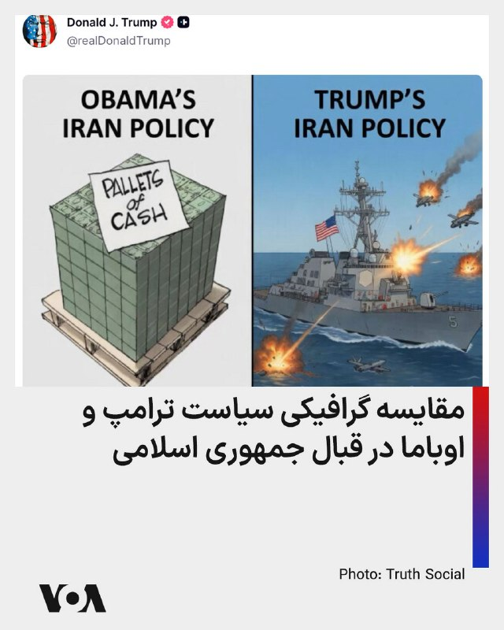

⚡️دونالد ترامپ، رئيس جمهوری آمریکا با انتشار این گرافیک اقدام نظامی خود علیه جمهوری اسلامی را با سیاست باراک اوباما، رئیس جمهوری سابق آمریکا مقایسه کرد که در این تصویر فرستادن پول نقد است.
@FarsiVOA

## FarsiVOA — post 218664

⚡️آخرین تحولات عراق؛ بغداد اعضای بازداشت‌شده داعش با تابعیت ترکیه را به آنکارا تحویل می‌دهد
@FarsiVOA

## FarsiVOA — post 218663

⚡️کارزار سرکوب در سایه قطع اینترنت در ایران؛ هر ۴۸ ساعت یک چوبه دار
@FarsiVOA

## FarsiVOA — post 218662

⚡️نگاهی به جهان‌بینی کریستیان مونجیو، فیلمساز رومانیایی که با فیورد در کن ۲۰۲۶ برای دومین بارپس از نخل تاریخی چهار ماه، سه هفته و دو روز در سال ۲۰۰۷، نخل طلا گرفت
@FarsiVOA

## FarsiVOA — post 218661

⚡️آیا ابولا می‌تواند به آمریکا برسد؟ مقام‌های بهداشتی می‌گویند خطر فعلاً پایین است، اما غربالگری مسافران در برخی فرودگاه‌ها گسترش یافته است. کارشناسان هشدار می‌دهند که ضعف در کنترل بیماری‌ها در هر نقطه از جهان می‌تواند پیامدهای جهانی داشته باشد.
@FarsiVOA

## Persian_Trend_Official — post 15027

  

⭕️پست جدید دونالد ترامپ

پ ن: آیا هنوز عقیده دارید ترامپ پولی به جمهوری اسلامی پرداخت خواهد داد؟

🫆:Tony

📌 @persian_trend_official
پرشین ترند | متفاوت‌ترین کانال نظامی

## Persian_Trend_Official — post 15026

  <a href="telegram/content/Persian_Trend_Official_15026_1779770934.webm" target="_blank">🎬 Download video</a>

🔴 مقام آمریکایی: حملات در ایران «دفاعی» بوده است

▪️ یک مقام آمریکایی اعلام کرده حملات اخیر در ایران جنبه دفاعی داشته و به معنای پایان آتش‌بس نیست
▪️ به گفته او، یک سایت سام (پدافند موشکی زمین به هوا) در بندرعباس هدف قرار گرفته است
▪️ این مقام مدعی شده این اقدام پس از تهدید یا هدف قرار گرفتن جنگنده‌های آمریکایی انجام شده است

▪️ تاکنون هیچ تأیید مستقلی از سوی ایران درباره این ادعاها منتشر نشده است
▪️ وضعیت منطقه همچنان در سطح بالای تنش و ابهام قرار دارد

🫆:Tony

📌 @persian_trend_official
پرشین ترند | متفاوت‌ترین کانال نظامی

## Persian_Trend_Official — post 15025

  

⭕️روبیو به ارمنستان می رود

▪️سفارت آمریکا در ایروان اعلام کرد که مارکو روبیو روز سه‌شنبه برای دیدارهایی با محوریت دیپلماسی و روابط دوجانبه به ارمنستان سفر خواهد کرد.

🫆:Tony

📌 @persian_trend_official
پرشین ترند | متفاوت‌ترین کانال نظامی

## RadioFarda — post 157555

  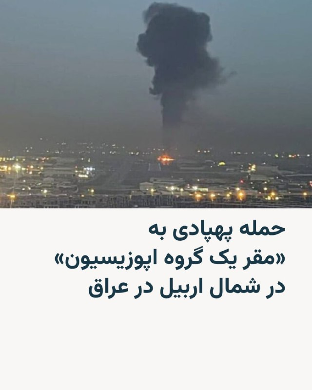

🔸ساعتی پس از خبر خبرگزاری سپاه پاسداران درباره حمله پهپادی به نقطه‌ای در نزدیکی اربیل، خبرگزاری رویترز تأیید کرد که «مقر یک گروه اپوزیسیون» جمهوری اسلامی در شمال اربیل در کردستان عراق هدف قرار گرفته است.

🔸به نوشته رویترز به نقل از «منابع امنیتی»، این حمله راکتی بوده و دو عضو این گروه را زخمی کرده است.

🔸خبرگزاری تسنیم وابسته به سپاه پاسداران نوشته است که این حمله به «مراکز تسلیحاتی گروهک تجزیه‌طلب» در اربیل انجام شده است.

🔸در ادبیات مقامات جمهوری اسلامی، «گروهک تجزیه‌طلب» اشاره به گروه‌های کرد مخالف حکومت ایران دارد.

@RadioFarda

## RadioFarda — post 157554

  <a href="https://t.me/radiofarda/157554" target="_blank">📎 Download file</a>

📻بشنوید: سرخط خبرها با رادیوفردا، پنجم خرداد ۱۴۰۵‌

@RadioFarda

## BBCPersian — post 282064

  

‌
با وجود حملات اخیر آمریکا به سامانه‌های موشکی و قایق‌های ایران در خلیج فارس که وضعیت آتش‌بس شکننده را متزلزل‌تر کرده است،‌ مارکو روبیو، وزیر خارجه آمریکا روز سه‌شنبه گفت که توافق با ایران «همچنان امکان‌پذیر است.»

او در هند به
خبرنگاران گفت: «امروز مذاکراتی در قطر در جریان بود،‌ و باید دید آیا می‌توانیم شاهد پیشرفتی باشیم یا خیر. فکر می‌کنم بخش زیادی از زمان صرف دقت در کلمات و واژه‌های به کار گرفته در متن اسناد می‌شود، بنابراین چند روز طول خواهد کشید.»

آقای روبیو افزود: «رئیس‌جمهور تمایل خود را برای انجام این کار ابراز کرده است. او یا به یک توافق خوب دست خواهد یافت یا هیچ توافقی نخواهد کرد.»

آقای روبیو به خبرنگاران گفت که تنگه هرمز باید باز باشد.

او گفت که آنها به هر حال این مسیر را باز خواهند کرد و افزود: «آنچه در آنجا اتفاق میافتد،‌ غیرقانونی است و باعث بی‌ثباتی برای جهان و غیرقابل قبول است.»

از سوی دیگر، دونالد ترامپ هم در شبکه اجتماعی خود، با انتشار دو تصویر گرافیکی کنار هم، بار دیگر تلاش کرد از توافق دولت اوباما با ایران انتقاد کند.

📷 AFP via Getty Images
https://bbc.in/4wQu3Oj
@BBCPersian

## BBCPersian — post 282063

با وجود تاکید دونالد ترامپ بر پیوستن عربستان و قطر به پیمان ابراهیم و برقراری روابط علنی و رسمی با اسرائیل در صورت توافق میان ایران و آمریکا، يک منبع سعودی به سی‌ان‌ان و چند رسانه دیگر گفته است «عربستان سعودی تنها زمانی روابط خود با اسرائيل را عادی سازی خواهد کرد که «مسيری غيرقابل بازگشت» برای تشکيل کشور فلسطينی ايجاد شود.»

این درخواست ریاض در چند سال گذشته مانع اصلی برقراری روابط علنی میان عربستان و اسرائیل بوده است.

روز دوشنبه همچنین گزارش شد که پاکستان هم از تلاش ترغیب‌کننده دونالد ترامپ برای عادی سازی روابط با اسرائیل «استقبال نکرده است».

https://bbc.in/4wQu3Oj
@BBCPersian

## BBCPersian — post 282056

‌
لانا پانتینگ ناخواسته به یکی از افراد شرکت‌کننده در آزمایش‌های محرمانه سیا موسوم به «ام‌کی-اولترا» تبدیل شد. این پروژه در جریان جنگ سرد، تاثیر مواد روان‌گردانی مانند ال‌اس‌دی، شوک الکتریکی و روش‌های شست‌وشوی مغزی را بر انسان‌ها، بدون رضایت آن‌ها، آزمایش می‌کرد.

بیش از ۱۰۰ موسسه، از جمله چندین بیمارستان، زندان و مدرسه در آمریکا و کانادا، در این برنامه دخیل بودند.

واقعیت تلخ مربوط به آزمایش‌های ام‌کی-اولترا در دهه ۱۹۷۰ برملا شد. از آن زمان، شماری از قربانیان تلاش کرده‌اند علیه دولت‌های آمریکا و کانادا طرح دعوی کنند. در آمریکا این پرونده‌ها بیشتر بی‌نتیجه مانده است، اما در سال ۱۹۸۸ دادگاهی در کانادا حکم داد دولت آمریکا به هر یک از ۹ قربانی ۶۷ هزار دلار بپردازد.

خانم پانتینگ می‌گوید نامش در میان دریافت‌کنندگان غرامت نبود چون آن موقع هنوز از قربانی بودن خود خبر نداشت.

📷Getty images/ SUBMITTED PHOTO

از لینک ⬇️ این مطلب را در سایت بی‌بی‌سی فارسی بخوانید.

https://bbc.in/3PCXt1K
@BBCPersian

## BBCPersian — post 282055

‌ توماج صالحی، یکی از سرشناس‌ترین رپرهای ایرانی که خود چند بار به زندان افتاده و حتی با حکم اعدام روبرو شده بود،‌ صدور حکم اعدام برای چهارتن از متهمان پرونده اکباتان را «ناعادلانه» و «ضدبشری» خواند و گفت: «شرافت ما حکم می‌کند در مقابل این بی‌عدالتی بایستیم.»…

## BBCPersian — post 282054

  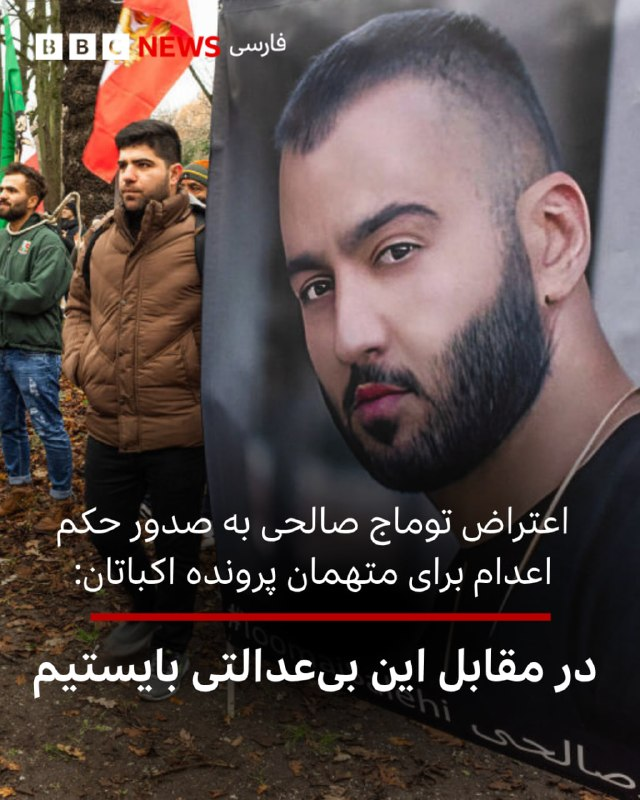

‌
توماج صالحی، یکی از سرشناس‌ترین رپرهای ایرانی که خود چند بار به زندان افتاده و حتی با حکم اعدام روبرو شده بود،‌ صدور حکم اعدام برای چهارتن از متهمان پرونده اکباتان را «ناعادلانه» و «ضدبشری» خواند و گفت: «شرافت ما حکم می‌کند در مقابل این بی‌عدالتی بایستیم.»

آقای صالحی پس از ماه‌ها سکوت در شبکه اجتماعی ایکس نوشت: «این متن را در حالی می‌نویسم که ماه‌هاست آزادی ‌بیان و آزادی رسانه «گرچه هرگز نداشته‌ایم» به بهانه‌ جنگ، به شدید‌ترین شکل ممکن سرکوب شده، و فقر نیز از زمین و آسمان بر سر مردم می‌بارد.»

او در یادداشت خود به جنبش اعتراضی سال ۱۴۰۱،‌ اشاره کرد و نوشت: «جنبش باشکوه و سربلند «زن زندگی آزادی» برای عدالت، آزادی و کرامت انسانی جنگید. حالا هنوز هم بازماندگانی از این جنبش در زندان هستند و چهار نفر از آنها به حکمِ ناعادلانه و ضدبشری اعدام محکوم شده‌اند.»

📷LightRocket via Getty Images
@BBCPersian

⬇️ادامه خبر

## BBCPersian — post 282053

  

‌
فرماندهی مرکزی نیروهای آمریکا - سنتکام - در بیانیه‌ای اعلام کرده است: «نيروهای آمريکا امروز (دوشنبه) در جنوب ايران حملات دفاعی از خود انجام دادند تا از نيروهای ما در برابر تهديدهای نيروهای ايرانی محافظت شود»

در بیانیه سنتکام آمده: «اهداف اين حملات شامل سايت های پرتاب موشک و قايق های ايرانی بود که تلاش می‌کردند مين‌گذاری کنند. فرماندهی مرکزی آمريکا ضمن خويشتن‌داری در طول آتش‌بس جاری، همچنان به دفاع از نيروهای خود ادامه می‌دهد.»

ایران هنوز واکنشی رسمی به این گزارش نشان نداده است، اما برخی از سایت‌های ایرانی از هدف قرار گرفتن دو قایق تندرو سپاه در نزدیکی سواحل خلیج فارس و کشته شدن چند نفر از سرنشینان این قایق‌ها خبر دادند.

نیمه شب دوشنبه به وقت ایران،‌ برخی از ساکنان بندرعباس و شهرهای حاشیه خلیج فارس، از شنیده شدن چند انفجار و فعالیت پدافند ضدهوایی خبر داده بودند.

رسانه‌های رسمی هم این گزارش‌ها را تایید کردند اما اعلام کرده بودند که علت این انفجارها مشخص نیست.

📷 the U.S. Navy via Getty Images

https://bbc.in/4wQu3Oj
@BBCPersian

## alonews — post 122702

  <a href="telegram/content/alonews_122702_1779770938.webm" target="_blank">🎬 Download video</a>

👈وزیر امور خارجه آمریکا: ایالات متحده تلاش می‌کند از طریق مذاکره به جنگ پایان دهد

✅ @AloNews خبر جنگ

## alonews — post 122701

  <a href="telegram/content/alonews_122701_1779770938.webm" target="_blank">🎬 Download video</a>

👈رویترز به نقل از وزیر امور خارجه آمریکا: تدوین مفاد توافق با ایران ممکن است چند روز طول بکشد/ فکر می‌کنم در مورد عبارات خاص در سند اولیه، بحث‌های زیادی وجود دارد

روبیو، در مورد حملات اخیر آمریکا اظهار داشت:

🔴تنگه‌ها باید باز بمانند و به هر حال باز خواهند ماند.

🔴دیروز برخی مذاکرات در قطر انجام شد.

✅ @AloNews خبر جنگ

## alonews — post 122700

  <a href="telegram/content/alonews_122700_1779770938.webm" target="_blank">🎬 Download video</a>

👈آمریکا حملات جدیدش در جنوب ایران را تایید کرد فاکس نیوز به نقل از سخنگوی فرماندهی مرکزی ایالات متحده مدعی شد: 
🔴ما روز دوشنبه حملاتی را در جنوب ایران برای دفاع از خود انجام دادیم. 
🔴این حملات، سکوهای پرتاب موشک و قایق‌هایی را که سعی در مین‌گذاری داشتند، هدف…

## alonews — post 122699

  <a href="telegram/content/alonews_122699_1779770938.webm" target="_blank">🎬 Download video</a>

👈آمریکا حملات جدیدش در جنوب ایران را تایید کرد

فاکس نیوز به نقل از سخنگوی فرماندهی مرکزی ایالات متحده مدعی شد:

🔴ما روز دوشنبه حملاتی را در جنوب ایران برای دفاع از خود انجام دادیم.

🔴این حملات، سکوهای پرتاب موشک و قایق‌هایی را که سعی در مین‌گذاری داشتند، هدف قرار داد.

🔴ما در طول آتش‌بس با خویشتن‌داری به دفاع از نیروهای خود ادامه می‌دهیم.

✅ @AloNews خبر جنگ

---
📅 بروزرسانی: 1405/03/05 03:41
---

## VahidOOnLine — post 242202

بعضی خانه‌ها بعد از ۱۸ و ۱۹ دی دیگر شبیه قبل نشدند.
یک صندلی خالی ماند، یک تلفن دیگر جواب داده نشد و خانواده‌هایی ماندند با تصویری که آخرین‌بار از عزیزشان دیده بودند.<
میلاد حاجیوند عبداللهی، ساسان کشوری، محمد رفیعی، بنیامین علیزاده، امید احمدی، احمدرضا خیری‌زاد، فاطمه علی‌محمدی و سعید صادقی حسنوند؛
جوانانی با زندگی‌های معمولی، با کار، دانشگاه، ورزش، عشق و هزار برنامه برای ادامه راه.<
اما خیابان‌های آن روزها، برای بسیاری به آخر زندگی تبدیل شد؛ با گلوله جنگی، خونریزی، ضرب‌وجرح و پیکرهایی که بعضی خانواده‌ها با تهدید و فشار تحویل گرفتند.<
این روایت‌ها کوتاه نوشته می‌شوند تا نام‌ها در حافظه‌مان بماند و فراموش نشود چه بر جوانان ایران گذشت.<
#جاویدنامان_انقلاب_ملی_ایرانیان
‌🏁 🇬🇧 IranintlTV

🤖 @VahidOOnLine

## VahidOOnLine — post 242201

♦️موسسه آتشفشان‌شناسی و لرزه‌نگاری فیلیپین اعلام کرد یک شهاب‌سنگ دوشنبه‌شب چهارم خرداد، هم‌زمان با فوران آتشفشان «مایون» در استان آلبای فیلیپین از کنار این آتشفشان عبور کرده و آسمان منطقه را روشن کرده است.

ویدیوی منتشرشده از سوی این موسسه نشان می‌دهد شی نورانی در حالی از نزدیکی آتشفشان مایون، یکی از فعال‌ترین آتشفشان‌های فیلیپین، عبور می‌کند.
بر اساس این گزارش، این رویداد ساعت ۲۲:۳۳ به وقت محلی ثبت شده و دوربین «لیگنون هیل» آن را ضبط کرده است.

این موسسه ابتدا اعلام کرده بود شهاب‌سنگ به دامنه شمالی آتشفشان برخورد کرده، اما بعدتر با استناد به داده‌های لرزه‌ای، امواج فروصوت و تصاویر دوربین‌های دیگر، توضیح داد این جرم هنگام ورود به جو متلاشی شده و به آتشفشان برخورد نکرده است.
‌🇸🇦 Indypersian

🤖 @VahidOOnLine

## VahidOOnLine — post 242200

  

♦️ شبکه فاکس‌نیوز به نقل از سخنگوی فرماندهی مرکزی ایالات متحده (سنتکام) گزارش داد نیروهای نظامی آمریکا «در دفاع از خود در جنوب ایران» به اهدافی حمله کرده‌اند.
این سخنگو توضیح داد که اهداف مورد حمله شامل محل‌های پرتاب موشک و قایق‌هایی بوده‌اند که تلاش می‌کردند مین‌گذاری کنند. در این بیانیه آمده است: ارتش ایالات متحده از نیروهای آمریکایی «در حالی که در جریان آتش‌بس جاری خویشتن‌داری نشان می‌دهند» دفاع خواهد کرد.
پیش‌تر، خبرگزاری مهر از وقوع انفجارهایی در بندری بندرعباس خبر داده بود. صدای انفجار و فعالیت پدافند در اصفهان، بابل و اندیمشک هم شنیده شده است.
‌🇸🇦 Indypersian

🤖 @VahidOOnLine

## VahidOOnLine — post 242199

  

♦️ماجد محمد الانصاری، مشاور نخست‌وزیر و سخنگوی وزارت خارجه قطر در پیامی در اکس نوشت: «گزارش‌هایی که ادعا می‌کنند قطر برای دستیابی به توافق، «پیشنهاد» ۱۲ میلیارد دلار به ایران داده، کاملا نادرست است و از سوی طرف‌هایی منتشر می‌شود که در تلاش‌اند توافق را تخریب کرده و تلاش‌های دیپلماتیک جاری برای کاهش تنش و ثبات منطقه‌ای را تضعیف کنند.
نقش دیپلماتیک قطر، در هماهنگی با شرکای منطقه‌ای، کاملا شناخته‌شده و به‌طور عمومی مستند است و این روایت‌ها چیزی جز تلاش‌ برای خدشه‌دار کردن اعتبار قطر به‌عنوان یک میانجی مورد اعتماد بین‌المللی برای صلح نیست.» این در حالی است که محمد مرندی که در مذاکرات اخیر هیات مذاکره‌کننده جمهوری اسلامی با آمریکا در اسلام آباد حضور داشت، می‌گوید که قطر پذیرفته قبل از نهایی شدن توافق، شش میلیارد دلار پول به جمهوری اسلامی بدهد.
‌🇸🇦 Indypersian

🤖 @VahidOOnLine

## VahidOOnLine — post 242198

  

♦️صابرین‌نیوز، کانال تلگرامی مشترک سپاه قدس و حشدالشعبی عراق، بامداد سه‌شنبه، از شنیده‌شدن صداهای انفجار و فعال شدن پدافند در اندیمشک، اصفهان، قم و بابلسر خبر داد. پیش از این نیز گزارش‌هایی از وقوع سه انفجار در بندرعباس و هدف قرار گرفتن فرودگاه این شهر و نیز شنیده شدن چند انفجار در حوالی سیریک و جاسک منتشر شده بود. به گزارش خبرگزاری دانشجو، چهار نیروی سپاه پاسداران در حمله جنگنده‌های آمریکا در جنوب جزیره لارک کشته شدند. انفجارها و حمله‌ها در جنوب ایران طی روزهای گذشته و در طول آتش‌بس به تکرار اتفاق افتاده است.
‌🇸🇦 Indypersian

🤖 @VahidOOnLine

## VahidOOnLine — post 242197

  

فاکس‌نیوز به نقل از سخنگوی ستاد فرماندهی مرکزی آمریکا، سنتکام، گزارش داد نیروهای آمریکا روز دوشنبه در جنوب ایران به اهدافی از جمله محل‌های پرتاب موشک و قایق‌های ایرانی که در تلاش برای مین‌گذاری بودند، حمله کردند.
‌🏁 🇬🇧 IranintlTV

🤖 @VahidOOnLine

## VahidOOnLine — post 242196

  <a href="telegram/content/VahidOOnLine_242196_1779754285.mp4" target="_blank">🎬 Download video</a>

♦️محمد مرندی، عضو سابق تیم مذاکره‌کننده هسته‌ای که در گفتگوهای اخیر در اسلام‌آباد حضور داشت، دوشنبه‌شب چهارم خرداد‌ماه، در گفتکو با صدا و سیما مدعی شد قطر پذیرفته است دارایی‌های مسدودشده جمهوری اسلامی را که حدود شش میلیارد دلار برآورد می‌شود، پیش از نهایی شدن توافق در اختیار تهران قرار دهد و سپس معادل این مبلغ را از آمریکا دریافت کند.
‌🇸🇦 Indypersian

🤖 @VahidOOnLine

## VahidOOnLine — post 242195

  

خبرگزاری دانشجو از حمله آمریکا و اسرائیل به جنوب جزیره لارک در سحرگاه گذشته به وقت محلی خبر داد. این گزارش به نقل از منابع محلی نوشت نام‌های سه نفر از کشته‌شدگان عباس اسلامی، قدرت زرنگاری و عبدالرضا گلزاری است، اما تعداد کشته‌شدگان هنوز مشخص نیست.
‌🏁 🇬🇧 IranintlTV

🤖 @VahidOOnLine

## WithYashar — post 12508

سخنگوی وزارت خارجه قطر:
اینکه گفتن قطر 12 میلیارد دلار از پول‌های بلوکه شده ایران رو قراره پرداخت کنه کاملا کذبه و از این خبرا نیست!
@withyashar

## WithYashar — post 12507

سخنگوی سنتکام به فاکس نیوز : نیرو های آمریکایی در جنوب ایران حملات دفاعی انجام دادند تا از نیرو های خود در برابر تهدیدات نیرو های ایرانی محافظت کنند. اهداف شامل سایت‌ های پرتاب موشک و قایق‌ های ایرانی بودند که در تلاش برای کاشت مین بودند فرماندهی مرکزی…

## WithYashar — post 12506

سخنگوی سنتکام به فاکس نیوز :

نیرو های آمریکایی در جنوب ایران حملات دفاعی انجام دادند تا از نیرو های خود در برابر تهدیدات نیرو های ایرانی محافظت کنند. اهداف شامل سایت‌ های پرتاب موشک و قایق‌ های ایرانی بودند که در تلاش برای کاشت مین بودند
فرماندهی مرکزی آمریکا همچنان از نیرو های خود دفاع میکند و در عین حال در طول آتش‌ بس جاری ، خویشتن‌ داری به خرج میدهد
@withyashar

## WithYashar — post 12505

نفت ۹۷$
@withyashar

## WithYashar — post 12504

خبرگزاری اتاق جنگ : کار کانفیگ فروشا بود نت وصل نشه 🤣
@withyashar

## WithYashar — post 12503

ارتباط زنده صدا و سیما همین الان

## mwarmonitor — post 9728

  <a href="telegram/content/mwarmonitor_9728_1779754286.mp4" target="_blank">🎬 Download video</a>

📝 جذابیت سیاست مدرن به همینه؛ شما می‌تونی کل حیاط پشتی همسایه رو شخم بزنی، زیربنای نظامی‌ش رو بفرستی هوا، بعد دستت رو بزنی به کمرت و بگی: «سوءتفاهم نشه، این فقط یک حرکت کاملاً دفاعی و دوستانه در راستای تحکیم پایه‌های صلح پایدار بود!» طبق استاندارد جدید دیپلماتیک،…

## mwarmonitor — post 9727

🚨جزئیات بیشتر درباره حملات آمریکا علیه اهداف ایرانی امروز: خبرنگار فاکس نیوز 🚨یک مقام ارشد آمریکایی به من گفته است که دو قایق ایرانی در حال کارگذاری مین در تنگه هرمز شناسایی شدند. ارتش آمریکا هر دو شناور متعلق به نیروی دریایی سپاه (IRGC) را منهدم کرد و همچنین…

## mwarmonitor — post 9726

🔴سخنگوی سنتکام، کاپیتان تیم هاوکینز به فاکس گفت: 🔴«نیروهای آمریکایی امروز در جنوب ایران حملات دفاع از خود انجام دادند تا از نیروهای ما در برابر تهدیدهای ناشی از نیروهای ایرانی محافظت کنند. اهداف شامل سایت‌های پرتاب موشک و قایق‌های ایرانی بود که در حال تلاش…

## mwarmonitor — post 9725

🚨«درگیری‌هایی میان نیروی دریایی ایران و نیروهای آمریکایی رخ داده که در نتیجه آن تعدادی کشته شده‌اند، که عبارتند از: پاسدار عباس اسلامی پاسدار قدرت زرنگاری پاسدار عبدالرضا گلزاری پاسدار حسین ستوده» @mwarmonitor

## FoxNewsTwitter — post 342254

  

Fox News (Twitter/X)

WATCH LIVE: Sen. Bernie Sanders headlines campaign rally in Portland, Maine https://twitter.com/i/broadcasts/1AGRnnZnRkXGl

## FoxNewsTwitter — post 342253

  <a href="telegram/content/FoxNewsTwitter_342253_1779754288.mp4" target="_blank">🎬 Download video</a>

Fox News (Twitter/X)

FOX NEWS REPORT: Pope Leo is calling for robust regulations on artificial intelligence, warning the technology "hurts humanity." @BillMelugin_ reports.

## pm_afshaa — post 91512

  <a href="telegram/content/pm_afshaa_91512_1779754290.webm" target="_blank">🎬 Download video</a>

🔴الجزیره به نقل از یک مقام آمریکایی: ایران طی 24 ساعت گذشته تلاش کرد به نیروهای آمریکایی حمله کنه. 
💧 Rainbet.com the #1 Non-KYC Crypto Casino & Sportsbook @rainbetcom 
😁 @Pm_Afshaa

## pm_afshaa — post 91511

  <a href="telegram/content/pm_afshaa_91511_1779754290.webm" target="_blank">🎬 Download video</a>

🔴الجزیره به نقل از یک مقام آمریکایی:
ایران طی 24 ساعت گذشته تلاش کرد به نیروهای آمریکایی حمله کنه.

💧 Rainbet.com the #1 Non-KYC Crypto Casino & Sportsbook @rainbetcom

😁 @Pm_Afshaa

## pm_afshaa — post 91510

  <a href="telegram/content/pm_afshaa_91510_1779754291.webm" target="_blank">🎬 Download video</a>

🔴فوری از سنتکام: نیروهای ایالات متحده امروز حملات دفاعی خود را در جنوب ایران انجام دادن تا از نیروهای ما در برابر تهدیدات ناشی از نیروهای ایرانی محافظت کنند. اهداف شامل سایت‌های پرتاب موشک و قایق‌های ایرانی در تلاش برای استقرار مین بودن. فرماندهی مرکزی ایالت…

## pm_afshaa — post 91509

🔴فوری از سنتکام: نیروهای ایالات متحده امروز حملات دفاعی خود را در جنوب ایران انجام دادن تا از نیروهای ما در برابر تهدیدات ناشی از نیروهای ایرانی محافظت کنند. اهداف شامل سایت‌های پرتاب موشک و قایق‌های ایرانی در تلاش برای استقرار مین بودن. فرماندهی مرکزی ایالت…

## pm_afshaa — post 91508

🔴فوری از سنتکام: نیروهای ایالات متحده امروز حملات دفاعی خود را در جنوب ایران انجام دادن تا از نیروهای ما در برابر تهدیدات ناشی از نیروهای ایرانی محافظت کنند.

اهداف شامل سایت‌های پرتاب موشک و قایق‌های ایرانی در تلاش برای استقرار مین بودن. فرماندهی مرکزی ایالت متحده آمریکا همچنان به دفاع از نیروهای ما در حین حرکت ادامه می‌دهد.

💧 Rainbet.com the #1 Non-KYC Crypto Casino & Sportsbook @rainbetcom

😁 @Pm_Afshaa

## pm_afshaa — post 91507

  <a href="telegram/content/pm_afshaa_91507_1779754291.webm" target="_blank">🎬 Download video</a>

🔴سخنگوی وزارت خارجه قطر:
اینکه گفتن قطر 12 میلیارد دلار از پول‌های بلوکه شده ایران رو قراره پرداخت کنه کاملا کذبه و از این خبرا نیست!

💧 Rainbet.com the #1 Non-KYC Crypto Casino & Sportsbook @rainbetcom

😁 @Pm_Afshaa

## VahidOnline — post 75718

  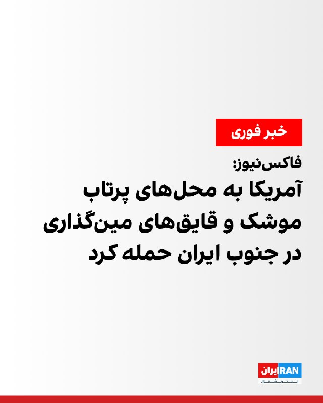

فاکس‌نیوز به نقل از سخنگوی ستاد فرماندهی مرکزی آمریکا، سنتکام، گزارش داد نیروهای آمریکا روز دوشنبه در جنوب ایران به اهدافی از جمله محل‌های پرتاب موشک و قایق‌های ایرانی که در تلاش برای مین‌گذاری بودند، حمله کردند.
@VahidOOnLine

📡 @VahidOnline

## kianmeli1 — post 87669

🔴سخنگوی سنتکام به فاکس نیوز:

نیروهای آمریکایی امروز برای محافظت از نیروهای خود در برابر تهدیدات نیروهای ایرانی، حملات دفاع از خود را در جنوب ایران انجام دادند.

اهداف شامل سایت‌های پرتاب موشک و قایق‌های ایرانی بود که سعی در مین‌گذاری داشتند.

فرماندهی مرکزی ایالات متحده همچنان در طول آتش‌بس جاری، ضمن خویشتن‌داری، از نیروهای خود دفاع می‌کند.
https://t.me/kianmeli1

## IranIntlTV — post 339007

بعضی خانه‌ها بعد از ۱۸ و ۱۹ دی دیگر شبیه قبل نشدند.
یک صندلی خالی ماند، یک تلفن دیگر جواب داده نشد و خانواده‌هایی ماندند با تصویری که آخرین‌بار از عزیزشان دیده بودند.
میلاد حاجیوند عبداللهی، ساسان کشوری، محمد رفیعی، بنیامین علیزاده، امید احمدی، احمدرضا خیری‌زاد، فاطمه علی‌محمدی و سعید صادقی حسنوند؛
جوانانی با زندگی‌های معمولی، با کار، دانشگاه، ورزش، عشق و هزار برنامه برای ادامه راه.
اما خیابان‌های آن روزها، برای بسیاری به آخر زندگی تبدیل شد؛ با گلوله جنگی، خونریزی، ضرب‌وجرح و پیکرهایی که بعضی خانواده‌ها با تهدید و فشار تحویل گرفتند.
این روایت‌ها کوتاه نوشته می‌شوند تا نام‌ها در حافظه‌مان بماند و فراموش نشود چه بر جوانان ایران گذشت.
#جاویدنامان_انقلاب_ملی_ایرانیان

## IranIntlTV — post 339006

  <a href="telegram/content/IranIntlTV_339006_1779754292.mp4" target="_blank">🎬 Download video</a>

صداوسیما در روزهای اخیر تصاویری پخش کرده که در آن، مجری‌ها مقابل دوربین اسلحه به دست گرفته‌اند، دربارهٔ تیراندازی حرف می‌زنند و حتی شلیک هم می‌کنند؛ تصاویری که در هر رسانهٔ جریان اصلی، به‌شدت حساس و محدود تلقی می‌شود.

نمایش و آموزش استفاده از سلاح در قالب برنامه‌های تلویزیونی، بخشی از روندی است که خشونت را به امری عادی و روزمره تبدیل می‌کند.

تجربهٔ بسیاری از کشورها نشان داده حکومت‌هایی که خشونت را وارد زبان و تصویر رسانه می‌کنند، در نهایت جامعه را به سمت ترس، افراطی‌گری و بحران بیشتر سوق می‌دهند.

کامبیز حسینی در «برنامه» به این موضوع می‌پردازد.

«یک ایران صدای شما را می‌شنود»
دوشنبه تا پنجشنبه ۱۱ شب تهران
از تلویزیون ایران اینترنشنال

تماشای نسخه کامل این قسمت از «برنامه» در یوتیوب:
https://youtu.be/eYsI3zfbVKA
@iranintltv

## IranIntlTV — post 339005

  <a href="telegram/content/IranIntlTV_339005_1779754294.mp4" target="_blank">🎬 Download video</a>

دانیال از آلمان: ما ایرانی‌ها تازه همدیگر را پیدا کرده‌ایم

«یک ایران صدای شما را می‌شنود»
دوشنبه تا پنجشنبه ۱۱ شب تهران
از تلویزیون ایران اینترنشنال

تماشای نسخه کامل این قسمت از «برنامه» در یوتیوب:
https://youtu.be/eYsI3zfbVKA
@iranintltv

## IranIntlTV — post 339004

  <a href="telegram/content/IranIntlTV_339004_1779754296.mp4" target="_blank">🎬 Download video</a>

محمد محمدی گلپایگانی، رییس دفتر علی خامنه‌ای، رهبر کشته‌شده جمهوری اسلامی، درباره زندگی او گفت: «خامنه‌ای با تجمل‌گرایی مخالف بود و زندگی او بسیار ساده‌ بود.»

گلپایگانی به نقل از او گفت که تمام وسایل زندگی شخصی‌اش به اندازه بار یک وانت، یا حتی کمتر، بود.
@iranintltv

## IranIntlTV — post 339003

  <a href="telegram/content/IranIntlTV_339003_1779754297.mp4" target="_blank">🎬 Download video</a>

فرزانه از هلند: جمهوری اسلامی باعث تفرقه بین مردم شده بود، ولی حالا همه یک‌صدا هستیم

«یک ایران صدای شما را می‌شنود»
دوشنبه تا پنجشنبه ۱۱ شب تهران
از تلویزیون ایران اینترنشنال

تماشای نسخه کامل این قسمت از «برنامه» در یوتیوب:
https://youtu.be/eYsI3zfbVKA
@iranintltv

## IranIntlTV — post 339002

  

فاکس‌نیوز به نقل از سخنگوی ستاد فرماندهی مرکزی آمریکا، سنتکام، گزارش داد نیروهای آمریکا روز دوشنبه در جنوب ایران به اهدافی از جمله محل‌های پرتاب موشک و قایق‌های ایرانی که در تلاش برای مین‌گذاری بودند، حمله کردند.
پیش‌تر خبرگزاری دانشجو از حمله آمریکا و اسرائیل به جنوب جزیره لارک در سحرگاه گذشته به وقت محلی خبر داده بود. این گزارش به نقل از منابع محلی نوشت نام‌های سه نفر از کشته‌شدگان عباس اسلامی، قدرت زرنگاری و عبدالرضا گلزاری است، اما تعداد کشته‌شدگان هنوز مشخص نیست.

https://iranintl.com/202605255929

## IranIntlTV — post 339001

  <a href="telegram/content/IranIntlTV_339001_1779754299.mp4" target="_blank">🎬 Download video</a>

رسانه‌ها در ایران از ابلاغ دستور مسعود پزشکیان به وزارت ارتباطات برای بازگشایی اینترنت بین‌الملل خبر دادند. ستاد راهبردی و ساماندهی فضای مجازی نیز اعلام کرد بازگشت اینترنت به وضعیت پیش از دی‌ماه ۱۴۰۴ تصویب شده است.

این در حالی است که نت‌بلاکس گزارش داد خاموشی اینترنت وارد هشتادوهفتمین روز خود شده است.

گفت‌وگو با علیرضا منافی، پژوهشگر دسترسی به اینترنت در سازمان اصل ۱۹
@iranintltv

## IranIntlTV — post 339000

  

خبرگزاری دانشجو از حمله آمریکا و اسرائیل به جنوب جزیره لارک در سحرگاه گذشته به وقت محلی خبر داد. این گزارش به نقل از منابع محلی نوشت نام‌های سه نفر از کشته‌شدگان عباس اسلامی، قدرت زرنگاری و عبدالرضا گلزاری است، اما تعداد کشته‌شدگان هنوز مشخص نیست.
https://iranintl.com/202605254753

## IranIntlTV — post 338999

  <a href="telegram/content/IranIntlTV_338999_1779754301.mp4" target="_blank">🎬 Download video</a>

رویترز گزارش داد محمدباقر قالیباف و عباس عراقچی برای دیدار با نخست‌وزیر قطر وارد دوحه شده‌اند.

به گزارش رویترز، این دیدار با هدف بررسی گزینه‌های دستیابی به توافق میان تهران و واشینگتن و پایان دادن به تنش‌ها، به‌ویژه درباره تنگه هرمز و اورانیوم با غنای بالا، انجام می‌شود.

گفت‌وگو با میثم مهرانی، تحلیل‌گر سیاسی
@iranintltv

## IranIntlTV — post 338998

  <a href="telegram/content/IranIntlTV_338998_1779754303.mp4" target="_blank">🎬 Download video</a>

دونالد ترامپ گفت روسای‌جمهوری پیشین آمریکا خواهان مذاکره بودند و تهران تهدید به اقدام نظامی می‌کرد، اما او جمهوری اسلامی را تهدید کرد و تهران به مذاکره تن داد.

او همچنین تاکید کرد اجازه نخواهد داد ایران به سلاح هسته‌ای دست پیدا کند.

گفت‌وگو با امیر گیتی، عضو تحریریه ایران‌اینترنشنال
@iranintltv

## Shin_Persian — post 6235

Shin ✓ @hey_itsmyturn
Mon, 25 May 2026 23:36:47 UTC

Qatar offers extra all-inclusive, happy-ending-included spa vouchers for Araghchi and Ghalibaf to compensate the US strike on IRGC terror positions in southern Iran.

فارسی

قطر بن‌های تخفیف اضافی اسپا با خدمات کامل و «پایان خوش» را به عراقچی و قالیباف هدیه می‌دهد تا ضربه ایالات متحده به مواضع تروریستی سپاه پاسداران (IRGC) در جنوب ایران را جبران کند.

𝕏 · @shin_persian

## Shin_Persian — post 6234

Jennifer Griffin ✓ @JenGriffinFNC
Mon, 25 May 2026 22:54:25 UTC

CENTCOM spox Capt Tim Hawkins to Fox: “U.S. forces conducted self-defense strikes in southern Iran today to protect our troops from threats posed by Iranian forces. Targets included missile launch sites and Iranian boats attempting to emplace mines. U.S. Central Command continues to defend our forces while using restraint during the ongoing ceasefire.”

فارسی

کاپیتان تیم هاوکینز، سخنگوی سنتکام (فرماندهی مرکزی ایالات متحده) به فاکس‌نیوز گفت: «نیروهای آمریکایی امروز برای محافظت از نیروهایمان در برابر تهدیدات ناشی از نیروهای ایرانی، حملاتی را در قالب دفاع از خود در جنوب ایران انجام دادند. اهداف شامل سایت‌های پرتاب موشک و قایق‌های ایرانی بود که قصد مین‌گذاری داشتند. فرماندهی مرکزی ایالات متحده ضمن رعایت خویشتن‌داری در طول آتش‌بس جاری، به دفاع از نیروهای ما ادامه می‌دهد.»

𝕏 · @shin_persian

## Shin_Persian — post 6233

Shin ✓ @hey_itsmyturn
Mon, 25 May 2026 23:02:20 UTC

So it was US :))

فارسی

پس کار آمریکا بود :))

𝕏 · @shin_persian

## FarsiVOA — post 218660

⚡️واکنش‌های متفاوت در کنگره آمریکا به مفاد توافق احتمالی با جمهوری اسلامی
@FarsiVOA

## FarsiVOA — post 218659

🔺آمریکا از حمله به سایت‌های موشکی و قایق‌های جمهوری اسلامی که سرگرم مین‌گذاری دریایی بودند خبر داد

▪️جنیفر گریفین، خبرنگار فاکس نیوز دوشنبه شب به وقت واشنگتن در گزارشی گفت که تیم هاوکینز، سخنگوی ستاد فرماندهی مرکزی آمریکا، سنتکام، به این شبکه گفت: «نیروهای آمریکایی امروز در برابر تهدیدات نیروهای [جمهوری اسلامی] ایران، حملات دفاعی از خود را در جنوب ایران انجام دادند.»

⬇️ بیشتر بخوانید:
https://ir.voanews.com/a/8153759.html
@FarsiVOA

## Persian_Trend_Official — post 15024

⭕️سخنگوی فرماندهی مرکزی آمریکا به خبرگزاری فاکس نیوز

⭕️ «نیروهای آمریکایی امروز در جنوب ایران حملات دفاع در خود انجام دادند تا از نیروهای خود در برابر تهدیدات ناشی از نیروهای ایرانی محافظت کنند. اهداف شامل سایت‌های پرتاب موشک و کشتی‌های ایرانی بود که سعی می‌کردند مین‌ها را مستقر کنند.

♦️فرماندهی مرکزی آمریکا همچنان در حال دفاع از نیروهای خود است، در حالی که در طول آتش‌بس جاری از خودداری استفاده می‌کند.»

🫆:Tony

📌 @persian_trend_official
پرشین ترند | متفاوت‌ترین کانال نظامی

## Persian_Trend_Official — post 15023

⭕️سخنگوی وزارت خارجه قطر:

♦️گزارش‌هایی که مدعی می‌شوند قطر مبلغ ۱۲ میلیارد دلار به ایران «پیشنهاد» کرده تا تضمین‌کننده حصول توافق باشد، کاملاً بی‌اساس است و توسط طرف‌هایی منتشر می‌شود که به دنبال به شکست کشاندن توافق و تضعیف تلاش‌های دیپلماتیک با هدف کاهش تنش و تقویت ثبات در منطقه هستند.

♦️تلاش‌های دیپلماتیک قطر که با هماهنگی شرکای منطقه‌ای انجام می‌شود، آشکار است و این روایت‌سازی‌ها چیزی جز تلاش‌های ناامیدانه‌ای برای خدشه‌دار کردن جایگاه قطر به‌عنوان یک بازیگر بین‌المللی قابل اعتماد در ایجاد صلح نیست./انتخاب

🫆:Tony

📌 @persian_trend_official
پرشین ترند | متفاوت‌ترین کانال نظامی

## IranianMinds — post 20773

🔴فاکس‌نیوز به نقل از سخنگوی ستاد فرماندهی مرکزی آمریکا(سنتکام) گزارش داد:

نیروهای آمریکایی روز دوشنبه در جنوب ایران به اهدافی از جمله محل‌های پرتاب موشک و قایق‌های ایرانی که در تلاش برای مین‌گذاری بودند ، حمله کردند.

@IranianMinds

## BBCPersian — post 282052

  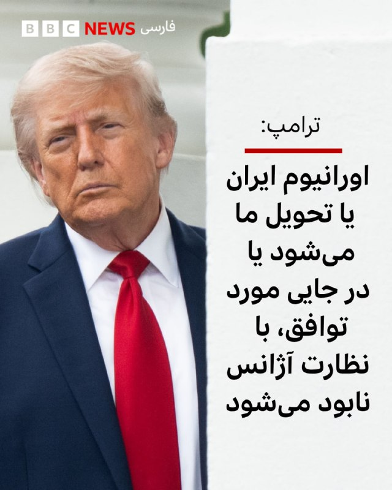

‌
دونالد ترامپ، رئیس جمهور آمریکا، در اظهارنظری تازه که به نوعی «عقب‌نشینی» از مواضع قبلی ارزیابی شده، گفته است: «اورانيوم غنی شده («غبار هسته ای!») يا بلافاصله به ايالات متحده تحويل داده خواهد شد تا به آمريکا منتقل و نابود شود، يا ترجيحا با همکاری و هماهنگی جمهوری اسلامی ايران، در همان محل يا در مکانی ديگر که مورد توافق باشد، نابود خواهد شد؛ اقدامی که با نظارت آژانس انرژی اتمی يا نهاد معادل آن به عنوان ناظر بر اين روند و اين رويداد انجام می‌شود.»

باراک راوید، گزارشگر نشریه اکسیوس که در چند هفته اخیر بارها از تماس نزدیک خود با آقای ترامپ و نظرات او درباره مذاکرات با ایران خبر داده، در شبکه ایکس نوشته این سخنان آقای ترامپ نشان از «عقب‌نشینی» آمریکا از تقاضای قبلی خود و نزدیک شدن به آن چیزی است که ایران به آن اشاره کرده بود.

بنیامین نتانیاهو، نخست‌وزیر اسرائیل، هم چند روز پیش گفته بود تا زمانی که ذخایر اورانیوم غنی‌شده ایران «خارج نشود»، نمی‌توان جنگ را پایان‌یافته دانست.

📷 EPA/Shutterstock
https://bbc.in/4f2VsGk
@BBCPersian

## BBCPersian — post 282043

‌
جنگ آمریکا و اسرائیل با ایران، بار دیگر توجه‌ها را به موضوع سلاح‌های هسته‌ای و خطر گسترش آن‌ها جلب کرده است.

بر اساس برآوردهای «اتحادیه دانشمندان آمریکایی» و «انجمن بین‌المللی کنترل تسلیحات»، اکنون ۹ کشور دارای سلاح هسته‌ای هستند یا گمان می‌رود چنین تسلیحاتی در اختیار داشته باشند: آمریکا، روسیه، چین، فرانسه، بریتانیا، هند، پاکستان، کره شمالی و اسرائیل.

ایران سلاح هسته‌ای ندارد.

بمب هسته‌ای تنها دو بار در تاریخ استفاده شده است؛ زمانی که آمریکا در اوت ۱۹۴۵ دو بمب اتمی بر شهرهای هیروشیما و ناکازاکی ژاپن انداخت. تا پایان همان سال، حدود ۱۴۰ هزار نفر در هیروشیما و ۷۴ هزار نفر در ناکازاکی کشته شدند.

سلاح‌های هسته‌ای علاوه بر موج انفجار و حرارت شدید، تشعشعاتی آزاد می‌کنند که می‌تواند باعث بیماری‌های خطرناک و مسمومیت پرتویی (رادیواکتیو) شود و آثار آن فراتر از لحظه انفجار ادامه یابد.

اما پیش از آنکه اورانیوم به ماده اصلی ساخت سلاح هسته‌ای تبدیل شود، چگونه کشف شد و کاربردهای غیرنظامی آن چیست؟

📷 Getty images/ MAXAR

از لینک ⬇️ این مطلب را در سایت بی‌بی‌سی فارسی بخوانید:
https://bbc.in/42WhZxd
@BBCPersian

## Dirty_Kids — post 390207

  <a href="telegram/content/Dirty_Kids_390207_1779754305.webm" target="_blank">🎬 Download video</a>

☢️خفن ترین و‌ قدیمی ترین  انالیزور  ایران ینی دکتر بت 
👍 
🔴مسابقات جذاب جام جهانی به زودی شروع میشه بیا توی کانال دکتر بت و باهاش همراه شو و پول در بیار
💵 رایگان بهترین شرط هارو براتون میذاره حتی هزار تومن هم دریافت نمیکنه روزانه میتونی از پیش بینی فوتبال باهاش…

## Dirty_Kids — post 390206

  <a href="telegram/content/Dirty_Kids_390206_1779754305.webm" target="_blank">🎬 Download video</a>

☢️خفن ترین و‌ قدیمی ترین  انالیزور  ایران ینی دکتر بت 
👍

🔴مسابقات جذاب جام جهانی به زودی شروع میشه بیا توی کانال دکتر بت و باهاش همراه شو و پول در بیار
💵

رایگان بهترین شرط هارو براتون میذاره
حتی هزار تومن هم دریافت نمیکنه
روزانه میتونی از پیش بینی فوتبال باهاش پول در بیاری 👌
A4

🌟اگ اهل پیش بینی فوتبالی این کانال اصلا از دست ندین
👇

✅https://t.me/+4_ADqwB9e-QwYjlk

✅https://t.me/+4_ADqwB9e-QwYjlk

## Dirty_Kids — post 390205

  

#بخوابیم

@Dirty_Kids 👻

## Dirty_Kids — post 390204

  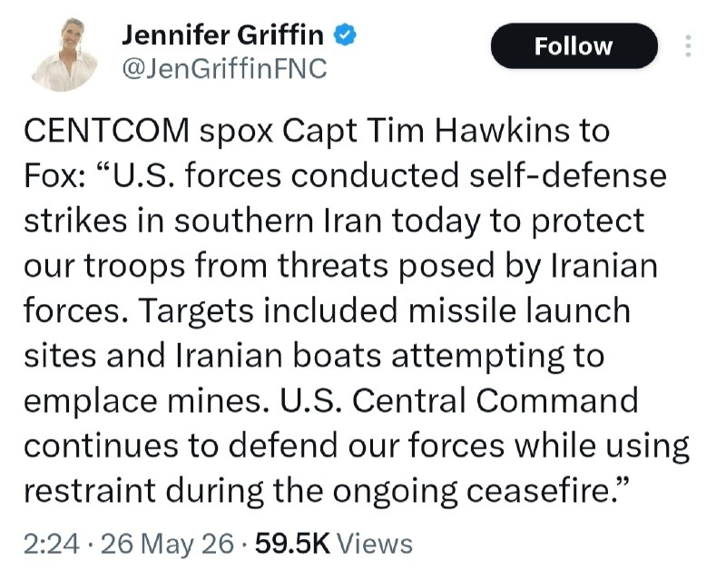

جنیفر گریفین خبرنگار فاکس نیوز توئیت زده که:

«سخنگوی سنتکام کاپیتان تیم هاوکینز به فاکس نیوز گفته که نیروهای آمریکایی امروز در جنوب ایران در در حملاتی تدافعی در برابر تهدیدهای نیروهای ج.ا اهدافی رو شامل پایگاه‌های پرتاب آبگرمکن و قایق‌های روافض رو که در حال مین‌ریزی بودن رو هدف قرار دادن.»

@Dirty_Kids 👻

## Dirty_Kids — post 390203

  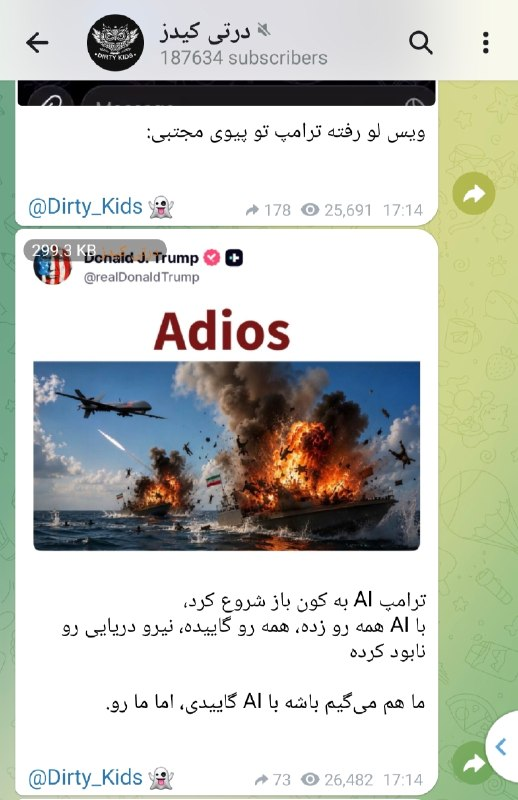

بعضی از رسانه‌های حکومتی نوشتن که حمله به خارک دیروز انجام شده [۴خرداد] و رسانه‌های روافض تحت فشار بودند که این قضیه رو رسانه‌ای نکنن تا خللی در مذاكرات ایجاد نشه،

اگه حقیقت داشته باشه این داستان همزمان می‌شه با اون پست شیر AIبه‌باسن خدا در تروث‌سوشال که دیروز منتشر کرد و تصویری بود از حمله‌ی جنگنده‌ی آمریکا به قایق‌های تندروی روافض.

در عین حال این داستان دیشب کسپر شدن اون چهار رأس سپاهی تروریست، ربطی به صدای انفجارهای امشب در بندر عباس نداره که احتمالاً اینو هم گفتن رسانه‌ای نکنید که مذاکرات بگا نره.

در حکومت روافض همچنان و خوشبختانه سگ صاحبشو نمی‌شناسه.

@Dirty_Kids 👻

---
📅 بروزرسانی: 1405/03/05 02:09
---

## VahidOOnLine — post 242194

  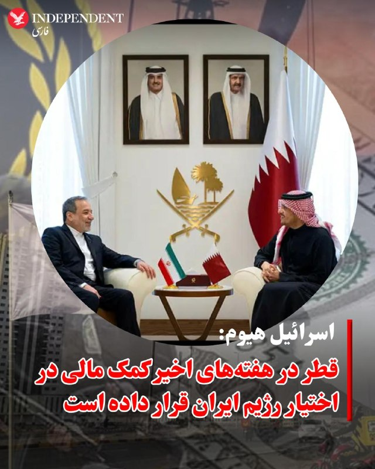

♦️ به گزارش اسرائیل هیوم، دخالت قطر در مذاکرات تصادفی نیست و از چند هفته پیش آغاز شده است. براساس این گزارش، سفر روز دوشنبه عباس عراقچی، وزیر خارجه جمهوری اسلامی، به همراه عبدالناصر همتی، رئیس بانک مرکزی ایران، نشان‌دهنده نقش عمیق قطر، به‌ویژه در حوزه اقتصادی، است؛ اما ظاهرا این نقش فراتر از میانجی‌گری در مذاکرات می‌رود.
دو منبع دیپلماتیک در خلیج فارس و یک مقام اطلاعاتی غربی که با «اسرائیل هیوم» گفت‌وگو کردند، گفتند قطر در هفته‌های اخیر کمک مالی در اختیار رژیم ایران قرار داده است. به نوشته اسرائیل هیوم، خزانه جمهوری اسلامی به‌دلیل محاصره دریایی آمریکا در آستانه ورشکستگی قرار دارد و حکومت، علاوه بر ناتوانی در پرداخت حقوق کارکنان بخش دولتی و دشواری در تامین هزینه واردات کالا و مواد غذایی، با بحران مالی در صندوق‌های سپاه پاسداران نیز روبه‌رو شده است.
به گفته منابع، همین فشارها باعث شده جمهوری اسلامی در یادداشت تفاهم کنونی برخی امتیازها را بپذیرد.
منابع یادشده گفتند قطر پس از تماس‌هایی که در هفته‌های اخیر انجام شد، مبالغ قابل توجهی به حکومت ایران منتقل کرده است. به گفته آن‌ها، تماس‌های دوحه و تهران پس از آتش‌بس بیش از یک ماه پیش گسترش یافت و هدف اصلی قطر جلوگیری از حمله دوباره ایران به این کشور بود؛ حمله‌ای که در جریان جنگ رخ داده بود.
بر اساس این گزارش، حکومت ایران خواستار دسترسی به بخشی از سپرده‌های خود در قطر شده و قرار بوده بخشی از این پرداخت‌ها به‌عنوان هزینه عبور نفتکش‌ها از تنگه هرمز پنهان شود.
یکی از منابع گفت دو کشور در حال انجام مذاکرات محرمانه درباره توافقی گسترده‌تر هستند.
یکی از مقام‌ها گفت در جریان سفر عراقچی و همتی، تماس‌هایی از دوحه با واشینگتن برقرار شد. استیو ویتکاف و جرد کوشنر، نمایندگان مسئول مذاکرات، روابط دیپلماتیک و اقتصادی بسیار نزدیکی با قطر دارند و به گفته این مقام، در طرف دیگر خط تماس حضور داشتند.
به گفته منبعی آگاه از روند مذاکرات، سه محور اصلی اختلاف وجود دارد، از جمله ۱۲ میلیارد دلار دارایی مسدودشده در قطر، که تهران بلافاصله پس از توافق خواستار دستیابی به آن است.
دومین محور اختلاف، خودداری تهران از ارائه تعهد کتبی درباره اورانیوم غنی‌شده است و سومین مورد نیز امتناع تهران از پرداختن به موضوع ادامه غنی‌سازی است.
‌🇸🇦 Indypersian

🤖 @VahidOOnLine

## VahidOOnLine — post 242193

  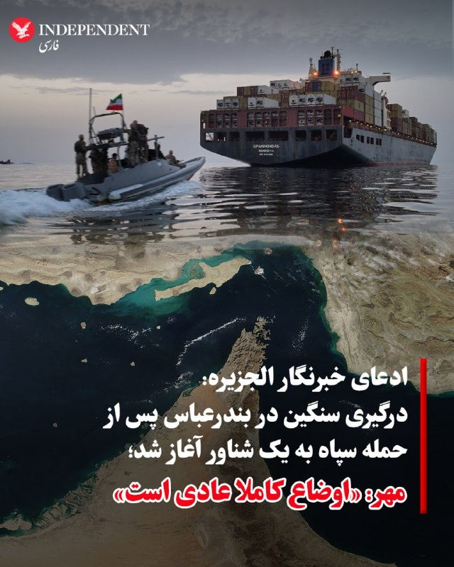

♦️بامداد سه‌شنبه، پنجم خردادماه، علی هاشم، خبرنگار الجزیره، به نقل از منابع خود از وقوع یک درگیری شدید نظامی در جنوب ایران خبر داد و مدعی شد: «یک منبع ایرانی به من گفت صدای تیراندازی سنگینی که در نزدیکی بندرعباس شنیده شد، پس از آن آغاز شد که سپاه پاسداران یک شناور را در دریا هدف قرار داد و در پی آن، جنگنده‌های آمریکایی قایق‌های تندروی نیروی دریایی سپاه را در خلیج [فارس] بمباران کردند. به گفته این منبع، چندین تن از پرسنل نیروی دریایی سپاه پاسداران در این حمله کشته شدند».
همزمان خبرگزاری مهر با انتشار گزارشی نوشت که «اوضاع در بندرعباس کاملا عادی است و صدای انفجار مربوط به منتهی‌الیه شرق این استان بوده است». براساس گزارش‌های منتشر شده، بامداد سه‌شنبه، صدای چند انفجار علاوه بر هرمزگان، در اسفهان و بابلسر نیز شنیده شد.
‌🇸🇦 Indypersian

🤖 @VahidOOnLine

## VahidOOnLine — post 242192

  

ترامپ در تروث‌سوشال نوشت: «اورانیوم غنی‌شده (غبار هسته‌ای!) یا فورا به آمریکا تحویل داده خواهد شد تا در ایالات‌متحده نابود شود، یا ترجیحا با همکاری و هماهنگی با جمهوری اسلامی ایران، در همان محل یا در مکانی قابل قبول دیگر نابود خواهد شد.»
ترامپ گفت در صورت نابودی اورانیوم غنی‌شده در مکانی غیر از آمریکا، «کمیسیون انرژی اتمی»، یا نهاد معادل آن، به عنوان شاهد بر این فرایند نظارت خواهد داشت.
‌🏁 🇬🇧 IranintlTV

🤖 @VahidOOnLine

## VahidOOnLine — post 242191

  

♦️دونالد ترامپ، رئیس‌جمهوری ایالات متحده، با انتشار پیامی در شبکه اجتماعی «تروث سوشال»نوشت: «اورانیوم غنی‌شده (گرد‌وغبار هسته‌ای) یا باید فورا به ایالات متحده تحویل داده شود تا به آمریکا منتقل و نابود گردد، یا اینکه ترجیحا در بستر همکاری و هماهنگی با جمهوری اسلامی، در همان محل یا در مکان قابل‌قبول دیگری، در حضور و با نظارت کمیسیون انرژی اتمی یا نهاد معادل آن نابود شود.»
‌🇸🇦 Indypersian

🤖 @VahidOOnLine

## VahidOOnLine — post 242190

  

♦️خبرگزاری دانشجو بامداد سه‌شنبه، پنجم خردادماه، گزارش داد که در حمله دوشنبه‌شب آمریکا و اسرائیل به جنوب جزیره لارک، عباس اسلامی، قدرت زرنگاری و عبدالرضا گلزاری، نیروهای سپاه پاسداران کشته شدند. براساس این گزارش «تعداد دقیق کشته‌شدگان هنوز مشخص نشده است».
‌🇸🇦 Indypersian

🤖 @VahidOOnLine

## VahidOOnLine — post 242189

  

♦️صابرین‌نیوز، کانال تلگرامی مشترک سپاه قدس و حشدالشعبی عراق، بامداد سه‌شنبه، پنجم خردادماه، از کشته‌شدن دو نیروی سپاه پاسداران در حمله جنگنده‌های دشمن به دو قایق در خلیج فارس خبر داد. همزمان، گزارش‌های رسیده از شنیده‌شدن صدای انفجارها در اصفهان و بابلسر خبر می‌دهد. پیش از این، تابناک بامداد سه‌شنبه، پنجم خردادماه، گزارش داد: «باند پروازی فرودگاه بندرعباس مورد اصابت موشک قرار گرفت».
‌🇸🇦 Indypersian

🤖 @VahidOOnLine

## VahidOOnLine — post 242188

  

♦️تابناک بامداد سه‌شنبه، پنجم خردادماه، گزارش داد: «باند پروازی فرودگاه بندرعباس مورد اصابت موشک قرار گرفت». پیش از این فارس، خبرگزاری وابسته به سپاه پاسداران از شنیده‌شدن چند انفجار در بندرعباس و حوالی سیریک و جاسک خبر داده بود.
‌🇸🇦 Indypersian

🤖 @VahidOOnLine

## VahidOOnLine — post 242187

  

♦️تسنیم، خبرگزاری وابسته به سپاه، بامداد سه‌شنبه، پنجم خردادماه، درباره آخرین وضعیت مذاکرات هیات ایرانی به نقل از «یک منبع آگاه» گزارش داد: «موضوع آزادسازی دارایی بلوکه شده ایران در حال پیگیری است». براساس این گزارش، سفر محمدباقر قالیباف، رئیس مجلس شورای اسلامی، به قطر با همراهی عباس عراقچی، وزیر خارجه جمهوری اسلامی و رئیس کل بانک مرکزی، در جهت آزادسازی بخشی از پولهای بلوکه شده در مرحله اول اجرایی شدن یادداشت تفاهم احتمالی با واشنگتن است. تسنیم نوشت که چون جمهوری اسلامی به آمریکایی‌ها بی‌اعتماد است و می‌خواهد نتایج قطعی را حاصل و انتفاع ایجاد کند، اصرار دارد در این فرایند حتما بخشی از پول‌های مسدود شده آزاد شود. این «منبع مطلع» به تسنیم گفت که در این سفر «پیشرفت‌هایی حاصل شده و گام‌های رو به جلو برداشته شده است».
‌🇸🇦 Indypersian

🤖 @VahidOOnLine

## WithYashar — post 12502

  <a href="telegram/content/WithYashar_12502_1779748785.mp4" target="_blank">🎬 Download video</a>

🎬 Video

## WithYashar — post 12501

کانال 14 اسرائیل: "سلام خامنه‌ای کوچیکه"
@withyashar 😈

## WithYashar — post 12500

سناتور لیندزی گراهام: چه مسیحی انجیلی باشید و چه نباشید، اسرائیل برای آمریکا یک معامله بزرگ است.
اگر ارتش اسرائیل، موساد و شین بت فردا ناپدید شوند، ما کنترل منطقه را از دست خواهیم داد.
پولی که به اسرائیل می‌دهیم، چندین برابر آن را از نظر امنیتی پس می‌گیریم.

اگر اسرائیل می‌خواست همه فلسطینی‌ها را بکشد، می‌توانست. از سوی دیگر، حماس می‌خواهد همه اسرائیلی‌ها را بکشد، اما نمی‌تواند.
حزب‌الله اگر می‌توانست، همه اسرائیلی‌ها را می‌کشت. و هیچ‌کس در اسرائیل نمی‌خواهد همه مردم لبنان را بکشد
@withyashar

## WithYashar — post 12499

شاهزاده رضا پهلوی:

«یکی از نماینده‌های پارلمان حتی بهم گفت فکر نمی‌کنه ایرانی‌ها آماده دموکراسی باشن.
ایرانی‌ها فقط آماده دموکراسی نیستن؛ ۴۰ هزار نفر جونشون رو برای رسیدن بهش دادن و من نمی‌ذارم این فداکاری بی‌نتیجه بمونه.
چه اروپا کنار ما بایسته چه نه، چه خبرنگارها کارشون رو درست انجام بدن چه نه، چه سیاستمدارها شجاعت اقدام داشته باشن چه نه، من برای مردمم و کشورم می‌جنگم.
حتی اگر مجبور باشیم تنهایی این مسیر رو بریم، می‌جنگیم تا ایران آزاد بشه.»
@withyashar

## WithYashar — post 12498

گزارشها میگن که اپ های ، روبیکا و بله، سروس و بلو بانک از دسترس خارج شدند
@withyashar

## WithYashar — post 12497

باراک راوید خبرنگار آکسیوس : چرا مهمه؟ آمریکا داره موضعش رو کمی نرم‌تر می‌کنه

- احتمالاً نسبت به قبل انعطاف بیشتری درباره اورانیوم غنی‌شده ایران نشون میده و حتی تا حدی به خواسته ایران نزدیک‌تر شده
@withyashar

## WithYashar — post 12496

پست جدید ترامپ که به اسپانیایی واژه خداحافظ را نوشته که بسیار طعنه آمیز است و معنیه «بری دیگه برنگردی» را میدهد. @withyashar

## WithYashar — post 12495

  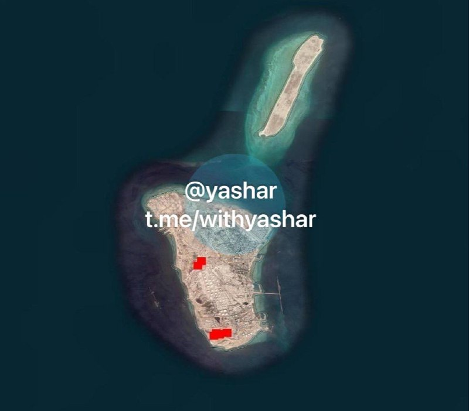

به نظر می رسد 2 آتش سوزی در جزیره خارک ایران رخ داده است.

جزیره خارک بندری برای صادرات 90 درصد فرآورده های نفتی ایران است.
@withyashar

## WithYashar — post 12494

## WithYashar — post 12493

## WithYashar — post 12492

## WithYashar — post 12491

صدا و سیما : حمله شب گذشته دشمن آمریکایی-اسرائیلی به شناورها در جنوب جزیره لارک بر اساس اعلام منابع محلی شب گذشته جنگنده‌های آمریکایی-اسرائیلی چند شناور ایرانی را در جنوب جزیره لارک مورد هدف قرار دادند. طبق اعلام منابع محلی چند تن از هموطنانمان در این حملات…

## WithYashar — post 12490

  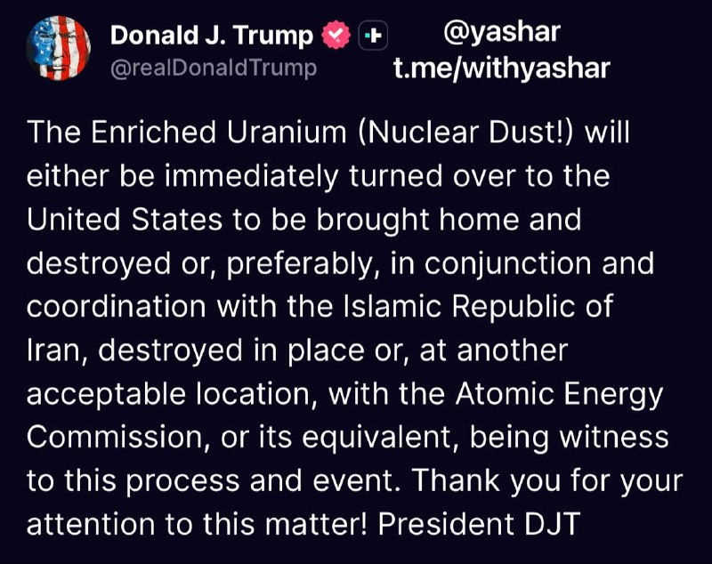

ترامپ در تروث : اورانیوم غنی‌شده (غبار هسته‌ای!) یا باید فوراً به ایالات متحده تحویل داده شود تا به آمریکا منتقل و نابود گردد، یا ترجیحاً با همکاری و هماهنگی جمهوری اسلامی ایران، در همان محل ــ یا در مکان مورد توافق دیگری ــ از بین برده شود؛ آن هم در حالی که کمیسیون انرژی اتمی، یا نهاد معادل آن، بر این روند و این اقدام نظارت و شهادت داشته باشد.

از توجه شما به این موضوع سپاسگزارم!

رئیس‌جمهور دونالد جی. ترامپ
@withyashar

## WithYashar — post 12489

هر‌ چیزی لیاقت میخواد…

## WithYashar — post 12488

## WithYashar — post 12487

پدافند تهران گویا فعال شد !
@withyashar

## WithYashar — post 12486

۴ نفر فوتی بردن بیمارستان شهید محمدی @withyashar

## WithYashar — post 12485

صابرین نیوز : اسامی شهدای حمله سحرگاه شب گذشته ۴ خرداد در جنوب جزیره لارک

بر اساس اعلام منابع محلی نام سه تن از شهدای حمله دشمن متخاصم آمریکایی-اسرائیلی که تا این لحظه شناسایی شدند به شرح زیر است:

شهید عباس اسلامی
شهید قدرت زرنگاری
گشهید عبدالرضا گلزاری

گفتنی است تعداد شهدا هنوز مشخص نشده.
@withyashar

## WithYashar — post 12484

صدا و سیما : حمله شب گذشته دشمن آمریکایی-اسرائیلی به شناورها در جنوب جزیره لارک بر اساس اعلام منابع محلی شب گذشته جنگنده‌های آمریکایی-اسرائیلی چند شناور ایرانی را در جنوب جزیره لارک مورد هدف قرار دادند. طبق اعلام منابع محلی چند تن از هموطنانمان در این حملات…

## WithYashar — post 12483

صدا و سیما : حمله شب گذشته دشمن آمریکایی-اسرائیلی به شناورها در جنوب جزیره لارک

بر اساس اعلام منابع محلی شب گذشته جنگنده‌های آمریکایی-اسرائیلی چند شناور ایرانی را در جنوب جزیره لارک مورد هدف قرار دادند.

طبق اعلام منابع محلی چند تن از هموطنانمان در این حملات به شهادت رسیده‌اند.
@withyashar

## mwarmonitor — post 9724

  <a href="telegram/content/mwarmonitor_9724_1779748789.mp4" target="_blank">🎬 Download video</a>

📝 شاهکار جدید دندان‌پزشکِ آقازاده چقدر دیدنی است؛ چنان با ذوق‌زدگی و حماقت از خاطره‌ی مسخره‌اش تعریف می‌کند که اگر خودش اعتراف نمی‌کرد، کسی متوجه نمی‌شد این موجودِ ذوق‌زده، بچه‌ی همان سردار تنگسیری است! شوخیِ استراتژیک و خنده‌دار این مشنگ به پدرش این بوده: «تبریک می‌گم، رئیس اوپک شدید و قیمت نفت را تعیین می‌کنید!» اما طنز سیاه و تحقیرآمیز روزگار اینجاست که پیش از آنکه قیمت نفت در دنیا تکانی بخورد، خودِ سردارِ توهمات دچار انفجار شد و کتلت شد! تلخیِ مضاعف این سیرک در استانداردهای دوگانه است؛ این جماعت با کمال وقاحت روبروی دوربین می‌نشینند، نیششان تا بناگوش باز است و به توهماتِ احمقانه‌ی خود می‌خندند، اما اگر یکی از معترضین یا مردم بدبخت در خیابان بابت همین اتفاقات ذره‌ای لبخند میزد، فوراً به جرم محاربه و اخلال، حکم اعدام برایش می‌بریدند. این ویدیو ویترین تمام‌عیار از سقوط، بلاهت و توهمات طبقه‌ای است که فکر می‌کردند اقتصاد جهان را هدایت می‌کنند، ولی در نهایت فقط مایه خنده و تحقیر شدند.

@mwarmonitor

## mwarmonitor — post 9723

«چرا این مهم است: به نظر می‌رسد در اینجا نوعی نرمش در موضع آمریکا درباره روش‌های از بین بردن ذخایر اورانیوم غنی‌شده وجود دارد و نوعی نزدیک شدن به موضع ایران دیده می‌شود.» باراک راوید @mwarmonitor

## mwarmonitor — post 9722

🚨 ترامپ در شبکه اجتماعی Truth Social: «اورانیوم غنی‌شده (گرد هسته‌ای!) یا باید فوراً به ایالات متحده تحویل داده شود تا به کشور منتقل و نابود گردد، یا ترجیحاً با هماهنگی و همکاری جمهوری اسلامی ایران، همان‌جا در محل یا در مکانی دیگر که قابل قبول باشد، نابود…

## mwarmonitor — post 9721

🚨«درگیری‌هایی میان نیروی دریایی ایران و نیروهای آمریکایی رخ داده که در نتیجه آن تعدادی کشته شده‌اند، که عبارتند از: پاسدار عباس اسلامی پاسدار قدرت زرنگاری پاسدار عبدالرضا گلزاری پاسدار حسین ستوده» @mwarmonitor

## mwarmonitor — post 9720

🚨 ترامپ در شبکه اجتماعی Truth Social:

«اورانیوم غنی‌شده (گرد هسته‌ای!) یا باید فوراً به ایالات متحده تحویل داده شود تا به کشور منتقل و نابود گردد، یا ترجیحاً با هماهنگی و همکاری جمهوری اسلامی ایران، همان‌جا در محل یا در مکانی دیگر که قابل قبول باشد، نابود شود؛ به‌طوری که کمیسیون انرژی اتمی یا نهاد معادل آن، شاهد این فرایند و رویداد باشد.

از توجه شما به این موضوع سپاسگزارم!»

@mwarmonitor

## mwarmonitor — post 9719

🚨«درگیری‌هایی میان نیروی دریایی ایران و نیروهای آمریکایی رخ داده که در نتیجه آن تعدادی کشته شده‌اند، که عبارتند از:

پاسدار عباس اسلامی
پاسدار قدرت زرنگاری
پاسدار عبدالرضا گلزاری
پاسدار حسین ستوده»

@mwarmonitor

## mwarmonitor — post 9718

🔴 جزیره لارک در جنوب ایران هدف قرار گرفت

## mwarmonitor — post 9717

🚨🚨🚨

## mwarmonitor — post 9716

خبر فوری

## FoxNewsTwitter — post 342252

  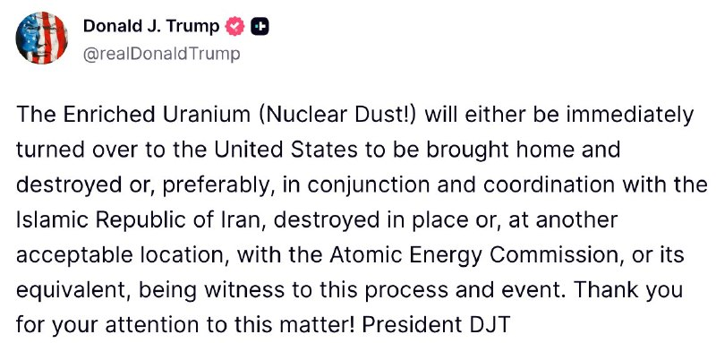

Fox News (Twitter/X)

“The enriched uranium will either be immediately turned over to the United States... or destroyed in place.”

President Trump says any remaining enriched uranium tied to Iran would be removed or eliminated under U.S. supervision, with atomic energy officials overseeing the process.

The remarks come after Trump said any agreement with Iran would be “good and proper,” while sharply contrasting it with the Obama-era nuclear deal.

## FoxNewsTwitter — post 342249

Fox News (Twitter/X)

Construction is officially underway at the White House for UFC Freedom Fights 250.

Workers were seen assembling what appeared to be part of a lighting structure Monday as crews build out a temporary arena expected to hold roughly 5,000 invited guests.

The June 14 card is believed to be the first professional sporting event ever held at the White House — and it lands on President Trump’s 80th birthday.

## pm_afshaa — post 91506

  <a href="telegram/content/pm_afshaa_91506_1779748793.webm" target="_blank">🎬 Download video</a>

🔴پست جدید ترامپ: اورانیوم غنی‌شده (غبار هسته‌ای) یا فوراً به آمریکا تحویل داده خواهد شد تا به خاک آمریکا برده شده و منهدم شود، یا ترجیحاً با هماهنگی و همکاری جمهوری اسلامی ایران، در همان مکان منهدم شود. یا در مکانی دیگر که مورد قبول باشه، با نظارت کمیسیون…

## pm_afshaa — post 91505

  <a href="telegram/content/pm_afshaa_91505_1779748794.webm" target="_blank">🎬 Download video</a>

🔴طبق تصاویر ماهواره‌ای 2 آتش سوزی در جزیره خارک ایران مشاهده شده اما رسانه‌های داخلی تا الان تکذیب کردن.

💧 Rainbet.com the #1 Non-KYC Crypto Casino & Sportsbook @rainbetcom

😁 @Pm_Afshaa

## pm_afshaa — post 91504

  <a href="telegram/content/pm_afshaa_91504_1779748795.webm" target="_blank">🎬 Download video</a>

🔴پست جدید ترامپ: اورانیوم غنی‌شده (غبار هسته‌ای) یا فوراً به آمریکا تحویل داده خواهد شد تا به خاک آمریکا برده شده و منهدم شود، یا ترجیحاً با هماهنگی و همکاری جمهوری اسلامی ایران، در همان مکان منهدم شود. یا در مکانی دیگر که مورد قبول باشه، با نظارت کمیسیون…

## pm_afshaa — post 91503

  <a href="telegram/content/pm_afshaa_91503_1779748796.webm" target="_blank">🎬 Download video</a>

🔴میدل ایست: دو قایق تندرو نیروی دریایی سپاه در خلیج فارس هدف جنگنده‌های آمریکایی قرار گرفتن و 4 سرباز کشته شدن. 
💧 Rainbet.com the #1 Non-KYC Crypto Casino & Sportsbook @rainbetcom 
😁 @Pm_Afshaa

## pm_afshaa — post 91502

  <a href="telegram/content/pm_afshaa_91502_1779748797.webm" target="_blank">🎬 Download video</a>

🔴پست جدید ترامپ: اورانیوم غنی‌شده (غبار هسته‌ای) یا فوراً به آمریکا تحویل داده خواهد شد تا به خاک آمریکا برده شده و منهدم شود، یا ترجیحاً با هماهنگی و همکاری جمهوری اسلامی ایران، در همان مکان منهدم شود. یا در مکانی دیگر که مورد قبول باشه، با نظارت کمیسیون انرژی اتمی یا نهاد معادل آن بر این فرآیند و رویداد

این توافق مثل برجام نیست که راه بمب اتم باز بمونه، این‌بار قضیه کاملاً برعکسه.

💧 Rainbet.com the #1 Non-KYC Crypto Casino & Sportsbook @rainbetcom

😁 @Pm_Afshaa

## pm_afshaa — post 91501

خیلی وقته خبر جنگ نبوده کانالا جوگیر شدن یکم

## pm_afshaa — post 91500

  <a href="telegram/content/pm_afshaa_91500_1779748798.webm" target="_blank">🎬 Download video</a>

🔴خبرگزاری مهر: منشا صدای انفجار شرق بندرعباس بوده.

اوضاع شهر، کاملا تحت کنترله و جای هیچگونه نگرانی برای مردم بندرعباس نیست. به شایعات منتشر شده در فضای مجازی توجه نکنید؛ هنوز منابع رسمی در این خصوص اظهار نظری نکردن.

💧 Rainbet.com the #1 Non-KYC Crypto Casino & Sportsbook @rainbetcom

😁 @Pm_Afshaa

## pm_afshaa — post 91499

  <a href="telegram/content/pm_afshaa_91499_1779748798.webm" target="_blank">🎬 Download video</a>

🔴تو اصفهان هم گزارش پرواز پهباد داده شده.

💧 Rainbet.com the #1 Non-KYC Crypto Casino & Sportsbook @rainbetcom

😁 @Pm_Afshaa

## pm_afshaa — post 91498

  <a href="telegram/content/pm_afshaa_91498_1779748799.webm" target="_blank">🎬 Download video</a>

🔴فارس: در خلیج فارس حوالی سیریک و جاسک هم صداهای انفجار شنیده شده.

💧 Rainbet.com the #1 Non-KYC Crypto Casino & Sportsbook @rainbetcom

😁 @Pm_Afshaa

## pm_afshaa — post 91497

  <a href="telegram/content/pm_afshaa_91497_1779748800.webm" target="_blank">🎬 Download video</a>

🔴این وسط تسنیم گفته:
در سفر قالیباف و عراقچی به قطر، پیشرفت‌هایی حاصل شده و گام‌های رو به جلو برداشته شده.

💧 Rainbet.com the #1 Non-KYC Crypto Casino & Sportsbook @rainbetcom

😁 @Pm_Afshaa

## pm_afshaa — post 91496

یه شب خبر از توافقه یه شب جنگ

## VahidOnline — post 75716

خبرگزاری دانشجو گزارش داد که در ["حمله سحرگاه شب گذشته ۴ خرداد"] در جنوب جزیره لارکآمریکا و اسرائیل به جنوب جزیره لارک، عباس اسلامی، قدرت زرنگاری و عبدالرضا گلزاری، نیروهای سپاه پاسداران کشته شدند.
براساس این گزارش «تعداد دقیق کشته‌شدگان هنوز مشخص نشده است».
@VahidOOnLine
گویا این واقعه مربوط به اولین ساعت‌های دوشنبه است. یعنی حدود ۲۴ ساعت قبل
ولی به نظر می‌رسه اون دسته از منابع جمهوری اسلامی که این خبر رو پخش کردند عمدا طوری گمراه‌کننده نوشتند که مربوط به صداهای شنیده شده الان به نظر بیاد.

ولی این توییت مربوط به ساعت ۷ شب دوشنبه است که درباره همین خبر به نظر می‌رسه:
دیشب یه قایق سپاه در حال مین ریزی در تنگه هرمز مورد اصابت یک جنگده که از خاک امارات بلند شده بود قرار میگیره و چهار نفر از نیروهای سپاه کشته میشن
YourAnon_Zeus
حالا این خبر درسته یا نه نمی‌دونم ولی مربوط به صداهای شنیده شده ساعتی پیش نیست. من هم ساعت سه چهار صبح دوشنبه پیام‌هایی داشتم از شنیده شدن صدا در قشم و بندرعباس
📡 @VahidOnline

## VahidOnline — post 75715

  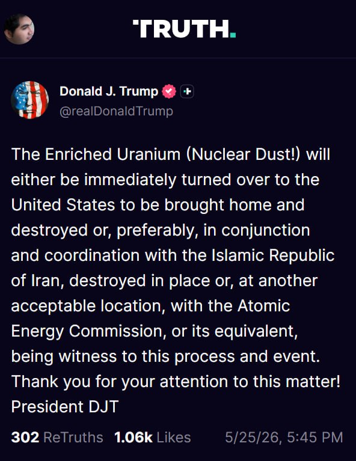

پست ترامپ، ترجمه ماشین:
غبار هسته‌ای، یعنی اورانیوم غنی‌شده، یا باید فوراً به ایالات متحده تحویل داده شود تا به کشورمان منتقل و نابود شود، یا ترجیحاً، در همکاری و هماهنگی با جمهوری اسلامی ایران، در همان محل یا در مکان قابل قبول دیگری نابود شود؛ در حالی که کمیسیون انرژی اتمی، یا نهاد معادل آن، شاهد این روند و رویداد باشد.

از توجه شما به این موضوع سپاسگزارم!

رئیس‌جمهور دی‌جی‌تی
realDonaldTrump

📡 @VahidOnline

## kianmeli1 — post 87668

🔴 ۴ عضو سپاه پاسداران در خلیج فارس پس از آنکه بنا به گزارش‌ها دو قایق تندرو توسط «هواپیماهای جنگی امریکا» مورد اصابت قرار گرفتند، کشته شدند.
https://t.me/kianmeli1

## kianmeli1 — post 87667

🔴امشب-دو قایق تندرو نیروی دریایی سپاه پاسداران در خلیج فارس توسط جنگنده‌های آمریکایی هدف قرار گرفتند و چهار نیرو سپاه کشته شده‌اند
https://t.me/kianmeli1

## kianmeli1 — post 87666

  

🔴پایین صفحه نوشته شده فروش فیلترشکن جعلیه و کلاهبرداری

خود تلگرام تبلیغ میکنه و مراقب باشید نخرید
https://t.me/kianmeli1

## IranIntlTV — post 338997

  <a href="https://t.me/IranintlTV/338997" target="_blank">📎 Download file</a>

🎧نسخه صوتی برنامه با کامبیز حسینی؛ بازگشت «برنامه» با «تریبون آزاد»
@iranintlTV

## IranIntlTV — post 338996

  

ترامپ در تروث‌سوشال نوشت: «اورانیوم غنی‌شده (غبار هسته‌ای!) یا فورا به آمریکا تحویل داده خواهد شد تا در ایالات‌متحده نابود شود، یا ترجیحا با همکاری و هماهنگی با جمهوری اسلامی ایران، در همان محل یا در مکانی قابل قبول دیگر نابود خواهد شد.»
ترامپ گفت در صورت نابودی اورانیوم غنی‌شده در مکانی غیر از آمریکا، «کمیسیون انرژی اتمی»، یا نهاد معادل آن، به عنوان شاهد بر این فرایند نظارت خواهد داشت.
https://iranintl.com/202605259577

## IranIntlTV — post 338995

  <a href="telegram/content/IranIntlTV_338995_1779748804.mp4" target="_blank">🎬 Download video</a>

مراد ویسی، تحلیل‌گر ارشد ایران‌اینترنشنال، گفت: «بسیاری از اختیارات پزشکیان گرفته شده او عملا نقش تعیین‌کننده‌ای در تصمیم‌گیری‌ها ندارد. پزشکیان عملا به تدارکاتچی سپاه تبدیل شده و حتی در جایگاه‌هایی مثل شورای عالی امنیت ملی هم بیشتر به ماشین امضای تصمیمات سپاه مثل جنایت دی‌ماه تبدیل شده است.»
@iranintltv

## IranIntlTV — post 338994

  <a href="telegram/content/IranIntlTV_338994_1779748812.mp4" target="_blank">🎬 Download video</a>

با ادامه انتقاد برخی گروه‌های درون حکومت ایران به شیوه مذاکرات، بعضی نمایندگان مجلس می‌گویند نباید هیچ تعهدی پذیرفته شود که به تضعیف قدرت بازدارندگی منجر گردد.
@iranintltv

## IranIntlTV — post 338993

  <a href="telegram/content/IranIntlTV_338993_1779748818.mp4" target="_blank">🎬 Download video</a>

مراد ویسی، تحلیل‌گر ارشد ایران‌اینترنشنال، گفت: «خروج قالیباف از مخفیگاه و سفرش به قطر و علنی شدن حضور علی عبداللهی، فرمانده قرارگاه خاتم الانبیا، پس از چند ماه می‌تواند نشانه امان‌نامه غیر رسمی و موقت ترامپ به فرماندهان سپاه برای رسیدن به یک توافق احتمالی باشد. اگر توافق نشود این امان‌نامه می تواند توسط نیروی هوایی اسراییل باطل شود.»
@iranintltv

## IranIntlTV — post 338992

  <a href="telegram/content/IranIntlTV_338992_1779748835.mp4" target="_blank">🎬 Download video</a>

در ادامه رایزنی‌ها بر سر توافق احتمالی میان تهران و واشینگتن، هیات جمهوری اسلامی به ریاست محمدباقر قالیباف، رییس مجلس و عباس عراقچی، وزیر امور خارجه جمهوری اسلامی، وارد دوحه شد.
@iranintltv

## IranIntlTV — post 338991

  <a href="telegram/content/IranIntlTV_338991_1779748839.mp4" target="_blank">🎬 Download video</a>

مراد ویسی، تحلیل‌گر ارشد ایران‌اینترنشنال، گفت: «علنی شدن رقم ۱۲ میلیارد دلاری پول‌های توقیف‌شده در قطر، بار دیگر این واقعیت را نشان داد که در مبادلات بانکی، فروش غیر رسمی نفت و دور زدن تحریم‌ها بخش زیادی از درآمدهای ملی حیف‌ومیل می‌شود و به‌دلیل پنهانی بودن معاملات، امکان سوءاستفاده و بالا کشیدن درآمدهای نفتی توسط فرماندهان سپاه و باندهای آنها وجود دارد.»
@iranintltv

## Shin_Persian — post 6232

  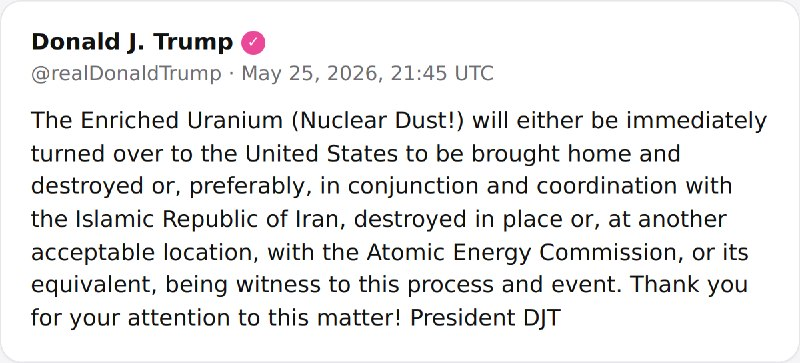

Shin ✓ @hey_itsmyturn Mon, 25 May 2026 21:50:47 UTC President Trump @POTUS: "The Enriched Uranium (Nuclear Dust!) will either be immediately turned over to the United States to be brought home and destroyed or, preferably, in conjunction and coordination…

## Shin_Persian — post 6231

Shin ✓ @hey_itsmyturn
Mon, 25 May 2026 21:50:47 UTC

President Trump @POTUS:
"The Enriched Uranium (Nuclear Dust!) will either be immediately turned over to the United States to be brought home and destroyed or, preferably, in conjunction and coordination with the Islamic Republic of Iran, destroyed in place or, at another acceptable location, with the Atomic Energy Commission, or its equivalent, being witness to this process and event. Thank you for your attention to this matter! President DJT"

فارسی

رئیس‌جمهور ترامپ @POTUS:

«اورانیوم غنی‌سازی شده (گرد و غبار هسته‌ای!) یا باید فوراً به ایالات متحده تحویل داده شود تا به میهن بازگردانده و نابود شود یا ترجیحاً، با همکاری و هماهنگی با جمهوری اسلامی ایران، در محل یا در مکان قابل قبول دیگری، با حضور کمیسیون انرژی اتمی یا معادل آن به عنوان شاهد این فرآیند و رویداد، نابود گردد. از توجه شما به این موضوع سپاسگزارم! رئیس‌جمهور دی‌جی‌تی»

𝕏 · @shin_persian

## Shin_Persian — post 6230

Shin ✓ @hey_itsmyturn
Mon, 25 May 2026 21:47:08 UTC

AA activity over Khorzuq Borkhar, Isfahan Province, #Iran

فارسی

فعالیت پدافند هوایی (AA) بر فراز خورزوق برخوار، استان اصفهان، #Iran

𝕏 · @shin_persian

## Shin_Persian — post 6228

Shin ✓ @hey_itsmyturn
Mon, 25 May 2026 21:42:17 UTC

And regarding the reports on death of 4 regime forces in Larak island due to strike(s): SNN (Daneshju) reported it, claims it happened on Monday (4th of Khordad), AsrIran cites Daneshju and reports it as well.
Hormozgan Province, #Iran

فارسی

و در رابطه با گزارش‌ها مبنی بر کشته شدن ۴ تن از نیروهای رژیم در جزیره لارک بر اثر حمله (یا حملات): خبرگزاری دانشجو (SNN) این خبر را گزارش کرده و مدعی شده است که این حادثه در روز دوشنبه (۴ خرداد) رخ داده است؛ عصر ایران نیز با استناد به خبرگزاری دانشجو این خبر را گزارش کرده است.
استان هرمزگان، #Iran_

𝕏 · @shin_persian

## Shin_Persian — post 6227

Shin ✓ @hey_itsmyturn
Mon, 25 May 2026 21:37:03 UTC

No explosions in Babolsar.
No explosions in Isfahan.
No explosions in Qom.
Yes explosions &amp; AA activity in Bandar Abbas.
No official statements, Yet.

فارسی

هیچ انفجاری در بابلسر رخ نداده است.
هیچ انفجاری در اصفهان رخ نداده است.
هیچ انفجاری در قم رخ نداده است.
بله، انفجارها و فعالیت پدافند هوایی در بندرعباس گزارش شده است.
هنوز هیچ بیانیه رسمی صادر نشده است.

𝕏 · @shin_persian

## Shin_Persian — post 6226

  

↩️ Quoted tweet: Shin ✓ @hey_itsmyturn Mon, 25 May 2026 21:12:23 UTC No, Tabnak News did not report anything about "Bandar Abbas airport being hit". But yes, the sound was heard from east of the city. #Hormogzan Province, #Iran ↩️ توییت نقل‌قول شده — برای…

## Shin_Persian — post 6225

↩️ Quoted tweet:
Shin ✓ @hey_itsmyturn
Mon, 25 May 2026 21:12:23 UTC

No, Tabnak News did not report anything about "Bandar Abbas airport being hit".
But yes, the sound was heard from east of the city.
#Hormogzan Province, #Iran

↩️ توییت نقل‌قول شده — برای پاسخ، پست زیر را ببینید.

فارسی

خیر، خبرگزاری تابناک هیچ خبری مبنی بر «هدف قرار گرفتن فرودگاه بندرعباس» منتشر نکرده است.
اما بله، صدا از شرق شهر شنیده شده است.
#Hormogzan Province, #Iran

𝕏 · @shin_persian

## Shin_Persian — post 6224

Shin ✓ @hey_itsmyturn
Mon, 25 May 2026 21:12:23 UTC

No, Tabnak News did not report anything about "Bandar Abbas airport being hit".
But yes, the sound was heard from east of the city.
#Hormogzan Province, #Iran

فارسی

خیر، خبرگزارى تابناک هیچ خبری مبنی بر «مورد اصابت قرار گرفتن فرودگاه بندرعباس» گزارش نکرده است.
اما بله، صدا در شرق شهر شنیده شده است.
#Hormogzan Province, #Iran

𝕏 · @shin_persian

## FarsiVOA — post 218657

🔺دونالد ترامپ: اورانیوم غنی‌شده جمهوری اسلامی یا در آمریکا، یا ایران و یا در مکان دیگری نابود خواهد شد

▪️دونالد ترامپ، رئیس‌جمهوری آمریکا، روز دوشنبه ۴ خرداد گفت اورانیوم غنی‌شده جمهوری‌ اسلامی یا تحویل آمریکا داده می‌شود و یا در ایران و یا «مکان قابل قبول دیگری» نابود خواهد شد.

⬇️ بیشتر بخوانید:
https://ir.voanews.com/a/8153748.html
@FarsiVOA

## FarsiVOA — post 218656

  <a href="telegram/content/FarsiVOA_218656_1779748845.mp4" target="_blank">🎬 Download video</a>

⚡️واکنش کاربران شبکه‌های اجتماعی به توافق احتمالی آمریکا با جمهوری اسلامی
@FarsiVOA

## FarsiVOA — post 218655

  

رسانه حکومتی تابناک در ایران در خبری مدعی شد که دو قایق تندرو سپاه پاسداران هدف حمله هوایی قرار گرفتند.
این رسانه نام چهار نفر را نیز به عنوان کشته‌ها منتشر کرد.
در همین حال یک خبرنگار شبکه الجزیره به نام علی هاشم نیز به نقل از منابع جمهوری اسلامی از هدف قرار گرفتن قایق‌های سپاه خبر داد.
او افزود نیروهای سپاهی قبل از اینکه هدف قرار بگیرند، به یک شناور حمله کرده بودند.
این خبرنگار الجزیره گفت که منبع حکومتی به او گفت که صدای تیراندازی شدیدی که در نزدیکی بندرعباس شنیده شد، پس از آن رخ داد که سپاه پاسداران یک کشتی را هدف قرار داد و سپس قایق‌های نیروی دریایی سپاه در خلیج فارس هدف حمله هوایی جت‌ها قرار گرفتند.
ساعاتی قبل از این نیز گزارش‌های مختلفی در شبکه‌های اجتماعی از شنیده شدن صدای چندین انفجار در بندرعباس و سیریک و جاسک منتشر شد.
ستاد فرماندهی مرکزی آمریکا، سنتکام، تا این لحظه واکنشی به این گزارش‌ها شده نشان نداده است.
برخی رسانه‌های داخلی مدعی شده‌اند که قایق‌های سپاه در نزدیکی جزیره لارک هدف قرار گرفتند. از گزارش‌های منتشر شده فعلا مشخص نیست قایق‌های سپاه چه زمانی هدف قرار گرفتند.

## FarsiVOA — post 218654

⚡️روز دوشنبه ۴ خرداد جی دی ونس، معاون رئیس جمهوری آمریکا، به همراه پرزیدنت ترامپ و شماری از مقامات بلندپایه آمریکا در مراسم «روز یادبود» در آرامستان ملی آرلینگتون در نزدیکی واشنگتن شرکت کرد. این مراسم به طور زنده و با ترجمه همزمان پژواک کیومرثی از صدای آمریکا پخش شد.
@FarsiVOA

## FarsiVOA — post 218653

⚡️روز دوشنبه ۴ خرداد پیت هگست، وزیر جنگ آمریکا، به همراه پرزیدنت ترامپ و شماری از مقامات بلندپایه آمریکا در مراسم «روز یادبود» در آرامستان ملی آرلینگتون در نزدیکی واشنگتن شرکت کرد. این مراسم به طور زنده و با ترجمه همزمان پژواک کیومرثی از صدای آمریکا پخش شد.
@FarsiVOA

## DW_Farsi — post 125145

  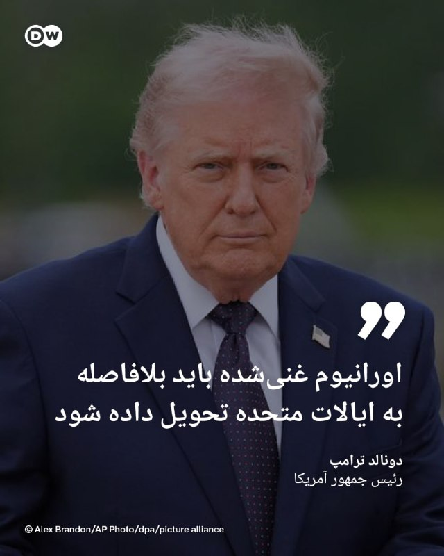

🔶 ترامپ: اورانیوم غنی‌شده باید بلافاصله به ایالات متحده تحویل داده شود

دونالد ترامپ، رئیس جمهور آمریکا بامداد سه‌شنبه ۲۶ مه (۵ خرداد) با انتشار پستی در شبکه اجتماعی تروث سوشال، بار دیگر بر خواست واشنگتن مبنی بر تحویل اورانیوم با غنای بالای ایران تاکید کرد.

او نوشت: «اورانیوم غنی‌شده (غبار هسته‌ای!) یا فورا به آمریکا تحویل داده می‌شود تا به کشورمان منتقل و نابود شود یا ترجیحا در همکاری و هماهنگی با جمهوری اسلامی ایران، در همان محل یا در مکانی دیگر که مورد قبول باشد، با نظارت کمیسیون انرژی اتمی یا نهاد معادل آن بر این فرآیند و رویداد، نابود شود.»

این در حالی است که پیش از این مقامات ایرانی اعلام کرده بودند، "تهران هیچ تعهدی در پیش‌نویس توافق‌ اولیه با آمریکا در موضوع هسته‌ای و اورانیوم با غنای بالا به طرف مقابل نداده است."

با این حال رویترز به نقل از یک مقام آگاه نوشته بود، محور اصلی مذاکرات محمدباقر قالیباف، مذاکره‌کننده ارشد ایران و عباس عراقچی، وزیر خارجه این کشور، در سفر به قطر موضوع تنگه هرمز و ذخایر اورانیوم بسیار غنی‌شده ایران خواهد بود.
@dw_farsi

## DW_Farsi — post 125144

  

🔴 انفجار در بندرعباس؛ "حمله به لارک و کشته شدن چند عضو سپاه"

خبرگزاری‌های داخلی ایران گزارش دادند، در ساعات پایانی روز دوشنبه ۴ خرداد (۲۵ مه) صدای سه انفجار در شرق بندرعباس شنیده شده است. همزمان در حوالی سیریک و جاسک نیز صداهای مشابه شنیده شده است.

معاون استاندار هرمزگان اعلام کرد، منشا صدای انفجار در حال بررسی است.

خبرگزاری فارس وابسته به سپاه پاسداران نیز در خبری نوشت، "سحرگاه روز سه‌شنبه ۵ خرداد نیروهای مسلح ایران یک فروند پهپاد متخاصم را در محدوده خلیج فارس منهدم کرده‌اند."

برخی منابع داخلی نیز از حمله به فرودگاه بندرعباس خبر می‌دهند. تا کنون هیچ مقام رسمی توضیحی در این رابطه ارائه نکرده است.

خبرگزاری دانشجو به نقل از منابع محلی نوشت، جنگنده‌های آمریکایی چند شناور ایرانی را در جنوب جزیره لارک هدف قرار داده‌اند. آنگونه که این خبرگزاری نوشته چند عضو سپاه بر اثر این حمله کشته شده‌اند که هویت سه تن از آنها تایید شده است.

📌تصویر از آرشیو
@dw_farsi

## Persian_Trend_Official — post 15022

  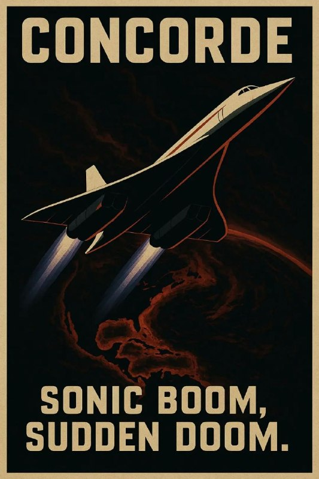

شبتون بخیر ❤️

📝 Nick
📌 @persian_trend_official
پرشین ترند | متفاوت‌ترین کانال نظامی

## Persian_Trend_Official — post 15021

  

🔴به نظر می‌رسد دو آتش‌سوزی در جزیره خارگ ایران رخ داده است. ⭕️جزیره خارگ بندری برای صادرات تا ۹۰٪ از محصولات نفتی ایران فراهم می‌کند 🫆:Tony 📌 @persian_trend_official پرشین ترند | متفاوت‌ترین کانال نظامی

## Persian_Trend_Official — post 15020

https://youtube.com/live/81sH1UrOPAM?feature=share

## Persian_Trend_Official — post 15019

  

🇮🇱‏۶۱ سال پیش، الی کوهن قهرمان افسانه‌ای  مردم اسرائیل در سوریه اعدام شد.

اطلاعاتی که وی از طریق نفوذ در حکومت سوریه به دست آورد، نقش حیاتی در پیروزی اسرائیل در جنگ شش روزه داشت.

👩‍💻@PhantomDirective

🆔@persian_trend_official
پرشین ترند | متفاوت‌ترین کانال نظامی

## Persian_Trend_Official — post 15018

  <a href="telegram/content/Persian_Trend_Official_15018_1779748850.webm" target="_blank">🎬 Download video</a>

🔴به نظر می‌رسد دو آتش‌سوزی در جزیره خارگ ایران رخ داده است.

⭕️جزیره خارگ بندری برای صادرات تا ۹۰٪ از محصولات نفتی ایران فراهم می‌کند

🫆:Tony

📌 @persian_trend_official
پرشین ترند | متفاوت‌ترین کانال نظامی

## Persian_Trend_Official — post 15017

  

⭕️ترامپ:

«اورانیوم غنی‌شده (غبار هسته‌ای!) فوراً به ایالات متحده تحویل داده خواهد شد تا به کشور بازگردانده شده و نابود شود، یا بهتر از آن، با همکاری و هماهنگی با جمهوری اسلامی ایران، در همان محل یا در مکانی قابل قبول دیگر نابود گردد؛ آن هم با حضور و نظارت کمیسیون انرژی اتمی یا نهادی معادل آن به‌عنوان شاهد این فرآیند و رویداد.

از توجه شما به این موضوع سپاسگزارم!»

🫆:Tony

📌 @persian_trend_official
پرشین ترند | متفاوت‌ترین کانال نظامی

## Persian_Trend_Official — post 15016

  <a href="telegram/content/Persian_Trend_Official_15016_1779748851.webm" target="_blank">🎬 Download video</a>

شبکه خبر: منبع صدای انفجار در بندرعباس هنوز مشخص نیست

## Persian_Trend_Official — post 15015

  <a href="telegram/content/Persian_Trend_Official_15015_1779748852.webm" target="_blank">🎬 Download video</a>

علی هاشم، خبرنگار الجزیره: یک منبع ایرانی به من گفت که صدای تیراندازی شدیدی که در نزدیکی بندرعباس شنیده شد، پس از آن رخ داد که سپاه پاسداران یک کشتی را در دریا هدف قرار داد و پس از آن جنگنده‌های آمریکایی به قایق‌های نیروی دریایی سپاه در خلیج فارس حمله کردند.

به گفته این منبع، چندین پرسنل نیروی دریایی سپاه در این حمله کشته شدند.

این منبع گفت: «وضعیت هنوز در حال وخیم شدن است.»

## Persian_Trend_Official — post 15014

  <a href="telegram/content/Persian_Trend_Official_15014_1779748853.webm" target="_blank">🎬 Download video</a>

هم اکنون؛ پرواز هواپیمای سوخت‌رسان آمریکایی بر فراز منطقه.

## Persian_Trend_Official — post 15013

  <a href="telegram/content/Persian_Trend_Official_15013_1779748854.webm" target="_blank">🎬 Download video</a>

صدای انفجار از کرمانشاه و اصفهان

## Persian_Trend_Official — post 15010

  <a href="telegram/content/Persian_Trend_Official_15010_1779748854.mp4" target="_blank">🎬 Download video</a>

پدافند در قم
تاکنون ده ها موشک پرتاب شده

## Persian_Trend_Official — post 15008

  <a href="telegram/content/Persian_Trend_Official_15008_1779748856.webm" target="_blank">🎬 Download video</a>

🔹 آماده باش سراسری به یگان های آفندی سپاه و ارتش‼️

## Persian_Trend_Official — post 15007

  

دود بلند شده از فرودگاه بندرعباس

## Persian_Trend_Official — post 15006

(غیر رسمی)دو قایق تندرو نیروی دریایی سپاه توسط جنگنده‌های آمریکایی در خلیج فارس هدف قرار گرفتند و چهار نیرو کشته شدند. این خبر تایید یا تکذیب نمی‌شود . 👩‍💻@PhantomDirective 🆔@persian_trend_official پرشین ترند | متفاوت‌ترین کانال نظامی

## Persian_Trend_Official — post 15005

  <a href="telegram/content/Persian_Trend_Official_15005_1779748857.webm" target="_blank">🎬 Download video</a>

🔹صدای انفجار در بابلسر

👩‍💻@PhantomDirective

🆔@persian_trend_official
پرشین ترند | متفاوت‌ترین کانال نظامی

## Persian_Trend_Official — post 15004

  <a href="telegram/content/Persian_Trend_Official_15004_1779748858.webm" target="_blank">🎬 Download video</a>

(غیر رسمی)دو قایق تندرو نیروی دریایی سپاه توسط جنگنده‌های آمریکایی در خلیج فارس هدف قرار گرفتند و چهار نیرو کشته شدند.
این خبر تایید یا تکذیب نمی‌شود .

👩‍💻@PhantomDirective

🆔@persian_trend_official
پرشین ترند | متفاوت‌ترین کانال نظامی

## IranianMinds — post 20772

  

🔴پست کانال ۱۴ اسرائیل:

سلام خامنه‌ای کوچیکه.

@IranianMinds

## IranianMinds — post 20771

  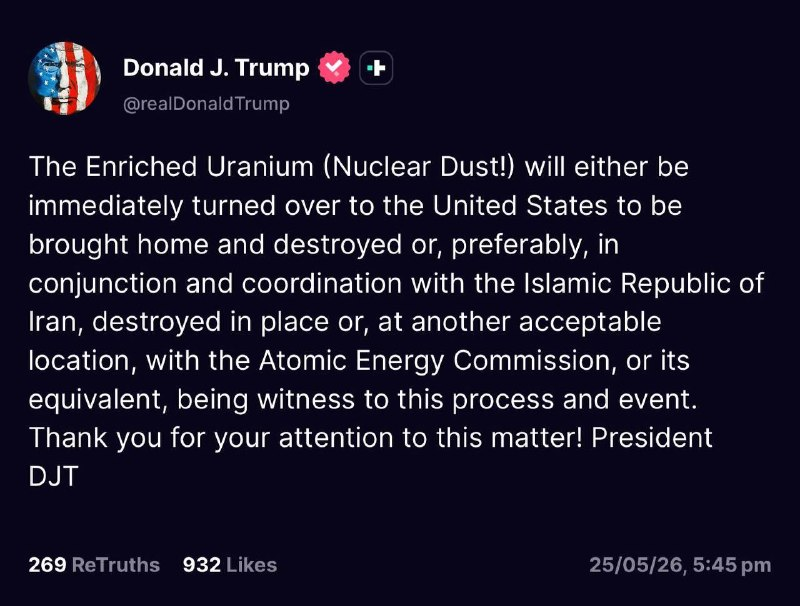

🔴پست جدید ترامپ:

اورانیوم غنی شده( همان گرد و غبار هسته‌ای) یا باید فورأ به ایالات متحده تحویل داده شود تا به امریکا منتقل شود و نابود گردد، یا ترجیحأ با همکاری و هماهنگی جمهوری اسلامی ایران در همان محل یا در یک مکان مورد قبول دیگر نابود گردد در حالیکه کمیسیون انرژی اتمی یا نهاد معادل آن، شاهد و ناظر این روند باشد.
پرزیدنت DJT

@IranianMinds

## IranianMinds — post 20770

  

🔴فعالیت سوخت‌رسان‌ها، الان

@IranianMinds

## IranianMinds — post 20769

یه جا زده فوری ترور ‌‌‌هدفمند در بابل

ی جا زده فوری تست بمب اتم در اصفهان

یکی زده قایق های تندرو سپاهو‌ زدن ۴ نفرم کشته شدن

یکی زده بمب اتم زدن رو تهران

فازتون چیه نمیفهمم

## IranianMinds — post 20768

🔴 خبرگزاری مهر :

شایعات فضای مجازی رو‌ باور نکنید منشا انفجار در بندرعباس هنوز مشخص نیست.

@IranianMinds

## IranianMinds — post 20766

دوباره صدا اومد بندرعباس؟

## IranianMinds — post 20765

🔴 حمید رسایی نماینده حرومی مجلس : اینکه بخوان اینترنت بین الملل رو وصل کنن کاملا غیرقانونیه و‌ پزشکیان اصلا نمیتونه همچین کاریو انجام بده و تواناییش رو نداره ، و اینکار فقط برای حواس پرتیه @IranianMinds

## BBCPersian — post 282042

ارتش اسرائیل می‌گوید ساعتی پس از آنکه بنیامین نتانیاهو، نخست‌وزیر اسرائیل اعلام کرد اسرائیل در حال جنگ با حزب‌الله است، موجی از حملات هوایی را در سراسر لبنان آغاز کرده است. از جمله مناطقی که هدف این حملات قرار گرفته است «مواضع حزب‌الله در دره بقاع در شرق…

## BBCPersian — post 282041

⚡️گزارش‌ها از شنیده شدن صدای انفجارهایی در بندرعباس و حاشیه خلیج فارس

چند نفر از مخاطبان کانال خبری وحید آنلاین که از بندرعباس پیغام فرستاده‌اند از شنیدن صدای دو انفجار و فعال شدن پدافندهای ضدهوایی در حدود ساعت ۱۱:۴۰ دوشنبه شب به وقت محلی خبر داده‌اند.

خبرگزاری فارس هم با اشاره به چنین گزارش‌هایی نوشته «هنوز محل دقیق و منشأ این صداها مشخص نیست».

به گزارش فارس گزارش‌های مشابهی هم از حوالی «سیریک و جاسک» در حاشیه خلیج فارس مخابره شده است.

https://bbc.in/4tYLaei
@BBCPersian

## BBCPersian — post 282040

  

ارتش اسرائیل می‌گوید ساعتی پس از آنکه بنیامین نتانیاهو، نخست‌وزیر اسرائیل اعلام کرد اسرائیل در حال جنگ با حزب‌الله است، موجی از حملات هوایی را در سراسر لبنان آغاز کرده است.

از جمله مناطقی که هدف این حملات قرار گرفته است «مواضع حزب‌الله در دره بقاع در شرق لبنان» اعلام شده است.

آقای نتانیاهو روز دوشنبه اعلام کرد که به ارتش دستور داده حملات خود در لبنان را تشدید کند تا حزب‌الله را «در هم بکوبد.»

او این گروه را به هدف قرار دادن نیروهای اسرائیلی با حملات پهپادی متهم کرد.

نخست‌وزیر اسرائیل گفت ارتش این کشور «ضربات سنگینی» به حزب‌الله وارد خواهد کرد.

او افزود که اسرائیل «در حال جنگ» با این گروه است و در هفته‌های اخیر ۶۰۰ عضو حزب‌الله را کشته است.

آقای نتانیاهو گفت: «دامنه حملات خود علیه حزب‌الله را افزایش خواهیم داد و متوقف نخواهیم شد.»

حزب‌الله در چند هفته گذشته به حملات پهپادی خود به مواضع ارتش اسرائیل ادامه داده است.

📷Reuters
https://bbc.in/4tYLaei
@BBCPersian

## Dirty_Kids — post 390202

  <a href="telegram/content/Dirty_Kids_390202_1779748862.mp4" target="_blank">🎬 Download video</a>

🔴 فیلمی که به تازگی از اعتراضات دی ماه منتشر شده، یه پسر جوون به عنوان تک تیرانداز به مردم شلیک میکنه و مامانش کنارش داره آمار میده که کیو بزنه!

@Dirty_Kids 👻

## Dirty_Kids — post 390201

حیف شد شهید تنگسیری نیست. اگه الان بود، حسابی خط و نشون میکشید و دوباره بگا میرفت

@Dirty_Kids 👻

## Dirty_Kids — post 390200

‏تا این لحظه ۴ سپاهی کشته شدن.
خوبه ولی کافی نیست. بجنبین که خیلی عقبیم بخدا.

@Dirty_Kids 👻

## Dirty_Kids — post 390199

  

خبرنگار الجزیره نوشت ابتدا سپاه پاسداران به یک کشتی در خلیج فارس حمله کرده و سپس جنگنده‌های آمریکایی قایق‌های نیروی دریایی سپاه را هدف حمله قرار دادند و چند نفرشان را کشتند.

@Dirty_Kids 👻

## Dirty_Kids — post 390198

🔴 منابع عبری :
عراقچی و قالیباف در دوحه در امنیت نخواهند بود.*

@Dirty_Kids 👻

## Dirty_Kids — post 390197

  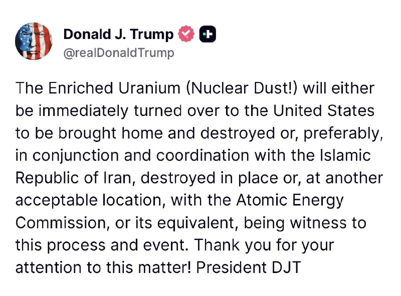

پست جدید ترامپ شیر خدا در خصوص سرنوشت اورانیوم رژیم روافض قحبه‌زاده:

اورانیوم غنی‌شده (گرد و غبار هسته‌ای) یا باید فوراً به ایالات متحده تحویل داده بشه تا در آمریکا نابود شه،

یا اینکه ترجیحاً و در همکاری و هماهنگی با رژیم قحبه‌زاده‌ی رافضی در همون محل یا یک جای قابل‌قبول دیگه نابود شه؛

اون هم در حالی که سازمان انرژی اتمی یا معادل اون شاهد این فرآیند و رویداد نابودیش باشه.

از توجهتون به این موضوع ممنونم.
پرزیدنت DJT

@Dirty_Kids 👻

## Dirty_Kids — post 390196

🔴 صداوسیما تایید کرد شامگاه گذشته چند شناور در جنوب جزیره لارک هدف حمله جنگنده‌های آمریکا و اسرائیل قرار گرفته‌اند.

بر اساس این گزارش، منابع محلی از کشته‌شدن چند نفر در این حمله خبر داده‌اند، اما شمار دقیق تلفات، هویت کشته‌شدگان و نوع شناورهای هدف قرارگرفته هنوز به‌طور رسمی اعلام نشده است. جزیره لارک که در نزدیکی تنگه هرمز قرار دارد، طی هفته‌های اخیر به یکی از حساس‌ترین نقاط تنش و درگیری در خلیج فارس تبدیل شده و حمله شب گذشته، سطح تنش نظامی در منطقه را وارد مرحله تازه‌ای کرده است.

@Dirty_Kids 👻

## Dirty_Kids — post 390195

  <a href="telegram/content/Dirty_Kids_390195_1779748870.mp4" target="_blank">🎬 Download video</a>

هم‌اکنون آسمان اربیل عراق

@Dirty_Kids 👻

## Dirty_Kids — post 390194

شنوندگان عزیز توجه فرمایید.
شنوندگان عزیز توجه فرمایید.

تنگه‌ی هرمز، تنگه‌ی خون

آزاد شد.

[فاکس نیوز و سی‌ان‌ان]

@Dirty_Kids 👻

## Dirty_Kids — post 390193

گروهک تروریستی «الجیش الکانفیگ‌فروش» مسئولیت حمله به بندرعباس رو گردن گرفت.

@Dirty_Kids 👻

## Dirty_Kids — post 390192

غیررسمی:
جنگنده‌های آمریکا به دو قایق تندروی سپاه حمله کردن که باعث کشته شدن 4 نفر شد.

@Dirty_Kids 👻

## Dirty_Kids — post 390191

  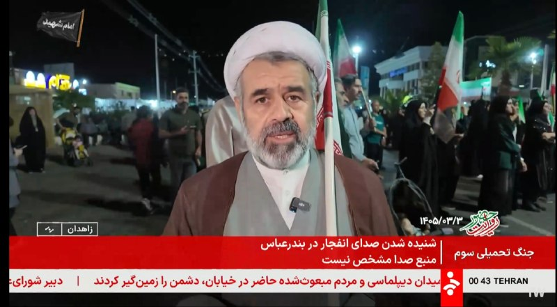

زیرنویس صداوسیما و تایید صدای انفجار در بندرعباس

@Dirty_Kids 👻

## Dirty_Kids — post 390190

  <a href="telegram/content/Dirty_Kids_390190_1779748871.mp4" target="_blank">🎬 Download video</a>

هم‌اکنون بندرعباس

@Dirty_Kids 👻

## Dirty_Kids — post 390189

تا الان شک داشتم جنگ شده یا نه که یادم اومد امروز عراقچی برای مذاکرات رفته بود قطر.

قدرت مذاکره :))

@Dirty_Kids 👻

## Dirty_Kids — post 390188

  <a href="telegram/content/Dirty_Kids_390188_1779748872.mp4" target="_blank">🎬 Download video</a>

مهر: اوضاع شهر، کاملاً تحت کنترل است

@Dirty_Kids 👻

## Dirty_Kids — post 390187

🔻بابلسر صدای انفجار

🔻اصفهان صدای انفجار

@Dirty_Kids 👻

## Dirty_Kids — post 390186

ظاهرا حملات آمریکایی به قایق های سپاه کشته و زخمی زیادی دارد/

@Dirty_Kids 👻

## Dirty_Kids — post 390185

🔴 خبرگزاری فارس :
دقایقی پیش مردم تو بندرعباس و حوالی خلیج فارس صدای چند انفجار شنیدن؛ هنوز محل دقیق و منشأ این صداها مشخص نیست.

@Dirty_Kids 👻

## alonews — post 122698

  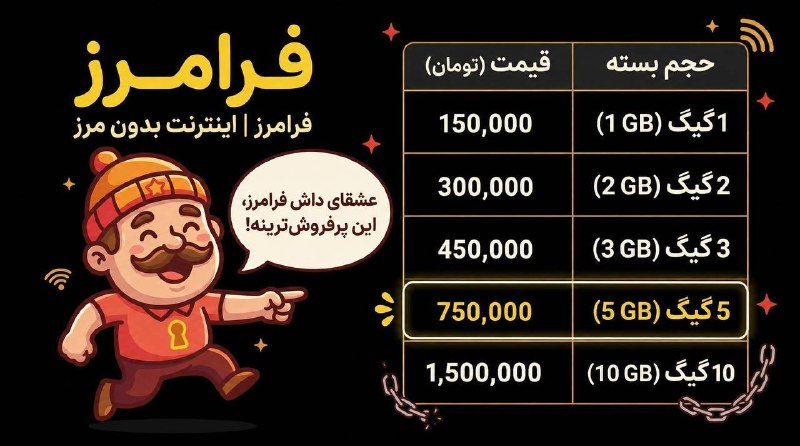

داش فرامرز کف قیمت ایران وصلت می‌کنه حاجی 🤙

فی ۱ گیگ = ۱۵۰ت
فی ۲ گیگ = ۳۰۰ت
فی ۳ گیگ = ۴۵۰ت
🧡فی ۵ گیگ = ۷۵۰ت🧡
فی ۱۰ گیگ = قابلتونو نداره ۱٫۵۰۰

ایکی‌ثانیه تو جیباته جون داداش👇
@VPNFaraMarzBot @VPNFaraMarzBot
@VPNFaraMarzBot @VPNFaraMarzBot

## alonews — post 122697

  <a href="telegram/content/alonews_122697_1779748875.webm" target="_blank">🎬 Download video</a>

👈پدافند هوایی ایران سه پهپاد آمریکایی را در آسمان بندرعباس سرنگون کرد، از جمله یک پهپاد ام‌ویو-۹ای "ریپر".

✅ @AloNews خبر جنگ

## alonews — post 122696

  <a href="telegram/content/alonews_122696_1779748875.webm" target="_blank">🎬 Download video</a>

👈ترامپ هم اکنون: اورانیوم غنی‌شده (گرد هسته‌ای!) یا بلافاصله به ایالات متحده تحویل داده می‌شود تا به کشور بازگردانده شده و نابود شود یا ترجیحاً، با همکاری و هماهنگی جمهوری اسلامی ایران، در محل یا در مکان دیگری که مورد قبول باشد، با حضور کمیسیون انرژی اتمی…

## alonews — post 122694

  <a href="telegram/content/alonews_122694_1779748876.webm" target="_blank">🎬 Download video</a>

👈در شرایطی که همه فکر میکنیم به فنا رفتیم امروز در ایران، تمام ظرفیت فروش لکسوس LX600 با قیمت 110 میلیارد تومن توی کمتر از 10 دقیقه به پایان رسید.

✅ @AloNews خبر جنگ

## alonews — post 122693

  <a href="telegram/content/alonews_122693_1779748876.webm" target="_blank">🎬 Download video</a>

👈بلوبانک قطع شد

✅ @AloNews خبر جنگ

## alonews — post 122692

  <a href="telegram/content/alonews_122692_1779748876.webm" target="_blank">🎬 Download video</a>

👈رسانه نزدیک به محور مقاومت: ایران احتمالا با انتقال اورانیوم به خارج مخالفت کرده است

✅ @AloNews خبر جنگ

## alonews — post 122691

  <a href="telegram/content/alonews_122691_1779748877.webm" target="_blank">🎬 Download video</a>

👈ترامپ هم اکنون:
اورانیوم غنی‌شده (گرد هسته‌ای!) یا بلافاصله به ایالات متحده تحویل داده می‌شود تا به کشور بازگردانده شده و نابود شود یا ترجیحاً، با همکاری و هماهنگی جمهوری اسلامی ایران، در محل یا در مکان دیگری که مورد قبول باشد، با حضور کمیسیون انرژی اتمی یا معادل آن، این فرآیند و رویداد انجام و نابود گردد

✅ @AloNews خبر جنگ

## alonews — post 122690

  <a href="telegram/content/alonews_122690_1779748877.webm" target="_blank">🎬 Download video</a>

👈وضعیت فعلی 
✅ @AloNews خبر جنگ

## alonews — post 122689

  <a href="telegram/content/alonews_122689_1779748877.webm" target="_blank">🎬 Download video</a>

👈جنگنده‌های آمریکایی یا مشترک آمریکا و اسرائیل دو قایق تندرو نیروی دریایی سپاه پاسداران را در نزدیکی جزیره لارک در تنگه هرمز هدف قرار دادند که منجر به کشته شدن حداقل ۴ پرسنل ایرانی شد.

🔴این حمله تقریباً ۴۸ ساعت قبل از افشای گزارش رخ داده است.

🔴رسانه‌های ایرانی تحت فشار بودند تا از انتشار این خبر خودداری کنند تا مبادا مذاکرات جاری آتش‌بس مختل شود.

✅ @AloNews خبر جنگ

## alonews — post 122688

  <a href="telegram/content/alonews_122688_1779748878.webm" target="_blank">🎬 Download video</a>

🔴فووووووووووری/گزارش‌های اولیه از پرتاب موشک‌های ضد کشتی توسط نیروی دریایی سپاه پاسداران به سمت ناوهای جنگی آمریکایی در خلیج عمان

✅ @AloNews خبر جنگ

## alonews — post 122687

  <a href="telegram/content/alonews_122687_1779748878.webm" target="_blank">🎬 Download video</a>

👈نام سه تن از کشته شدگان نیروی دریایی سپاه

🔴عباس اسلامی

🔴قدرت زرنگاری

🔴عبدالرضا گلزاری

تاکنون باقی تلفات اعلام نشده

✅ @AloNews خبر جنگ

## alonews — post 122686

گروهک تروریستی «الجیش الکانفیگ‌» مسئولیت حمله به بندرعباس رو گردن گرفت. [@AloTweet]

## alonews — post 122685

  <a href="telegram/content/alonews_122685_1779748878.webm" target="_blank">🎬 Download video</a>

👈کانال ۱۴اسرائیل: چهار نیروی سپاه در حملات آمریکا به قایق‌ها کشته شدن

✅ @AloNews خبر جنگ

## alonews — post 122684

  <a href="telegram/content/alonews_122684_1779748879.webm" target="_blank">🎬 Download video</a>

👈طبق برخی گزارشات دو قایق تندرو سپاه هدف حمله جنگنده آمریکایی قرار گرفتن 
✅ @AloNews خبر جنگ

## alonews — post 122683

  <a href="telegram/content/alonews_122683_1779748879.webm" target="_blank">🎬 Download video</a>

👈هم اکنون پرواز دو فروند هواپیما سوخترسان آمریکایی در آسمان خلیج فارس

✅ @AloNews خبر جنگ

## alonews — post 122682

  <a href="telegram/content/alonews_122682_1779748879.webm" target="_blank">🎬 Download video</a>

🔴فوووووووووووووووووووووووووووری

## alonews — post 122681

🔴فوووووووووووووووووووووووووووری

## alonews — post 122680

  <a href="telegram/content/alonews_122680_1779748880.webm" target="_blank">🎬 Download video</a>

💢فوری/پرواز جنگنده‌های آمریکایی در مرز ایران 
🚨 @AkhbareFouri

## alonews — post 122679

  <a href="telegram/content/alonews_122679_1779748880.webm" target="_blank">🎬 Download video</a>

👈طبق برخی گزارشات دو قایق تندرو سپاه هدف حمله جنگنده آمریکایی قرار گرفتن

✅ @AloNews خبر جنگ

<!-- MSG END -->

<!-- NAV START -->

<a href="https://github.com/ERAGON007/aio-downloader-testing/blob/main/telegram/content/archive_1.md" style="display:inline-block; padding:6px 12px; margin:0 4px; background-color:#2ea44f; color:white; text-decoration:none; border-radius:4px; font-weight:bold;">صفحه بعد</a>

<!-- NAV END -->
