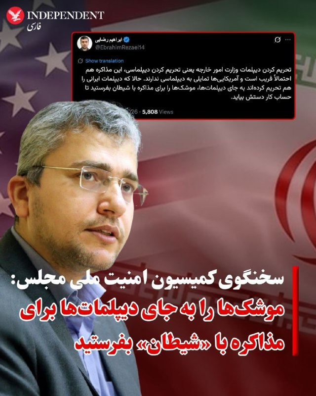
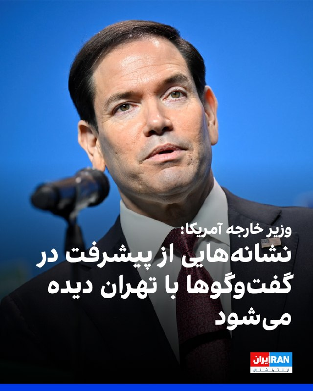
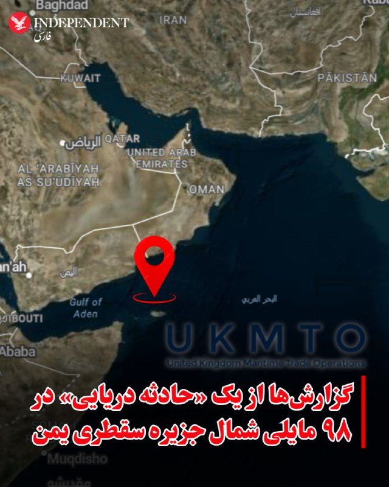
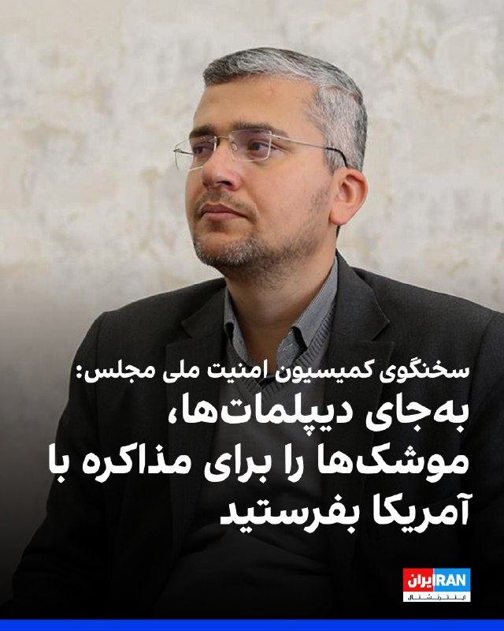
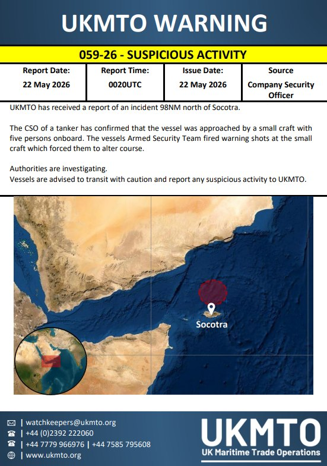
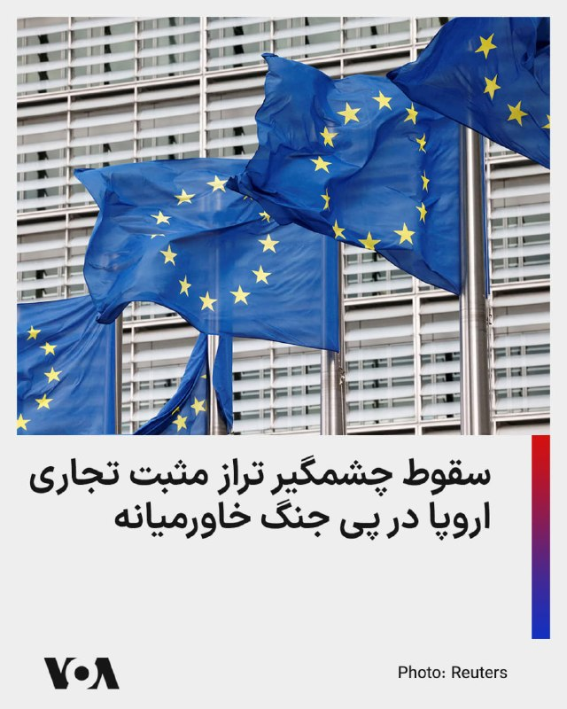
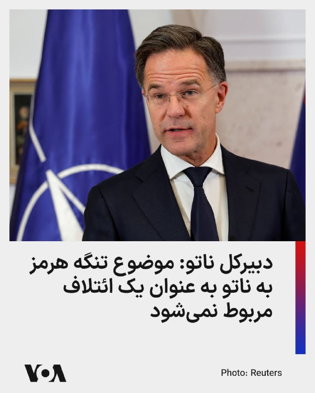
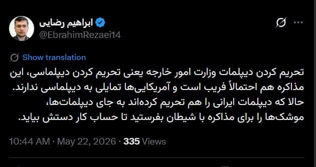
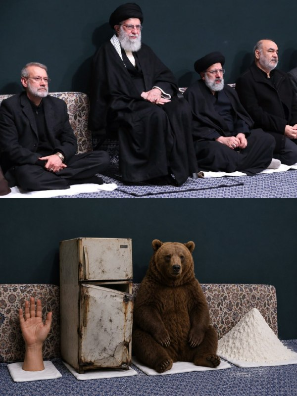
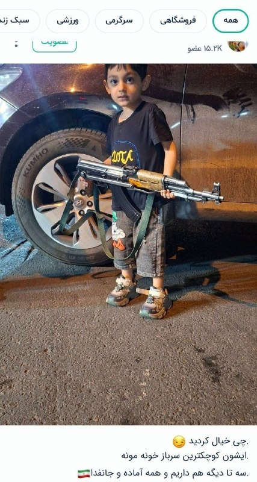

# خواننده تلگرام

<!-- TOP_NAV START -->

<a href="https://github.com/ERAGON007/aio-downloader-testing/blob/main/telegram/content/archive_1.md" style="display:inline-block; padding:6px 12px; margin:0 4px; background-color:#2ea44f; color:white; text-decoration:none; border-radius:4px; font-weight:bold;">صفحه بعد</a>

<!-- TOP_NAV END -->

<!-- MSG START -->

---
📅 بروزرسانی: 1405/03/01 13:00
---

## VahidOOnLine — post 241493

  

♦️مارکو روبیو، وزیر امور خارجه آمریکا روز جمعه اول خردادماه گفت پیشرفت‌های اندکی در مذاکرات با جمهوری اسلامی ایران حاصل شده است.
روبیو که برای شرکت در اجلاس وزاری خارجه ناتو به هلسینبورگ سوئد رفته است،‌ یک روز پیش از این هم گفته بود که «نشانه‌هایی از پیشرفت در مذاکرات با تهران دیده می‌شود.»

این سخنان در حالی عنوان می‌شود که تلویزیون الجزیره قطر روز جمعه به نقل از یک مقام آگاه پاکستان گزارش داد که کوتاه نیامدن تهران و واشنگتن درباره ذخایر اورانیوم و تنگه هرمز، باعث بن‌بست در مذاکرات شده است.
‌🇸🇦 Indypersian

🤖 @VahidOOnLine

## VahidOOnLine — post 241492

بحران جمعیت برای جمهوری اسلامی؛ چرا ایرانی‌ها دیگر فرزند نمی‌آورند؟
نعیمه دوستدار- کاهش تعداد تولدها در ایران و سقوط آمار موالید به زیر یک میلیون، بحران جمعیتی را به مرکز سیاست‌گذاری جمهوری اسلامی بازگردانده است. مساله جمعیت دیگر فقط یک نگرانی آماری نیست، بلکه موضوعی سیاسی، امنیتی و ایدئولوژیک برای حکومت است.
در روزهای اخیر، بحث جمعیت بار دیگر به یکی از موضوعات مهم در فضای سیاسی و رسانه‌ای ایران تبدیل شده است. این موج تازه پس از انتشار پیامی منتسب به مجتبی خامنه‌ای، رهبر غایب جمهوری اسلامی، درباره ضرورت افزایش جمعیت آغاز شد. پیامی که در آن، رشد جمعیت به‌عنوان مساله‌ای راهبردی برای آینده ایران توصیف شده است.
تقریبا هم‌زمان با این پیام، علیرضا رئیسی، معاون بهداشت وزارت بهداشت، درمان و آموزش پزشکی، در اظهاراتی هشدار داد تعداد موالید در سال ۱۴۰۳ نسبت به سال قبل حدود هفت درصد کاهش یافته و برای نخستین بار به زیر یک میلیون رسیده است.
بر اساس آمار ارائه‌شده از سوی مقام‌های وزارت بهداشت، تعداد تولدهای ثبت‌شده در سال ۱۴۰۳ حدود ۹۷۹ هزار مورد بوده است. رقمی که نسبت به دهه‌های گذشته کاهش چشمگیری نشان می‌دهد.
رئیسی همچنین گفت که اگر روند فعلی ادامه پیدا کند، رشد جمعیت ایران در دو دهه آینده به نزدیکی صفر خواهد رسید.
این هم‌زمانی معنادار است. از یک سو رهبر دیده نشده جمهوری اسلامی بر ضرورت افزایش جمعیت تاکید می‌کند و از سوی دیگر، مقام‌های رسمی دولت درباره کاهش موالید هشدار می‌دهند.
همین مساله نشان می‌دهد موضوع جمعیت برای جمهوری اسلامی تا چه اندازه جدی است.

‌🏁 🇬🇧 IranintlTV

🤖 @VahidOOnLine

## VahidOOnLine — post 241491

  

مارک روته، دبیرکل ناتو، در نشست وزیران خارجه این ائتلاف در سوئد گفت هرگونه تهدید علیه گذرگاه‌های راهبردی دریایی، از جمله تنگه هرمز، می‌تواند پیامدهای گسترده‌ای برای امنیت بین‌المللی و اقتصاد جهانی داشته باشد.

روته جمعه اول خرداد در دومین روز نشست وزیران خارجه سازمان پیمان نظامی آتلانتیک شمالی (ناتو) در هلسینبورگ سوئد، گفت که این سازمان تحولات مربوط به تنگه هرمز را با دقت دنبال می‌کند و بر حفظ آزادی کشتیرانی و امنیت خطوط انتقال انرژی تاکید دارد.

او همچنین گفت آزادی کشتیرانی در تنگه هرمز موضوعی مهم برای همه اعضای ناتو است، اما ممکن است مستقیما در چارچوب ماموریت رسمی این ائتلاف قرار نگیرد.

روته در عین حال بر ادامه نقش کلیدی آمریکا در امنیت اروپا تاکید کرد و گفت ارسال تجهیزات حیاتی آمریکایی به اوکراین، از جمله سامانه‌های پاتریوت، همچنان برای ناتو اهمیت اساسی دارد.
‌🏁 🇬🇧 IranintlTV

🤖 @VahidOOnLine

## VahidOOnLine — post 241490

  

♦️مارکو روبیو، وزیر خارجه ایالات متحده، روز جمعه یکم خرداد در حاشیه نشست ناتو اظهارات روز پنجشنبه خود در خصوص تلاش تهران برای دریافت عوارض عبور از تنگه هرمز را تکرار کرد و گفت: ایران در پی ایجاد نظامی اختصاصی برای اخذ عوارض در یک آبراه بین‌المللی است و این اقدام «غیرقابل قبول» است.

روبیو با اشاره به اینکه جمهوری اسلامی تلاش می‌کند عمان را نیز برای پیوستن به این سازوکار متقاعد کند، افزود: «من کشوری را نمی‌شناسم که جز ایران از آن حمایت کند و هیچ کشوری در جهان نباید چنین چیزی را بپذیرد.»

وزیر خارجه آمریکا با اشاره به قطعنامه‌ پیشنهادی بحرین در شورای امنیت درباره تنگه هرمز تاکید کرد که واشنگتن برای دستیابی به اجماع جهانی جهت جلوگیری از اجرای چنین طرحی تلاش می‌کند و گفت: «باید دید آیا سازمان ملل همچنان کارآمد است یا نه. ما می‌کوشیم از این مسیر به نتیجه برسیم.»

او همچنین ابراز نگرانی کرد که اگر اخذ عوارض در تنگه هرمز اجرایی شود، ممکن است این رویه در دیگر آبراه‌های مهم جهان نیز تکرار شود.
‌🇸🇦 Indypersian

🤖 @VahidOOnLine

## VahidOOnLine — post 241489

  

یوهان واده‌فول، وزیر خارجه آلمان، اعلام کرد برلین در حال آماده‌سازی برای مشارکت در تلاش‌هایی به رهبری بریتانیا برای تامین امنیت تنگه هرمز است، اما ماموریتی از سوی ناتو به این شکل وجود ندارد.

او گفت گفت‌وگوهای انجام‌شده با آمریکا نشان می‌دهد واشینگتن هرگونه انتقال مسئولیت را با متحدان اروپایی هماهنگ خواهد کرد.

واده‌فول همچنین از تصمیم دونالد ترامپ، رییس‌جمهوری آمریکا، برای اعزام ۵ هزار نیروی اضافی آمریکایی به لهستان استقبال کرد و آن را نشانه‌ای از تداوم تعهدات امنیتی آمریکا دانست.

وزیر خارجه آلمان افزود برلین از آمریکا دعوت کرده است به برنامه اولیه خود برای استقرار موشک‌های دوربرد در آلمان پایبند بماند.
‌🏁 🇬🇧 IranintlTV

🤖 @VahidOOnLine

## VahidOOnLine — post 241488

  

خبرگزاری رویترز گزارش داد یک مقام ارشد آمریکایی اعلام کرد واشینگتن برای اطمینان از تامین مهمات مورد نیاز در جنگ علیه جمهوری اسلامی، به‌طور موقت در روند فروش تسلیحات به تایوان وقفه ایجاد کرده است.

هانگ کائو، سرپرست وزارت نیروی دریایی آمریکا، در جلسه‌ای در سنای آمریکا گفت ایالات متحده می‌خواهد مطمئن شود مهمات کافی برای عملیات «خشم حماسی» علیه جمهوری اسلامی در اختیار دارد، اما فروش‌های نظامی خارجی، هر زمان دولت آمریکا لازم بداند، ادامه خواهد یافت.

دفتر ریاست‌جمهوری تایوان اعلام کرد تاکنون هیچ اطلاعاتی درباره تغییر در روند فروش تسلیحات آمریکا دریافت نکرده است.

رویترز نوشت تایوان در انتظار تایید بسته جدید فروش تسلیحات آمریکاست که ممکن است ارزش آن تا ۱۴ میلیارد دلار باشد.
‌🏁 🇬🇧 IranintlTV

🤖 @VahidOOnLine

## VahidOOnLine — post 241487

  

سعید جلالی‌قدیری، دبیر اتحادیه تولید و صادرات نساجی و پوشاک ایران، گفت کوچک شدن جیب مردم به افت فروش در صنعت پوشاک و نساجی منجر شده است.

او «شرایط نه جنگ نه صلح، نوسانات نرخ ارز و اختلال در تامین مواد اولیه» را از دیگر دلایل افت فروش در این صنعت عنوان کرد.

جلالی‌قدیری افزود صنعت نساجی و پوشاک ایران در آغاز سال جاری با مواردی از جمله انباشت بحران‌های اقتصادی، کاهش قدرت خرید مردم، دشواری در فروش و اختلال در تامین مواد اولیه مواجه است.
‌🏁 🇬🇧 IranintlTV

🤖 @VahidOOnLine

## VahidOOnLine — post 241486

  

مارکو روبیو، وزیر خارجه آمریکا، جمعه یکم خرداد در حاشیه نشست ناتو گفت جمهوری اسلامی در پی ایجاد نظامی اختصاصی برای اخذ عوارض در یک آبراه بین‌المللی است و تلاش می‌کند عمان را نیز به پیوستن به این سازوکار متقاعد کند. روبیو تاکید کرد که این اقدام «غیرقابل قبول» است.

او افزود: «هیچ کشوری در جهان نباید چنین چیزی را بپذیرد. من کشوری را نمی‌شناسم که جز ایران از آن حمایت کند.»

روبیو با اشاره به تحرکات دیپلماتیک در سازمان ملل متحد گفت قطعنامه‌ای با پیشنهاد بحرین در شورای امنیت مطرح شده که آمریکا در آن نقش فعالی داشته و به گفته او، بیشترین تعداد هم‌پیشنهاددهنده را در تاریخ شورای امنیت دارد. او هشدار داد چند کشور در حال بررسی وتوی این قطعنامه هستند و افزود: «این مایه تاسف خواهد بود.»

وزیر خارجه آمریکا تاکید کرد واشینگتن برای دستیابی به اجماع جهانی جهت جلوگیری از اجرای چنین طرحی تلاش می‌کند و گفت: «باید دید آیا سازمان ملل همچنان کارآمد است یا نه. ما می‌کوشیم از این مسیر به نتیجه برسیم.»

او تصریح کرد اگر اخذ عوارض در تنگه هرمز اجرایی شود، ممکن است در دیگر آبراه‌های مهم جهان نیز تکرار شود.
‌🏁 🇬🇧 IranintlTV

🤖 @VahidOOnLine

## VahidOOnLine — post 241485

  

♦️ابراهیم رضایی، سخنگوی کمیسیون امنیت ملی مجلس شورای اسلامی روز جمعه اول خرداد در واکنش به تحریم سفیر جمهوری اسلامی در لبنان از سوی ایالات متحده با «شیطان» خواندن آمریکا گفت: «به جای دیپلمات‌ها، موشک‌ها را برای مذاکره با شیطان بفرستید تا حساب کار دستش بیاید.»
رضایی در پیامی در شبکه اجتماعی ایکس نوشت: «تحریم کردن دیپلمات وزارت امور خارجه یعنی تحریم کردن دیپلماسی، این مذاکره هم احتمالا فریب است و آمریکایی‌ها تمایلی به دیپلماسی ندارند. حالا که دیپلمات ایرانی را هم تحریم کرده‌اند به جای دیپلمات‌ها، موشک‌ها را برای مذاکره با شیطان بفرستید تا حساب کار دستش بیاید.»
پیشتر وزارت خارجه جمهوری اسلامی نیز تحریم محمدرضا رئوف شیبانی، سفیر اخراجی این کشور در لبنان از سوی آمریکا را «غیرقانونی» و «ناموجه» خواند و آن را «بی‌اعتنایی هیئت حاکمه آمریکا به اصول مسلم حقوق بین الملل و منشور سازمان ملل متحد» دانست.
وزارت خزانه‌داری آمریکا روز پنجشنبه اعلام کرد که سفیر جمهوری اسلامی در لبنان را همراه با ۹ نفر مرتبط با حزب‌الله که حاکمیت لبنان را تضعیف می‌کنند تحریم کرده است.
‌🇸🇦 Indypersian

🤖 @VahidOOnLine

## VahidOOnLine — post 241484

روایت شما از زندگی در آتش‌بس- جمعه ۱ خرداد ۱۴۰۵

🔹 کارگر شرکت کروز هستم از تهران. اینجا ماهی چند میلیون بابت غذا از حقوقمون کم می‌کنن، اما فقط برنج خالی می‌دن بخوریم و گاهی وقت‌ها تخم‌مرغ آب‌پز. آب معدنی، نوشابه و تنقلات کنار غذا رو کلاً حذف کردن.
🔹 امروز (۱ خرداد) یک دونه مرغ بسته‌ای خریدم؛ چهار تا سینه مرغ شد یک میلیون و ۳۶۰ هزار تومان. آخه چجوری دیگه میشه زندگی کرد؟
🔹 از کمال‌شهر کرج پیام می‌دم، خواستم بگم زندگی تو ایران اون‌قدری به ما بدهکاره که با پولش می‌شه سه‌تا زندگی دیگه خرید.
🔹 حقوق‌ها کفاف برطرف کردن نیازهای اولیه رو به زور می‌ده. هر روز داره سفره مردم کوچیک‌تر می‌شه، هر روز از دلخوشی‌های کوچیک و از خریدهای روزمره مردم کم می‌شه.
🔹 خدایا ما چه گناهی کردیم که باید تاوان نسل ۵۷ رو بدیم؟ ما جوونایی که اول راه زندگی بودیم، حالا زیر سایه جنگ، خفقان، فقر و ترس له می‌شیم. چرا ظالم‌ها آسوده حکومت می‌کنن و مردمی که فقط زندگی می‌خواستن، هر روز بیشتر تو تاریکی و ناامیدی فرو می‌رن؟
🔹 کارخانه لاستیک بارز کرمان به‌خاطر نداشتن مواد اولیه داره تعدیل نیرو می‌کنه و شیفت‌هاش رو یک‌سوم کرده.
🔹 از کرمان، من یک دانش‌آموز کلاس هشتم هستم. الان معلوم نیست امتحانات حضوریه یا نه؛ از یک طرف می‌گن حضوریه، از یک طرف می‌گن نیست. بعد از ۳ ماه درس نخوندن چطوری امتحان بدم؟
🔹 علی هستم از شاندیز مشهد. اینجا هم مثل بقیه کشور همه‌چی گرون شده و نمیشه خرید کرد. اینا فقط سر و صدا می‌کنن، آب هم جیره‌بندی شده.
🔹 از اهواز پیام می‌دم. اینجا یعنی کل ایران اوضاع اصلاً خوب نیست. مردم به معیشت و زندگی روزمره خودشون نمی‌رسن. عمو ترامپ لطفاً کارو تموم کن، مذاکره نمی‌خوایم دیگه، ما طاقت نداریم.
🔹 از گله‌دار استان فارس پیام می‌دم. می‌خوان مجسمه خمینی رو که مردم قبلاً آتیشش زده بودن بازسازی کنن. ما دوباره خرابش می‌کنیم.
‌🏁 🇬🇧 IranintlTV

🤖 @VahidOOnLine

## VahidOOnLine — post 241483

  

مارکو روبیو، وزیر خارجه آمریکا، در حاشیه نشست ناتو درباره مذاکرات جاری با جمهوری اسلامی گفت که واشینگتن در انتظار نتایج گفت‌وگوهای در حال انجام است؛ گفت‌وگوهایی که به گفته او نشانه‌هایی از پیشرفت داشته‌اند.

او افزود: «ما در انتظار نتایج این گفت‌وگوها هستیم که نشانه‌هایی از پیشرفت دارد. نمی‌خواهم در این باره اغراق کنم؛ تحرک محدودی صورت گرفته و این مثبت است، اما اصول اساسی تغییری نکرده است.»

وزیر خارجه آمریکا تاکید کرد که حکومت ایران هرگز نباید به سلاح هسته‌ای دست یابد و گفت: «برای تحقق این هدف، باید به مسئله غنی‌سازی و نیز موضوع اورانیوم با غنای بالا رسیدگی کنیم و افزون بر آن، موضوع تنگه هرمز را نیز مد نظر قرار دهیم.»
‌🏁 🇬🇧 IranintlTV

🤖 @VahidOOnLine

## VahidOOnLine — post 241482

  <a href="telegram/content/VahidOOnLine_241482_1779442249.mp4" target="_blank">🎬 Download video</a>

سازمان نظارت بر اینترنت نت‌بلاکس اعلام کرد خاموشی گسترده اینترنت در ایران وارد هشتاد و چهارمین روز شده و دسترسی به شبکه جهانی اینترنت برای بیش از ۱۹۹۲ ساعت همچنان به‌طور گسترده مختل است.
نت‌بلاکس در گزارشی نوشت ادامه این محدودیت‌ها شکاف‌های اجتماعی و اقتصادی را عمیق‌تر کرده و ارتباط با جهان خارج بیش از پیش به «امتیاز، تبعیت و دسترسی ویژه» وابسته شده است.
‌🏁 🇬🇧 ManotoTV

🤖 @VahidOOnLine

## VahidOOnLine — post 241481

  <a href="telegram/content/VahidOOnLine_241481_1779442249.mp4" target="_blank">🎬 Download video</a>

روزنامه وال‌استریت ژورنال گزارش داد هم‌زمان با آماده شدن ایران برای احتمال درگیری با آمریکا، بابک زنجانی، بازرگان ایرانی که خود را «ضدتحریم» معرفی می‌کند، یک شبکه مخفی پرداخت برای تأمین مالی نیروهای نظامی جمهوری اسلامی ایجاد کرده بود که محور اصلی آن صرافی ارز دیجیتال بایننس بوده است.
بر اساس این گزارش، این شبکه تا ماه دسامبر گذشته طی دو سال حدود ۸۵۰ میلیون دلار تراکنش را عمدتاً از طریق یک حساب معاملاتی در بزرگ‌ترین صرافی رمزارز جهان انجام داده است. گزارش‌های داخلی بایننس نشان می‌دهد نزدیکان زنجانی، از جمله خواهرش، شریک عاطفی او و یکی از مدیران شرکتش، حساب‌های دیگری را نیز اداره می‌کردند که همگی از دستگاه‌های مشترک استفاده می‌کردند؛ موضوعی که بازرسان بایننس آن را نشانه‌ای از تلاش برای دور زدن تحریم‌های آمریکا علیه ایران دانسته‌اند.
وال‌استریت ژورنال نوشت با وجود هشدارهای داخلی متعدد، حساب اصلی این شبکه دست‌کم ۱۵ ماه همچنان فعال مانده و تا ژانویه امسال نیز باز بوده است. این گزارش همچنین می‌گوید میلیاردها دلار تراکنش رمزارزی طی دو سال گذشته از طریق بایننس به شبکه‌های مالی مرتبط با سپاه پاسداران منتقل شده است.
مقام‌های خارجی مسئول پیگیری تأمین مالی تروریسم گفته‌اند امسال نیز انتقال پول از طریق حساب‌های بایننس به نهادهای وابسته به جمهوری اسلامی ادامه داشته و تراکنش‌هایی حتی در همین ماه شناسایی شده است.
‌🏁 🇬🇧 ManotoTV

🤖 @VahidOOnLine

## VahidOOnLine — post 241480

  <a href="telegram/content/VahidOOnLine_241480_1779442250.mp4" target="_blank">🎬 Download video</a>

رییس اورژانس پیش‌بیمارستانی و مدیریت حوادث دانشگاه علوم پزشکی البرز اعلام کرد بر اثر تصادف زنجیره‌ای در آزادراه کرج قزوین، سه نفر جان باختند و چهار نفر دیگر مجروح شدند.
به گزارش رسانه‌های داخلی، در این سانحه دو مرد و یک زن کشته شدند و سه مرد و یک زن دیگر نیز مجروح شدند.
مصدومان توسط نیروهای اورژانس به بیمارستان امام جعفر صادق نظرآباد منتقل شدند.
‌🏁 🇬🇧 ManotoTV

🤖 @VahidOOnLine

## VahidOOnLine — post 241479

  <a href="telegram/content/VahidOOnLine_241479_1779442251.mp4" target="_blank">🎬 Download video</a>

وزارت خارجه جمهوری اسلامی تحریم محمدرضا رئوف شیبانی، سفیر ایران در لبنان، از سوی آمریکا را «غیرقانونی» و «ناموجه» توصیف کرد و آن را نشانه «بی‌اعتنایی هیئت حاکمه آمریکا به اصول حقوق بین‌الملل و منشور سازمان ملل» دانست.
این وزارتخانه همچنین تحریم تعدادی از نمایندگان حزب‌الله و مسئولان لبنانی را محکوم کرد و اقدامات آمریکا را «سخیف» و در راستای تضعیف حاکمیت ملی لبنان و «فتنه‌انگیزی در جامعه لبنان» خواند.
‌🏁 🇬🇧 ManotoTV

🤖 @VahidOOnLine

## VahidOOnLine — post 241478

  <a href="telegram/content/VahidOOnLine_241478_1779442252.mp4" target="_blank">🎬 Download video</a>

روزنامه نیویورک‌تایمز گزارش داد ایران و عمان درباره ایجاد یک نظام پرداخت برای عبور کشتی‌ها از تنگه هرمز مذاکره کرده‌اند؛ اقدامی که می‌تواند به معنای دریافت هزینه از کشتی‌های عبوری در یکی از حیاتی‌ترین آبراه‌های جهان باشد.
بر اساس این گزارش، تهران و مسقط تأکید دارند موضوع مطرح‌شده «کارمزد خدمات» است، نه «عوارض عبور»؛ زیرا دریافت عوارض صرف برای عبور از تنگه‌های بین‌المللی طبق حقوق دریاها غیرقانونی تلقی می‌شود. با این حال، کارشناسان حقوقی می‌گویند اگر این کارمزد در عمل همان عوارض باشد، مشروعیت نخواهد داشت.
مقام‌های آمریکایی، از جمله دونالد ترامپ و مارکو روبیو، هرگونه دریافت پول برای عبور از تنگه هرمز را «غیرقابل قبول» توصیف کرده‌اند. کارشناسان نیز هشدار داده‌اند تغییر نام عوارض به «کارمزد» مانع چالش‌های حقوقی بین‌المللی نخواهد شد.
‌🏁 🇬🇧 ManotoTV

🤖 @VahidOOnLine

## VahidOOnLine — post 241477

  <a href="telegram/content/VahidOOnLine_241477_1779442252.mp4" target="_blank">🎬 Download video</a>

فرماندهی مرکزی آمریکا، سنتکام، در حساب کاربری خود در شبکه ایکس اعلام کرد جنگنده‌های نیروی دریایی آمریکا از ناو هواپیمابر «آبراهام لینکلن» در دریای عرب به پرواز درآمده‌اند.
سنتکام افزود گروه ضربتی ناو «آبراهام لینکلن» در بالاترین سطح آمادگی عملیاتی قرار دارد و در چارچوب اجرای محاصره دریایی آمریکا علیه بنادر ایران فعالیت می‌کند.
‌🏁 🇬🇧 ManotoTV

🤖 @VahidOOnLine

## VahidOOnLine — post 241476

  

سایت اقتصادنیوز گزارش داد تورم و کاهش قدرت خرید خانوارها در سال ۱۴۰۵، الگوی خرید مردم را تغییر داده و خرید قسطی را از کالاهای گران‌قیمت به مواد غذایی، اقلام ضروری، لبنیات، شوینده‌ها و اقلام بهداشتی کشانده است.

اقتصادنیوز نوشت خرید قسطی دیگر محدود به کالاهای لوکس یا بزرگ نیست و حتی مواد غذایی و بسته‌های سوپرمارکتی نیز در قالب پرداخت چندمرحله‌ای عرضه می‌شوند؛ تغییری که نشانه کاهش قدرت نقدینگی خانوارهاست.

بر اساس این گزارش، فشار تورمی باعث شده بسیاری از خانوارها به‌جای خرید نقدی کالاهای نو، به خرید قسطی یا کالاهای دست‌دوم روی بیاورند. فروشندگان کالاهای دست‌دوم نیز از افزایش ۴۰ تا ۶۰ درصدی تقاضا در این بازار خبر داده‌اند.
‌🏁 🇬🇧 IranintlTV

🤖 @VahidOOnLine

## VahidOOnLine — post 241475

  

♦️سازمان نظارت بر تجارت دریایی بریتانیا روز جمعه اول خرداد از بروز یک حادثه دریایی در ۹۸ مایلی شمال جزیره سقطری یمن خبر داد.

براساس این گزارش مدیر ارشد امنیت یک نفتکش تایید کرده است که یک قایق کوچک با پنج سرنشین به این کشتی نزدیک شده است. تیم امنیتی کشتی‌ها ببا شلیک هشدار به سوی این قایق کوچک،‌ آن را مجبور به تغییر مسیر کردند.

هنوز جزئیات بیشتری درباره ملیت قایق کوچک، سرنشینان و هدف آن‌ها از نزدیک شدن به این نفتکش منتشر نشده است.
‌🇸🇦 Indypersian

🤖 @VahidOOnLine

## VahidOOnLine — post 241474

  

وب‌سایت نت‌بلاکس، نهاد ناظر بر اختلال‌های اینترنتی در جهان، صبح جمعه اول خرداد اعلام کرد قطع گسترده اینترنت در ایران وارد هشتاد‌وچهارمین روز خود شده و دسترسی به شبکه‌های بین‌المللی برای بیش از هزار و ۹۹۲ ساعت همچنان به‌طور گسترده قطع است.

این نهاد ناظر بر اینترنت نوشت با ادامه این وضعیت، شکاف‌های اجتماعی و اقتصادی عمیق‌تر می‌شود و هر ساعت از قطع اینترنت، ارتباط با جهان خارج را بیش از پیش به جایگاه، همراهی با حاکمیت و برخورداری از امتیاز وابسته می‌کند.
‌🏁 🇬🇧 IranintlTV

🤖 @VahidOOnLine

## WithYashar — post 11932

امروز ۲۲ می (۱ خرداد) روز جهانی پیتزای بیت‌کوین است . این روز به یادبود اولین تراکنش واقعی برای خرید یک کالای فیزیکی با بیت‌کوین در سال ۲۰۱۰ نام‌گذاری شده است که در آن کاربری به نام لازلو هانیچ (Laszlo Hanyecz) دو پیتزا را در ازای ۱۰,۰۰۰ بیت‌کوین خریداری کرد.
@withyashar

## WithYashar — post 11931

وزیر امور خارجه آلمان: ما در حال آماده شدن برای مشارکت در تأمین امنیت تنگه هرمز تحت رهبری بریتانیا هستیم، اما انتظار ماموریتی مشابه ناتو را ندارم
@withyashar

## WithYashar — post 11930

وال استریت ژورنال: میلیاردها دلار از طریق پلتفرم بایننس به شبکه‌هایی که نظام ایران را تامین مالی می‌کنند، جریان یافته است بابک زنجانی شخص مسئول ایرانی در معاملات از طریق پلتفرم بایننس است @withyashar

## WithYashar — post 11929

رسانه‌های داخلی ایران تصاویری منتشر کرده‌اند که نشان می‌دهد نیروهای سپاه به غیرنظامیان و کودکان آموزش باز و بسته کردن سلاح می‌دهند. خبرگزاری «آسوشیتدپرس» نیز گزارش داده نیروهای سپاه به‌طور منظم نحوه استفاده از تفنگ‌های تهاجمی مانند کلاشینکف به غیرنظامیان آموزش می‌دهند. پایتخت ایران همچنین شاهد رژه خودروهای نظامی مجهز به مسلسل‌های قدیمی ساخت شوروی است.
@withyashar

## WithYashar — post 11928

بلومبرگ : پوتین می‌خواهد جنگ اوکراین را تا پایان امسال به پایان برساند، اما فقط با شرایطی که روسیه بتواند آن‌ها را به عنوان پیروزی معرفی کند.

این شرایط شامل کنترل کامل منطقه دونباس و تضمین‌های امنیتی گسترده‌تر از اروپا است که به طور موثر کسب‌های ارضی روسیه در اوکراین را به رسمیت می‌شناسد.
@withyashar

## WithYashar — post 11927

سنتکام: ناو هواپیمابر آبراهام لینکلن در بالاترین سطح آمادگی عملیاتی قرار دارد
@withyashar

## WithYashar — post 11926

سخنگوی کمیسیون امنیت ملی: موشک‌ها را برای مذاکره با شیطان بفرستید.
@withyashar

## WithYashar — post 11925

ترامپ فروش ۱۴ میلیارد دلار سلاح به تایوان را متوقف کرده تا مهمات آمریکا برای جنگ با ایران حفظ شود؛ به‌گفتهِ هانگ کائو، سرپرست وزارت نیروی دریایی آمریکا.

او به سناتورها گفت: “در حال حاضر ما این فروش را متوقف کرده‌ایم تا مطمئن شویم مهماتی که برای عملیات اِپیک فیوری لازم داریم در اختیارمان باشد.” کائو اضافه کرد که آمریکا همچنان “به‌قدرِ کافی” سلاح در اختیار دارد.
@withyashar

## WithYashar — post 11924

وال استریت ژورنال:
میلیاردها دلار از طریق پلتفرم بایننس به شبکه‌هایی که نظام ایران را تامین مالی می‌کنند، جریان یافته است
بابک زنجانی شخص مسئول ایرانی در معاملات از طریق پلتفرم بایننس است
@withyashar

## WithYashar — post 11923

رویترز به نقل از یک منبع پاکستانی:

نگرانی‌هایی وجود دارد که صبر ترامپ رو به پایان باشد، اما ما در حال تلاش برای تسریع روند انتقال پیام‌ها میان دو طرف هستیم
@withyashar

## WithYashar — post 11922

جروزالم پست: مقامات اطلاعاتی اسرائیل هشدار دادند که ایران ممکن است در حال برنامه‌ریزی برای حمله موشکی و پهپادی غافلگیرکننده علیه اسرائیل و کشورهای خلیج فارس باشد
@withyashar

## WithYashar — post 11921

سفارت پاکستان در تهران اعلام کرد، وزیر کشور پاکستان بار دیگر با عباس عراقچی وزیر خارجه ایران دیدار کرد تا پیشنهادات برای حل اختلافات در مذاکرات با آمریکا را بررسی کنند.
@withyashar

## WithYashar — post 11920

رأی‌گیری درباره اختیارات جنگی ترامپ، به دست جمهوری‌خواهان به تعویق افتاد.
@withyashar

## mwarmonitor — post 9460

🔴وزیر خارجه بریتانیا:
«این شرم‌آور است که ایران تلاش می‌کند با جلوگیری از حرکت کشتیرانی بین‌المللی، کل اقتصاد جهانی را به گروگان بگیرد.»

@mwarmonitor

## mwarmonitor — post 9459

🔴منبع پاکستانی به الجزیره:
«اسلام‌آباد همچنان نسبت به امکان رسیدن به یک تفاهم مرحله‌ای میان واشنگتن و تهران خوش‌بین است.»

@mwarmonitor

## mwarmonitor — post 9458

  <a href="telegram/content/mwarmonitor_9458_1779442255.mp4" target="_blank">🎬 Download video</a>

📝 خفه شو نطفه حرامیِ دوزاری، تو رو چه به این گنده‌گوزی‌ها؟ نهایتاً تخصص و سقف پروازت این بوده که سهمیه بگیری و برای خرید باتوم تا حسن‌آباد بدوی، حالا واسه ما تزِ دو سال زندگی و خونه خریدن تو آلمان می‌دی؟ هرچی بیشتر اون دهنِ نجست رو باز می‌کنی، گندِ دروغات بیشتر بالا می‌زنه و بوی تعفنِ جیره‌خوری و اون پایگاه بسیجِ صاحاب‌مرده‌ات از پشت این گوشی بیشتر دنیا رو برمی‌داره. آخه انگلِ ساندیس‌خور، تو رو چه به فرنگ و عکاسی؟ تو نهایتاً بتونی جفت پا بری رو اعصابِ خلق‌الله و لای کفتارها سهمیه گشتِ شبانه‌ات رو بگیری. اینقدر به این آمار و ارقامِ تخیلی و مغزِ شستشو داده‌ات نناز، نطفهٔ ناپاک! تهِ حماسه و تخصص تو همون پرچم گردانی شبانه، پس بتمرگ سر جات و اون دهنِ کثیفت رو ببند!

@mwarmonitor

## mwarmonitor — post 9457

🔸 سخنگوی وزارت امور خارجه پاکستان اعلام کرد: چین از تلاش‌های ما برای میانجی‌گری حمایت می‌کند و به‌همراه ما یک ابتکار پنج‌بندی ارائه داده است.

@mwarmonitor

## mwarmonitor — post 9456

🔴 به نقل از رویترز و به گفته یک منبع پاکستانی:
🔸نگرانی‌هایی وجود دارد که صبر ترامپ رو به پایان باشد، اما ما در حال تلاش برای تسریع روند انتقال پیام‌ها میان دو طرف هستیم.

📝 یعنی هر لحظه امکانش هست دستور حمله بده
@mwarmonitor

## mwarmonitor — post 9455

انفجار در ابوظبی

## mwarmonitor — post 9454

🔴جمهوری‌خواهان مجلس نمایندگان رای‌گیری برای محدود کردن جنگ ترامپ در ایران را لغو کردند

🔰رهبری جمهوری‌خواه مجلس نمایندگان روز پنجشنبه رای‌گیری برنامه‌ریزی‌شده برای محدود کردن مبارزات نظامی پرزیدنت ترامپ در ایران را پس از آنکه مشخص شد آرای کافی برای شکست دادن آن را ندارند، لغو کرد (از دستور کار خارج کرد).

چرا این موضوع اهمیت دارد: این اقدام می‌توانست اولین توبیخ و سرزنش موفقیت‌آمیز تلاش‌های جنگی ترامپ علیه ایران از سوی کنگره باشد؛ آن هم پس از آنکه چندین تلاش دموکرات‌ها برای تصویب قطعنامه اختیارات جنگی شکست خورده بود.
جرد گلدن (نماینده دموکرات از ایالت مین)، تنها دموکراتی که به طور مداوم علیه قطعنامه‌های اختیارات جنگی ایران رای داده بود، قصد داشت این بار رای خود را به «بله» تغییر دهد.
چهار نماینده جمهوری‌خواه به نام‌های برایان فیتزپاتریک (از پنسیلوانیا)، توماس مسی (از کنتاکی)، وارن دیویدسون و تام بارت (از میشیگان) پیش از این از این طرح حمایت کرده بودند.
البته این رای‌گیری تا حد زیادی نمادین است، چرا که ترامپ می‌تواند این مصوبه را وتو کند.
عامل اصلی خبر: رهبران حزب جمهوری‌خواه در نظر دارند پس از بازگشت نمایندگان از تعطیلات یک‌هفته‌ای «روز یادبود» (Memorial Day)، این طرح را دوباره در صحن مجلس مطرح کنند.
رهبران حزب، رای‌گیری مربوط به تاسیس یک موزه زنان را ۴۵ دقیقه باز نگه داشتند تا در این فاصله بتوانند نمایندگان را برای رای دادن علیه قطعنامه اختیارات جنگی متقاعد و بسیج کنند (اصطلاحاً شلاق حزبی بزنند).
این اقدام خشم دموکرات‌ها را برانگیخت؛ تا جایی که وقتی جیم مک‌گاورن (نماینده دموکرات از ماساچوست و عضو ارشد کمیته قوانین مجلس) تلاش کرد این اقدام را زیر سوال ببرد، توسط رئیس جلسه با فریاد ساکت شد.
جرد هافمن (نماینده دموکرات از کالیفرنیا) در این رابطه به اکسیوس (Axios) گفت: «ما هفته گذشته از باخت با اختلاف یک رای به نتیجه مساوی رسیدیم و حالا به این عقب‌نشینی بزدلانه آن‌ها در امشب رسیده‌ایم.»
پشت پرده: غیبت برخی از نمایندگان جمهوری‌خواه باعث می‌شد که این طرح در روز پنجشنبه به تصویب برسد.
وقتی همه اعضای مجلس نمایندگان حضور کامل داشته باشند، مایک جانسون (رئیس مجلس نمایندگان از حزب جمهوری‌خواه) در رای‌گیری‌های کاملاً حزبی، تنها می‌تواند نافرمانی و ریزش تعداد انگشت‌شماری از هم‌حزبی‌هایش را تحمل کند.
مرور سریع: تلاش‌های قبلی برای محدود کردن اختیارات جنگی ترامپ در قبال ایران بارها شکست خورده بود.
انتظار می‌رفت مجلس نمایندگان روز چهارشنبه در مورد این قطعنامه رای‌گیری کند، اما رهبران جمهوری‌خواه به دلیل نگرانی از وضعیت حضور نمایندگان خود، این اقدام را به تاخیر انداختند.
آخرین تلاش دموکرات‌ها هفته گذشته در یک رای‌گیری بی‌سابقه با نتیجه مساوی ۲۱۲–۲۱۲ شکست خورد.
در آن رای‌گیری قبلی، گلدن رای منفی داده بود، در حالی که مسی، فیتزپاتریک و بارت از آن حمایت کردند و چندین قانون‌گذار نیز غایب بودند.
نگاه نزدیک‌تر: ترامپ روز چهارشنبه حملات خود را متوجه برایان فیتزپاتریک (نماینده جمهوری‌خواه) کرد و به خبرنگاران گفت: «او دوست دارد علیه ترامپ رای دهد. می‌دانید نتیجه این کار چیست؟ عاقبت خوبی ندارد.»
با این حال، فیتزپاتریک روز چهارشنبه به اکسیوس گفت که با وجود تهدیدهای رئیس‌جمهور، همچنان قصد دارد به این طرح رای مثبت دهد. او گفت: «ما در واشنگتن به هیچ حزب یا شخص خاصی گزارش نمی‌دهیم و بله‌قربان‌گو نیستیم.»
تصویر بزرگ‌تر: اگرچه جمهوری‌خواهان تا حد زیادی از کارزار نظامی ترامپ حمایت کرده‌اند، اما با طولانی شدن این درگیری بدون مجوز کنگره، نارضایتی و بی‌اعتمادی در میان آن‌ها افزایش یافته است.
برخی از جمهوری‌خواهان به ضرب‌الاجل ۶۰ روزه قانون اختیارات جنگی اشاره می‌کنند که اکنون منقضی شده است؛ قانونی که بر اساس آن در صورت عدم تایید کنگره، نیروهای آمریکایی ملزم به عقب‌نشینی هستند و این موضوع اکنون به یک نقطه عطف تبدیل شده است.

📌در مقابل، کاخ سفید استدلال می‌کند که این الزام به دلیل برقراری آتش‌بس با ایران، دیگر نافذ و قابل اجرا نیست.

@mwarmonitor

## mwarmonitor — post 9453

🔸دو فرد مطلع از گفتگوها درباره مدیریت این آبراه گفتند که ایران برنامه‌ای برای ایجاد یک سیستم عوارض که صرفاً برای عبور و مرور هزینه دریافت کند، ندارد. در عوض، در گفتگوها با عمان، پیشنهاد دریافت هزینه از کشتی‌ها در قبال ارائه «خدمات» مورد بررسی قرار گرفته است.

🔹به گفته دو مقام ایرانی مطلع از این گفتگوها که مجاز به مصاحبه علنی نبودند، عمان در ابتدا مشارکت مشترک با ایران در این تنگه را رد کرده بود، اما اکنون در حال گفتگو درباره سهمی از درآمدها است. این مقامات گفتند که عمان به ایرانی‌ها اعلام کرده است با درک منافع اقتصادی بالقوه یک سیستم کارمزد، حاضر است از نفوذ خود بر همسایگانش در خلیج [فارس] از جمله بحرین، کویت، قطر، عربستان سعودی و امارات متحده عربی و همچنین ایالات متحده برای پیشبرد این طرح استفاده کند. «نیویورک تایمز »

@mwarmonitor

## mwarmonitor — post 9452

  

🔴نیروی دریایی ایالات متحده نیروی دریایی ایالات متحده با موفقیت شماری از ناقضان تحریم‌ها را در سواحل شرقی عمان متوقف کرد. در یک نمونه قابل مشاهده، نفتکش آفراماکس LEVIN (شماره IMO: 9293155) که معمولاً مقادیر زیادی نفت ایران را حمل می‌کند، پس از هدایت مجدد به دریای عرب، توسط یک شناور نیروی دریایی آمریکا تعقیب شد؛ این کشتی در زمان تعقیب بدون محموله بود.

🔸با این حال، مشاهده شد که چندین نفتکشِ بدون تحریم اما مرتبط با ایران وارد محدوده محاصره شده‌اند، زیرا دفتر کنترل دارایی‌های خارجی وزارت خزانه‌داری آمریکا (OFAC) هنوز آن‌ها را تحریم نکرده است. در حال حاضر، ۴۹ نفتکش از این دست در داخل این محدوده حضور دارند.

@mwarmonitor

## mwarmonitor — post 9451

  

🔴پدافند هوایی در امارات متحده عربی در حالت آماده‌باش بالا قرار دارد. شب گذشته، جنگنده‌های آمریکایی بر فراز ابوظبی ترانسپوندرهای خود را روشن کردند تا از هدف قرار گرفتن اشتباهی (آتشِ خودی) جلوگیری شود:

✈️یک فروند• F-16CG Fighting Falcon (شماره ثبت 89-2047، هگز AE26CC)
✈️• یک جنگنده نامشخص با کال‌ساین VIPER82 (هگز 15C4DA)

🔸این پروازها با پشتیبانی یک هواپیمای سوخت‌رسان KC-46A از تل‌آویو انجام شده‌اند.

@mwarmonitor

## mwarmonitor — post 9450

🔴روزنامه وال‌استریت ژورنال گزارش داد: وزارت دادگستری ایالات متحده تحقیقاتی را درباره استفاده ایران از پلتفرم بایننس به‌منظور دور زدن احتمالی تحریم‌ها آغاز کرده است.

@mwarmonitor

## pm_afshaa — post 91183

🔴جروزالم پست: مقامات اطلاعاتی اسرائیل هشدار دادند که ایران ممکن است در حال برنامه‌ریزی برای حمله موشکی و پهپادی غافلگیرکننده علیه اسرائیل و کشورهای خلیج فارس باشد

💧 Rainbet.com the #1 Non-KYC Crypto Casino & Sportsbook @rainbetcom

😁 @Pm_Afshaa

## pm_afshaa — post 91182

🔴وال استریت ژورنال: وزارت دادگستری آمریکا تحقیقات خود را درباره استفاده ایران از پلتفرم بایننس برای احتمالا دور زدن تحریم‌ها آغاز کرده

💧 Rainbet.com the #1 Non-KYC Crypto Casino & Sportsbook @rainbetcom

😁 @Pm_Afshaa

## pm_afshaa — post 91181

🔴سخنگوی کاخ کرملین: پوتین طرح انتقال اورانیوم ایران به روسیه رو با شی‌جی پینگ در میون گذاشته

💧 Rainbet.com the #1 Non-KYC Crypto Casino & Sportsbook @rainbetcom

😁 @Pm_Afshaa

## DEJradio — post 4836

  <a href="telegram/content/DEJradio_4836_1779442259.webm" target="_blank">🎬 Download video</a>

🚨📢 محاصره دریایی ایران؛
ذخیره‎سازی نفت در نفتکش‌های قدیمی و کوچک

روزنامه فایننشال‌تایمز گزارش داد جمهوری اسلامی در پی محاصره دریایی توسط آمریکا و کاهش شدید امکان صادرات نفت، به ذخیره‌سازی نفت روی نفتکش‌های فرسوده در خلیج فارس روی آورده است. این اقدام نشان‌دهنده فشار فزاینده بر صادرات نفت ایران در هفته‌های اخیر است.

براساس آخرین داده‌ها مخازن نفتکش‌های قدیمی هم پر شده و برای ذخیره نفت تولیدی از شناورهای کوچک‌تر استفاده می‌شود.
بر اساس تحلیل تصاویر ماهواره‌ای آژانس فضایی اروپا، تعداد نفتکش‌های متوقف‌شده در اطراف جزیره خارک، مهم‌ترین پایانه صادرات نفت ایران، از شش کشتی در یک ماه پیش به ۲۰ کشتی رسیده است. بسیاری از این کشتی‌ها سامانه‌های موقعیت‌یاب خود را خاموش کرده‌اند و در داده‌های معمول کشتیرانی قابل مشاهده نیستند.

نیما منصفی تحلیلگر «اطلاعات ژئوفضایی» با استناد به تصاویر ماهواره‌ای از ترمینال نفتی خارگ در «ایکس» نوشت، «دو نفتکش کوچک که سابقا مصرف داخلی داشتند در حال بارگیری در جزیره خارگ هستند. ظرفیت آنها حداکثر ۱۵۰ هزار بشکه است».

#محاصره_دریایی #خلیج_فارس #تنگه_هرمز
@DEJradio

## DEJradio — post 4835

  <a href="telegram/content/DEJradio_4835_1779442259.mp4" target="_blank">🎬 Download video</a>

🤡
🔺 چادری‌ها بی‌حجاب‌های حکومتی را تحمل نمی‌کنند.

#حجاب #چادری #تجمعات_حکومتی
@DEJradio

## DEJradio — post 4834

  <a href="telegram/content/DEJradio_4834_1779442261.webm" target="_blank">🎬 Download video</a>

🚨
⭕️ منابع مطلع به دژ می‌گویند، بامداد آدینه ابتدای خرداد، حوالی ساعت ۰۲:۰۰ در بهشهر استان مازندران محله «سارو»، فردی به‌نام حسین محمدی توسط ماموران نیروی انتظامی کشته شده است.

ایست بازرسی و گشت محله‌محور که توسط ماموران نیروی انتظامی [یگان امداد] برقرار شده بود یک ماشین پژو پارس را متوقف می‌کند و با بدرفتاری و توهین دو سرنشین را بازرسی بدنی می‌شوند.

شاهدان می‌گویند پلیس به دو جوان حرف‌های تحقیرآمیز زده‌اند.

حسین محمدی (پدر یکی از سرنشینان) برای آرام کردن قضیه وارد می‌شود اما ماموران به او نیز توهین می‌کنند و درگیر می‌شوند که یکی از ماموران او را با تیر مستقیم کلت به قتل می‌رساند. در پی این اقدام مردم و نیروی انتظامی درگیر شدند.

#مازندران #قتل #حسین_محمدی
@DEJradio

## DEJradio — post 4833

  <a href="telegram/content/DEJradio_4833_1779442262.webm" target="_blank">🎬 Download video</a>

🔺📢 اعتصاب مرغ‌داران بهبهان در استان خوزستان موجب کمبود مرغ در شهر شده است.
مرغ‌داران که ۸ روز است در اعتصاب به سر می‌برند، علت اعتصاب خود را بالا بودن هزینه‌ها عنوان کرده‌اند.
در مرغ‌فروشی‌ها تنها ران یخ زده مرغ که از شهرهای دیگر آورده می‌شود موجود است و هر کیلو نزدیک به ۴۰۰ هزار تومان به فروش می‌رسد که توان خرید آن برای اقشار ضعیف اصلا ممکن نیست.
مرغ‌داران می‌گویند توان تامین ذرت و سویا را ندارند و بدهکارند.

#مرغ #تورم
@DEJradio

## DEJradio — post 4832

  <a href="telegram/content/DEJradio_4832_1779442262.webm" target="_blank">🎬 Download video</a>

🚨📢 منابع غیررسمی می‌گویند احتمال دارد آمریکا برای آن‌دسته بازیکنان و اعضای کادر فنی تیم فوتبال جمهوری اسلامی که پیشینه حضور در تیم‌های سـ.ـپاه و بـ.ـسیج را دارند ویزا صادر نکند.

سوشا مکانی دروازه‌بان سابق تیم پرسپولیس و تیم ملی فوتبال، با اشاره به حضور بازیکنان تیم فوتبال در سفارت آمریکا در آنکارا برای دریافت ویزا، در استوری اینستاگرامش نوشت: «اگر فشار جیانی اینفانتینو [رئیس فیفا] به آمریکا نتیجه نده، مهدی طارمی، شجاع خلیل‌زاده، احسان حاج‌صفی و... به دلیل سربازی در سـ.ـپاه جام جهانی رو از دست میدن. روزبه چشمی هم سربازیش تو باشگاه مقاومت بـ.ـسیج بوده... سعید الهویی و آندرو تیموریان هم سرباز ســ.ـپاه بودند. اگر آمریکا تهدیدات کلامی چند بازیکن در تجمعات شبانه رو مبنا قرار بده چند بازیکن دیگه هم جا می‌مونند.»

بر اساس آخرین گزارش‌ها ادعا شد روزبه چشمی در اردوی آنتالیا مصدوم شده و احتمالا از فهرست تیم خط می‌خورد.
اعضای تیم فوتبال پنجشنبه ۳۱ اردیبهشت برای دریافت ویزا به سفارت آمریکا در آنکارا رفتند.

#تیم_ملی #تحریم
@DEJradio

## DEJradio — post 4831

  <a href="telegram/content/DEJradio_4831_1779442263.webm" target="_blank">🎬 Download video</a>

🔺📢 بر اساس اطلاعات دریافتی از ایران، حقوق اردیبهشت بازنشستگان صندوق بازنشستگی نیرو‌های مسلح واریز شده است اما برخلاف اعلام قبلی، مبلغ «فوق‌العاده خاص» افزایش نیافته است.
این مبلغ اضافه فقط ۶۰۰ هزار تومان (برابر با ۵ دلار) بود!

منابع نظامی می‌گویند سازمان برنامه و بودجه به علت ناکافی بودن منابع، با تامین اعتبار برای افزایش این مولفه مزدی موافقت نکرده است.

گفتنی است حقوق اردیبهشت پرسنل نیروهای مسلح بازنشسته‌های لشکری با تأخیر طولانی واریز شده است. همچنین پرسنل ارتش می‌گویند «بسیاری از داروها حتی آنهایی که در داخل تولید می‌شود از فهرست بیمه خدمات درمانی خارج شده‌ است و حتی آنتی‌بیوتیک‌ها و مُسکن‌ها آزاد حساب می‌شوند.»

دو ماه بعد از جنگ ۴۰ روزه باوجود اینکه نیروهای مسلح با تلفات سنگینی روبه‌رو شدند اما حکومت کمترین توجه را به آنها ندارد و نارضایتی بین آنها تشدید شده است.

#نیرو‌های_مسلح #ارتش
@DEJradio

## kianmeli1 — post 87552

  <a href="telegram/content/kianmeli1_87552_1779442263.mp4" target="_blank">🎬 Download video</a>

🔴میلیاردها دلار از طریق بابک زنجانی و صرافی بایننس برای تامین مالی سپاه پاسداران جابجا کرده است

ایران طی سال‌های اخیر میلیاردها دلار را از طریق صرافی رمزارزی «بایننس» جابه‌جا کرده تا شبکه‌های مالی مرتبط با سپاه پاسداران را تامین کند؛ تراکنش‌هایی که به گفته این رسانه، حتی تا همین ماه نیز ادامه داشته‌اند.

بر اساس گزارش وال استریست ژورنال، این انتقال‌ها شامل حدود ۸۵۰ میلیون دلار تنها از طریق یک حساب کاربری در بایننس بوده که طی دو سال توسط بابک زنجانی، تاجر ایرانی و آنچه در اسناد داخلی «اپراتور ضدتحریم» خوانده شده، اداره می‌شد.

گزارش می‌گوید سیستم‌های نظارتی داخلی بایننس دست‌کم ۱۲ بار این حساب را به‌عنوان حساب مشکوک علامت‌گذاری کرده بودند، اما این حساب بیش از ۱۵ ماه پس از نخستین هشدار همچنان فعال باقی ماند.

این گزارش همچنین از انتقال ۲۱۸ میلیون دلار به شبکه مالی وابسته به حکومت ایران از طریق یک کیف‌پول مرتبط با بایننس خبر می‌دهد. وال‌استریت ژورنال پیش‌تر گزارش داده بود که حدود ۱.۷ میلیارد دلار از طریق بایننس به همین شبکه مالی ایرانی منتقل شده است.
https://t.me/kianmeli1

## kianmeli1 — post 87551

  <a href="telegram/content/kianmeli1_87551_1779442265.mp4" target="_blank">🎬 Download video</a>

🔴صدای #بنیامین_نقدی و #منوچهر_فلاح باشیم

بنیامین نقدی، از معترضان بازداشت شده در ۱۳ دی‌ماه خونین در شهر شیراز است. وضعیت پرونده‌سازی، اخذ اعتراف اجباری و کینه‌ی قضات شیراز در تسریع اجرای حکم اعدام، جان او را در خطر جدی قرار داده است. همچنین منوچهر فلاح توسط قاضی مرگ گیلان «احمد درویش گفتار» پس از رد اعاده‌ی دادرسی دوباره به اعدام محکوم شده.

در روزها و ساعاتی که ماشین سرکوب جمهوری اسلامی، هر جان و نام بازداشتی محکوم به اعدام را تنها به عددی در کارنامه‌ی خونین خود بدل میکند، نام‌شان را فریاد بزنیم، آنها جز ما فریادرسی ندارند
https://t.me/kianmeli1

## kianmeli1 — post 87550

  <a href="telegram/content/kianmeli1_87550_1779442267.mp4" target="_blank">🎬 Download video</a>

🔴حزب‌الله با پهپاد انتحاری، یکی از باتری‌های گنبد آهنین اسرائیل را هدف قرار داده است

دقیقا مشخص نیست این نوع پهپادهای سبک از کجا تامین میشوند
https://t.me/kianmeli1

## kianmeli1 — post 87549

  

🔴درگیری در ایران به هند ضربه سختی وارد کرده است. این کشور به نفت وارداتی متکی است که بخش عمده آن از طریق تنگه هرمز وارد می‌شود، بنابراین افزایش قیمت انرژی باعث تضعیف رشد، افزایش تورم و ترساندن سرمایه‌گذاران می‌شود.

مودیز در حال حاضر پیش‌بینی رشد هند را به ۶ درصد کاهش داده است - بسیار کمتر از ۸ درصدی که مودی می‌گوید برای تبدیل هند به یک کشور توسعه‌یافته تا سال ۲۰۴۷ لازم است.

در عین حال، ترامپ به چین و پاکستان، دو رقیب اصلی هند، نزدیک‌تر شده است و سال‌ها تلاش مودی برای ایجاد روابط قوی‌تر با واشنگتن را تضعیف می‌کند.
https://t.me/kianmeli1

## IranIntlTV — post 338385

بحران جمعیت برای جمهوری اسلامی؛ چرا ایرانی‌ها دیگر فرزند نمی‌آورند؟
نعیمه دوستدار- کاهش تعداد تولدها در ایران و سقوط آمار موالید به زیر یک میلیون، بحران جمعیتی را به مرکز سیاست‌گذاری جمهوری اسلامی بازگردانده است. مساله جمعیت دیگر فقط یک نگرانی آماری نیست، بلکه موضوعی سیاسی، امنیتی و ایدئولوژیک برای حکومت است.
در روزهای اخیر، بحث جمعیت بار دیگر به یکی از موضوعات مهم در فضای سیاسی و رسانه‌ای ایران تبدیل شده است. این موج تازه پس از انتشار پیامی منتسب به مجتبی خامنه‌ای، رهبر غایب جمهوری اسلامی، درباره ضرورت افزایش جمعیت آغاز شد. پیامی که در آن، رشد جمعیت به‌عنوان مساله‌ای راهبردی برای آینده ایران توصیف شده است.
تقریبا هم‌زمان با این پیام، علیرضا رئیسی، معاون بهداشت وزارت بهداشت، درمان و آموزش پزشکی، در اظهاراتی هشدار داد تعداد موالید در سال ۱۴۰۳ نسبت به سال قبل حدود هفت درصد کاهش یافته و برای نخستین بار به زیر یک میلیون رسیده است.
بر اساس آمار ارائه‌شده از سوی مقام‌های وزارت بهداشت، تعداد تولدهای ثبت‌شده در سال ۱۴۰۳ حدود ۹۷۹ هزار مورد بوده است. رقمی که نسبت به دهه‌های گذشته کاهش چشمگیری نشان می‌دهد.
رئیسی همچنین گفت که اگر روند فعلی ادامه پیدا کند، رشد جمعیت ایران در دو دهه آینده به نزدیکی صفر خواهد رسید.
این هم‌زمانی معنادار است. از یک سو رهبر دیده نشده جمهوری اسلامی بر ضرورت افزایش جمعیت تاکید می‌کند و از سوی دیگر، مقام‌های رسمی دولت درباره کاهش موالید هشدار می‌دهند.
همین مساله نشان می‌دهد موضوع جمعیت برای جمهوری اسلامی تا چه اندازه جدی است.

https://www.iranintl.com/fa/202605206473

## IranIntlTV — post 338384

  

مارک روته، دبیرکل ناتو، در نشست وزیران خارجه این ائتلاف در سوئد گفت هرگونه تهدید علیه گذرگاه‌های راهبردی دریایی، از جمله تنگه هرمز، می‌تواند پیامدهای گسترده‌ای برای امنیت بین‌المللی و اقتصاد جهانی داشته باشد.

روته جمعه اول خرداد در دومین روز نشست وزیران خارجه سازمان پیمان نظامی آتلانتیک شمالی (ناتو) در هلسینبورگ سوئد، گفت که این سازمان تحولات مربوط به تنگه هرمز را با دقت دنبال می‌کند و بر حفظ آزادی کشتیرانی و امنیت خطوط انتقال انرژی تاکید دارد.

او همچنین گفت آزادی کشتیرانی در تنگه هرمز موضوعی مهم برای همه اعضای ناتو است، اما ممکن است مستقیما در چارچوب ماموریت رسمی این ائتلاف قرار نگیرد.

روته در عین حال بر ادامه نقش کلیدی آمریکا در امنیت اروپا تاکید کرد و گفت ارسال تجهیزات حیاتی آمریکایی به اوکراین، از جمله سامانه‌های پاتریوت، همچنان برای ناتو اهمیت اساسی دارد.
https://iranintl.com/202605229748

## IranIntlTV — post 338383

  <a href="telegram/content/IranIntlTV_338383_1779442271.mp4" target="_blank">🎬 Download video</a>

بر اساس تصاویر رسیده به ایران‌اینترنشنال، تجمع دانش‌آموزان و خانواده‌هایشان در اعتراض به حضوری شدن امتحانات در شهرکرد که تا ساعات پایانی شب ادامه داشت، با دخالت نیروهای حکومتی مواجه شد. ماموران در تاریکی شب با استفاده از شوکر به دانش‌آموزان و خانواده‌های معترض حمله کردند.
جزییات بیشتر با لیلا سعادتی، عضو تحریریه ایران‌اینترنشنال
@iranintltv

## IranIntlTV — post 338382

  

یوهان واده‌فول، وزیر خارجه آلمان، اعلام کرد برلین در حال آماده‌سازی برای مشارکت در تلاش‌هایی به رهبری بریتانیا برای تامین امنیت تنگه هرمز است، اما ماموریتی از سوی ناتو به این شکل وجود ندارد.

او گفت گفت‌وگوهای انجام‌شده با آمریکا نشان می‌دهد واشینگتن هرگونه انتقال مسئولیت را با متحدان اروپایی هماهنگ خواهد کرد.

واده‌فول همچنین از تصمیم دونالد ترامپ، رییس‌جمهوری آمریکا، برای اعزام ۵ هزار نیروی اضافی آمریکایی به لهستان استقبال کرد و آن را نشانه‌ای از تداوم تعهدات امنیتی آمریکا دانست.

وزیر خارجه آلمان افزود برلین از آمریکا دعوت کرده است به برنامه اولیه خود برای استقرار موشک‌های دوربرد در آلمان پایبند بماند.
https://iranintl.com/202605225671

## IranIntlTV — post 338381

  <a href="telegram/content/IranIntlTV_338381_1779442273.mp4" target="_blank">🎬 Download video</a>

یک شهروند با ارسال پیامی به ایران اینترنشنال گفت که ماموران ایست بازرسی از اموال مردم هنگام توقف سرقت می‌کنند. پیام او با هوش مصنوعی خوانده شده است.

## IranIntlTV — post 338380

🔻پاکستان در تلاش برای دستیابی به پیشرفت در مذاکرات واشینگتن و تهران

هم‌زمان با ادامه اختلاف‌ها میان تهران و واشینگتن بر سر ذخایر اورانیوم غنی‌شده در ایران و کنترل تنگه هرمز، پاکستان در تلاش است زمینه دستیابی به توافقی برای پایان جنگ آمریکا و اسرائیل با جمهوری اسلامی را فراهم کند.

خبرگزاری رویترز جمعه اول خرداد در گزارشی نوشت عباس عراقچی، وزیر امور خارجه جمهوری اسلامی، با محسن نقوی، وزیر کشور پاکستان، در تهران دیدار کرد تا درباره پیشنهادهای مربوط به پایان جنگ آمریکا و اسرائیل علیه حکومت ایران گفت‌وگو کند.

بر اساس گزارش رسانه‌ها در ایران، این دومین دور گفت‌وگوهای نقوی با مقام‌های ایرانی در دو روز گذشته بوده است.

رویترز نوشت اسلام‌آباد در تلاش است ارتباط میان تهران و واشینگتن را تسهیل کند تا چارچوبی برای پایان جنگ و حل اختلاف‌ها شکل بگیرد.
نشانه‌های مثبت

مارکو روبیو، وزیر خارجه آمریکا، ۳۱ اردیبهشت گفت در مذاکرات «نشانه‌های مثبتی» دیده می‌شود، اما هشدار داد اگر جمهوری اسلامی طرح دریافت عوارض از کشتی‌های عبوری از تنگه هرمز را اجرا کند، دستیابی به توافق ممکن نخواهد بود.

او گفت: «ما می‌خواهیم این مسیر باز و آزاد باشد. تنگه هرمز یک آبراه بین‌المللی است.»

یک منبع ارشد ایرانی نیز به رویترز گفت اختلاف‌ها میان دو طرف کاهش یافته، اما موضوع غنی‌سازی اورانیوم و تنگه هرمز همچنان از اصلی‌ترین موانع توافق هستند.

جنگ جاری شوک بزرگی به اقتصاد جهانی وارد کرده و افزایش قیمت نفت، نگرانی‌ها را درباره تورم تشدید کرده است.

پیش از آغاز جنگ، حدود یک‌پنجم صادرات جهانی نفت و گاز طبیعی مایع از تنگه هرمز عبور می‌کرد.

هم‌زمان ارزش دلار آمریکا به بالاترین سطح شش هفته گذشته نزدیک شده و قیمت نفت نیز در پی تردید بازارها نسبت به موفقیت مذاکرات، افزایش یافته است.
اورانیوم و تنگه هرمز

دونالد ترامپ، رییس‌جمهوری آمریکا، ۳۱ اردیبهشت گفت واشینگتن در نهایت ذخایر اورانیوم غنی‌شده ایران را در اختیار خواهد گرفت.

او گفت: «آن را به دست خواهیم آورد. به آن نیاز نداریم و احتمالا بعد از به دست آوردنش نابودش خواهیم کرد، اما اجازه نمی‌دهیم ایران آن را داشته باشد.»

دو منبع ارشد ایرانی پیش‌تر به رویترز گفته بودند مجتبی خامنه‌ای، رهبر سوم جمهوری اسلامی، دستور داده ذخایر اورانیوم غنی‌شده از ایران خارج نشود.
پیشنهاد تازه جمهوری اسلامی که این هفته به آمریکا ارائه شده، شامل درخواست‌هایی مانند کنترل تنگه هرمز، دریافت غرامت جنگ، لغو تحریم‌ها، آزادسازی دارایی‌های بلوکه‌شده و خروج نیروهای آمریکایی از منطقه است. درخواست‌هایی که ترامپ پیش‌تر آن‌ها را رد کرده بود.

هم‌زمان آژانس بین‌المللی انرژی اعلام کرد جنگ جاری «بدترین شوک انرژی جهان» را ایجاد کرده است.

این نهاد هشدار داد هم‌زمانی اوج تقاضای تابستانی و کمبود عرضه جدید از خاورمیانه، ممکن است بازار انرژی را در ماه‌های ژوییه و اوت وارد «منطقه قرمز» کند.
🔗وب‌سایت ایران‌اینترنشنال
@iranintltv

## IranIntlTV — post 338379

  <a href="telegram/content/IranIntlTV_338379_1779442275.mp4" target="_blank">🎬 Download video</a>

دادستانی فدرال آلمان اعلام کرد علیه یک شهروند دانمارکی با اصالت افغانستانی به اتهام جاسوسی برای جمهوری اسلامی اعلام جرم کرده‌ است. این فرد متهم است که به دستور نهادهای اطلاعاتی جمهوری اسلامی، اقدام به جمع‌آوری اطلاعات درباره یهودیان ساکن آلمان با هدف آماده‌سازی برای عملیات ترور و آتش‌سوزی کرده‌ است.
جزییات بیشتر با احمد صمدی، خبرنگار ایران‌اینترنشنال
@iranintltv

## IranIntlTV — post 338378

  

خبرگزاری رویترز گزارش داد یک مقام ارشد آمریکایی اعلام کرد واشینگتن برای اطمینان از تامین مهمات مورد نیاز در جنگ علیه جمهوری اسلامی، به‌طور موقت در روند فروش تسلیحات به تایوان وقفه ایجاد کرده است.

هانگ کائو، سرپرست وزارت نیروی دریایی آمریکا، در جلسه‌ای در سنای آمریکا گفت ایالات متحده می‌خواهد مطمئن شود مهمات کافی برای عملیات «خشم حماسی» علیه جمهوری اسلامی در اختیار دارد، اما فروش‌های نظامی خارجی، هر زمان دولت آمریکا لازم بداند، ادامه خواهد یافت.

دفتر ریاست‌جمهوری تایوان اعلام کرد تاکنون هیچ اطلاعاتی درباره تغییر در روند فروش تسلیحات آمریکا دریافت نکرده است.

رویترز نوشت تایوان در انتظار تایید بسته جدید فروش تسلیحات آمریکاست که ممکن است ارزش آن تا ۱۴ میلیارد دلار باشد.
https://iranintl.com/202605228754

## IranIntlTV — post 338377

  <a href="telegram/content/IranIntlTV_338377_1779442277.mp4" target="_blank">🎬 Download video</a>

اسماعیل بقایی، سخنگوی وزارت خارجه جمهوری اسلامی، گمانه‌زنی‌های مطرح‌شده درباره ابعاد مذاکرات با آمریکا و خروج اورانیوم غنی‌شده از ایران را فاقد اعتبار توصیف کرد. رویترز به نقل از یک مقام ارشد جمهوری اسلامی گزارش داده بود اختلافات تهران و واشینگتن کاهش یافته، اما هنوز توافقی حاصل نشده است.
گفت‌وگو با حسین آقایی، عضو تحریریه ایران‌اینترنشنال
@iranintltv

## IranIntlTV — post 338376

  

سعید جلالی‌قدیری، دبیر اتحادیه تولید و صادرات نساجی و پوشاک ایران، گفت کوچک شدن جیب مردم به افت فروش در صنعت پوشاک و نساجی منجر شده است.

او «شرایط نه جنگ نه صلح، نوسانات نرخ ارز و اختلال در تامین مواد اولیه» را از دیگر دلایل افت فروش در این صنعت عنوان کرد.

جلالی‌قدیری افزود صنعت نساجی و پوشاک ایران در آغاز سال جاری با مواردی از جمله انباشت بحران‌های اقتصادی، کاهش قدرت خرید مردم، دشواری در فروش و اختلال در تامین مواد اولیه مواجه است.
https://iranintl.com/202605222663

## IranIntlTV — post 338375

  

مارکو روبیو، وزیر خارجه آمریکا، جمعه یکم خرداد در حاشیه نشست ناتو گفت جمهوری اسلامی در پی ایجاد نظامی اختصاصی برای اخذ عوارض در یک آبراه بین‌المللی است و تلاش می‌کند عمان را نیز به پیوستن به این سازوکار متقاعد کند. روبیو تاکید کرد که این اقدام «غیرقابل قبول» است.

او افزود: «هیچ کشوری در جهان نباید چنین چیزی را بپذیرد. من کشوری را نمی‌شناسم که جز ایران از آن حمایت کند.»

روبیو با اشاره به تحرکات دیپلماتیک در سازمان ملل متحد گفت قطعنامه‌ای با پیشنهاد بحرین در شورای امنیت مطرح شده که آمریکا در آن نقش فعالی داشته و به گفته او، بیشترین تعداد هم‌پیشنهاددهنده را در تاریخ شورای امنیت دارد. او هشدار داد چند کشور در حال بررسی وتوی این قطعنامه هستند و افزود: «این مایه تاسف خواهد بود.»

وزیر خارجه آمریکا تاکید کرد واشینگتن برای دستیابی به اجماع جهانی جهت جلوگیری از اجرای چنین طرحی تلاش می‌کند و گفت: «باید دید آیا سازمان ملل همچنان کارآمد است یا نه. ما می‌کوشیم از این مسیر به نتیجه برسیم.»

او تصریح کرد اگر اخذ عوارض در تنگه هرمز اجرایی شود، ممکن است در دیگر آبراه‌های مهم جهان نیز تکرار شود.
https://iranintl.com/2026052

## IranIntlTV — post 338374

روایت شما از زندگی در آتش‌بس- جمعه ۱ خرداد ۱۴۰۵

🔹 کارگر شرکت کروز هستم از تهران. اینجا ماهی چند میلیون بابت غذا از حقوقمون کم می‌کنن، اما فقط برنج خالی می‌دن بخوریم و گاهی وقت‌ها تخم‌مرغ آب‌پز. آب معدنی، نوشابه و تنقلات کنار غذا رو کلاً حذف کردن.
🔹 امروز (۱ خرداد) یک دونه مرغ بسته‌ای خریدم؛ چهار تا سینه مرغ شد یک میلیون و ۳۶۰ هزار تومان. آخه چجوری دیگه میشه زندگی کرد؟
🔹 از کمال‌شهر کرج پیام می‌دم، خواستم بگم زندگی تو ایران اون‌قدری به ما بدهکاره که با پولش می‌شه سه‌تا زندگی دیگه خرید.
🔹 حقوق‌ها کفاف برطرف کردن نیازهای اولیه رو به زور می‌ده. هر روز داره سفره مردم کوچیک‌تر می‌شه، هر روز از دلخوشی‌های کوچیک و از خریدهای روزمره مردم کم می‌شه.
🔹 خدایا ما چه گناهی کردیم که باید تاوان نسل ۵۷ رو بدیم؟ ما جوونایی که اول راه زندگی بودیم، حالا زیر سایه جنگ، خفقان، فقر و ترس له می‌شیم. چرا ظالم‌ها آسوده حکومت می‌کنن و مردمی که فقط زندگی می‌خواستن، هر روز بیشتر تو تاریکی و ناامیدی فرو می‌رن؟
🔹 کارخانه لاستیک بارز کرمان به‌خاطر نداشتن مواد اولیه داره تعدیل نیرو می‌کنه و شیفت‌هاش رو یک‌سوم کرده.
🔹 از کرمان، من یک دانش‌آموز کلاس هشتم هستم. الان معلوم نیست امتحانات حضوریه یا نه؛ از یک طرف می‌گن حضوریه، از یک طرف می‌گن نیست. بعد از ۳ ماه درس نخوندن چطوری امتحان بدم؟
🔹 علی هستم از شاندیز مشهد. اینجا هم مثل بقیه کشور همه‌چی گرون شده و نمیشه خرید کرد. اینا فقط سر و صدا می‌کنن، آب هم جیره‌بندی شده.
🔹 از اهواز پیام می‌دم. اینجا یعنی کل ایران اوضاع اصلاً خوب نیست. مردم به معیشت و زندگی روزمره خودشون نمی‌رسن. عمو ترامپ لطفاً کارو تموم کن، مذاکره نمی‌خوایم دیگه، ما طاقت نداریم.
🔹 از گله‌دار استان فارس پیام می‌دم. می‌خوان مجسمه خمینی رو که مردم قبلاً آتیشش زده بودن بازسازی کنن. ما دوباره خرابش می‌کنیم.

## IranIntlTV — post 338373

  

مارکو روبیو، وزیر خارجه آمریکا، در حاشیه نشست ناتو درباره مذاکرات جاری با جمهوری اسلامی گفت که واشینگتن در انتظار نتایج گفت‌وگوهای در حال انجام است؛ گفت‌وگوهایی که به گفته او نشانه‌هایی از پیشرفت داشته‌اند.

او افزود: «ما در انتظار نتایج این گفت‌وگوها هستیم که نشانه‌هایی از پیشرفت دارد. نمی‌خواهم در این باره اغراق کنم؛ تحرک محدودی صورت گرفته و این مثبت است، اما اصول اساسی تغییری نکرده است.»

وزیر خارجه آمریکا تاکید کرد که حکومت ایران هرگز نباید به سلاح هسته‌ای دست یابد و گفت: «برای تحقق این هدف، باید به مسئله غنی‌سازی و نیز موضوع اورانیوم با غنای بالا رسیدگی کنیم و افزون بر آن، موضوع تنگه هرمز را نیز مد نظر قرار دهیم.»
https://iranintl.com/202605229378

## IranIntlTV — post 338372

  <a href="telegram/content/IranIntlTV_338372_1779442281.mp4" target="_blank">🎬 Download video</a>

بر اساس اطلاعات رسیده به ایران‌اینترنشنال، فدراسیون فوتبال جمهوری اسلامی برای دریافت ویزای آمریکا، خبرنگاران و عکاسانی را انتخاب کرده که در سوابق حرفه‌ای خود هیچ انتقادی از این فدراسیون نداشته‌اند. همچنین گفته می‌شود برای هر یک از این ۱۵ نفر، روزانه ۵۰ دلار کمک‌هزینه در نظر گرفته شده است.
جزییات بیشتر با رها پوربخش، عضو تحریریه ایران‌اینترنشنال
@iranintltv

## IranIntlTV — post 338371

  

سایت اقتصادنیوز گزارش داد تورم و کاهش قدرت خرید خانوارها در سال ۱۴۰۵، الگوی خرید مردم را تغییر داده و خرید قسطی را از کالاهای گران‌قیمت به مواد غذایی، اقلام ضروری، لبنیات، شوینده‌ها و اقلام بهداشتی کشانده است.

اقتصادنیوز نوشت خرید قسطی دیگر محدود به کالاهای لوکس یا بزرگ نیست و حتی مواد غذایی و بسته‌های سوپرمارکتی نیز در قالب پرداخت چندمرحله‌ای عرضه می‌شوند؛ تغییری که نشانه کاهش قدرت نقدینگی خانوارهاست.

بر اساس این گزارش، فشار تورمی باعث شده بسیاری از خانوارها به‌جای خرید نقدی کالاهای نو، به خرید قسطی یا کالاهای دست‌دوم روی بیاورند. فروشندگان کالاهای دست‌دوم نیز از افزایش ۴۰ تا ۶۰ درصدی تقاضا در این بازار خبر داده‌اند.
https://iranintl.com/202605229077

## IranIntlTV — post 338370

  

وب‌سایت نت‌بلاکس، نهاد ناظر بر اختلال‌های اینترنتی در جهان، صبح جمعه اول خرداد اعلام کرد قطع گسترده اینترنت در ایران وارد هشتاد‌وچهارمین روز خود شده و دسترسی به شبکه‌های بین‌المللی برای بیش از هزار و ۹۹۲ ساعت همچنان به‌طور گسترده قطع است.

این نهاد ناظر بر اینترنت نوشت با ادامه این وضعیت، شکاف‌های اجتماعی و اقتصادی عمیق‌تر می‌شود و هر ساعت از قطع اینترنت، ارتباط با جهان خارج را بیش از پیش به جایگاه، همراهی با حاکمیت و برخورداری از امتیاز وابسته می‌کند.
https://iranintl.com/202605222187

## IranIntlTV — post 338369

  <a href="telegram/content/IranIntlTV_338369_1779442284.mp4" target="_blank">🎬 Download video</a>

یکی از مخاطبان ایران‌اینترنشنال می‌گوید با وجود ادعای بازگشایی بازار بورس، معاملات برخی صنایع پس از جنگ اخیر همچنان متوقف مانده است. او می‌گوید دو سال پیش تمام پس‌انداز خود را در صنعت فولاد سرمایه‌گذاری کرده، اما اکنون به سرمایه و سهامش دسترسی ندارد و ارزش دارایی‌هایش عملاً از بین رفته است. پیام او با هوش مصنوعی خوانده شده است.

## IranIntlTV — post 338368

  <a href="telegram/content/IranIntlTV_338368_1779442286.mp4" target="_blank">🎬 Download video</a>

علی فالح الزیدی، نخست‌وزیر عراق، اعلام کرد بغداد اجازه نخواهد داد از خاک و حریم هوایی این کشور برای حمله به کشورهای همسایه استفاده شود. او همچنین حملات اخیر به عربستان سعودی و امارات متحده عربی را «جنایتکارانه» توصیف و محکوم کرد.

گفت‌وگو با محمدجواد اکبرین، عضو تحریریه ایران‌اینترنشنال
@iranintltv

## IranIntlTV — post 338367

  

ابراهیم رضایی، سخنگوی کمیسیون امنیت ملی مجلس، در واکنش به تحریم محمدرضا رئوف شیبانی، سفیر اخراج‌شده جمهوری اسلامی در لبنان، از سوی وزارت خزانه‌داری آمریکا، در شبکه ایکس نوشت تحریم کردن یک دیپلمات وزارت امور خارجه به‌معنای «تحریم دیپلماسی» است.

او افزود: «این مذاکره هم احتمالا فریب است و آمریکایی‌ها تمایلی به دیپلماسی ندارند.»

رضایی همچنین نوشت: «حالا که دیپلمات ایرانی را هم تحریم کرده‌اند به جای دیپلمات‌ها، موشک‌ها را برای مذاکره با شیطان بفرستید تا حساب کار دستش بیاید.»
https://iranintl.com/202605229132

## IranIntlTV — post 338366

  <a href="telegram/content/IranIntlTV_338366_1779442289.mp4" target="_blank">🎬 Download video</a>

روزنامه اسرائیل‌هیوم گزارش داد ایران در جریان جنگ اخیر حدود ۳۰۰ میلیارد دلار خسارت متحمل شده است. رقمی که به نوشته این روزنامه، معادل تولید ناخالص داخلی یک سال کامل این کشور است.
جزییات بیشتر با بابک اسحاقی، خبرنگار ایران‌اینترنشنال
@iranintltv

## Shin_Persian — post 6132

  

NetBlocks ✓ @netblocks
Fri, 22 May 2026 07:34:28 UTC

⌚️ #Iran's internet blackout has just entered its 84th day with international networks largely cut off for over 1992 hours.

Each passing hour widens social and economic divides as any contact with the outside world is gated by status, compliance and privilege.

فارسی

⌚️ قطعی اینترنت #ایران وارد هشتاد و چهارمین روز خود شد و شبکه‌های بین‌المللی برای بیش از ۱۹۹۲ ساعت به طور گسترده قطع شده‌اند.

با گذشت هر ساعت، شکاف‌های اجتماعی و اقتصادی عمیق‌تر می‌شوند، چرا که هرگونه تماس با دنیای خارج بر اساس وضعیت، پیروی [از قوانین] و امتیازات، محدود و فیلتر شده است.

𝕏 · @shin_persian

## Shin_Persian — post 6131

  

UKMTO Operations Centre @UK_MTO
Fri, 22 May 2026 07:34:45 UTC

UKMTO WARNING 059-26

Click here to view the full warning.⤵️
http://ukmto.org/-/media/ukmto/products/20260522-ukmto-warning_059.pdf?rev=dabf455285254d228052e96c4558d649

#MaritimeSecurity #MarSec

فارسی

هشدار UKMTO (عملیات تجارت دریایی بریتانیا) ۰۵۹-۲۶

برای مشاهده متن کامل هشدار اینجا کلیک کنید.⤵️
http://ukmto.org/-/media/ukmto/products/20260522-ukmto-warning_059.pdf?rev=dabf455285254d228052e96c4558d649

#MaritimeSecurity #MarSec

𝕏 · @shin_persian

## ManotoTV — post 105738

  <a href="telegram/content/ManotoTV_105738_1779442291.mp4" target="_blank">🎬 Download video</a>

سازمان نظارت بر اینترنت نت‌بلاکس اعلام کرد خاموشی گسترده اینترنت در ایران وارد هشتاد و چهارمین روز شده و دسترسی به شبکه جهانی اینترنت برای بیش از ۱۹۹۲ ساعت همچنان به‌طور گسترده مختل است.
نت‌بلاکس در گزارشی نوشت ادامه این محدودیت‌ها شکاف‌های اجتماعی و اقتصادی را عمیق‌تر کرده و ارتباط با جهان خارج بیش از پیش به «امتیاز، تبعیت و دسترسی ویژه» وابسته شده است.

## ManotoTV — post 105737

  <a href="telegram/content/ManotoTV_105737_1779442292.mp4" target="_blank">🎬 Download video</a>

روزنامه وال‌استریت ژورنال گزارش داد هم‌زمان با آماده شدن ایران برای احتمال درگیری با آمریکا، بابک زنجانی، بازرگان ایرانی که خود را «ضدتحریم» معرفی می‌کند، یک شبکه مخفی پرداخت برای تأمین مالی نیروهای نظامی جمهوری اسلامی ایجاد کرده بود که محور اصلی آن صرافی ارز دیجیتال بایننس بوده است.
بر اساس این گزارش، این شبکه تا ماه دسامبر گذشته طی دو سال حدود ۸۵۰ میلیون دلار تراکنش را عمدتاً از طریق یک حساب معاملاتی در بزرگ‌ترین صرافی رمزارز جهان انجام داده است. گزارش‌های داخلی بایننس نشان می‌دهد نزدیکان زنجانی، از جمله خواهرش، شریک عاطفی او و یکی از مدیران شرکتش، حساب‌های دیگری را نیز اداره می‌کردند که همگی از دستگاه‌های مشترک استفاده می‌کردند؛ موضوعی که بازرسان بایننس آن را نشانه‌ای از تلاش برای دور زدن تحریم‌های آمریکا علیه ایران دانسته‌اند.
وال‌استریت ژورنال نوشت با وجود هشدارهای داخلی متعدد، حساب اصلی این شبکه دست‌کم ۱۵ ماه همچنان فعال مانده و تا ژانویه امسال نیز باز بوده است. این گزارش همچنین می‌گوید میلیاردها دلار تراکنش رمزارزی طی دو سال گذشته از طریق بایننس به شبکه‌های مالی مرتبط با سپاه پاسداران منتقل شده است.
مقام‌های خارجی مسئول پیگیری تأمین مالی تروریسم گفته‌اند امسال نیز انتقال پول از طریق حساب‌های بایننس به نهادهای وابسته به جمهوری اسلامی ادامه داشته و تراکنش‌هایی حتی در همین ماه شناسایی شده است.

## ManotoTV — post 105736

  <a href="telegram/content/ManotoTV_105736_1779442293.mp4" target="_blank">🎬 Download video</a>

رییس اورژانس پیش‌بیمارستانی و مدیریت حوادث دانشگاه علوم پزشکی البرز اعلام کرد بر اثر تصادف زنجیره‌ای در آزادراه کرج قزوین، سه نفر جان باختند و چهار نفر دیگر مجروح شدند.
به گزارش رسانه‌های داخلی، در این سانحه دو مرد و یک زن کشته شدند و سه مرد و یک زن دیگر نیز مجروح شدند.
مصدومان توسط نیروهای اورژانس به بیمارستان امام جعفر صادق نظرآباد منتقل شدند.

## ManotoTV — post 105735

  <a href="telegram/content/ManotoTV_105735_1779442294.mp4" target="_blank">🎬 Download video</a>

وزارت خارجه جمهوری اسلامی تحریم محمدرضا رئوف شیبانی، سفیر ایران در لبنان، از سوی آمریکا را «غیرقانونی» و «ناموجه» توصیف کرد و آن را نشانه «بی‌اعتنایی هیئت حاکمه آمریکا به اصول حقوق بین‌الملل و منشور سازمان ملل» دانست.
این وزارتخانه همچنین تحریم تعدادی از نمایندگان حزب‌الله و مسئولان لبنانی را محکوم کرد و اقدامات آمریکا را «سخیف» و در راستای تضعیف حاکمیت ملی لبنان و «فتنه‌انگیزی در جامعه لبنان» خواند.

## ManotoTV — post 105734

  <a href="telegram/content/ManotoTV_105734_1779442294.mp4" target="_blank">🎬 Download video</a>

روزنامه نیویورک‌تایمز گزارش داد ایران و عمان درباره ایجاد یک نظام پرداخت برای عبور کشتی‌ها از تنگه هرمز مذاکره کرده‌اند؛ اقدامی که می‌تواند به معنای دریافت هزینه از کشتی‌های عبوری در یکی از حیاتی‌ترین آبراه‌های جهان باشد.
بر اساس این گزارش، تهران و مسقط تأکید دارند موضوع مطرح‌شده «کارمزد خدمات» است، نه «عوارض عبور»؛ زیرا دریافت عوارض صرف برای عبور از تنگه‌های بین‌المللی طبق حقوق دریاها غیرقانونی تلقی می‌شود. با این حال، کارشناسان حقوقی می‌گویند اگر این کارمزد در عمل همان عوارض باشد، مشروعیت نخواهد داشت.
مقام‌های آمریکایی، از جمله دونالد ترامپ و مارکو روبیو، هرگونه دریافت پول برای عبور از تنگه هرمز را «غیرقابل قبول» توصیف کرده‌اند. کارشناسان نیز هشدار داده‌اند تغییر نام عوارض به «کارمزد» مانع چالش‌های حقوقی بین‌المللی نخواهد شد.

## ManotoTV — post 105733

  <a href="telegram/content/ManotoTV_105733_1779442295.mp4" target="_blank">🎬 Download video</a>

فرماندهی مرکزی آمریکا، سنتکام، در حساب کاربری خود در شبکه ایکس اعلام کرد جنگنده‌های نیروی دریایی آمریکا از ناو هواپیمابر «آبراهام لینکلن» در دریای عرب به پرواز درآمده‌اند.
سنتکام افزود گروه ضربتی ناو «آبراهام لینکلن» در بالاترین سطح آمادگی عملیاتی قرار دارد و در چارچوب اجرای محاصره دریایی آمریکا علیه بنادر ایران فعالیت می‌کند.

## FarsiVOA — post 218348

  

مرکز آمار اتحادیه اروپا گزارش داده که تراز مثبت تجاری این اتحادیه از ۳۴ میلیارد یورو در مارس پارسال به زیر شش میلیارد یورو در ماه مشابه امسال سقوط کرده است.

اتحادیه اروپا در اولین ماه آغاز عملیات مشترک آمریکا و اسرائیل علیه جمهوری اسلامی و انسداد تنگه هرمز توسط سپاه پاسداران، ۲۳۴ میلیارد یورو صادرات داشته که تقریباً ۹ درصد کمتر از مارس پارسال بوده و وارداتش با افزایشی نزدیک ۳ درصدی به ۲۲۸ میلیارد یورو رسیده است.

بیشترین افت صادرات اتحادیه اروپا به ایالات متحده آمریکا بوده که سقوطی ۳۷ درصدی را تجربه کرده و به ۴۵ میلیارد یورو رسیده، اما کماکان تراز اقتصادی به میزان ۱۳.۵ میلیارد یورو به نفع اتحادیه اروپا است. بیشترین شکاف تراز تجاری اتحادیه نیز با چین بوده و به منفی ۳۲.۶ میلیارد یورو اوج گرفته است.
@FarsiVOA

## FarsiVOA — post 218347

  

دبیرکل ناتو در آستانه نشست وزرای خارجه کشورهای عضو این ائتلاف اعلام کرد که بحران کنونی تنگه هرمز برای ناتو موضوعیتی ندارد.

مارک روته، جمعه گفت که آزادی ناوبری در تنگه هرمز به هر یک از کشورهای عضو ائتلاف ناتو مربوط می‌شود، اما به‌ خود ناتو به‌طور خاص به عنوان یک ائتلاف، مربوط نمی‌شود.

این اظهارات در حالی است که دونالد ترامپ، رئیس‌جمهور آمریکا پیشتر به‌شدت از اعضای ناتو به دلیل این‌که برای کمک به عملیات نظامی آمریکا و اسرائیل تلاش بیشتری نکرده‌اند، انتقاد کرده است.

مارکو روبیو، وزیر خارجه ایالات متحده، نیز اعلام کرد که آقای ترامپ از اعضای ناتو که به آمریکا اجازه نداده‌اند از پایگاه‌هایشان برای جنگ علیه جمهوری اسلامی استفاده کند، «بسیار ناامید» است و به‌طور مشخص از اسپانیا نام برد.

خبرگزاری رویترز نوشت که انتظار می‌رود وزیران خارجه اعضای اروپایی ناتو در نشست سوئد تأکید کنند که در صورت فراهم بودن شرایط، آماده‌اند برای حفظ آزادی کشتیرانی در تنگه هرمز کمک کنند و مسئولیت بیشتری در قبال امنیت اروپا بر عهده بگیرند.
@FarsiVOA

## FarsiVOA — post 218346

  

ارتش اسرائیل اعلام کرد که دو مظنون مسلح را پیش از نزدیک شدن به مرز این کشور با لبنان، هدف قرار داده و کشته است.

تایمز اسرائیل وقوع این حادثه را صبح روز جمعه اول خرداد ماه اعلام کرد، اما جزئیاتی بیشتری از هویت این مظنونان ارائه نداد.

ارتش اسرائیل اعلام کرده است که حرکات مشکوک این دو فرد مسلح را از چند صد متر دورتر از مرز اسرائیل رصد کرده است. این دو مظنون مسلح پس از نزدیک شدن به مرز از سمت جنوب لبنان‌، هدف حملات هوایی قرار گرفته‌اند.

ارتش اسرائیل همچنین اعلام کرد که مظنون دیگری در این منطقه وجود ندارد و این حادثه پایان یافته است.
@FarsiVOA

## FarsiVOA — post 218345

🔺روبیو پیام «ناامیدی» ترامپ از موضع ناتو درباره جنگ ایران را به اعضای ناتو اعلام می‌کند

▪️وزیر خارجه آمریکا اعلام کرد که دونالد ترامپ از اعضای ناتو که به آمریکا اجازه نداده‌اند از پایگاه‌هایشان برای جنگ علیه جمهوری اسلامی استفاده کند، «بسیار ناامید» است و به‌طور مشخص از اسپانیا نام برد.

▪️مارکو روبیو به خبرنگاران گفت: «کشورهایی مثل اسپانیا هستند که اجازه استفاده از این پایگاه‌ها را به ما نمی‌دهند؛ خب، پس چرا عضو ناتو هستند؟ این سؤال کاملاً منصفانه‌ای است.»

▪️آقای روبیو جمعه در هلسینگبورگ سوئد با همتایان خود در کشورهای عضو ناتو دیدار خواهد کرد.

▪️دونالد ترامپ پیشتر از اعضای ناتو به دلیل این‌که برای کمک به عملیات نظامی آمریکا و اسرائیل تلاش بیشتری نکرده‌اند، انتقاد کرده است.

⬇️ بیشتر بخوانید:
https://ir.voanews.com/a/8152730.html

## DW_Farsi — post 124992

🔶 ۱.۲ میلیارد نفر از مردم جهان به بیماری‌های روحی مبتلا هستند

یک مطالعه جدید که در نشریه تخصصی لنست منتشر شده حاکی از آن است که در سراسر جهان تقریبا ۱.۲ میلیارد نفر با مشکلات و نارحتی‌های روحی و روانی زندگی می‌کنند. به گفته دانشمندان، این رقم تقریبا دو برابر تعداد سال ۱۹۹۰ است.

در این مطالعه همچنین آمده است که به دلیل این افزایش شدید، بیماری‌های روانی اکنون شایع‌ترین علت اختلالات سلامتی هستند و از بیماری‌های قلبی‌عروقی، سرطان و بیماری‌های دستگاه حرکتی پیشی گرفته‌اند.

دانشمندان موسسه سنجش و ارزیابی سلامت و پژوهشگران دانشگاه کوئینزلند برای انجام این مطالعه، این موضوع را بررسی کردند که بیماری‌های روانی تا چه اندازه شایع‌اند و بار ناشی از آن‌ها تا چه اندازه شدید است. آن‌ها داده‌های به‌دست‌آمده را بر اساس جنسیت، در ۲۵ گروه سنی، ۲۱ منطقه و ۲۰۴ کشور و قلمرو در بازه زمانی ۱۹۹۰ تا ۲۰۲۳ ارزیابی کردند.

پژوهشگران می‌گویند این بررسی که گسترده‌ترین ارزیابی از نوع خود تا کنون به شمار می‌رود، حاکی از آن است که زنان و همچنین افراد ۱۵ تا ۱۹ ساله به صورتی محسوس بیشتر تحت تاثیر این روند قرار گرفته‌اند.
@dw_farsi

## DW_Farsi — post 124991

🔶 ترامپ از اعزام ۵ هزار نیروی بیشتر به لهستان خبر داد

دونالد ترامپ، رئیس‌ جمهور آمریکا، اعلام کرد ۵ هزار نیروی دیگر این کشور به لهستان اعزام خواهند شد. او جزئیات بیشتری درباره زمان اعزام یا محل استقرار این نیروها ارائه نکرد، اما این تصمیم را با مناسبات خوب خود با کارول ناوروتسکی، همتای لهستانی خود مرتبط دانست.

به گزارش خبرگزاری آلمان، ترامپ در حالی از اعزام نیروهای بیشتر به لهستان خبر داده که در روزهای گذشته گزارش‌هایی درباره توقف اعزام یک تیپ رزمی آمریکایی به اروپا و احتمال تاثیر آن بر لهستان منتشر شده بود. این گزارش‌ها در ورشو نگرانی ایجاد کرد، اما مقام‌های لهستانی آن را رد کردند.

ولادیسلاو کوشینیاک کامیش، وزیر دفاع لهستان، تصریح کرده بود که شمار نیروهای آمریکایی در لهستان کاهش نخواهد یافت و کشورش همچنان برای افزایش این حضور تلاش می‌کند. او همچنین گفته بود خروج حدود ۵ هزار نیروی آمریکایی از آلمان می‌تواند به بازآرایی نیروهای ایالات متحده در اروپا منجر شود.
@dw_farsi

## DW_Farsi — post 124990

  

📸 عکس روز: چیده‌مان "غار پونت نوف"

پل پونت نوف قدیمی‌ترین پل بر روی رودخانه سن در پاریس محسوب می‌شود. غار پونت-نوفِ چیدمان هنری چالش‌برانگیز جی‌آر (JR) هنرمند خیابانی و عکاس مشهور فرانسوی روز پنجشنبه ۲۱ مه (۳۱ اردیبهشت) رونمایی شد. ساختار این غار که ۱۲۰ متر امتداد دارد و در بالاترین نقطه به ۱۸ متر ارتفاع می‌رسد، در طول شب بر روی قدیمی‌ترین پل پاریس شکل گرفت.
@dw_farsi

## DW_Farsi — post 124989

  

🔶 مذاکرات ایران و عمان برای "دریافت عوارض در تنگه هرمز"

روزنامه آمریکایی نیویورک‌تایمز گزارش داده که جمهوری اسلامی، با عمان در خصوص همکاری برای دریافت عوارض در تنگه هرمز گفت‌وگو کرده است.

طبق این گزارش، "صرف مطرح شدن چنین مذاکراتی می‌تواند نشانه‌ای باشد از این که ایالات متحده و جمهوری اسلامی هنوز تا پایان دادن به درگیری، فاصله زیادی دارند".

همچنین دو منبع دخیل در این مذاکرات گفته‌اند که حکومت ایران "قصد ندارد برای عبور از تنگه مستقیما پول دریافت کند، بلکه به دنبال اخذ پرداخت‌ها و هزینه‌هایی در ازای خدمات است".

دو منبع مرتبط با جمهوری اسلامی نیز به این روزنامه گفته‌اند که "عمان مایل است از نفوذ خود بر همسایگانش در منطقه، از جمله بحرین، کویت، قطر، عربستان سعودی، امارات متحده عربی و همچنین ایالات متحده، برای پیشبرد این طرح استفاده کند؛ زیرا این طرح از نظر اقتصادی سودآور است".
@dw_farsi

## DW_Farsi — post 124988

🔶 آلمان: بخشی از پرونده‌های ویزای ایرانیان به ایروان منتقل شد

🔻 گزارشی از دانیال بابایانی

تعطیلی طولانی سفارت آلمان در ایران، به‌ویژه پس از جنگ و تشدید شرایط امنیتی، باعث شده روند مصاحبه‌های ویزا برای بسیاری از متقاضیان عملا متوقف شود. برخی از آن‌ها از دی‌ماه ۱۴۰۴ در صف انتظار هستند و هنوز نمی‌دانند آیا باید منتظر بمانند، به کشور ثالث بروند یا از ابتدا مسیر تازه‌ای را شروع کنند؟

در این میان، دانشجویان، متقاضیان دوره‌های آموزشی و نیروهای متخصص ایرانی می‌گویند، ماه‌هاست میان پاسخ‌های مبهم، ایمیل‌های خودکار و نبود اطلاع‌رسانی روشن گرفتار شده‌اند؛ وضعیتی که برای بسیاری از آن‌ها فقط یک تاخیر اداری نیست، بلکه می‌تواند به معنای از دست رفتن پذیرش دانشگاهی، قرارداد کاری، اعتبار مدرک زبان و پس‌انداز چند ساله باشد.

دویچه‌ وله برای روشن شدن وضعیت متقضایان، در تماس با وزارت خارجه آلمان درباره احتمال ازسرگیری روند صدور ویزا، معرفی کشور ثالث و ارائه راه‌حل موقت برای متقاضیان ایرانی پرسش‌هایی را مطرح کرد.
 
این وزارتخانه اکنون در پاسخ به دویچه‌ وله اعلام کرده است که "در مواردی" امکان بررسی درخواست ویزای شهروندان ایرانی در نمایندگی‌های آلمان در کشور همسایه فراهم شده است.

بر اساس این پاسخ، روند بررسی پرونده برخی متقاضیان، به‌ویژه دانشجویان و نیروهای متخصصی که پیش از آغاز درگیری‌های نظامی درخواست خود را در تهران ثبت کرده بودند، در هفته‌های اخیر از سر گرفته شده است.
@dw_farsi

## DW_Farsi — post 124987

🔶 جام‌های ۱۹۶۶ تا ۱۹۷۴؛ فرانتس بکن‌باوئر، "قیصر" مستطیل سبز

🔻 گزارشی از شهرام احدی

بکن‌باوئر در روز یازدهم سپتامبر ۱۹۴۵ در یکی از محله‌های شهر مونیخ در ایالت بایرن در جنوب آلمان به ‌دنیا آمد. او فوتبال را در باشگاه "اس ث مونیخ ۱۹۰۶"، یکی از تیم‌های محلی زادگاهش، آغاز کرد و سپس در ۱۳ سالگی به بایرن مونیخ پیوست؛ تیمی که در آن زمان دومین تیم بزرگ و موفق شهر بود.

بکن‌باوئر در ۱۹ سالگی سه بازی ملی در تیم جوانان را در کارنامه‌ خود ثبت کرده بود. او که به "قیصر" عالم فوتبال شهرت دارد، در پانزدهمین بازی ملی خود در پیراهن تیم ملی بزرگسالان آلمان، در فینال به‌یادماندنی جام جهانی ۱۹۶۶، در ورزشگاه ویمبلی لندن در برابر تیم میزبان، انگلیس به میدان رفت.
@dw_farsi

## DW_Farsi — post 124986

🔶 سنتکام: ناو آبراهام لینکلن در محاصره بنادر ایران در آماده‌باش کامل است

ستاد فرماندهی مرکزی آمریکا (سنتکام) با انتشار تصاویری از جنگنده‌های نیروی دریایی ایالات متحده بر روی ناو هواپیمابر آبراهام لینکلن در دریای عرب، اعلام کرد که در بالاترین سطح آمادگی عملیاتی به سر می‌برد.

سنتکام در این اطلاعیه که در شبکه اجتماعی ایکس منتشر شده تاکید کرده است که ‌ناو آبراهام لینکلن در قالب عملیات‌های کنونی، وضعیت آماده‌باش خود را به طور کامل حفظ می‌کند.

سنتکام پیش از این در روز چهارشنبه ۲۰ مه (۳۰ اردیبهشت) اعلام کرده بود که تفنگداران دریایی این کشور یک نفتکش با پرچم جمهوری اسلامی را که مظنون به تلاش برای نقض محاصره دریایی بود، در دریای عمان متوقف و بازرسی کردند.

ستاد فرماندهی مرکزی آمریکا با انتشار ویدئویی در شبکه‌ اجتماعی ایکس اعلام کرده بود که این نفتکش با نام "ام/‌تی سلستیال سی" که مظنون به تلاش به نقض محاصره دریایی و حرکت به سوی یکی از بنادر ایران بود، متوقف شد و تحت بازرسی قرار گرفت و سپس مسیر آن تغییر داده شد.

در بیانیه سنتکام آمده بود که نیروهای آمریکایی "پس از جستجو و هدایت، خدمه را برای تغییر مسیر کشتی آزاد کردند". سنتکام در بیانیه خود همچنین اعلام کرده بود که "نیروهای آمریکایی همچنان به اجرای کامل محاصره دریایی ادامه می‌دهند، تاکنون ۹۱ کشتی تجاری را برای اطمینان از رعایت آن، تغییر مسیر داده‌اند".

پس از اعمال محاصره دریایی آمریکا علیه بنادر ایران که اواسط آوریل، چند روز پس از برقراری آتش‌بس، صورت گرفت تا کنون دستکم پنج کشتی تجاری توقیف شده یا مورد بازرسی قرار گرفته‌اند.
@dw_farsi

## Persian_Trend_Official — post 14653

https://youtube.com/live/zMW0RhvWank?feature=share

## Persian_Trend_Official — post 14652

  <a href="telegram/content/Persian_Trend_Official_14652_1779442298.webm" target="_blank">🎬 Download video</a>

UKMTO
گزارش داد که یک تانکر توسط یک قایق کوچک حامل پنج نفر در ۹۸ مایل دریایی شمال سوکوترا نزدیک یمن در حال نزدیک شدن به تانکر مورد نظر بود که با شلیک هشدار تیم امنیتی کشتی مواجه شدکه قایق را مجبور به تغییر مسیر کردند.

🚢PhantomDirective
🚢

📌 @persian_trend_official
پرشین ترند | متفاوت‌ترین کانال نظامی

## Persian_Trend_Official — post 14651

  <a href="telegram/content/Persian_Trend_Official_14651_1779442299.webm" target="_blank">🎬 Download video</a>

توئیت ابراهیم رضایی سخنگوی کمیسیون امنیت ملی:

موشک‌ها را برای مذاکره با شیطان بفرستید .

👑PhantomDirective
👑

📍 @persian_trend_official
پرشین ترند | متفاوت‌ترین کانال نظامی

## Persian_Trend_Official — post 14650

  <a href="telegram/content/Persian_Trend_Official_14650_1779442299.mp4" target="_blank">🎬 Download video</a>

📰گزارش‌های تایید نشده از وقوع انفجار در امارات

🔺برخی منابع عربی مدعی وقوع انفجار در ابوظبی، پایتخت امارات متحده عربی شدند.

🔺هنوز جزئیاتی از این انفجارها منتشر نشده است.

خبر گزاری مهر

👑PhantomDirective
👑

📌 @persian_trend_official
پرشین ترند | متفاوت‌ترین کانال نظامی

## Persian_Trend_Official — post 14649

  <a href="telegram/content/Persian_Trend_Official_14649_1779442300.mp4" target="_blank">🎬 Download video</a>

اندر احوالات مذاکرات ایران-آمریکا

📌 @persian_trend_official
پرشین ترند | متفاوت‌ترین کانال نظامی

## RadioFarda — post 157447

  

🔸سازمان جهانی کشتی که مقر آن در سوئیس است روز جمعه، اول خرداد، در بیانیه‌ای مشترک با کمیته المپیک بحرین و فدراسیون کشتی این کشور اعلام کرد که مسابقات جهانی این ورزش که قرار بود در سال جاری میلادی در بحرین برگزار شود فعلا به تعویق می‌افتد.

🔸بر اساس این بیانیه، مسابقات جهانی کشتی در سال ۲۰۲۶ که برای روزهای دوم تا دهم آبان‌ماه ۱۴۰۵ برنامه‌ریزی شده بود به دلیل جنگ ایران که مستقیما بر کشورهای حاشیه خلیج فارس نیز اثر گذاشته عقب می‌افتد.

🔸این بیانیه آشکارا به «وضعیت ژئوپولیتیکی منطقه» و «عدم قطعیت» پیرامون آینده درگیری و آثار آن بر ثبات در منطقه و دشواری سفر اشاره می‌کند.

🔸در این بیانیه تأکید شده است که هدف از اعلام زودهنگام این تصمیم آن بوده است که شاید به این ترتیب فرصت کافی برای انتخاب میزبانی دیگر برای مسابقات جهانی کشتی در سال جاری میلادی فراهم شود.

🔸بحرین یکی از کشورهایی است که از آغاز جنگ مشترک آمریکا و اسرائیل علیه جمهوری اسلامی مستقیما هدف حملات سپاه پاسداران قرار گرفته است. این کشور میزبان یکی از بزرگ‌ترین پایگاه‌های نظامی آمریکا در منطقه است.

@RadioFarda

## RadioFarda — post 157446

🔸تنکرترکرز، شرکت ردیابی نفتکش‌ها، روز جمعه اول خرداد اعلام کرد نیروی دریایی آمریکا شمار بسیاری از نفتکش‌های تحت تحریم آمریکا را در سواحل شرقی عمان متوقف کرده و در تازه‌ترین مورد، نفتکش لوین را که معمولاً برای حمل نفت ایران استفاده می‌شود، پس از تغییر مسیر…

## RadioFarda — post 157445

  

🔸تنکرترکرز، شرکت ردیابی نفتکش‌ها، روز جمعه اول خرداد اعلام کرد نیروی دریایی آمریکا شمار بسیاری از نفتکش‌های تحت تحریم آمریکا را در سواحل شرقی عمان متوقف کرده و در تازه‌ترین مورد، نفتکش لوین را که معمولاً برای حمل نفت ایران استفاده می‌شود، پس از تغییر مسیر به‌سمت دریای عرب، تحت تعقیب قرار داده است.

🔸این شرکت در پیامی همراه با تصاویر ماهواره‌ای و دریایی نوشت که نفتکش آفراماکس «لوین» با شناسهٔ ۹۲۹۳۱۵۵، که در زمان تعقیب فاقد محموله بود و معمولاً برای حمل نفت ایران استفاده می‌شود، پس از تغییر مسیر به‌سمت دریای عرب، از سوی یک شناور نیروی دریایی آمریکا تعقیب شده است.

🔸این نفتکش پیش‌تر، بهمن ۱۴۰۴، به‌عنوان یکی از شناورهای «ناوگان سایه» ایران برای دور زدن تحریم‌ها در فهرست تحریم‌های ایالات متحده قرار گرفته بود.

@RadioFarda

## RadioFarda — post 157444

اعلام خبر افزایش نیروهای آمریکا در لهستان در آستانه اجلاس وزرای خارجه ناتو در سوئد

🔸دونالد ترامپ، رئیس‌جمهور آمریکا، با اعلام خبر افزایش پنج هزار نفری نیروهای نظامی ایالات متحده در لهستان در قلب اروپا به شک و تردید در این باره پایان داد؛ خبری که با استقبال رئیس‌جمهور لهستان روبه‌رو شد.

🔸هفته گذشته مقام‌های آمریکایی از لغو اعزام چهار هزار نیروی آمریکایی به لهستان خبر داده بودند؛ خبری که بعداً توسط معاون ترامپ تکذیب شد. جی‌دی‌ ونس اعلام کرد که این اعزام نیرو لغو نشده، به تعویق افتاده است.

🔸حال دونالد ترامپ در روز پنج‌شنبه، ۳۱ اردیبهشت، اعلام کرده است که پنج هزار نیرو به این کشور اروپایی خواهد فرستاد.

🔸او در پیامی در شبکه اجتماعی خود نوشت که بر اساس رابطهٔ خوبش با کارول ناوروکی، همتای لهستانی‌اش، به این تصمیم رسیده است.

🔸ناوروکی هم پنج‌شنبه شب در پیامی در شبکه ایکس چنین به ترامپ پاسخ داد:‌ «ائتلاف خوب ائتلافی است مبتنی بر همکاری و احترام متقابل و تعهد به امنیت طرفین.»

🔸تصمیم تازه آمریکا برای اعزام نیرو به اروپا کمتر از یک ماه پس از آن اعلام می‌شود که پیت هگست، وزیر دفاع این کشور، روز ۱۱ اردیبهشت دستور داد حدود پنج هزار نیروی نظامی این کشور طی یک سال آینده از آلمان خارج شوند.

🔸 گزارش کامل را در وب‌سایت رادیوفردا بخوانید.

@RadioFarda

## RadioFarda — post 157443

تلاش ایران برای رسمیت دادن به کنترل خود بر تنگۀ هرمز، به‌رغم مخالفت‌های بین‌المللی

🔸کوتاه‌زمانی پس از آغاز جنگ آمریکا و اسرائیل با ایران، تهران کنترل تنگۀ هرمز، این آبراه حیاتی انتقال حامل‌های انرژی به بازارهای بین‌المللی را در اختیار گرفت.

🔸حکومت ایران با تهدید حمله به کشتی‌ها و نفتکش‌های بین‌المللی، عملاً عبور و مرور شناورها از این منطقه را متوقف کرد؛ اقدامی که اهرم فشار قابل توجهی را در اختیار تهران گذاشت.

🔸حالا جمهوری اسلامی قصد دارد با به اجرا گذاشتن یک رژیم جدید ترابری، سیطره‌اش بر این گذرگاه راهبردی را رسمیت ببخشد. این در حالی‌ است که ایالات متحده، که خود به نحوی دیگر آب‌های منطقه را به محاصره در آورده، بارها با اعمال قدرت و تعرفه از سوی جمهوری اسلامی مخالفت کرده است.

🔸روز ۲۸ اردیبهشت‌ماه ایران «نهاد مدیریت آبراه خلیج فارس» را با هدف بررسی و دریافت تعرفه از کشتی‌های عبوری از تنگۀ هرمز معرفی کرد.

🔸این نهاد روز چهارشنبه ۳۰ اردیبهشت‌ماه با انتشار یک نقشه در شبکۀ ایکس، محدودۀ مدیریت ایران بر تنگۀ‌هرمز را اعلام کرد.

🔸بر اساس این مطلب، این محدوده، ناحیۀ مابین دو خط، یکی خط اتصال کوه مبارک در ایران و جنوب فجیره در امارات متحدۀ‌ عربی در شرق تنگه، تا خط اتصال انتهاى جزیره قشم در ایران و ام‌القیوین در امارات در غرب تنگه هرمز را در برمی‌گیرد.

🔸این نهاد تأکید کرده که عبور از این منطقه، نیازمند هماهنگی با مقام‌های ایرانی و دریافت مجوز خواهد بود.

🔸 گزارش کامل را در وب‌سایت رادیوفردا بخوانید.

@RadioFarda

## RadioFarda — post 157442

نماینده مجلس: با تصمیم نهادهای بالادستی، فعلاً نیاز به باز کردن اینترنت وجود ندارد

🔸نایب‌رئیس کمیسیون فرهنگی مجلس شورای اسلامی می‌گوید بر اساس تصمیم «نهادهای بالادستی، فعلاً نیازی به باز کردن اینترنت وجود ندارد» و مدعی شد دلیل آن «خطرات امنیتی و تهدید شخصیت‌ها و کشور» است.

🔸علی یزدی‌خواه روزپنجشنبه، ۳۱ اردیبهشت، به پایگاه خبری سیتنا همچنین گفت نمایندگان مجلس مراجعات مردمی گسترده‌ای دربارهٔ اعتراض به قطع اینترنت دریافت نکرده‌اند و مدعی شد «تقریباً بیش از ۹۰ درصد نیازها و احتیاجات مردم در شبکهٔ ملی اطلاعات برآورده می‌شود».

🔸اظهارات یزدی‌خواه در حالی مطرح می‌شود که منتقدان و شماری از کارشناسان حوزهٔ فناوری، استناد مقام‌های جمهوری اسلامی به ملاحظات امنیتی را بارها زیر سؤال برده‌اند و می‌گویند حکومت ایران از آغاز جنگ، اجرای عملی طرحی را سرعت بخشیده که سال‌ها با عنوان «شبکهٔ ملی اطلاعات» و محدودسازی اینترنت جهانی دنبال می‌کرد.

🔸حکومت ایران اینترنت را از نهم اسفند سال گذشته، همزمان با آغاز جنگ آمریکا و اسرائیل با ایران، قطع کرد و با گذشت بیش از ۸۳ روز، دسترسی عمومی همچنان برقرار نشده است. این به‌عنوان طولانی‌ترین قطع سراسری اینترنت یک کشور در جهان ثبت شده است.

🔸این نمایندهٔ مجلس همچنین گفت تاکنون «بالغ بر یک میلیون نفر» به اینترنت پرو دسترسی یافته‌اند و به‌گفتۀ او، در صورت نیاز، افراد یا سازمان‌ها می‌توانند دسترسی محدود به اینترنت دریافت کنند.

🔸این در حالی است که در هفته‌های اخیر فروش دسترسی‌ طبقاتی تحت عنوان «اینترنت پرو» خود به موضوعی بحث‌برانگیز تبدیل شده است. بر اساس گزارش وب‌سایت خبرآنلاین، بازار سیاهی برای فروش این نوع دسترسی شکل گرفته و برخی واسطه‌ها در ازای دریافت مبالغ میلیونی، متقاضیان را به‌عنوان کارمند شرکت‌ها یا اعضای اصناف ثبت می‌کنند تا امکان دریافت اینترنت جهانی برای آن‌ها فراهم شود.

🔸 گزارش کامل را در وب‌سایت رادیوفردا بخوانید.

@RadioFarda

## IranianMinds — post 20519

🔴 خبرگزاری فارس :

بمولا ابرقدرت دنیا خودمونیم.

@IranianMinds

## IranianMinds — post 20518

🔴 وزیر خارجه انگلیس:

ما با ایالات متحده در تصمیمش برای بازگشایی تنگه هرمز برای ناوبری هم‌نظر هستیم.

@IranianMinds

## IranianMinds — post 20517

  <a href="telegram/content/IranianMinds_20517_1779442303.mp4" target="_blank">🎬 Download video</a>

🔴 مارکو‌ روبیو:

ایران در تلاش است یک سیستم عوارض در تنگه هرمز ایجاد کند و سعی دارد عمان را قانع کند تا به این سیستم عوارض بپیوندد.

@IranianMinds

## IranianMinds — post 20516

  

ایران دهه ۱۹۷۰ میلادی …

@IranianMinds

## IranianMinds — post 20515

🔴 مارکو روبیو وزیر خارجه آمریکا:

در مذاکرات با ایران پیشرفت هایی حاصل شده است.

@IranianMinds

## IranianMinds — post 20514

  

🔴 ابراهیم رضایی ، سخنگوی کمیسیون امنیت ملی :

آمریکایی ها هیچ تمایلی به دیپلماسی ندارن و مذاکرات فریب است، به جای دیپلمات موشک ها را برای مذاکره با شیطان بفرستید تا آدم شه.

@IranianMinds

## BBCPersian — post 281777

🔻 نت‌بلاکس: قطع اینترنت در ایران وارد هشتادوچهارمین روز شد

نت‌بلاکس که وضعیت اینترنت در جهان را ارزیابی می‌کند می‌گوید خاموشی اینترنت در ایران اکنون وارد هشتاد‌وچهارمین روز شده و دسترسی عمومی به شبکه‌های بین‌المللی برای بیش از ۱۹۹۲ ساعت عملا قطع مانده است.

نت‌بلاکس می‌گوید: «با گذشت هر ساعت، شکاف‌های اجتماعی و اقتصادی عمیق‌تر می‌شود؛ چرا که هرگونه ارتباط با جهان خارج اکنون به امتیاز، میزان تبعیت و برخورداری از رانت وابسته شده است.»

یک روز پیش از این، علی یزدی‌خواه، نماینده و عضو کمیسیون فرهنگی مجلس ایران گفته بود که «مسئولان به این نتیجه رسیده‌اند که وصل کردن اینترنت به صلاح همه نیست.»

دولت ایران گفته است که اتصال مجدد اینترنت منوط به تصمیم شورای عالی امنیت ملی است.

ایران استفاده از اینترنت ماهواره‌ای همچون استارلینک را هم ممنوع کرده و کاربران آن را تحت تعقیب قرار می‌دهد.

https://bbc.in/4dJqX69
@BBCPersian

## BBCPersian — post 281768

🖊 هیلکن دواچ بوران، بی‌بی‌سی ترکی، استانبول

🔻رونمایی مرکز تحقیق و توسعه وزارت دفاع ترکیه از موشک ییلدیریم‌هان در ۵ مه، نقطه عطفی برای صنایع دفاعی ترکیه به شمار می‌رود.

ترکیه با رونمایی از ییلدیریم‌هان، برای نخستین بار رسما اعلام کرد که قصد دارد موشک بالستیک قاره‌پیما تولید کند.

در مراسم معرفی این موشک که در نمایشگاه دفاعی ساها ۲۰۲۶ در استانبول برگزار شد، ماکتی از موشک همراه با مشخصات فنی‌ آن به نمایش در آمد.

کارشناسانی که با بخش ترکی بی‌بی‌سی گفت‌وگو کرده‌اند، ییلدیریم‌هان را بخشی از تلاش ترکیه برای تثبیت جایگاه خود به‌عنوان یک بازیگر بین‌المللی ارزیابی می‌کنند.

برخی کارشناسان با تاکید بر اینکه برد اعلام‌شده این موشک فراتر از نیازهای دفاعی ترکیه است، می‌گویند این موضوع می‌تواند در ذهن «رقبای بالقوه» آنکارا پرسش‌هایی ایجاد کند.

بیشتر بخوانید:

https://bbc.in/4tNsFcs
📸Getty Images/ Reuters/ Anadolu via Getty Images/ AFP via Getty Images/ Bloomberg via Getty Images

## BBCPersian — post 281767

🔻این هفته در پرگار: آینده دانشگاه در عصر هوش مصنوعی

🔻دانشگاه در جوامع بشری قدمتی بیش از هزار سال دارد و دغدغه‌ راه یافتن به آن یا بهره‌‌ شغلی از امتیاز آن به دی‌ان‌ای بشر راه یافته. آیا همه‌ اینها قرار است با هوش مصنوعی تغییر کند؟ دانشگاه آینده‌ای دارد؟

میهمان‌ها:
سپهر وکیل، استاد دانشگاه
مهدی گنجوی، استاد دانشگاه

@BBCPersian

## BBCPersian — post 281766

🔻 سازمان عملیات دریایی بریتانیا از یک حادثه دریایی در آب‌های یمن خبر داد

سازمان عملیات تجارت دریایی بریتانیا روز جمعه اعلام کرد که گزارشی درباره یک حادثه در ۹۸ مایل دریایی شمال جزیره سقطرا یمن دریافت کرده است.

در این حادثه، یک کشتی گفته است که یک قایق کوچک با پنج نفر سرنشین به آن نزدیک شده است.

مقام‌های مسئول در حال بررسی ماجرا هستند.

منطقه اطراف یمن، دریای عرب، خلیج عدن و تنگه باب‌المندب یکی از حساس‌ترین مسیرهای دریایی جهان است و طی سال‌های اخیر بارها شاهد حوادث امنیتی بوده است.

https://bbc.in/4usJUkA
@BBCPersian

## BBCPersian — post 281765

🔻 سه زخمی در حمله هوایی اسرائیل به جنوب لبنان

خبرگزاری ملی لبنان گزارش کرده در حمله هوایی اسرائیل به منطقه الحفور در جنوب لبنان سه نفر زخمی شده‌اند.

به گفته این خبرگزاری، حملات پهپادی همچنین شهر جنوبی دیر قانون النهر را هدف قرار داده است.

https://bbc.in/3RG0Y85
@BBCPersian

## BBCPersian — post 281755

🖊 سعید جعفری، روزنامه‌‌نگار

🔻محمدباقر قالیباف به‌عنوان «نماینده ویژه ایران در امور چین» منصوب شده است؛ سمتی که به باور برخی تحلیلگران، فراتر از یک عنوان تشریفاتی است.

در شرایطی که چین به یکی از مهم‌ترین بازیگران در معادلات جنگ، تحریم، انرژی و روابط تهران و واشنگتن تبدیل شده، افزایش نقش قالیباف می‌تواند نشانه‌ای از تغییر در نحوه مدیریت پرونده‌های راهبردی در جمهوری اسلامی باشد.

آیا این انتصاب فقط درباره رابطه با پکن است یا نشانه‌ای از بازآرایی در ساختار قدرت ایران؟

بیشتر بخوانید:
https://bbc.in/4dF0YMS
📸 Getty Images/ Reuters
@BBCPersian

## Dirty_Kids — post 389927

  <a href="telegram/content/Dirty_Kids_389927_1779442306.mp4" target="_blank">🎬 Download video</a>

جلوی رگبار مسلسل جاوید شاه گفتن و کشته شدن.
من کی باشم که حرف دیگه‌ای بزنم!

@Dirty_Kids 👻

## Dirty_Kids — post 389926

  

عروسیه یا جشن تعیین جنسیت با تفنگ؟

@Dirty_Kids 👻

## Dirty_Kids — post 389925

  <a href="telegram/content/Dirty_Kids_389925_1779442307.mp4" target="_blank">🎬 Download video</a>

این جلوه‌های ویژه سال ۱۹۸۱ روی دختر بریتانیایی بنام سوزانا ویلیس انجام شده توی فیلم "باشگاه هیولاها"

@Dirty_Kids 👻

## Dirty_Kids — post 389924

  

امریکا هیچ غلطی نمی‌تونه بکنه:

نمونه کوچکی از غلطاش:

@Dirty_Kids 👻

## Dirty_Kids — post 389923

  

مهريه دخترانشان «پهپاد»
اسباب بازى كودكانشان «كلاشينكف»
لق لقه‌ى زبانشان مرگ بر «اين و آن».
اما هسته‌اى را فقط براى «برق» مى خواهند!
بجّه زرنگهاى تروريست از درِ عقب.

@Dirty_Kids 👻

## Dirty_Kids — post 389921

وقتی بردی که زنت بخاطرت یه پله پایین وایمیسه که قدش تو عکس از تو بلندتر نشه

@Dirty_Kids 👻

## Dirty_Kids — post 389920

  

هر روز مردم سوریه در حال کشف یک گور دسته جمعی دیگر و سطح دیگری از ظلم و جنایت عوامل رژیم اسد، قاسم سلیمانی و سپاه پاسداران هستند.

اجسادی در داخل این بلوکهای بتنی وجود دارد که زنده زنده دفن شده اند.

@Dirty_Kids 👻

## Hranews — post 113089

  

اعتراضات ۱۴۰۴؛ دیوان عالی احکام اعدام محمدرضا مجیدی‌اصل و بیتا همتی را نقض کرد

❗️
❗️
❗️
❗️
❗️– احکام اعدام محمدرضا مجیدی‌اصل و همسرش بیتا همتی از بازداشت‌شدگان اعتراضات دی‌ماه ۱۴۰۴، توسط دیوان عالی کشور نقض شد. این افراد پیشتر با حکم قاضی ایمان افشاری به #اعدام محکوم شده بودند.

به گزارش خبرگزاری هرانا، ارگان خبری مجموعه فعالان حقوق بشر در ایران، دیوان عالی کشور احکام اعدام دو تن از بازداشت‌شدگان اعتراضات دی‌ماه ۱۴۰۴، را نقض کرد.

بر این اساس، پرونده محمدرضا مجیدی‌اصل و بیتا همتی جهت رسیدگی مجدد به شعبه هم عرض ارجاع داده شده است.

#محمدرضا_مجیدی‌اصل #بیتا_همتی #اعتراضات_دی‌ماه

ادامه مطلب

↘️
@hranews_bot تماس ✉️ - @Hranews کانال هرانا 🆑

## Hranews — post 113088

  

آخرین داده‌های نت‌بلاکس نشان می‌دهد که قطع اینترنت در ایران پس از گذشت بیش از ۱۹۹۲ ساعت، وارد هشتاد و چهارمین روز خود شده و شبکه‌های بین‌المللی همچنان تا حد زیادی قطع هستند. این نهاد ناظر بر وضعیت دسترسی به #اینترنت در جهان همچنین اعلام کرد: با گذشت هر ساعت از قطع اینترنت در ایران، شکاف‌های اجتماعی و اقتصادی عمیق‌تر می‌شود، چرا که هرگونه ارتباط با جهان خارج به جایگاه، میزان تبعیت و برخورداری از امتیازات ویژه محدود شده است.

↘️
@hranews_bot تماس ✉️ - @Hranews کانال هرانا 🆑

## Hranews — post 113087

  

حبس بدون تصمیم؛ بلاتکلیفی بهزاد یزدانی و رومینا خزعلی، زوج بهائی ادامه دارد

❗️
❗️
❗️
❗️
❗️– بهزاد یزدانی و رومینا خزعلی، زوج #بهائی ساکن شیراز، علیرغم گذشت بیش از ۵۰ روز از زمان بازداشت، همچنان به صورت بلاتکلیف در زندان عادل آباد شیراز نگهداری می‌شوند.

به گزارش خبرگزاری هرانا، ارگان خبری مجموعه فعالان حقوق بشر در ایران، رومینا خزعلی و بهزاد یزدانی، کماکان در بازداشت و بلاتکلیفی به‌سر می‌برند.

یک منبع مطلع نزدیک به خانواده این زوج بهائی، ضمن تایید این خبر به هرانا گفت: “خانم خزعلی پیش از بازداشت با مشکلات جسمی متعددی از جمله میگرن و درد معده مواجه بوده، در آخرین تماس خود از وضعیت روحی نامساعداش خبر داده است. همچنین او پیش از بازداشت تحت عمل جراحی معده قرار گرفته بود. از سوی دیگر، با وجود پیگیری‌های مکرر بستگان این شهروندان از مراجع قضایی، مسئولان مربوطه تاکنون با آزادی آنان با قرار وثیقه موافقت نکرده‌اند. تداوم این وضعیت به افزایش نگرانی های خانواده این زوج بهائی منجر شده است.”

#بهزاد_یزدانی #رومینا_خزعلی

ادامه مطلب

↘️
@hranews_bot تماس ✉️ - @Hranews کانال هرانا 🆑

## manototv — post 105738

  <a href="telegram/content/manototv_105738_1779442312.mp4" target="_blank">🎬 Download video</a>

سازمان نظارت بر اینترنت نت‌بلاکس اعلام کرد خاموشی گسترده اینترنت در ایران وارد هشتاد و چهارمین روز شده و دسترسی به شبکه جهانی اینترنت برای بیش از ۱۹۹۲ ساعت همچنان به‌طور گسترده مختل است.
نت‌بلاکس در گزارشی نوشت ادامه این محدودیت‌ها شکاف‌های اجتماعی و اقتصادی را عمیق‌تر کرده و ارتباط با جهان خارج بیش از پیش به «امتیاز، تبعیت و دسترسی ویژه» وابسته شده است.

## manototv — post 105737

  <a href="telegram/content/manototv_105737_1779442313.mp4" target="_blank">🎬 Download video</a>

روزنامه وال‌استریت ژورنال گزارش داد هم‌زمان با آماده شدن ایران برای احتمال درگیری با آمریکا، بابک زنجانی، بازرگان ایرانی که خود را «ضدتحریم» معرفی می‌کند، یک شبکه مخفی پرداخت برای تأمین مالی نیروهای نظامی جمهوری اسلامی ایجاد کرده بود که محور اصلی آن صرافی ارز دیجیتال بایننس بوده است.
بر اساس این گزارش، این شبکه تا ماه دسامبر گذشته طی دو سال حدود ۸۵۰ میلیون دلار تراکنش را عمدتاً از طریق یک حساب معاملاتی در بزرگ‌ترین صرافی رمزارز جهان انجام داده است. گزارش‌های داخلی بایننس نشان می‌دهد نزدیکان زنجانی، از جمله خواهرش، شریک عاطفی او و یکی از مدیران شرکتش، حساب‌های دیگری را نیز اداره می‌کردند که همگی از دستگاه‌های مشترک استفاده می‌کردند؛ موضوعی که بازرسان بایننس آن را نشانه‌ای از تلاش برای دور زدن تحریم‌های آمریکا علیه ایران دانسته‌اند.
وال‌استریت ژورنال نوشت با وجود هشدارهای داخلی متعدد، حساب اصلی این شبکه دست‌کم ۱۵ ماه همچنان فعال مانده و تا ژانویه امسال نیز باز بوده است. این گزارش همچنین می‌گوید میلیاردها دلار تراکنش رمزارزی طی دو سال گذشته از طریق بایننس به شبکه‌های مالی مرتبط با سپاه پاسداران منتقل شده است.
مقام‌های خارجی مسئول پیگیری تأمین مالی تروریسم گفته‌اند امسال نیز انتقال پول از طریق حساب‌های بایننس به نهادهای وابسته به جمهوری اسلامی ادامه داشته و تراکنش‌هایی حتی در همین ماه شناسایی شده است.

## manototv — post 105736

  <a href="telegram/content/manototv_105736_1779442314.mp4" target="_blank">🎬 Download video</a>

رییس اورژانس پیش‌بیمارستانی و مدیریت حوادث دانشگاه علوم پزشکی البرز اعلام کرد بر اثر تصادف زنجیره‌ای در آزادراه کرج قزوین، سه نفر جان باختند و چهار نفر دیگر مجروح شدند.
به گزارش رسانه‌های داخلی، در این سانحه دو مرد و یک زن کشته شدند و سه مرد و یک زن دیگر نیز مجروح شدند.
مصدومان توسط نیروهای اورژانس به بیمارستان امام جعفر صادق نظرآباد منتقل شدند.

## manototv — post 105735

  <a href="telegram/content/manototv_105735_1779442314.mp4" target="_blank">🎬 Download video</a>

وزارت خارجه جمهوری اسلامی تحریم محمدرضا رئوف شیبانی، سفیر ایران در لبنان، از سوی آمریکا را «غیرقانونی» و «ناموجه» توصیف کرد و آن را نشانه «بی‌اعتنایی هیئت حاکمه آمریکا به اصول حقوق بین‌الملل و منشور سازمان ملل» دانست.
این وزارتخانه همچنین تحریم تعدادی از نمایندگان حزب‌الله و مسئولان لبنانی را محکوم کرد و اقدامات آمریکا را «سخیف» و در راستای تضعیف حاکمیت ملی لبنان و «فتنه‌انگیزی در جامعه لبنان» خواند.

## manototv — post 105734

  <a href="telegram/content/manototv_105734_1779442315.mp4" target="_blank">🎬 Download video</a>

روزنامه نیویورک‌تایمز گزارش داد ایران و عمان درباره ایجاد یک نظام پرداخت برای عبور کشتی‌ها از تنگه هرمز مذاکره کرده‌اند؛ اقدامی که می‌تواند به معنای دریافت هزینه از کشتی‌های عبوری در یکی از حیاتی‌ترین آبراه‌های جهان باشد.
بر اساس این گزارش، تهران و مسقط تأکید دارند موضوع مطرح‌شده «کارمزد خدمات» است، نه «عوارض عبور»؛ زیرا دریافت عوارض صرف برای عبور از تنگه‌های بین‌المللی طبق حقوق دریاها غیرقانونی تلقی می‌شود. با این حال، کارشناسان حقوقی می‌گویند اگر این کارمزد در عمل همان عوارض باشد، مشروعیت نخواهد داشت.
مقام‌های آمریکایی، از جمله دونالد ترامپ و مارکو روبیو، هرگونه دریافت پول برای عبور از تنگه هرمز را «غیرقابل قبول» توصیف کرده‌اند. کارشناسان نیز هشدار داده‌اند تغییر نام عوارض به «کارمزد» مانع چالش‌های حقوقی بین‌المللی نخواهد شد.

## manototv — post 105733

  <a href="telegram/content/manototv_105733_1779442316.mp4" target="_blank">🎬 Download video</a>

فرماندهی مرکزی آمریکا، سنتکام، در حساب کاربری خود در شبکه ایکس اعلام کرد جنگنده‌های نیروی دریایی آمریکا از ناو هواپیمابر «آبراهام لینکلن» در دریای عرب به پرواز درآمده‌اند.
سنتکام افزود گروه ضربتی ناو «آبراهام لینکلن» در بالاترین سطح آمادگی عملیاتی قرار دارد و در چارچوب اجرای محاصره دریایی آمریکا علیه بنادر ایران فعالیت می‌کند.

## alonews — post 121735

  <a href="telegram/content/alonews_121735_1779442316.webm" target="_blank">🎬 Download video</a>

👈انور قرقاش، مشاور رئیس امارات: دور دیگری از درگیری میان آمریکا و ایران فقط مسائل را پیچیده‌تر خواهد کرد

✅ @AloNews خبر جنگ

## alonews — post 121734

  <a href="telegram/content/alonews_121734_1779442316.webm" target="_blank">🎬 Download video</a>

👈زلنسکی : یه پالایشگاه نفت روسیه تو یاروسلاول رو زدیم

✅ @AloNews خبر جنگ

## alonews — post 121733

  <a href="telegram/content/alonews_121733_1779442317.webm" target="_blank">🎬 Download video</a>

👈 ادعای فارن افرز: «رهبران خلیج فارس از قبل، شروع به تنوع بخشیدن به تأمین‌کنندگان سلاح و مشارکت‌های امنیتی خود کرده‌اند.

🔴 برای اینکه بتوانند در مورد آنچه برایشان اتفاق می‌افتد، حرف بیشتری برای گفتن داشته باشند، باید هماهنگی بهتری بین خود، چه از نظر نظامی و چه از نظر دیپلماتیک، برقرار کنند.»

✅ @AloNews خبر جنگ

## alonews — post 121731

  <a href="telegram/content/alonews_121731_1779442317.webm" target="_blank">🎬 Download video</a>

👈ارتش اسرائیل به "میفدون" لبنان حمله کرد

✅ @AloNews خبر جنگ

## alonews — post 121730

  <a href="telegram/content/alonews_121730_1779442317.webm" target="_blank">🎬 Download video</a>

👈 تلگراف: قرار بود ترامپ با اتخاذ موضعی سختگیرانه‌ تر در قبال چین به پیشرفت هند کمک کند.

🔴 در عوض، جنگ‌ها و غیرقابل‌پیش‌بینی بودن او به جاه‌طلبی‌های نارندرا مودی برای تبدیل هند به یک ابرقدرت جهانی آسیب می‌رساند.

🔴 درگیری در ایران به هند ضربه سختی وارد کرده است. این کشور به نفت وارداتی متکی است که بخش عمده آن از طریق تنگه هرمز وارد می‌شود، بنابراین افزایش قیمت انرژی باعث تضعیف رشد، افزایش تورم و ترساندن سرمایه‌گذاران می‌شود.

🔴 مودیز در حال حاضر پیش‌بینی رشد هند را به ۶ درصد کاهش داده است - بسیار کمتر از ۸ درصدی که مودی می‌گوید برای تبدیل هند به یک کشور توسعه‌یافته تا سال ۲۰۴۷ لازم است.

🔴 در عین حال، ترامپ به چین و پاکستان، دو رقیب اصلی هند، نزدیک‌تر شده است و سال‌ها تلاش مودی برای ایجاد روابط قوی‌تر با واشنگتن را تضعیف می‌کند.

🔴 مودی اکنون در تلاش است تا با جستجوی قراردادهای جدید انرژی در خارج از کشور، کاهش فشارهای هزینه‌ای در داخل و حتی منصرف کردن هندی‌ها از خرید طلا و سفر به خارج از کشور، آسیب‌ها را محدود کند.

🔴 این بحران مشکل عمیق‌تری را آشکار کرده است: با وجود رشد سریع، هند هنوز فاقد قدرت تولید، زیرساخت‌ها و نفوذ اقتصادی لازم برای رقابت با چین است.

✅ @AloNews خبر جنگ

## alonews — post 121729

  <a href="telegram/content/alonews_121729_1779442317.webm" target="_blank">🎬 Download video</a>

👈مارکو روبیو، وزیر امور خارجه آمریکا مدعی شد که فکر نمی‌کنم هیچ کشوری موافقت کند که برای عبور از تنگه هرمز هزینه پرداخت کند.

✅ @AloNews خبر جنگ

## alonews — post 121728

  <a href="telegram/content/alonews_121728_1779442317.webm" target="_blank">🎬 Download video</a>

👈ادعای وزیر امور خارجه بریتانیا: ما با عزم ایالات متحده برای بازگشایی تنگه هرمز به روی کشتیرانی موافقیم

🔴 شرم‌آور است که ایران با مسدود کردن کشتیرانی بین‌المللی سعی در ربودن کل اقتصاد جهانی دارد.

✅ @AloNews خبر جنگ

## alonews — post 121727

  <a href="telegram/content/alonews_121727_1779442318.mp4" target="_blank">🎬 Download video</a>

👈مارکو روبیو می‌گوید تصمیمات در مورد نیروهای نظامی ایالات متحده در اروپا «تنبیهی» نیستند.

✅ @AloNews خبر جنگ

## alonews — post 121726

  <a href="telegram/content/alonews_121726_1779442319.webm" target="_blank">🎬 Download video</a>

👈ادعای منبع پاکستانی به الجزیره: اصرار آمریکا و ایران بر بالا بردن سقف خواسته‌هایشان درباره اورانیوم و تنگه هرمز، به بن‌بست در مذاکرات انجامیده

🔴اسلام‌آباد همچنان نسبت به امکان دستیابی به یک توافق موقت بین واشنگتن و تهران خوش‌بین است

✅ @AloNews خبر جنگ

## alonews — post 121725

  <a href="telegram/content/alonews_121725_1779442320.webm" target="_blank">🎬 Download video</a>

👈وزارت خارجه پاکستان: نخست‌وزیر پاکستان در سفر فردای خود به چین درباره ابتکاری مشترک برای پایان دادن به جنگ گفت‌وگو خواهد کرد

✅ @AloNews خبر جنگ

## alonews — post 121724

  <a href="telegram/content/alonews_121724_1779442320.webm" target="_blank">🎬 Download video</a>

👈وزیر امور خارجه آلمان: ما در حال آماده شدن برای مشارکت در تأمین امنیت تنگه هرمز تحت رهبری بریتانیا هستیم، اما انتظار ماموریتی مشابه ناتو را ندارم

✅ @AloNews خبر جنگ

## alonews — post 121723

  <a href="telegram/content/alonews_121723_1779442320.webm" target="_blank">🎬 Download video</a>

🔴فوری / وزیر امور خارجه آمریکا: در مذاکرات با ایران پیشرفت‌هایی حاصل شده است

✅ @AloNews خبر جنگ

## alonews — post 121722

  <a href="telegram/content/alonews_121722_1779442320.webm" target="_blank">🎬 Download video</a>

👈رویترز: وقتی که ترامپ گفت «تمدن ایران امشب خواهد مرد» مقامات آسیایی و اروپایی نگران بمباران اتمی ایران شدند که می‌توانست منجر به تشدید تنش هسته‌ای در اوکراین نیز بشود

✅ @AloNews خبر جنگ

## alonews — post 121721

  <a href="telegram/content/alonews_121721_1779442320.mp4" target="_blank">🎬 Download video</a>

👈حزب‌الله با پهپاد انتحاری، یکی از باتری‌های گنبد آهنین اسرائیل رو زد

✅ @AloNews خبر جنگ

## alonews — post 121720

  <a href="telegram/content/alonews_121720_1779442322.webm" target="_blank">🎬 Download video</a>

👈گزارش در وال استریت ژورنال: ایران از غول تجارت رمزارز بایننس برای فرار از تحریم‌ها و انتقال میلیاردها دلار برای تامین مالی ارتش خود در طول سال‌ها استفاده کرده است - از جمله انتقال رمزارز که این ماه انجام شده است 
✅ @AloNews خبر جنگ

## alonews — post 121719

  <a href="telegram/content/alonews_121719_1779442322.webm" target="_blank">🎬 Download video</a>

👈روزنامه وال استریت ژورنال: وزارت دادگستری آمریکا تحقیقات خود را درباره استفاده ایران از صرافی بایننس برای دور زدن تحریم‌ها آغاز کرده است 
✅ @AloNews خبر جنگ

## alonews — post 121718

  <a href="telegram/content/alonews_121718_1779442322.webm" target="_blank">🎬 Download video</a>

👈بلومبرگ: پوتین می‌خواهد جنگ اوکراین را تا پایان امسال به پایان برساند، اما فقط با شرایطی که روسیه بتواند آن‌ها را به عنوان پیروزی معرفی کند.

🔴این شرایط شامل کنترل کامل منطقه دونباس و تضمین‌های امنیتی گسترده‌تر از اروپا است که به طور موثر کسب‌های ارضی روسیه در اوکراین را به رسمیت می‌شناسد.

✅ @AloNews خبر جنگ

## alonews — post 121717

  <a href="telegram/content/alonews_121717_1779442322.mp4" target="_blank">🎬 Download video</a>

👈 دبیرکل ناتو: تفاوت ما با چین و روسیه این است که یک نفر همه تصمیم‌ها را نمیگیرد

🔴مارک روته، دبیرکل ناتو، اعلام کرد: «ناتو یک ائتلاف سیاسی و نظامی است. تفاوت بزرگ ما با چین یا روسیه این است که در آن کشورها در نهایت یک نفر همه تصمیم‌ها را میگیرد.»

🔴او افزود: «ما یک ائتلاف دموکراتیک و نظامی هستیم و به همین دلیل تصمیم‌ها همیشه بر اساس ملاحظات سیاسی و نظامی گرفته میشوند. ساختار ناتو این‌گونه عمل میکند.»

✅ @AloNews خبر جنگ

## alonews — post 121716

  <a href="telegram/content/alonews_121716_1779442324.mp4" target="_blank">🎬 Download video</a>

👈دولت ترامپ فروش ۱۴ میلیارد دلاری سلاح به تایوان رو متوقف کرد

🔴تا مهمات آمریکا برای جنگ ایران رو حفظ کنه

✅ @AloNews خبر جنگ

<!-- MSG END -->

<!-- NAV START -->

<a href="https://github.com/ERAGON007/aio-downloader-testing/blob/main/telegram/content/archive_1.md" style="display:inline-block; padding:6px 12px; margin:0 4px; background-color:#2ea44f; color:white; text-decoration:none; border-radius:4px; font-weight:bold;">صفحه بعد</a>

<!-- NAV END -->
