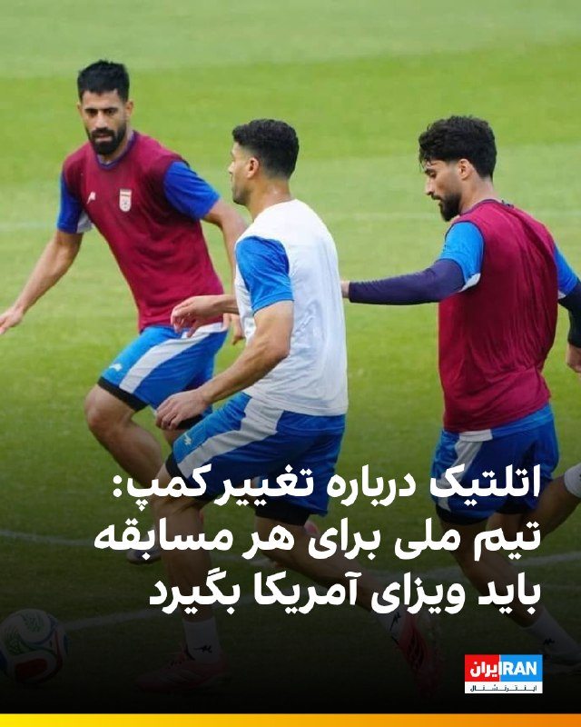
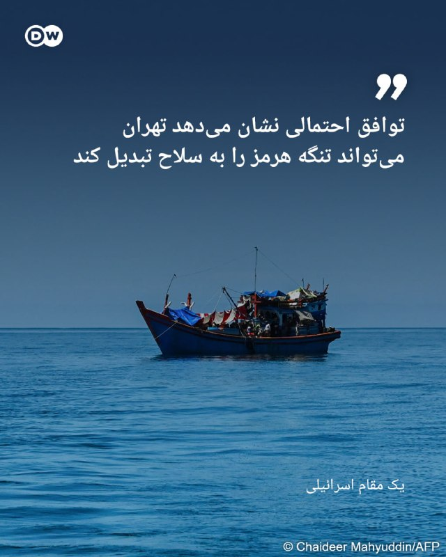
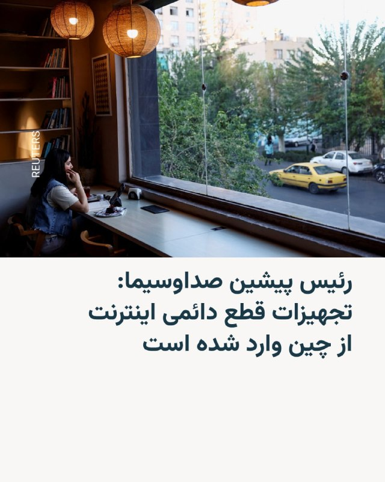
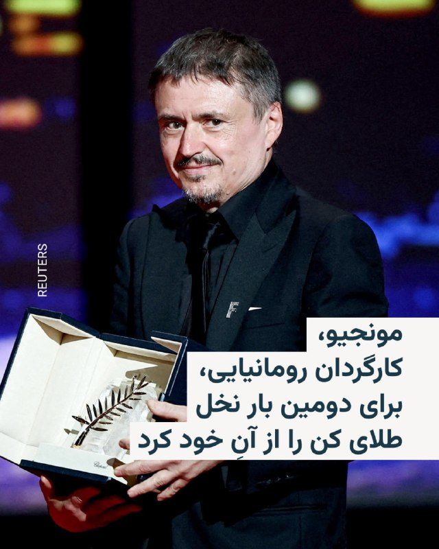
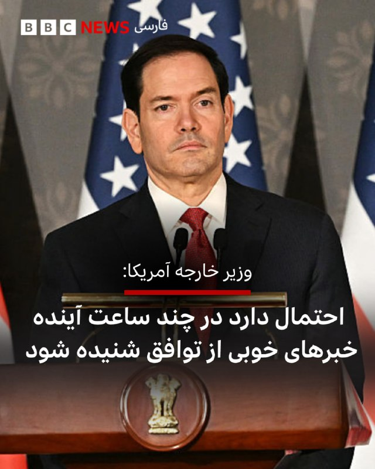

# خواننده تلگرام

<!-- TOP_NAV START -->

<a href="https://github.com/ERAGON007/aio-downloader-testing/blob/main/telegram/content/archive_1.md" style="display:inline-block; padding:6px 12px; margin:0 4px; background-color:#2ea44f; color:white; text-decoration:none; border-radius:4px; font-weight:bold;">صفحه بعد</a>

<!-- TOP_NAV END -->

<!-- MSG START -->

---
📅 بروزرسانی: 1405/03/03 14:30
---

## VahidOOnLine — post 241917

  

علی عبداللهی، فرمانده قرارگاه مرکزی خاتم‌الانبیا در بیانیه‌ای اعلام کرد: «به دشمنان هشدار می‌دهیم برنامه‌ها و راهبردهای رهبری برای مدیریت خلیج فارس و تنگه هرمز اجرا خواهد شد و بیگانگان جایگاهی در نظم جدید منطقه ندارند و ما آماده پاسخگویی سخت و جهنمی به هرگونه حمله هستیم.»

او ادامه داد: «به مشت گره‌خورده رهبر شهیدمان قسم، نیروهای مسلح مقتدر کشورمان اجازه نخواهند داد تجربه‌های دردناک تاریخی تکرار شود.»
iranintl
‌🏁 🇬🇧 IranintlTV

🤖 @VahidOOnLine

## VahidOOnLine — post 241916

  

خبرگزاری مهر، وابسته به سازمان تبلیغات اسلامی، اعلام کرد یک پهپاد اسرائیلی که کاربری جاسوسی و شناسایی داشت، با شلیک پدافند ارتش جمهوری اسلامی سرنگون شد.
این گزارش افزود: «لاشه پهپاد متلاشی شده اربیتر با همکاری ناوگروه دریابانی فراجای هرمزگان کشف شد.»

خبرگزاری مهر به تاریخ این اتفاق اشاره‌ای نکرده است.
‌🏁 🇬🇧 IranintlTV

🤖 @VahidOOnLine

## VahidOOnLine — post 241915

  

♦️کی‌یر استارمر، نخست‌وزیر بریتانیا روز یکشنبه از پیشرفت‌ گفتگوهای آمریکا و ایران استقبال کرد و گفت که توافق باید به جنگ پایان دهد و تنگه هرمز را بی‌قید و شرط باز کند.

کی‌یر استارمر در پیامی در شبکه اجتماعی ایکس نوشت: «ما باید شاهد توافقی باشیم که به درگیری پایان دهد و تنگه هرمز را با آزادی بی‌قید و شرط و نامحدود برای دریانوردی بازگشایی کند.»

نخست‌وزیر بریتانیا در عین حال بر این نکته که هرگز نباید به ایران اجازه توسعه سلاح هسته‌ای داده شود، تاکید کرده است.

استارمر همچنین نوشت که بریتانیا آماده همکاری با شرکای بین‌المللی خود است تا از این فرصت برای دست‌یابی به یک «توافق دیپلماتیک بلندمدت» استفاده شود.
‌🇸🇦 Indypersian

🤖 @VahidOOnLine

## VahidOOnLine — post 241914

♦️در پی درگذشت پرویز قلیچ‌خانی، کاپیتان پیشین تیم ملی فوتبال ایران، نجمه موسوی-پیمبری، یار و همراه او، با انتشار یک پیام صوتی جزئیات مربوط به وصیت شخصی این چهره ماندگار فوتبال ایران را تشریح کرد.
در این پیام، او با قدردانی از ابراز همدردی و همراهی دوستان، هواداران و علاقه‌مندان قلیچ‌خانی، اعلام کرد که این اسطوره فوتبال ایران بر اساس باورهای شخصی خود تصمیم گرفته بود پیکرش به مراکز علمی و آموزشی اهدا شود، از همین رو مراسم خاک‌سپاری به شکل سنتی برگزار نخواهد شد.
به گفته موسوی-پیمبری، قلیچ‌خانی در سال‌های پایانی عمر، به دلیل فروتنی شخصی و نیز پرهیز از ایجاد زحمت برای دیگران، تمایلی به برگزاری آیین‌های رسمی و گسترده یادبود نداشت. با این حال او تاکید کرده است که دوستداران این چهره آزاداندیش، مبارز و اثرگذار در تاریخ ورزش و سیاست ایران، می‌توانند در هر نقطه از جهان، به‌صورت داوطلبانه برنامه‌هایی برای بزرگداشت جایگاه و یاد او برگزار کنند.
پرویز قلیچ‌خانی از بزرگ‌ترین چهره‌های تاریخ ورزش ایران، روز شنبه ۲ خرداد ۱۴۰۵ در ۸۱ سالگی در بیمارستانی در حومه پاریس درگذشت.
‌🇸🇦 Indypersian

🤖 @VahidOOnLine

## VahidOOnLine — post 241913

  

وای‌نت به نقل از یک منبع نوشت که نتانیاهو در تماس با ترامپ تاکید کرد، اسرائیل آزادی عمل خود را برای مقابله با تهدیدها در همه جبهه‌ها از جمله لبنان، حفظ خواهد کرد.

بر اساس این گزارش، ترامپ نیز حمایت خود را از این موضوع اعلام کرد.

وای‌نت نوشت که ترامپ در تماس تلفنی با نتانیاهو تاکید کرده در مذاکرات بر خواسته همیشگی خود برای برچیدن برنامه هسته‌ای و خارج کردن همه ذخایر اورانیوم غنی‌شده از خاک ایران پافشاری خواهد کرد.

همچنین کانال ۱۴ اسرائیل به نقل از یک مقام ارشد سیاسی نوشت که اسرائیل به آمریکا اعلام کرده، چه توافقی با جمهوری اسلامی حاصل شود و چه نشود، این کشور آزادی عمل خود برای عملیات در همه بخش‌ها، از جمله در لبنان را حفظ می‌کند.
iranintl
‌🏁 🇬🇧 IranintlTV

🤖 @VahidOOnLine

## VahidOOnLine — post 241912

🗣روایت شما از احتمال توافق میان آمریکا و جمهوری اسلامی- یکشنبه ۳ خرداد

🔹دیگه امیدی به ترامپ نداریم. ما ۴۰ هزار کشته ندادیم که با این حکومت مماشات کنیم. کشورهای دیگه هم به خاطر منافع خودشون از این حکومت حمایت کردن. خودمون کار رو تموم می‌کنیم. مردم عزیز این آخرین نبرده.

🔹ما مردم ایران توافق و آتش‌بس ۶۰ روزه نمی‌خوایم. منتظریم دوباره صدای جنگنده‌ها رو در آسمون ایران بشنویم.

🔹نباید تصمیمات ترامپ برامون مهم باشه. خودمون از داخل کشور باید این رژیم رو زمین بزنیم. ناامید نشو هموطن.

🔹منتظر فراخوان مجدد شاهزاده هستیم تا کار جمهوری اسلامی رو تموم کنیم. زنده بودن در ایران دیگه غیرممکن شده.

🔹داریم زیر بار گرونی کمر خم می‌کنیم و کاری از دستمون برنمیاد. اگه ترامپ توافق کنه بزرگ‌ترین خیانت رو در حق مردم ایران کرده. امیدواریم پایان این شب سیه، سپید باشه.

🔹کدوم توافق؟ هر روز با استرس خبر اعدامی‌ها، افسردگی و فقر و هزار تا بدبختی دیگه که ترامپ و جمهوری اسلامی بهمون تحمیل کردن دست‌وپنجه نرم می‌کنیم.

🔹با خبرهایی که از توافق داره میاد، مشخصه که ما مردم، قربانی سیاست شدیم.

🔹ترامپ خواهشا با این جانیان و قاتلان ملت که در دو روز ۴۰ هزار نفر رو کشتن و تیر خلاص زدن، توافق نکن. این حکومت خون ما رو در شیشه کرده و نمی‌گذاره آزادانه راهپیمایی کنیم و خواسته خودمون رو طلب کنیم. اینا ۴۷ ساله فقط مرگ بر آمریکا و اسرائیل گفتن.
‌🏁 🇬🇧 IranintlTV

🤖 @VahidOOnLine

## VahidOOnLine — post 241911

♦️مارکو روبیو، وزیر خارجه آمریکا، روز یکشنبه در جریان نشست خبری مشترک با سابرامانیام جایشانکار، وزیر خارجه هند، در دهلی‌نو اعلام کرد که طی ۴۸ ساعت گذشته «پیشرفت قابل‌توجهی» در مذاکرات و رایزنی‌های مرتبط با بحران تنگه هرمز و پرونده ایران حاصل شده و احتمال دارد تا ساعاتی دیگر اخبار مهم‌تری در این زمینه منتشر شود. او بدون ارائه جزئیات کامل، گفت هنوز توافق نهایی شکل نگرفته اما مسیر مذاکرات نسبت به روزهای گذشته امیدوارکننده‌تر شده است.
روبیو در ادامه گفت هرگونه توافق احتمالی نیازمند پذیرش کامل ایران و اجرای عملی تعهدات خواهد بود و مذاکرات درباره جزئیات فنی برنامه هسته‌ای، روندی پیچیده و زمان‌بر دارد. او افزود هنوز نمی‌توان درباره موفقیت نهایی مذاکرات با قطعیت صحبت کرد، اما «نشانه‌هایی از پیشرفت واقعی» دیده می‌شود و ممکن است جهان در ساعات آینده خبرهای مثبتی درباره تنگه هرمز و روند مذاکرات دریافت کند.
‌🇸🇦 Indypersian

🤖 @VahidOOnLine

## VahidOOnLine — post 241910

  <a href="telegram/content/VahidOOnLine_241910_1779620415.mp4" target="_blank">🎬 Download video</a>

نت‌بلاکس اعلام کرد انسداد اینترنت در ایران وارد هشتادوششمین روز شده و مردم پس از بیش از دو هزار و ۴۰ ساعت، همچنان در «تاریکی دیجیتال» به سر می‌برند.

این نهاد ناظر بر اینترنت نوشت دسترسی به اینترنت جهانی در ایران، همزمان با ادامه گفت‌وگوهای صلح، همچنان به‌طور گسترده قطع است.

به گفته نت‌بلاکس، در حالی که بخش بزرگی از مردم از دسترسی آزاد به اینترنت محرومند، گروهی از کاربران گزینش‌شده و دارای دسترسی سفید، تصویری ساختگی و کنترل‌شده از زندگی در ایران را به جهان بیرون نشان می‌دهند.
‌🏁 🇬🇧 ManotoTV

🤖 @VahidOOnLine

## VahidOOnLine — post 241909

  

اورزولا فون در لاین، رییس کمیسیون اروپا، از پیشرفت آمریکا و جمهوری اسلامی به سمت توافق استقبال کرد و افزود: «جمهوری اسلامی باید اقدامات بی‌ثبات‌کننده در منطقه را چه به‌صورت مستقیم و چه از طریق نیروهای نیابتی، و همچنین حملات مکرر و بی‌دلیل به همسایگانش را متوقف کند.»

او ادامه داد: «بازگشایی تنگه هرمز اهمیت دارد و به توافقی نیاز داریم که واقعا به کاهش تنش‌ها منجر شود، تنگه هرمز را بازگشایی و آزادی کامل کشتیرانی را بدون دریافت عوارض و بدون محدودیت تضمین کند.»
iranintl
‌🏁 🇬🇧 IranintlTV

🤖 @VahidOOnLine

## VahidOOnLine — post 241908

  

خبرگزاری فارس، وابسته به سپاه پاسداران نوشت تازه‌ترین پیگیری‌ها نشان می‌دهد آمریکا دوباره در زمینه آزاد کردن دارایی‌های بلوکه‌شده «دبه» کرده و تلاش دارد این منابع را نسیه و حواله به آینده کند، اما مسئولین جمهوری اسلامی می‌گویند از این خط قرمز کوتاه نمی‌آیند.

این خبرگزاری افزود: «جمهوری اسلامی تنها در شرایطی حاضر به مذاکره با واشینگتن می‌شود که منافع ملموس اقتصادی به همراه داشته باشد و در این راستا، یکی از محوری‌ترین این منافع، آزادسازی دارایی‌های بلوکه‌شده است.»
iranintl
‌🏁 🇬🇧 IranintlTV

🤖 @VahidOOnLine

## VahidOOnLine — post 241907

♦️گروهی از ایرانیان مقیم هلند شنبه دوم خرداد در شهر لاهه علیه جمهوری اسلامی تجمع اعتراضی برگزار کردند. آنها در این تجمع با در دست داشتن پرچم سه رنگ شیروخورشید نشان ایران در خیابان‌های لاهه راهپیمایی کردند و شعارهایی علیه جمهوری اسلامی سر دادند.
‌🇸🇦 Indypersian

🤖 @VahidOOnLine

## VahidOOnLine — post 241906

  <a href="telegram/content/VahidOOnLine_241906_1779620417.mp4" target="_blank">🎬 Download video</a>

مارکو روبیو، وزیر خارجه آمریکا، در سخنانی در دهلی گفت در پرونده ایران «پیشرفت قابل توجهی» حاصل شده، اما هنوز توافقی نهایی نشده است.

او گفت احتمالا تا ساعاتی دیگر اخبار بیشتری منتشر خواهد شد و افزود هدف اصلی واشینگتن جلوگیری از دستیابی جمهوری اسلامی به سلاح هسته‌ای است.

روبیو همچنین تنگه هرمز را یک آبراه بین‌المللی خواند و گفت جمهوری اسلامی مالک آن نیست. او تهدید کشتی‌های تجاری در این مسیر را غیرقانونی دانست و گفت دولت ترامپ طی ۴۸ ساعت گذشته با شرکای منطقه‌ای برای باز نگه داشتن کامل این آبراه کار کرده است.

وزیر خارجه آمریکا اضافه کرد ترجیح ترامپ حل مسئله از راه دیپلماسی است، اما افزود که این موضوع «به هر شکل» حل خواهد شد.
‌🏁 🇬🇧 ManotoTV

🤖 @VahidOOnLine

## WithYashar — post 12322

  <a href="telegram/content/WithYashar_12322_1779620418.mp4" target="_blank">🎬 Download video</a>

🚨🚨🚨🚨بالاخره توافق رسمی‌شد
@withyashar

## WithYashar — post 12321

مهر: یک پهپاد اسرائیلی بر فراز هرمزگان سرنگون شد
این پهپاد که کاربری جاسوسی و شناسایی داشت، با شلیک پدافند ارتش سرنگون شد.
لاشه پهپاد متلاشی شده اربیتر با همکاری ناوگروه دریابانی فراجای هرمزگان کشف شد.
@withyashar

## WithYashar — post 12320

## WithYashar — post 12319

## WithYashar — post 12318

احمد وحیدی فرمانده کل سپاه:

فتح خرمشهر یک الگوی خوب برای نابودی کامل اسرائیل است.
@withyashar
یاشار : همین فرمون برین 🤣

## WithYashar — post 12317

گزارش کانال 14 : ممکن است ظرف چند روز توافقی بین آمریکا و ایران حاصل شود که انتظار می‌رود لبنان را نیز شامل شود و احتمالاً به پایان درگیری‌های اسرائیل با حزب‌الله منجر شود.

بر اساس جزئیات منتشر شده، ایران تنگه هرمز را بدون دریافت هزینه باز خواهد کرد در حالی که آمریکا پولی به تهران منتقل نخواهد کرد و به هر دو طرف مهلت ۶۰ روزه داده می‌شود تا مذاکرات هسته‌ای را ادامه دهند.

تحریم‌ها علیه ایران باقی خواهد ماند به جز تسهیلات محدودی در محدودیت‌های مرتبط با نفت
@withyashar

## WithYashar — post 12316

## WithYashar — post 12315

ما عمر نوح نداریم انقدر صبر کنیم !
@withyashar

## WithYashar — post 12314

Pishro (instagram.com/yashar) – Sonnat Shekan (t.me/withyashar)

## WithYashar — post 12313

نتانیاهو:
خوشحالم که رئیس‌جمهور دونالد ترامپ، بهترین دوستی که اسرائیل تا حالا در کاخ سفید داشته، در امانه و مهاجم قبل از اینکه بتونه آسیب بیشتری بزنه خنثی شده.

خشونت سیاسی، از جمله تلاش‌های مکرر برای ترور ترامپ، باید بدون هیچ ابهامی و با قاطعیت کامل از طرف همه محکوم بشه
@withyashar

## WithYashar — post 12312

## WithYashar — post 12311

عجب سکوتی …

## mwarmonitor — post 9628

📌دو مقام منطقه‌ای به آسوشیتدپرس گفته‌اند که توافق احتمالی شامل تعهد ایران به عدم پیگیری سلاح هسته‌ای و کنار گذاشتن ذخایر اورانیوم بسیار غنی‌شده‌اش است، و در مقابل، رفع تحریم‌ها و آزادسازی دارایی‌های مسدودشده طی ۶۰ روز مورد مذاکره قرار خواهد گرفت.

@mwarmonitor

## mwarmonitor — post 9627

🔴ترامپ به نتانیاهو به‌طور روشن اعلام کرد که بدون برچیده شدن کامل برنامه هسته‌ای ایران و خارج شدن تمام اورانیوم غنی‌شده از خاک این کشور، هیچ توافق نهایی درباره ایران را امضا نخواهد کرد؛ این را یک منبع سیاسی اسرائیلی به فاکس‌نیوز گفته است.

@mwarmonitor

## mwarmonitor — post 9626

  

🚢یک تانکر LNG ثبت‌شده در بریتانیا به نام FUWAIRIT تلاش کرد از تنگه هرمز عبور کند، اما در جنوب جزیره لارَک متوقف شد.

«حتما عوارض پرداخت نکرده بود؟»

@mwarmonitor

## mwarmonitor — post 9625

🔴ترامپ در سوشال تروث 🔸از سرویس مخفی عالی و نیروهای مجری قانونِ ما برای اقدام سریع و حرفه‌ای امشبِ آن‌ها در برابر فرد مسلحی که در نزدیکی کاخ سفید حضور داشت، سپاسگزارم؛ فردی که سابقه رفتارهای خشونت‌آمیز داشته و احتمالاً به ارزشمندترین بنای کشور ما (کاخ سفید)…

## mwarmonitor — post 9624

  

🛩جت «ARTEMIS II» امروز بر فراز گرجستان در حال پرواز دایره‌ای بوده و احتمالاً حسگرهای خود را به سمت جنوب، یعنی ارمنستان و/یا حتی شمال ایران متمرکز کرده است.

🔸این یک پرواز نادر محسوب می‌شود، زیرا این جت تجاریِ جمع‌آوری اطلاعات سیگنال که متعلق به یک پیمانکار و تحت عملیات ارتش آمریکا است، معمولاً بر فراز اروپای شرقی و همچنین در نزدیکی سواحل لیبی پروازهای مداری انجام می‌دهد.

@mwarmonitor

## mwarmonitor — post 9623

🔴گزارش یک منبع سیاسی: کانال ۱۲ اسرائیل

🔸ایالات متحده در حال به‌روزرسانی اسرائیل درباره مذاکرات مربوط به یک تفاهم‌نامه است که هدف آن بازگشایی تنگه هرمز و پیشبرد مذاکرات برای دستیابی به یک توافق نهایی درباره مسائل مورد اختلاف باقی‌مانده است.

🔹در تماس شب گذشته، نخست‌وزیر به رئیس‌جمهور ترامپ گفت که اسرائیل آزادی کامل اقدام در برابر تهدیدها در همه جبهه‌ها، از جمله لبنان، را حفظ خواهد کرد. ترامپ نیز بار دیگر حمایت خود را از این اصل تأکید کرد.

🔹ترامپ همچنین تأکید کرد که بر برچیده شدن برنامه هسته‌ای ایران و خارج شدن تمام اورانیوم غنی‌شده از خاک این کشور اصرار خواهد داشت و بدون تحقق این شروط، هیچ توافق نهایی را امضا نخواهد کرد.

🔹نخست‌وزیر از ترامپ به خاطر تداوم تعهدش به امنیت اسرائیل تشکر کرد.

@mwarmonitor

## mwarmonitor — post 9622

📌نتانیاهو طی هفته‌های گذشته چندین بار درخواست کرده است با ترامپ صحبت کند، اما طبق گزارش روزنامه «معاریو» به نقل از منابع، تنها دستیاران ترامپ به این درخواست‌ها پاسخ داده‌اند.

@mwarmonitor

## mwarmonitor — post 9621

🔴ایران از ارسال ذخایر اورانیوم بسیار غنی‌شده خود به خارج از کشور خودداری کرده است و تهران تأکید دارد که مذاکرات هسته‌ای خارج از چارچوب فعلیِ در حال بررسی با واشنگتن قرار ندارد. رویترز

@mwarmonitor

## FoxNewsTwitter — post 342182

  <a href="telegram/content/FoxNewsTwitter_342182_1779620421.mp4" target="_blank">🎬 Download video</a>

Fox News (Twitter/X)

FIRST ON FOX: Democratic Maine Senate candidate Graham Platner dodges an apology when confronted over a deleted Reddit post where he said a Purple Heart recipient "didn’t deserve to live."

Fox News Digital asked him what he would say to offended voters — and whether he owed Pfc. Ted Daniels an apology.

Platner instead pointed to his own service: "I did four tours in the infantry, any attempt to say that I disrespect veterans is slanderous and offensive."

## pm_afshaa — post 91376

  <a href="telegram/content/pm_afshaa_91376_1779620423.webm" target="_blank">🎬 Download video</a>

🔴بیانیه منتشر از دفتر نخست‌وزیر اسرائیل به نقل از یک منبع سیاسی (وای‌نت):

در مکالمه دیروز با ترامپ، نخست‌وزیر تأکید کرد که اسرائیل آزادی عملش رو در برابر تهدیدها در همه جبهه‌ها، از جمله لبنان، حفظ میکنه و ترامپ هم حمایتش از این اصل رو دوباره تأکید کرد.

ترامپ روشن کرد که خواسته‌اش برای خراب کردن برنامه هسته‌ای ایران و حذف تمام اورانیوم غنی‌شده از خاک این کشور ثابت میمونه و بدون این شرایط، توافق نهایی رو امضا نمیکنه.

نخست‌وزیر یه بار دیگه از تعهد طولانی‌مدت و خاص ترامپ به امنیت اسرائیل تشکر کرد.

💧 Rainbet.com the #1 Non-KYC Crypto Casino & Sportsbook @rainbetcom

😁 @Pm_Afshaa

## pm_afshaa — post 91375

بچه ها حتما تو چنل زاپاسمون جوین شین ما رو گم نکنین

https://t.me/Pm_Zapas
https://t.me/Pm_Zapas

## pm_afshaa — post 91374

  <a href="telegram/content/pm_afshaa_91374_1779620423.webm" target="_blank">🎬 Download video</a>

🔴نتانیاهو:
خوشحالم که رئیس‌جمهور دونالد ترامپ، بهترین دوستی که اسرائیل تا حالا در کاخ سفید داشته، در امانه و مهاجم قبل از اینکه بتونه آسیب بیشتری بزنه خنثی شده.

خشونت سیاسی، از جمله تلاش‌های مکرر برای ترور ترامپ، باید بدون هیچ ابهامی و با قاطعیت کامل از طرف همه محکوم بشه

💧 Rainbet.com the #1 Non-KYC Crypto Casino & Sportsbook @rainbetcom

😁 @Pm_Afshaa

## DEJradio — post 4910

⭕️ اردوی تیم ملی فوتبال در جام جهانی به‌جای آریزونا در مکزیک برگزار می‌شود

مهدی تاج، رئیس فدراسیون فوتبال جمهوری اسلامی اعلام کرد تیم ملی در جریان جام جهانی ۲۰۲۶ در شهر تیخوانا در مکزیک مستقر می‌شود.
او گفت فیفا با درخواست جمهوری اسلامی برای انتقال محل اردو از ایالت آریزونا آمریکا موافقت کرد.
بنا بر ادعای تاج، این جابه‌جایی می‌تواند مشکلات مربوط به دریافت ویزا را کاهش دهد. همچنین اعضای تیم می‌توانند با پرواز مستقیم ایران‌ایر به مکزیک سفر کنند.
تیم فوتبال جمهوری اسلامی ایران در حالی برای حضور در جام جهانی آماده می‌شود که هنوز ویزای آمریکا برای بخشی از بازیکنان و اعضای کادر فنی صادر نشده است.
از سویی بنا بر برخی گزارش‌ها، فیفا قصد دارد مانع ورود پرچم‌ شیر و خورشید به ورزشگاه‌ها در هنگام برگزاری جام جهانی بشود.

#فوتبال #جام_جهانی
@DEJradio

## DEJradio — post 4909

⭕️ قوۀ قضائیه از اعدام یک شهروند به اتهام همکاری با آمریکا و اسرائیل خبر داد

قوۀ قضائیۀ جمهوری اسلامی اعلام کرد شهروندی به نام مجتبا کیان را با اتهام «ارسال اطلاعات مراکز صنایع دفاعی» به آمریکا و اسرائیل اعدام کرده است.
به گزارش خبرگزاری میزان، وابسته به دستگاه قضائی مدعی شد مجتبا کیان در دوران جنگ اخیر اطلاعات مربوط به واحدهای صنایع دفاعی را به خارج ارسال کرده بود.
میزان مدعی شد که از دیگر موارد اتهامی مجتبا کیان، ارسال پیام‌ برای «شبکه‌های معاند» بوده است.
قوۀ قضائیه هیچ توضیحی درمورد شغل یا شیوۀ دسترسی او به اطلاعات صنایع دفاعی ارائه نکرد.
در ماه‌های اخیر جمهوری اسلامی بارها شهروندانی را به اتهام ارسال تصاویر و اطلاعات برای رسانه‌های خارج از کشور، بازداشت کرد.
رویۀ اتهام‌زنی، بازداشت، شکنجه و اعدام شهروندان، در همۀ سال‌های اخیر توسط حکومت ادامه داشته است.
حکومت از شکنجه و اعدام مخالفان به عنوان ابزاری برای ترساندن و عقب‌راندن مخالفان استفاده می‌کند.

#اعدام #زندانیان_سیاسی
@DEJradio

## DEJradio — post 4908

⭕️ فرماندۀ سپاه تهدید آمریکا و اسرائیل را ازسر گرفت

در حالی که رسانه‌های نزدیک به سپاه از نزدیک شدن تهران و واشینگتن به یک «تفاهم اولیه» خبر دادند، فرماندۀ سپاه پاسداران دربارۀ هرگونه حملۀ دوباره هشدار داد.
احمد وحیدی تهدید کرد که در صورت حمله، نیروهای مسلح جمهوری اسلامی، واکنشس «ویرانگر و جهنمی» در ابعاد منطقه‌ای و فرامنطقه‌ای انجام می‌دهند.
ادعاهای فرماندۀ سپاه در حالی است که در دوران جنگ چهل روزه، شمار بسیاری از فرماندهان ارشد و میانی این نیرو و همچنین پایگاه‌های موشکی و پهپادی جمهوری اسلامی نابود شده است.
#سپاه_تروریستی_پاسداران
@DEJradio

## DEJradio — post 4907

⭕️چهره‌های جمهوری‌خواه از توافق احتمالی ترامپ با ایران انتقاد کردند

همزمان با گزارش‌ها دربارۀ توافق احتمالی میان دولت دونالد ترامپ و جمهوری اسلامی، چند چهرۀ برجسته جمهوری‌خواه از این روند انتقاد کردند.
لیندزی گراهام، سناتور جمهوری‌خواه گفت توافقی که به جمهوری اسلامی اجازۀ حفظ قدرت منطقه‌ای را بدهد، در بلندمدت «کابوسی برای اسرائیل» می‌شود.
مایک پمپئو، وزیر امور خارجۀ نخستین دولت ترامپ گفت توافق احتمالی به هیچ وجه در راستای شعار «اول آمریکا» نیست.
پمپئو توافق احتمالی را به توافق هسته‌ای {برجام} در زمان دولت باراک اوباما شبیه دانست.
تد کروز، سناتور جمهوری‌خواه، نیز هشدار داد اگر نتیجۀ جنگ این باشد که جمهوری اسلامی همچنان توان غنی‌سازی اورانیوم و کنترل موثر بر تنگۀ هرمز را حفظ کند، این «اشتباهی فاجعه‌بار» است.
مورگان اورتگاس، نمایندۀ پیشین دولت ترامپ در امور خاورمیانه، هم هشدار داد جمهوری اسلامی ممکن است از مذاکرات برای «خرید زمان» و کاهش فشارها استفاده کند.

#تفاهم #مذاکرات #لیندسی_گراهام
@DEJradio

## DEJradio — post 4906

⭕️ اکسیوس: تهران و واشینگتن به تفاهم‌نامۀ ۶۰ روزه نزدیک شدند

وبسایت خبری اکسیوس به نقل از منابع آگاه گزارش داد جمهوری اسلامی و آمریکا به امضای یک «یادداشت تفاهم ۶۰ روزه» نزدیک شده‌اند.
بر اساس این گزارش، این تفاهم‌نامه توافق نهایی محسوب نمی‌شود، اما می‌تواند آتش‌بس را تمدید کند، به بازگشایی تنگۀ هرمز بینجامد و زمینۀ مذاکرات تازۀ هسته‌ای را فراهم کند.
به گزارش اکسیوس، جمهوری اسلامی در چارچوب این تفاهم متعهد می‌شود تنگۀ هرمز را بدون دریافت عوارض باز نگه دارد و مین‌های کارگذاشته شدۀ احتمالی را جمع‌آوری کند.
اکسیوس نوشت دولت آمریکا نیز محاصرۀ بنادر ایران را متوقف و بخشی از تحریم‌ها را تعلیق می‌کند.
بنا بر این گزارش، تهران اجازه می‌یابد موقتا بخشی از نفت خود را به فروش برساند.
به نوشتۀ اکسیوس، در دورۀ شصت روزه مسائل هسته‌ای حل نمی‌شود.
اکسیوس به نقل از منابع آگاه گفت در دو ماه پیش رو، مذاکراتی دربارۀ توقف غنی‌سازی، انتقال ذخایر اورانیوم و تعهد جمهوری اسلامی به نرفتن به سمت سلاح هسته‌ای انجام می‌شود.

#مذاکرات #برنامه_اتمی
@DEJradio

## DEJradio — post 4905

⭕️ پاکستان برای میزبانی دور تازۀ مذاکرات جمهوری اسلامی و آمریکا ابراز امیدواری کرد

پس از پیام دونالد ترامپ درمورد نزدیک بودن توافق با جمهوری اسلامی، شهباز شریف، نخست‌وزیر پاکستان، ابراز امیدواری کرد دور تازۀ مذاکرۀ تهران و واشینگتن «در آینده‌ای بسیار نزدیک» در اسلام‌آباد برگزار شود.
از سویی خبرگزاری حکومتی فارس، نزدیک به سپاه پاسداران، پیام‌های ترامپ را «تبلیغاتی و برای مصرف داخلی آمریکا» عنوان کرد.
در سوی دیگر، وبسایت اکسیوس گزارش داد پیش‌نویس تفاهم‌نامه‌ای در حال آماده شدن است که ترامپ «در شرف امضای آن» قرار دارد.
بر اساس گزارش اکسیوس، جمهوری اسلامی از طریق میانجی‌ها به‌صورت شفاهی تعهد داده هرگز به‌دنبال سلاح هسته‌ای نرود و درباره تعلیق غنی‌سازی و انتقال ذخایر اورانیوم مذاکره کند.
خبرگزاری حکومتی فارس مدعی شد «هیچ تعهدی از سوی تهران داده نشده» است.
به ادعای این خبرگزاری نزدیک به سپاه، پروندۀ هسته‌ای در این مرحله از مذاکرات «مورد بحث قرار نگرفته است.»

#مذاکرات #تفاهم #پاکستان
@DEJradio

## DEJradio — post 4904

⭕️ رسانۀ اسرائیلی: برخی مشاوران ترامپ او را به سوی توافقی ناخوشایند با تهران می‌برند

شبکه ۱۳ اسرائیل گزارش داد مقام‌های این کشور بر این باورند که تهران و واشینگتن به توافق احتمالی نزدیک‌تر شده‌اند.
به گزارش شبکۀ ۱۳ اسرائیل، مقام‌های این کشور گفته‌اند فشار برخی مشاوران دونالد ترامپ بر او برای توافق با تهران، در روزهای اخیر افزایش یافته است.
اسرائیل پیش‌تر تصور می‌کرد اختلاف بر سر مسائل کلیدی مانع توافق می‌شود، اما اکنون برخی مقام‌های این کشور فکر می‌کنند روند مذاکرات به‌خلاف ارزیابی‌های قبلی به پیش می‌رود.
بر اساس این گزارش، بخشی از نهاد امنیتی اسرائیل از روند مذاکرات ناخشنود است.

#مذاکرات #تفاهم #اسرائیل
@DEJradio

## DEJradio — post 4903

  <a href="telegram/content/DEJradio_4903_1779620424.mp4" target="_blank">🎬 Download video</a>

🎤
⭕️ یک میلیون شغل پودر شد و بیش از سه هزار واحد صنعتی به خاکستر تبدیل گشت! این کارنامه تکان‌دهنده شوک پس از جنگ بر بازار کار ایران است.
آمارهای رسمی از بیکاری مستقیم و غیرمستقیم دو میلیون نفر خبر می‌دهند. از قزوین و کرمان تا اصفهان، غول‌های تولید دست به تعدیل‌های بی‌سابقه زده‌اند،تا جایی که در صنعت خودرو، تولید به یک‌سوم سقوط کرده ودر فولاد مبارکه، از ۲۷ هزار کارگر فقط دو هزار نفر سر کار برگشته‌اند! کارگران باقی‌مانده نیز میان دوراهی اخراج یا کاربا نصف حقوق و بدون مزایاگرفتار شده‌اند؛ آن هم در حالی که صندوق‌های حمایتی دولت کاملاً خالی است.
عطا حسینیان گزارش می‌دهد.

#گزارش #اقتصاد
@DEJradio

## DEJradio — post 4902

⭕️
⭕️ روبیو گفت احتمال دارد خبری در مورد توافق با جمهوری اسلامی تا شامگاه یک‌شنبه اعلام شود

مارکو روبیو، وزیر امور خارجۀ آمریکا، گفت ممکن است تا شامگاه یک‌شنبه خبری درمورد توافقی با تهران اعلام شود که می‌تواند رسما به جنگ خاورمیانه پایان بدهد.
روبیو در جمع خبرنگاران در دهلی‌نو گفت: شاید در چند ساعت آینده دنیا «خبرهای خوبی» دریافت کند.
او افزود توافق در حال شکل‌گیری به نگرانی‌های آمریکا درباره تنگۀ هرمز می‌پردازد.
به گفتۀ وزیر امور خارجۀ آمریکا، این توافق می‌تواند روندی را آغاز کند که در پایان به هدف دونالد ترامپ یعنی رفع نگرانی دربارۀ برنامه هسته‌ای تهران منجر شود.

#تفاهم #تنگه_هرمز
@DEJradio

## mamlekate — post 103576

📝 ایران و آمریکا به تفاهم اولیه نزدیک شدند؛ جزئیات گزارش‌شده از تفاهم‌نامه

وب‌سایت اکسیوس به نقل از منابع خود گزارش داده است که آمریکا و جمهوری اسلامی ایران به امضای یک یادداشت تفاهم ۶۰ روزه نزدیک شده‌اند؛ تفاهمی که در صورت نهایی شدن می‌تواند آتش‌بس را تمدید کند، تنگه هرمز را بازگشاید، فشار بر بازار جهانی نفت را کاهش دهد و زمینه‌ساز دور تازه‌ای از مذاکرات هسته‌ای شود.

بر اساس این گزارش، تفاهم‌نامه پیشنهادی ۶۰ روز اعتبار خواهد داشت و با توافق دو طرف می‌تواند تمدید شود. در این دوره، ایران متعهد می‌شود تنگه هرمز را بدون دریافت عوارض باز کند و مین‌هایی را که احتمالا در این مسیر کار گذاشته شده، جمع‌آوری کند تا کشتی‌ها بتوانند آزادانه عبور کنند.

در مقابل، دولت ترامپ محاصره بنادر ایران را لغو خواهد کرد و برخی معافیت‌های تحریمی را صادر می‌کند تا ایران بتواند نفت خود را در بازار جهانی بفروشد. یک مقام آمریکایی گفته است این اقدام برای ایران «منفعت اقتصادی بزرگی» خواهد داشت، اما همزمان به کاهش فشار بر بازار جهانی نفت نیز کمک می‌کند.

اکسیوس تأکید کرده که مسائل هسته‌ای در این دوره ۶۰ روزه حل نخواهد شد، بلکه دو طرف دربارهٔ تعلیق غنی‌سازی اورانیوم، انتقال ذخایر اورانیوم غنی‌شده و تعهد ایران به دنبال نکردن سلاح هسته‌ای مذاکره خواهند کرد.

بر اساس این گزارش، رفع تحریم‌ها و آزادسازی دارایی‌های مسدودشده ایران نیز در این دوره بررسی می‌شود، اما اجرای آن منوط به توافق نهایی و قابل راستی‌آزمایی خواهد بود.

اکسیوس همچنین نوشته است که پیش‌نویس تفاهم‌نامه شامل پایان جنگ اسرائیل و حزب‌الله در لبنان نیز هست، موضوعی که بنیامین نتانیاهو در تماس با دونالد ترامپ نسبت به آن ابراز نگرانی کرده است.

📝 از توافق احتمالی تهران-واشنگتن چه می‌دانیم؟

@mamlekate

## kianmeli1 — post 87628

🔴خبرگزاری تسنیم سپاه: «بدون آزادسازی دارایی‌های مسدود شده ایران، توافقی حاصل نخواهد شد»، این موضوع به میانجیگران پاکستانی و منطقه‌ای ابلاغ شده است.
https://t.me/kianmeli1

## kianmeli1 — post 87627

‏🔴خبرگزاری مهر وابسته به سازمان تبلیغات اسلامی نوشت پدافند ارتش جمهوری اسلامی یک پهپاد اسرائیل را در هرمزگان سرنگون کرده است
https://t.me/kianmeli1

## kianmeli1 — post 87626

🔴یکی از همسایگان بیت خامنه ای میگفت از بالای پشت بام به بیت که نگاه میکنیم صاف شده حتی یک آجر سالم نمانده

سوال: چگونه مجتبی زنده مانده

دو حالت دارد:
۱-مجتبی آنجا نبوده
۲-اگر بوده کشته شده

بنظر ما مجتبی آنجا نبوده و مطلع بوده از حمله
https://t.me/kianmeli1

## kianmeli1 — post 87625

  

🔴چندروز پیش ۳۰ اردیبهشت مجتبی خامنه ای پیام تسلیتی را امضا کرده که جالبه
دست خطش این مدلیه یا واقعا نمیتونه امضا کنه در بستریه!

شبیه دست خط نهضت سوادآموزیه
https://t.me/kianmeli1

## kianmeli1 — post 87624

  

🔴هشدار شدید پمپئو به ترامپ:

‏به نظر می‌رسد توافقی که با ایران در حال انجام است، به‌طور مستقیم از روی نقشه وندی شرمن-رابرت مالی-بن رودز بیرون آمده: به سپاه پاسداران پول بدهید تا یک برنامه سلاح‌های کشتار جمعی بسازد و جهان را ترور کند.
‏این اصلا ربطی به شعار «اول آمریکا» ندارد.
‏موضوع خیلی ساده است:
‏تنگه را باز کنید.
‏دسترسی ایران به پول را قطع کنید.
‏و آن‌قدر توانایی‌های ایران را هدف قرار دهید که دیگر نتواند متحدان ما در منطقه را تهدید کند.
‏خیلی دیر شده.
‏وقتشه اقدام کنند.
https://t.me/kianmeli1

## kianmeli1 — post 87623

  

🔴اساسا چرا باید حمله کند! اگر بناست به براندازی٫ کار بزرگ را کردند تا قبل کشتن خامنه ای ، همه میگفتند با حذف خامنه ای کار تمام میشود حال می گویند منتظریم خامنه ای دوم حذف شود کار را تمام میکنیم به این حضرات که ۲۴ ساعت در تلویزیون ها نشسته اند تحت عناوین…

## IranIntlTV — post 338744

  

علی عبداللهی، فرمانده قرارگاه مرکزی خاتم‌الانبیا در بیانیه‌ای اعلام کرد: «به دشمنان هشدار می‌دهیم برنامه‌ها و راهبردهای رهبری برای مدیریت خلیج فارس و تنگه هرمز اجرا خواهد شد و بیگانگان جایگاهی در نظم جدید منطقه ندارند و ما آماده پاسخگویی سخت و جهنمی به هرگونه حمله هستیم.»

او ادامه داد: «به مشت گره‌خورده رهبر شهیدمان قسم، نیروهای مسلح مقتدر کشورمان اجازه نخواهند داد تجربه‌های دردناک تاریخی تکرار شود.»
iranintl.com/202605240729

## IranIntlTV — post 338743

جاویدنامان انقلاب ملی ایرانیان
«علی و شیوا بردبار جاوید» از جان‌باختگان اعتراضات ۱۸ دی در مشهد هستند. نامشان در حافظه‌ی این سرزمین می‌ماند و یادشان چراغ راه آزادی‌خواهان است.
لطفا فقط ورژن عمودی منتشر شه. ممنونم
@iranintltv

## IranIntlTV — post 338742

  

خبرگزاری مهر، وابسته به سازمان تبلیغات اسلامی، اعلام کرد یک پهپاد اسرائیلی که کاربری جاسوسی و شناسایی داشت، با شلیک پدافند ارتش جمهوری اسلامی سرنگون شد.
این گزارش افزود: «لاشه پهپاد متلاشی شده اربیتر با همکاری ناوگروه دریابانی فراجای هرمزگان کشف شد.»

خبرگزاری مهر به تاریخ این اتفاق اشاره‌ای نکرده است.
https://iranintl.com/202605240342

## IranIntlTV — post 338741

استقبال اروپا از پیشرفت مذاکرات با تاکید بر بازگشایی تنگه هرمز و مهار برنامه هسته‌ای تهران

هم‌زمان با گزارش‌ها درباره نزدیک شدن آمریکا و جمهوری اسلامی به یک تفاهم اولیه، رهبران اتحادیه اروپا و بریتانیا از پیشرفت مذاکرات استقبال کرده و خواستار توافقی شدند که به کاهش تنش‌ها، بازگشایی تنگه هرمز و جلوگیری از دستیابی حکومت ایران به سلاح هسته‌ای منجر شود.

اورزولا فون‌در‌لاین، رییس کمیسیون اروپا، از نشانه‌های پیشرفت در مذاکرات میان آمریکا و جمهوری اسلامی استقبال کرده و گفته است اروپا از دستیابی به توافقی حمایت می‌کند که به کاهش واقعی تنش‌ها، بازگشایی تنگه هرمز و تضمین آزادی کامل کشتیرانی بدون دریافت عوارض منجر شود.

فون‌در‌لاین در پیامی در شبکه ایکس نوشت: «از پیشرفت در مسیر توافق میان آمریکا و ایران استقبال می‌کنم. ما به توافقی نیاز داریم که واقعا تنش‌ها را کاهش دهد، تنگه هرمز را بازگشایی کند و آزادی کامل ناوبری را تضمین کند. نباید به ایران اجازه داده شود به سلاح هسته‌ای دست پیدا کند.» او همچنین تاکید کرد تهران باید اقدامات بی‌ثبات‌کننده منطقه‌ای، از جمله حمایت از نیروهای نیابتی و حملات به کشورهای همسایه را متوقف کند.

رییس کمیسیون اروپا افزود اتحادیه اروپا برای بهره‌برداری از فرصت کنونی جهت دستیابی به یک راه‌حل دیپلماتیک پایدار، همکاری با شرکای بین‌المللی را ادامه خواهد داد و هم‌زمان برای کاهش اثرات بحران بر زنجیره‌های تامین جهانی و قیمت انرژی تلاش می‌کند.

اظهارات فون‌در‌لاین پس از آن مطرح شد که دونالد ترامپ اعلام کرد واشینگتن و تهران «تا حد زیادی» درباره یک یادداشت تفاهم برای توافق صلح مذاکره کرده‌اند؛ توافقی که می‌تواند به بازگشایی تنگه هرمز منجر شود.

در بریتانیا نیز کی‌یر استارمر، نخست‌وزیر این کشور، از «پیشرفت در مسیر توافق» برای پایان دادن به جنگ ایران استقبال کرد. استارمر در پیامی نوشت: «ما با شرکای بین‌المللی خود همکاری خواهیم کرد تا از این فرصت برای دستیابی به یک راه‌حل دیپلماتیک بلندمدت استفاده کنیم.»

این مواضع در حالی مطرح می‌شود که مقام‌های آمریکایی گفته‌اند احتمال دارد جزئیات توافق احتمالی میان [حکومت] ایران و آمریکا طی ساعات یا روزهای آینده اعلام شود؛ هرچند هنوز اختلاف‌هایی بر سر برنامه هسته‌ای ایران، وضعیت تنگه هرمز و دامنه کاهش تحریم‌ها باقی مانده است.

در همین حال، منابع سیاسی اسرائیل نیز نگرانی خود را نسبت به پیامدهای توافق احتمالی ابراز کرده‌اند. یک مقام ارشد سیاسی اسرائیل به یینون ماگال، خبرنگار کانال۱۴ این کشور گفته است تل‌آویو به واشینگتن اطلاع داده که «صرف‌نظر از دستیابی یا عدم دستیابی به توافق، آزادی عمل عملیاتی خود را در همه جبهه‌ها، از جمله لبنان، حفظ خواهد کرد.»

این اظهارات نشان می‌دهد با وجود افزایش امیدها به پیشرفت دیپلماتیک، اختلاف‌ها بر سر نحوه مهار برنامه هسته‌ای ایران، نقش منطقه‌ای تهران و آینده درگیری‌های نیابتی همچنان از چالش‌های اصلی مسیر توافق باقی مانده است.
 
🔗وب‌سایت ایران‌اینترنشنال
@iranintltv

## IranIntlTV — post 338740

  <a href="telegram/content/IranIntlTV_338740_1779620429.mp4" target="_blank">🎬 Download video</a>

یک شهروند با ارسال پیامی به ایران‌اینترنشنال می‌گوید: «امیدی به ترامپ نداریم. ما ۴۰ هزار کشته ندادیم که با این حکومت مماشات کنیم. خودمان کار را تمام می‌کنیم. مردم عزیز این آخرین نبرد است.»

## IranIntlTV — post 338739

  

🔻سایت اتلتیک در گزارشی درباره تغییر کمپ تیم ملی از آریزونای آمریکا به تیخوانا در مکزیک، که به گفته مهدی تاج، رییس فدراسیون فوتبال، برای حل مشکل ویزای اعضای تیم انجام شده است، نوشت با وجود این اقدام، تیم ملی برای هر بازی باید ویزا بگیرد: «تمامی بازیکنان و اعضای کادر همچنان برای ورود به ایالات متحده جهت برگزاری مسابقات نیاز به ویزا خواهند داشت.»

🔹اتلتیک اشاره می‌کند که با این تغییر، «اگر برخی اعضای غیرضروری در روز مسابقه برای دریافت ویزای آمریکا با مشکل مواجه باشند، انتقال کمپ به مکزیک می‌تواند به آن‌ها اجازه دهد در کنار تیم بمانند، اما برای مسابقات سفر نکنند.»

🔹یک ماه پیش، مارکو روبیو، وزیر خارجه آمریکا، درباره ورود همراهان تیم ملی به ایالات متحده گفت: «آن‌ها نمی‌توانند یک مشت تروریست عضو سپاه را به عنوان روزنامه‌نگار یا مربی ورزشی وارد کشور ما کنند.»

🔹اتلتیک نوشته است این تغییر کمپ تیم فوتبال ایران در حالی رخ داده که مقام‌های آریزونا برای استقبال از این تیم آماده می‌شدند.

جزییات بیشتر را در سایت بخوانید.

@iranintltvsport

## IranIntlTV — post 338738

  <a href="telegram/content/IranIntlTV_338738_1779620430.mp4" target="_blank">🎬 Download video</a>

وزیر دفاع پیشین اسرائیل از مطرح شدن لبنان به‌عنوان بخشی از توافق میان واشینگتن و تهران انتقاد کرد. اردوغان نیز در تماس با ترامپ، بر حل اختلافات از راه دیپلماسی تاکید کرد و از مذاکرات با جمهوری اسلامی حمایت کرد.

گزارش اشکان صفایی و نرگس هورخش، خبرنگاران ایران‌اینترنشنال

@iranintltv

## IranIntlTV — post 338737

  <a href="telegram/content/IranIntlTV_338737_1779620432.mp4" target="_blank">🎬 Download video</a>

رسانه‌های پاکستان گزارش دادند در حمله انتحاری به قطار مسافربری در شهر کویته، دست‌کم ۲۴ نفر کشته و حدود ۵۰ نفر زخمی شدند. به گفته این رسانه‌ها، بخشی از واگن‌ها حامل نظامیان پاکستانی بود. ارتش آزادی‌بخش بلوچستان مسئولیت این حمله را بر عهده گرفت.
گفت‌وگو با وحید پیمان، روزنامه‌نگار
@iranintltv

## IranIntlTV — post 338736

  

وای‌نت به نقل از یک منبع نوشت که نتانیاهو در تماس با ترامپ تاکید کرد، اسرائیل آزادی عمل خود را برای مقابله با تهدیدها در همه جبهه‌ها از جمله لبنان، حفظ خواهد کرد.

بر اساس این گزارش، ترامپ نیز حمایت خود را از این موضوع اعلام کرد.

وای‌نت نوشت که ترامپ در تماس تلفنی با نتانیاهو تاکید کرده در مذاکرات بر خواسته همیشگی خود برای برچیدن برنامه هسته‌ای و خارج کردن همه ذخایر اورانیوم غنی‌شده از خاک ایران پافشاری خواهد کرد.

همچنین کانال ۱۴ اسرائیل به نقل از یک مقام ارشد سیاسی نوشت که اسرائیل به آمریکا اعلام کرده، چه توافقی با جمهوری اسلامی حاصل شود و چه نشود، این کشور آزادی عمل خود برای عملیات در همه بخش‌ها، از جمله در لبنان را حفظ می‌کند.
iranintl.com/202605249125

## IranIntlTV — post 338735

🗣روایت شما از احتمال توافق میان آمریکا و جمهوری اسلامی- یکشنبه ۳ خرداد

🔹دیگه امیدی به ترامپ نداریم. ما ۴۰ هزار کشته ندادیم که با این حکومت مماشات کنیم. کشورهای دیگه هم به خاطر منافع خودشون از این حکومت حمایت کردن. خودمون کار رو تموم می‌کنیم. مردم عزیز این آخرین نبرده.

🔹ما مردم ایران توافق و آتش‌بس ۶۰ روزه نمی‌خوایم. منتظریم دوباره صدای جنگنده‌ها رو در آسمون ایران بشنویم.

🔹نباید تصمیمات ترامپ برامون مهم باشه. خودمون از داخل کشور باید این رژیم رو زمین بزنیم. ناامید نشو هموطن.

🔹منتظر فراخوان مجدد شاهزاده هستیم تا کار جمهوری اسلامی رو تموم کنیم. زنده بودن در ایران دیگه غیرممکن شده.

🔹داریم زیر بار گرونی کمر خم می‌کنیم و کاری از دستمون برنمیاد. اگه ترامپ توافق کنه بزرگ‌ترین خیانت رو در حق مردم ایران کرده. امیدواریم پایان این شب سیه، سپید باشه.

🔹کدوم توافق؟ هر روز با استرس خبر اعدامی‌ها، افسردگی و فقر و هزار تا بدبختی دیگه که ترامپ و جمهوری اسلامی بهمون تحمیل کردن دست‌وپنجه نرم می‌کنیم.

🔹با خبرهایی که از توافق داره میاد، مشخصه که ما مردم، قربانی سیاست شدیم.

🔹ترامپ خواهشا با این جانیان و قاتلان ملت که در دو روز ۴۰ هزار نفر رو کشتن و تیر خلاص زدن، توافق نکن. این حکومت خون ما رو در شیشه کرده و نمی‌گذاره آزادانه راهپیمایی کنیم و خواسته خودمون رو طلب کنیم. اینا ۴۷ ساله فقط مرگ بر آمریکا و اسرائیل گفتن.

## IranIntlTV — post 338734

  

اورزولا فون در لاین، رییس کمیسیون اروپا، از پیشرفت آمریکا و جمهوری اسلامی به سمت توافق استقبال کرد و افزود: «جمهوری اسلامی باید اقدامات بی‌ثبات‌کننده در منطقه را چه به‌صورت مستقیم و چه از طریق نیروهای نیابتی، و همچنین حملات مکرر و بی‌دلیل به همسایگانش را متوقف کند.»

او ادامه داد: «بازگشایی تنگه هرمز اهمیت دارد و به توافقی نیاز داریم که واقعا به کاهش تنش‌ها منجر شود، تنگه هرمز را بازگشایی و آزادی کامل کشتیرانی را بدون دریافت عوارض و بدون محدودیت تضمین کند.»
iranintl.com/202605242210

## IranIntlTV — post 338733

  <a href="telegram/content/IranIntlTV_338733_1779620434.mp4" target="_blank">🎬 Download video</a>

مارکو روبیو، وزیر خارجه آمریکا، در نشست خبری با همتای هندی خود گفت هدف نهایی واشینگتن جلوگیری از دستیابی جمهوری اسلامی به سلاح هسته‌ای است. روبیو گفت پیشرفت‌هایی در روند توافق با جمهوری اسلامی حاصل شده اما هنوز نهایی نشده است.
@iranintltv

## IranIntlTV — post 338732

  

خبرگزاری فارس، وابسته به سپاه پاسداران نوشت تازه‌ترین پیگیری‌ها نشان می‌دهد آمریکا دوباره در زمینه آزاد کردن دارایی‌های بلوکه‌شده «دبه» کرده و تلاش دارد این منابع را نسیه و حواله به آینده کند، اما مسئولین جمهوری اسلامی می‌گویند از این خط قرمز کوتاه نمی‌آیند.

این خبرگزاری افزود: «جمهوری اسلامی تنها در شرایطی حاضر به مذاکره با واشینگتن می‌شود که منافع ملموس اقتصادی به همراه داشته باشد و در این راستا، یکی از محوری‌ترین این منافع، آزادسازی دارایی‌های بلوکه‌شده است.»
iranintl.com/202605249983

## Shin_Persian — post 6196

Shin ✓ @hey_itsmyturn
Sun, 24 May 2026 10:52:04 UTC

Islamic Regime claims downing Israeli Orbiter drone over Hormozgan Province with air defense system. Drone reportedly conducting reconnaissance mission.

#Iran

فارسی

رژیم اسلامی ادعا می‌کند یک پهپاد اوربیتر (Orbiter) اسرائیلی را با سامانه پدافند هوایی بر فراز استان هرمزگان سرنگون کرده است. گزارش شده است که این پهپاد در حال انجام مأموریت شناسایی بوده است.

#Iran

𝕏 · @shin_persian

## Shin_Persian — post 6195

Shin ✓ @hey_itsmyturn
Sun, 24 May 2026 10:20:32 UTC

3 Iraqi Counter-Terrorism Service personnel killed, 4 wounded by ISIS IED in Hadhr desert, southwest Nineveh Province, #Iraq 🇮🇶

فارسی

۳ تن از پرسنل سرویس ضد تروریسم عراق کشته و ۴ تن دیگر در پی انفجار بمب کنار جاده‌ای داعش در بیابان الحضر، واقع در جنوب غربی استان نینوا، زخمی شدند. #Iraq 🇮🇶

𝕏 · @shin_persian

## ManotoTV — post 105799

  <a href="telegram/content/ManotoTV_105799_1779620436.mp4" target="_blank">🎬 Download video</a>

نت‌بلاکس اعلام کرد انسداد اینترنت در ایران وارد هشتادوششمین روز شده و مردم پس از بیش از دو هزار و ۴۰ ساعت، همچنان در «تاریکی دیجیتال» به سر می‌برند.

این نهاد ناظر بر اینترنت نوشت دسترسی به اینترنت جهانی در ایران، همزمان با ادامه گفت‌وگوهای صلح، همچنان به‌طور گسترده قطع است.

به گفته نت‌بلاکس، در حالی که بخش بزرگی از مردم از دسترسی آزاد به اینترنت محرومند، گروهی از کاربران گزینش‌شده و دارای دسترسی سفید، تصویری ساختگی و کنترل‌شده از زندگی در ایران را به جهان بیرون نشان می‌دهند.

## ManotoTV — post 105798

  <a href="telegram/content/ManotoTV_105798_1779620437.mp4" target="_blank">🎬 Download video</a>

مارکو روبیو، وزیر خارجه آمریکا، در سخنانی در دهلی گفت در پرونده ایران «پیشرفت قابل توجهی» حاصل شده، اما هنوز توافقی نهایی نشده است.

او گفت احتمالا تا ساعاتی دیگر اخبار بیشتری منتشر خواهد شد و افزود هدف اصلی واشینگتن جلوگیری از دستیابی جمهوری اسلامی به سلاح هسته‌ای است.

روبیو همچنین تنگه هرمز را یک آبراه بین‌المللی خواند و گفت جمهوری اسلامی مالک آن نیست. او تهدید کشتی‌های تجاری در این مسیر را غیرقانونی دانست و گفت دولت ترامپ طی ۴۸ ساعت گذشته با شرکای منطقه‌ای برای باز نگه داشتن کامل این آبراه کار کرده است.

وزیر خارجه آمریکا اضافه کرد ترجیح ترامپ حل مسئله از راه دیپلماسی است، اما افزود که این موضوع «به هر شکل» حل خواهد شد.

## FarsiVOA — post 218508

  

مرکز آمار ترکیه از افت ۲۹ درصدی ورود گردشگران ایرانی به این کشور در چهار ماه ابتدایی شال ۲۰۲۶ خبر داد.

جزئیات آمارهای ماهانه این نهاد دولتی نشان از سقوط چشمگیر ورود گردشگران ایرانی به این کشور در دوران جنگ بوده است؛ به‌طوری که در ماه‌های مارس و آوریل در مجموع ۲۴۱ هزار گردشگر ایرانی وارد ترکیه شده که دقیقاً نصف دور مشابه پارسال است.

در دوران جنگ ۳۹ روزه، تردد شهروندان ایرانی به ترکیه تنها از مسیر زمینی بوده است.

در مجموع، طی چهار ماه ابتدایی ۲۰۲۶ حدود ۶۷۲ هزار شهروند ایران به ترکیه سفر کرده‌اند. در این دوره همچنین شهروندان ایرانی ۴۷۹ واحد مسکونی در ترکیه خریداری کرده‌اند که ۲۵ درصد کمتر از دور مشابه پارسال است.
@FarsiVOA

## FarsiVOA — post 218507

🔺واکنش‌ها به توافق احتمالی تهران و واشنگتن؛ نگرانی نتانیاهو از تعویق پرونده هسته‌ای و آتش‌بس لبنان

▪️در پی اعلام دونالد ترامپ مبنی بر اینکه چارچوب یک «یادداشت تفاهم صلح» با جمهوری اسلامی «تا حد زیادی مذاکره شده»، موجی از واکنش‌ها در آمریکا، اسرائیل، اروپا و کشورهای منطقه شکل گرفته است.

▪️توافق احتمالی هنوز نهایی نشده اما واکنش‌ها نشان‌دهنده مواجهه‌ای چندگانه با چنین توافقی است.
ایالات متحده و میانجی‌های منطقه‌ای چنین توافقی را راهی برای پایان جنگ و بازگشایی هرمز می‌دانند.

▪️اسرائیل و بخشی از جمهوری‌خواهان آمریکا نگران عقب افتادن پرونده هسته‌ای و تقویت موقعیت جمهوری اسلامی هستند.

▪️جمهوری اسلامی می‌کوشد هم پایان جنگ و رفع محاصره را پیگیری کند، هم کنترل خود بر تنگه هرمز و اهرم‌های منطقه‌ای‌اش را حفظ کند.

⬇️ بیشتر بخوانید:
https://ir.voanews.com/a/regional-and-international-reactions-to-possible-iran-deal/8153270.html

## FarsiVOA — post 218506

  <a href="telegram/content/FarsiVOA_218506_1779620439.mp4" target="_blank">🎬 Download video</a>

اسرائیل از انهدام چند انبار تسلیحات حماس خبر داد؛

ارتش اسرائیل اعلام کرد در روزهای اخیر چند انبار تسلیحات سازمان تروریستی حماس را هدف قرار داده و نابود کرده است.

نیروهای ارتش اسرائیل در طول ۲۴ ساعت گذشته، سه انبار تسلیحات حماس را در مرکز نوار غزه هدف قرار داده و نابود کردند. از جمله تسلیحات موجود در این انبارها که در نتیجه حملات نابود شدند، راکت‌های ضد تانک، سلاح‌های بلند، آرپی‌جی، جلیقه‌های ضدگلوله و تجهیزات جنگی دیگر بودند.

در رویدادی دیگر در روز چهارشنبه، نیروهای ارتش اسرائیل یک انبار تسلیحات دیگر شامل مواد منفجره، پرتاب‌کننده‌های آرپی‌جی، نارنجک‌های دستی و خشاب‌های سازمان تروریستی حماس را در مرکز نوار غزه هدف قرار داده و نابود کردند.

ارتش اسرائیل می‌گوید که این تسلیحات برای آسیب رساندن به نیروهایش که در منطقه خط زرد فعالیت می‌کنند و همچنین شهروندان اسرائیلی طراحی شده بودند و به منظور رفع تهدید نابود شدند.

پس از حملات، انفجارهای ثانویه‌ای مشاهده شد که نشان‌دهنده وجود تسلیحات در انبارها بود.
@FarsiVOA

## FarsiVOA — post 218505

  

کی‌یر استارمر، نخست‌وزیر بریتانیا، از «پیشرفت به سوی توافق» میان آمریکا و جمهوری اسلامی برای پایان دادن به جنگ استقبال کرد.

استارمر در پیامی در شبکه ایکس نوشت بریتانیا با شرکای بین‌المللی خود همکاری خواهد کرد تا از این فرصت برای دستیابی به یک «راه‌حل دیپلماتیک بلندمدت» استفاده شود.

این موضع پس از آن مطرح شد که مقام‌های آمریکایی گفتند ممکن است اعلام توافق در همین روز انجام شود. هنوز جزئیات نهایی توافق احتمالی منتشر نشده است.

سخنان نخست‌وزیر بریتانیا در حالی بیان می‌شود که تماس‌های دیپلماتیک میان آمریکا، جمهوری اسلامی و کشورهای منطقه در روزهای اخیر افزایش یافته و چند کشور، از جمله قطر، پاکستان و ترکیه، برای کاهش تنش و رسیدن به توافق نقش فعال‌تری گرفته‌اند.
@FarsiVOA

## FarsiVOA — post 218504

🔺وزیر خارجه آمریکا: احتمال خبرهای خوب درباره تنگه هرمز وجود دارد

▪️مارکو روبیو، وزیر خارجه آمریکا، اعلام کرد که «احتمال خبرهای خوب در چند ساعت آینده درباره تنگه [هرمز] وجود دارد.»

▪️آقای روبیو روز یکشنبه در یک کنفرانس مشترک با وزیر خارجه هند، درباره پرونده مذاکرات با تهران گفت: «در ۴۸ ساعت گذشته پیشرفت‌هایی در چارچوبی که می‌تواند وضعیت تنگه هرمز را حل‌وفصل کند حاصل شده است.»

▪️در حالی که پیشتر کشتی‌هایی در منطقه خلیج فارس هدف حملات قرار گرفتند، وزیر خارجه آمریکا تأکید کرد که حملات به کشتی‌های تجاری «کاملاً غیرقانونی» است و همچنین جمهوری اسلامی هرگز «نباید به سلاح هسته‌ای» دست پیدا کند.

▪️او افزود که اخبار بیشتری درباره وضعیت ایران ممکن است در طول روز یکشنبه منتشر شود.

⬇️ بیشتر بخوانید:
https://ir.voanews.com/a/8153269.html

## DW_Farsi — post 125078

🔶 خزر؛ دریایی که به‌آرامی محو می‌شود

🔺 گزارشی از فاطمه روشن

مریم، روزنامه‌نگار محیط زیست ایرانی، در کودکی بیشتر وقت خود را در کنار دریای خزر می‌گذراند. او از خانه ساحلی‌اش در شهر رودسر در شمال ایران، شاهد نوسان‌های سطح آب بود؛ نوسان‌هایی گاه چنان شدید که در دهه ۱۹۹۰ سیلاب در بخش‌هایی از سواحل شمالی ایران برخی از بستگانش را بی‌خانمان کرد.

تمام آن تغییر شکل‌های مداوم، طبیعی به نظر می‌رسید، اما در سفر اخیرش به آن منطقه پس از سال‌ها دوری از آنجا، این پهنه آبی ناگهان برایش کاملاً ناآشنا بود. مریم، که دویچه وله به دلایل امنیتی نام واقعی‌اش را فاش نمی‌کند، می‌گوید: «مدام از ساحل دورتر می‌رفتم، اما آب فقط تا زانویم می‌رسید. برای کسی که کنار این دریا بزرگ شده، واقعاً ترسناک بود.»

آنچه او در آن سفر تجربه کرد رخدادی استثنایی نبود. دریای خزر، بزرگ‌ترین پهنه آبی محصور در خشکی جهان که میان ایران، روسیه، جمهوری آذربایجان، ترکمنستان و قزاقستان قرار دارد، به‌سرعت در حال کوچک شدن است.

گرچه خزرِ نیمه‌شور در گذشته نیز دچار نوسان‌هایی بوده، اما دانشمندان می‌گویند کاهش کنونی سطح آب، که از دهه ۱۹۹۰ آغاز شده، احتمالاً بازگشت‌ناپذیر است. پیش‌بینی‌ها حاکی از پس‌روی حتی بیشتر خزر در این قرن است، به‌گونه‌ای که برخی مدل‌ها از افت احتمالی تا ۲۱ متر نیز خبر می‌دهند.

@dw_farsi

## DW_Farsi — post 125077

  

🔶 انتقاد و ابراز نگرانی شماری از جمهوری‌خواهان در مورد توافق احتمالی با ایران

تد کروز، سناتور جمهوری‌خواه، با انتشار پستی در شبکه ایکس نسبت به اظهارات دونالد ترامپ در مورد توافق در حال شکل‌گیری میان آمریکا و ایران "عمیقا" ابراز نگرانی کرده و گفت، چنین توافقی می‌تواند فشار واشنگتن بر تهران را تضعیف کرده و دستاوردهای نظامی اخیر را برعکس کند.

او تصمیم ترامپ برای حمله به ایران را "مهم‌ترین تصمیم" دومین دوره ریاست‌ جمهوری‌اش خوانده و نوشت ایالات متحده در این جنگ "از جمله با نابود کردن تمام موشک‌ها و پهپادهای جمهوری اسلامی و همچنین غرق کردن کل نیروی دریایی ایران، به دستاوردهای فوق‌العاده‌ای" رسید. کروز افزود: «اگر نتیجه همه این‌ها این باشد که یک رژیم ایرانی که همچنان توسط اسلام‌گرایانی اداره می‌شود که شعار ’مرگ بر آمریکا‘ سر می‌دهند، اکنون میلیاردها دلار دریافت کند، بتواند اورانیوم غنی‌سازی کند و سلاح هسته‌ای توسعه دهد و کنترل مؤثری بر تنگه هرمز داشته باشد، در این صورت چنین نتیجه‌ای یک اشتباه فاجعه‌بار خواهد بود.»

این سناتور سرشناس با اشاره به اظهارات ترامپ در مورد اینکه جزئیات این توافق هنوز در دست بررسی است، گفت: «دعا می‌کنم که گزارش‌های اولیه نادرست باشند، اما اینکه راب مالی [نماینده ویژه دولت آمریکا در امور ایران در دولت جو بایدن] از این توافق تعریف می‌کند، نشانه امیدبخشی نیست.»

کروز تأکید کرد ترامپ "باید خطوط قرمزی را که بارها ترسیم کرده است"، به اجرا بگذارد.

@dw_farsi

## DW_Farsi — post 125076

  

🔶 مقام اسرائیلی: توافق احتمالی نشان می‌دهد تهران می‌تواند تنگه هرمز را به سلاح تبدیل کند

یک مقام اسرائیلی که نخواست نامش فاش شود، در مصاحبه‌ای با کانال ۱۲ اسرائیل نسبت به توافق پیشنهادی احتمالی میان آمریکا و ایران ابراز نگرانی کرده و آن را "توافقی بد" خواند. این مقام اسرائیلی به این شبکه خبری گفت چارچوب این توافق درحال شکل‌گیری به تهران نشان می‌دهد که دارای سلاح دیگری به نام تنگه هرمز است که اثربخشی آن از یک سلاح هسته‌ای کمتر نیست.

به گفته او، دونالد ترامپ معتقد است که این توافق مبنای اقتصادی خواهد داشت و امکان بازگشایی تنگه هرمز را بدون آنگه پیشرفتی وابسته به امتیازدهی در برنامه هسته‌ای ایران باشد، فراهم می‌کند.

این مقام اسرائیلی به کانال ۱۲ اسرائیل گفته است که سرنوشت این توافق بعد از مرحله اول مبهم باقی می‌ماند.

در همین حال شبکه کان اسرائیل نیز خبر داد بنیامین نتانیاهو، نخست‌وزیر این کشور، نگرانی خود را در مورد دو بخش خاص از توافق احتمالی میان آمریکا و ایران که تعویق رسیدگی به پرونده هسته‌ای و پیوند زدن توافق آتش‌بس در لبنان با تفاهمات با ایران را شامل می‌شود، ابراز نگرانی کرده است.

رسانه‌های اسرائیلی گزارش کرده‌اند که نتانیاهو عصر روز یکشنبه جلسه محدودی را با کابینه امنیتی با موضوع بحث و بررسی توافق احتمالی تهران و واشنگتن برگزار خواهد کرد.

دستیار یکی از وزرای حاضر در این جلسه به "تایمز اسرائیل" گفته است که هنوز زمان تشکیل این نشست تعیین نشده است.

@dw_farsi

## DW_Farsi — post 125075

🔶 تیراندازی در نزدیکی کاخ سفید؛ مهاجم کشته شد

رسانه‌های آمریکایی پس از تیراندازی در نزدیکی کاخ سفید در واشنگتن در روز شنبه ۲۳ مه (دوم خرداد) به وقت محلی، از کشته شدن عامل احتمالی تیراندازی خبر داده‌اند.

بر اساس بیانیه سرویس مخفی آمریکا که رسانه‌های این کشور به آن استناد کرده‌اند، پس از آنکه این مرد به سوی مأموران سرویس مخفی مسئول حفاظت از رئیس جمهوری آمریکا آتش گشود، در جریان تیراندازی متقابل زخمی شد و سپس از شدت جراحات درگذشت.

طبق این گزارش، این فرد در یکی از ایست‌های بازرسی نزدیک کاخ سفید به سوی مأموران شلیک کرده بود. رسانه‌های آمریکایی به نقل از بیانیه سرویس مخفی نوشته‌اند: «مأموران سرویس مخفی پلیس به تیراندازی پاسخ دادند، مظنون را هدف قرار دادند و او به یکی از بیمارستان‌های منطقه منتقل شد، و بعداً درگذشت.»

@dw_farsi

## DW_Farsi — post 125074

  

🔶 نماینده مجلس: تنگه هرمز به هیچ‌وجه به حالت قبل جنگ باز نخواهد گشت

در پی اعلام دونالد ترامپ، رئیس جمهور آمریکا، مبنی بر بازگشایی تنگه هرمز در چارچوب توافق احتمالی با ایران، شماری از رسانه‌ها و مقامات جمهوری اسلامی به اظهارات او واکنش نشان دادند.

علی خزایی، عضو کمیسیون آموزش و تحقیقات مجلس شورای اسلامی، تأکید کرد که تنگه هرمز "به هیچ‌وجه و تحت هیچ شرایطی" به وضعیت پیش از جنگ بازنخواهد گشت. او با اشاره به اینکه حدود تردد دریایی در این آبراه کلیدی توسط سپاه پاسداران مشخص شده، گفت هر کشتی تجاری یا غیرتجاری باید برای عبور، از ایران مجوز بگیرد.

خزایی هشدار داد جمهوری اسلامی "اگر صلاح بداند، از امکان و اقتدار خود در تنگه‌های دیگر مثل باب‌المندب نیز برای سرجای خود نشاندن دشمن بهره خواهد برد".

حسین شریعتمداری، مدیر مسئول روزنامه کیهان، نیز در یادداشتی نسبت به بازگشت تنگه هرمز به وضعیت قبل هشدار داده و تأکید کرد ایران باید بابت عبور هر بشکه نفت از این آبراه عوارض دریافت کند.

او همچنین مزیت تنگه هرمز را فراتر از دریافت عوارض و کسب درآمد چندین میلیارد دلاری از کشتی‌ها و شناورها دانسته و نوشت این آبراه یک "اهرم قدرتمند استراتژیک" است که می‌توان از آن "برای مقابله جدی با تحریم‌ها، نقش‌آفرینی در روند جهانی اقتصاد، افزایش هزینه فشار‌های اقتصادی و نظامی علیه ایران اسلامی، کنترل بازار جهانی انرژی، کنترل و دریافت هزینه عبور کابل‌های اینترنتی زیر آب در خلیج‌فارس" بهره برد.

مارکو روبیو، وزیر خارجه آمریکا، پیش‌تر با اشاره به "پیشرفت‌هایی" در مذاکرات با ایران، تأکید کرده بود تنگه هرمز "باید بدون وضع هیچ‌گونه عوارضی باز بماند".

@dw_farsi

## DW_Farsi — post 125073

  

📸 عکس روز: بایرن مونیخ قهرمان جام حذفی

تیم فوتبال بایرن مونیخ با هت‌تریک هری کین موفق به کسب نتیجه سه بر صفر مقابل تیم فوتبال اشتوتگارت شد و جام حذفی فوتبال آلمان را از آن خود کرد. بایرن مونیخ آخرین بار در سال ۲۰۲۰ قهرمان جام حذفی آلمان شده بود. این تیم محبوب، ۳۵ قهرمانی در لیگ آلمان و ۲۱ قهرمانی در جام حذفی در کارنامه خود دارد.

@dw_farsi

## Persian_Trend_Official — post 14851

  

♦️هدف قرار دادن پهپاد ‌اربیتر بر فراز هرمزگان

🔹 این پهپاد ، که کاربری جاسوسی و شناسایی داشت، با شلیک پدافند ارتش سرنگون شد.

🔹لاشه پهپاد متلاشی شده اربیتر هم با همکاری ناوگروه دریابانی فراجای هرمزگان کشف شد./مهر

پ ن : با توجه به برد کم این پهپاد احتمالا از درون خاک به پرواز در امده است

🫆:Tony

📌 @persian_trend_official
پرشین ترند | متفاوت‌ترین کانال نظامی

## Persian_Trend_Official — post 14848

  <a href="telegram/content/Persian_Trend_Official_14848_1779620444.webm" target="_blank">🎬 Download video</a>

⭕️ طبق گزارش تایمز آو اسرائیل، یک مقام ارشد اسرائیلی گفته ترامپ در تماس دیشب با نتانیاهو تأکید کرده که توافق نهایی با ایران باید به برچیده شدن کامل برنامه هسته‌ای تهران و خارج شدن تمام اورانیوم غنی‌شده از خاک ایران منجر شود و بدون این شروط، آن را امضا نخواهد کرد.

در همان گزارش آمده نتانیاهو هم گفته اسرائیل آزادی عملش را در برابر تهدیدها در همه جبهه‌ها، از جمله لبنان، حفظ می‌کند و ترامپ هم از این اصل حمایت کرده است.

📝 Nick

📌 @persian_trend_official
پرشین ترند | متفاوت‌ترین کانال نظامی

## Persian_Trend_Official — post 14847

  <a href="telegram/content/Persian_Trend_Official_14847_1779620444.mp4" target="_blank">🎬 Download video</a>

🔴سردار قربانی: اسرائیلی‌ها بدانند قاآنی تا زیر سنگرهایشان می‌رود‼️

💢سردار «مرتضی قربانی» مشاور فرمانده سپاه پاسداران: هیچ‌وقت از قاآنی ترس و واهمه ندیدم، اسرائیلی‌ها بدانند قاآنی تا زیر سنگرهایشان می‌رود!

🫆:Tony

📌 @persian_trend_official
پرشین ترند | متفاوت‌ترین کانال نظامی

## Persian_Trend_Official — post 14846

⭕️ رویترز به نقل از یک مقام ایرانی گفت تهران با انتقال ذخایر اورانیوم غنی‌شده با غنای بالا به خارج از کشور موافقت نکرده است و موضوع هسته‌ای بخشی از توافق اولیه فعلی با ایالات متحده نیست.

پ.ن: 20 امتیاز برای کسی که پرتقال فروش رو پیدا کنه 😑

📝 Nick

📌 @persian_trend_official
پرشین ترند | متفاوت‌ترین کانال نظامی

## Persian_Trend_Official — post 14845

  <a href="telegram/content/Persian_Trend_Official_14845_1779620446.webm" target="_blank">🎬 Download video</a>

⭕️ کیر استارمر نخست وزیر بریتانیا:

من پیشرفت‌ها را به سوی یک توافق بین ایالات متحده و ایران خوش‌آمد می‌گویم.
ما باید توافقی را ببینیم که درگیری را به پایان برساند و تنگه هرمز را با آزادی ناوبری بدون قید و شرط و بدون محدودیت دوباره باز کند. حیاتی است که هرگز به ایران اجازه داده نشود تا سلاح هسته‌ای توسعه دهد.
دولت من به انجام هر کاری که می‌توانیم برای محافظت از مردم بریتانیا از تأثیرات این درگیری ادامه خواهد داد.
ما با شرکای بین‌المللی خود برای بهره‌برداری از این لحظه و دستیابی به یک حل و فصل دیپلماتیک بلندمدت همکاری خواهیم کرد.

پ.ن: خدایی اظهار نظر به تو یکی دیگه نمیرسه.

📝 Nick

📌 @persian_trend_official
پرشین ترند | متفاوت‌ترین کانال نظامی

## Persian_Trend_Official — post 14844

  <a href="telegram/content/Persian_Trend_Official_14844_1779620446.webm" target="_blank">🎬 Download video</a>

💢 پزشکیان: گاهی برخی کارشناسان در رسانه ملی سخنانی مطرح می‌کنند که با واقعیت‌های جاری کشور و روندهای موجود فاصله جدی دارد، اما دولت به‌منظور جلوگیری از اختلاف و حفظ آرامش جامعه، از واکنش و موضع‌گیری پرهیز می‌کند.

🚫 در مواردی، کلیپ‌هایی از بیانات رهبر شهید انقلاب درباره مذاکره به‌گونه‌ای بازنشر می‌شود که گویا نظام به‌صورت مطلق مخالف هرگونه مذاکره بوده است، در حالی که رهبر شهید هیچ‌گاه با مذاکره عزتمندانه، مبتنی بر اقتدار و در چارچوب منافع ملی مخالفت نداشتند و در دیدارهایی که با معظم‌له داشتیم، نگاه ایشان همواره مبتنی بر حفظ عزت، حکمت و مصلحت نظام بود.

📝 Nick

📌 @persian_trend_official
پرشین ترند | متفاوت‌ترین کانال نظامی

## Persian_Trend_Official — post 14843

⭕️ تسنیم:

ایران تاکید کرده است که بدون آزادسازی بخش مشخصی از اموال بلوکه شده ایران در همین گام اول و مشخص بودن سازوکار روشن برای ادامه‌ی تضمین‌شده آزادسازی همه اموال بلوکه شده، تفاهمی در کار نخواهد بود.

📝 Nick

📌 @persian_trend_official
پرشین ترند | متفاوت‌ترین کانال نظامی

## Persian_Trend_Official — post 14842

  <a href="telegram/content/Persian_Trend_Official_14842_1779620447.webm" target="_blank">🎬 Download video</a>

⭕️ کانال ۱۴ اسرائیل:

نتانیاهو به وزرا دستور داده است که از بحث در مورد توافق قریب‌الوقوع بین تهران و واشنگتن خودداری کنند.

📝 Nick

📌 @persian_trend_official
پرشین ترند | متفاوت‌ترین کانال نظامی

## Persian_Trend_Official — post 14841

  <a href="telegram/content/Persian_Trend_Official_14841_1779620447.webm" target="_blank">🎬 Download video</a>

⭕️ بنیامین نتانیاهو:

خوشحالم که رئیس‌جمهور realDonaldTrump، بهترین دوستی که اسرائیل تاکنون در کاخ سفید داشته، سالم است و مهاجم پیش از آنکه بتواند آسیب بیشتری بزند، خنثی شد.

خشونت سیاسی، از جمله تلاش‌های مکرر برای ترور رئیس‌جمهور ترامپ، باید بدون هیچ تردیدی و با قاطعیت از سوی همه محکوم شود.

📝 Nick

📌 @persian_trend_official
پرشین ترند | متفاوت‌ترین کانال نظامی

## RadioFarda — post 157515

  

🔸محمد سرافراز، رئیس پیشین سازمان صداوسیما و عضو کنونی شورای عالی فضای مجازی، می‌گوید بخشی از حاکمیت ایران با الهام از الگوی چین به‌دنبال محدود کردن اینترنت جهانی برای عموم مردم و ارائهٔ آن فقط به گروهی خاص و کنترل‌شده است.

🔸او روز یک‌شنبه سوم خرداد در گفت‌وگو با روزنامه اینترنتی فراز گفت جمهوری اسلامی تجهیزات لازم برای «قطع دائمی اینترنت» را از چین خریداری و وارد کرده است.

🔸محمد سرافراز توضیح داد که در چین اینترنت جهانی برای عموم مردم قطع است و فقط به‌صورت محدود در اختیار گروه‌هایی خاص قرار می‌گیرد. سرافراز با اشاره به الگویی که آن را «سامانه نیکان» در چین خواند، گفت هدف چنین سازوکاری این است که «روایت حکومت» بر کشور حاکم باشد.

🔸او همچنین اپراتورهای عضو شورای عالی فضای مجازی را از عوامل پشت پردهٔ تصویب طرح موسوم به «اینترنت پرو» دانست و گفت ذی‌نفعان قطع اینترنت «یک روز فیلترشکن می‌فروشند و یک روز اینترنت پرو».

🔸نت‌بلاکس، نهاد رصد دسترسی به اینترنت در جهان، روز یک‌شنبه نوشت که قطعی اینترنت در ایران وارد هشتادوششمین روز خود شده است.

@RadioFarda

## RadioFarda — post 157514

🔸در یکی از بزرگ‌ترین حمله‌های سال‌های اخیر به پایتخت اوکراین، روسیه جدیدترین موشک هایپرسونیک خود را به همراه صدها پهپاد و موشک دیگر به سمت شهری در منطقۀ کی‌یف پرتاب کرد.

🔸بر پایۀ گزارش‌ها، دست‌کم چهار نفر جان باخته‌اند و پیش‌بینی می‌شود آمار جان‌باختگان افزایش یابد.

🔸ولودیمیر زلنسکی، رئیس‌جمهور اوکراین، اظهار داشت که روسیه با استفاده از جدیدترین موشک فراصوت خود به نام اورِشنیک، شهر بیلا تسرکوا در ۸۰ کیلومتری جنوب کی‌یف را هدف قرار داده که در جریان آن «تأسیسات آب‌رسانی، بازار شهر، ده‌ها ساختمان مسکونی و چندین مدرسه» آسیب دیده‌اند. در مجموع، نزدیک به ۶۰۰ پهپاد و ۹۰ موشک در این تهاجم به کار گرفته شد.

🔸این سومین بار است که روسیه موشک اورشنیک را بر ضد اهداف اوکراینی به کار می‌گیرد و نخستین باری است که آن را به سوی منطقۀ کی‌یف پرتاب می‌کند.

🔸این حمله تنها دو روز پس از سخنرانی به شدت ستیزه‌جویانۀ ولادیمیر پوتین، رئیس‌جمهور روسیه، انجام گرفت؛ سخنرانیِ که یادآور لحن و ادبیات او در آستانۀ تهاجم فوریه ۲۰۲۲ بود.

@RadioFarda

## RadioFarda — post 157513

  

🔸هیئت داوران جشنواره کن در فرانسه روز شنبه، دوم خردادماه، کریستیان مونجیو، کارگردان رومانیایی، را به عنوان برنده جایزه نخل طلای کن انتخاب کرد.

🔸مونجیو اولین بار ۱۹ سال پیش این جایزه را برای فیلم «چهار ماه،‌ سه هفته،‌ دو روز» برده بود و این بار نخل طلا را برای فیلم «فیورد» [آب‌دره] از آنِ خود کرد.

🔸در فیورد که اولین فیلم انگلیسی‌زبان مونجیو نیز هست، رناته رِینسوِه، هنرپیشه نروژی، و سباستین استن،‌ ستاره هالیوود، نقش پدر و مادری رومانیایی و مهاجر به نروژ و مذهبی را بازی می‌کنند که در این کشور به آزار و اذیت کودکان متهم می‌شوند.

🔸کریستیان مونجیوی ۵۸ ساله با بردن دوباره نخل طلا روز شنبه گذشته به کارگردانانی چون فرانسیس فورد کوپولا، میشاییل هانِکِه، بیل آگوست، شوهه‌ای ایمامورا و امیر کوستوریتسا پیوست که همگی دو بار این جایزه را برده‌اند.

🔸در این دوره از جشنواره که پارک چان ووک، کارگردان برجسته کره‌ای،‌ ریاست هیئت داوران آن را بر عهده داشت، جایزه بزرگ که دومین جایزه مهم این جشنواره است به فیلم «مینوتور» ساخته آندری زِویاگینتسِف رسید، هجویه‌ای درباره زندگی اجتماعی در روسیه امروز.

@RadioFarda

## IranianMinds — post 20662

  

🔴 نتانیاهو:

«خوشحالم که رئیس‌جمهور دونالد ترامپ، بهترین دوستی که اسرائیل تاکنون در کاخ سفید داشته، در امنیت است و مهاجم پیش از آنکه بتواند آسیب بیشتری وارد کند، خنثی شد.

خشونت سیاسی، از جمله تلاش‌های مکرر برای ترور رئیس‌جمهور ترامپ، باید به‌طور قاطع و شدید از سوی همه محکوم شود.»

@IranianMinds

## IranianMinds — post 20661

🔄 اگر هنوز ۵۰۰ هزارتومان رو نگرفتی همین الان عضو شو‌ و جایزتو بگیر

✅نیازی هم به واریز نیست

🟢 تنها سایت مورد #تایید ما با بونوس های واقعی

🌐 Winro.io

## IranianMinds — post 20660

  

⭕️ تا حالا بدون واریزی روی فوتبال ها شرط بستی؟!

🎉 500 هزارتومن بونوس رایگان فقط با ثبت نام بدون هیچگونه واریزی!

😮 تنها سایتی که با عضویت بدون واریز 500,000 تومان شارژ بی قیدو شرط میده #وینرو هست
💰

👑 #معتبرترین سایت ایرانی 
⬇️

🌐 Winro.io

🌐 Winro.io

📱کانال اخبار و هدایا r3 
🎁

📱 @winro_io

## BBCPersian — post 281947

  

🔻وزیر خارجه آمریکا گفت: «فکر می‌کنم شاید این احتمال وجود داشته باشد که در چند ساعت آینده دنیا خبرهای خوبی بشنود.»

مارکو روبیو که به هند سفر کرده است در کنفرانس خبری با همتای هندی خود افزود: «ممکن است اواخر روز یکشنبه بیانیه‌ای در مورد توافق با ایران منتشر شود که می‌تواند رسما به جنگ خاورمیانه پایان دهد.»

او گفت که در این توافق احتمالی نگرانی‌های ایالات متحده در مورد تنگه هرمز را «تا حد زیادی» برطرف خواهد کرد.

وزیر خارجه آمریکا همچنین گفت این توافق «فرآیندی را آغاز می‌کند که در نهایت می‌تواند ما را به جایی که رئیس‌جمهور می‌خواهد برساند، دنیایی که دیگر لازم نیست از سلاح هسته‌ای ایران بترسد یا نگرانش باشد.»

📸Getty Images
@BBCPersian

## Hranews — post 113133

  

عباس علی‌آبادی، وزیر نیرو، با اشاره به شرایط منابع آبی کشور در ششمین سال متوالی خشکسالی گفت: از مجموع ۶۰۹ دشت ایران، بیش از ۴۰۰ دشت در وضعیت ممنوعه یا بحرانی قرار دارند و حدود ۳۰۰ دشت نیز با پدیده #فرونشست زمین مواجه هستند؛ موضوعی که به‌ویژه در استان‌هایی مانند اصفهان، کرمان، فارس، خراسان رضوی و تهران شدت بیشتری دارد.

وی در ادامه افزود: مهم‌ترین چالش بخش آب کشور اضافه‌برداشت از منابع زیرزمینی است و فشار بیش از حد بر آبخوان‌ها موجب بروز مشکلات متعددی از جمله تشدید بحران آب شده است.

↘️
@hranews_bot تماس ✉️ -  @Hranews  کانال هرانا 🆑

## Hranews — post 113132

  

اعتراضات ۱۴۰۴؛ ایلیا بن‌رشید به حبس و شلاق محکوم شد

❗️
❗️
❗️
❗️
❗️ – ایلیا بن‌رشید، از بازداشت‌شدگان اعتراضات دی‌ماه ۱۴۰۴ در شاهین‌شهر، توسط دادگاه کیفری به شش ماه #حبس و تحمل ۲۰ ضربه #شلاق محکوم شد. بخش دیگر پرونده وی با اتهام «#محاربه» در دادگاه انقلاب در حال رسیدگی است و تاکنون حکمی برای این بخش از پرونده صادر نشده است.

به گزارش خبرگزاری هرانا، ارگان خبری مجموعه فعالان حقوق بشر در ایران، ایلیا بن‌رشید یکی از بازداشت‌شدگان اعتراضات دی‌ماه ۱۴۰۴ که در زندان دستگرد اصفهان محبوس است، به حبس و شلاق محکوم شد.

براساس حکم صادره توسط شعبه ۱۰۲ دادگاه کیفری دو شاهین‌شهر و میمه، آقای بن‌رشید بابت اتهام «مباشرت در سرقت یک عدد کیس کامپیوتر متعلق به شبکه بهداشت و درمان شاهین‌شهر» به شش ماه حبس تعزیری و ۲۰ ضربه شلاق تعزیری محکوم شده است. این شعبه او را از اتهام اخلال در نظم و آسایش عمومی از طریق شرکت در اعتراضات تبرئه کرده است.
براساس اطلاعات دریافتی هرانا، بخش دیگر پرونده وی در دادگاه انقلاب اصفهان در حال رسیدگی است و تاکنون حکمی برای این بخش از پرونده صادر نشده است.

ادامه مطلب

#ایلیا_بن‌رشید

↘️
@hranews_bot تماس ✉️ -  @Hranews  کانال هرانا 🆑

## Hranews — post 113131

با اتمام مراحل بازجویی؛ فروزان نوجوان به زندان ارومیه منتقل شد

❗️
❗️
❗️
❗️
❗️– فروزان نوجوان (اسلامی)، مدرس زبان انگلیسی و اهل ارومیه، با اتمام مراحل بازجویی از یکی از بازداشتگاه‌های امنیتی ارومیه به بند زنان زندان این شهر منتقل شد.

ادامه مطلب

#فروزان_نوجوان
#فروزان_اسلامی

↘️
@hranews_bot تماس ✉️ -  @Hranews  کانال هرانا 🆑

## Hranews — post 113130

امروز یکشنبه ۳ خردادماه، شماری از بازنشستگان تامین اجتماعی در مقابل ساختمان این سازمان در شوش دست به #تجمع اعتراضی زدند.

این تجمع در اعتراض به تاخیر در اعمال افزایش حقوق سالانه موضوع ماده ۹۶، بی‌توجهی به تعیین و ابلاغ حق مسکن و همچنین اجرا نشدن قانون الزام در بخش درمان صورت گرفته است.

↘️
@hranews_bot تماس ✉️ -  @Hranews  کانال هرانا 🆑

## Hranews — post 113129

تهران؛ یک زن توسط همسرش به قتل رسید

❗️
❗️
❗️
❗️
❗️ – روز جمعه ۱ خردادماه، مردی در تهران، همسر خود را به دلیل اختلافات خانوادگی به قتل رساند. متهم توسط پلیس بازداشت شد.

ادامه مطلب

#زن_کشی

↘️
@hranews_bot تماس ✉️ -  @Hranews  کانال هرانا 🆑

## manototv — post 105801

  <a href="telegram/content/manototv_105801_1779620451.mp4" target="_blank">🎬 Download video</a>

اورزولا فون‌درلاین، رئیس کمیسیون اروپا، از پیشرفت در مسیر دستیابی به توافق میان آمریکا و جمهوری اسلامی استقبال کرد و گفت هر توافقی باید به کاهش واقعی تنش‌ها، بازگشایی تنگه هرمز و تضمین آزادی کامل کشتیرانی بدون پرداخت عوارض منجر شود.

او تاکید کرد جمهوری اسلامی نباید اجازه پیدا کند به سلاح هسته‌ای دست یابد.

فون‌درلاین همچنین گفت تهران باید به اقدامات بی‌ثبات‌کننده خود در منطقه، چه مستقیم و چه از طریق گروه‌های نیابتی، پایان دهد و حملات «بی‌دلیل و مکرر» به همسایگانش را متوقف کند.

رئیس کمیسیون اروپا افزود اروپا به همکاری با شرکای بین‌المللی برای استفاده از این فرصت در مسیر یک راه‌حل دیپلماتیک پایدار ادامه خواهد داد.

او همچنین گفت اروپا تلاش می‌کند پیامدهای این درگیری، به‌ویژه بر زنجیره‌های تامین و قیمت انرژی، مهار شود.

## manototv — post 105800

  <a href="telegram/content/manototv_105800_1779620451.mp4" target="_blank">🎬 Download video</a>

ایرانیان در لندن برای هجدهمین هفته پیاپی، از مقابل شماره ۱۰ خیابان داونینگ تا سفارت جمهوری اسلامی راهپیمایی کردند و حمایت خود را از آزادی مردم ایران اعلام کردند.

## manototv — post 105799

  <a href="telegram/content/manototv_105799_1779620453.mp4" target="_blank">🎬 Download video</a>

نت‌بلاکس اعلام کرد انسداد اینترنت در ایران وارد هشتادوششمین روز شده و مردم پس از بیش از دو هزار و ۴۰ ساعت، همچنان در «تاریکی دیجیتال» به سر می‌برند.

این نهاد ناظر بر اینترنت نوشت دسترسی به اینترنت جهانی در ایران، همزمان با ادامه گفت‌وگوهای صلح، همچنان به‌طور گسترده قطع است.

به گفته نت‌بلاکس، در حالی که بخش بزرگی از مردم از دسترسی آزاد به اینترنت محرومند، گروهی از کاربران گزینش‌شده و دارای دسترسی سفید، تصویری ساختگی و کنترل‌شده از زندگی در ایران را به جهان بیرون نشان می‌دهند.

## manototv — post 105798

  <a href="telegram/content/manototv_105798_1779620453.mp4" target="_blank">🎬 Download video</a>

مارکو روبیو، وزیر خارجه آمریکا، در سخنانی در دهلی گفت در پرونده ایران «پیشرفت قابل توجهی» حاصل شده، اما هنوز توافقی نهایی نشده است.

او گفت احتمالا تا ساعاتی دیگر اخبار بیشتری منتشر خواهد شد و افزود هدف اصلی واشینگتن جلوگیری از دستیابی جمهوری اسلامی به سلاح هسته‌ای است.

روبیو همچنین تنگه هرمز را یک آبراه بین‌المللی خواند و گفت جمهوری اسلامی مالک آن نیست. او تهدید کشتی‌های تجاری در این مسیر را غیرقانونی دانست و گفت دولت ترامپ طی ۴۸ ساعت گذشته با شرکای منطقه‌ای برای باز نگه داشتن کامل این آبراه کار کرده است.

وزیر خارجه آمریکا اضافه کرد ترجیح ترامپ حل مسئله از راه دیپلماسی است، اما افزود که این موضوع «به هر شکل» حل خواهد شد.

## alonews — post 122299

  <a href="telegram/content/alonews_122299_1779620455.webm" target="_blank">🎬 Download video</a>

👈فرماندهی جبهه داخلی اسرائیل یک سیستم هشدار زودهنگام جدید برای پرتاب راکت و موشک از لبنان توسعه داده است که طبق گزارش کانال ۱۲ اسرائیل، به ساکنان نزدیک مرز چند ثانیه هشدار قبلی و در سایر نقاط کشور تا دو دقیقه زمان می‌دهد.

✅ @AloNews خبر جنگ

## alonews — post 122298

  <a href="telegram/content/alonews_122298_1779620455.webm" target="_blank">🎬 Download video</a>

👈 مهر: سرنگون شدن پهپاد اسرائیلی بر فراز هرمزگان

✅ @AloNews خبر جنگ

## alonews — post 122297

  <a href="telegram/content/alonews_122297_1779620455.webm" target="_blank">🎬 Download video</a>

😱
🔺پلن JeT🏎 گيگى 126هزار تومان فروش محدود باز شد 
⏰

فقط 700 تا شارژ شد  
😱

🔥

🤖: @v2boxinoBot 
❤️

قیمت فقط گیگی 126 هزارتومان 
🏃‍♂️
🤔

این آخرین ظرفیت ويتوباكسينو برای امروز 
⚡️

🔤
📣: @v2boxino

## alonews — post 122296

  <a href="telegram/content/alonews_122296_1779620456.webm" target="_blank">🎬 Download video</a>

👈تسنیم: در هیچ‌یک از بندهای تفاهمنامه، عبارتی مبنی بر بازرسی یا کنترل کشتی‌های ایرانی توسط آمریکا پس از رفع محاصره دریایی وجود ندارد/ اساساً ایران هیچ اجازه‌ای به آمریکایی‌ها برای چنین اقدامی نداده و نخواهد داد

✅ @AloNews خبر جنگ

## alonews — post 122295

  <a href="telegram/content/alonews_122295_1779620456.webm" target="_blank">🎬 Download video</a>

👈 نخست‌وزیر اسرائیل، بنیامین نتانیاهو، به ترامپ هشدار داد که اسرائیل «آزادی عمل در برابر تهدیدها در همه عرصه‌ها، از جمله لبنان، را حفظ می‌کند»، به گزارش AP

✅ @AloNews خبر جنگ

## alonews — post 122294

  <a href="telegram/content/alonews_122294_1779620456.webm" target="_blank">🎬 Download video</a>

👈کاهش قیمت دلار: ۱۶۸ هزار تومان

✅ @AloNews خبر جنگ

## alonews — post 122293

  <a href="telegram/content/alonews_122293_1779620456.webm" target="_blank">🎬 Download video</a>

👈کانال ۱۴ اسرائیل:
بر اساس جزئیات منتشر شده، ایران تنگه هرمز را بدون دریافت هزینه باز خواهد کرد در حالی که آمریکا پولی به تهران منتقل نخواهد کرد و به هر دو طرف مهلت ۶۰ روزه داده می‌شود تا مذاکرات هسته‌ای را ادامه دهند.

🔴تحریم‌ها علیه ایران باقی خواهد ماند به جز تسهیلات محدودی در محدودیت‌های مرتبط با نفت.

✅ @AloNews خبر جنگ

## alonews — post 122292

  <a href="telegram/content/alonews_122292_1779620456.webm" target="_blank">🎬 Download video</a>

👈کانال ۱۲ عبری به نقل از یک مقام ارشد اسرائیلی: توافق احتمالی ایران و امریکا بد است، زیرا این پیام را به ایرانیان می‌دهد که آنها سلاحی دارند که به اندازه سلاح هسته‌ای مؤثر است، و آن تنگه هرمز است

✅ @AloNews خبر جنگ

## alonews — post 122291

  <a href="telegram/content/alonews_122291_1779620457.webm" target="_blank">🎬 Download video</a>

👈وزارت دفاع روسیه : مراکز فرماندهی نیروهای زمینی و ریاست اطلاعات اوکراین رو هدف قرار دادیم

✅ @AloNews خبر جنگ

## alonews — post 122290

  <a href="telegram/content/alonews_122290_1779620457.webm" target="_blank">🎬 Download video</a>

👈قبرس به طور رسمی علاقه‌مندی خود را برای خرید پهپادهای هندی و مهمات پرنده آزمایش‌شده در عملیات سیندور اعلام کرد.

🔴 مقامات قبرسی به طور خاص نام سیستم‌های مهمات پرنده ناگاسترا-۱ و اسکای استرایکر را به عنوان سیستم‌هایی که می‌خواهند به دست آورند، ذکر کردند.

✅ @AloNews خبر جنگ

## alonews — post 122289

  <a href="telegram/content/alonews_122289_1779620457.webm" target="_blank">🎬 Download video</a>

👈تسنیم به نقل از منبع آگاه: آمریکایی ها درحال کارشکنی هستند و مسئله پول های بلوکه شده باعث شده فعلا توافقی نهایی نشود!

✅ @AloNews خبر جنگ

## alonews — post 122288

  <a href="telegram/content/alonews_122288_1779620457.mp4" target="_blank">🎬 Download video</a>

👈فیلم نزدیک از حمله موشکی بالستیک میان‌برد اورشنیک در طول شب به بیلا تسروکا، منطقه کیف.

✅ @AloNews خبر جنگ

## alonews — post 122287

  <a href="telegram/content/alonews_122287_1779620458.webm" target="_blank">🎬 Download video</a>

👈کان نیوز: ایالات متحده به طور مداوم اسرائیل را در جریان مذاکرات یادداشت تفاهم با ایران قرار می‌دهد که هدف آن بازگشایی تنگه هرمز و آغاز گفتگوها درباره مسائل حل‌نشده برای رسیدن به توافق نهایی است

🔴در تماس تلفنی با رئیس‌جمهور ترامپ دیشب، نخست‌وزیر تأکید کرد که اسرائیل آزادی عمل خود را در برابر تهدیدات در تمام جبهه‌ها، از جمله لبنان، حفظ خواهد کرد و ترامپ از این موضع حمایت کرد.

🔴ترامپ همچنین مجدداً تأکید کرد که خواستار حفظ درخواست خود برای برچیدن برنامه هسته‌ای ایران و حذف تمام اورانیوم غنی‌شده از خاک ایران است و گفت بدون این شرایط هیچ توافق نهایی امضا نخواهد شد.

✅ @AloNews خبر جنگ

## alonews — post 122286

  <a href="telegram/content/alonews_122286_1779620459.webm" target="_blank">🎬 Download video</a>

👈جروزالم پست: جنگ، ایران را فرو نپاشید. کنترل آن بر هرمز را تثبیت کرد، اتحادهایش را از نو ساخت و همان نهادهایی را که ایالات متحده هدف قرار داده بود، تقویت کرد

✅ @AloNews خبر جنگ

## alonews — post 122285

  <a href="telegram/content/alonews_122285_1779620459.webm" target="_blank">🎬 Download video</a>

👈نشریه عبری معاریو به نقل از منابع آگاه:
نتانیاهو در هفته‌های گذشته چندین بار درخواست گفت‌وگو با ترامپ را داده، اما پاسخ از سوی مشاوران ترامپ داده می‌شده است

✅ @AloNews خبر جنگ

## alonews — post 122284

  <a href="telegram/content/alonews_122284_1779620459.webm" target="_blank">🎬 Download video</a>

👈مقام اسرائیلی: رئیس جمهور ترامپ به نخست وزیر نتانیاهو روشن کرد که در مذاکرات بر سر خواسته دیرینه خود مبنی بر برچیدن برنامه هسته ای ایران و خروج تمام اورانیوم غنی شده از خاک ایران، قاطع خواهد ماند. او اظهار داشت که تا زمانی که این شرایط برآورده نشود، توافق نهایی را امضا نخواهد کرد.

🔴 اما توافق چارچوبی برای پایان جنگ - قطعاً ممکن است

✅ @AloNews خبر جنگ

## alonews — post 122283

  <a href="telegram/content/alonews_122283_1779620459.webm" target="_blank">🎬 Download video</a>

👈خنثی‌سازی مهمات عمل نکرده در اطراف نیروگاه اتمی بوشهر

✅ @AloNews خبر جنگ

## alonews — post 122282

  <a href="telegram/content/alonews_122282_1779620459.webm" target="_blank">🎬 Download video</a>

👈 ترامپ از طریق Truth Social:
از سرویس مخفی بزرگ و نیروهای انتظامی ما برای اقدام سریع و حرفه‌ای امشب در برابر یک تیرانداز نزدیک کاخ سفید که سابقه خشونت‌آمیز و احتمالاً وسواس نسبت به محترم‌ترین سازه کشور ما داشت، تشکر می‌کنم.

🔴تیرانداز پس از تبادل آتش با مأموران سرویس مخفی در نزدیکی دروازه‌های کاخ سفید کشته شد. این رویداد یک ماه پس از تیراندازی در شام خبرنگاران کاخ سفید رخ داده است و نشان می‌دهد چقدر مهم است که برای همه رؤسای جمهور آینده، امن‌ترین و مطمئن‌ترین فضایی از نوع خود که تاکنون در واشنگتن دی.سی ساخته شده، فراهم شود. امنیت ملی کشور ما این را می‌طلبد!

✅ @AloNews خبر جنگ

## alonews — post 122281

  <a href="telegram/content/alonews_122281_1779620459.webm" target="_blank">🎬 Download video</a>

👈رئیس کمیسیون اروپا: به همکاری با شرکای بین المللی برای دستیابی به راه حل دیپلماتیک پایدار در مورد ایران ادامه خواهیم داد

🔴بر اهمیت باز کردن تنگه هرمز و لزوم جلوگیری از ساخت سلاح هسته‌ای توسط ایران تاکید می‌کنیم

✅ @AloNews خبر جنگ

## alonews — post 122279

  <a href="telegram/content/alonews_122279_1779620460.webm" target="_blank">🎬 Download video</a>

👈این حرکت علی کریمی خیلی حاشیه درست کرده؛ عکس اصلی که یه نفر تصویر رضا پهلوی رو برده بالا استوری کرده، اما رضا پهلوی رو سانسور کرده و جای عکس پهلوی نوشته «ایران»!

✅ @AloNews خبر جنگ

<!-- MSG END -->

<!-- NAV START -->

<a href="https://github.com/ERAGON007/aio-downloader-testing/blob/main/telegram/content/archive_1.md" style="display:inline-block; padding:6px 12px; margin:0 4px; background-color:#2ea44f; color:white; text-decoration:none; border-radius:4px; font-weight:bold;">صفحه بعد</a>

<!-- NAV END -->
