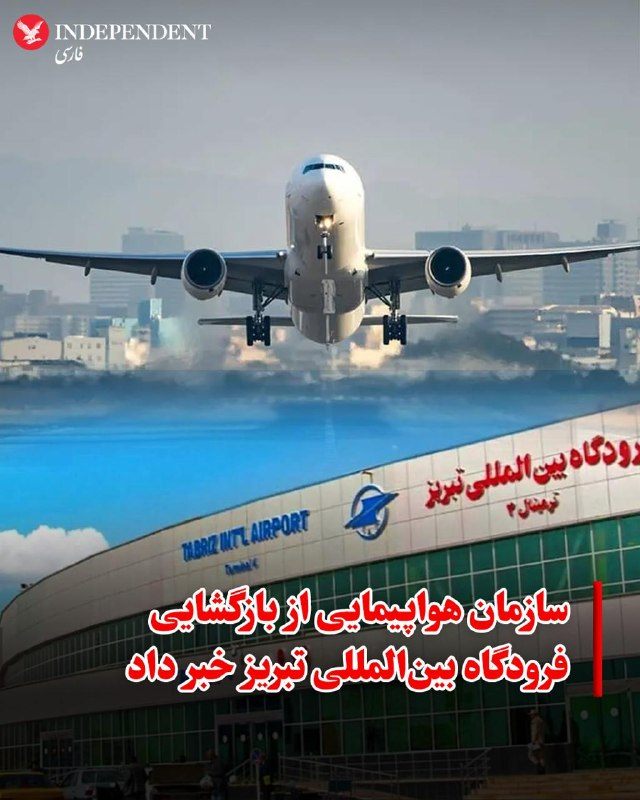
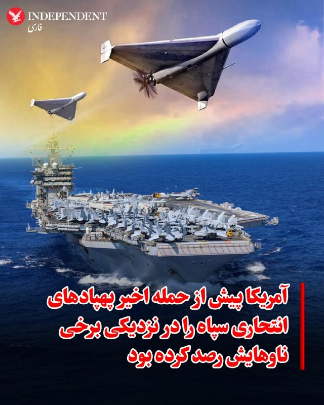
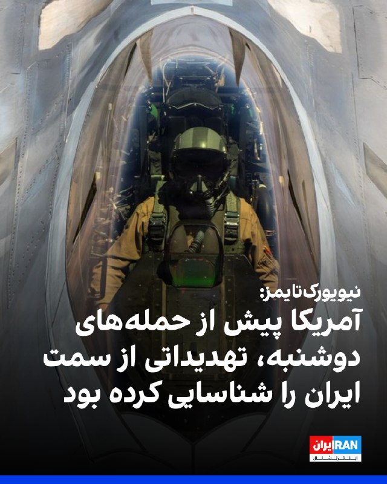
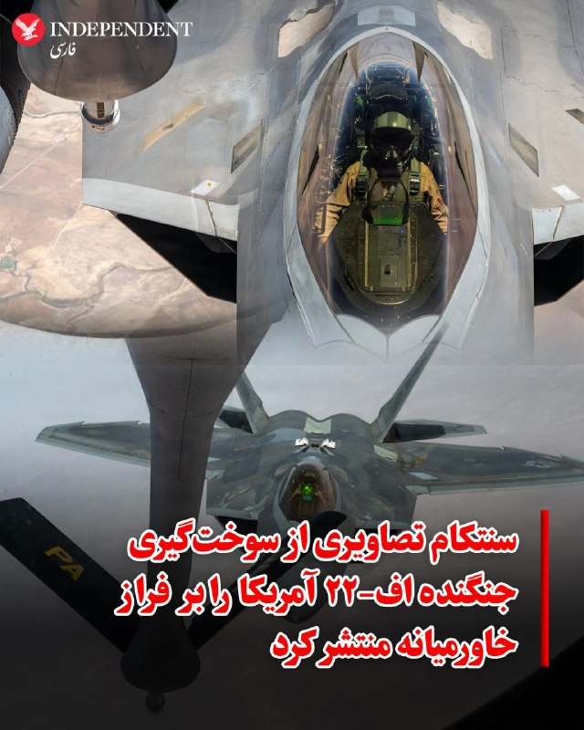
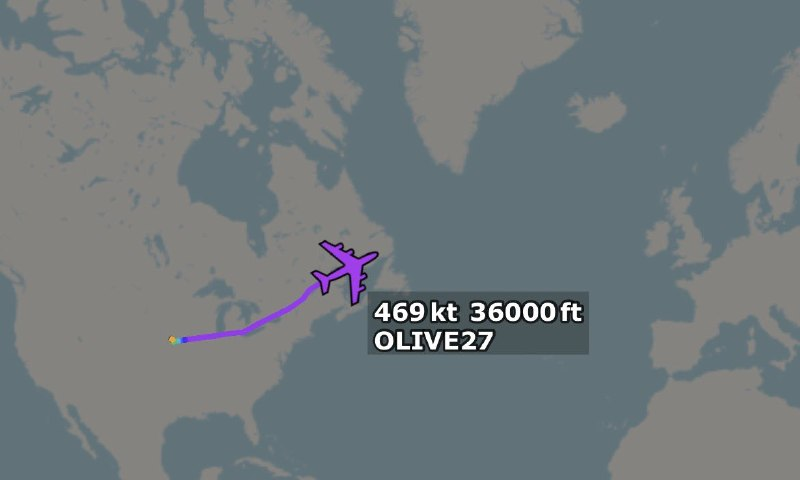
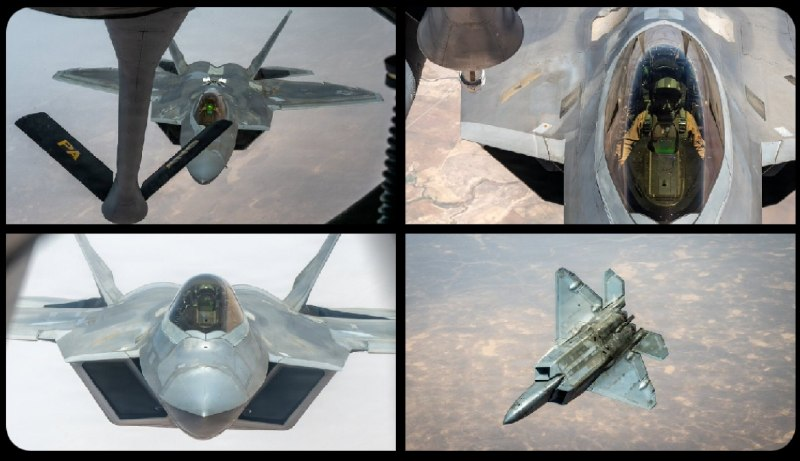
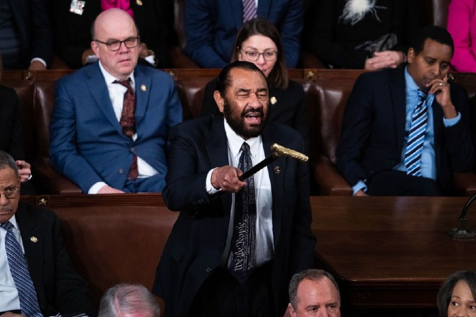
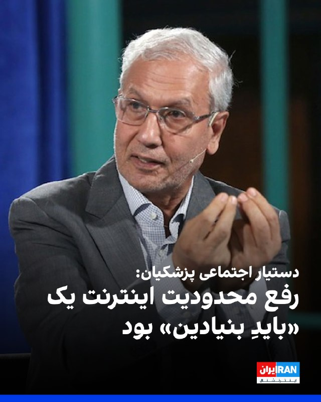
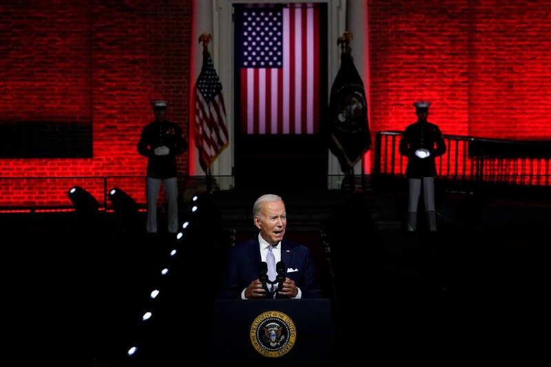

# خواننده تلگرام

<!-- TOP_NAV START -->

<a href="https://github.com/ERAGON007/aio-downloader-testing/blob/main/telegram/content/archive_1.md" style="display:inline-block; padding:6px 12px; margin:0 4px; background-color:#2ea44f; color:white; text-decoration:none; border-radius:4px; font-weight:bold;">صفحه بعد</a>

<!-- TOP_NAV END -->

<!-- MSG START -->

---
📅 بروزرسانی: 1405/03/06 07:30
---

## VahidOOnLine — post 242377

  <a href="telegram/content/VahidOOnLine_242377_1779854442.mp4" target="_blank">🎬 Download video</a>

♦️تیم ملی فوتبال عربستان سعودی، در چارچوب مرحله پایانی برنامه آماده‌سازی برای جام جهانی ۲۰۲۶، وارد شهر نیویورک آمریکا شد.
اعضای تیم ملی عربستان سعودی در فرودگاه جان اف کندی از سوی مقام‌های کنسولگری در نیویورک مورد استقبال قرار گرفتند. یاسر المسحل، رییس فدراسیون فوتبال عربستان سعودی، از همکاری و استقبال کنسولگری این کشور قدردانی کرد.
بر اساس برنامه اعلام‌شده، ۱۰ خرداد در نیویورک ادامه خواهد داشت و ملی‌پوشان عربستان سعودی در جریان آن، روز شنبه ۹ خرداد در یک بازی دوستانه به مصاف تیم ملی اکوادور می‌روند.
‌🇸🇦 Indypersian

🤖 @VahidOOnLine

## VahidOOnLine — post 242376

  

♦️سخنگوی سازمان هواپیمایی جمهوری اسلامی ایران اعلام کرد فرودگاه بین‌المللی تبریز که در جریان جنگ اخیر هدف حمله قرار گرفته بود، پس از انجام عملیات بازسازی و تعمیر، دوباره به مدار فعالیت بازگشته و چهارشنبه ششم خردادماه بازگشایی می‌شود.
‌🇸🇦 Indypersian

🤖 @VahidOOnLine

## VahidOOnLine — post 242375

♦️ویدیوهای منتشرشده از مراسم حج، شماری از زائران ایرانی را نشان می‌دهد که در جریان برگزاری مناسک، شعارهای علیه آمریکا و اسرائیل سر می‌دهند.
بیش از یک میلیون و ۵۰۰ هزار زائر، سه‌شنبه پنجم خردادماه، در صحرای عرفات در عربستان سعودی گرد هم آمدند تا مهم‌ترین بخش مناسک حج را به‌جا آورند.
حج امسال در شرایطی برگزار می‌شود که منطقه خاورمیانه همچنان تحت تاثیر تنش‌ها و پیامدهای جنگ میان آمریکا، اسرائیل و جمهوری اسلامی ایران قرار دارد.
‌🇸🇦 Indypersian

🤖 @VahidOOnLine

## VahidOOnLine — post 242374

  

علی ربیعی، دستیار اجتماعی پزشکیان، گفت: «رفع محدودیت اینترنت یک بایدِ بنیادین بود. مایه تاسف است که صداوسیما در صف اول هجمه به این تصمیم ایستاده است.»
پس از ۸۸ روز تاریکی دیجیتال در ایران، دسترسی به اینترنت به تدریج برقرار شده است. نت‌بلاکس در ایکس اعلام کرد اتصال اینترنت در ایران افزایش بیشتری یافته و به ۸۶ درصد رسیده است، شبکه‌های موبایل و بخش‌های دیگری از اینترنت نیز دوباره به اینترنت جهانی متصل شده‌اند. نت‌بلاکس افزود «فیلترنت» همچنان برقرار است اما امکان دور زدن آن وجود دارد.
همچنین واتس‌اپ اکنون محدود شده و برای دسترسی به آن نیازمند فیلترشکن است. از سوی دیگر، برخی کاربران همچنان به اینترنت جهانی دسترسی ندارند.

‌🏁 🇬🇧 IranintlTV

🤖 @VahidOOnLine

## VahidOOnLine — post 242373

♦️مارکو روبیو، وزیر امور خارجه ایالات متحده، در جریان سفر خود به هند، به همراه همسرش از بنیاد مادر ترزا بازدید کرد و تصاویری از این دیدار را در شبکه اجتماعی اکس منتشر کرد.
روبیو در پیامی نوشت: «بازدید از خانه مادر عمیقا مرا تحت تاثیر قرار داد. میراث مادر ترزا در ایمان، شفقت و خدمت، الهام‌بخش همه ما است.»
مادر ترزا، برنده جایزه صلح نوبل، راهبه‌ای کاتولیک بود که سازمان خیریه «مبلغان خیریه» را سال ۱۹۵۰ بنیان گذاشت. او سال ۱۹۹۷ درگذشت. مرکز این سازمان در ایالت بنگال غربی در شرق هند قرار دارد و بیش از سه هزار راهبه در نقاط مختلف جهان، در آسایشگاه‌ها، آشپزخانه‌های عمومی، مدرسه‌ها، جذام‌خانه‌ها و پناهگاه‌های کودکان بی‌سرپرست به امدادرسانی مشغول‌اند.
‌🇸🇦 Indypersian

🤖 @VahidOOnLine

## VahidOOnLine — post 242372

  

وال‌استریت ژورنال به نقل از مقام‌های ایرانی و میانجی‌های عرب گزارش داد جمهوری اسلامی در راهبرد مذاکره با آمریکا به دنبال دستیابی به گشایش مالی برای اقتصاد خود است، بدون آنکه در برنامه هسته‌ای خود در حدی امتیاز بدهد که ترامپ بتواند ادعای پیروزی کند.
به گفته این مقام‌ها، تهران در پی آن است که با بازپس‌گیری کنترل بخشی از حدود ۱۰۰ میلیارد دلار دارایی مسدودشده از سوی غرب و بازیابی دسترسی به بازارهای جهانی نفت، به گشایش اقتصادی دست یابد.

‌🏁 🇬🇧 IranintlTV

🤖 @VahidOOnLine

## VahidOOnLine — post 242371

  

♦️مقام‌هایی که نخواستند نامشان فاش شود، به نیویورک تایمز گفتند جمهوری اسلامی پهپادهای انتحاری یک‌طرفه را در نزدیکی برخی از نزدیک به ۲۴ ناو جنگی نیروی دریایی آمریکا در خلیج فارس و دریای عرب به پرواز درآورد. این ناوها در حال اجرای محاصره دریایی علیه کشتی‌هایی هستند که تلاش می‌کنند وارد بنادر ایران شوند یا از آن‌ها خارج شوند.
برایاس این گزارش، تحلیلگران نظامی آمریکا همچنین تحرکاتی را در برخی از سایت‌های موشکی زمین‌به‌هوای ایران در نزدیکی تنگه هرمز شناسایی کردند؛ تحرکاتی که جنگنده‌های مستقر در پایگاه‌های زمینی و ناوهای هواپیمابر آمریکا را که در چارچوب محاصره دریایی در منطقه فعالیت می‌کنند، تهدید می‌کرد.
‌🇸🇦 Indypersian

🤖 @VahidOOnLine

## VahidOOnLine — post 242370

♦️وال استریت ژورنال با اشاره به حمله دوشنبه‌شب آمریکا به قایق‌های سپاه و کشته شدن چند عضو سپاه می‌نویسد که حکومت ایران این حمله‌ها را نادیده گرفت تا مذاکرات با آمریکا ادامه پیدا کند چرا که به شدت به منابع مالی نیاز دارد که امیدوار است از طریق مذاکرات به آنها دسترسی پیدا کند. به گزارش این روزنامه آمریکایی، ایران نشان داد که حملات نظامی مذاکرات را متوقف نخواهد کرد. محمدباقر قالیباف، مذاکره‌کننده حکومت ایران که روز دوشنبه به قطر رفته بود، روز سه‌شنبه پس از این حملات همچنان در دوحه سرگرم گفتگو بود. مقام‌ها گفتند تهران اعلام کشته‌شدن چند عضو سپاه پاسداران در حمله آمریکا را به تعویق انداخت تا روند مذاکرات آسیب نبیند. این در حالی است که میانجی‌ها، از جمله پاکستان، قطر و مصر، در تلاش‌اند دو طرف را برای کاهش اختلافات به هم نزدیک کنند. به گفته مقام‌های جمهوری اسلامی و کشورهای میانجی، یکی از محورهای اصلی گفت‌وگوهای قالیباف در قطر، آزادسازی ۲۴ میلیارد دلار ـ معادل یک‌چهارم دارایی‌های مسدودشده ایران در خارج ـ بوده است. این مقام‌ها گفتند ایران به توافقی نزدیک شده تا نیمی از این مبلغ در مرحله اولیه آزاد شود
‌🇸🇦 Indypersian

🤖 @VahidOOnLine

## VahidOOnLine — post 242369

  <a href="telegram/content/VahidOOnLine_242369_1779854449.mp4" target="_blank">🎬 Download video</a>

پاپ لئو، رهبر کاتولیک‌های جهان، روز سه‌شنبه، پس از توقیف یک کاروان دریایی حامل کمک به غزه به‌دست نیروهای اسرائیلی، خواستار رساندن کمک‌های بشردوستانه به مردم غزه شد و بر رعایت حقوق بشر تاکید کرد.
‌🏁 🇬🇧 IranintlTV

🤖 @VahidOOnLine

## VahidOOnLine — post 242368

♦️به گزارش رویترز، شرکت خودروسازی فراری از نخستین مدل تمام برقی خود با نام «لوچه» (Luce) رونمایی کرد. این خودروی چهاردر که اولین مدل ۵ صندلی فراری به شمار می‌رود، با همکاری جانی آیو، مدیر پیشین طراحی اپل طراحی شده است و با قیمت ۵۵۰ هزار یورو (۶۴۰ هزار دلار) از اواخر سال ۲۰۲۶ به مشتریان تحویل داده می‌شود.
فراری در این مدل با تقویت ارتعاشات طبیعی موتور برقی، حس اصیل موتورهای سنتی خود را حفظ کرده است تا بتواند نسل جدید خریداران شیفته فناوری و هوش مصنوعی را جذب کند. رونمایی از این خودرو با بازدهی مسافتی بیش از ۵۰۰ کیلومتر، یک قمار بزرگ برای فراری است؛ آن هم در وضعیتی که رقبایی چون پورشه و لامبورگینی به دلیل کاهش تقاضا در بازار، برنامه‌های تولید خودروهای برقی خود را محدود کرده‌اند.
‌🇸🇦 Indypersian

🤖 @VahidOOnLine

## VahidOOnLine — post 242367

  

نیویورک‌تایمز به نقل از مقام‌های آگاه گزارش داد پیش از حمله‌های دوشنبه آمریکا به برخی اهداف در جنوب ایران، جمهوری اسلامی به سوی بیش از ۱۰ ناو جنگی نیروی دریایی آمریکا در خلیج عمان و دریای عرب یا اطراف آنها پهپادهای انتحاری پرتاب کرده بود.
این گزارش افزود تحلیلگران نظامی آمریکایی همچنین فعالیت‌هایی را در برخی از سامانه‌های موشکی زمین به هوای ایران در نزدیکی تنگه هرمز شناسایی کردند که هواپیماهای تهاجمی مستقر در خشکی و ناو هواپیمابر را که در چارچوب محاصره دریایی در منطقه فعالیت می‌کنند، تهدید می‌کند.

‌🏁 🇬🇧 IranintlTV

🤖 @VahidOOnLine

## VahidOOnLine — post 242366

  

♦️ستاد فرماندهی مرکزی آمریکا، سنتکام، روز سه‌شنبه تصویر سوخت‌گیری هوایی یک فروند جنگنده رادارگریز اف-۲۲ پنهان‌کار نیروی هوایی ایالات متحده را هنگام پرواز در آسمان خاورمیانه منتشر کرد. سنتکام اعلام کرد که این جنگنده پنهان‌کار توسط هواپیمای سوخت‌رسان کی‌سی-۱۳۵ در حال دریافت سوخت در آسمان است.
‌🇸🇦 Indypersian

🤖 @VahidOOnLine

## WithYashar — post 12624

گویا موشلی رو جمعه در تهران و شنبه در مشهد تشیع میکنند
@withyashar

## mwarmonitor — post 9785

  

USAF نیروی هوایی ایالات متحده✈️

✈️یک فروند بوئینگ شناسایی و عملیات ویژه TC-135 استراتولیفتر
AE01D3 62-4129 – OLIVE 27

✈️پرواز OLIVE 27 بار دیگر از پایگاه هوایی آفوت آمریکا به مقصد خانیا یونان انجام می‌شود؛ این بار به‌صورت پرواز مستقیم و بدون توقف قبلی در میلدنهال انگلستان.

@mwarmonitor

## mwarmonitor — post 9784

  

🔸یک جنگنده پنهانکار اف-۲۲ رپتور نیروی هوایی ایالات متحده در حال پرواز بر فراز خاورمیانه، توسط یک هواپیمای سوخت‌رسان KC-135 استراتوتانکر سوخت‌گیری می‌شود.

@mwarmonitor

## FoxNewsTwitter — post 342295

  

Fox News (Twitter/X)

“We just sent a Texas-sized message to Washington.”

Texas AG Ken Paxton speaks after defeating Sen. John Cornyn in Texas’ Republican Senate primary runoff, calling the victory a mandate for change inside the GOP.

Paxton now faces Democrat James Talarico in a race that is among a handful that could decide if the Republicans hold their slim 53-47 majority in the Senate.

## FoxNewsTwitter — post 342294

  

Fox News (Twitter/X)

WATCH LIVE: Trump-ally Ken Paxton speaks after defeating Senator Cornyn in GOP primary https://twitter.com/i/broadcasts/1pKdRRDwkjaJW

## FoxNewsTwitter — post 342293

  <a href="telegram/content/FoxNewsTwitter_342293_1779854455.mp4" target="_blank">🎬 Download video</a>

Fox News (Twitter/X)

NOW: Sen. John Cornyn speaks after losing Texas’ Republican Senate primary runoff to Trump-backed Texas Attorney General Ken Paxton.

"After a public service career lasting more than four decades and 18 consecutive campaign wins, tonight, we've come up short in this primary runoff."

He says he intends to support the Republican ticket in the general election.

## FoxNewsTwitter — post 342292

  

Fox News (Twitter/X)

WATCH LIVE: Senator Cornyn speaks after losing GOP primary to Trump-ally Ken Paxton https://twitter.com/i/broadcasts/1rGmqqpEvPwGy

## FoxNewsTwitter — post 342291

  

Fox News (Twitter/X)

BREAKING: Trump ally Ken Paxton defeats Sen. John Cornyn in Texas’ bitter Republican primary war.

Trump targeted Cornyn as "VERY disloyal" as he backed Paxton, a MAGA firebrand, in the final days of the runoff campaign.

Paxton now faces off against state Rep. James Talarico — a rising star in the Democratic Party — in the general election in a race that is among a handful that may decide if the Republicans hold their slim 53-47 majority in the Senate.

## FoxNewsTwitter — post 342290

  

Fox News (Twitter/X)

BREAKING: One of Congress’ most aggressive Trump critics just lost his seat in Texas.

Rep. Al Green, the Democrat who repeatedly pushed to impeach President Trump, was defeated in a heated primary race against fellow Texas Rep. Christian Menefee.

Green built a national profile during Trump’s first term by relentlessly criticizing the president and repeatedly interrupting his State of the Union speeches.

Now, after years in office, one of Trump’s loudest congressional opponents is out.

## FoxNewsTwitter — post 342289

  <a href="telegram/content/FoxNewsTwitter_342289_1779854459.mp4" target="_blank">🎬 Download video</a>

Fox News (Twitter/X)

“NYPD! NYPD!” chants rang through a crowd outside Gracie Mansion on Tuesday night as protesters thanked New York police officers for keeping the city safe.

The crowd was gathered out NYC Mayor Mamdani's residence to call for Governor Hochul to remove him from office, citing his perceived failure to address rising radicalization and antisemitism.

## VahidOnline — post 75741

  

نیویورک تایمز به نقل از دو مقام آمریکایی در روز سه‌شنبه ۵ خرداد گزارش داد که حملات دوشنبه شب نظامی ایالات متحده به اهدافی در جنوب ایران پس از آن صورت گرفت که تحلیلگران اطلاعاتی، مجموعه‌ای از اقدامات نظامی بالقوه تهدیدآمیز جمهوری اسلامی را در ۲۴ ساعت منتهی به این حملات شناسایی کردند.

هواپیماهای جنگی آمریکا دو قایق تندرو سپاه پاسداران انقلاب اسلامی را که سعی در مین‌گذاری در تنگه هرمز داشتند، غرق کردند.

این مقامات که نخواستند نامشان فاش شود، همچنین گفتند که جمهوری اسلامی پهپادهای تهاجمی یک‌طرفه را به سمت حدود دوازده کشتی جنگی نیروی دریایی ایالات متحده که در خلیج عمان و دریای عرب یا اطراف آن هستند شلیک کرد. این کشتی‌ها در حال اعمال محاصره دریایی آمریکا علیه جمهوری اسلامی هستند.

طبق این گزارش تحلیلگران نظامی آمریکا همچنین فعالیت‌هایی را در برخی از سایت‌های موشکی زمین به هوای جمهوری اسلامی در نزدیکی تنگه هرمز شناسایی کردند؛ فعالیت‌هایی که امنیت هواپیماهای جنگی آمریکایی مستقر بر روی زمین و آن‌هایی که روی ناو هواپیمابر آمریکا در منطقه به عنوان بخشی از نیروی اعمال‌کننده محاصره دریایی حضور دارند، تهدید می‌کرد.

تیم هاوکینز، سخنگوی فرماندهی مرکزی ایالات متحده، روز دوشنبه در بیانیه‌ای گفت که ایالات متحده «برای محافظت از نیروهای خود در برابر تهدیدات نیروهای» جمهوری اسلامی حملاتی را به اهدافی در جنوب ایران انجام داد.

سایر مقامات پنتاگون گزارش‌های رسانه‌های داخلی در ایران را که در روز سه‌شنبه مدعی شدند یک پهپاد آمریکایی «ام-کیو۹ ریپر» توسط جمهوری اسلامی سرنگون شد، رد کردند.
@VahidHeadline

📡 @VahidOnline

## IranIntlTV — post 339181

  

علی ربیعی، دستیار اجتماعی پزشکیان، گفت: «رفع محدودیت اینترنت یک بایدِ بنیادین بود. مایه تاسف است که صداوسیما در صف اول هجمه به این تصمیم ایستاده است.»
پس از ۸۸ روز تاریکی دیجیتال در ایران، دسترسی به اینترنت به تدریج برقرار شده است. نت‌بلاکس در ایکس اعلام کرد اتصال اینترنت در ایران افزایش بیشتری یافته و به ۸۶ درصد رسیده است، شبکه‌های موبایل و بخش‌های دیگری از اینترنت نیز دوباره به اینترنت جهانی متصل شده‌اند. نت‌بلاکس افزود «فیلترنت» همچنان برقرار است اما امکان دور زدن آن وجود دارد.
همچنین واتس‌اپ اکنون محدود شده و برای دسترسی به آن نیازمند فیلترشکن است. از سوی دیگر، برخی کاربران همچنان به اینترنت جهانی دسترسی ندارند.

https://iranintl.com/202605273087

## IranIntlTV — post 339180

  

وال‌استریت ژورنال به نقل از مقام‌های ایرانی و میانجی‌های عرب گزارش داد جمهوری اسلامی در راهبرد مذاکره با آمریکا به دنبال دستیابی به گشایش مالی برای اقتصاد خود است، بدون آنکه در برنامه هسته‌ای خود در حدی امتیاز بدهد که ترامپ بتواند ادعای پیروزی کند.
به گفته این مقام‌ها، تهران در پی آن است که با بازپس‌گیری کنترل بخشی از حدود ۱۰۰ میلیارد دلار دارایی مسدودشده از سوی غرب و بازیابی دسترسی به بازارهای جهانی نفت، به گشایش اقتصادی دست یابد.

https://iranintl.com/202605272549

## IranIntlTV — post 339179

  <a href="telegram/content/IranIntlTV_339179_1779854463.mp4" target="_blank">🎬 Download video</a>

پاپ لئو، رهبر کاتولیک‌های جهان، روز سه‌شنبه، پس از توقیف یک کاروان دریایی حامل کمک به غزه به‌دست نیروهای اسرائیلی، خواستار رساندن کمک‌های بشردوستانه به مردم غزه شد و بر رعایت حقوق بشر تاکید کرد.

## IranIntlTV — post 339178

  

نیویورک‌تایمز به نقل از مقام‌های آگاه گزارش داد پیش از حمله‌های دوشنبه آمریکا به برخی اهداف در جنوب ایران، جمهوری اسلامی به سوی بیش از ۱۰ ناو جنگی نیروی دریایی آمریکا در خلیج عمان و دریای عرب یا اطراف آنها پهپادهای انتحاری پرتاب کرده بود.
این گزارش افزود تحلیلگران نظامی آمریکایی همچنین فعالیت‌هایی را در برخی از سامانه‌های موشکی زمین به هوای ایران در نزدیکی تنگه هرمز شناسایی کردند که هواپیماهای تهاجمی مستقر در خشکی و ناو هواپیمابر را که در چارچوب محاصره دریایی در منطقه فعالیت می‌کنند، تهدید می‌کند.

https://iranintl.com/202605278813

## Shin_Persian — post 6256

Shin ✓ @hey_itsmyturn
Wed, 27 May 2026 00:20:37 UTC

Several airstrikes on Nabatieh, southern Lebanon
+
Jet activity over Baghdad, Iraq.

فارسی

چندین حمله هوایی به نبطیه در جنوب لبنان
+
فعالیت جنگنده‌ها بر فراز بغداد، عراق.

𝕏 · @shin_persian

## FarsiVOA — post 218771

⚡️کارایی پهپادهای ام‌کیو-۹ در عملیات خشم حماسی برنامه تولید نسل آینده پهپادهای پیشرفته و ارزانتر را شتاب بخشید
@FarsiVOA

## FarsiVOA — post 218770

  

⚡️مارکو روبیو، وزیر امورخارجه آمریکا، روز سه‌شنبه در ارمنستان سند چارچوب توافق «جاده ترامپ برای صلح و رفاه بین‌المللی» را امضا کرد. آقای روبیو و همتای ارمنی او، آرارات میرزویان، همچنین سندی را در ارتباط با مواد معدنی حیاتی و نادر امضا کردند.

@FarsiVOA

## FarsiVOA — post 218769

  

⚡️بنیامین نتانیاهو، نخست وزیر اسرائيل روز سه‌شنبه گفت از زمان عملیات «غرش شیران»، «ما تقریباً ۲۵۰۰ تروریست حزب‌الله را از بین برده‌ایم.» او افزود «تنها در طول آتش‌بس، ۷۰۰ تروریست حزب‌الله از بین رفتند، بیشتر از تعداد تروریست‌هایی که در کل جنگ دوم لبنان از بین رفتند.»
@FarsiVOA

## FarsiVOA — post 218768

⚡️ربودن افراد در خارج از کشور بخشی از رویه جمهوری اسلامی برای حذف مخالفان؛ گفت‌وگو با سعید دهقان
@FarsiVOA

## FarsiVOA — post 218767

⚡️پرزیدنت ترامپ در آستانه تصمیم‌گیری مهمی درباره ایران؛ گفت‌وگو با محمد قائدی
@FarsiVOA

## FarsiVOA — post 218766

⚡️بازی جمهوری اسلامی با قطع و وصل اینترنت؛ دولت مصوبه می‌دهد، دیوان عدالت توقیف می‌کند
@FarsiVOA

## FarsiVOA — post 218765

  <a href="telegram/content/FarsiVOA_218765_1779854466.mp4" target="_blank">🎬 Download video</a>

⚡️ستاد فرماندهی جنوبی آمریکا ۵ خرداد از حمله نیروهای آمریکایی به یک شناور قاچاقچیان موادمخدر «سازمان‌های تروریستی شناخته‌شده» در شرق اقیانوس آرام خبر داد و گفت در این حمله یک «مرد تروریست» کشته شد. این ستاد سپس نیروهای گارد ساحلی آمریکا را برای انجام عملیات جست‌وجو و نجات دو سرنشین دیگر آن آگاه کرد.
@FarsiVOA

## FarsiVOA — post 218764

⚡️هوش مصنوعی و آینده بازار کار؛ هشدار یا امید؟
@FarsiVOA

## FarsiVOA — post 218763

⚡️شکنندگی دیپلماسی در دوحه؛ دورنمای بازار جهانی انرژی و تورم
@FarsiVOA

## FarsiVOA — post 218762

🔺گزارش نیویورک تایمز از اقدامات جمهوری اسلامی که منجر به حمله شبانه آمریکا به مواضع آن در جنوب ایران شد؛ مقامات: سرنگونی ام‌کیو‌-۹ کذب است

▪️نیویورک تایمز به نقل از دو مقام آمریکایی در روز سه‌شنبه ۵ خرداد گزارش داد که حملات دوشنبه شب نظامی ایالات متحده به اهدافی در جنوب ایران پس از آن صورت گرفت که تحلیلگران اطلاعاتی، مجموعه‌ای از اقدامات نظامی بالقوه تهدیدآمیز جمهوری اسلامی را در ۲۴ ساعت منتهی به این حملات شناسایی کردند.

⬇️ بیشتر بخوانید:
https://ir.voanews.com/a/8154413.html
@FarsiVOA

## FarsiVOA — post 218761

⚡️افزایش هزنیه‌های انرژی؛ نخست‌وزیر ایتالیا خواستار بازنگری در قوانین مالی اتحادیه اروپا شد
@FarsiVOA

## FarsiVOA — post 218760

⚡️انتقاد سفیر بریتانیا از نفوذ تهران در بغداد و متهم کردن جمهوری اسلامی به فعالیت «مافیایی» در عراق
@FarsiVOA

## FarsiVOA — post 218759

  <a href="telegram/content/FarsiVOA_218759_1779854467.mp4" target="_blank">🎬 Download video</a>

⚡️هشدار روسیه درباره گسترش «داعش خراسان» و تهدیدهای امنیتی در منطقه
@FarsiVOA

## FarsiVOA — post 218758

⚡️واکنش رسانه‌های بریتانیایی به بازگشایی محدود اینترنت در ایران
@FarsiVOA

## FarsiVOA — post 218757

  <a href="telegram/content/FarsiVOA_218757_1779854468.mp4" target="_blank">🎬 Download video</a>

⚡️سیاست‌های مهاجرتی سخت‌گیرانه‌تر در کانون توجه فرانسه
@FarsiVOA

## Persian_Trend_Official — post 15097

  <a href="telegram/content/Persian_Trend_Official_15097_1779854469.mp4" target="_blank">🎬 Download video</a>

صبحتون بخیر ☕️🤍

📝 Nick
📌 @persian_trend_official
پرشین ترند | متفاوت‌ترین کانال نظامی

## Persian_Trend_Official — post 15096

  

💢اگر ایران تسلیم شود، اعتراف کند نیروی دریایی‌اش نابود شده و در کف دریا آرمیده است، و نیروی هوایی‌اش دیگر وجود ندارد، و اگر تمام ارتششان از تهران خارج شود، سلاح‌ها را زمین بیندازند و دست‌ها را بالا ببرند و هرکدام فریاد بزنند «تسلیم می‌شوم، تسلیم می‌شوم» در حالی که دیوانه‌وار پرچم سفید را تکان می‌دهند، و اگر تمام رهبران باقی‌مانده‌شان همه «اسناد تسلیم» لازم را امضا کنند و شکست خود را در برابر قدرت عظیم و باشکوه ایالات متحده آمریکا بپذیرند، باز هم نیویورک تایمز شکست‌خورده، «چاینا استریت ژورنال» (WSJ!)، سی‌ان‌ان فاسد و حالا بی‌اهمیت، و تمام رسانه‌های جعلی دیگر تیتر خواهند زد که ایران یک پیروزی استادانه و درخشان مقابل ایالات متحده آمریکا به دست آورد و اصلاً رقابتی هم وجود نداشت. دموکرات‌های احمق و رسانه‌ها کاملاً راه خود را گم کرده‌اند. آن‌ها کاملاً دیوانه شده‌اند!!!

رئیس‌جمهور DJT

🫆:Tony

📌 @persian_trend_official
پرشین ترند | متفاوت‌ترین کانال نظامی

## Persian_Trend_Official — post 15095

  

🔴 رویترز: بایدن برای جلوگیری از انتشار فایل‌های صوتی خصوصی‌اش از وزارت دادگستری شکایت کرد

💢جو بایدن از وزارت دادگستری آمریکا شکایت کرده تا مانع انتشار فایل‌های صوتی و متن گفت‌وگوهای خصوصی خود با زندگی‌نامه‌نویسش در سال‌های ۲۰۱۶ و ۲۰۱۷ شود

▪️ قرار است این اسناد در ۱۵ ژوئن در اختیار کمیته قضایی مجلس نمایندگان آمریکا و بنیاد Heritage قرار گیرد

▪️ این فایل‌ها پیش‌تر در تحقیقات رابرت هِر درباره نگهداری اسناد محرمانه توسط بایدن مورد استفاده قرار گرفته بودند

🫆:Tony

📌 @persian_trend_official
پرشین ترند | متفاوت‌ترین کانال نظامی

## Persian_Trend_Official — post 15094

  <a href="telegram/content/Persian_Trend_Official_15094_1779854472.mp4" target="_blank">🎬 Download video</a>

🔴 حملات اسرائیل به مشغره لبنان؛ دست‌کم ۱۲ کشته و ده‌ها زخمی

▪️ در حملات اسرائیل به شهر Mashghara در بقاع غربی لبنان، دست‌کم ۱۲ نفر کشته و ده‌ها نفر دیگر زخمی شدند

▪️ گزارش‌ها حاکی است شماری از کودکان نیز در میان قربانیان هستند

▪️ خبرنگاران محلی می‌گویند برخی خانواده‌ها به‌طور کامل در داخل خانه‌هایشان کشته شده‌اند

⚠️ ویدئوهای منتشرشده، عملیات نجات یک کودک از زیر آوار را نشان می‌دهد حاوی تصاویر ناراحت کننده میباشد.

🫆:Tony

📌 @persian_trend_official
پرشین ترند | متفاوت‌ترین کانال نظامی

## Persian_Trend_Official — post 15093

  <a href="telegram/content/Persian_Trend_Official_15093_1779854473.mp4" target="_blank">🎬 Download video</a>

🔴 تصاویر منتشرشده از حملات هوایی جدید به شهر Sohmor در شرق لبنان

💢 ویدئوهای منتشرشده نشان می‌دهد حملات هوایی تازه‌ای شهر Sohmor در شرق لبنان را هدف قرار داده است
▪️ تاکنون جزئیات دقیقی درباره تلفات یا اهداف حمله منتشر نشده
▪️ همزمان حملات اسرائیل در جنوب و شرق لبنان طی ساعات اخیر شدت گرفته است

🫆:Tony

📌 @persian_trend_official
پرشین ترند | متفاوت‌ترین کانال نظامی

## Persian_Trend_Official — post 15092

  <a href="telegram/content/Persian_Trend_Official_15092_1779854475.mp4" target="_blank">🎬 Download video</a>

شبتون بخیر ❤️

📝 Nick

📌 @persian_trend_official
پرشین ترند | متفاوت‌ترین کانال نظامی

## IranianMinds — post 20851

  <a href="https://t.me/IranianMinds/20851" target="_blank">📎 Download file</a>

سرور فوق العاده پرسرعت و قوی مخصوص اینستا و یوتیوب سرعت فضایی مخصوص همراه اول مخابرات

آموزش اتصال در اندروید

آموزش اتصال در آیفون

حتما شیر بدید بقیه هم متصل شن لطفا دانلود سنگین هم نزنید ❤️‍🔥

@IranianMinds

## IranianMinds — post 20850

  <a href="https://t.me/IranianMinds/20850" target="_blank">📎 Download file</a>

سرور فوق العاده پرسرعت و قوی مخصوص اینستا و یوتیوب سرعت فضایی مخصوص همراه اول مخابرات

آموزش اتصال در اندروید

آموزش اتصال در آیفون

حتما شیر بدید بقیه هم متصل شن لطفا دانلود سنگین هم نزنید ❤️‍🔥

@IranianMinds

## BBCPersian — post 282158

  

🔻به گفته سخنگوی سازمان هواپیمایی کشوری ایران فرودگاه بین‌المللی تبریز، که در جریان جنگ اخیر آسیب دیده بود، از امروز - چهارشنبه ششم خرداد - فعالیت خود را از سر می‌گیرد.

مجید اخوان در گفت‌وگو با رسانه‌های داخلی ایران گفته است که نخستین پرواز این فرودگاه پس از پایان عملیات بازسازی انجام خواهد شد. به گفته او، فرودگاه تبریز بیست‌ویکمین فرودگاهی است که پس از پایان درگیری‌ها دوباره وارد چرخه عملیاتی می‌شود.

رسانه‌های داخلی ایران در هفته‌های گذشته گزارش داده بودند که در حملات به تبریز، باند و برج مراقبت این فرودگاه آسیب دیده است.

فرودگاه تبریز در کنار فرودگاه‌های مهرآباد، مشهد و امام از مهم‌ترین فرودگاه‌های ایران محسوب می‌شود و به حدود ۹ مقصد خارجی پرواز از جمله استانبول، بغداد، دبی، باکو و هامبورگ پرواز دارد.

مجید اخوان، سخنگوی سازمان هواپیمایی کشوری در گفتگو با خبرنگار مهر از بازگشت تدریجی فرودگاه‌های کشور به مدار خدمت‌رسانی پس از جنگ ۳۹ روزه آمریکا و اسرائیل با ایران خبر داد و گفت: تاکنون ۲۰ فرودگاه کشور و همچنین ابتدای این هفته سه فرودگاه اصفهان، اردبیل و لامرد بازگشایی شده‌اند.

📷MEHR
@bbcpersian

## BBCPersian — post 282157

🔻ده‌ها نفر کشته در لبنان در پی تشديد حملات اسرائيل

در پی موج جدید حملات اسرائيل به جنوب و شرق لبنان دهها نفر کشته شدند؛ این حملات گسترده پس از آنکه بنيامين نتانياهو، نخست وزير اسرائيل، وعده تشديد اقدام نظامی عليه حزب‌الله را داد به سرعت در نقاط مختلف لبنان شکل گرفت.

وزارت بهداشت لبنان روز سه‌شنبه اعلام کرد در تازه‌ترين موج حملات دست کم ۳۱ نفر، از جمله چند کودک، جان باخته‌اند.

ارتش اسرائيل گفته بيش از ۱۰۰ زيرساخت و محل استقرار حزب‌ الله را هدف قرار داده است؛ حملاتی که از زمان آغاز آتش‌بس با ميانجيگری آمريکا در اواسط آوريل، يکی از سنگين‌ترين شب‌های بمباران به شمار می‌رود.

اين حملات پس از آن انجام شد که آقای نتانياهو روز دوشنبه گفت دستور داده است برای هدف قرار دادن حزب الله «فشار بيشتری» اعمال شود.

او روز سه‌شنبه در نشست کابينه امنيتی گفت اسرائيل «در حال گسترش عمليات خود در لبنان» است.

آقای نتانياهو افزود: «نيروهای دفاعی اسرائيل با نيروهای گسترده در ميدان عمل می‌کنند و مناطق راهبردی را در اختيار می‌گيرند.» او همچنين گفت اسرائيل در حال «تقويت منطقه امنيتی» برای حفاظت از شهرک‌های شمالی اسرائيل در برابر حملات حزب الله است.

آتش‌بس ميان دو طرف بارها از سوی هر دو نقض شده و اين مسئله تهديدی برای مذاکرات پيچيده جاری با هدف پايان دادن به جنگ ميان آمريکا، اسرائيل و ايران به شمار می‌رود.

ایران بارها تاکید کرده که توقف جنگ در لبنان یکی از شروط مذاکره این کشور با آمریکا خواهد بود.

https://bbc.in/3PMVmbE
@bbcpersian

## BBCPersian — post 282156

🔻ناسا از گام‌های بعدی برای ساخت پايگاه دائمی در ماه رونمايی کرد

ناسا جزئيات فرودگرهای رباتيک، پهپادهای جهنده و خودروهايی را منتشر کرده که قصد دارد در چارچوب برنامه آمريکا برای ساخت پايگاه در ماه، به سطح اين قمر بفرستد.

شرکت فضايی بلو اوريجين متعلق به جف بزوس، بنيانگذار آمازون، يکی از چند شرکتی است که برای ساخت اين تجهيزات انتخاب شده‌اند.

آمریکا می‌خواهد پيش از پايان دوره رياست جمهوری دونالد ترامپ در سال ۲۰۲۸، بار ديگر فضانوردان آمريکايی را به ماه بازگرداند.

اما ناسا در رقابت با چين برای بازگرداندن انسان به سطح ماه قرار دارد و همين مسئله باعث شده اين سازمان فضايی تحت فشار باشد تا نشان دهد در «رقابت جديد فضايی» پيشتاز است.

چين نيز با سرعت برنامه‌های خود را برای فرود انسان بر ماه تا سال ۲۰۳۰ پيش می‌برد.

اين کشور روز دوشنبه فضاپيمای «شنژو-۲۳» را پرتاب کرد و گروهی از فضانوردان را به ايستگاه فضايی «تيانگونگ» فرستاد.

ناسا در ماه مارس از برنامه‌ای ۲۰ ميليارد دلاری برای ساخت يک پايگاه دائمی در قطب جنوب ماه تا سال ۲۰۳۲ خبر داده بود؛ پايگاهی که با انرژی هسته‌ای و خورشيدی فعاليت خواهد کرد.

جرد آيزاکمن، رئيس ناسا، روز سه‌شنبه گفت اين اعلام‌ها به اين معناست که آمريکا «ديگر هرگز ماه را واگذار نخواهد کرد.»

https://bbc.in/3PMVmbE
@bbcpersian

## BBCPersian — post 282147

🔻انقلاب فرهنگی چین، که از آغاز آن شش دهه می‌گذرد، یکی از تاریک‌ترین دوره‌های تاریخ این کشور بود.

در سال ۱۹۶۶، مائو تسه‌تونگ، رهبر کمونیست چین، کارزاری ملی را آغاز کرد تا آنچه را در حکومت، آموزش و هنر «عناصر ضد انقلاب»، «نفوذ سرمایه‌داری» و «تفکر بورژوایی» خوانده می‌شد، پاکسازی کند.

مائو در حقیقت علیه گذشته و آنچه «اندیشه‌های کهنه» و «آداب و رسوم کهنه» نامیده می‌شد، اعلام جنگ کرده بود.

قرار نبود بار اصلی این نبرد بر دوش پلیس یا نهادهای امنیتی باشد؛ بلکه ماموریت بر عهده شهروندان عادی، به‌ویژه جوانان، گذاشته شده بود تا علیه هم‌وطنان خود وارد عمل شوند.

یافنگ شیا، تاریخ‌دان و استاد دانشگاه لانگ آیلند در آمریکا، توضیح می‌دهد: «پیام مائو این بود: علیه استاد دانشگاهتان، علیه معلمتان، علیه رهبر حزبی‌تان، علیه مافوقتان و علیه مدیران کارخانه‌ها شورش کنید. شورش موجه است.»

برای خواندن مطلب کامل:
https://bbc.in/4a6teqH
📸GettyImages/Gamma-Rapho via Getty Images/ AFP
@bbcpersian

## BBCPersian — post 282146

🔸علیرضا فیروزجا، شطرنج‌باز فرانسوی - ایرانی‌تبار در دور نخست رقابت‌های شطرنج نروژ، توانست مگنوس کارلسن، نفر اول شطرنج جهان، را در یک بازی کلاسیک شکست دهد و اولین شگفتی این مسابقات را رقم بزند.

در تصاویری که از این مسابقه منتشر شده آقای فیروزجا با پایی که گچ بسته شده و مصدوم است در این مسابقه حضور یافته است.

از این رقابت‌ها تحت عنوان یکی از قدرتمندترین تورنمنت‌های تقویم سالانه شطرنج دنیا یاد شده است که امسال در شهر اسلو نروژ در حال برگزاری است.

مسابقات با حضور شش بازيکن برگزار می‌شود و در هر دور، ديدارهايی که با تساوی به پايان برسند با بازی‌های تعيين‌کننده موسوم به «آرماگدون» دنبال خواهند شد.

بنابر گزارش‌ها، علی فيروزجا تنها بازيکنی بوده که در روز افتتاحيه موفق به پیروزی مهم برابر نفر اول رنکینگ جهانی شده است.

🎥ISNA
@bbcpersian

## BBCPersian — post 282145

🔻امدادگران و شاهدان می‌گويند در حمله اسرائيل به شهر غزه، سه نفر کشته و دهها نفر زخمی شدند

به گفته امدادگران محلی و شاهدان، در پی يک حمله هوايی گسترده اسرائيل به يک ساختمان مسکونی در يکی از شلوغ‌ترين بازارهای شهر غزه، دست کم سه فلسطينی کشته و بيش از ۲۰ نفر ديگر زخمی شدند.

اين حمله سه طبقه بالايی ساختمان «الکيالی» در مرکز شهر غزه را هدف قرار داد؛ جايی که خيابان‌ها پيش از عيد قربان مملو از خريداران بود.

دفتر بنيامين نتانياهو، نخست وزير اسرائيل، پيش‌تر اعلام کرده بود ارتش اسرائيل محمد عوده، فرمانده شاخه نظامی حماس، را هدف قرار داده است؛ اقدامی که چند روز پس از کشته شدن فرمانده پيشين او در حمله‌ای مشابه انجام شد.

اين تازه‌ترين حمله مرگبار اسرائيل به غزه است؛ آن هم با وجود برقراری آتش‌بس ميان اسرائيل و حماس.

نه حماس و نه اسرائيل تاکنون درباره اينکه آيا محمد عوده در اين حمله کشته شده يا نه، اظهار نظری نکرده‌اند.

تيم‌های امداد و نجات به سرعت به محل اعزام شدند، اما به دليل شدت تخريب و ازدحام شديد در منطقه، برای دسترسی به طبقات بالايی ساختمان با مشکل مواجه شدند.

شاهدان گفتند دست کم پنج موشک تقريبا همزمان و از جهات مختلف به ساختمان اصابت کرده است.

https://bbc.in/3PMVmbE
@bbcpersian

## BBCPersian — post 282136

🖊کیلین دولین، بخش راستی‌آزمایی بی‌بی‌سی و فیبی کین، بی‌بی‌سی

«احساس کردم تمام کشتی لرزید. فکر کردم شاید موتور دچار نقص فنی شده باشد. اما به محض اینکه از اتاقم بیرون آمدم، انفجار دیگری رخ داد.»

سونیل پونیا، ۲۶ ساله، نخستین ماموریت دریایی خود را می‌گذراند که در ساعات اولیه اول مارس، موشکی به نفتکش اسکای‌لایت اصابت کرد.

این کشتی که تحت تحریم آمریکا بود، از دوبی حرکت کرده بود و به تنگه هرمز، یکی از پرترددترین مسیرهای کشتیرانی جهان، نزدیک می‌شد. اسکای‌لایت نخستین کشتی تجاری بود که پس از آغاز جنگ آمریکا و اسرائیل با ایران در منطقه هدف قرار گرفت.

هنگام حمله، سونیل در کابین خود در طبقه سوم خواب بود. وقتی بیدار شد، کشتی را در هرج‌ومرج دید. موشک به موتورخانه اصابت کرده بود و آتشی به راه انداخته بود که به‌سرعت در کشتی گسترش یافت.

او می‌گوید: «همه‌جا کاملا تاریک شده بود و دود همه‌جا را گرفته بود. همه برای نفس کشیدن مشکل داشتند.»

آلبوم را ورق بزنید و برای خواندن مطلب کامل به لینک زیر مراجعه کنید.

https://bbc.in/4vangxd
📸Getty/Reuters/ Sunil Puniya/ Family of Dalip Rathore/ Rex Pereira/ Sunil Pereira
@bbcpersian

<!-- MSG END -->

<!-- NAV START -->

<a href="https://github.com/ERAGON007/aio-downloader-testing/blob/main/telegram/content/archive_1.md" style="display:inline-block; padding:6px 12px; margin:0 4px; background-color:#2ea44f; color:white; text-decoration:none; border-radius:4px; font-weight:bold;">صفحه بعد</a>

<!-- NAV END -->
