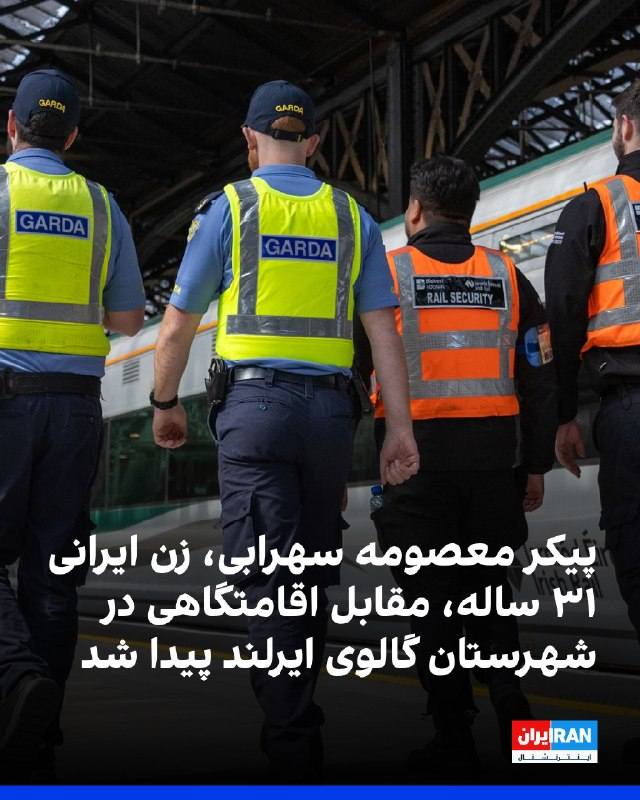
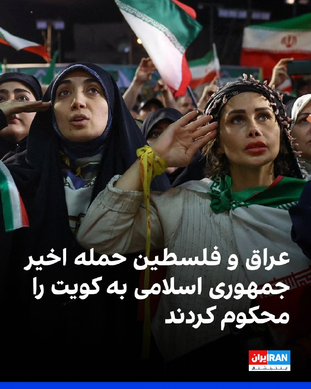
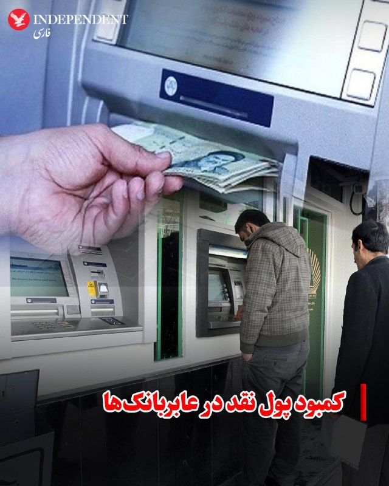
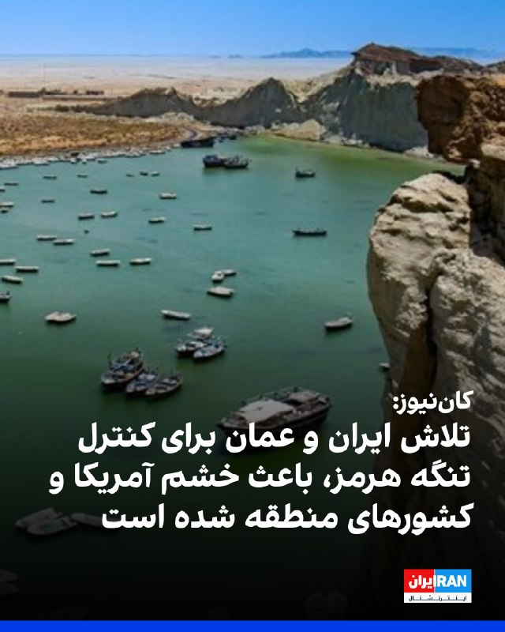
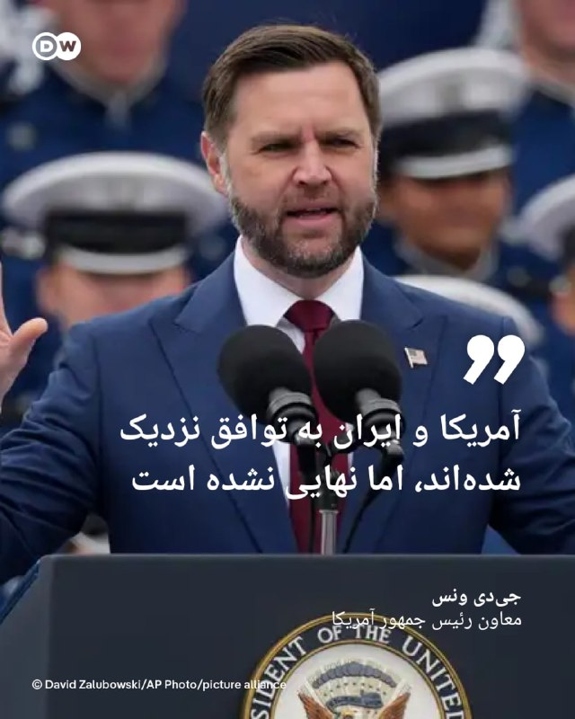
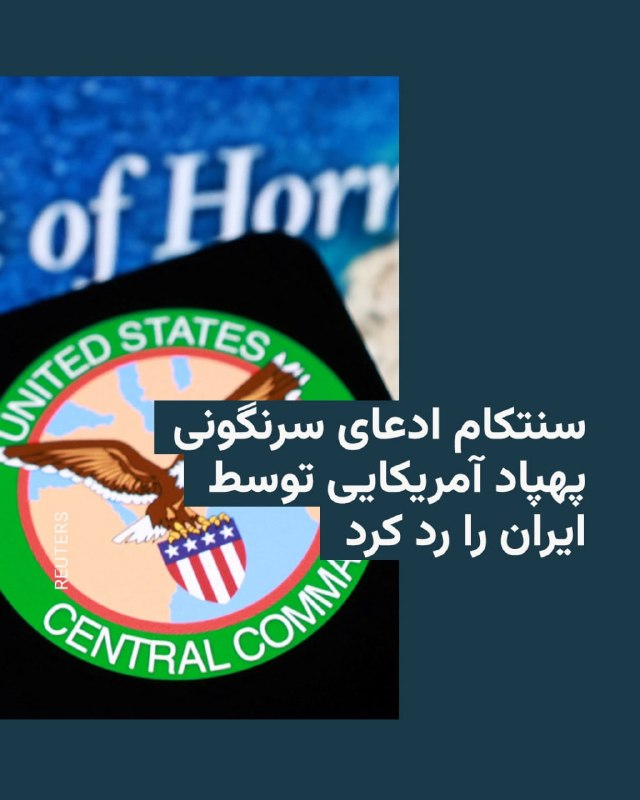
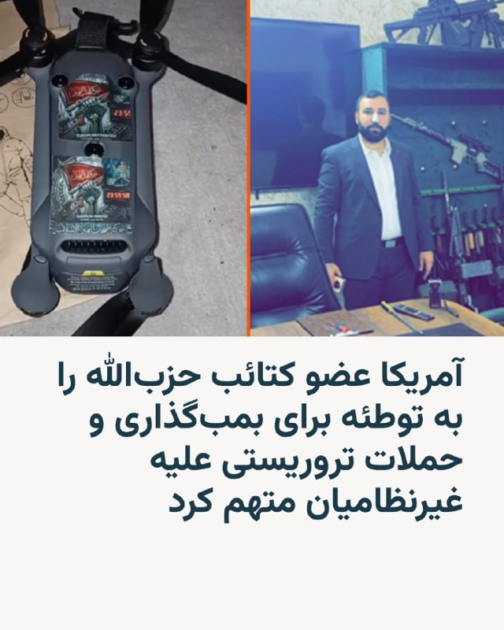
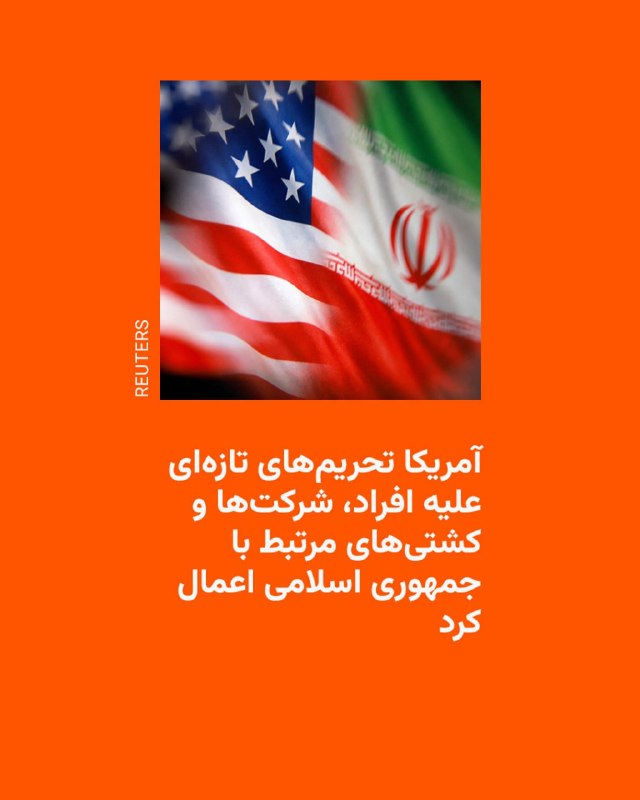
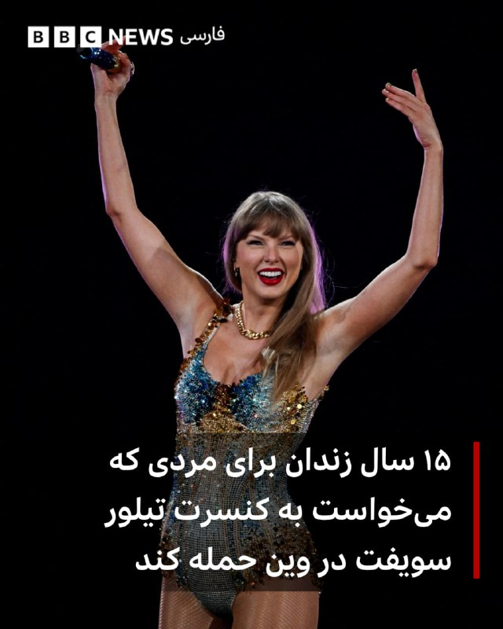
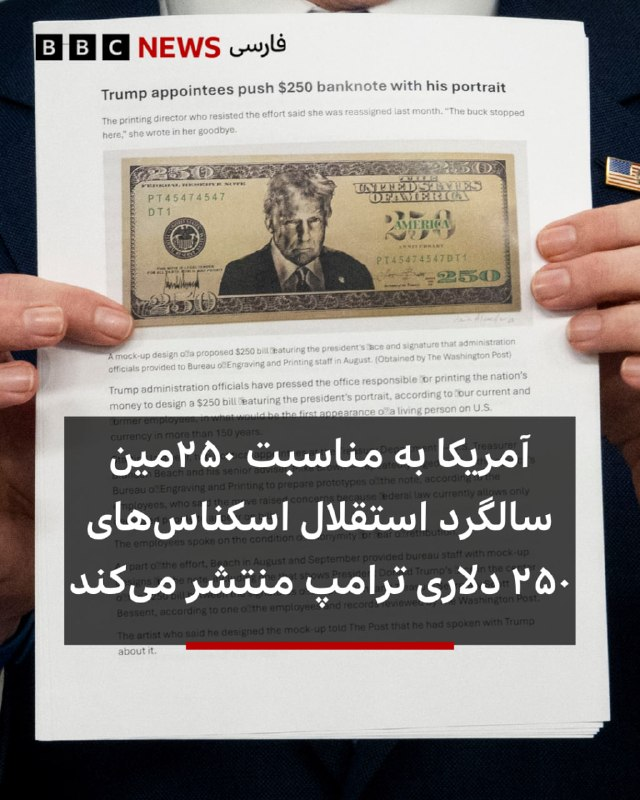

# خواننده تلگرام

<!-- TOP_NAV START -->

<a href="https://github.com/ERAGON007/aio-downloader-testing/blob/main/telegram/content/archive_1.md" style="display:inline-block; padding:6px 12px; margin:0 4px; background-color:#2ea44f; color:white; text-decoration:none; border-radius:4px; font-weight:bold;">صفحه بعد</a>

<!-- TOP_NAV END -->

<!-- MSG START -->

---
📅 بروزرسانی: 1405/03/08 09:50
---

## VahidOOnLine — post 242704

  

♦️جلال دهقانی فیروزآبادی، دبیر شورای راهبردی روابط خارجی جمهوری اسلامی ایران، روز جمعه هشتم خرداد ماه در گفتگویی با روزنامه شرق گفت چین به‌طور غیرمستقیم از پاکستان در مذاکرات مشارکت داشته و «یکی از بازیگرانی است تفاهم احتمالی میان آمریکا و ایران را تضمین می‌کند.»
دبیر شورای راهبردی روابط خارجی با اشاره به نقش پاکستان در مذاکرات گفت اسلام‌آباد به دلیل روابط مناسب با ایران، آمریکا و عربستان سعودی و همچنین انگیزه‌های ملی خود، توانسته نقش موثری در میانجی‌گری ایفا کند. به گفته او، انگیزه‌های شخصی و ملی پاکستان، از جمله نقش عاصم منیر فرمانده ارتش این کشور و ارتباطات او با دونالد ترامپ، می‌تواند به پیشبرد مذاکرات کمک کند.
دهقانی فیروزآبادی همچنین افزود منازعه ایران و آمریکا یکی از پیچیده‌ترین و طولانی‌ترین اختلافات در عرصه بین‌المللی است و با وجود نقش‌آفرینی اسلام‌آباد، محدودیت‌هایی در این روند وجود داشته که موجب شده چین نیز به‌صورت غیرمستقیم در مذاکرات حضور داشته باشد.
به ادعای این مقام جمهوری اسلامی، به نظر می‌رسد از دیدگاه دونالد ترامپ، گزینه تفاهم و مذاکره بر تشدید تنش برتری یافته است
‌🇸🇦 Indypersian

🤖 @VahidOOnLine

## VahidOOnLine — post 242703

  <a href="telegram/content/VahidOOnLine_242703_1780035645.mp4" target="_blank">🎬 Download video</a>

♦️مقام‌های رومانی اعلام کردند در پی حمله پهپادی روسیه در نزدیکی مرز اوکراین، یک ساختمان مسکونی در شهر گالاتسی هدف قرار گرفت و دو نفر زخمی شدند. مجروحان برای درمان به بیمارستان منتقل شده‌اند.

این حادثه در حالی رخ داده که حملات روسیه به مناطق مرزی اوکراین ادامه دارد و چندین بار بقایای پهپادها و موشک‌ها به خاک کشورهای عضو ناتو در همسایگی اوکراین سقوط کرده است.
‌🇸🇦 Indypersian

🤖 @VahidOOnLine

## VahidOOnLine — post 242702

‏وال‌استریت ژورنال از شبکه‌ای متشکل از نفتکش‌های موسوم به «ناوگان سایه» پرده برداشت که با انتقال‌های مخفیانه در دریا، منشا نفت ایران را پنهان می‌کنند. این تجارت سالانه ده‌ها میلیارد دلار درآمد برای جمهوری اسلامی به همراه دارد

‏گفت‌وگو با علیرضا محبی، خبرنگار ایران‌اینترنشنال
‌🏁 🇬🇧 IranintlTV

🤖 @VahidOOnLine

## VahidOOnLine — post 242701

  

به گزارش حال‌وش، با گذشت ۸۱ روز از ناپدید شدن دو صیاد بلوچ به نام‌های انس ایراندوست و صمد ایراندوست که با یک قایق موتوری برای صیادی راهی آب‌های آزاد دریای عمان شده بودند، همچنان هیچ اطلاعی از سرنوشت آنان در دست نیست و خانواده‌هایشان در نگرانی و بی‌خبری به‌سر می‌برند.
انس ایراندوست ۲۷ ساله و پدر دو فرزند و صمد ایراندوست ۴۰ ساله و پدر پنج فرزند است و هر دو شهروند ساکن روستای پُزم از توابع شهرستان کنارک بوده‌اند. این دو شهروند بلوچ روز ۱۷ اسفندماه ۱۴۰۴، هم‌زمان با آغاز تنش‌ها و درگیری‌های نظامی در منطقه پس از عزیمت برای صیادی ناپدید شدند.
به گفته منابع آگاه، خانواده‌های این دو صیاد در این مدت بارها پیگیری کرده‌اند اما هیچ نهاد رسمی پاسخ روشنی درباره سرنوشت آنان نداده است.
در هفته‌ها و ماه‌های اخیر، گزارش‌های متعددی درباره ناپدید شدن ملوانان و صیادان بلوچ در آب‌های دریای عمان، تنگه هرمز و مسیرهای اقیانوسی منتشر شده است.

‌🏁 🇬🇧 IranintlTV

🤖 @VahidOOnLine

## VahidOOnLine — post 242700

♦️شرکت فناوری سرگرمی «گلکسی کورپوریشن» کره جنوبی روز پنجشنبه هشتم خرداد در سئول نمایش مدی برگزار کرد که در آن ربات‌ها و انسان‌ها با لباس‌های یکسان روی صحنه حاضر شدند: رویدادی که با هدف به تصویر کشیدن همزیستی انسان و ربات‌ها در آینده طراحی شده بود.

به گزارش رویترز، این نمایش با عنوان «نمایش مد هوش مصنوعی فیزیکی ماخ ۳۳» (MACH33: Physical AI Fashion Show) در «پارک ربات گلکسی» در سئول برگزار شد و ربات‌ها در کنار مدل‌های انسانی با پوشش‌های هماهنگ در برابر تماشاگران ظاهر شدند.

در بخشی از این برنامه، ربات‌هایی که شنل بر تن داشتند روی صحنه رفتند وسپس دو مدل زن شنل‌ها را از تن آن‌ها برداشتند تا لباس‌های اصلی نمایان شود.

پس از آن، مدل‌های انسانی با همان لباس‌ها وارد صحنه شدند و در کنار ربات‌ها ژست گرفتند.

ربات‌ها و انسان‌ها همچنین در اجرایی که آمیزه‌ای از مد، فناوری رباتیک و هنرهای نمایشی بود، برنامه هماهنگی را روی صحنه به نمایش گذاشتند.
‌🇸🇦 Indypersian

🤖 @VahidOOnLine

## VahidOOnLine — post 242699

  

♦️مسعود پزشکیان، رئیس جمهوری اسلامی ایران روز جمعه هشتم خرداد با انتشار پیامی در اکس از تلاش‌های پاکستان برای «رسیدن به توافق» تشکر کرد و نوشت: «سیاست ایران گسترش همکاری با کشورهای مسلمان و همسایه در همه زمینه‌هاست. »

این پیام یک روز پس از یک دور جدید از تشدید تنش‌ها در خلیج فارس منتشر می‌شود. سپاه پاسداران روز پنجشنبه اعلام کرد در پاسخ به حمله آمریکا به محلی در بندرعباس، «مبدا حمله را هدف قرار داده است.» همزمان کویت اعلام کرد با حملات موشکی و پهپادی مقابله کرده است. کویت، عربستان سعودی، امارات، قطر و اتحادیه عرب، حمله به کویت را به‌شدت محکوم کردند.

پزشکیان نوشت: «در گفتگوهایم با نخست وزیران مالزی و پاکستان برای تبریک عید سعید قربان، با تاکید بر پایبندی ایران به دیپلماسی، از مواضع انسانی مالزی و از ابتکار عمل و تلاش‌های موثر پاکستان برای رسیدن به توافق تشکر کردم. سیاست ایران گسترش همکاری با کشورهای مسلمان و همسایه در همه زمینه‌هاست.»
‌🇸🇦 Indypersian

🤖 @VahidOOnLine

## VahidOOnLine — post 242698

  

پزشکیان در ایکس با اشاره به گفتگوهایش با نخست‌وزیران مالزی و پاکستان، بر پایبندی جمهوری اسلامی به دیپلماسی تاکید کرد و گفت: «سیاست حکومت ایران گسترش همکاری با کشورهای مسلمان و همسایه در همه زمینه‌هاست.»
‌🏁 🇬🇧 IranintlTV

🤖 @VahidOOnLine

## VahidOOnLine — post 242697

  

اسرائیل هیوم در گزارشی نوشت موساد در سال‌های اخیر شاخه‌ای محرمانه برای نزدیک‌تر کردن سقوط جمهوری اسلامی ایجاد کرده است. به گفته منابع آگاه، رییس موساد متقاعد شده است که اگر ترامپ با تهران توافق نکند و محاصره دریایی را ادامه دهد، جمهوری اسلامی تا پایان سال ۲۰۲۶ سقوط می‌کند.
به نوشته اسرائیل هیوم، ماموریت ابتدایی این شاخه که در سال ۲۰۲۱ و پس از آغاز ریاست داوید بارنیا بر موساد ایجاد شد، عملیات‌ هدفمند برای کنار زدن مقام‌های ارشد جمهوری اسلامی بود، اما به‌تدریج به بخشی از راهبرد گسترده‌تر موساد برای «تغییر رژیم» تبدیل شد.
رییس پیشین این شاخه به اسرائیل هیوم گفت موساد در گذشته بیشتر از طریق ترور افراد را حذف می‌کرد، اما اکنون افشای اطلاعات شرم‌آور یا آسیب‌زننده درباره مقام‌ها می‌تواند آن‌ها را از حلقه قدرت خارج کند؛ روشی که به گفته او «ارزان‌تر و ساده‌تر از عملیات ترور» است.
به نوشته اسرائیل هیوم، مقام‌های موساد معتقدند عملیات‌های اخیر علیه ایران فقط یک مرحله در مسیر سقوط جمهوری اسلامی بوده است. رئیس پیشین شاخه نفوذ گفت این واحد اکنون با شدت بیشتری فعالیت می‌کند و هدف آن «سریع‌تر کردن ساعت شنی پایان حکومت است».
‌🏁 🇬🇧 IranintlTV

🤖 @VahidOOnLine

## VahidOOnLine — post 242696

  

شبکه کان اسرائیل گزارش داد تلاش‌های عمان و ایران برای ایجاد سازوکار مشترک مدیریت و دریافت عوارض در تنگه هرمز، باعث خشم آمریکا و کشورهای خلیج فارس شده است.
یک دیپلمات از یکی از کشورهای میانجی به کان گفت: «ما تلاش کردیم وضعیت تنگه را به حالت پیشین بازگردانیم.» بر اساس توافق در حال شکل‌گیری، قرار است تنگه هرمز بدون محدودیت باز شود.
اسماعیل بقایی، سخنگوی وزارت امور خارجه جمهوری اسلامی، «لفاظی‌های تهدیدآمیز» مقام‌های آمریکا علیه عمان را در واکنش به گزارش‌ها درباره احتمال مشارکت این کشور در کنترل تنگه هرمز محکوم کرد و آن را «مغایر با اصول بنیادین منشور ملل متحد و حقوق بین‌الملل» دانست.

‌🏁 🇬🇧 IranintlTV

🤖 @VahidOOnLine

## VahidOOnLine — post 242695

♦️ویدیوی منتشرشده، لحظه انفجار موشک غول‌پیکر «نیو گلن» (New Glenn) متعلق به شرکت فضایی بلواوریجین، تحت مالکیت جف بیزوس، را روی سکوی پرتاب شماره ۳۶ در پایگاه فضایی کیپ کاناورال فلوریدا نشان می‌دهد.
این حادثه زمانی رخ داد که تیم فنی در حال آماده‌سازی و انجام آزمایش آتش ایستا (Static Fire) پیش از ماموریت بعدی این موشک، موسوم به NG-4، بود. تصاویر منتشرشده لحظه تبدیل شدن این موشک پیشرفته به یک گلوله بزرگ آتش را نشان می‌دهد.
موشک نیو گلن یکی از مهم‌ترین پروژه‌های بلواوریجین برای رقابت در بازار پرتاب‌های سنگین فضایی به شمار می‌رود و این انفجار می‌تواند باعث شکست و تاخیر قابل توجه در برنامه‌های فضایی این شرکت شود.
‌🇸🇦 Indypersian

🤖 @VahidOOnLine

## VahidOOnLine — post 242694

♦️حساب کاربری وزارت جنگ آمریکا در اکس با انتشار ویدیویی اعلام کرد پیت هگست، وزیر جنگ آمریکا، به همراه ملوانان و تفنگداران دریایی این کشور در ناو باکسر در یک برنامه ورزش صبحگاهی شرکت کرده است.
در این ویدیو، هگست در کنار نیروهای حاضر در ناو آبی‌خاکی باکسر در تمرین‌های بدنی صبحگاهی شرکت می‌کند.
وزیر جنگ آمریکا پس از پایان این تمرینات خطاب به نیروهای حاضر در ناو گفت: «شما هر روز روی این کشتی و سکوهای عملیاتی خود تمرین می‌کنید تا در بالاترین سطح آمادگی قرار داشته باشید و اگر روزی فراخوانده شدید، آماده باشید.»
هگست با اشاره به اظهارات دونالد ترامپ در نشست کابینه افزود: «ایران یا می‌تواند از راه درست و از طریق توافق پای میز مذاکره پیش برود، یا با شما روبه‌رو شود.» او سپس با اشاره به نیروهای حاضر در ناو گفت: «آن فرد من نیستم؛ شما هستید.»
‌🇸🇦 Indypersian

🤖 @VahidOOnLine

## VahidOOnLine — post 242693

  

روزنامه آیریش میرر گزارش داد جسد معصومه سهرابی، زن ایرانی ۳۱ ساله و مادر دو فرزند، بیرون از هتلی در شهرستان گالوی ایرلند، که به‌عنوان اقامتگاه اضطراری استفاده می‌شد، پیدا شده است.
به نوشته آیریش میرر، این زن با جراحات شدید در ناحیه گردن پیدا شد و پلیس ایرلند قرار است تحقیقات قتل را آغاز کند. او روز چهارشنبه مفقود اعلام شده بود و دوستانش در مرکز آی‌پاس او را با نام «آتیجا» می‌شناختند.

‌🏁 🇬🇧 IranintlTV

🤖 @VahidOOnLine

## VahidOOnLine — post 242692

♦️به گزارش خبرگزاری رویترز، تصاویری از استادیوم «کالینته» در شهر مرزی تیخوانای مکزیک منتشر شده است؛ همان مکانی که قرار است به عنوان کمپ تمرینی و محل استقرار تیم ملی فوتبال ایران در طول رقابت‌های جام جهانی ۲۰۲۶ مورد استفاده قرار گیرد.
این تصمیم پس از آن اتخاذ شد که دولت ایالات متحده از میزبانی و اقامت طولانی‌مدت کاروان جمهوری اسلامی در خاک خود خودداری کرد. بر اساس توافق فیفا و دولت مکزیک، ملی‌پوشان جمهوری اسلامی ایران در طول مسابقات در شهر تیخوانا مستقر خواهند بود و تنها در روزهای برگزاری سه بازی خود در مرحله گروهی، به خاک آمریکا (شهرهای لس‌آنجلس و سیاتل) سفر خواهند کرد. در حال حاضر نیروهای گارد ملی مکزیک برای تامین امنیت کاروان ایران، در اطراف و بخش‌های مختلف این استادیوم مستقر شده‌اند.
‌🇸🇦 Indypersian

🤖 @VahidOOnLine

## VahidOOnLine — post 242691

  

وزارتخانه‌های خارجه فلسطین و عراق حملات موشکی و پهپادی منتسب به جمهوری اسلامی علیه کویت را محکوم کردند. وزارت‌ خارجه فلسطین این حملات را «شنیع» خواند و همبستگی کامل خود را با کویت اعلام کرد. وزارت خارجه عراق هرگونه تهدید علیه امنیت را مردود دانست.
‌🏁 🇬🇧 IranintlTV

🤖 @VahidOOnLine

## VahidOOnLine — post 242690

  

♦️محمدرضا جمشیدی، دبیرکل کانون بانک‌ها و موسسات اعتباری خصوصی، درباره کمبود نقدینگی و اسکناس در برخی دستگاه‌های خودپرداز گفت: یکی از علل اصلی کمبود اسکناس و حتی سکه در مقطع اخیر، به اختلالات و تأخیر‌های به وجود آمده در برقراری ارتباط بانکی دستگاه‌های الکترونیکی بازمی‌گردد. حکومت ایران اینترنت را ۸۸ روز قطع کرد که پیامدهای شدیدی برای بخش‌های مختلف اقتصاد به همراه داشت. جمشیدی همچنین به افزایش تلاش مردم برای ذخیره کردن پول نقد اشاره کرد. تلاشی که به دلیل عدم اطمینان مردم به حاکمیت است. جمشیدی با اشاره به چالش‌های چاپ اسکناس تصریح کرد: چاپ اسکناس برای دولت هزینه سنگینی دارد؛ به‌طوری که هزینه چاپ برخی اسکناس‌های کوچک تقریبا با ارزش خود آن اسکناس برابری می‌کند. به همین دلیل بانک مرکزی بیشتر بر چاپ و توزیع اسکناس‌های درشت تمرکز کرده و این عامل هم به کمبود اسکناس در عابربانک‌ها دامن زده است.
‌🇸🇦 Indypersian

🤖 @VahidOOnLine

## WithYashar — post 12838

رویترز: ترامپ در شرایطی به دنبال پایان دادن به جنگ با ایران است که همزمان با دو فشار متضاد مواجه شده است. از یک سو افزایش قیمت انرژی و نگرانی از تبعات اقتصادی جنگ، کاخ سفید را به سمت دستیابی به توافق سوق می‌دهد و از سوی دیگر بخشی از جمهوری‌خواهان و متحدان سیاسی ترامپ خواهان ادامه فشار نظامی و جلوگیری از هرگونه امتیازدهی به جمهوری اسلامی هستند.
@withyashar

## WithYashar — post 12837

  <a href="telegram/content/WithYashar_12837_1780035654.mp4" target="_blank">🎬 Download video</a>

ونس: دستاوردهای ما علیه ایران قابل توجه بوده است

جی‌ دی ونس، معاون رئیس‌جمهور آمریکا: اگر به آنچه تاکنون به دست آورده‌ ایم نگاه کنید ،در صورتی که بتوانیم به یک توافق نهایی برسیم ،در حال بازگشایی تنگه هرمز هستیم.

ما پیش‌تر توان نظامی متعارف آنها( ایران) را به‌ شدت تضعیف کرده‌ ایم و در موقعیتی قرار داریم که میتوانیم برنامه هسته‌ ای‌ شان را به‌ طور قابل توجهی عقب بیندازیم،نه فقط در دوره این رئیس‌ جمهور، بلکه در بلندمدت.

این یک اتفاق بسیار، بسیار خوب برای مردم آمریکا است.
@withyashar

## WithYashar — post 12836

یه مقام ایرانی به وال استریت ژورنال: تهران نگرانه که اسرائیل، آمریکا رو از مذاکرات خارج کنه
@withyashar

## WithYashar — post 12835

  <a href="telegram/content/WithYashar_12835_1780035656.mp4" target="_blank">🎬 Download video</a>

پودر شدن موشلی ۹۰ روزه شد
@withyashar

## FoxNewsTwitter — post 342391

  <a href="telegram/content/FoxNewsTwitter_342391_1780035658.mp4" target="_blank">🎬 Download video</a>

Fox News (Twitter/X)

A Blue Origin rocket exploded during a "hotfire test" at Cape Canaveral Space Force Station on Thursday night.

Everyone has been accounted for and is safe, Jeff Bezos, the company's founder, said.

NASA Administrator Jared Isaacman said he was aware of the incident, which he called an "anomaly," and the agency would provide information on any impacts to Artemis or Moon Base programs.

"Spaceflight is unforgiving, and developing new heavy-lift launch capability is extraordinarily difficult. We will work with our partners to support a thorough investigation of this anomaly, assess near-term mission impacts, and get back to launching rockets," he said.

## FoxNewsTwitter — post 342390

  <a href="telegram/content/FoxNewsTwitter_342390_1780035661.mp4" target="_blank">🎬 Download video</a>

Fox News (Twitter/X)

Spencer Pratt says he's the "look around" candidate: "Look around and see with your own eyes what I'm saying."

"And that's why I'm going to win." |@Gutfeldfox

## FoxNewsTwitter — post 342389

  <a href="telegram/content/FoxNewsTwitter_342389_1780035662.mp4" target="_blank">🎬 Download video</a>

Fox News (Twitter/X)

"I hate these people."

Los Angeles mayoral candidate Spencer Pratt didn't hold back on @gutfeldfox as he says he keeps being asked which politicians he looks up to.

"These people let my house and my mom's house burn down," Pratt said before blasting Mayor Bass.

"She's actually a terrible liar, she's just incredible at how much she does it."

## FoxNewsTwitter — post 342388

  <a href="telegram/content/FoxNewsTwitter_342388_1780035665.mp4" target="_blank">🎬 Download video</a>

Fox News (Twitter/X)

"I don't want anybody to endorse me except for the moms and the animal lovers in LA — that's my entire vote."

LA mayoral candidate Spencer Pratt tells @Gutfeldfox that he's not interested in getting endorsements from Hollywood celebrities.

## FoxNewsTwitter — post 342387

Fox News (Twitter/X)

"I don't want anybody to endorse me except for the moms and the animal lovers in LA — that's my entire vote."

LA mayoral candidate Spencer Pratt tells @Gutfeldfox that he's not interested in getting endorsements from Hollywood celebrities.

## FoxNewsTwitter — post 342386

  <a href="telegram/content/FoxNewsTwitter_342386_1780035667.mp4" target="_blank">🎬 Download video</a>

Fox News (Twitter/X)

.@greggutfeld: "Is there anybody who was devastated by the fires still voting for Karen Bass?"

@spencerpratt: "There's definitely lunatics. Their houses didn't burn down, but they could have been saved by the US Forest Service."

"But these people have convinced themselves the Palisades burned down because of climate change....it wasn't that Mayor Bass was drinking in Ghana and defunded the firefighters." | @gutfeldfox

## FoxNewsTwitter — post 342385

  <a href="telegram/content/FoxNewsTwitter_342385_1780035669.mp4" target="_blank">🎬 Download video</a>

Fox News (Twitter/X)

"The people I'm surging with are the people having to step over the naked drug addicts and step into human poop to get their $20 matcha."

Spencer Pratt slams the idea that he's only popular on the internet as he joins @Gutfeldfox days before the Los Angeles mayoral primary.

## FoxNewsTwitter — post 342384

  <a href="telegram/content/FoxNewsTwitter_342384_1780035672.mp4" target="_blank">🎬 Download video</a>

Fox News (Twitter/X)

A dog in trouble was rescued from a pond at a Colorado golf course after becoming trapped with no way out.

Westminster Animal Management responded to the scene after the dog, Luna, was spotted stuck in the pond.

The officer carefully pulled the dog to safety before Luna was evaluated and reunited with her family.

## FoxNewsTwitter — post 342383

  <a href="telegram/content/FoxNewsTwitter_342383_1780035674.mp4" target="_blank">🎬 Download video</a>

Fox News (Twitter/X)

NOW: Dallas officials confirm three people — including two women and one child — were killed after a massive explosion and fire tore through an apartment building in the city’s Oak Cliff neighborhood.

Dallas Fire-Rescue says three additional victims were transported to hospitals, including one person in critical but stable condition.

The incident was initially reported as a gas leak before escalating into a five-alarm fire.

## pm_afshaa — post 91806

🔴سنتکام:ادعـا تلویزیون دولتی ایران که گفته بود نیروهای ایرانی یک هواپیمای آمریکایی را نزدیک بوشهر سرنگون کردن غلطه

💧 Rainbet.com the #1 Non-KYC Crypto Casino & Sportsbook @rainbetcom

😁 @Pm_Afshaa

## pm_afshaa — post 91805

یه مقام ایرانی به وال استریت ژورنال: تهران نگرانه که اسرائیل، آمریکا رو از مذاکرات خارج کنه

💧 Rainbet.com the #1 Non-KYC Crypto Casino & Sportsbook @rainbetcom

😁 @Pm_Afshaa

## pm_afshaa — post 91804

🔴سی‌ان‌ان:حداقل 50 تونل دسترسی به شهرهای موشکی در ایران پس از حملات اسرائیل که آنها را مسدود کرده بود، پاکسازی و تعمیر شدن

💧 Rainbet.com the #1 Non-KYC Crypto Casino & Sportsbook @rainbetcom

😁 @Pm_Afshaa

## IranIntlTV — post 339517

🔻رویترز: ترامپ میان توافق با حکومت ایران و فشار جمهوری‌خواهان گرفتار شده است

به گزارش رویترز، در حالی که آمریکا و جمهوری اسلامی به چارچوب یک توافق برای تمدید آتش‌بس و بازگشایی تنگه هرمز نزدیک می‌شوند، دونالد ترامپ با یک معضل سیاسی و راهبردی روبه‌رو شده است: کاهش تنش با تهران و مهار قیمت انرژی یا ادامه فشار برای نابودی کامل برنامه هسته‌ای جمهوری اسلامی.

به گزارش رویترز، ترامپ در شرایطی به دنبال پایان دادن به جنگ با ایران است که همزمان با دو فشار متضاد مواجه شده است. از یک سو افزایش قیمت انرژی و نگرانی از تبعات اقتصادی جنگ، کاخ سفید را به سمت دستیابی به توافق سوق می‌دهد و از سوی دیگر بخشی از جمهوری‌خواهان و متحدان سیاسی ترامپ خواهان ادامه فشار نظامی و جلوگیری از هرگونه امتیازدهی به جمهوری اسلامی هستند.

بر اساس اطلاعاتی که منابع آگاه در اختیار رویترز قرار داده‌اند، واشینگتن و تهران به چارچوبی برای یک توافق نزدیک شده‌اند که می‌تواند آتش‌بس فعلی را تمدید کند، محدودیت‌های اعمال‌شده بر تردد کشتی‌ها در تنگه هرمز را برطرف سازد و تصمیم‌گیری درباره موضوعات حساس هسته‌ای را به دور بعدی مذاکرات موکول کند.

در صورت نهایی شدن این توافق و تایید آن از سوی ترامپ و رهبران جمهوری اسلامی، این توافق مهم‌ترین گام برای کاهش تنش‌ها از زمان آغاز عملیات نظامی آمریکا و اسرائیل علیه [حکومت] ایران در ۹ اسفند خواهد بود و می‌تواند به کاهش قیمت‌های جهانی انرژی که در نتیجه جنگ افزایش یافته‌اند، کمک کند.

با این حال، این توافق با مخالفت بخشی از حامیان ترامپ روبه‌رو شده است. گروهی از جمهوری‌خواهان معتقدند که دولت آمریکا نباید پیش از نابودی کامل ظرفیت هسته‌ای ایران یا بستن مسیر دستیابی تهران به سلاح هسته‌ای، امتیازی به جمهوری اسلامی بدهد.

سناتورهای جمهوری‌خواه از جمله لیندسی گراهام، تد کروز و راجر ویکر از جمله چهره‌هایی هستند که از ترامپ خواسته‌اند در مذاکرات با حکومت ایران انعطاف نشان ندهد. برخی منتقدان نیز هشدار داده‌اند که توافق در حال شکل‌گیری ممکن است دستاوردی فراتر از توافق هسته‌ای سال ۲۰۱۵ دوران باراک اوباما نداشته باشد؛ توافقی که ترامپ در دوره نخست ریاست‌جمهوری خود از آن خارج شد.

ترامپ در واکنش به این انتقادها اعلام کرده است که برای دستیابی به توافق عجله‌ای ندارد و تنها یک «توافق عالی» را خواهد پذیرفت.

به نوشته رویترز، مفاد اولیه توافق نشان می‌دهد که بسیاری از مهم‌ترین اختلافات هنوز حل نشده‌اند. از جمله سرنوشت نهایی تنگه هرمز، نحوه برخورد با ذخایر اورانیوم غنی‌شده ایران، آینده برنامه هسته‌ای جمهوری اسلامی و جزئیات هرگونه کاهش تحریم‌ها همچنان به مذاکرات بعدی موکول شده است.

این موضوع باعث شده برخی تحلیلگران و منتقدان توافق هشدار دهند که چارچوب پیشنهادی فاصله زیادی با اهداف اولیه اعلام‌شده از سوی ترامپ دارد؛ اهدافی که شامل «تسلیم بی‌قید و شرط» جمهوری اسلامی و برچیدن کامل برنامه هسته‌ای ایران می‌شد.

جیسون برادسکی، مدیر سیاست‌گذاری سازمان «اتحاد علیه ایران هسته‌ای»، در واکنش به گزارش‌ها درباره توافق احتمالی نوشت که اگر مفاد منتشرشده دقیق باشد، جمهوری اسلامی ممکن است در این توافق بیش از آمریکا امتیاز دریافت کند. او نسبت به موکول شدن موضوع هسته‌ای به مذاکرات بعدی هشدار داد و خواستار احتیاط در ارزیابی توافق شد.

🔗متن کامل گزارش را اینجا بخوانید

@iranintltv

## IranIntlTV — post 339514

‏وال‌استریت ژورنال از شبکه‌ای متشکل از نفتکش‌های موسوم به «ناوگان سایه» پرده برداشت که با انتقال‌های مخفیانه در دریا، منشا نفت ایران را پنهان می‌کنند. این تجارت سالانه ده‌ها میلیارد دلار درآمد برای جمهوری اسلامی به همراه دارد

‏گفت‌وگو با علیرضا محبی، خبرنگار ایران‌اینترنشنال

## IranIntlTV — post 339513

  <a href="telegram/content/IranIntlTV_339513_1780035676.mp4" target="_blank">🎬 Download video</a>

فرهاد علوی، وکیل حوزه تجارت بین‌الملل، گفت اغلب کشورهای حاشیه خلیج فارس، از جمله عمان، تمایلی به ایجاد فرسایش و درگیری با آمریکا ندارند.
@iranintltv

## IranIntlTV — post 339512

  <a href="telegram/content/IranIntlTV_339512_1780035678.mp4" target="_blank">🎬 Download video</a>

فرهاد علوی، وکیل حوزه تجارت بین‌الملل، گفت اغلب کشورهای حاشیه خلیج فارس، از جمله عمان، تمایلی به ایجاد فرسایش و درگیری با آمریکا ندارند.
@iranintltv

## IranIntlTV — post 339511

  

به گزارش حال‌وش، با گذشت ۸۱ روز از ناپدید شدن دو صیاد بلوچ به نام‌های انس ایراندوست و صمد ایراندوست که با یک قایق موتوری برای صیادی راهی آب‌های آزاد دریای عمان شده بودند، همچنان هیچ اطلاعی از سرنوشت آنان در دست نیست و خانواده‌هایشان در نگرانی و بی‌خبری به‌سر می‌برند.
انس ایراندوست ۲۷ ساله و پدر دو فرزند و صمد ایراندوست ۴۰ ساله و پدر پنج فرزند است و هر دو شهروند ساکن روستای پُزم از توابع شهرستان کنارک بوده‌اند. این دو شهروند بلوچ روز ۱۷ اسفندماه ۱۴۰۴، هم‌زمان با آغاز تنش‌ها و درگیری‌های نظامی در منطقه پس از عزیمت برای صیادی ناپدید شدند.
به گفته منابع آگاه، خانواده‌های این دو صیاد در این مدت بارها پیگیری کرده‌اند اما هیچ نهاد رسمی پاسخ روشنی درباره سرنوشت آنان نداده است.
در هفته‌ها و ماه‌های اخیر، گزارش‌های متعددی درباره ناپدید شدن ملوانان و صیادان بلوچ در آب‌های دریای عمان، تنگه هرمز و مسیرهای اقیانوسی منتشر شده است.

https://iranintl.com/202605290016

## IranIntlTV — post 339510

  

🔻لیونل اسکالونی، سرمربی تیم ملی آرژانتین، لیست نهایی خود برای جام جهانی ۲۰۲۶ را اعلام کرد، فهرستی که برای ششمین بار، لیونل مسی، اسطوره آرژانتینی‌ها را به بزرگترین فستیوال فوتبال جهان می‌فرستند.

🔹اسکالونی هسته اصلی تیم قهرمان جهان در قطر را حفظ کرده و ۱۷ بازیکن از ترکیب قهرمان ۲۰۲۲ بار دیگر در جام جهانی حضور خواهند داشت.

🔹در فهرست ۲۶ نفره نهایی آرژانتین که روز پنج‌شنبه اعلام شد نام‌هایی چون لیونل مسی، خولیان آلوارس و امیلیانو «دیبو» مارتینس در آن به چشم می‌خورد.

🔹با این حال، بزرگ‌ترین غافلگیری، خط خوردن مارکوس آکونیا بود که در نهایت از ترکیب کنار گذاشته شد و فاکوندو مدینا جای او را گرفت.

🔹لیست نهایی آرژانتین در جام جهانی ۲۰۲۶ را در وب‌سایت بخوانید.

@iranintltvsport

## IranIntlTV — post 339509

  

پزشکیان در ایکس با اشاره به گفتگوهایش با نخست‌وزیران مالزی و پاکستان، بر پایبندی جمهوری اسلامی به دیپلماسی تاکید کرد و گفت: «سیاست حکومت ایران گسترش همکاری با کشورهای مسلمان و همسایه در همه زمینه‌هاست.»
https://iranintl.com/202605299743

## IranIntlTV — post 339508

  <a href="telegram/content/IranIntlTV_339508_1780035683.mp4" target="_blank">🎬 Download video</a>

گزارش‌های تازه نشان می‌دهد در پی محاصره دریایی آمریکا، جمهوری اسلامی با بحران شدید ناشی از سقوط صادرات نفت به چین روبه‌رو است. به گزارش بلومبرگ حتی عادی شدن دوباره تجارت در خلیج فارس نیز ممکن است بازگشت سریع چین به سطح واردات پیشین را رقم نزند.

توماج طاهباز، خبرنگار ایران‌اینترنشنال، گزارش می‌دهد
@iranintltv

## IranIntlTV — post 339507

  <a href="telegram/content/IranIntlTV_339507_1780035685.mp4" target="_blank">🎬 Download video</a>

سرخط خبرهای جمعه ۸ خرداد
@iranintltv

## IranIntlTV — post 339506

  

اسرائیل هیوم در گزارشی نوشت موساد در سال‌های اخیر شاخه‌ای محرمانه برای نزدیک‌تر کردن سقوط جمهوری اسلامی ایجاد کرده است. به گفته منابع آگاه، رییس موساد متقاعد شده است که اگر ترامپ با تهران توافق نکند و محاصره دریایی را ادامه دهد، جمهوری اسلامی تا پایان سال ۲۰۲۶ سقوط می‌کند.
به نوشته اسرائیل هیوم، ماموریت ابتدایی این شاخه که در سال ۲۰۲۱ و پس از آغاز ریاست داوید بارنیا بر موساد ایجاد شد، عملیات‌ هدفمند برای کنار زدن مقام‌های ارشد جمهوری اسلامی بود، اما به‌تدریج به بخشی از راهبرد گسترده‌تر موساد برای «تغییر رژیم» تبدیل شد.
رییس پیشین این شاخه به اسرائیل هیوم گفت موساد در گذشته بیشتر از طریق ترور افراد را حذف می‌کرد، اما اکنون افشای اطلاعات شرم‌آور یا آسیب‌زننده درباره مقام‌ها می‌تواند آن‌ها را از حلقه قدرت خارج کند؛ روشی که به گفته او «ارزان‌تر و ساده‌تر از عملیات ترور» است.
به نوشته اسرائیل هیوم، مقام‌های موساد معتقدند عملیات‌های اخیر علیه ایران فقط یک مرحله در مسیر سقوط جمهوری اسلامی بوده است. رئیس پیشین شاخه نفوذ گفت این واحد اکنون با شدت بیشتری فعالیت می‌کند و هدف آن «سریع‌تر کردن ساعت شنی پایان حکومت است».

## IranIntlTV — post 339505

  

شبکه کان اسرائیل گزارش داد تلاش‌های عمان و ایران برای ایجاد سازوکار مشترک مدیریت و دریافت عوارض در تنگه هرمز، باعث خشم آمریکا و کشورهای خلیج فارس شده است.
یک دیپلمات از یکی از کشورهای میانجی به کان گفت: «ما تلاش کردیم وضعیت تنگه را به حالت پیشین بازگردانیم.» بر اساس توافق در حال شکل‌گیری، قرار است تنگه هرمز بدون محدودیت باز شود.
اسماعیل بقایی، سخنگوی وزارت امور خارجه جمهوری اسلامی، «لفاظی‌های تهدیدآمیز» مقام‌های آمریکا علیه عمان را در واکنش به گزارش‌ها درباره احتمال مشارکت این کشور در کنترل تنگه هرمز محکوم کرد و آن را «مغایر با اصول بنیادین منشور ملل متحد و حقوق بین‌الملل» دانست.

https://iranintl.com/202605296999

## IranIntlTV — post 339504

  

روزنامه آیریش میرر گزارش داد جسد معصومه سهرابی، زن ایرانی ۳۱ ساله و مادر دو فرزند، بیرون از هتلی در شهرستان گالوی ایرلند، که به‌عنوان اقامتگاه اضطراری استفاده می‌شد، پیدا شده است.
به نوشته آیریش میرر، این زن با جراحات شدید در ناحیه گردن پیدا شد و پلیس ایرلند قرار است تحقیقات قتل را آغاز کند. او روز چهارشنبه مفقود اعلام شده بود و دوستانش در مرکز آی‌پاس او را با نام «آتیجا» می‌شناختند.

https://iranintl.com/202605292740

## IranIntlTV — post 339503

  

وزارتخانه‌های خارجه فلسطین و عراق حملات موشکی و پهپادی منتسب به جمهوری اسلامی علیه کویت را محکوم کردند. وزارت‌ خارجه فلسطین این حملات را «شنیع» خواند و همبستگی کامل خود را با کویت اعلام کرد. وزارت خارجه عراق هرگونه تهدید علیه امنیت را مردود دانست.
https://iranintl.com/202605296071

## FarsiVOA — post 218953

  

دونالد ترامپ، رئیس‌جمهوری آمریکا، درباره خط قرمزی که رژیم ایران برای ازسرگیری کارزار نظامی تهاجمی آمریکا نباید از آن عبور کند، گفت: «در نهایت خط قرمز، توافقی است که برای ما خوب نباشد. من دارم اوضاع را پیش می‌برم و خواهیم دید چه می‌شود.»

ترامپ در گفت‌وگو با فاکس نیوز هشدار داد عبور ایران از این خط، باعث آغاز دوباره کارزار نظامی تهاجمی آمریکا خواهد شد.

نسخه کامل این مصاحبه شنبه ساعت ۹ شب به وقت شرق آمریکا از شبکه فاکس نیوز پخش خواهد شد.

ترامپ به فاکس نیوز گفت که هرچند مقامات جمهوری اسلامی مذاکره‌کنندگانی «بسیار خوب» هستند، اما نیروی نظامی نابودشده آن‌ها به ایالات متحده اهرمی می‌دهد تا شرایط مطلوب خود را تحمیل کند؛ مهم‌ترین آن‌ها عدم دسترسی جمهوری اسلامی به سلاح هسته‌ای است.

رئیس‌جمهور گفت: «آن‌ها زیرک هستند، اما در نهایت همه برگ‌ها دست ماست، چون ما آن‌ها را از نظر نظامی شکست داده‌ایم.»
@FarsiVOA

## FarsiVOA — post 218952

  

آژانس بین‌المللی انرژی می‌گوید به رغم جنگ خاورمیانه، سرمایه‌گذاری‌های در حوزه انرژی جهان در سال جاری نسبت به ۲۰۲۵ حدود پنج درصد رشد خواهد داشت.

بر اساس این گزارش، انتظار می‌رود ۳.۴ تریلیون دلار در بخش انرژی جهان طی سال جاری سرمایه‌گذاری شود و بخش اعظم آن در حوزه انرژی‌های پاک خواهد بود.

بر اساس این گزارش، انتظار نمی‌رود مناقشات نظامی جمهوری اسلامی و آمریکا تاثیری بر سرمایه‌گذاری‌های حوزه نفت، گاز و زغال‌سنگ داشته باشد. امسال حدود ۱.۲ تریلیون دلار در این بخشها سرمایه‌گذاری خواهد شد.

این گزارش همچنین از آسیب به ۳۰ تاسیسات انرژی و پتروشیمی منطقه در جریان مناقشات جمهوری اسلامی و آمریکا خبر داده و گفته است بازسازی این تاسیسات نیازمند «چندین سال زمان و دهها میلیارد دلار سرمایه‌گذاری» است.
@FarsiVOA

## FarsiVOA — post 218951

  

وزارت دفاع رومانی، عضو ناتو، گزارش داد که پس از برخورد یک پهپاد روسی به یک ساختمان آپارتمانی، ۲ نفر زخمی شدند.

وزارت دفاع رومانی روز جمعه اعلام کرد: «در طول شب ۲۸ تا ۲۹ مه، فدراسیون روسیه حملات پهپادی به اهداف غیرنظامی و زیرساختی در اوکراین، در نزدیکی مرز رودخانه‌ای با رومانی، را از سر گرفت.»

این وزارتخانه افزود: «یکی از این پهپادها وارد حریم هوایی رومانی شد، توسط رادار تا بخش جنوبی شهر گالاتی ردیابی شد و بر روی سقف یک ساختمان آپارتمانی سقوط کرد که برخورد آن باعث آتش‌سوزی شد».

اداره خدمات اضطراری رومانی نیز اعلام کرد که دو نفر زخمی شده‌اند.
@FarsiVOA

## FarsiVOA — post 218950

Farsi VOA pinned an audio file

## FarsiVOA — post 218949

  <a href="https://t.me/farsivoa/218949" target="_blank">📎 Download file</a>

🔴📢‌ نسخه صوتی اخبار ساعت ۲۰ پنجشنبه ۷ خرداد ۱۴۰۵

🛜در صورتی که با مشکل اینترنت مواجه هستید میتوانید اخبار صدای آمریکا را از نسخه‌های پادکست خبری ما روزانه دنبال کنید و یا از نسخه سبک وب‌سایت ما پیگیر باشید:
https://ir.voanews.com/lite

📡بروزترین فرکانسهای ماهواره‌ای را نیز میتوانید از صفحه زیر پیگیری کنید:
https://ir.voanews.com/satellite

🔔دیگر شبکه‌های اجتماعی ما را هم دنبال کنید:
https://linktr.ee/voafarsi

به اشتراک بگذارید
@farsivoa

## FarsiVOA — post 218948

🔺جی‌دی ونس: مذاکرات با رژیم ایران پیشرفت داشته است اما معلوم نیست دونالد ترامپ تفاهم‌نامه را امضا می‌کند یا خیر

▪️جی‌دی ونس، معاون رئیس‌جمهوری آمریکا، پنج‌شنبه شب گفت که ایالات متحده و جمهوری اسلامی در مذاکراتشان بر سر یک «یادداشت تفاهم» که آتش‌بس میان دو کشور را ۶۰ روز تمدید می‌کند و تنگه هرمز را باز می‌کند «پیشرفت زیادی» داشته‌اند.

⬇️ بیشتر بخوانید:
https://ir.voanews.com/a/8155212.html
@FarsiVOA

## DW_Farsi — post 125262

  

🔶 ترامپ: در صورت شکست مذاکرات با ایران، گزینه نظامی روی میز است
 
دونالد ترامپ، رئیس‌جمهور آمریکا در ویدیوی کوتاهی که به‌عنوان پیش‌نمایش مصاحبه کامل او با شبکه "فاکس‌نیوز" در روز پنجشنبه ۷ خرداد (۲۸ مه) منتشر شد، اعلام کرده است که هر گونه توافق با ایران اگر برای آمریکا مناسب و مطلوب نباشد، قابل قبول نخواهد بود.
 
او همچنین گفته است که در نهایت روند را ارزیابی کرده و نتیجه را بررسی خواهد کرد و بر اساس آن تصمیم می‌گیرد.
 
ترامپ در ادامه خاطرنشان کرده است که مذاکرات در حال انجام است و طرف مقابل نیز در حال گفت‌وگو و تدوین متن توافق است و آن‌ها را مذاکره‌کنندگانی "بسیار خوب" توصیف کرده است. با این حال او تاکید کرده است که در نهایت ایالات متحده در موقعیت برتر قرار دارد، زیرا طرف مقابل از نظر نظامی شکست خورده است.
 
این اظهارات در حالی مطرح شده است که هم‌زمان درباره آینده آتش‌بس شکننده و مذاکرات متوقف‌شده میان دو طرف بحث‌هایی جریان دارد.
 
ترامپ در ادامه برنامه هسته‌ای ایران را یکی از محورهای اصلی اختلافات دانسته و بر ضرورت جلوگیری از دستیابی ایران به توانمندی هسته‌ای تاکید کرده است.
 
@dw_farsi

## DW_Farsi — post 125261

  

🔶 سنتکام: هیچ هواپیمای آمریکایی در نزدیکی بوشهر سرنگون نشده است
 
سنتکام صبح روز جمعه ۸ خرداد (۲۹ مه) در شبکه اجتماعی ایکس اعلام کرد که گزارش منتشرشده از سوی تلویزیون دولتی ایران درباره سرنگونی یک هواپیمای آمریکایی در نزدیکی بوشهر نادرست است.
 
در بیانیه سنتکام آمده است: «ادعای رسانه دولتی ایران مبنی بر اینکه نیروهای مسلح ایران یک هواپیمای آمریکایی را در نزدیکی بوشهر سرنگون کرده‌اند، صحت ندارد.»
 
سنتکام همچنین تاکید کرده است که هیچ هواپیمای آمریکایی سرنگون نشده و تمامی تجهیزات و دارایی‌های هوایی آمریکا در سلامت و امنیت کامل قرار دارند.
 
مسعود تنگستانی، فرماندار جم بوشهر پیش از این در گفت‌وگو با صداوسیما مدعی شده بود که در آسمان جم "یک هواگرد متخاصم هدف قرار گرفته" اما هیچ تلفات یا خسارتی نداشته و اوضاع "آرام" است.
@dw_farsi

## DW_Farsi — post 125260

  

🔶 ونس: آمریکا و ایران به توافق نزدیک شده‌اند، اما نهایی نشده است
 
جی‌دی ونس، معاون رئیس جمهور آمریکا شامگاه پنجشنبه ۷ خرداد (۲۸ مه) تائید کرد که در خصوص "تفاهم‌نامه" با ایران پیشرفت‌های زیادی میان ایالات متحده و ایران حاصل شده، اما هنوز روی برخی موضوعات کار می‌شود.
 
ونس به خبرنگاران گفت که هنوز به نتیجه قطعی نرسیده‌اند، اما به آن بسیار نزدیک شده‌اند و روند کار همچنان ادامه دارد. او همچنین تاکید کرد که هنوز مشخص نیست آیا دونالد ترامپ این توافق را تائید خواهد کرد یا خیر و او این موضوع را تضمین نمی‌کند.
 
معاون دونالد ترامپ تاکید کرد که دشوار است بتوان گفت دقیقا چه زمانی یا حتی آیا رئیس‌جمهور این تفاهم‌نامه را امضا خواهد کرد یا خیر. او همچنین افزود که ایران در حال حاضر با "نیت خوب" در حال مذاکره است و ابراز امیدواری کرده که روند پیشرفت ادامه یابد.
 
پیش از این روزنامه "نیویورک تایمز" به نقل از سه مقام آمریکایی گزارش داد که توافق بسیار نزدیک است. این توافق می‌تواند آتش‌بس ۸ آوریل را تمدید کند، به بازگشایی تنگه هرمز منجر شود و مسیر را برای مذاکرات گسترده‌تر هموار کند.
 
@dw_farsi

## DW_Farsi — post 125259

🔶 جام ۱۹۹۴ روبرتو باجو؛ "دم اسبی آسمانی" عالم فوتبال
 
🔻 گزارشی از شهرام احدی
 
«باجو، رافائل (نقاش بزرگ ایتالیایی) عالم فوتبال است؛ بازیکنان دیگر در مقایسه با او رنگرزی بیش نیستند.» این سخنی است که جیانی آنیلی ، رئیس شرکت فیات و رئیس افتخاری باشگاه یوونتوس تورین، با توجه به خلاقیت و ذوق باجو بر زبان آورده بود.
 
لئوناردو داوینچی، یکی از نوابغ بزرگ تاریخ بشریت، از شخصت‌هایی است که روبرتو باجو او را می‌ستاید و او را fantasista می‌خواند؛ کسی که از قوه تخیل و نیروی لازم برخوردار است تا حرف را به عمل تبدیل کند.
 
در ایتالیا ورزش فوتبال از لحاظ عظمت، زیبایی و لذت توان برابری با هنرهای سنتی را دارد. فوتبال‌دوستان این کشور نیز عاشق آنند که ستارگانی چون باجو را همطراز با هنرمندانی چون داوینچی و رافائل بدانند و خلاقیت آنان بستایند.
 
لفظ fantasista در فرهنگ فوتبال برای مهاجمی بازی‌ساز یا یک بازی‌ساز تهاجمی به کار می‌رود. سخن از مهره‌ای است که میان خط میانی و حمله در جنبش است؛ مرزهای شعاع بازی او مشخص نیست و هیچ تاکتیکی را نمی‌توان بر او دیکته کرد، چرا که در غیر این صورت محاسبه‌ناپذیری خود را از دست می‌دهد و بدین ترتیب تمامی هنرش را.
 
روبرتو باجو در طول فعالیت حرفه‌ای خود که در سن ۳۷ سالگی به پایان رساند، فراز و نشیب‌های زیادی را پشت سر گذاشت و در تیم‌هایی بزرگی چون یونتوس تورین، آ ث میلان، اینتر میلان، فلورانس و بولونیا توپ زد، اما در همه‌ی این باشگاه معضلی کم و بیش یکسان را تجربه کرد.
@dw_farsi

## DW_Farsi — post 125258

🔶 "توافق آمریکا و ایران بدون همراهی اسرائیل پایدار نخواهد بود"
 
🔻 گزارشی از مراد رحمتی

در اخرین لحظات تهیه این گزارش، خبرگزاری رویترز به نقل از چهار منبع آگاه گزارش داد که آمریکا و ایران بر سر پیش‌نویس یادداشت تفاهمی برای تمدید آتش‌بس ۶۰ روزه به توافق رسیده‌اند، اما دونالد ترامپ هنوز آن را تائید نکرده است.
 
در این میان اختلافات آمریکا و اسرائیل بر سر موضوعاتی چون برنامه موشکی ایران و نیروهای نیابتی همچنان پابرجاست.
 
هم‌زمان، دولت ترامپ تلاش کرده بود که توافق احتمالی با ایران را به گسترش "پیمان ابراهیم" و عادی‌سازی روابط کشورهای عربی با اسرائیل گره بزند.
 
از سوی دیگر، برخی گزارش‌های منتشرشده حاکی از آن است که واشنگتن تمایلی به ورود به یک جنگ منطقه‌ای گسترده بخاطر "اقدامات یک‌جانبه اسرائیل" ندارد.
 
در داخل ایران نیز جریان‌های مخالف توافق، از هم‌اکنون علیه هرگونه مصالحه با آمریکا وارد میدان شده‌اند و تلاش دارند فضای داخلی را علیه تیم مذاکره‌کننده تحریک کنند.
 
اکنون پرسش اصلی این است که آیا این تنش‌های نظامی بخشی از فشارهای سیاسی و امنیتی پیش از توافق است، یا منطقه در آستانه مرحله‌ای تازه و خطرناک‌تر قرار دارد؟
@dw_farsi

## Persian_Trend_Official — post 15219

  <a href="https://t.me/persian_trend_official/15219" target="_blank">📎 Download file</a>

اتاق جنگ پنجشنبه 7 خرداد | نقض آتش بس یا توافق | ایران و آمریکا در برزخ !

📌 @persian_trend_official
پرشین ترند | متفاوت‌ترین کانال نظامی

## Persian_Trend_Official — post 15214

  <a href="telegram/content/Persian_Trend_Official_15214_1780035695.mp4" target="_blank">🎬 Download video</a>

🇷🇴
🇷🇺
🚩حمله پهپادی روسیه به ناتو:

در رومانی پهپاد گران به یک ساختمان بلند اصابت کرد یک پهپاد مستقیماً به آپارتمانی در شهر گالاتس پرواز کرد یک آتش سوزی بزرگ بود بر اثر این انفجار دو نفر مجروح شدند.

🥷Phantom

🛰@persian_trend_official
پرشین ترند | متفاوت‌ترین کانال نظامی

## RadioFarda — post 157678

  

🔸فرماندهی مرکزی آمریکا، سنتکام، روز جمعه هشتم خرداد این ادعای تلویزیون جمهوری اسلامی را رد کرد که گفته بود ایران یک هواپیمای آمریکایی را در نزدیکی بوشهر سرنگون کرده‌ است.

🔸به گفتهٔ سنتکام، هیچ هواپیمای آمریکایی سرنگون نشده است. تمام تجهیزات هوایی ایالات متحده تحت کنترل و قابل حسابرسی هستند.

🔸در پی انتشار گزارش‌هایی درباره شنیدن صدای انفجار و شلیک در جنوب ایران، رسانه‌های نزدیک به سپاه پاسداران شامگاه پنجشنبه از شلیک به سمت برخی شناورها در تنگه هرمز خبر دادند.

🔸برخی رسانه‌ها بامداد جمعه به نقل از مسعود تنگستانی، فرماندار جم، گزارش داده بودند که یک «هواگرد» آمریکایی در آسمان این شهرستان هدف قرار گرفته است.

@RadioFarda

## RadioFarda — post 157677

  

🔸وزارت دادگستری آمریکا علیه محمدباقر سعد داوود السعدی شهروند دوتابعیتی عراقی-ایرانی و عضو کتائب حزب‌الله کیفرخواستی هشت بندی صادر و او را به مشارکت در توطئه‌های تروریستی از جمله برنامه‌ریزی برای بمب‌گذاری در اروپا و آمریکا متهم کرد.

🔸مقام‌های آمریکا می‌گویند السعدی به عنوان مامور کتائب حزب‌الله و سپاه پاسداران فعالیت داشته و در نزدیک به ۲۰ حمله و تلاش برای حمله در سراسر اروپا و ایالات متحده دست داشته است.

🔸به گفته دادستان کل ایالات متحده «السعدی مستقیماً در عملیات تروریستی برای حمله به منافع ایالات متحده و اسرائیل در سراسر جهان دست داشته و با دیگران برای برنامه‌ریزی حملات مرگبار در خاک آمریکا همکاری کرده است.»

🔸تصاویر منتشر شده در شبکه‌های اجتماعی السعدی را در کنار قاسم سلیمانی فرمانده پیشین نیروی قدس سپاه نشان می‌دهد.

🔸وزارت دادگستری آمریکا اعلام کرد که او به تازگی در عراق بازداشت و به آمریکا منتقل شده است.

@RadioFarda

## RadioFarda — post 157676

  

🔸معاون رئیس‌جمهور آمریکا می‌گوید واشینگتن هنوز با ایران به توافق نهایی نرسیده است، اما طرف‌ها به آن نزدیک شده‌اند.

🔸جی‌دی ونس روز پنجشنبه هفتم خرداد به خبرنگاران گفت: «نمی‌توانم تضمین کنم که به توافق می‌رسیم، اما در حال حاضر احساس نسبتاً مثبتی دارم».

🔸به گفته منابعی که با سایت اکسیوس و خبرگزاری رویترز صحبت کرده‌اند، ایالات متحده و ایران روز پنج‌شنبه به توافقی دست یافتند تا آتش‌بس میان خود را تمدید کرده و محدودیت‌های مربوط به کشتیرانی در تنگه هرمز را لغو کنند؛ این توافق منوط به تأیید دونالد ترامپ، رئیس‌جمهور آمریکا، است.

🔸آقای ونس گفت در مذاکرات با تهران چند موضوع اختلافی وجود دارد، از جمله ذخایر اورانیوم غنی‌شدهٔ ایران و مسئلهٔ غنی‌سازی.

🔸او افزود: «دقیقاً نمی‌توان گفت رئیس‌جمهور چه زمانی یا حتی آیا یادداشت تفاهم را امضا خواهد کرد یا نه. ما بر سر چند نکته در متن همچنان در حال رفت‌وبرگشت هستیم».

🔸معاون رئیس‌جمهور آمریکا افزود ایالات متحده در موقعیتی است که می‌تواند برنامه هسته‌ای تهران را به‌طور قابل‌توجهی عقب بیندازد.

@RadioFarda

## RadioFarda — post 157675

  

🔸وزارت خزانه‌داری آمریکا اعلام کرد دور تازه‌ای از تحریم‌ها را علیه افراد، شرکت‌ها و کشتی‌های مرتبط با جمهوری اسلامی اعمال کرده است.

🔸براساس این بیانیه ۱۷ شرکت در کشورهای مختلف از جمله امارات متحده عربی، قطر، هند، سنگاپور،‌ هنگ کنگ و جزایر مارشال به دلیل همکاری با شبکه‌های مرتبط با جمهوری اسلامی و شرکت «سپهر انرژی جهان نمای پارس» تحریم شده‌اند.

🔸وزارت خزانه‌داری آمریکا همچنین هشت نفتکش و کشتی حمل و نقل با پرچم کشورهای مختلف را به فهرست تحریم‌ها اضافه و اعلام کرد که این اقدامات در راستای سیاست فشار حداکثری و مقابله با شبکه‌های دور زدن تحریم‌ها انجام شده است.

🔸در میان افراد تحریم شده نیز نام یک تبعه هند دیده می شود که به گفته آمریکا در شبکه تجارت نفت و پتروشیمی جمهوری اسلامی نقش داشته است.

@RadioFarda

## RadioFarda — post 157674

  <a href="https://t.me/radiofarda/157674" target="_blank">📎 Download file</a>

📻بشنوید: سرخط خبرها با رادیوفردا، هشتم خرداد ۱۴۰۵‌

@RadioFarda

## IranianMinds — post 20992

شرمنده کردید اینترنت رو وصل کردید.
ما عادت نداریم به این‌همه امکانات.
حداقل به جاش برق رو قطع کنید

@IranianMinds

## IranianMinds — post 20991

🔴 جی دی ونس:

تا الآن به توافقی با ایران دست نیافته‌ایم اما بسیار نزدیک شده‌ایم.

@IranianMinds

## IranianMinds — post 20990

🔴 مقام ایرانی به وال استریت ژورنال: تهران نگرانه که اسرائیل، آمریکا رو از مذاکرات خارج کنه.

@IranianMinds

## BBCPersian — post 282317

🔻نخست‌وزیر لبنان: هیچ چیز حملات اسرائیل و تخلیه گسترده جنوب کشور را توجیه نمی‌کند

🔻نواف سلام، نخست‌وزیر لبنان، گفته است هیچ چیز حملات اسرائیل و هشدارهای تخلیه گسترده در جنوب این کشور را توجیه نمی‌کند.

او گفته است اقدامات اسرائیل، از جمله تخریب بناهای تاریخی، مصداق «مجازات جمعی» است، اقدامی که به گفته او در تمام قواعد و قوانین بین‌المللی حاکم بر جنگ‌ها، انجام آن محکوم شده است.

در روزهای اخیر، با گسترش عملیات نظامی اسرائیل ده‌ها نفر در لبنان کشته شده‌اند.

حملات اسرائیل روز پنجشنبه به بیروت پایتخت لبنان هم کشید.

اسرائیل می‌گوید هدفش، حزب‌اللهِ لبنان است.

ارتش اسرائیل همچنین از ساکنان حدود یک‌هشتم خاک لبنان خواسته است تا خانه‌هایشان را به سمت مناطق شمالی‌تر ترک کنند.

https://bbc.in/4ef8C15
@BBCPersian

## BBCPersian — post 282308

🖊نوربرتو پاردس
بی‌بی‌سی موندو

🔻رید برودی، ۷۲ ساله و ساکن نیویورک، از همان سال‌های جوانی آموخت که عدالت تنها یک آرمان نیست، بلکه مبارزه‌ای جسورانه و مداوم علیه فراموشی است.

او که در سال ۱۹۵۳ در نیویورک به دنیا آمد، فرزند خانواده‌ای یهودی بود که از نازیسم جان سالم به در برده بودند. خانواده او از اردوگاه‌های کار اجباری گریختند و بعدها در آزادسازی بوداپست نقش داشتند. همین پیشینه باعث شد از کودکی با این باور بزرگ شود که جنایت‌هایی با چنین ابعادی نباید بی‌پاسخ بمانند.

دهه‌ها بعد، همین باور او را به یکی از بانفوذترین وکلای حقوق بشر در جهان تبدیل کرد و لقب «شکارچی دیکتاتورها» را گرفت.

او از آمریکای لاتین تا آفریقا، در کنار قربانیان ایستاده، روایت‌های دفن‌شده را بازسازی کرده و به محاکمه رهبرانی کمک کرده که سال‌ها دست‌نیافتنی به نظر می‌رسیدند.

متن کامل خبر را از لینک زیر بخوانید:

https://bbc.in/4dCT8ER

📷GettyImages/ Isabel Coixet/ Courtesy of Reed Brody/ AFP via Getty Images/ Star Max/GC Images

@BBCPersian

## BBCPersian — post 282307

  

🔻یک مرد ۲۱ ساله اتریشی به جرم برنامه‌ریزی برای حمله تروریستی به کنسرت تیلور سویفت در وین در جریان تور این خواننده آمریکایی در آگوست ۲۰۲۴ به ۱۵ سال زندان محکوم شد.

این مرد که طبق قوانین حفظ حریم خصوصی اتریش تنها با نام مستعار بِران اِی معرفی شده است، به دلیل مجموعه‌ای از جرائم مرتبط با تروریسم نیز مجرم شناخته شد.

او پس از دریافت هشدار از سوی سازمان اطلاعات مرکزی آمریکا، سیا، درست قبل از برگزاری اولین کنسرت از سه کنسرت تیلور سویفت که قرار بود در ورزشگاه ارنست هاپل وین برگزار شود، دستگیر شد.

هر سه کنسرت اتریش تیلور سوئیفت در آن زمان بلافاصله لغو شدند که باعث نارضایتی تقریبا ۲۰۰ هزار نفر طرفداران و خود خواننده شد.

سوئیفت پیش از این توضیح داده بود که چگونه تور رکوردشکنش را به سختی «از یک وضعیت قتل عام جان سالم به در برد».

یک مستند منتشر شده از این تور نشان داد که خواننده آمریکایی هنگام سفر به اتریش از توطئه بمب‌گذاری مطلع شده بود.

دادستان‌ها گفتند که متهم افراطی شده و با گروه جهادی داعش بیعت کرده بود.

📷Reuters
@BBCPersian

## BBCPersian — post 282306

  

🔻دولت دونالد ترامپ، رئیس جمهور ایالات متحده، در حال آماده شدن برای چاپ یک اسکناس ۲۵۰ دلاری جدید است که در صورت اجازه قانون‌گذاران، می‌تواند تصویر او را رویش داشته باشد.

قانون فدرال، چاپ پول ایالات متحده با تصویر یک فرد زنده را ممنوع می‌کند، اما متحدان ترامپ در کنگره قانونی را ارائه کرده‌اند که در این مورد استثنا قائل می‌شود.

سخنگوی وزارت خزانه‌داری آمریکا به بی‌بی‌سی گفت که این نهاد در پاسخ به این قانون «در حال برنامه‌ریزی و بررسی‌های لازم» است.

قانون‌گذاران حامی این طرح گفتند که مبلغ این اسکناس نمادی از ۲۵۰مین سالگرد تأسیس این کشور در سال جاری خواهد بود. در صورت تصویب، این آخرین نمونه از سوی ترامپ و متحدانش برای قرار دادن چهره، نام و تصویر او بر روی نهادها و نمادهای ملی خواهد بود.

طرح‌های هنری اسکناس ۲۵۰ دلاری به طور عمومی منتشر نشده‌اند، اما طرح‌های آن توسط اداره حکاکی و چاپ آمریکا که یک سازمان زیرمجموعه خزانه‌داری این کشور است که پول ایالات متحده را توسعه و تولید می‌کند، درخواست شده است.

📷AFP via Getty Images
@BBCPersian

## BBCPersian — post 282300

🔻مارکو روبیو، وزیر امور خارجه آمریکا، سفر چهار روزه خود به هند را در حالی به پایان رساند که این سفر همچنان در شبکه‌های اجتماعی موضوع بحث و گفت‌وگوست.

او از ۲۳ تا ۲۶ مه به هند سفر کرده بود و در جریان این سفر، علاوه بر دیدار با دیپلمات‌های ارشد هند، از چندین مکان مشهور گردشگری نیز بازدید کرد که تاج‌محل یکی از آن‌ها بود.

بحث‌ها در شبکه‌های اجتماعی زمانی آغاز شد که مارکو روبیو و همسرش مقابل تاج‌محل در شهر آگرا عکس گرفتند.

نخستین واکنش طنزآمیز به این موضوع از سوی مقام‌های ایرانی مطرح شد و پس از آن، این ماجرا بیش از پیش مورد توجه قرار گرفت.

https://bbc.in/3S8XWcA
📸GettyImages/Reuters/ AFP via Getty Images/ Hulton Archive/Getty Images

@BBCPersian

## BBCPersian — post 282299

🔻 بیانیه اساتید دانشگاه و کنشگران سیاسی و مدنی درباره آزادی میرحسین موسوی و زهرا رهنورد

🔻بیش از ۲۰ نفر از اساتید دانشگاه و کنشگران سیاسی و مدنی ایران خواستار آزادی میرحسین موسوی، زهرا رهنورد و تمامی زندانیان سیاسی و مدنی شده‌اند.

در بیانیه این گروه که روز پنجشنبه منتشر شد آمده است: «گزارش‌های موثقی وجود دارند که محل اقامت آقای میر‌حسین موسوی و خانم زهرا رهنورد در جریان جنگ اخیر و حمله به پاستور به شدت آسیب دیده و آنان پس از این حادثه، به مکانی نامعلوم منتقل شده‌اند؛ موضوعی که پس از پانزده سال حصر خانگی، نگرانی‌های جدی و گسترده‌ای را برانگیخته است.»

در این بیانیه با اشاره سن و نیاز به مراقبت و دسترسی به سیستم خدمات درمانی برای آقای موسوی و خانم رهنورد، امضاکنندگان خواستار پایان حصر این چهره مخالف حکومت شدند.

در پایان این بیانیه آمده است: «ما از جامعه جهانی، نهادهای حقوق بشری و تمامی وجدان‌های بیدار می‌خواهیم که با حساسیت و مسئولیت‌پذیری، وضعیت زندانیان سیاسی و مدنی در ایران، به ویژه آقای موسوی و خانم رهنورد را پیگیری کرده و بر لزوم حفظ کرامت انسانی، امنیت و حقوق بنیادین آنان و بیش از همه آزادی بی قید و شرط آنان تأکید کنند.»

سعید پیوندی، نیره توحیدی، شهلا حائری، مهرداد خوانساری، منصوره شجاعی، فاطمه شمس، رضا علیجانی، مهرانگیز کار و چندین نفر از دیگر فعالان سیاسی و مدنی ایران این بیانیه را امضا کرده‌اند.

میرحسین موسوی همراه با همسرش، زهرا رهنورد، از بهمن ۱۳۸۹ پس از اعتراضات به نتیجه انتخابات ریاست جمهوری ۱۳۸۸، که به جنبش سبز موسوم شد، تاکنون در حبس خانگی هستند.

https://bbc.in/4wV3GGX
@BBCPersian

## BBCPersian — post 282298

🔻 یک مقام سابق سیا با شمش‌های طلا به ارزش ۴۰ میلیون دلار بازداشت شد

به گزارش رسانه‌های آمریکا،‌ يک مقام پيشين سازمان اطلاعات مرکزی آمريکا (سيا) هفته گذشته بازداشت شد و به هنگام بازرسی از خانه او ۴۰ میلیون دلار شمش طلا ضبط شد. دستگیری او پس از آن روی داد که ماموران اف‌بی‌آی در جريان تحقيق درباره اينکه آيا او درباره سوابق تحصيلی و نظامی خود دروغ گفته است يا نه، این شمش‌های طلا را پیدا کردند.

بر اساس اسناد دادگاه و به گفته منابع آگاه، ديويد راش در حال حاضر در بازداشت به سر می‌برد.

شبکه سی‌بی‌اس نوشته ديويد راش به سرقت اموال عمومی متهم شده است.

در شکايتی کيفری که به شکل غيرمعمولی تنظيم شده، اف‌بی‌آی آقای راش را متهم کرده است که شمش‌های طلا را به طور غیرقانونی تصاحب کرده، «حقوقی متقلبانه و بيش از ميزان واقعی دريافت کرده»، «به صورت متقلبانه از مرخصی نظامی بهره‌مند شده» و مجموعه‌ای از اظهارات نادرست درباره سوابق خود مطرح کرده است.

بر اساس متن شکايت، دیوید راش بين نوامبر ۲۰۲۵ تا مارس سال جاری چندين درخواست به دولت ارائه کرده تا مقادير زيادی ارز خارجی و ده‌ها ميليون دلار شمش طلا برای هزينه‌های مرتبط با کار دريافت کند.

با اين حال، در اين شکايت به طور دقيق مشخص نشده که چه اقدام يا اقداماتی مبنای طرح اين اتهامات بوده است.

https://bbc.in/4uDaur8
@BBCPersian

## alonews — post 123426

  <a href="telegram/content/alonews_123426_1780035702.webm" target="_blank">🎬 Download video</a>

👈ابراهیم عزیزی رئیس کمیسیون امنیت ملی مجلس در گفتگو با ریانووستی: آمریکا باید در رفتار خود تجدیدنظر کند، در غیر این صورت موفقیتی در مذاکرات حاصل نخواهد شد.

🔴آمریکا همواره بدعهدی‌ کرده است؛ مسبب شرایط امروز خود آمریکایی‌ها هستند.

🔴 آنچه امروز جمهوری ایران دنبال می‌کند، مدیریت هوشمند تنگه هرمز است.

🔴اعمال کنترل و ترتیبات ایران در تنگه هرمز ماهیت دائمی دارد و بی تردید مقطعی نیست.

🔴 ایران قصد ندارد اورانیوم غنی شده خود را به کشور ثالث منتقل کند.

✅ @AloNews خبر جنگ

## alonews — post 123425

  <a href="telegram/content/alonews_123425_1780035702.webm" target="_blank">🎬 Download video</a>

👈وزارت خارجه آمریکا هشت نهاد و هشت کشتی را به عنوان دارایی‌های ممنوعه برای حمل نفت یا محصولات پتروشیمی ایران معرفی و تحریم‌هایی علیه ۳ نهاد و ۱ فرد مرتبط با تجارت محصولات پتروشیمی با منشاء ایرانی اعمال کرد

✅ @AloNews خبر جنگ

## alonews — post 123424

  <a href="telegram/content/alonews_123424_1780035702.mp4" target="_blank">🎬 Download video</a>

👈راکت غول‌پیکر مالک آمازون در سکوی پرتاب منفجر شد

🔴راکت «نیو گلن» متعلق به شرکت فضایی جف بزوس (مؤسس آمازون)، در جریان یک آزمایش زمینی در پایگاه فضایی فلوریدا دچار انفجاری سهمگین شد.

🔴این حادثه برنامه‌های فضایی آیندهٔ این شرکت را با تأخیر چندماهه مواجه خواهد کرد.

🔴قرار است این راکت در آینده، ماهواره‌های اینترنتی شرکت آمازون را به مدار ببرد.

✅ @AloNews خبر جنگ

## alonews — post 123423

  <a href="telegram/content/alonews_123423_1780035704.mp4" target="_blank">🎬 Download video</a>

👈ونس: دستاوردهای ما علیه ایران قابل توجه بوده است

🔴جی‌ دی ونس، معاون رئیس‌جمهور آمریکا: اگر به آنچه تاکنون به دست آورده‌ ایم نگاه کنید ،در صورتی که بتوانیم به یک توافق نهایی برسیم ،در حال بازگشایی تنگه هرمز هستیم.

🔴ما پیش‌تر توان نظامی متعارف آنها( ایران) را به‌ شدت تضعیف کرده‌ ایم و در موقعیتی قرار داریم که میتوانیم برنامه هسته‌ ای‌ شان را به‌ طور قابل توجهی عقب بیندازیم،نه فقط در دوره این رئیس‌ جمهور، بلکه در بلندمدت.

🔴این یک اتفاق بسیار، بسیار خوب برای مردم آمریکا است.

✅ @AloNews خبر جنگ

## alonews — post 123422

  <a href="telegram/content/alonews_123422_1780035707.mp4" target="_blank">🎬 Download video</a>

👈حمله پهپادی روسیه به حومه مرز اوکراین، ساختمانی مسکونی در شهر گالاتسی رومانی را هدف قرار داد و دو نفر راهی بیمارستان شدند.

✅ @AloNews خبر جنگ

## alonews — post 123421

  <a href="telegram/content/alonews_123421_1780035708.webm" target="_blank">🎬 Download video</a>

👈وزارت ارتباطات: داریم اینترنتو وصل میکنیم چون سه ماه قطع بوده ی کم طول می‌کشه ، صبور باشید.

✅ @AloNews خبر جنگ

## alonews — post 123420

  <a href="telegram/content/alonews_123420_1780035708.webm" target="_blank">🎬 Download video</a>

👈کاخ سفید، نقشه پراکندگی حضور آدم فضایی هارو منتشر کرد

✅ @AloNews خبر جنگ

## alonews — post 123419

  <a href="telegram/content/alonews_123419_1780035708.webm" target="_blank">🎬 Download video</a>

👈 پزشکیان: سیاست ایران گسترش همکاری با کشورهای مسلمان و همسایه در همه زمینه‌هاست

✅ @AloNews خبر جنگ

## alonews — post 123418

  <a href="telegram/content/alonews_123418_1780035709.webm" target="_blank">🎬 Download video</a>

👈الحدث: وال استریت ژورنال به نقل از مقامات ایرانی: تهران نگران است که اسرائیل توافق با واشنگتن را از مسیر خود خارج کند.

✅ @AloNews خبر جنگ

## alonews — post 123417

  <a href="telegram/content/alonews_123417_1780035709.webm" target="_blank">🎬 Download video</a>

👈دی. ونس معاون ترامپ گفته دو کشور به هم نزدیک‌تر شده‌اند، اما هنوز توافق نهایی نشده.

🔴هر بشکه نفت برنت به ۹۳.۳۶ دلار و نفت آمریکا به ۸۸.۲۷ دلار رسیده است.

✅ @AloNews خبر جنگ

## alonews — post 123416

  <a href="telegram/content/alonews_123416_1780035709.webm" target="_blank">🎬 Download video</a>

👈سنتکام: هیچ هواگرد آمریکایی در نزدیکی بوشهر ساقط نشده

✅ @AloNews خبر جنگ

## alonews — post 123415

  <a href="telegram/content/alonews_123415_1780035709.webm" target="_blank">🎬 Download video</a>

👈ونس: واشنگتن در مذاکرات با ایران «پیشرفت زیادی» داشته و معتقد است تهران «دست‌کم تا این لحظه، با حسن نیت در حال مذاکره است.»

🔴ونس گفت: «ایرانی‌ها خواهان توافق هستند.»

✅ @AloNews خبر جنگ

## alonews — post 123414

  <a href="telegram/content/alonews_123414_1780035710.mp4" target="_blank">🎬 Download video</a>

👈جی‌دی ونس، معاون اول ترامپ :
- آمریکا الان تو موقعیتیه که بتونه برنامه هسته‌ای ایران رو متوقف کنه

✅ @AloNews خبر جنگ

<!-- MSG END -->

<!-- NAV START -->

<a href="https://github.com/ERAGON007/aio-downloader-testing/blob/main/telegram/content/archive_1.md" style="display:inline-block; padding:6px 12px; margin:0 4px; background-color:#2ea44f; color:white; text-decoration:none; border-radius:4px; font-weight:bold;">صفحه بعد</a>

<!-- NAV END -->
