# خواننده تلگرام

<!-- TOP_NAV START -->

<a href="https://github.com/ERAGON007/aio-downloader-testing/blob/main/telegram/content/archive_1.md" style="display:inline-block; padding:6px 12px; margin:0 4px; background-color:#2ea44f; color:white; text-decoration:none; border-radius:4px; font-weight:bold;">صفحه بعد</a>

<!-- TOP_NAV END -->

<!-- MSG START -->

---
📅 بروزرسانی: 1405/03/04 12:45
---

## VahidOOnLine — post 242094

  

حسین کرمانپور، رییس مرکز روابط عمومی وزارت بهداشت، در خصوص جراحت مجتبی خامنه‌ای پس از بمباران روز اول جنگ، گفت: «او برای مداوا تا ساعت دو بامداد دهم اسفند مهمان ما بود، استنباط ما این بود که کسی که زیر چنین بمبارانی باشد نباید بدن سالمی داشته باشد، اما به جز جراحت سطحی بر صورت، سر و پاها اتفاق خاصی نیفتاده بود.»

او ادامه داد: «در این رخداد وزیر در بیمارستان حضور پیدا کرد. بچه‌های ما هم زنده هستند؛ کسی که بخیه زده است و کسی که بی‌حسی موضعی داده است، همه زنده هستند، اگر روزی قرار شد آن‌ها روایت‌شان را بگویند حتما ارائه خواهند داد.»

این در حالی است که پس از روز نهم اسفند، تاکنون هیچ تصویر یا صوتی از رهبر جدید جمهوری اسلامی منتشر نشده است.
‌🏁 🇬🇧 IranintlTV

🤖 @VahidOOnLine

## VahidOOnLine — post 242093

  

سخنگوی مجتمع گاز پارس جنوبی عسلویه اعلام کرد صبح دوشنبه هنگام آواربرداری از تاسیسات آسیب‌دیده جنگ در پالایشگاه ششم گاز عسلویه، انفجاری رخ داد که در پی آن سه نفر از کارکنان شرکت پیمانکاری بازسازی پالایشگاه مصدوم و به بیمارستان منتقل شدند.
‌🏁 🇬🇧 IranintlTV

🤖 @VahidOOnLine

## VahidOOnLine — post 242092

  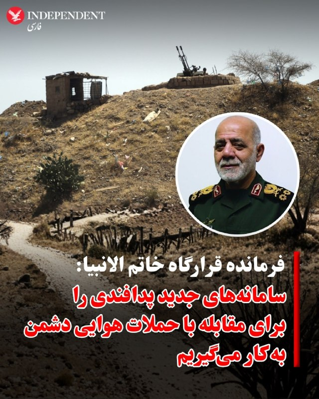

♦️رسانه‌های داخلی ایران روز دوشنبه چهارم خرداد به نقل از علی عبداللهی، فرمانده قرارگاه خاتم الانبیا گزارش کردند که نیروهای مسلح جمهوری اسلامی در دور بعدی جنگ «با استفاده از سامانه‌های جدید پدافندی، بیش از پیش با حملات هوایی دشمن مقابله» خواهد کرد.
این ادعا در حالی مطرح می‌شود که از زمان نخستین حمله اسرائیل به مواضع نظامی جمهوری اسلامی، بخشی از سامانه پدافندی ایران به‌شدت آسیب دید. این روند در جریان جنگ دوازده روزه تکمیل شد و آسمان ایران عملا در اختیار جنگنده‌های اسرائیلی و آمریکایی قرار گرفت. در جریان جنگ اخیر هم جمهوری اسلامی تنها توانست یک فروند جنگنده اف۱۸ آمریکا را هدف قرار دهد و سرنگون کند. با این حال براساس گزارش‌ها تعدادی از پهپادهای آمریکایی و اسرائیل در مناطق مختلف ایران رهگیری و منهدم شدند.
‌🇸🇦 Indypersian

🤖 @VahidOOnLine

## VahidOOnLine — post 242091

  

بر اساس اطلاعات رسیده به ایران‌اینترنشنال، امید عظیمی، ۲۶ ساله، روز ۱۹ دی‌ماه در جریان اعتراضات صادقیه تهران هدف گلوله قرار گرفت، خود را در یک پارک مخفی کرد اما به دلیل خونریزی شدید جان باخت.

به گفته یک منبع مطلع، امید عظیمی روز ۱۹ دی پس از خروج از باشگاه، برای شرکت در تجمع اعتراضی علیه گرانی و جمهوری اسلامی، مطابق فراخوان شاهزاده رضا پهلوی، به خیابان رفته بود. پس از قطع ناگهانی آنتن‌های تلفن همراه، ارتباط نزدیکانش با او قطع شد و خانواده و اطرافیانش تا صبح در بیمارستان‌ها به دنبال او گشتند.

امید پس از اصابت گلوله، خود را به یک پارک رساند و در آنجا پنهان شد. زمانی که نزدیکانش او را پیدا کردند، خون زیادی از دست داده بود. او را سپس به بیمارستان شهریار منتقل کردند اما به دلیل شدت جراحات و خونریزی شدید جان باخت.

دوستانش امید را فردی شجاع و نترس می‌دانند و می‌گویند که او همیشه دوست داشت مردم متحد باشند تا ایران آزاد شود. او عاشق ورزش و موتور‌سواری بود

امید در آخرین تماس تلفنی با مادرش گفته بود: شام می‌آیم و دور هم می‌خوریم.

‌🏁 🇬🇧 IranintlTV

🤖 @VahidOOnLine

## VahidOOnLine — post 242090

  

سماعیل بقائی، سخنگوی وزارت خارجه جمهوری اسلامی گفت: «کسی نمی‌تواند ادعا بکند به توافق نزدیک شده‌ایم، تغییرات مکرر مواضع مقامات آمریکایی هر گفت‌وگویی را دچار اشکال می‌کند.»

او افزود: «جمهوری اسلامی در حال حاضر بر روند مذاکرات متمرکز است و اینکه توافق احتمالی بعدا چگونه اعلام یا امضا شود، موضوعی است که برای تصمیم‌گیری درباره آن فرصت وجود دارد.»

بقائی اضافه کرد: «سفر هیئت‌ها به تهران یا سفر متقابل ممکن است در صورت لزوم انجام شود، اما در شرایط فعلی برنامه‌ای برای سفر به پاکستان یا سفر هیئت پاکستانی به ایران برنامه‌ریزی نشده است.»
‌🏁 🇬🇧 IranintlTV

🤖 @VahidOOnLine

## VahidOOnLine — post 242089

  <a href="telegram/content/VahidOOnLine_242089_1779700560.mp4" target="_blank">🎬 Download video</a>

ویدیویی که تازه به دست ایران‌اینترنشنال رسیده، خاکسپاری شبانه جاویدنام رئوف درخشانی‌مهر را نشان می‌دهد؛ سندی از اجبار خانواده‌ها به دفن مخفیانه و شبانه معترضان کشته‌شده.
رئوف، ۱۹ ساله و دانشجوی حقوق، شامگاه ۱۹ دی در دزفول با شلیک گلوله جنگی کشته شد و او را با تدابیر امنیتی در آرامستان شهیدآباد دزفول به خاک سپردند.
‌🏁 🇬🇧 IranintlTV

🤖 @VahidOOnLine

## VahidOOnLine — post 242088

  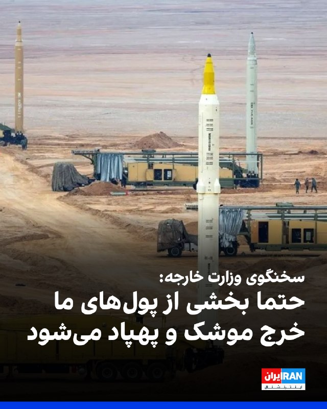

اسماعیل بقائی، سخنگوی وزارت خارجه جمهوری اسلامی در نشست خبری دوشنبه خود گفت: «حتما بخشی از پول‌های ما خرج موشک و پهپاد می‌شود که اگر چنین نمی‌کردیم، دشمنان ما می‌توانستند به مطامع‌شان برسند.»

او افزود: «آمریکا به تاسیسات زیربنایی ما که نماد توسعه بومی و درون‌زای کشور بود، حمله کردند.»

بقائی ادامه داد: «پل‌ها و نیروگاه‌ها که ظاهرا خار چشم طرف‌های آمریکایی هستند، بارها تهدید شده‌اند که مورد حمله قرار می‌گیرند و همه این‌ها با پول همین مردم ساخته شده است.»
‌🏁 🇬🇧 IranintlTV

🤖 @VahidOOnLine

## VahidOOnLine — post 242087

  

اسماعیل بقائی، سخنگوی وزارت خارجه جمهوری اسلامی در نشست خبری خود در خصوص سفر عباس عراقچی به نیویورک، گفت: «ما داریم برنامه‌ریزی می‌کنیم و گفته بودیم اگر اولویت دیگری پیش نیاید، سفر انجام می‌شود. اما با مشکل روادید مواجه شدیم و این سفر منتفی است.»
‌🏁 🇬🇧 IranintlTV

🤖 @VahidOOnLine

## VahidOOnLine — post 242086

⭕️ بقایی: به پیام‌های ترامپ پاسخ نمی‌دهیم چون کارهای مهم‌تری داریم

♦️اسماعیل بقایی، سخنگوی وزارت امور خارجه جمهوری اسلامی روز دوشنبه چهارم خرداد در نشست خبری هفتگی و در پاسخ به پرسش خبرنگاران درباره پیام‌های «تهدیدآمیز» ترامپ در شبکه‌های اجتماعی گفت: «به این پیام‌ها پاسخی نمی‌دهیم، چون کارهای مهم‌تری داریم... کاریکاتور منتشر کردن بخشی از سیاست‌ورزی در آن طرف دنیا است و ما کارمان را در میدان عمل دنبال می‌کنیم.»
دونالد ترامپ، رئیس جمهوری آمریکا از چند هفته پیش و همزمان با ادامه آتش‌بس، تصاویری که عمدتا با هوش مصنوعی ساخته شده‌اند را درباره چیرگی قدرت نظامی آمریکا و انهدام اهداف نظامی جمهوری اسلامی ایران و آمادگی برای از سرگیری جنگ و همچنین نقشه ایران با پرچم ایالات متحده آمریکا منتشر می‌کند.
‌🇸🇦 Indypersian

🤖 @VahidOOnLine

## VahidOOnLine — post 242085

  

اسماعیل بقائی، سخنگوی وزارت خارجه گفت که جمهوری اسلامی و عمان در حال تدوین سازوکاری برای تضمین تردد ایمن کشتی‌ها در تنگه هرمز هستند و تاکید کرد «ما در تنگه هرمز به دنبال اخذ عوارض نیستیم» و نباید هزینه‌های مربوط به خدمات ناوبری و حفاظت از محیط‌زیست را «عوارض» نامید.

او ادامه داد: «این‌که تنگه هرمز چگونه مدیریت شود به کشورهای ساحلی تنگه مربوط می‌شود.»

بقائی افزود: «اروپایی‌ها باید همواره به خاطر داشته باشند که تنگه هرمز پیش از ۹ اسفند باز بود و صرفا به دلیل تعرض آمریکا و اسرائیل علیه ما، دچار این وضعیت شده است.»
‌🏁 🇬🇧 IranintlTV

🤖 @VahidOOnLine

## VahidOOnLine — post 242084

  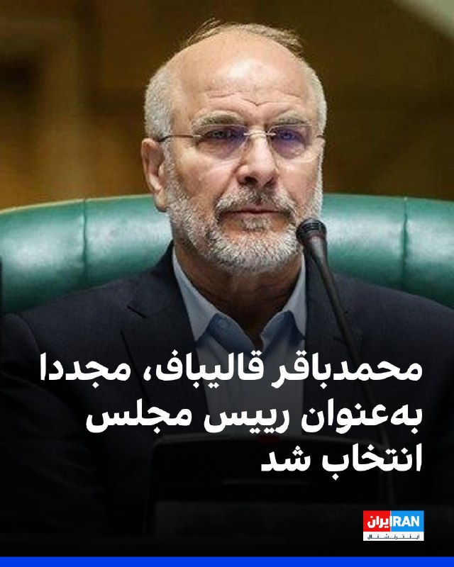

رسانه‌های ایران گزارش دادند محمدباقر قالیباف با ۲۳۵ رای از مجموع ۲۷۱ آرای ماخوذه، بار دیگر به‌عنوان رییس مجلس انتخاب شده است.

بر اساس این گزارش‌، علی نیکزاد با ۱۴۳ رای و حمیدرضا حاجی بابایی با ۱۰۰ رای، به‌عنوان نواب رییس مجلس شورای اسلامی انتخاب شده‌اند.

هنوز مشخص نیست این رای‌گیری به چه شکل و در چه مکانی برگزار شده است. جلسات صحن مجلس از آغاز جنگ میان جمهوری اسلامی، آمریکا و اسرائیل در ۹ اسفند ۱۴۰۴ برگزار نشده است.
‌🏁 🇬🇧 IranintlTV

🤖 @VahidOOnLine

## VahidOOnLine — post 242083

  

اسماعیل بقائی، سخنگوی وزارت خارجه جمهوری اسلامی در نشست خبری خود گفت: «ما کارهای خیلی مهم‌تری از پاسخ دادن به پست‌های ترامپ داریم. اگر بخواهیم به پست‌ها و تصاویر منتشرشده طرف دیگران پاسخ دهیم، به کارهای خودمان نمی‌رسیم. هر کجا لازم باشد جواب می‌دهیم.»

او افزود: «ما سبک خود را داریم و قرار نیست سبک و روش دشمن را کپی‌برداری کنیم. به عنوان یک ملت متمدن و صاحب سبک و مقتدر هر جا لازم بدانیم و به هر شیوه‌ای که لازم باشد این کار را صورت می‌دهیم، کما اینکه این کار را صورت دادیم. ما کارمان را در میدان عمل دنبال می‌کنیم.»
‌🏁 🇬🇧 IranintlTV

🤖 @VahidOOnLine

## VahidOOnLine — post 242082

  

حسین نوش‌آبادی، مدیرکل پارلمانی و قوانین وزارت خارجه، گفت که در صورت انجام تعهدات طرف آمریکایی و پیشرفت توافق مرحله اول، موضوع هسته‌ای و غنی‌سازی و ذخایر اورانیوم غنی‌شده با خلوص بالا در مقابل لغو تحریم‌ها و آزادسازی کامل دارایی‌های مسدود شده بررسی خواهد شد و نیروهای آمریکایی به طور کامل از منطقه پیرامونی ایران خارج خواهند شد.

او افزود: «تعهد جمهوری اسلامی به طرف آمریکایی در پیش‌نویس ارائه شده جهت توافق اولیه، در خصوص پرونده هسته‌ای و موضوع اورانیوم و تعلیق ۲۰ساله غنی‌سازی، کذب محض است.»
‌🏁 🇬🇧 IranintlTV

🤖 @VahidOOnLine

## VahidOOnLine — post 242081

  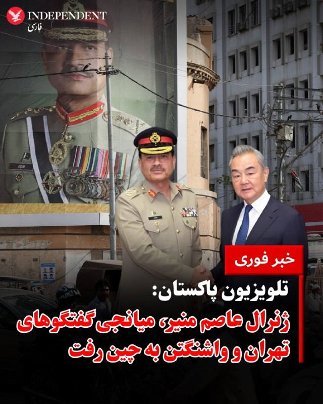

⭕️ تلویزیون پاکستان:
ژنرال عاصم منیر، میانجی گفتگوهای تهران و واشنگتن به چین رفت

♦️تلویزیون دولتی پاکستان، روز دوشنبه چهارم خرداد تصاویری را از حضور  فیلد مارشال عاصم منیر، فرمانده ارتش این کشورو مذاکره‌کننده کلیدی اسلام‌آباد میان ایالات متحده و جمهوری اسلامی ایران، به همراه شهباز شریف، نخست‌وزیر پاکستان در چین منتشر کرد.
عاصم منیر روزهای جمعه و شنبه به همراه محسن نقوی، وزیر کشور پاکستان، به عنوان بخشی از تلاش‌های میانجیگرانه برای پایان رسمی جنگ ایران، به تهران سفر کرده و با مقام‌های ارشد جمهوری اسلامی دیدار کرده بود.
‌🇸🇦 Indypersian

🤖 @VahidOOnLine

## VahidOOnLine — post 242080

  

⭕️ نخستین جلسه علنی مجلس شورای اسلامی پس از جنگ؛
قالیباف رئیس ماند

♦️مجلس شورای اسلامی، روز دوشنبه چهارم خردادماه نخستین جلسه علنی و «حضوری» خود را از زمان آغاز حملات اسرائیل و آمریکا در نهم اسفند سال گذشته برگزار کرد.
در این جلسه، محمدباقر قالیباف، رئیس هیئت مذاکره‌کننده جمهوری اسلامی با آمریکا، برای یک سال دیگر در سمت ریاست مجلس شورای اسلامی ابقا شد.
‌🇸🇦 Indypersian

🤖 @VahidOOnLine

## VahidOOnLine — post 242079

  

علی احسان ظفری، مدیرعامل اتحادیه تعاونی‌های لبنی، در مصاحبه با ایلنا، به افزایش ۲۰ درصدی قیمت لبنیات از ابتدای خردادماه اشاره کرد و گفت: «گران شدن لبنیات حتما بر سرانه مصرف مردم تاثیر دارد. البته این گرانی و کاهش سرانه مصرف از قبل هم بوده و همین‌طور این روند ادامه دارد.»

او افزود: «عامل این کار خود دولت بوده است، زیرا دولت شیر خام را در همین دو سه روزه، از کیلویی ۴۶ هزار تومان به ۶۱ هزار تومان رسانده است. وقتی دولت مواد اولیه را با این سرعت گران می‌کند نمی‌توانیم توقع داشته باشیم قیمت لبنیات ثابت بماند.»

ظفری نسبت به کاهش سرانه مصرف لبنیات و تعطیلی کارخانه‌های کوچک و متوسط هشدار داد و گفت سرانه مصرف لبنیات در کشور یک‌چهارم میانگین جهانی است.

او ادامه داد: «سرانه مصرف لبنیات به ازای هر فرد در سال گذشته ۵۵ تا ۶۰ کیلوگرم بود، ولی در حال حاضر به ۴۰ کیلوگرم رسیده است. در صورتی که سرانه مصرف لبنیات در کشورهای جهان سالی ۱۸۰ کیلوگرم و در کشورهای پیشرفته سالی ۳۶۰ کیلوگرم است.»
‌🏁 🇬🇧 IranintlTV

🤖 @VahidOOnLine

## VahidOOnLine — post 242078

  

♦️وزارت امور خارجه چین روز دوشنبه چهارم خردادماه با انتقاد دوباره از جنگ آمریکا و اسرائیل علیه جمهوری اسلامی، اعلام کرد این کشور آماد ایفای هرگونه نقش سازنده برای برقراری صلح در خاورمیانه است.

وزارت امور خارجه چین با ابراز نگرانی از احتمال شکست مذاکرات تاکید کرد «درهای گفتگوها هرگز نباید بسته شود. امنیت کشتیرانی و تامین زنجیره کالا باید تضمین شود.»
‌🇸🇦 Indypersian

🤖 @VahidOOnLine

## VahidOOnLine — post 242077

🗣روایت شما از احتمال توافق میان آمریکا و جمهوری اسلامی- دوشنبه ۴ خرداد

🔹هموطن، از شنیدن کلمه توافق ناراحت نشید. چرا که اگه توافقی بشه، جمهوری اسلامی دیگه موجودیت خودش رو از دست داده. همین الان هم جنگ داخلی بین خودشون راه افتاده.

🔹زنده‌ایم؛ نه از روی عادت بلکه از روی امید. خواهش می‌کنم دنیا سکوت نکند. از ترامپ خواهش می‌کنم با قاتلین ۴۰ هزار نفر مذاکره نکند. به امید آزادی.

🔹ترامپ و نتانیاهو کمک خودشون رو رسوندن و ما نباید توقع داشته باشیم که اونا سقوط رژیم رو نهایی کنن. نبرد اصلی و نهایی رو فقط ما مردم انجام می‌دیم.

🔹واقعا دیگه خسته شدیم و زندگی برای مردم سخت شده. اگه قرار بود جنگ رو نصفه ‌راه ول کند، ای‌کاش از اول جنگ راه نمی‌انداخت. مردم ما بیچاره شدن.

🔹مادرم از انواع دردها و بیماری‌ها داره جون می‌ده، اما به خاطر شرایط افتضاح اقتصادی نمی‌تونیم درمانش کنیم. خواهش می‌کنم ما رو از این وضعیت نجات بدید. واقعا دیگه خسته شدیم.

🔹ترامپ در طول جنگ فقط دو بار از مردم ایران حرف زد و اون هم برای تحت فشار گذاشتن جمهوری اسلامی برای امضای توافق بود. این آمریکایی‌ها غیر از منافع‌شون هیچ‌چیز دیگری براشون مهم نیست.

🔹زمان جنگ ترس بود، اما ته‌ش امید قشنگی وجود داشت که قراره خیلی چیزها تغییر کنه. الان ناامیدی و افسردگی به حدی در مردم بالاست که مثل مردگان متحرک زندگی می‌کنیم. اگه قرار هست مذاکره‌ای بشه، وضعیت مردم و تغییر حکومت با انتخاب مردم هم باید جزوش باشه.

🔹ترامپ من بهت امید داشتم؛ نه فقط من بلکه ۸۰ میلیون ایرانی. اینا آدم توافق نیستن. روز به روز قیمت‌ها بالا میره و سفره‌ها کوچک‌تر می‌شه. به دادمون برسید.

🔹ترامپ کاری کرد که تو خواب هم نمی‌دیدیم. حالا بدهکارمون شده؟ نجات ما وظیفه اونه؟ هموطن، به پا خیز.

🔹هموطن محترم، هیچ‌کس به فکر ما نیست. هیچ‌چیز رایگان به دست نمی‌آید؛ حتی نان و آب. پس آزادی کشور هم رایگان نیست. آمریکا به فکر منافع خودش و متحدانش هست. ما هم باید به فکر کشور و منافع خودمون باشیم.

🔹یعنی قرار نیست ما ایران رو بدون این حکومت ببینیم؟ توافق باعث نمی‌شه ما یادمون بره چه خون‌هایی از دست رفته.

🔹آقای ترامپ، تو به ما قول دادی و گفتی کمک در راه است. ما چهل‌هزار کشته دادیم و تو قول دادی که به ما کمک می‌کنی. آیا کمک تو یک توافق هسته‌ای جدید با جمهوری اسلامی بود؟
‌🏁 🇬🇧 IranintlTV

🤖 @VahidOOnLine

## VahidOOnLine — post 242076

  <a href="telegram/content/VahidOOnLine_242076_1779700568.mp4" target="_blank">🎬 Download video</a>

بر اساس ویدیوهای رسیده به ایران‌اینترنشنال گروهی از ایرانیان مقیم آلمان یکشنبه سوم خرداد در اعتراض به اعدام‌های جمهوری اسلامی و برای حمایت از شاهزاده رضا پهلوی در شهر براونشوایگ تجمع کردند.
‌🏁 🇬🇧 IranintlTV

🤖 @VahidOOnLine

## VahidOOnLine — post 242075

  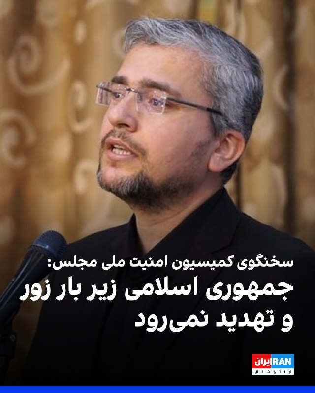

ابراهیم رضایی، سخنگوی کمیسیون امنیت ملی مجلس، در شبکه ایکس نوشت: «جمهوری اسلامی زیر بار زور و تهدید نمی‌رود. اگر توافق می‌خواهند مذاکره کنند، اگر بنزین شش دلاری می‌خواهند بایستند و بلوف بزنند تا علف زیر پایشان سبز شود.»

او ادامه داد: «در دوره جنگ نظامی تاکتیک ما چشم در مقابل چشم بود، در جنگ دیپلماتیک اقدام در مقابل اقدام است. بلوف رییس‌جمهوری شکست‌خورده را باور نکنید، زمان به ضرر آمریکایی‌هاست.»
‌🏁 🇬🇧 IranintlTV

🤖 @VahidOOnLine

## WithYashar — post 12405

فوری/ بازگشایی اینترنت بین الملل مصوب شد

ستاد راهبری و ساماندهی فضای مجازی صبح امروز دوشنبه (چهارم خردادماه) به ریاست دکتر عارف معاون اول رئیس جمهور تشکیل جلسه داد و بازگشت اینترنت به وضعیت قبل از دی ماه 1404 مصوب شد.

این مصوبه برای رییس جمهور ارسال شد و در صورت تایید رئیس جمهور جهت اجرا برای وزارت ارتباطات ارسال خواهد شد.
@withyashar

## WithYashar — post 12404

بقایی: برای تنگه هرمز عوارض نمی‌گیریم؛ هزینه‌های دریافتی صرفاً بابت خدمات ناوبری و حفاظت از محیط زیست است
@withyashar

## WithYashar — post 12403

ربیو:اگر مذاکرات شکست بخورد تقصیر ایالات متحده یا متحدان ما در منطقه خلیج فارس نیست. 100 درصد تقصیر ایران است
@withyashar

## WithYashar — post 12402

سخنگوی وزارت خارجه:

سفر آقای عراقچی به نیویورک به علت مشکل روادید منتفی است
@withyashar

## WithYashar — post 12401

  

بیانیهٔ مارکو روبیو، وزیر امور خارجه آمریکا
محکومیت درخواست بی‌پروا و خطرناک حزب‌الله برای سرنگونی دولت لبنان

ایالات متحده با شدیدترین لحن ممکن، درخواست بی‌ملاحظه حزب‌الله برای سرنگونی دولت منتخب و قانونی لبنان را محکوم می‌کند.
حزب‌الله بارها درخواست‌های دولت قانونی لبنان برای توقف حملات و احترام به آتش‌بس را نادیده گرفته است. در عوض، به شلیک به مواضع اسرائیل و انتقال نیروها و سلاح‌ها به جنوب لبنان ادامه داده است. این یک کارزار عمدی برای بی‌ثبات کردن کشور و حفظ قدرت خود، به بهای آینده مردم لبنان است.

دولت لبنان در حال تلاش برای بازسازی، احیای کشور، دریافت کمک‌های بین‌المللی و ایجاد آینده‌ای باثبات برای شهروندانش با حمایت کامل ایالات متحده است. اما حزب‌الله، برعکس، فعالانه می‌کوشد لبنان را دوباره به سوی هرج‌ومرج و ویرانی بکشاند.

ایالات متحده قاطعانه در کنار دولت قانونی لبنان ایستاده است؛ دولتی که برای بازگرداندن حاکمیت خود و ساختن آینده‌ای بهتر برای همه مردم لبنان تلاش می‌کند. تهدیدهای حزب‌الله برای خشونت و سرنگونی حکومت، اجازه موفقیت نخواهد یافت. دورانی که یک گروه تروریستی تمام یک کشور را گروگان گرفته بود، رو به پایان است.
@withyashar

## WithYashar — post 12400

سعید قاسمی نژاد مشاور شاهزاده : ‏شاید شما هم مثل من همیشه این سوال را از خودتان می‌پرسید که اگر در سال ۵۷ بودید آیا اسیر جو زمان می‌شدید و روبروی شاه می‌ایستادید یا کنار او می‌ایستادید و از ایران دفاع می‌کردید. اگر امروز روبروی شاهزاده رضا پهلوی ایستاده‌اید و‌ دشمن اویید قطعا آن روز هم روبروی شاه می‌ایستادید و‌ دشمن او می‌بودید، شک نکنید و به خودتان و دیگران دروغ نگویید.
@withyashar
یاشار : چقدر زیبا یاد آوری کردید ، اتفاقا اگه در اون زمان بودیم جلوی اطرافیان شاه میستادیم !
جلوی فردوست ، جلوی بختیار ، جلوی ارتشید قره باغی و حتی اردشیر زاهدی و خیلی از حلقه اطرافیان ایشان !
جاوید شاه پاینده ایران !

## WithYashar — post 12399

ترامپ در تروث : یکی از بدترین توافق‌هایی که کشور ما تا به حال انجام داده، «توافق هسته‌ای ایران» بود که توسط باراک حسین اوباما و افراد کاملاً غیرحرفه‌ای دولت اوباما طراحی و امضا شد. این توافق، یک مسیر مستقیم برای ایران جهت دستیابی به سلاح هسته‌ای ایجاد می‌کرد.…

## WithYashar — post 12398

انتخابات هیئت رئیسه مجلس که از ساعت ۷:۳۰ صبح امروز آغاز شد، دقایقی پیش پایان یافت
با آرا اکثریت نمایندگان قالیباف رئیس‌مجلس ماند
این انتخابات بصورت حضوری و با رای مستقیم نمایندگان برای انتخاب ۱۲ عضو هیئت رئیسه مجلس شامل یک رئیس، ۲ نایب رئیس، ۶ دبیر و ۳ ناظر بود.
@withyashar

## WithYashar — post 12397

😂😂😂

## WithYashar — post 12396

نعیم قاسم دبیرکل حزب الله:به خیابان ها بیاید و دولت لبنان را سرنگون کنید
@withyashar

## WithYashar — post 12395

## WithYashar — post 12394

## WithYashar — post 12393

## WithYashar — post 12392

Voice message

## WithYashar — post 12391

در مسیر قاهره در یک کاروانسرا استراحت می‌کنیم. نگران نباشید، کمی بعد حرکت می‌کنیم.😃

## WithYashar — post 12390

نیویورک پست : ترامپ نظر خود را تغییر داده و احتمال توافق اکنون به طور قابل توجهی کاهش یافته است؛ تماس ترامپ با نتانیاهو تأثیر بسیار زیادی داشته
@withyashar

## WithYashar — post 12389

۱۵۴۰ تا دایرکت نخونده دارم ، یه فرصت بدید شاید نتونم این سری لایک هم کنم والی همه رو یکم دیگه میخونم🥲🙌🏾

## WithYashar — post 12388

شبکه خبری سی‌بی‌اس به نقل از مقام‌های آمریکایی آگاه گزارش داد اطلاعات ایالات متحده نشان می‌دهد خامنه‌ای، رهبر جمهوری اسلامی، عملا در مکانی نامعلوم پنهان شده و دسترسی بسیار محدودی به دنیای خارج دارد. بر اساس این گزارش، مقام‌های حکومت ایران تنها از طریق شبکه‌ای…

## WithYashar — post 12387

اکونومیست: گزارش‌ها حاکی از آن است که عربستان سعودی از دونالد ترامپ درخواست کرده است هرگونه حمله جدید به ایران را تا پس از حج به تعویق بیندازد.
همچنان ترس وجود دارد که اگر درگیری دوباره آغاز شود، زائران در آنجا گیر خواهند افتاد.
@withyashar

## WithYashar — post 12386

فایننشال تایمز: عصبانیت رئیس‌جمهور چین از «افزایش توان نظامی ژاپن» در حضور همتای آمریکایی‌اش

پاسخ ترامپ: ژاپن به دلیل تهدیدات کره شمالی، به دفاع قوی‌تری نیاز دارد
@withyashar

## mwarmonitor — post 9667

  <a href="telegram/content/mwarmonitor_9667_1779700571.mp4" target="_blank">🎬 Download video</a>

📍مرکز خرید محبوب «Kvadrat» در منطقه لوکیانیوکا در کی‌یف پس از یک حمله سنگین موشکی و پهپادی روسیه در یکشنبه کاملاً در آتش سوخت.

🔸در منطقه شوچنکیفسکی، یک نفر کشته شد. تعداد کل مجروحان در کی‌یف به بیش از ۴۰ نفر افزایش یافته است.

@mwarmonitor

## mwarmonitor — post 9666

  

📊آسیا هفته را با خبرهایی آغاز کرد مبنی بر اینکه آمریکا و ایران به‌تدریج در حال نزدیک شدن به یک توافق هستند و بازارها نیز تصمیم گرفتند به جنبه مثبت ماجرا نگاه کنند: بلومبرگ

@mwarmonitor

## mwarmonitor — post 9665

🔴وزیر دارایی اسرائیل، بتسالل اسموتریچ:

🔸«برای هر پهپاد انفجاری حزب‌الله، باید ده ساختمان در بیروت با خاک یکسان شود.

🔹این هفته بودجه‌ای حدود دو میلیارد شکل برای راهکارهای فناورانه مقابله با تهدید پهپادها تصویب کردم. از جمله این بودجه به نهادهای غیرنظامی اجازه می‌دهد راهکارها و ایده‌های خلاقانه و خارج از چارچوب ارائه کنند.»

@mwarmonitor

## mwarmonitor — post 9664

  

🔴قطر به‌صورت مخفیانه LNG از طریق تنگه هرمزِ مسدودشده جابه‌جا می‌کند

🔹با وجود انسداد تقریباً کامل تنگه هرمز، قطر موفق شده است سه کشتی حامل LNG را به‌صورت مخفیانه از این آبراه حیاتی عبور دهد.

🔹به گزارش بلومبرگ، این تانکرها شامل Al Rayyan (در مسیر چین) و Fuwairit (در مسیر پاکستان) هستند که در روزهای اخیر فرستنده‌های موقعیت‌یاب خود را خاموش کرده و با موفقیت از تنگه عبور کرده‌اند.

🔸این اقدام به قطر اجازه می‌دهد حتی در شرایط ادامه درگیری نظامی در منطقه، همچنان به تأمین مشتریان اصلی آسیایی خود ادامه دهد.

@mwarmonitor

## mwarmonitor — post 9663

  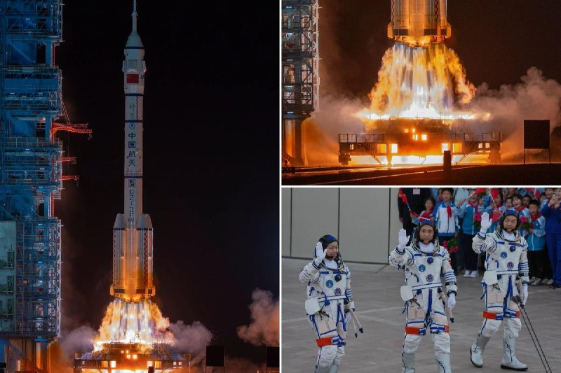

🚀چین فضاپیمای شِنژو ۲۳ را پرتاب کرد؛ یکی از سه فضانورد قرار است یک مأموریت یک‌ساله در فضا انجام دهد.

🔸در این مأموریت، فضاپیما با سه فضانورد به ایستگاه فضایی تیانگونگ در مدار زمین پرتاب شد و طبق برنامه، یکی از اعضای خدمه قرار است حدود یک سال در فضا بماند.

🔹این مأموریت بخشی از برنامه چین برای افزایش توان پروازهای طولانی‌مدت فضایی و آماده‌سازی برای فرود سرنشین‌دار بر ماه تا سال ۲۰۳۰ است. نیویورک پست

@mwarmonitor

## mwarmonitor — post 9662

🔸سخنگوی وزارت امور خارجه ایران گفت: ما از تنگه هرمز عوارض دریافت نخواهیم کرد.

🔹سخنگوی وزارت امور خارجه ایران گفت که طبیعی است خدماتی که ارائه می‌شود هزینه‌ای داشته باشد، اما نباید این هزینه‌ها به‌عنوان «عوارض» معرفی شوند.

@mwarmonitor

## mwarmonitor — post 9661

  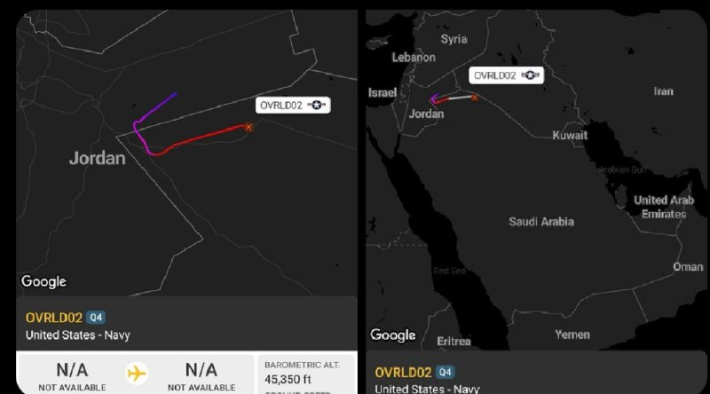

🔴یک پهپاد MQ-4C Triton نیروی دریایی ایالات متحده که دو روز پیش به پایگاه هوایی موفق‌السلطی در اردن منتقل شده بود، اکنون به پرواز درآمده و در حال حرکت به سمت خلیج فارس برای انجام یک مأموریت شناسایی در نزدیکی ایران است.

@mwarmonitor

## pm_afshaa — post 91439

🔴ربیو:اگر مذاکرات شکست بخورد تقصیر ایالات متحده یا متحدان ما در منطقه خلیج فارس نیست. 100 درصد تقصیر ایران است

💧 Rainbet.com the #1 Non-KYC Crypto Casino & Sportsbook @rainbetcom

😁 @Pm_Afshaa

## pm_afshaa — post 91438

درود هموطنان عزیزم یک دختر 26 سال داره بجرم کشتن یکنفر که وارد خونش شده که بهش تعرض و تجاوز بکنه صبح 5 خرداد اعدام میشه، باید ۱۰ میلیارد جمع بشه که رضایت بدن تا حالا ۹ میلیارد جمع شده  همه چی داخل تصویر هست کسی خواست استعلام بگیره میدونم ایرانی ها آدم با…

## pm_afshaa — post 91437

به قرآن قسم بگی چندجا روبیکا هم گفتم بزارن شما کامل بخون و استعلام هم بگیر که دروغ نیست میتونی کانال بزاری فردا اعدام میشه یک میلیارد مونده💔💔

## pm_afshaa — post 91436

درود هموطنان عزیزم یک دختر 26 سال داره بجرم کشتن یکنفر که وارد خونش شده که بهش تعرض و تجاوز بکنه صبح 5 خرداد اعدام میشه، باید ۱۰ میلیارد جمع بشه که رضایت بدن تا حالا ۹ میلیارد جمع شده  همه چی داخل تصویر هست کسی خواست استعلام بگیره میدونم ایرانی ها آدم با…

## pm_afshaa — post 91435

  

درود هموطنان عزیزم
یک دختر 26 سال داره بجرم کشتن یکنفر که وارد خونش شده که بهش تعرض و تجاوز بکنه
صبح 5 خرداد اعدام میشه، باید ۱۰ میلیارد جمع بشه که رضایت بدن تا حالا ۹ میلیارد جمع شده  همه چی داخل تصویر هست کسی خواست استعلام بگیره
میدونم ایرانی ها آدم با غیرتی هستند حتی شما با کمک ۱۰ هزار تومان کمک بزرگی کردید❤️

شماره کارت:۵۸۹۴۶۳۱۵۹۴۰۴۵۲۸۸
شبا: ۲۲۰۱۳۰۱۰۰۰۰۰۰۰۰۲۶۰۴۸۲۷۶۶

روی شماره کارت و شماره شبا بزنید کپی میشه

## pm_afshaa — post 91434

🔴قالیباف برای هفتمین بار رئیس مجلس رژیم شد

💧 Rainbet.com the #1 Non-KYC Crypto Casino & Sportsbook @rainbetcom

😁 @Pm_Afshaa

## pm_afshaa — post 91433

🔴کابینه سیاسی-امنیتی اسراییل فردا ساعت 18 تشکیل جلسه خواهد داد

💧 Rainbet.com the #1 Non-KYC Crypto Casino & Sportsbook @rainbetcom

😁 @Pm_Afshaa

## pm_afshaa — post 91432

وزارت امور خارجه چین امروز در واکنش به مذاکرات بین ایران و ایالات متحده برای رسیدن به توافقی جهت پایان جنگ اعلام کرد که این جنگ اصلاً نباید آغاز می‌شد و نیازی به ادامه آن نیست

💧 Rainbet.com the #1 Non-KYC Crypto Casino & Sportsbook @rainbetcom

😁 @Pm_Afshaa

## pm_afshaa — post 91431

مشاور وزیر ارتباطات از احتمال دسترسی و اتصال به اینترنت بین‌المللی در هفته آینده خبر داد

💧 Rainbet.com the #1 Non-KYC Crypto Casino & Sportsbook @rainbetcom

😁 @Pm_Afshaa

## pm_afshaa — post 91430

  

رژیم تروریستی جمهوری اسلامی برای بچه های اکباتان حکم اعدام صادر کرد

میلاد آرمون، نوید نجاران، مهدی ایمانی و سید محمدمهدی حسینی به اعدام محکوم شدن

💧 Rainbet.com the #1 Non-KYC Crypto Casino & Sportsbook @rainbetcom

😁 @Pm_Afshaa

## pm_afshaa — post 91429

نعیم قاسم دبیرکل حزب الله:به خیابان ها بیاید و دولت لبنان را سرنگون کنید

💧 Rainbet.com the #1 Non-KYC Crypto Casino & Sportsbook @rainbetcom

😁 @Pm_Afshaa

## pm_afshaa — post 91428

🔴نیویورک پست : ترامپ نظر خود را تغییر داده و احتمال توافق اکنون به طور قابل توجهی کاهش یافته است؛ تماس ترامپ با نتانیاهو تأثیر بسیار زیادی داشته

💧 Rainbet.com the #1 Non-KYC Crypto Casino & Sportsbook @rainbetcom

😁 @Pm_Afshaa

## pm_afshaa — post 91427

  

عباس اکبری فیض آبادی از معترضین دی ماه در اصفهان امروز با اذان صبح توسط جمهوری اسلامی اعدام شد

💧 Rainbet.com the #1 Non-KYC Crypto Casino & Sportsbook @rainbetcom

😁 @Pm_Afshaa

## DEJradio — post 4931

👑🎥 شماری از ایرانیان میهن‌دوست روز یکشنبه سوم خرداد ۱۴۰۵ در حمایت از انقلاب شیر و خورشید و شاهزاده رضا پهلوی در شهر تریر آلمان تظاهرات کردند.

#آلمان #انقلاب_شیروخورشید
@DEJradio

## DEJradio — post 4930

  <a href="telegram/content/DEJradio_4930_1779700576.webm" target="_blank">🎬 Download video</a>

🔺📢 مجله اکونومیست می‌نویسد، گزارش‌‌ها حاکی از آن است که عربستان سعودی از دونالد ترامپ درخواست کرده است هرگونه حمله جدید به ایران را تا پس از حج به تعویق بیندازد زیرا این نگرانی وجود دارد که اگر درگیری دوباره آغاز شود، زائران در آنجا گیر خواهند افتاد.

این مراسم ۹ خرداد تمام می‌شود.

#حج #عربستان_سعودی
@DEJradio

## DEJradio — post 4929

  <a href="telegram/content/DEJradio_4929_1779700576.webm" target="_blank">🎬 Download video</a>

🤡
🔺 حبیب‌الله سیاری معاون هماهنگ‌کننده ارتش جمهوری اسلامی در واکنش به ادعاها درباره توافق آمریکا و جمهوری اسلامی با اعلام بی‌خبری از موضوع به کنایه می‌گوید، اصلا نمی‌دونم توافق سر چی هست!

کانال تلگرامی سـ.ـپاه نیوز می‌نویسد: «در حالی‌که رسانه‌های بیگانه با جزئیات دقیق یا تحریف‌شده، در حال مهندسی اخبار تفاهم احتمالی و تزریق ابهام و اضطراب به جامعه هستند، مراجع رسمی داخلی حتی از انتشار یک خط روایت اول و شفاف دریغ می‌کنند.»
محمد منان نماینده مجلس شورای اسلامی گفته «حسب اخبار واصله طبق توافق احتمالی،ایران تنگه هرمز را باز خواهد کرد بدون آنکه به اخذ عوارض توسط ایران اشاره ای شده باشد!»

#توافق #مذاکرات
@DEJradio

## mamlekate — post 103579

📝 مقام ارشد آمریکا: ایران پشت‌پرده برای واگذاری اورانیوم غنی‌شده، تعهد داده است

یک مقام ارشد دولت ترامپ اعلام کرد رژیم ایران «پشت‌پرده» تعهداتی در زمینه واگذاری اورانیوم غنی‌شده داده و جمهوری اسلامی بدون اجرای این تعهدات، دستاورد چندانی از مذاکرات نخواهد داشت.

📝 مقام وزارت خارجه جمهوری اسلامی: درباره اورانیوم با غلطت بالا بعد از تفاهم اولیه مذاکره می‌کنیم

یک دیپلمات ارشد جمهوری اسلامی اعلام کرد که در صورت دستیابی به توافق میان تهران و واشنگتن، «موضوع هسته‌ای و غنی‌سازی و ذخایر اورانیوم غنی‌شده با خلوص بالا» در فرصت نهایتا ۶۰ روزه این توافق بررسی خواهد شد.

@mamlekate

## VahidOnline — post 75695

  

وزیر خارجه ایالات متحده، روز دوشنبه چهارم خرداد گفت که واشینگتن در مذاکرات جاری خود با ایران، «هر فرصتی برای موفقیت» به دیپلماسی خواهد داد.

مارکو روبیو که اکنون در هند به‌سر می‌برد در جمع خبرنگاران گفت که مذاکرات با ایران همچنان «در حال پیشرفت» است و خوش‌بینی محتاطانه‌ای نسبت به توافق احتمالی برای بازگشایی مسیرهای کلیدی کشتیرانی و از سرگیری مذاکرات هسته‌ای ابراز کرد.

او که روز گذشته از احتمال توافق با ایران تا پایان روز یک‌شنبه خبر داده بود، گفت: «همه ما باید مطمئن باشیم که یا به یک توافق خوب خواهیم رسید، یا مجبور می‌شویم به شکل دیگری با این مسئله برخورد کنیم. ترجیح ما این است که یک توافق خوب داشته باشیم.»

دونالد ترامپ، رئیس‌جمهور آمریکا نیز شامگاه یک‌شنبه در دومین پیام خود درباره روند مذاکرات با ایران اطمینان داد که توافق احتمالی با ایران «خوب و درست» خواهد بود اما هیچ کس درباره محتوای آن اطلاع ندارد.
@VahidHeadline

📡 @VahidOnline

## VahidOnline — post 75694

  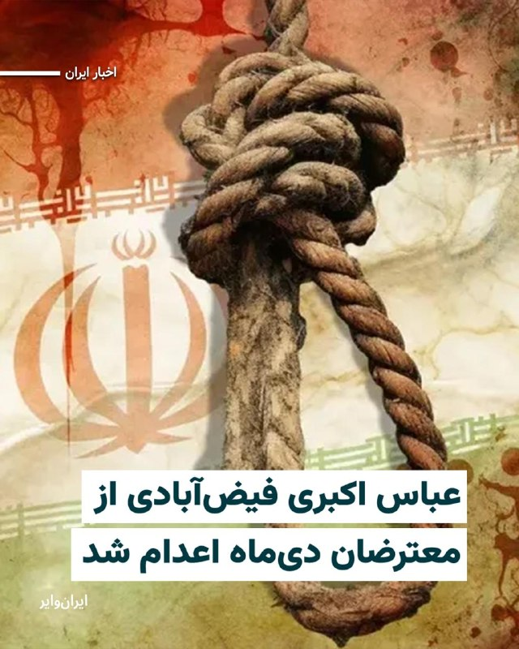

خبرگزاری «میزان» رسانه قوه قضاییه جمهوری اسلامی اعلام کرد حکم اعدام «عباس اکبری فیض‌آبادی»، از متهمان پرونده اعتراضات دی‌۱۴۰۴ در شهرستان «نایین» اصفهان، صبح روز دوشنبه ۴خرداد۱۴۰۵ اجرا شده است.

«میزان» مدعی شده که عباس اکبری از «لیدرهای مسلح» اعتراضات در نایین بوده و در جریان حمله به فرمانداری این شهر و برخی مراکز حکومتی، به سوی ماموران امنیتی تیراندازی کرده است.
@VahidHeadline

📡 @VahidOnline

## IranIntlTV — post 338889

  

حسین کرمانپور، رییس مرکز روابط عمومی وزارت بهداشت، در خصوص جراحت مجتبی خامنه‌ای پس از بمباران روز اول جنگ، گفت: «او برای مداوا تا ساعت دو بامداد دهم اسفند مهمان ما بود، استنباط ما این بود که کسی که زیر چنین بمبارانی باشد نباید بدن سالمی داشته باشد، اما به جز جراحت سطحی بر صورت، سر و پاها اتفاق خاصی نیفتاده بود.»

او ادامه داد: «در این رخداد وزیر در بیمارستان حضور پیدا کرد. بچه‌های ما هم زنده هستند؛ کسی که بخیه زده است و کسی که بی‌حسی موضعی داده است، همه زنده هستند، اگر روزی قرار شد آن‌ها روایت‌شان را بگویند حتما ارائه خواهند داد.»

این در حالی است که پس از روز نهم اسفند، تاکنون هیچ تصویر یا صوتی از رهبر جدید جمهوری اسلامی منتشر نشده است.
https://iranintl.com/202605259051

## IranIntlTV — post 338888

  

سخنگوی مجتمع گاز پارس جنوبی عسلویه اعلام کرد صبح دوشنبه هنگام آواربرداری از تاسیسات آسیب‌دیده جنگ در پالایشگاه ششم گاز عسلویه، انفجاری رخ داد که در پی آن سه نفر از کارکنان شرکت پیمانکاری بازسازی پالایشگاه مصدوم و به بیمارستان منتقل شدند.
https://iranintl.com/202605254404

## IranIntlTV — post 338887

  <a href="telegram/content/IranIntlTV_338887_1779700579.mp4" target="_blank">🎬 Download video</a>

یک شهروند با ارسال پیامی به ایران‌اینترنشنال درباره اخبار مربوط به مذاکرات آمریکا و جمهوری اسلامی می‌گوید: «ناامیدی و افسردگی به حدی در مردم بالاست که شبیه مرده‌های متحرک زندگی می‌کنیم. اگر قرار است مذاکره‌ای شود، وضعیت مردم و تغییرِ حکومت با انتخاب مردم هم باید جزوش باشد.»

## IranIntlTV — post 338886

  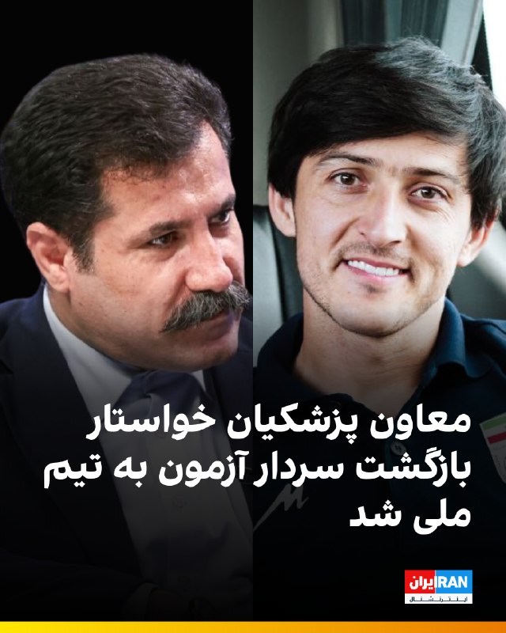

🔻عبدالکریم حسین‌زاده، معاون مسعود پزشکیان، رییس دولت جمهوری اسلامی در پیامی در شبکه اجتماعی ایکس با اشاره به یادداشت سردار آزمون، او را «سرمایه ملی» خواند و خواستار بازگشت سردار به تیم ملی فوتبال شد: «هرکس نام ایران را بالاتر از گلایه‌های شخصی می‌نشاند، بخشی از سرمایه ملی ماست.»

🔹سردار آزمون چهار روز پیش در یادداشتی در صفحه اینستاگرام خود نوشت: «تا امروز از هيچ تلاشی برای حمايت از هموطنانم دريغ نكردم. هر جايی كه فوتبال بازی كنم، هويت من، قلب من و افتخار من ايران است.»

🔹او همچنین نوشت: «من هميشه با افتخار برای تيم ملی كشورم بازی كردم. وقتی می‌برديم، به خودم و هم‌تيمی‌هام افتخار می كردم و وقتی نمی‌برديم مثل همه آنها ناراحت‌ترين آدم دنيا بودم. من عاشق فوتبال هستم و عاشق مردم خوب و شايسته كشورم ايران.»

🔹درحالی که امیر قلعه‌نویی، سرمربی تیم ملی هنوز فهرست نهایی تیم ملی را اعلام نکرده است، روزنامه فرهیختگان خواستار عذرخواهی سردار آزمون برای بازگشت به تیم ملی شده است.

🔹این روزنامه امروز در یادداشتی نوشت: «اگر قرار به بازگشت او باشد، همه منتظر شنیدن یک عذرخواهی واقعی و صادقانه هستند.»

@iranintltvsport

## IranIntlTV — post 338885

  

بر اساس اطلاعات رسیده به ایران‌اینترنشنال، امید عظیمی، ۲۶ ساله، روز ۱۹ دی‌ماه در جریان اعتراضات صادقیه تهران هدف گلوله قرار گرفت، خود را در یک پارک مخفی کرد اما به دلیل خونریزی شدید جان باخت.

به گفته یک منبع مطلع، امید عظیمی روز ۱۹ دی پس از خروج از باشگاه، برای شرکت در تجمع اعتراضی علیه گرانی و جمهوری اسلامی، مطابق فراخوان شاهزاده رضا پهلوی، به خیابان رفته بود. پس از قطع ناگهانی آنتن‌های تلفن همراه، ارتباط نزدیکانش با او قطع شد و خانواده و اطرافیانش تا صبح در بیمارستان‌ها به دنبال او گشتند.

امید پس از اصابت گلوله، خود را به یک پارک رساند و در آنجا پنهان شد. زمانی که نزدیکانش او را پیدا کردند، خون زیادی از دست داده بود. او را سپس به بیمارستان شهریار منتقل کردند اما به دلیل شدت جراحات و خونریزی شدید جان باخت.

دوستانش امید را فردی شجاع و نترس می‌دانند و می‌گویند که او همیشه دوست داشت مردم متحد باشند تا ایران آزاد شود. او عاشق ورزش و موتور‌سواری بود

امید در آخرین تماس تلفنی با مادرش گفته بود: شام می‌آیم و دور هم می‌خوریم.

https://iranintl.com/202605258688

## IranIntlTV — post 338884

  

اسماعیل بقائی، سخنگوی وزارت خارجه جمهوری اسلامی گفت: «کسی نمی‌تواند ادعا بکند به توافق نزدیک شده‌ایم، تغییرات مکرر مواضع مقامات آمریکایی هر گفت‌وگویی را دچار اشکال می‌کند.»

او افزود: «جمهوری اسلامی در حال حاضر بر روند مذاکرات متمرکز است و اینکه توافق احتمالی بعدا چگونه اعلام یا امضا شود، موضوعی است که برای تصمیم‌گیری درباره آن فرصت وجود دارد.»

بقائی اضافه کرد: «سفر هیئت‌ها به تهران یا سفر متقابل ممکن است در صورت لزوم انجام شود، اما در شرایط فعلی برنامه‌ای برای سفر به پاکستان یا سفر هیئت پاکستانی به ایران برنامه‌ریزی نشده است.»
https://www.iranintl.com/202605257022

## IranIntlTV — post 338883

  <a href="telegram/content/IranIntlTV_338883_1779700582.mp4" target="_blank">🎬 Download video</a>

ویدیویی که تازه به دست ایران‌اینترنشنال رسیده، خاکسپاری شبانه جاویدنام رئوف درخشانی‌مهر را نشان می‌دهد؛ سندی از اجبار خانواده‌ها به دفن مخفیانه و شبانه معترضان کشته‌شده.
رئوف، ۱۹ ساله و دانشجوی حقوق، شامگاه ۱۹ دی در دزفول با شلیک گلوله جنگی کشته شد و او را با تدابیر امنیتی در آرامستان شهیدآباد دزفول به خاک سپردند.

## IranIntlTV — post 338882

  

اسماعیل بقائی، سخنگوی وزارت خارجه جمهوری اسلامی در نشست خبری دوشنبه خود گفت: «حتما بخشی از پول‌های ما خرج موشک و پهپاد می‌شود که اگر چنین نمی‌کردیم، دشمنان ما می‌توانستند به مطامع‌شان برسند.»

او افزود: «آمریکا به تاسیسات زیربنایی ما که نماد توسعه بومی و درون‌زای کشور بود، حمله کرد.»

بقائی ادامه داد: «پل‌ها و نیروگاه‌ها که ظاهرا خار چشم طرف‌های آمریکایی هستند، بارها تهدید شده‌اند که مورد حمله قرار می‌گیرند و همه این‌ها با پول همین مردم ساخته شده است.»
https://iranintl.com/202605252121

## IranIntlTV — post 338881

  

اسماعیل بقائی، سخنگوی وزارت خارجه جمهوری اسلامی در نشست خبری خود در خصوص سفر عباس عراقچی به نیویورک، گفت: «ما داریم برنامه‌ریزی می‌کنیم و گفته بودیم اگر اولویت دیگری پیش نیاید، سفر انجام می‌شود. اما با مشکل روادید مواجه شدیم و این سفر منتفی است.»
https://iranintl.com/202605256350

## IranIntlTV — post 338880

  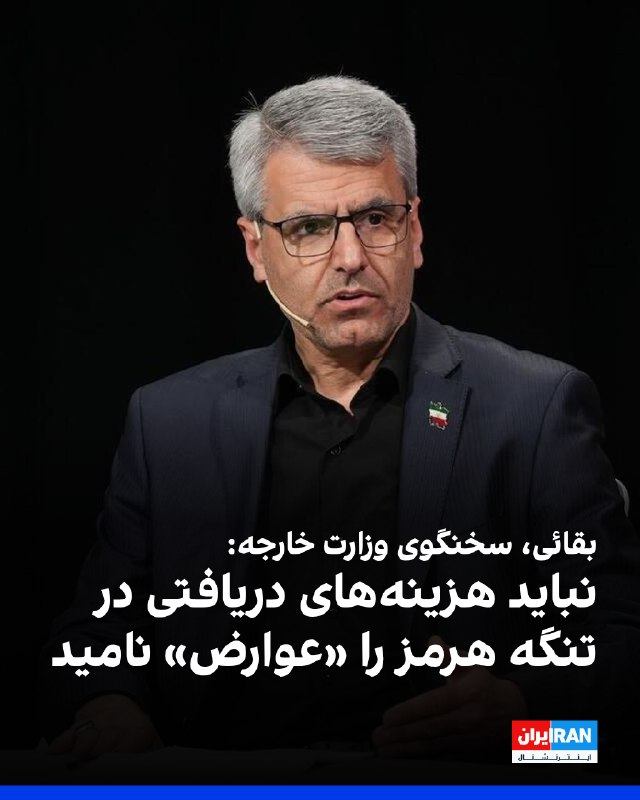

اسماعیل بقائی، سخنگوی وزارت خارجه گفت که جمهوری اسلامی و عمان در حال تدوین سازوکاری برای تضمین تردد ایمن کشتی‌ها در تنگه هرمز هستند و تاکید کرد «ما در تنگه هرمز به دنبال اخذ عوارض نیستیم» و نباید هزینه‌های مربوط به خدمات ناوبری و حفاظت از محیط‌زیست را «عوارض» نامید.

او ادامه داد: «این‌که تنگه هرمز چگونه مدیریت شود به کشورهای ساحلی تنگه مربوط می‌شود.»

بقائی افزود: «اروپایی‌ها باید همواره به خاطر داشته باشند که تنگه هرمز پیش از ۹ اسفند باز بود و صرفا به دلیل تعرض آمریکا و اسرائیل علیه ما، دچار این وضعیت شده است.»
https://iranintl.com/202605252733

## IranIntlTV — post 338879

  

رسانه‌های ایران گزارش دادند محمدباقر قالیباف با ۲۳۵ رای از مجموع ۲۷۱ آرای ماخوذه، بار دیگر به‌عنوان رییس مجلس انتخاب شده است.

بر اساس این گزارش‌، علی نیکزاد با ۱۴۳ رای و حمیدرضا حاجی بابایی با ۱۰۰ رای، به‌عنوان نواب رییس مجلس شورای اسلامی انتخاب شده‌اند.

هنوز مشخص نیست این رای‌گیری به چه شکل و در چه مکانی برگزار شده است. جلسات صحن مجلس از آغاز جنگ میان جمهوری اسلامی، آمریکا و اسرائیل در ۹ اسفند ۱۴۰۴ برگزار نشده است.
https://iranintl.com/202605258172

## IranIntlTV — post 338878

  <a href="telegram/content/IranIntlTV_338878_1779700586.mp4" target="_blank">🎬 Download video</a>

یک دانش‌آموز با ارسال پیامی به ایران‌اینترنشنال می‌گوید در امتحانات آمادگی دفاعی مدرسه، اعتراضات دی‌ماه را جنگ حساب کرده‌اند.

## IranIntlTV — post 338877

  

اسماعیل بقائی، سخنگوی وزارت خارجه جمهوری اسلامی در نشست خبری خود گفت: «ما کارهای خیلی مهم‌تری از پاسخ دادن به پست‌های ترامپ داریم. اگر بخواهیم به پست‌ها و تصاویر منتشرشده طرف دیگران پاسخ دهیم، به کارهای خودمان نمی‌رسیم. هر کجا لازم باشد جواب می‌دهیم.»

او افزود: «ما سبک خود را داریم و قرار نیست سبک و روش دشمن را کپی‌برداری کنیم. به عنوان یک ملت متمدن و صاحب سبک و مقتدر هر جا لازم بدانیم و به هر شیوه‌ای که لازم باشد این کار را صورت می‌دهیم، کما اینکه این کار را صورت دادیم. ما کارمان را در میدان عمل دنبال می‌کنیم.»
https://iranintl.com/202605258641

## IranIntlTV — post 338876

  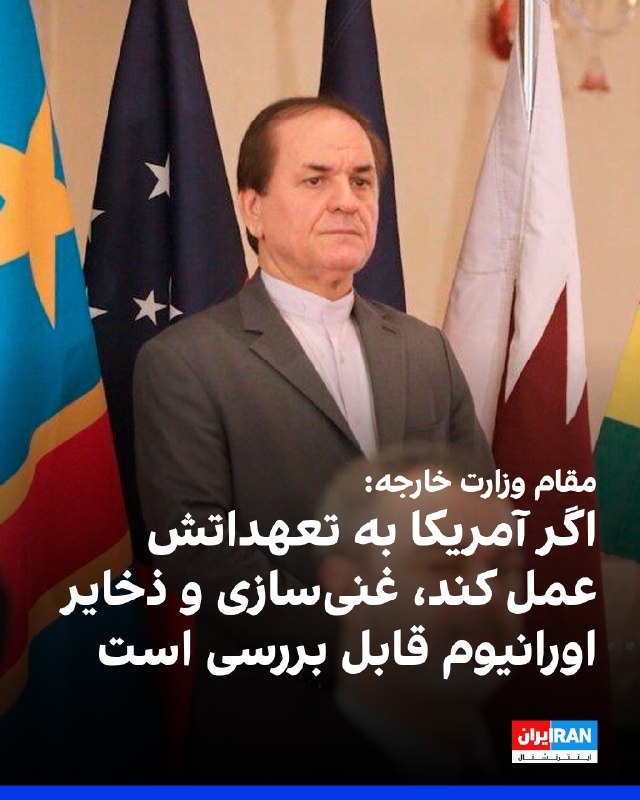

حسین نوش‌آبادی، مدیرکل پارلمانی و قوانین وزارت خارجه، گفت که در صورت انجام تعهدات طرف آمریکایی و پیشرفت توافق مرحله اول، موضوع هسته‌ای و غنی‌سازی و ذخایر اورانیوم غنی‌شده با خلوص بالا در مقابل لغو تحریم‌ها و آزادسازی کامل دارایی‌های مسدود شده بررسی خواهد شد و نیروهای آمریکایی به طور کامل از منطقه پیرامونی ایران خارج خواهند شد.

او افزود: «تعهد جمهوری اسلامی به طرف آمریکایی در پیش‌نویس ارائه شده جهت توافق اولیه، در خصوص پرونده هسته‌ای و موضوع اورانیوم و تعلیق ۲۰ساله غنی‌سازی، کذب محض است.»
https://iranintl.com/202605252499

## IranIntlTV — post 338875

  <a href="telegram/content/IranIntlTV_338875_1779700589.mp4" target="_blank">🎬 Download video</a>

شهباز شریف، نخست‌وزیر پاکستان، اعلام کرد کشورش به تلاش‌های خود برای برقراری صلح در منطقه ادامه می‌دهد و امیدوار است دور بعدی «گفت‌وگوهای صلح» میان ایالات متحده و جمهوری اسلامی به‌زودی در پاکستان برگزار شود.

گزارش جواد همدانی، خبرنگار ایران‌اینترنشنال
@iranintltv

## IranIntlTV — post 338874

  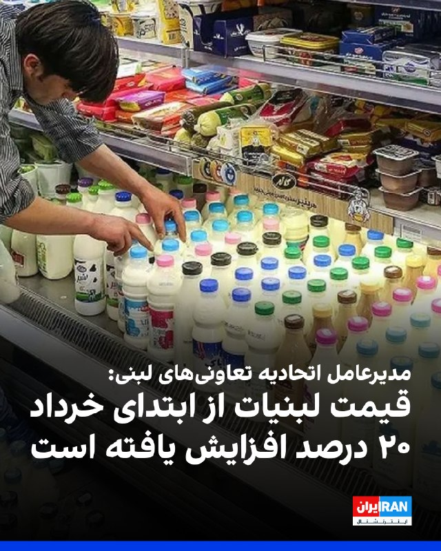

علی احسان ظفری، مدیرعامل اتحادیه تعاونی‌های لبنی، در مصاحبه با ایلنا، به افزایش ۲۰ درصدی قیمت لبنیات از ابتدای خردادماه اشاره کرد و گفت: «گران شدن لبنیات حتما بر سرانه مصرف مردم تاثیر دارد. البته این گرانی و کاهش سرانه مصرف از قبل هم بوده و همین‌طور این روند ادامه دارد.»

او افزود: «عامل این کار خود دولت بوده است، زیرا دولت شیر خام را در همین دو سه روزه، از کیلویی ۴۶ هزار تومان به ۶۱ هزار تومان رسانده است. وقتی دولت مواد اولیه را با این سرعت گران می‌کند نمی‌توانیم توقع داشته باشیم قیمت لبنیات ثابت بماند.»

ظفری نسبت به کاهش سرانه مصرف لبنیات و تعطیلی کارخانه‌های کوچک و متوسط هشدار داد و گفت سرانه مصرف لبنیات در کشور یک‌چهارم میانگین جهانی است.

او ادامه داد: «سرانه مصرف لبنیات به ازای هر فرد در سال گذشته ۵۵ تا ۶۰ کیلوگرم بود، ولی در حال حاضر به ۴۰ کیلوگرم رسیده است. در صورتی که سرانه مصرف لبنیات در کشورهای جهان سالی ۱۸۰ کیلوگرم و در کشورهای پیشرفته سالی ۳۶۰ کیلوگرم است.»
https://iranintl.com/202605258095

## IranIntlTV — post 338873

  <a href="telegram/content/IranIntlTV_338873_1779700591.mp4" target="_blank">🎬 Download video</a>

یک شهروند با ارسال ویدیویی به ایران‌اینترنشنال یک شرکت محصولات پتروشیمی را در حوالی ساوه نشان می‌دهد و از تعطیلی آن پس از جنگ و بیکاری کارگرانش می‌گوید.

## IranIntlTV — post 338872

🗣روایت شما از احتمال توافق میان آمریکا و جمهوری اسلامی- دوشنبه ۴ خرداد

🔹هموطن، از شنیدن کلمه توافق ناراحت نشید. چرا که اگه توافقی بشه، جمهوری اسلامی دیگه موجودیت خودش رو از دست داده. همین الان هم جنگ داخلی بین خودشون راه افتاده.

🔹زنده‌ایم؛ نه از روی عادت بلکه از روی امید. خواهش می‌کنم دنیا سکوت نکند. از ترامپ خواهش می‌کنم با قاتلین ۴۰ هزار نفر مذاکره نکند. به امید آزادی.

🔹ترامپ و نتانیاهو کمک خودشون رو رسوندن و ما نباید توقع داشته باشیم که اونا سقوط رژیم رو نهایی کنن. نبرد اصلی و نهایی رو فقط ما مردم انجام می‌دیم.

🔹واقعا دیگه خسته شدیم و زندگی برای مردم سخت شده. اگه قرار بود جنگ رو نصفه ‌راه ول کند، ای‌کاش از اول جنگ راه نمی‌انداخت. مردم ما بیچاره شدن.

🔹مادرم از انواع دردها و بیماری‌ها داره جون می‌ده، اما به خاطر شرایط افتضاح اقتصادی نمی‌تونیم درمانش کنیم. خواهش می‌کنم ما رو از این وضعیت نجات بدید. واقعا دیگه خسته شدیم.

🔹ترامپ در طول جنگ فقط دو بار از مردم ایران حرف زد و اون هم برای تحت فشار گذاشتن جمهوری اسلامی برای امضای توافق بود. این آمریکایی‌ها غیر از منافع‌شون هیچ‌چیز دیگری براشون مهم نیست.

🔹زمان جنگ ترس بود، اما ته‌ش امید قشنگی وجود داشت که قراره خیلی چیزها تغییر کنه. الان ناامیدی و افسردگی به حدی در مردم بالاست که مثل مردگان متحرک زندگی می‌کنیم. اگه قرار هست مذاکره‌ای بشه، وضعیت مردم و تغییر حکومت با انتخاب مردم هم باید جزوش باشه.

🔹ترامپ من بهت امید داشتم؛ نه فقط من بلکه ۸۰ میلیون ایرانی. اینا آدم توافق نیستن. روز به روز قیمت‌ها بالا میره و سفره‌ها کوچک‌تر می‌شه. به دادمون برسید.

🔹ترامپ کاری کرد که تو خواب هم نمی‌دیدیم. حالا بدهکارمون شده؟ نجات ما وظیفه اونه؟ هموطن، به پا خیز.

🔹هموطن محترم، هیچ‌کس به فکر ما نیست. هیچ‌چیز رایگان به دست نمی‌آید؛ حتی نان و آب. پس آزادی کشور هم رایگان نیست. آمریکا به فکر منافع خودش و متحدانش هست. ما هم باید به فکر کشور و منافع خودمون باشیم.

🔹یعنی قرار نیست ما ایران رو بدون این حکومت ببینیم؟ توافق باعث نمی‌شه ما یادمون بره چه خون‌هایی از دست رفته.

🔹آقای ترامپ، تو به ما قول دادی و گفتی کمک در راه است. ما چهل‌هزار کشته دادیم و تو قول دادی که به ما کمک می‌کنی. آیا کمک تو یک توافق هسته‌ای جدید با جمهوری اسلامی بود؟

## IranIntlTV — post 338871

  <a href="telegram/content/IranIntlTV_338871_1779700592.mp4" target="_blank">🎬 Download video</a>

بر اساس ویدیوهای رسیده به ایران‌اینترنشنال گروهی از ایرانیان مقیم آلمان یکشنبه سوم خرداد در اعتراض به اعدام‌های جمهوری اسلامی و برای حمایت از شاهزاده رضا پهلوی در شهر براونشوایگ تجمع کردند.

## IranIntlTV — post 338870

  

ابراهیم رضایی، سخنگوی کمیسیون امنیت ملی مجلس، در شبکه ایکس نوشت: «جمهوری اسلامی زیر بار زور و تهدید نمی‌رود. اگر توافق می‌خواهند مذاکره کنند، اگر بنزین شش دلاری می‌خواهند بایستند و بلوف بزنند تا علف زیر پایشان سبز شود.»

او ادامه داد: «در دوره جنگ نظامی تاکتیک ما چشم در مقابل چشم بود، در جنگ دیپلماتیک اقدام در مقابل اقدام است. بلوف رییس‌جمهوری شکست‌خورده را باور نکنید، زمان به ضرر آمریکایی‌هاست.»
https://iranintl.com/202605253979

## ManotoTV — post 105826

  <a href="telegram/content/ManotoTV_105826_1779700595.mp4" target="_blank">🎬 Download video</a>

تماسی از اتریش:
«می‌گفت سختی‌ها خیلی‌ها را عوض کرد…
و از کیوان عباسی به‌خاطر حفظ همان نگاه و مسیر همیشگی‌اش قدردانی کرد.»

## FarsiVOA — post 218600

  

سخنگوی وزارت امور خارجه جمهوری اسلامی گفت امنیت تنگه هرمز «دغدغه کل دنیاست»، اما مدیریت و تدوین سازوکار تردد ایمن در این آبراه بر عهده ایران و عمان است.

اسماعیل بقایی گفت تهران و مسقط در حال تدوین پروتکلی برای اطمینان از عبور ایمن کشتی‌ها هستند و این اقدام را «مسئولانه» و مطابق حقوق بین‌الملل دانست. او با رد تعبیر «عوارض» گفت ایران در پی دریافت عوارض نیست، اما خدماتی مانند ناوبری و حفاظت از محیط زیست تنگه هرمز، خلیج فارس و دریای عمان می‌تواند مستلزم دریافت هزینه باشد.

این موضع در حالی مطرح می‌شود که واشنگتن بارها با هرگونه دریافت «عوارض» یا کنترل یک‌جانبه بر تنگه هرمز مخالفت کرده است. کاخ سفید اعلام کرده بود دونالد ترامپ و شی جین‌پینگ، رئیس جمهوری چین، بر بازگشایی تنگه هرمز و مخالفت با دریافت عوارض از سوی هر کشور یا سازمانی توافق کرده‌اند.

رویترز نیز گزارش داده مارکو روبیو، وزیر خارجه آمریکا، گفته طرحی «نسبتاً محکم» درباره بازگشایی تنگه هرمز روی میز است، اما اگر مذاکرات با ایران شکست بخورد، واشنگتن «راه دیگری» را دنبال خواهد کرد.
@FarsiVOA

## FarsiVOA — post 218599

  

رسانه‌های داخلی از برگزاری جلسه حضوری مجلس شورای اسلامی پس از ۹۷ روز تعطیلی خبر داده و اعلام کردند که محمدباقر قالیباف، برای هفتمین سال به عنوان رئيس مجلس شورای اسلامی انتخاب شد.

آخرین جلسه حضوری مجلس در ۲۸ بهمن ۱۴۰۴، تقریباً دو هفته پیش از درگیری نظامی، برگزار شده بود و جلسه روز چهارم خرداد، به صورت حضوری و با هدف برگزاری انتخابات هیات رئیسه تشکیل شده است.

قالیباف برای نشستن دوباره بر صندلی ریاست مجلس، رقیب جدی نداشت و باید با محمدتقی نقدعلی، نماینده خمینی‌شهر و عثمان سالاری، نماینده تربت‌جام رقابت می‌کرد.

با اوج‌گیری تنش‌های نظامی در منطقه، قالیباف همزمان به عنوان رئيس هیئت‌ مذاکره کننده جمهوری اسلامی با آمریکا و همچنین نماینده ویژه جمهوری اسلامی در امور چین نیز فعالیت می‌کند.
@FarsiVOA

## FarsiVOA — post 218598

  

ارتش اسرائیل به ساکنان ۱۰ منطقه شامل شهر و روستا در جنوب لبنان هشدار داد که پیش از حملات هوایی علیه مواضع گروه حزب‌الله لبنان، این مناطق را تخلیه کنند.

ارتش اسرائیل صبح دوشنبه با انتشار بیانیه‌ای اسامی این مناطق را اعلام کرد و گفت که به ساکنان دستور داده شده است دست‌کم یک کیلومتر از محل سکونت خود فاصله بگیرند.

سرهنگ آویخای ادرعی، سخنگوی ارتش، هشدار داده است: «در پی نقض توافق آتش‌بس توسط سازمان تروریستی حزب‌الله، ارتش ناچار است با قدرت علیه آن اقدام کند و قصد آسیب رساندن به شما را ندارد.»

او افزود: «هر کسی که در نزدیکی عناصر حزب‌الله و تأسیسات و ابزارهای نظامی آن‌ها باشد، جان خود را در معرض خطر قرار می‌دهد.»

مارکو روبیو، وزیر خارجه آمریکا روز دوشنبه در جریان سفر به هند گفت: «اسرائیل همیشه حق دارد از خود دفاع کند. هر کشوری در جهان چنین حقی دارد. بنابراین اگر حزب‌الله قرار است به سوی آن‌ها موشک شلیک کند یا موشک شلیک می‌کند، اسرائیل کاملاً حق دارد به آن پاسخ دهد یا از وقوع آن جلوگیری کند.»
@FarsiVOA

## FarsiVOA — post 218597

  

تلویزیون پاکستان گزارش داد که عاصم منیر، فرمانده ارتش پاکستان و میانجی اصلی مذاکرات جمهوری اسلامی و آمریکا، در جریان سفر رسمی شهباز شریف به چین، در پکن کنار نخست‌وزیر پاکستان حاضر شده و در گفت‌وگو با مقام‌های چینی شرکت کرده است.

شهباز شریف سفر رسمی چهارروزه خود به چین را روز شنبه از هانگژو آغاز کرده بود، اما تصاویر پخش‌شده از تلویزیون دولتی پاکستان نشان می‌دهد که عاصم منیر نیز در پکن در کنار او با رهبران چین دیدار کرده است.

بر اساس این گزارش، شریف در حضور عاصم منیر به مقام‌های چینی گفت پاکستان برای میانجی‌گری میان جمهوری اسلامی و آمریکا «نقشی صادقانه» ایفا کرده و از حمایت چین برای پیشبرد صلح قدردانی کرد.

عاصم منیر روزهای جمعه و شنبه در تهران بود و این سفر بخشی از تلاش‌های میانجی‌گرانه پاکستان برای پایان رسمی جنگ ایران عنوان شده است. حضور او در پکن، بلافاصله پس از رایزنی‌های تهران، نشان می‌دهد اسلام‌آباد تلاش دارد میانجی‌گری خود میان تهران و واشنگتن را با هماهنگی نزدیک‌تر با چین پیش ببرد.
@FarsiVOA

## FarsiVOA — post 218596

  

ارتش اسرائیل اعلام کرد هشدار مربوط به احتمال نفوذ پهپاد در منطقه عرب العرامشه در شمال اسرائیل پایان یافته و دیگر تهدید فوری شناسایی نمی‌شود.

به گزارش تایمز اسرائیل، آژیرها دقایقی پیش در این منطقه به صدا درآمده بود. ارتش اسرائیل می‌گوید یک «هدف هوایی مشکوک» شناسایی شد، اما بعداً تماس سامانه‌های رصد با آن از دست رفت؛ موضوعی که می‌تواند به خروج پهپاد از منطقه تحت پایش یا سقوط آن مربوط باشد.

براساس اعلام ارتش اسرائیل، این رویداد بدون گزارش زخمی پایان یافته است.
@FarsiVOA

## FarsiVOA — post 218595

🔺اکسیوس: ترامپ خواستار پیوستن کشورهای عرب به توافق ابراهیم پس از پایان جنگ شد

◾️اکسیوس گزارش داد دونالد ترامپ از رهبران چند کشور عربی خواسته است اگر توافقی برای پایان جنگ با جمهوری اسلامی حاصل شود، به روند توافق ابراهیم بپیوندند و روابط خود را با اسرائیل عادی کنند.

◾️بر اساس این گزارش، تماس ترامپ با رهبران عربستان، امارات، قطر، پاکستان، ترکیه، مصر، اردن و بحرین انجام شد و محور اصلی آن توافق در حال شکل‌گیری با جمهوری اسلامی بود.

◾️یک مقام آمریکایی به اکسیوس گفته است که رهبران حاضر در تماس روز شنبه اعلام کرده‌اند در صورت موفقیت یا شکست توافق، در کنار واشنگتن خواهند بود.

⬇️ بیشتر بخوانید:
https://ir.voanews.com/a/8153577.html

## FarsiVOA — post 218594

  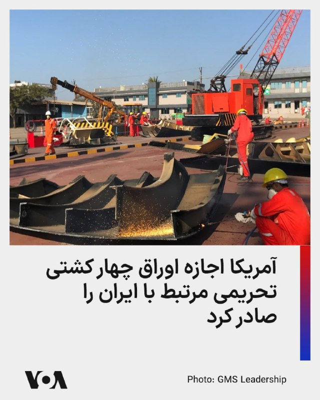

بلومبرگ گزارش داد یک خریدار کشتی‌های فرسوده گفته وزارت خزانه‌داری آمریکا اجازه داده چهار شناور تحریمی مرتبط با حمل محموله‌های ایران برای اوراق خریداری شوند.

بر اساس گزارش‌ها، شرکت جی‌ام‌اس مستقر در دبی، مجوز خرید چهار کشتی یوگی، تیمون، رانتانپلن و بیگلی را دریافت کرده است؛ شناورهایی که به شبکه کشتیرانی مرتبط با محمدحسین شمخانی نسبت داده شده‌اند. این شبکه از سوی آمریکا به انتقال نفت و کالاهای مرتبط با ایران متهم شده است.

این تصمیم در حالی گرفته شده که وزارت خزانه‌داری آمریکا اخیراً در چارچوب فشار حداکثری تازه، ۱۹ کشتی و بیش از ۵۰ فرد و شرکت مرتبط با تجارت نفت و پتروشیمی ایران را تحریم کرده بود.

مالکان ناشناس این کشتی‌ها می‌توانند از ارزش آهن‌قراضه آنها میلیون‌ها دلار دریافت کنند و واشنگتن می‌گوید خروج کنترل‌شده کشتی‌های فرسوده از «ناوگان سایه» می‌تواند ریسک‌های ایمنی و زیست‌محیطی را کاهش دهد.
@FarsiVOA

## FarsiVOA — post 218593

  

قیمت طلا روز دوشنبه همزمان با افت دلار و کاهش شدید بهای نفت افزایش یافت؛ نشانه‌ای از بازاری که هنوز میان امید به توافق آمریکا و جمهوری اسلامی و تردید درباره پایداری آن در نوسان است.

رویترز گزارش داد بهای هر اونس طلا بیش از یک درصد بالا رفت و به حدود ۴ هزار و ۵۵۹ دلار رسید. تضعیف دلار، خرید طلا را برای دارندگان ارزهای دیگر ارزان‌تر کرد و افت نفت نیز بخشی از نگرانی‌های تورمی را کاهش داد.

همزمان، نفت برنت حدود ۶ درصد سقوط کرد و به محدوده ۹۸ دلار رسید؛ نفت خام آمریکا نیز به حدود ۹۱ دلار کاهش یافت. علت اصلی افت نفت، امید بازار به پیشرفت در توافقی است که می‌تواند مسیر تنگه هرمز و صادرات انرژی خلیج فارس را تا حدی باز کند.

با این حال، رشد طلا نشان می‌دهد سرمایه‌گذاران هنوز پایان بحران را قطعی نمی‌دانند.
@FarsiVOA

## FarsiVOA — post 218592

🔺مقام ارشد آمریکا: ایران پشت‌پرده برای واگذاری اورانیوم غنی‌شده، تعهد داده است

◾️یک مقام ارشد دولت ترامپ اعلام کرد رژیم ایران «پشت‌پرده» تعهداتی در زمینه واگذاری اورانیوم غنی‌شده داده و جمهوری اسلامی بدون اجرای این تعهدات، دستاورد چندانی از مذاکرات نخواهد داشت.

◾️به گزارش نیویورک‌پست، این مقام آمریکایی که با خبرنگاران صحبت می‌کرد، درباره روند مذاکرات برای دستیابی به یک توافق احتمالی با تهران گفت: «۹۵ درصد کار انجام شده، اما در سیستم آن‌ها حتی تغییر واژه‌ها هم مستلزم چند روز بررسی و مشورت است.»

◾️این منبع ارشد دست‌کم دو بار برای خبرنگاران توضیح داد که توافق قریب‌الوقوع نیست و قرار نیست انتقال پول نقد شبیه انتقال پول نقد به ایران در سال ۲۰۱۶ در دوران باراک اوباما رخ دهد.

⬇️ بیشتر بخوانید:
https://ir.voanews.com/a/8153576.html

## FarsiVOA — post 218591

  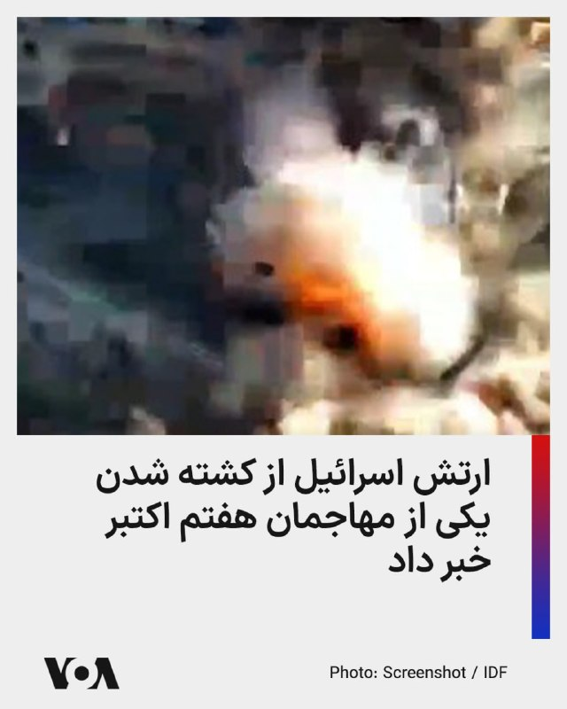

ارتش اسرائیل اعلام کرد نیروهای این کشور در جریان عملیاتی در جنوب، لؤی هشام محمود بصل، عضو سازمان تروریستی حماس را که در حمله به پایگاه زیکیم در جریان کشتار هفتم اکتبر نقش داشت، از پا درآوردند.

بر اساس اعلام ارتش اسرائیل، بصل به‌عنوان تک‌تیرانداز در گردان زیتون حماس فعالیت می‌کرد و در روزهای اخیر نیز برای اجرای حملات تروریستی علیه نیروهای اسرائیلی در منطقه برنامه‌ریزی می‌کرد.

ارتش اسرائیل گفته است این عملیات برای رفع یک تهدید فوری انجام شده و نیروهای این کشور در چارچوب توافق موجود در منطقه مستقر هستند و به مقابله با هرگونه تهدید فوری ادامه خواهند داد.
@FarsiVOA

## FarsiVOA — post 218590

  

بر اساس آمار شرکت مدیریت منابع آب ایران، ‌هم‌اکنون میزان پرشدگی پنج صد مهم کشور از جمله «سدهای لار، دوستی، پانزدهم خرداد، بارزو و ساوه» کمتر از ۱۰ درصد است.

خبرگزاری ایسنا با تحلیل این آمار، اعلام کرد که علیرغم افزایش موجودی مخازن سدهای غربی، استان‌های تهران، مرکزی، خراسان رضوی، قم، اصفهان، زنجان و همدان در وضعیت نامطلوبی قرار دارند.

بر این اساس تامین آب شرب در شهرهای تهران، کرج، مشهد، اراک، قم، اصفهان، یزد، زنجان و همدان، با محدودیت مواجه است.

پیشتر علیرضا شریعت، دبیرکل فدراسیون صنعت آب ایران، هشدار داده بود که در صورت عدم کاهش مصرف، با بحران مهاجرت اجباری ۱۵ میلیون نفر در فلات مرکزی ایران مواجه خواهیم شد.

فلات مرکزی ایران شامل هفت استان کرمان، فارس، اصفهان، یزد، مرکزی، قم و سمنان می‌شود.
@FarsiVOA

## FarsiVOA — post 218589

🔺عبور محدود تانکرهای نفت و گاز از هرمز؛ قطر محموله‌های گاز را راهی پاکستان و چین کرد

◾️دو کشتی حامل گاز طبیعی مایع، ال‌ان‌جی، روز دوشنبه از تنگه هرمز خارج شده و به سوی پاکستان و چین در حرکت‌اند.

◾️همزمان، یک ابرنفتکش حامل نفت خام عراق نیز پس از نزدیک به سه ماه توقف در خلیج فارس، از هرمز عبور کرده و راهی چین شده است.

⬇️ بیشتر بخوانید:
https://ir.voanews.com/a/8153574.html

## FarsiVOA — post 218588

🔺روبیو: هیچ‌کس به اندازه ترامپ در مورد تهدید هسته‌ای ایران جدی نبوده است

◾️مارکو روبیو، وزیر خارجه آمریکا، اعلام کرد که واشنگتن با تهران به یک توافق خوب خواهد رسید یا به «شیوه‌ای دیگر» با جمهوری اسلامی برخورد خواهد کرد.

◾️روبیو تصریح کرد که هیچ کس به اندازه دونالد ترامپ، رئیس‌جمهوری آمریکا نسبت به تهدید هسته‌ای حکومت ایران جدی نبوده است.

◾️او همچنین پیش از ترک هند به خبرنگاران گفت که آمریکا پیش از بررسی «گزینه‌های جایگزین»، به دیپلماسی تمام فرصت برای موفقیت را خواهد داد.

⬇️ بیشتر بخوانید:
https://ir.voanews.com/a/8153575.html

## DW_Farsi — post 125121

🔶 گزارش سیپری؛ ماموریت‌های صلح در تنگنای بودجه و نیروی انسانی

سال ۲۰۲۵ سال خوبی برای ماموریت‌های بین‌المللی صلح نبوده است. طبق گزارش جدید مؤسسه پژوهش‌های صلح استکهلم "سیپری" (SIPRI)، شمار این مأموریت‌ها اندکی کاهش یافته است. در حدود ۲۵ سال گذشته، هرگز شمار نیروهای بین‌المللی فعال در عرصه صلح تا این اندازه کم نبوده است.

تا پایان ماه دسامبر گذشته، مجموعاً نزدیک به ۷۹ هزار نفر در این مأموریت‌ها حضور داشتند؛ رقمی که شامل نیروهای نظامی، نیروهای پلیس و کارکنان غیرنظامی می‌شود. بر اساس این گزارش، تنها طی ده سال گذشته شمار آنها تقریباً به نصف کاهش یافته است.

کلودیا فایفر کروز، پژوهشگر مؤسسه سیپری، به کانال اول تلویزیون آلمان (ARD) گفته است که دلایل مختلفی برای این وضعیت وجود دارد.

به گزارش کانال اول تلویزیون آلمان، در شورای امنیت سازمان ملل، قدرت‌های دارای حق وتو بیش از پیش مانع یکدیگر می‌شوند و در سازمان‌های منطقه‌ای مانند اتحادیه آفریقا نیز مشکلات مشابهی وجود دارد.

افزون بر این، سازمان‌های بین‌المللی مانند سازمان ملل متحد نیز با کمبود بودجه روبه‌رو هستند؛ به‌گونه‌ای‌که در سال ۲۰۲۵ بیش از دو میلیارد دلار کسری بودجه داشته‌اند.

طبق همین گزارش، دیگر کشورهای بزرگ تأمین‌کننده بودجه این مأموریت‌ها، از جمله چین، نیز یا سهم خود را پرداخت نکرده‌اند یا با تأخیر پرداخت کرده‌اند. در نتیجه، تمامی ماموریت‌های سازمان ملل به‌ناچار فعالیت‌های خود را محدود و شمار کارکنانشان را کاهش داده‌اند.

📌 برای دسترسی کامل به گزارش به وبسایت دویچه‌وله فارسی مراجعه کنید.
@dw_farsi

## DW_Farsi — post 125120

  

🔶 محمدباقر قالیباف برای هفتمین بار رئیس مجلس شورای اسلامی شد

محمدباقر قالیباف در انتخابات هیئت رئیسه مجلس شورای اسلامی که صبح روز دوشنبه ۴ خرداد (۲۵ مه) برگزار شد، برای هفتمین سال متوالی به عنوان رئیس مجلس انتخاب شد.

قالیباف ۶۴ ساله، به عنوان سیاستمداری با نفوذ در ساختار سپاه پاسداران انقلاب اسلامی شناخته می‌شود. به ویژه پس از کشته شدن علی خامنه‌ای، علی لاریجانی و شمار دیگری از مقامات ارشد جمهوری اسلامی و تغییر ساختار قدرت، نام او به عنوان یکی از تصمیم‌گیران اصلی در پیشبرد سیاست‌های نظام و مذاکره با آمریکا مطرح شده است.

محمدباقر قالیباف بارها برای انتخابات ریاست جمهوری نامزد شد. او در سال ۱۳۸۴ نامزد شد اما از محمود احمدی‌نژاد شکست خورد. پس از آن به عنوان شهردار تهران منصوب شد و از سال ۱۳۸۴ تا ۱۳۹۶ این سمت را در اختیار داشت.

او در سال ۱۳۹۲ بار دیگر نامزد انتخابات ریاست جمهوری شد اما از حسن روحانی شکست خورد و در سال ۹۶ نیز پیش از برگزاری انتخابات به نفع ابراهیم رئیسی کناره‌گیری کرد.

نام قالیباف با فسادهای مالی خود و خانواده‌اش و نقش او در سرکوب جنبش‌های سیاسی و مدنی در ایران نیز گره خورده است.
@dw_farsi

## DW_Farsi — post 125119

  

🔶 لیندزی گراهام از ترامپ خواست در توافق با ایران به تعهداتش "پایبند" باشد

لیندزی گراهام، سناتور جمهوری‌خواه از ایالت کارولینای جنوبی، روز یکشنبه ۲۴ مه (۳ خرداد) از دونالد ترامپ، رئیس‌جمهور آمریکا، خواست تا در حالی که واشنگتن به تلاش برای نهایی کردن توافق با تهران بر سر جنگ ادامه می‌دهد، ثابت قدم بماند.

گراهام در پستی در شبکه اجتماعی ایکس نوشت: «اگر در واقع، در نتیجه این مذاکرات برای پایان دادن به درگیری با ایران، متحدان عرب و مسلمان ما در منطقه با پیوستن به پیمان ابراهیم موافقت کنند، این توافق‌نامه به یکی از مهم‌ترین توافق‌نامه‌ها در تاریخ خاورمیانه تبدیل خواهد شد.»

گراهام همچنین به اظهارات قبلی ترامپ در مورد پیوستن عربستان سعودی، قطر و پاکستان به پیمان ابراهیم اشاره کرد و پیشنهاد او را "فراتر از یک تغییر اساسی برای منطقه و جهان" خواند. او گفت: «این یک اقدام درخشان از سوی رئیس‌ جمهور ترامپ است.»

گراهام خطاب به ترامپ نیز نوشت: «رئیس جمهور ترامپ، برای رسیدن به یک توافق خوب با ایران، به مواضع خود پایبند باشید.»
@dw_farsi

## DW_Farsi — post 125118

  

📸عکس روز: فانوس‌های آرزو در جشن تولد بودا

همزمان با جشن تولد بودا، فانوس‌های رنگارنگ در معبد "جوگیه" در شهر سئول روشن شده‌اند. در این آیین سنتی، به هرکدام از فانوس‌ها کارتی همراه با آرزوهای پیروان بودا آویزان شده که نمادی از امید، آرامش و دعا برای آینده است.
جشن تولد بودا یکی از مهم‌ترین مناسبت‌های مذهبی در کره‌جنوبی به شمار می‌رود و هر سال هزاران نفر را به معابد تاریخی این کشور می‌کشاند.
@dw_farsi

## DW_Farsi — post 125117

  

🔶 تهدید ایران به شکستن محاصره دریایی تنگه هرمز و خروج از ان‌پی‌تی

محسن رضایی، مشاور نظامی مجتبی خامنه‌ای، روز یکشنبه سوم خرداد (۲۴ مه) گفت که مدیریت تنگه هرمز "حق قانونی" تهران برای تضمین امنیت ملی است. او مدعی شد: «مدیریت ایران بر تنگه هرمز به ۵۰ سال ناامنی در خلیج فارس پایان می‌دهد.»

رضایی، که تحت تحریم‌های ایالات متحده قرار دارد، همچنین گفت که ایران "دلایل محکمی" برای حفظ کنترل تنگه دارد و ادعا کرد که هدف تهران جلوگیری از تبدیل شدن خلیج فارس به مرکزی برای استقرار نظامی و بی‌ثباتی است.

اظهارات محسن رضایی روز یکشنبه توسط خبرگزاری مهر، نزدیک به سپاه پاسداران، منتشر شد.

در همین حال، ابراهیم ذوالفقاری، سخنگوی قرارگاه خاتم الانبیاء، هشدار داد که اگر تنگه هرمز مورد حمله قرار گیرد، نیروهای نظامی جمهوری اسلامی محاصره بنادر ایران توسط ایالات متحده را خواهند شکست.

ذوالفقاری همچنین تهدید به "خروج ایران از پیمان منع گسترش سلاح‌های هسته‌ای" کرد. او گفت: «اگر دشمن به تنگه هرمز حمله کند، ما محاصره دریایی را خواهیم شکست و ممکن است از پیمان منع گسترش سلاح‌های هسته‌ای (ان‌پی‌تی) خارج شویم.»
@dw_farsi

## DW_Farsi — post 125116

  

🔶 نعیم قاسم: خلع سلاح به معنای نابودی است و ما نمی‌توانیم آن را بپذیریم

نعیم قاسم، دبیرکل حزب‌الله، در یک سخنرانی به مناسبت "روز مقاومت و آزادسازی" که یادآور عقب‌نشینی نیروهای ارتش اسرائیل از اشغال جنوب لبنان در ۲۵ مه ۲۰۰۰ است، درخواست خلع سلاح این گروه را محکوم کرد.

او گفت: «چیزی به نام انحصار سلاح یا خلع سلاح حزب‌الله وجود ندارد.»

قاسم همچنین افزود، خلع سلاح حزب‌الله "توان دفاعی لبنان و توان مقاومت و مردم آن را به عنوان مقدمه‌ای برای نابودی" از بین می‌برد. او افزود: «خلع سلاح به معنای نابودی است و این چیزی است که ما نمی‌توانیم بپذیریم.»

نعیم قاسم همچنین ضمن برشمردن چندین حمله به سربازان ارتش اسرائیل، از پهپادهای انتحاری دید اول شخص (FPV) حزب‌الله که به گفته او باعث "گیج‌شدن" اسرائیل شده‌اند، تمجید کرد. او ادعا کرد که این حملات منجر به کشته شدن چندین افسر اسرائیلی شده است، در حالی که ارتش اسرائیل اعلام کرده است که آنها زخمی شده‌اند.

دبیرکل حزب‌الله همچنین ایالات متحده را محکوم کرد و گفت که این کشور نه میانجی است و نه بازیگری صادق، زیرا "اسرائیل را بر اساس منافع خود مدیریت می‌کند".
@dw_farsi

## DW_Farsi — post 125115

  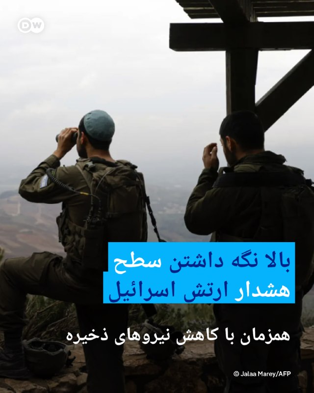

🔶 بالا نگه داشتن سطح هشدار ارتش اسرائیل همزمان با کاهش نیروهای ذخیره

در بحبوحه انتشار اخبار لحظه به لحظه در مورد "پیشرفت" مذاکرات بین ایالات متحده و ایران، افسران ارشد ارتش اسرائیل روز یکشنبه ۲۴ ماه (۳ خرداد) تأیید کردند که چندین شاخه از ارتش، تعداد سربازان ذخیره را در ستاد کل کاهش داده‌اند.

به گزارش "جروزالم پست" برخی از افسران پیامی دریافت کردند مبنی بر اینکه باید "نسبت به هرگونه درخواست برای بازگشت به خدمت هوشیار و گوش به زنگ باشند"، اما مجبور نیستند به ستاد بیایند.

شلومی بیندر، رئیس اداره اطلاعات ارتش اسرائیل، هدایت عملیات جمع‌آوری اطلاعات برای ایجاد تصویری روشن از تلاش‌های ایران برای بازسازی قابلیت‌های نظامی آسیب‌دیده‌اش را بر عهده دارد.

طبق این گزارش، افسران ارشد ارتش اسرائیل ادعا می‌کنند که بنا بر ارزیابی آنها، رده سیاسی اسرائیل از هسته مذاکرات ایالات متحده و ایران کنار گذاشته شده است.

در شرایط کنونی و با وجود سیگنال‌های متناقض طرفین، مشخص نیست که آیا واقعاً پیشرفتی در مذاکرات حاصل شده است یا اینکه هرکدام از طرفین صرفا در تلاش برای افزایش فشار بر طرف مقابل است.
@dw_farsi

## DW_Farsi — post 125114

  

🔶 کاهش قیمت نفت به دنبال چشم‌اندازی برای توافق آمریکا با ایران

امیدها برای دستیابی به یک توافق صلح بین ایالات متحده و ایران، قیمت نفت را به پایین‌ترین سطح خود در بیش از دو هفته گذشته رسانده است.

نفت خام برنت دریای شمال با ۴.۵۵ درصد کاهش به ۹۸.۸۳ دلار در هر بشکه رسید، در حالی که نفت خام وست تگزاس اینترمدیت (WTI) با ۴.۷۳ درصد کاهش به ۹۲.۰۳ دلار رسید. این نرخ پایین‌ترین سطح از ۷ مه (۱۷ اردیبهشت) تا کنون است. با این حال، چشم‌انداز توافق سریع پس از سیگنال‌های متناقض از سوی واشنگتن همچنان نامشخص است.

کارشناسان پیش‌بینی می‌کنند که بحران انرژی ناشی از جنگ ایران ادامه خواهد یافت.

یکی از موضوعات مورد اختلاف، همچنان حاکمیت بر تنگه هرمز است؛ آبراهی کلیدی که از طریق آن پیش از جنگ یک پنجم نفت و گاز مایع جهان منتقل می‌شد. رئیس شرکت ملی نفت ابوظبی هفته گذشته هشدار داد که حتی در صورت پایان فوری جنگ، ترافیک کشتیرانی در این تنگه حداقل تا سال ۲۰۲۷ به سطح عادی خود باز نخواهد گشت.
@dw_farsi

## DW_Farsi — post 125113

  

🔶 سی‌بی‌اس: مجتبی خامنه‌ای از طریق شبکه‌ای از پیام‌رسان‌ها ارتباط برقرار می‌کند

مقامات آمریکایی به نقل از نهادهای اطلاعاتی آمریکا به شبکه تلویزیونی "سی‌بی‌اس" گفتند که مجتبی خامنه‌ای، رهبر جمهوری اسلامی، در مکانی مخفی پنهان شده و از طریق شبکه‌ای پیچیده از پیام‌رسان‌ها ارتباط برقرار می‌کند.

این گزارش می‌گوید اقدامات احتیاطی که برای جلوگیری از ترور خامنه‌ای توسط اسرائیل در نظر گرفته شده، باعث تأخیر در مذاکرات آمریکا و ایران برای پایان دادن به جنگ می‌شود. گزارش می‌افزاید که حتی مقامات ارشد جمهوری اسلامی نیز نمی‌توانند مستقیماً با مجتبی خامنه‌ای تماس بگیرند.

یک مقام آمریکایی به این شبکه گفت: «به همین دلیل است که می‌بینید افرادی چیزهایی مانند "رهبر معظم انقلاب با چارچوب موافقت کرده است" یا "ما منتظر شنیدن نظرات در مورد نکات نهایی توافق هستیم"، می‌گویند. هر اطلاعاتی که او دریافت می‌کند، تاریخ‌دار است و پاسخ‌های او با تأخیر زیادی همراه است.»
@dw_farsi

## DW_Farsi — post 125112

🔶 جام ۱۹۸۲؛ زیکو، "جوجه‌ای" که به "پله سفید" شهرت یافت

🔺 گزارشی از شهرام احدی

در تاریخ جام جهانی فوتبال بازندگانی بوده‌اند که بخت با آنان یار نبوده و برخلاف آنچه که شاید سزاوار آن بوده باشند، از دور مسابقات حذف شده‌اند:

ناکامی مجارستان در برابر آلمان در فینال جام جهانی ۱۹۵۴، شکست آلمان‌ها در برابر لاجوردی‌های ایتالیا در نیمه‌نهایی ۱۹۷۰ مکزیک و ناکامی فرانسویان در سال‌های ۱۹۸۲ و ۱۹۸۶ در مقابل آلمان در مرحله نیمه‌نهایی، نمونه‌هایی از این دست هستند.

اما شاید ناکامی یک تیم تلخ‌تر و ناسزاوارتر از همه بوده باشد: خداحافظی غمگین رقصندگان برزیل از جام جهانی ۱۹۸۲.

زیکو و یارانش که در مرحله‌ی دوم، آرژانتین و ستاره‌اش مارادونا را ۳ بر یک به زانو درآورده بودند، در بازی بعدی‌شان تنها به تساوی در برابر ایتالیا نیاز داشتند. آنان در دقیقه ۶۸ به گل تساوی دست یافتند و به جای آنکه در پی حفظ نتیجه برآیند، به حملات و هنرنمایی‌های خود ادامه دادند.

گل پائولو روسی، مهاجم زهردار ایتالیا، در دقیقه ۷۵ اما رویای فوتبال‌دوستان را که شیفته زیبایی بازی برزیل شده بودند، نقش بر آب کرد.

📌 برای دسترسی کامل به گزارش به وبسایت دویچه‌وله فارسی مراجعه کنید.
@dw_farsi

## DW_Farsi — post 125111

  

🔶 قوه قضائیه عباس اکبری را به اتهام "لیدری مسلحانه" اعتراضات دی‌ماه اعدام کرد

خبرگزاری میزان، وابسته به قوه قضائیه جمهوری اسلامی، از اعدام عباس اکبری فیض‌آبادی در بامداد دوشنبه چهارم خرداد (۲۵ مه) به اتهام "لیدری مسلحانه و تیراندازی به سوی نیروهای حافظ امنیت" خبر داد.

در این گزارش ادعا شده که عباس اکبری "یکی از لیدر‌های مسلح" اعتراضات در شهرستان نائین اصفهان بوده و "نقش مهمی در حمله به فرمانداری شهرستان و مراکز تأمین امنیت و همچنین مراکز خدماتی" داشته است.

میزان مدعی شده است که عباس اکبری "بر اساس اسناد و تصاویر موجود در پرونده، به‌صورت مسلح در خیابان حضور یافته و اقدام به تیراندازی به سمت ماموران حافظ امنیت" کرده است.

این خبرگزاری همچنین ویدیویی منتسب به عباس اکبری با عنوان "تصاویر دوربین مدار بسته از تیر اندازی، حمله و تخریب اماکن" منتشر کرده است.

جزئیات بیشتری درباره این پرونده و روند رسیدگی به آن منتشر نشده، اما "کشف اسلحه از منزل متهم و اقرارهای او" علت "محرز شدن بزهکاری او" عنوان شده است.

از عباس اکبری هیچ عکسی منتشر نشده است.
@dw_farsi

## DW_Farsi — post 125110

  

🔶 روبیو می‌گوید توافق با ایران هنوز هم ممکن است

مارکو روبیو، وزیر امور خارجه ایالات متحده، می‌گوید که توافق برای پایان دادن به جنگ با ایران می‌تواند "امروز" [دوشنبه] محقق شود. روبیو در دهلی نو با اشاره به توافق احتمالی گفت: «ما فکر می‌کردیم که دیشب، شاید امروز، خبری داشته باشیم، من زیاد در مورد آن نظر نمی‌دهم.»

او روز دوشنبه ۲۵ مه (۴ خرداد) هنگام ترک پایتخت هند در جریان یک سفر رسمی چهار روزه به این کشور به خبرنگاران گفت: «ما آن چیزی را که فکر می‌کنم برای باز کردن تنگه‌ روی میز مذاکره لازم است، داریم.»

«این [توافق] در خلیج فارس حمایت زیادی دارد... هر کشوری که ما با او [از این پروسه] عبور کرده‌ایم، می‌داند که این [توافق] نه تنها بسیار منطقی است، بلکه کار درستی است که جهان باید انجام دهد.»

روبیو همچنین ابراز اطمینان کرد که ایران "وارد یک مذاکره بسیار واقعی، مهم و با محدودیت زمانی در مورد موضوع هسته‌ای خواهد شد".

اظهارات روبیو پس از آن مطرح شد که دونالد ترامپ، رئیس جمهور آمریکا، انتظارات از یک توافق را تعدیل کرد و گفت که به مذاکره‌کنندگانش گفته است که "عجله نکنند".
@dw_farsi

## DW_Farsi — post 125109

  

🔶 دفاع ترامپ از توافق با ایران: توافق بد نمی‌کنم

دونالد ترامپ، رئیس جمهور آمریکا، شامگاه یکشنبه ۲۴ مه (۳ خرداد) در پستی در تروث سوشال، نوشت توافق برای پایان دادن به جنگ "هنوز به طور کامل مذاکره نشده است. "

او همچنین به افرادی که "از چیزی که هیچ چیز درباره آن نمی‌دانند، انتقاد می‌کنند" حمله کرد.

پس از انتشار خبر احتمال یک توافق با ایران، ترامپ با انتقاد دموکرات‌ها و همچنین اعضای حزب خود مواجه شد.

او با تاکید بر اینکه "توافق بد" نمی‌کند، نوشت: «اگر من با ایران توافقی انجام دهم، توافقی خوب و مناسب خواهد بود، نه مانند توافقی که اوباما انجام داد و به ایران مقادیر زیادی پول نقد و مسیری روشن و باز به سوی سلاح هسته‌ای داد. توافق ما دقیقاً برعکس است، اما هیچ کس آن را ندیده یا نمی‌داند چیست. هنوز حتی به طور کامل مذاکره نشده است. بنابراین به بازندگان گوش ندهید که از چیزی که هیچ چیز در مورد آن نمی‌دانند انتقاد می‌کنند.»
@dw_farsi

## Persian_Trend_Official — post 14913

سخنگوی وزارت خارجه جمهوری اسلامی: سفر عراقچی به نیویورک به‌دلیل «مشکل روادید» منتفی شد

اسماعیل بقایی، سخنگوی وزارت خارجه جمهوری اسلامی، اعلام کرد «با توجه به مجموع شرایط»، سفر عباس عراقچی به نیویورک برای شرکت در نشست شورای امنیت سازمان ملل متحد انجام نخواهد شد.

او گفت سفر وزیر خارجه جمهوری اسلامی «به علت مشکل روادید» منتفی شده است.

😄

📌 @persian_trend_official
پرشین ترند | متفاوت‌ترین کانال نظامی

## Persian_Trend_Official — post 14908

🔴 ارتش اسرائیل حملات به مواضع حزب‌الله در لبنان را ادامه می‌دهد

▪️ ارتش اسرائیل اعلام کرد حملات علیه اهداف وابسته به حزب‌الله در لبنان همچنان ادامه دارد
▪️ این حملات پس از کشته‌شدن یک نظامی دیگر اسرائیلی در حمله پهپاد انفجاری انجام شده است
▪️ تنش در جبهه لبنان همچنان بالا باقی مانده؛ آن هم در حالی که مذاکرات مربوط به آتش‌بس و توافق منطقه‌ای ادامه دارد

🫆:Tony

📌 @persian_trend_official
پرشین ترند | متفاوت‌ترین کانال نظامی

## Persian_Trend_Official — post 14907

  <a href="telegram/content/Persian_Trend_Official_14907_1779700607.webm" target="_blank">🎬 Download video</a>

🔴مارکو روبیو :

«یا به یک توافق خوب با ایران می‌رسیم یا با روشی دیگر با آنها برخورد خواهیم کرد.»

🫆:Tony

📌 @persian_trend_official
پرشین ترند | متفاوت‌ترین کانال نظامی

## RadioFarda — post 157535

🔸اسماعیل بقائی در نشست خبری روز دوشنبه چهارم خرداد از لغو سفر عباس عراقچی، وزیر امور خارجه ایران به نشست شورای امنیت در آمریکا خبر داد.

🔸سخنگوی وزارت خارجه ایران در پاسخ به پرسش یک خبرنگار گفت که «با توجه به مجموع شرایط، این سفر انجام نخواهد شد. ضمن این که ما با یک مسئله مرتبط با روادید آمریکا هم مواجه شدیم.»

🔸جلسه شورای امنیت سازمان ملل قرار است روز سه‌شنبه این هفته در نیویورک برگزار شود.

🔸آمریکا پس از سرکوب خشونت‌بار اعتراضات دی ۱۴۰۴ شماری از مقامات ایران را تحریم کرد اما عباس عراقچی در این فهرست نبود.

🔸ایالات متحده سال گذشته نیز محدودیت‌های بی‌سابقه‌ای بر تردد، خرید و صدور ویزا برای هیئت جمهوری اسلامی در حاشیه هشتادمین نشست مجمع عمومی سازمان ملل در نیویورک اعمال کرد.

@RadioFarda

## RadioFarda — post 157534

  

🔸رسانه‌های دولتی پاکستان روز دوشنبه چهارم خرداد گزارش دادند که عاصم منیر، فرمانده ارتش پاکستان و یکی از چهره‌های اصلی میانجی‌گری میان ایران و آمریکا، همراه با شهباز شریف، نخست‌وزیر پاکستان، در پکن با مقام‌های چینی دیدار کرده است.

🔸عاصم منیر که روزهای جمعه و شنبه در تهران حضور داشت، همراه با محسن نقوی، وزیر کشور پاکستان، در تلاش‌های میانجی‌گرانه برای پایان رسمی جنگ ایران مشارکت دارد.

🔸چین نیز اعلام کرده است که با همکاری پاکستان برای «بازگرداندن هرچه سریع‌تر صلح و ثبات به خاورمیانه» تلاش خواهد کرد.

🔸شهباز شریف که از روز شنبه سفر چهارروزهٔ رسمی خود به چین را آغاز کرده، در دیدار با مقام‌های چینی گفت: «جهان در حال گذر از لحظه‌ای بحرانی است.» او همچنین از نقش پاکستان در میانجیگری میان تهران و واشینگتن دفاع کرد و گفت اسلام‌آباد «نقشی صادقانه» در این روند داشته است.

🔸به گزارش تلویزیون دولتی پاکستان، شهباز شریف در حضور عاصم منیر افزود: «اوضاع در مسیر درستی حرکت می‌کند» و از حمایت چین برای پیشبرد صلح قدردانی کرد.

@RadioFarda

## RadioFarda — post 157533

  

🔸اسماعیل بقائی، سخنگوی وزارت امور خارجه ایران در نشست خبری روز دوشنبه ۴ خرداد خود درباره روند مذاکرات با آمریکا گفت «این تحولات که در چند روز اخیر خبری شد، نتیجه چند هفته گفت‌وگو از طریق میانجی پاکستانی است.»

🔸او افزود که «برخی کشورهای دیگر نیز در این مدت نقش داشتند. بنابراین اینکه در زمینه بسیاری از موضوعات مورد گفت‌وگو ما به جمع‌بندی رسیده‌ایم، امر درستی است، اما اینکه بگوییم این به معنای امضای یک توافق قریب‌الوقوع است، کسی نمی‌تواند چنین ادعایی بکند.»

🔸اسماعیل بقائی اضافه کرد که «تمرکز مذاکرات بر خاتمه جنگ است و در این مرحله درباره جزئیات موضوع هسته‌ای صحبتی نداریم.»

🔸مارکو روبیو، وزیر خارجه آمریکا، روز دوشنبه گفت توافق برای پایان دادن به جنگ با ایران ممکن است حتی «امروز» حاصل شود، اما تأکید کرد واشینگتن عجله‌ای برای توافق بد ندارد.

🔸آقای روبیو افزود که ایالات متحده یا با ایران به توافقی خوب خواهد رسید یا «از راه دیگری» با این کشور برخورد خواهد کرد.

🔸روبیو به خبرنگاران گفت آمریکا پیش از بررسی «گزینه‌های دیگر»، به دیپلماسی هر فرصتی برای موفقیت خواهد داد.

@RadioFarda

## RadioFarda — post 157532

  

🔸محمدباقر قالیباف با رأی نمایندگان مجلس شورای اسلامی برای سومین سال در دوازدهمین دوره مجلس، بار دیگر رئیس مجلس شد.

🔸خبرگزاری‌های ایلنا و فارس گزارش دادند که انتخابات سومین اجلاسیه هیئت‌رئیسه دوازدهمین دوره مجلس صبح دوشنبه ۴ خرداد به صورت حضوری برگزار شد و قالیباف برای یک دورهٔ یک‌ساله دیگر بر کرسی ریاست مجلس باقی ماند.

🔸این هفتمین سال متوالی است که قالیباف ریاست مجلس شورای اسلامی را برعهده می‌گیرد.

🔸هیئت‌رئیسه مجلس شورای اسلامی ۱۲ عضو دارد: یک رئیس، دو نایب‌رئیس، سه ناظر و شش دبیر. اعضای هیئت‌رئیسه با رأی مستقیم نمایندگان برای دوره‌ای یک‌ساله انتخاب می‌شوند.

🔸رسانه‌های ایران همچنین گزارش داده‌اند که جلسه روز دوشنبه حضوری برگزار شده که بنابر این نخستین جلسۀ حضوری مجلس پس از بیش از ۸۰ روز بوده است. پس از آغاز جنگ اسرائیل و آمریکا با ایران، جلسات حضوری مجلس متوقف شده بود و در این مدت تنها یک جلسه مجازی برگزار شده بود.

@RadioFarda

## RadioFarda — post 157531

🔸مقامات کالیفرنیا در آمریکا در روزهای گذشته درباره انفجار یک مخزن معیوب حاوی مواد شیمیایی در لس‌آنجلس هشدار دادند.

🔸به گفته آن‌ها افزایش دمای این مخزن که می‌‌تواند منجر به انفجار آن یا نشت مواد شود، بخار سمی در هوا آزاد خواهد کرد.

🔸تاکنون حدود ۵۰ هزار از ساکنان محلی تخلیه شده‌اند.

🔸فرماندار کالیفرنیا، روز یکشنبه (سوم خرداد) گفت که از دونالد ترامپ، رئیس‌جمهور، درخواست کرده است تا برای پشتیبانی از عملیات، اعلامیه اضطراری فدرال صادر کند.

@RadioFarda

## RadioFarda — post 157530

  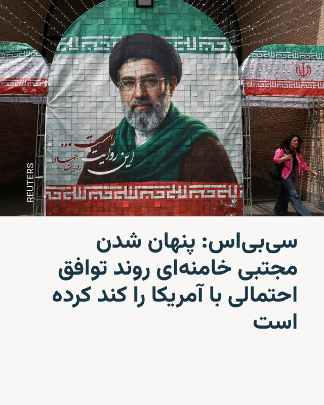

🔸شبکه خبری سی‌بی‌اس در گزارشی بر اساس گفته‌های «مقام‌های «آگاه از موضوع» در دولت آمریکا گفت مجتبی خامنه‌ای، رهبر جمهوری اسلامی در مکانی نامعلوم پنهان شده و دسترسی محدودی به جهان خارج دارد و ارتباطاتش تنها از طریق شبکه پیچیده‌ای از نامه‌برها انجام می‌شود.

🔸این مقام‌ها بر اساس یافته‌های نهادهای اطلاعاتی آمریکا گفته‌اند مقام‌های حکومت ایران که مجوز مذاکره با دولت آمریکا را دارند، برای برقراری ارتباط در داخل ساختار حکومت خود با دشواری روبه‌رو بوده‌اند و همین موضوع یکی از دلایل اصلی تأخیر در روشن شدن جزئیات توافق احتمالی با ایران بوده است.

🔸دو مقام آمریکایی به سی‌بی‌اس گفتند وقتی آمریکا جزئیات پیشنهادی را ارسال می‌کند، دشواری دسترسی به مجتبی خامنه‌ای باعث می‌شود در دریافت پاسخ، تأخیری طولانی رخ دهد.

🔸مجتبی خامنه‌ای از زمان آغاز حملات آمریکا و اسرائیل به ایران، از انظار عمومی پنهان شده و با وجود اعلام نامش به عنوان رهبر سوم جمهوری اسلامی تاکنون از او صدا یا تصویری منتشر نشده است.

@RadioFarda

## RadioFarda — post 157529

  

🔸رسانه‌ها در ایران روز یک‌شنبه سوم خرداد خبر دادند که دادگاه انقلاب تهران برای چهار نفر از متهمان پرونده اکباتان حکم اعدام صادر کرده است.

🔸بر اساس گزارشی که به‌صورت یکسان در این رسانه‌ها منتشر شد، حکم جدید مربوط به «رسیدگی موازی» در دادگاه انقلاب تهران است و این دادگاه «با توجه به جمیع اوراق و محتویات پرونده، شکایت اولیای دم شهید، گزارش مرکز تشخیص هویت پلیس آگاهی تهران، نظریه پزشکی قانونی و اظهارات متهمان، متهمان ردیف اول تا چهارم پرونده را بابت اتهام افساد فی‌الارض به مجازات اعدام محکوم کرد.»

🔸در این گزارش‌ هم‌چنین آمده که «متهمان ردیف پنجم تا نهم نیز بابت اتهام اجتماع و تبانی برای ارتکاب جرم علیه امنیت داخلی کشور و اتهام فعالیت تبلیغی علیه نظام جمهوری اسلامی ایران به حبس از یک تا پنج سال و مجازات‌های تکمیلی محکوم شدند.»

🔸گفته شده که این حکم قابل فرجام خواهی و ارجاع به دیوان عالی کشور است.

@RadioFarda

## RadioFarda — post 157528

  

🔸وزیر خارجه ایالات متحده، روز دوشنبه چهارم خرداد گفت که واشینگتن در مذاکرات جاری خود با ایران، «هر فرصتی برای موفقیت» به دیپلماسی خواهد داد.

🔸مارکو روبیو که اکنون در هند به‌سر می‌برد در جمع خبرنگاران گفت که مذاکرات با ایران همچنان «در حال پیشرفت» است و خوش‌بینی محتاطانه‌ای نسبت به توافق احتمالی برای بازگشایی مسیرهای کلیدی کشتیرانی و از سرگیری مذاکرات هسته‌ای ابراز کرد.

🔸او که روز گذشته از احتمال توافق با ایران تا پایان روز یک‌شنبه خبر داده بود، گفت: «همه ما باید مطمئن باشیم که یا به یک توافق خوب خواهیم رسید، یا مجبور می‌شویم به شکل دیگری با این مسئله برخورد کنیم. ترجیح ما این است که یک توافق خوب داشته باشیم.»

🔸دونالد ترامپ، رئیس‌جمهور آمریکا نیز شامگاه یک‌شنبه در دومین پیام خود درباره روند مذاکرات با ایران اطمینان داد که توافق احتمالی با ایران «خوب و درست» خواهد بود اما هیچ کس درباره محتوای آن اطلاع ندارد.

@RadioFarda

## IranianMinds — post 20709

ترامپ چند روز‌ دیگه :

تا ظهور‌ امام زمان به ایران فرصت دادم ، امیدوارم‌ زودتر به یه نتیجه ای برسیم و اگرنه خیلی براشون بد میشه!

@IranianMinds

## IranianMinds — post 20708

🔴 مشاور وزیر ارتباطات :

شاید تا هفته آینده اینترنت بین الملل وصل شد.

@IranianMinds

## IranianMinds — post 20707

  

🔴 فاکس‌ نیوز :

ترامپ برای رسیدن به توافق نهایی ۷ روز‌ دیگر به جمهوری اسلامی زمان داد.

@IranianMinds

## IranianMinds — post 20706

🔴 اکونومیست:

عربستان از ترامپ خواسته هرگونه حمله جدید به ایران رو تا بعد از مراسم سالانه حج به تعویق بندازه.

ریاض نگرانه اگه درگیری دوباره آغاز و حریم هوایی منطقه بسته بشه، زائران در عربستان سعودی گیر بیفتن.

@IranianMinds

## IranianMinds — post 20705

  <a href="telegram/content/IranianMinds_20705_1779700611.mp4" target="_blank">🎬 Download video</a>

🔴 مارکو روبیو درباره ایران:

پیشنهاد بسیار محکمی روی میز وجود دارد.

این توافق شامل باز شدن تنگه‌ها و آغاز مذاکرات واقعی، جدی و زمان‌دار درباره مسائل هسته‌ای است.

این طرح حمایت زیادی در خلیج فارس و در سطح جهانی دارد ، همه کشورهایی که با آن‌ها صحبت کردیم، معتقدند این فقط یک پیشنهاد منطقی نیست، بلکه اقدامی درست برای جهان است

ترامپ عجله‌ای ندارد و توافق بد امضا نخواهد کرد ، ما قبل از بررسی گزینه‌های دیگر، به دیپلماسی هر فرصتی برای موفقیت می‌دهیم!

@IranianMinds

## IranianMinds — post 20704

  

⚫️ جمهوری اسلامی یکی دیگه از هموطن هامونو هم امروز کشت. خبرگزاری قوه قضائیه جمهوری اسلامی اعلام کرد مجتبی کیان امروز صبح به دلیل ارسال پیام و دادن مختصات صنایع نظامی به شبکه های ماهواره ای معاند ( ایران اینترنشنال ) اعدام شد. @IranianMinds

## IranianMinds — post 20703

  

🔴 سی بی اس نیوز :

مجتبی خامنه ای ، رهبر‌ جمهوری اسلامی در مکانی نامعلوم پنهان شده و بر ارساس ارزیابی اطلاعاتی آمریکا دسترسی خیلی کمی به دنیای بیرون داره و‌ با افراد خیلی کمی هم در ارتباطه .

@IranianMinds

## BBCPersian — post 282003

🖋پاول آکسنوف
خبرنگار امور نظامی، بخش روسی بی‌بی‌سی

سرگئی مرنکوف، طراح ارشد هواپیماهای ترابری شرکت «هواپیماسازی غیرنظامی اورال»، اعلام کرد که کار روی ساخت هواپیمای جدید توربوپراپ «تی‌وی‌آراس-۴۴ لادوگا» در روسیه متوقف شده و این پروژه به وزارت دفاع واگذار شده است.

آقای مرنکوف در کنفرانسی درباره پشتیبانی هوانوردی مناطق قطبی، سیبری و خاور دور که سازمان هوانوردی روسیه برگزار کرده بود، گفت: «پروژه تی‌وی‌آراس-۴۴ لادوگا متوقف شده است. تصمیم گرفته شده این هواپیما و تمام زیرساخت‌های علمی و فنی آن در اختیار وزارت دفاع قرار گیرد تا بر پایه آن، یا نسخه ترابری مجهز به رمپ، یا نسخه ترابری با در جانبی، یا نسخه مسافربری ویژه نیازهای وزارت دفاع ساخته شود.»

او همچنین گفت که به دفتر طراحی این پروژه اجازه داده شده نخستین پرواز لادوگا را در سال ۲۰۲۶ انجام دهد.
ادامه مطلب⬇️

📸Getty/ elegram/favt_ru/ V.Lapkin/TASS/
https://bbc.in/4dGyZg1
@BBCPersian

## BBCPersian — post 281993

🖋سعید جعفری، روزنامه‌نگار

محمود احمدی‌نژاد سال‌ها به‌عنوان یکی از تندترین چهره‌های ضداسرائیلی جمهوری اسلامی شناخته می‌شد. اما حالا گزارش‌ها و روایت‌هایی منتشر شده که می‌گویند نام او در برخی سناریوهای مرتبط با آینده سیاسی ایران مطرح بوده است.

در این پست، نگاهی داریم به مواضع جنجالی احمدی‌نژاد، واکنش تحلیلگران اسرائیلی و آمریکایی، و این پرسش که چرا نام او دوباره در میانه بحث‌های مربوط به آینده ایران مطرح شده است.
ادامه مطلب⬇️

📸Getty/ Social media/ mahmoud ahmadinejad X/
https://bbc.in/4fGx9y5
@BBCPersian

## BBCPersian — post 281992

🔻ارتش اسرائیل دستور تخلیه ۱۰ روستا در جنوب لبنان را صادر کرد

آویخای ادرعی، سخنگوی عرب زبان ارتش اسرائیل، برای تخلیه ۱۰ روستا در جنوب لبنان دستور فوری صادر کرده است.

آقای ادرعی در حسابش در شبکه اجتماعی ایکس نوشت:‌ «هر کسی که در نزدیکی عناصر حزب‌الله، تأسیسات و تجهیزات جنگی آنها حضور داشته باشد، جان خود را در معرض خطر قرار می‌دهد!»

او به ساکنان این مناطق هشدار داد که «فورا خانه‌های خود را تخلیه کنید و از روستاها و شهرها حداقل ۱۰۰۰ متر تا مناطق باز فاصله بگیرید.»

سخنگوی ارتش اسرائیل دلیل صدور این دستور را «نقض توافق آتش‌بس» از سوی حزب‌الله عنوان کرد.

اسرائیل دیروز هم برای ۱۰ شهر و روستا در جنوب و شرق لبنان دستور تخلیه صادر کرده بود.

https://bbc.in/4wPeI0e
@BBCPersian

## BBCPersian — post 281991

  

🔻معاون رئیس‌جمهور ایران خواستار دعوت از سردار آزمون به تیم ملی فوتبال شد چراکه «این نه یک تصمیم ورزشی، که پیامی به نفع انسجام ملی است.»

عبدالکریم حسین‌زاده معاون رئیس‌جمهور در امور توسعه روستایی و مناطق محروم در حسابش در شبکه اجتماعی ایکس نوشت: «نیاز وطن حفظ نخ‌های پیوند بین فرزندانش است. هرکس نام ایران را بالاتر از گلایه‌های شخصی می‌شناسد، بخشی از سرمایه ملی ماست.»

او به پیام سردار آزمون به تیم ملی فوتبال اشاره کرد: «اقدام سردار آزمون برای نمایش این پیوند را نادیده نگیریم و در صورت امکان او را به تیم ملی برگردانیم.»

وبسایت رسمی فدراسیون فوتبال ۲۶ اردیبهشت فهرست سی نفره تیم ملی برای جام جهانی ۲۰۲۶ را منتشر کرد که در آن نام سردار آزمون نبود.

توضیح رسمی در این باره داده نشد اما انتشار عکس‌های سردار آزمون عکس‌هایش در کنار حاکم دوبی در خلال جنگ آمریکا و اسرائیل و حمایتش از اعتراضات مردم در ایران از عوامل دعوت نشدن به تیم ملی بوده است.

سردار آزمون با با ۵۷ گل در ۹۱ بازی ملی دومین گلزن برتر تیم ملی فوتبال مردان است.

📸GettyImages
https://bbc.in/3Q2832i
@BBCPersian

## BBCPersian — post 281990

🔻عاصم منیر به پکن رفت

عاصم منیر، فرمانده کل قوای پاکستان و میانجی اصلی در گفت‌وگوهای ایران و آمریکا به شهباز شریف، نخست‌وزیر پاکستان ملحق شد که برای یک سفر رسمی در چین است.

شهباز شریف با رهبران چین از جمله شی جین‌پینگ، رئیس‌حمهور، دیدار می‌کند و ایران یکی از محورهای گفت‌وگوهاست.

چین گفته است که با پاکستان همکاری خواهد کرد تا «در بازگرداندن هرچه سریع‌تر صلح و ثبات به خاورمیانه مشارکت مثبتی داشته باشد.»

فیلد مارشال عاصم منیر جمعه و شنبه به همراه محسن نقوی، وزیر کشور پاکستان، برای میانجی‌گری با آمریکا در تهران بود.

https://bbc.in/4tUrtEo
@BBCPersian

## Dirty_Kids — post 390125

  <a href="telegram/content/Dirty_Kids_390125_1779700614.mp4" target="_blank">🎬 Download video</a>

بیوگرافی کوتاهی از عمو مانوک و مرگ مشکوکش:

@Dirty_Kids 👻

## Dirty_Kids — post 390124

  

خودت خایه نوشتن «خایه» رو نداشتی.

@Dirty_Kids 👻

## Dirty_Kids — post 390123

  <a href="telegram/content/Dirty_Kids_390123_1779700615.mp4" target="_blank">🎬 Download video</a>

دل یه ایران گرفته

@Dirty_Kids 👻

## Dirty_Kids — post 390122

  <a href="telegram/content/Dirty_Kids_390122_1779700617.mp4" target="_blank">🎬 Download video</a>

دیگه نمیتونم تشخیص بدم کی پرستوعه کی کصخل‌مجازیه

@Dirty_Kids 👻

## Dirty_Kids — post 390121

  

بکیرم میگی چی‌کار کنیم الان
اگه خواستن بهت بدن تو نکن

@Dirty_Kids 👻

## Dirty_Kids — post 390120

  <a href="telegram/content/Dirty_Kids_390120_1779700618.mp4" target="_blank">🎬 Download video</a>

مراد ویسی: مردم ایران منتظر ترامپ و بی‌بی نبودن رو پای خودشون همیشه وایستادن

@Dirty_Kids 👻

## Dirty_Kids — post 390119

  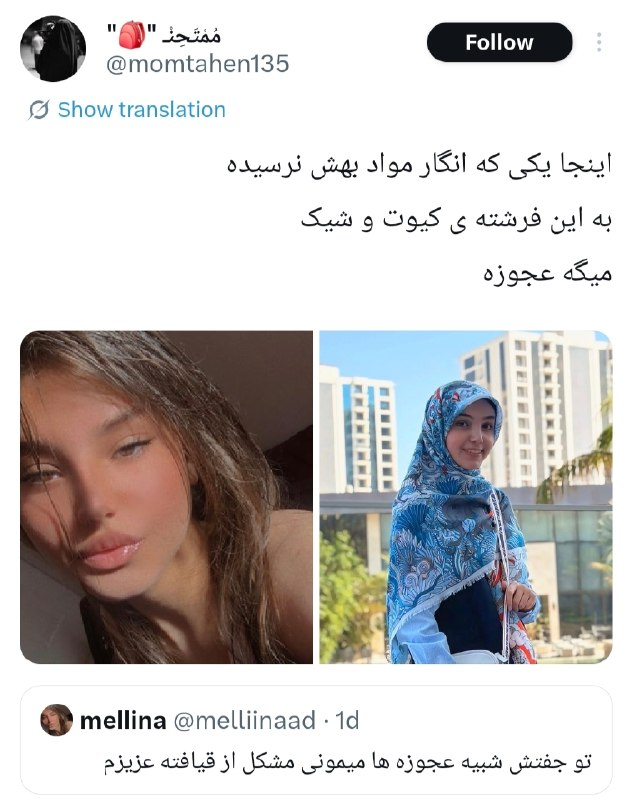

بیا برو بابا قهبه 😂 همه‌ی شما صیغه‌زاده‌ها روهم یه تار از پشمشم نمیشید

انگار فرغون رو با بنز بیای مقایسه کنی
اصن فیس گربه‌ای رو ببین 😍

@Dirty_Kids 👻

## Dirty_Kids — post 390118

  <a href="telegram/content/Dirty_Kids_390118_1779700620.mp4" target="_blank">🎬 Download video</a>

صدا ، تصویر و خواسته مردم ایران سانسورشدنی نیست.

@Dirty_Kids 👻

## Hranews — post 113146

اعتراضات ۱۴۰۴؛ عباس اکبری فیض‌آبادی اعدام شد

❗️
❗️
❗️
❗️
❗️– مرکز رسانه قوه قضاییه از اجرای حکم اعدام عباس اکبری فیض‌آبادی، از بازداشت‌شدگان اعتراضات ۱۴۰۴ که به اتهاماتی از جمله «محاربه» متهم شده بود خبر داد. این حکم بامداد امروز به اجرا درآمد. بر اساس داده‌های گردآوری‌شده توسط هرانا، همزمان با آغاز درگیری‌های نظامی، روند صدور و اجرای احکام #اعدام در پرونده‌های سیاسی و امنیتی افزایش یافته و تاکنون ۳۶ زندانی با این اتهامات در این بازه زمانی اعدام شده‌اند.

ادامه مطلب

#عباس_اکبری_فیض‌آبادی

↘️
@hranews_bot تماس ✉️ -  @Hranews  کانال هرانا 🆑

## Hranews — post 113145

  

جمعی از رانندگان استیجاری برای سومین روز متوالی در مقابل ساختمان نهاد ریاست جمهوری در تهران، #تجمع_اعتراضی برگزار کردند.

به گفته این رانندگان، ما از استان‌های مختلف در حالی برای اعتراض به تهران آمده‌ایم که از سال ۱۴۰۰ به دنبال اجرای قانون و تبدیل وضعیت هستیم اما هیچ نهادی پیگیر وضعیت ما نیست.

↘️
@hranews_bot تماس ✉️ -  @Hranews  کانال هرانا 🆑

## manototv — post 105826

  <a href="telegram/content/manototv_105826_1779700622.mp4" target="_blank">🎬 Download video</a>

تماسی از اتریش:
«می‌گفت سختی‌ها خیلی‌ها را عوض کرد…
و از کیوان عباسی به‌خاطر حفظ همان نگاه و مسیر همیشگی‌اش قدردانی کرد.»

## alonews — post 122515

  <a href="telegram/content/alonews_122515_1779700623.mp4" target="_blank">🎬 Download video</a>

👈روبیو تو پاسخ به سوالی درباره نگرانی هند از نقش پاکستان به‌عنوان میانجی بین آمریکا و ایران : هند همیشه نگران گروه‌های تروریستی مسلحیه که از خاک پاکستان فعالیت می‌کنن و هند رو هدف قرار میدن، این نگرانی همیشگی اوناست

🔴اما درباره نقشی که پاکستان به‌عنوان میانجی و تسهیل‌کننده تو موضوع ایران داشت، اصلاً مطرح نشد و فکر نمی‌کنم هند مشکلی با اون داشته باشه

🔴اختلاف هند با پاکستان یه موضوع جداگونه‌ست

✅ @AloNews خبر جنگ

## alonews — post 122514

  <a href="telegram/content/alonews_122514_1779700625.webm" target="_blank">🎬 Download video</a>

🔴فوری/ بازگشایی اینترنت بین الملل مصوب شد
‌

🔴ستاد راهبری و ساماندهی فضای مجازی صبح امروز دوشنبه (چهارم خردادماه) به ریاست دکتر عارف معاون اول رئیس جمهور تشکیل جلسه داد و بازگشت اینترنت به وضعیت قبل از دی ماه 1404 مصوب شد.
‌

🔴این مصوبه برای رییس جمهور ارسال شد و در صورت تایید رئیس جمهور جهت اجرا برای وزارت ارتباطات ارسال خواهد شد.

✅ @AloNews خبر جنگ

## alonews — post 122513

  <a href="telegram/content/alonews_122513_1779700625.webm" target="_blank">🎬 Download video</a>

👈عبدالناصر همتی برای پیگیری آزادسازی منابع ارزی ایران راهی قطر شد

✅ @AloNews خبر جنگ

## alonews — post 122508

  <a href="telegram/content/alonews_122508_1779700625.webm" target="_blank">🎬 Download video</a>

👈 جنگنده‌های اسرائیلی حملات هوایی را در چندین شهر جنوب لبنان انجام دادند

✅ @AloNews خبر جنگ

## alonews — post 122507

  <a href="telegram/content/alonews_122507_1779700625.mp4" target="_blank">🎬 Download video</a>

👈روبیو : ترامپ قرار نیست توافق بدی امضا کنه. هیچ‌کس به اندازه ترامپ تهدیدِ هسته‌ای شدن ایران رو جدی نگرفته

🔴خیلی مطمئنم که یا به یه توافق خوب می‌رسیم یا مجبور می‌شیم یه جور دیگه باهاش برخورد کنیم

🔴 ولی ترجیح ما توافق خوبه

✅ @AloNews خبر جنگ

## alonews — post 122506

  <a href="telegram/content/alonews_122506_1779700627.mp4" target="_blank">🎬 Download video</a>

👈وزیر خارجه آمریکا، مارکو روبیو : هنوز همه‌چیز در حال پیشرفته، همون‌طور که گفتم فکر می‌کردیم شاید دیشب خبرهایی داشته باشیم

🔴الان چیزی روی میز هست که به‌نظرم پیشنهاد محکمیه

🔴درباره باز شدن تنگه‌ها، باز نگه داشتن مسیر عبور کشتی‌ها و ورود به مذاکرات واقعی، جدی و زمان‌دار درباره مسائل هسته‌ای امیدواریم بشه به نتیجه رسوندش.

🔴 این طرح تو خلیج فارس حمایت زیادی داره، داخل آمریکا هم حمایت میشه و تقریباً هر کشوری که در جریانش قرار گرفته فهمیده که این فقط یه پیشنهاد منطقی نیست، بلکه برای دنیا هم کار درستی محسوب میشه.

🔴 همون‌طور که رئیس‌جمهور گفت، عجله‌ای نداره و قرار نیست توافق بدی امضا کنه. باید ببینیم چی پیش میاد

🔴ما قبل از بررسی هر گزینه دیگه‌ای، به دیپلماسی هر فرصتی برای موفق شدن می‌دیم

✅ @AloNews خبر جنگ

## alonews — post 122505

  <a href="telegram/content/alonews_122505_1779700628.webm" target="_blank">🎬 Download video</a>

👈منابع خبری گزارش دادند که «بنیامین نتانیاهو»، نخست‌ وزیر اسراییل، فردا نشست کابینه امنیتی را برگزار می‌کند.

✅ @AloNews خبر جنگ

## alonews — post 122504

  <a href="telegram/content/alonews_122504_1779700629.webm" target="_blank">🎬 Download video</a>

👈سخنگوی وزارت خارجه: ایران در دفاع از خود هیچ گزینه‌ای را منتفی نمی‌داند.

✅ @AloNews خبر جنگ

## alonews — post 122503

  <a href="telegram/content/alonews_122503_1779700629.mp4" target="_blank">🎬 Download video</a>

👈وزارت امور خارجه چین: در جهان تنها یک چین وجود دارد.

🔴تایوان بخش جدایی‌ناپذیر از قلمرو چین است

🔴ما از طرف آلمان می‌خواهیم که اصل چین واحد را حفظ کند و ارسال سیگنال‌های نادرست به نیروهای جدایی‌طلب استقلال تایوان را متوقف نماید.

✅ @AloNews خبر جنگ

## alonews — post 122502

  <a href="telegram/content/alonews_122502_1779700630.webm" target="_blank">🎬 Download video</a>

👈بقایی: برای تنگه هرمز عوارض نمی‌گیریم؛ هزینه‌های دریافتی صرفاً بابت خدمات ناوبری و حفاظت از محیط زیست است

✅ @AloNews خبر جنگ

## alonews — post 122501

  <a href="telegram/content/alonews_122501_1779700630.webm" target="_blank">🎬 Download video</a>

👈مارکو روبیو، وزیر امور خارجه آمریکا، در شبکه تلویزیونی ایندیا تودی: اگر مذاکرات شکست بخورد تقصیر ایالات متحده یا متحدان ما در منطقه خلیج فارس نیست. ۱۰۰ درصد تقصیر ایران است

✅ @AloNews خبر جنگ

## alonews — post 122500

  <a href="telegram/content/alonews_122500_1779700630.webm" target="_blank">🎬 Download video</a>

👈العربیه: اسلام‌آباد اصرار دارد که پکن نقش ضامن را در هر توافقی بین آمریکا و ایران ایفا کند

✅ @AloNews خبر جنگ

## alonews — post 122499

  <a href="telegram/content/alonews_122499_1779700631.webm" target="_blank">🎬 Download video</a>

👈بقایی: چین و روسیه نقش سازنده و مثبتی در تحولات منطقه ای ایفا کرده‌اند

✅ @AloNews خبر جنگ

## alonews — post 122498

  <a href="telegram/content/alonews_122498_1779700631.webm" target="_blank">🎬 Download video</a>

👈 فرمانده قرارگاه خاتم: سامانه‌های جدید پدافندی به کار می‌گیریم

✅ @AloNews خبر جنگ

## alonews — post 122497

  <a href="telegram/content/alonews_122497_1779700631.webm" target="_blank">🎬 Download video</a>

👈بعد از ۲۳ سال، یک خانم (سمیه رفیعی نماینده تهران) عضو هیئت‌رئیسۀ مجلس شد

از مجلس هفتم تاکنون خانمی در جایگاه هیئت‌رئیسه حضور نداشت.

✅ @AloNews خبر جنگ

## alonews — post 122496

  <a href="telegram/content/alonews_122496_1779700631.webm" target="_blank">🎬 Download video</a>

👈نت بلاکس:  اکنون روز ۸۷ام متوالی قطعی اینترنت ایران است که بیش از ۲۰۶۴ ساعت ادامه داشته است

✅ @AloNews خبر جنگ

---
📅 بروزرسانی: 1405/03/04 08:39
---

## VahidOOnLine — post 242066

  

♦️درحالی که دونالد ترامپ، رئیس‌جمهوری آمریکا همواره بر خارج کردن ذخایر اورانیوم غنی‌شده از ایران تاکید داشته است، در روایت سی‌ان‌ان از چارچوب توافق احتمالی با تهران آمده است که درباره چگونگی نابودی ذخایر اورانیوم غنی‌شده ایران در مرحله بعدی مذاکرات تصمیم‌گیری می‌شود. براساس این گزارش، در صورت توافق، بازه زمانی ۶۰ روزه برای به تفاهم رسیدن درباره جزئیات باقی مانده در نظر گرفته شده است. یکی از مقامات که مستقیما در جریان مذاکرات قرار دارد نیز به اسوشیتدپرس گفت: نحوه واگذاری اورانیوم از سوی ایران، در طول یک دوره ۶۰ روزه به مذاکرات بیشتر موکول خواهد شد. به گفته او، احتمالا بخشی از این مواد رقیق خواهد شد و بقیه به کشور ثالث منتقل می‌شود. روسیه پیشنهاد داده است این مواد را تحویل بگیرد.
بر اساس گزارش آژانس بین‌المللی انرژی اتمی، ایران ۴۴۰.۹ کیلوگرم اورانیوم با غنای تا ۶۰ درصد در اختیار دارد؛ سطحی که از نظر فنی تنها یک گام کوتاه تا غنای ۹۰ درصدی مورد نیاز برای ساخت سلاح هسته‌ای فاصله دارد.
‌🇸🇦 Indypersian

🤖 @VahidOOnLine

## VahidOOnLine — post 242065

  <a href="telegram/content/VahidOOnLine_242065_1779685788.mp4" target="_blank">🎬 Download video</a>

♦️به گزارش فاکس نیوز، مراسم فارغ‌التحصیلی دبیرستان سنتنیال در شهر فرانکلین ایالت تنسی با وجود بارش شدید باران و وقوع صاعقه، در فضای باز برگزار شد و موجی از انتقاد خانواده‌ها را به‌دنبال داشت.

مسئولان مدرسه با اجرای سیاست «باران یا آفتاب» تصمیم گرفتند برنامه از پیش تعیین‌شده را تغییر ندهند؛ با وجود آنکه از قبل از وضعیت آب‌وهوا اطلاع داشتند و حتی برای بارندگی برنامه جایگزین نیز در نظر گرفته بودند.

بر اساس گزارش‌ها، مسئولان امیدوار بودند مراسم پیش از آغاز بارندگی به پایان برسد و به همین دلیل آن را به سالن سرپوشیده منتقل نکردند. نگرانی درباره جا نشدن همه حاضران در سالن ورزشی نیز یکی از دلایل ادامه مراسم در فضای باز عنوان شده است.
‌🇸🇦 Indypersian

🤖 @VahidOOnLine

## VahidOOnLine — post 242064

♦️مارکو روبیو، وزیر خارجه آمریکا، روز دوشنبه در جریان سفر به هند گفت مذاکرات میان آمریکا و رژیم ایران «هنوز در حال پیشرفت و شکل‌گیری» است.
روبیو پیش از ترک دهلی‌نو برای بازدید از تاج‌محل در شهر آگرا، به خبرنگاران گفت: «فکر می‌کردیم شاید دیشب خبرهایی داشته باشیم. خیلی نباید در این مورد برداشت خاصی کرد. دریافت پاسخ کمی زمان می‌برد.»
او گفت درباره توانایی ایران برای باز نگه داشتن تنگه هرمز و ورود به «مذاکراتی واقعی، مهم و محدود از نظر زمانی درباره مسائل هسته‌ای»، «پیشنهاد نسبتا محکمی روی میز» قرار دارد. روبیو افزود که توافق احتمالی از حمایت گسترده کشورهای خلیج فارس و همچنین حمایت جهانی برخوردار است.
وزیر خارجه آمریکا همچنین تاکید کرد که دونالد ترامپ، رئیس‌جمهوری آمریکا، «عجله‌ای ندارد» و «قرار نیست توافق بدی امضا کند.»
روبیو گفت: «یا به یک توافق خوب می‌رسیم یا باید از راه دیگری با این مسئله برخورد کنیم.»
او در پاسخ به این پرسش که آیا لبنان بخشی از توافق خواهد بود یا نه، گفت گفت‌وگوها با اسرائیل و لبنان همچنان ادامه دارد.
‌🇸🇦 Indypersian

🤖 @VahidOOnLine

## VahidOOnLine — post 242063

  

روزنامه نیویورک‌پست به نقل از «یک مقام ارشد دولت آمریکا» نوشت که نهایی شدن توافق صلح با حکومت ایران برای بازگشایی تنگه هرمز ممکن است تا یک هفته طول بکشد، اما اگر تهران به شرایط دونالد ترامپ متعهد نشود، ممکن است رییس‌جمهوری ایالات متحده، از آن خارج شود.

یک مقام ارشد آمریکا گفت پس از آن‌که ترامپ اعلام کرد مذاکرات بر سر جنگ و برنامه هسته‌ای تهران در مرحله نهایی خود قرار دارد، وضعیت حکومت ایران باعث شده است که روند نهایی به کندی پیش برود.

این منبع اشاره کرد که ممکن است چند روز طول بکشد تا توافق نهایی به دست مجتبی خامنه‌ای، رهبر جمهوری اسلامی، برسد.

در همین ارتباط، شماری از رسانه‌ها گزارش داده‌اند که او درمکانی نامعلوم مخفی شده و امکان دسترسی به او برای مقام‌‌های حکومت ایران دشوار است.

به نوشته نیویورک‌پست، مقام ارشد آمریکایی گفت بازگشایی واقعی تنگه هرمز و پایان محاصره بنادر ایران توسط آمریکا حدود هفت روز طول خواهد کشید و ایالات متحده تنها زمانی تحریم‌ها را لغو خواهد کرد که ایران اورانیوم غنی‌شده خود را تحویل دهد.
‌🏁 🇬🇧 IranintlTV

🤖 @VahidOOnLine

## VahidOOnLine — post 242062

  

♦️مقام‌های اسرائیلی هشدار داده‌اند که توافق در حال شکل‌گیری میان رژیم ایران و ایالات متحده «توافقی بد» است، زیرا تهدیدهای اصلی جمهوری اسلامی فراتر از برنامه هسته‌ای را نادیده می‌گیرد.
یکی از این مقام‌ها به اورشلیم پست گفت: «توافق چارچوبی خوب نیست و حتی اگر توافق نهایی امضا شود و همه اورانیوم غنی‌شده از ایران خارج شود ــ که خود محل تردید جدی است ــ این توافق به برنامه موشکی ایران یا شبکه نیروهای نیابتی منطقه‌ای آن نمی‌پردازد.»
مقام‌های اسرائیلی همچنین نگران‌اند که این توافق آزادی عمل اسرائیل در لبنان را محدود کند و احتمالا توانایی این کشور برای اقدام علیه تهدیدهای جمهوری اسلامی در سراسر منطقه را کاهش دهد.
یک مقام اسرائیلی دیگر نیز گفت: «هنوز هیچ چیز نهایی نشده، اما این توافق می‌تواند بر اینکه آیا و چگونه قادر به اقدام خواهیم بود، تاثیر بگذارد.»
ارزیابی اسرائیل این است که دونالد ترامپ، رئیس‌جمهوری آمریکا، در حال حاضر خواهان دستیابی به توافق با ایران است و تنها فردی که ممکن است در نهایت مانع آن شود، مجتبی خامنه‌ای، رهبر جمهوری اسلامی، است.
یک مقام اسرائیلی گفت: «در نهایت، تصمیم به او بستگی دارد. همان‌طور که پدرش در آخرین لحظه در سال ۲۰۲۲ توافق جدید هسته‌ای را رد کرد، ممکن است او نیز همان مسیر را در پیش بگیرد.»
براساس این گزارش، فرض اصلی نهادهای امنیتی اسرائیل این است که حکومت کنونی ایران هرگز به‌طور کامل از برنامه هسته‌ای خود دست نخواهد کشید. به باور مقام‌های اسرائیلی، تهران به‌دنبال توافق‌هایی است که بتواند از آن‌ها برای خرید زمان و به تعویق انداختن رویارویی‌هایی استفاده کند که ممکن است توانایی‌هایش را تضعیف کند.
به گفته کارشناسان، اگر ایران با واگذاری ۴۶۰ کیلوگرم اورانیوم ۶۰ درصد غنی‌شده موافقت کند، انتقال این مواد به طرف ثالثی مانند آمریکا یا روسیه بخش ساده‌تر ماجرا خواهد بود. چالش بزرگ‌تر، ایجاد سازوکاری قابل اعتماد برای بازرسی و نظارت بر تاسیسات هسته‌ای ایران، به‌ویژه در زمینه بازسازی یا تولید سانتریفیوژها، خواهد بود.
همچنین هنوز مشخص نیست که با زیرساخت‌های هسته‌ای که در حملات ارتش اسرائیل و ارتش آمریکا آسیب جدی دیده‌اند چه خواهد شد.
در اسرائیل، هر توافقی که به ایران اجازه دهد زیرساخت هسته‌ای خود را تحت عنوان «پروژه غیرنظامی» حفظ کند، شکست این کارزار تلقی خواهد شد.
علاوه بر این، مقام‌های دفاعی به وب‌سایت «والا» تایید کردند که یکی از نقاط اختلاف در توافق، درخواست حکومت تهران برای گنجاندن حزب‌الله در توافق آتش‌بس و جلوگیری از ادامه عملیات نظامی اسرائیل است.
‌🇸🇦 Indypersian

🤖 @VahidOOnLine

## VahidOOnLine — post 242061

  

♦️قوه قضائیه جمهوری اسلامی روز دوشنبه چهارم خرداد اعلام کرد عباس اکبری فیض‌‌آبادی به‌اتهام «به اتهام محاربه، تخریب عمدی اموال عمومی به قصد مقابله با نظام مقدس جمهوری اسلامی ایران و اخلال در نظم و امنیت جامعه، اجتماع و تبانی برای ارتکاب جرم علیه امنیت داخلی کشور» محاکمه و اعدام شد.

میزان، خبرگزاری قوه قضائیه با اعلام این خبر نوشت: متهم «نقش مهمی در حمله به فرمانداری شهرستان و مراکز تامین امنیت و همچنین مراکز خدماتی» شهرستان نائین استان اصفهان داشت.

جمهوری اسلامی از زمان آغاز جنگ در اسفندماه سال گذشته دست‌کم ۲۵ نفر را به اتهام‌های سیاسی و امنیتی اعدام کرده است.
‌🇸🇦 Indypersian

🤖 @VahidOOnLine

## VahidOOnLine — post 242060

  

حکم اعدام عباس اکبری فیض‌آبادی، از بازداشت‌شدگان دی‌ماه در شهرستان نائین اصفهان، صبح دوشنبه، چهارم خرداد پس از تایید دیوان عالی کشور اجرا شد.

بر اساس گزارش خبرگزاری میزان، وابسته به قوه قضاییه جمهوری اسلامی، عباس اکبری فیض‌آبادی، فرزند علی، با اتهام‌هایی از جمله «محاربه»، «تخریب عمدی اموال عمومی به قصد مقابله با نظام جمهوری اسلامی»، «اخلال در نظم و امنیت جامعه» و «اجتماع و تبانی برای ارتکاب جرم علیه امنیت داخلی کشور» محاکمه شده بود.

در این گزارش آمده است که دادگاه پس از برگزاری جلسات رسیدگی و دریافت دفاعیات متهم و وکیل او، با استناد به آنچه «اقاریر متهم» درباره همراه داشتن کلت کمری جنگی، حضور در خیابان و تیراندازی عنوان شده، اتهام محاربه را محرز دانست.

قوه قضاییه همچنین اعلام کرد فیلمی از لحظه تیراندازی و گزارش مرجع انتظامی درباره کشف سلاح از منزل متهم، از جمله مستندات پرونده بوده است.

بر اساس این گزارش حکم اعدام عباس اکبری فیض‌آبادی در دیوان عالی کشور تایید و اعلام شد حکم صادرشده بر پایه مدارک، مستندات و اظهارات متهم بوده و ایرادی به آن وارد نیست.
‌🏁 🇬🇧 IranintlTV

🤖 @VahidOOnLine

## VahidOOnLine — post 242059

  

مارکو روبیو، وزیر خارجه ایالات متحده، صبح دوشنبه چهارم خرداد اعلام کرد که توافق آمریکا و حکومت ایران «همچنان پیش می‌رود.»

به‌گزارش خبرگزاری رویترز، او افزود که در مورد «توانایی ایران برای باز کردن» تنگه هرمز و «ورود به مذاکراتی واقعی، مهم و محدود از نظر زمانی درباره مسائل هسته‌ای»، پیشنهادی «نسبتا محکم» روی میز است.

روبیو اضافه کرد: «امیدواریم که بتوانیم آن را عملی کنیم. این طرح در خلیج فارس حمایت زیادی دارد. در سطح جهانی نیز از حمایت زیادی برخوردار است.»

او گفت که هر کشوری درک می‌کند که «این نه تنها بسیار منطقی است، بلکه کار درستی است که جهان باید انجام دهد.»

روبیو که در جریان سفر به هند با خبرنگاران گفت‌وگو می‌کرد، افزود که ترامپ عجله‌ای برای رسیدن به توافق ندارد.

او تاکید کرد: «قرار نیست که رییس‌جمهور توافق بدی انجام دهد. بنابراین بیایید ببینیم چه اتفاقی می‌افتد. ما قبل از بررسی گزینه‌ها، به دیپلماسی، فرصت موفقیت را می‌دهیم.»
‌🏁 🇬🇧 IranintlTV

🤖 @VahidOOnLine

## VahidOOnLine — post 242058

  

مقام‌های اسرائیلی هشدار دادند که توافق در حال شکل‌گیری بین حکومت ایران و ایالات متحده «یک توافق بد» است و می‌گویند که این توافق به تهدیدات کلیدی تهران فراتر از برنامه هسته‌ای‌اش نمی‌پردازد.

یک مقام اسرائیلی به روزنامه اورشلیم‌پست گفت: «چارچوب توافق خوب نیست و حتی اگر توافق نهایی امضا شود و تمام اورانیوم غنی‌شده از ایران خارج شود، که یک «اگر» بزرگ است، این توافق به موضوع برنامه موشکی ایران یا شبکه نیروهای نیابتی منطقه‌ای آن نمی‌پردازد.»

بر اساس این گزارش، مقام‌ها در اورشلیم همچنین نگرانند که این توافق بتواند آزادی عمل اسرائیل در لبنان را محدود کند و به‌طور بالقوه، توانایی آن را برای اقدام علیه تهدیدهای تهران در سراسر منطقه محدود کند.

یک مقام اسرائیلی به اورشلیم‌پست گفت: «هنوز هیچ چیز نهایی نیست، اما این توافقی است که می‌تواند بر توانایی و نحوه عملکرد ما تأثیر بگذارد.»

این گزارش حاکی از آن است که بنیامین نتانیاهو، نخست وزیر اسرائیل، عصر یکشنبه گروه کوچکی از وزرا و مقامات ارشد امنیتی را برای بحث در مورد توافق در حال شکل‌گیری تشکیل داد.
‌🏁 🇬🇧 IranintlTV

🤖 @VahidOOnLine

## VahidOOnLine — post 242057

♦️حسین انتظامی، سخنگوی سابق دبیرخانه شورای عالی امنیت ملی، در گفتگو با فارس، خبرگزاری وابسته به سپاه، درباره آخرین اقدام علی لاریجانی پیش از مرگ گفت: «کار بزرگی که او انجام داد این بود که درست ۲۴ ساعت قبل از مرگ، طرح صلح را در شورای عالی امنیت ملی به تصویب رساند. چهارچوبی که مسیر مذاکرات شامل آتش‌بس و صلح را به امضای تک‌تک اعضای این شورا رساند و برای رهبری فرستاد». علی لاریجانی بامداد ۲۶ اسفند ۱۴۰۴ در جریان حملات هوایی اسرائیل به تهران، به همراه فرزندش مرتضی و رئیس دفترش کشته شد.
‌🇸🇦 Indypersian

🤖 @VahidOOnLine

## VahidOOnLine — post 242056

♦️مارکو روبیو، وزیر خارجه آمریکا، روز یکشنبه در جریان سفر به هند، در مراسمی غافلگیرکننده در دهلی‌نو جشن تولد ۵۵ سالگی‌اش را برگزار کرد؛ مراسمی که با اجرای گروه موسیقی «ویلیج پیپل» همراه بود.

این مراسم در محوطه «بهارات ماندپام» و همزمان با جشن دویست‌وپنجاهمین سال استقلال آمریکا برگزار شد. سرجیو گور، سفیر آمریکا در هند، روبیو را به روی صحنه دعوت کرد و همزمان صفحه‌نمایشی بزرگ با پیام «تولدت مبارک مارکو روبیو» روشن شد.

در ادامه، یک کیک چهارطبقه برای وزیر خارجه آمریکا آورده شد و گروه «ویلیج پیپل» ترانه «تولدت مبارک» را برای او اجرا کرد. این گروه سپس اجرای خود را با ترانه مشهور «وای‌ام‌سی‌ای» ادامه داد.

سوبرامانیام جایشانکا، وزیر خارجه هند، و شماری دیگر از مقام‌های آمریکایی و هندی نیز در این مراسم حضور داشتند.

ترانه «وای‌ام‌سی‌ای» که از مشهورترین آثار موسیقی دیسکو به شمار می‌رود، در سال‌های اخیر بارها در مراسم و گردهمایی‌های دونالد ترامپ نیز پخش شده است.
‌🇸🇦 Indypersian

🤖 @VahidOOnLine

## VahidOOnLine — post 242055

  

شبکه خبری سی‌ان‌ان گزارش داد در چارچوب پیش‌نویس نوافق‌نامه آمریکا و حکومت ایران، ۶۰ روز برای نهایی‌کردن این توافق، فرصت داده شده و کاهش تحریم‌ها نیز به واگذاری ذخایر اورانیوم با غنای بالا از سوی تهران مشروط شده است.

یک مقام ارشد دولت دونالد ترامپ در گفت‌وگو با سی‌ان‌ان تاکید کرد: «بدون تحویل گردو غبار [اورانیوم]، پولی در کار نخواهد بود.»
‌🏁 🇬🇧 IranintlTV

🤖 @VahidOOnLine

## VahidOOnLine — post 242054

  

روزنامه دنیای اقتصاد گزارش داد: «بر اساس پیش‌بینی‌ها، درآمد‌های مالیاتی با عدم تحقق ۲۵ درصدی در بودجه سال جاری مواجه خواهد شد.»

این روزنامه اشاره کرد که این کاهش درآمد‌ها می‌تواند کسری بودجه را تشدید کند و افزود اقتصاد ایران در سال ۱۴۰۵ با مجموعه‌ای از نااطمینانی‌ها و فشار‌های همزمان مواجه شده است.

دنیای اقتصاد به «اختلال‌های گسترده اینترنت، کاهش دسترسی بسیاری از کسب‌وکار‌ها به بازار، افت فروش در بخش خدمات و تجارت آن‌لاین، افزایش هزینه‌های تولید، کاهش قدرت خرید خانوار‌ها و نگرانی‌های ناشی از تشدید تنش‌های منطقه‌ای» اشاره کرد؛ عواملی که بسیاری از بنگاه‌ها را در وضعیت نیمه‌تعطیل یا رکودی قرار داده‌اند.

بر اساس این گزارش، علی افضلی، مدیرکل دفتر سیاستگذاری بخش عمومی وزارت اقتصاد، در همایش «چشم‌انداز اقتصاد ایران ۱۴۰۵» گفته است احتمال دارد «حدود ۲۵ درصد از درآمد‌های مالیاتی امسال وصول نشود.»

دنیای اقتصاد نوشت اگر یک‌چهارم درآمد‌های مالیاتی محقق نشود، دولت یا باید هزینه‌ها را کاهش دهد، یا به سمت استقراض و چاپ پول برود، یا فشار مالیاتی بیشتری بر مؤدیان وارد کند؛ مسیرهایی که هر سه تبعات اقتصادی آسیب‌زا دارند.
ht
‌🏁 🇬🇧 IranintlTV

🤖 @VahidOOnLine

## VahidOOnLine — post 242053

  

♦️یک مقام ارشد دولت آمریکا روز یکشنبه به نیویورک پست گفت ممکن است نهایی شدن توافق تا یک هفته طول بکشد، اما دونالد ترامپ ممکن است در صورت نپذیرفتن شرایطش از سوی تهران، از این روند خارج شود.
یک‌مقام ارشد به این. روزنامه آمریکایی گفت، وضعیت حکومت تهران باعث شده روند نهایی شدن توافق کند پیش برود.
این منبع اعلام کرد ممکن است چند روز طول بکشد تا متن نهایی توافق به دست رهبر جمهوری اسلامی، مجتبی خامنه‌ای، برسد که از زمان آغاز جنگ در مخفیگاه به سر می‌برد و گفته می‌شود زخمی است.
او افزود، بازگشایی واقعی تنگه هرمز و پایان محاصره آمریکا علیه بنادر ایران حدود هفت روز زمان خواهد برد و آمریکا تنها زمانی تحریم‌ها را لغو می‌کند که ایران اورانیوم غنی‌شده خود را تحویل بدهد.
با وجود این نگاه مثبت، ترامپ گفته است عجله‌ای برای رسیدن به توافق ندارد و مذاکرات را تا زمان تعیین شرایط ایده‌آل ادامه خواهد داد.
‌🇸🇦 Indypersian

🤖 @VahidOOnLine

## VahidOOnLine — post 242052

  

نشریه اکونومیست گزارش داد که ریاض از دونالد ترامپ خواسته است هرگونه حمله جدید به ایران را تا پس از مراسم سالانه حج به تعویق بیندازد.

به نوشته اکونومیست، این نگرانی وجود دارد که اگر درگیری دوباره آغاز و حریم هوایی منطقه بسته شود، زائران در عربستان سعودی گیر بیفتند.
‌🏁 🇬🇧 IranintlTV

🤖 @VahidOOnLine

## VahidOOnLine — post 242051

  

داده‌های کشتیرانی نشان می‌دهد که یک نفتکش گاز طبیعی مایع دوشنبه از تنگه هرمز به سمت پاکستان در حرکت بود، در حالی که یک ابر

این کشتی‌ها جزو معدود ابرنفتکش‌هایی هستند که این ماه از طریق مسیری ترانزیتی که ایران به کشتی‌ها دستور استفاده از آن را داده است، از خلیج فارس خارج می‌شوند.

هفته گذشته، سه نفتکش بسیار بزرگ با ۶ میلیون بشکه نفت خام به چین و کره جنوبی رفتند. داده‌های کشتیرانی ال‌اس‌ای‌جی و کپلر نشان داد که نفتکش حامل گاز مایع فویریت دوشنبه از تنگه هرمز عبور می‌کند و انتظار می‌رود سه‌شنبه محموله خود را در پاکستان تخلیه کند.

این کشتی که با پرچم باهاما حرکت می‌کرد، حدود ۲۸ مارس، هشتم فروردین، در بندر راس‌لفان قطر گاز مایع بارگیری کرد.

شرکت کشتیرانی میتسویی او. اس. کی. لاینز ژاپن که مالک کشتی فویریت است، برای اظهار نظر در خارج از ساعات اداری در دسترس نبود.
‌🏁 🇬🇧 IranintlTV

🤖 @VahidOOnLine

## VahidOOnLine — post 242050

  

روزنامه اسرائیلی هاآرتص خبر داد که شهرداران و روسای شوراهای محلی مناطق مرزی اسرائیل و لبنان، هشدار داده‌اند که توافق احتمالی آمریکا با حکومت ایران در صورت باقی ماندن حزب‌الله «ضربه‌ای مرگبار» خواهد بود.

به نوشته هاآرتص، این رهبران جوامع مرزی در شمال اسرائیل، دولت بنیامین نتانیاهو را متهم کردند که تاکنون آن‌ها را از روند شکل‌گیری این توافق یا پیامدهای امنیتی احتمالی آن در شمال کشور، مطلع نکرده است.
‌🏁 🇬🇧 IranintlTV

🤖 @VahidOOnLine

## VahidOOnLine — post 242049

  

♦️سی‌بی‌اس به نقل از مقامات آمریکایی و منابع مطلع با اشاره به دشواری ارتباط مقامات جمهوری اسلامی با یکدیگر باتوجه به اینکه همه مقامات ارشد در پناهگاه زیرزمینی به‌سر می‌برند نوشت: «تماشای تلاش آنها برای ارتباط گرفتن با هم شبیه یک سریال کمدی است. کاملا کلافه شده است.» در این گزارش آمده است که مقامات جمهوری اسلامی در پناهگاه‌های مستحکم به‌سر می‌برند و برای هفته‌ها زیر زمین می‌مانند و فقط در موارد اضطراری با هم تماس دارند. سی‌بی‌اس می‌افزاید: مقامات جمهوری اسلامی در داخل ساختار حکومتی خودشان هم برای هماهنگی با مشکل جدی رو‌به‌رو هستند. این درحالی است که به سومین رهبر جمهوری اسلامی هم دسترسی بسیار محدودی وجود دارد و حتی بسیاری از مقامات بلندپایه حکومت هم نمی‌دانند او کجاست. از سوی دیگر پیام‌ها از طریق «قاصدها» به او منتقل می‌شود و همین موضوع روند انتقال پیام و تصمیم‌گیری را طولانی‌تر کرده است.
‌🇸🇦 Indypersian

🤖 @VahidOOnLine

## VahidOOnLine — post 242048

  

روزنامه اورشلیم‌پست گزارش داد در حالی که اخبار حاکی از ادامه مذاکرات میان آمریکا و حکومت ایران است، ارتش اسرائیل در وضعیت «آماده‌باش بالا» باقی مانده است.

بر اساس این گزارش، ارتش اسرائیل در صورت شکست گفت‌وگوها، احتمال ازسرگیری درگیری‌ها را در نظر خواهد گرفت.
‌🏁 🇬🇧 IranintlTV

🤖 @VahidOOnLine

## VahidOOnLine — post 242047

  

روزنامه اورشلیم‌پست گزارش داد در حالی که اخبار حاکی از ادامه مذاکرات میان آمریکا و حکومت ایران است، ارتش اسرائیل در وضعیت «آماده‌باش بالا» باقی مانده است.

بر اساس این گزارش، ارتش اسرائیل در صورت شکست گفت‌وگوها، احتمال ازسرگیری درگیری‌ها را در نظر خواهد گرفت.
‌🏁 🇬🇧 IranintlTV

🤖 @VahidOOnLine

## FoxNewsTwitter — post 342192

Fox News (Twitter/X)

An emotional night for NASCAR.

For the first time since Kyle Busch's death, his wife Samantha and son Brexton appeared publicly for a powerful remembrance of the late driver's life.

Then, on lap 8, the crowd stood as one — cheering, crying, and saluting the legacy "Rowdy" left behind.

The message was clear: Kyle Busch's impact on NASCAR will never be forgotten.

## FoxNewsTwitter — post 342191

  <a href="telegram/content/FoxNewsTwitter_342191_1779685804.mp4" target="_blank">🎬 Download video</a>

Fox News (Twitter/X)

A graduation ceremony in Franklin, Tennessee turned into a soaking wet controversy after officials decided to keep the event outdoors during a torrential downpour.

Footage from the ceremony shows graduates crossing the stage in heavy rain while families sat drenched in the stands as the storm moved through the area.

Now some parents are demanding answers, saying students deserved better and arguing the conditions became unsafe.

## pm_afshaa — post 91426

🔴یک مقام آمریکایی به شبکه «فاکس‌نیوز» گفت دونالد ترامپ، رئیس‌جمهوری آمریکا ممکن است به ایران هفت روز مهلت دهد تا به یک توافق «قابل‌قبول» برسن

💧 Rainbet.com the #1 Non-KYC Crypto Casino & Sportsbook @rainbetcom

😁 @Pm_Afshaa

## pm_afshaa — post 91425

  <a href="telegram/content/pm_afshaa_91425_1779685807.webm" target="_blank">🎬 Download video</a>

🔴قلهکی، فعال رسانه‌ای اصولگرا: دلیل اینکه تفاهم اسلام آباد هنوز امضا نشده اینه که نتانیاهو زنگ زده به ترامپ و پُرش کرده، آمريکا هم زده زیرش و گفته تا قبل اینکه 400 کیلو اورانیوم رو تحویل ندید، خبری از پول‌های بلوکه شده نیست! 
💧 Rainbet.com the #1 Non-KYC…

## mamlekate — post 103578

📝 سلام ساعت ۳ بامداد تاریخ ۴خرداد. قشم سوزا هستیم به فاصله ده دقیقه دوبار طوری زدن که تموم خونه لرزید نمیدونم کجا بود فکر کنم شروع شد دوباره

📝 جنوب از ساعت ۱۲ شب تا الان درگیری و سروصداست تا الان. من جزیره هنگامم.

@mamlekate

## IranIntlTV — post 338858

  <a href="telegram/content/IranIntlTV_338858_1779685808.mp4" target="_blank">🎬 Download video</a>

شبکه خبری سی‌بی‌اس در گزارشی نوشت مجتبی خامنه‌ای «عملا در مکانی نامعلوم با دسترسی محدود به دنیای خارج پنهان شده است» و مقام‌های حکومتی «تنها از طریق شبکه‌ای پیچیده از پیک‌ها و واسطه‌ها» با او در ارتباط هستند.

گفت‌وگو با کامیار بهرنگ، عضو تحریریه ایران‌اینترنشنال
@iranintltv

## IranIntlTV — post 338857

  <a href="telegram/content/IranIntlTV_338857_1779685811.mp4" target="_blank">🎬 Download video</a>

یک منبع آگاه به ایران‌اینترنشنال گفت مذاکره‌کنندگان جمهوری اسلامی آزادسازی فوری ۱۲ میلیارد دلار از دارایی‌های مسدودشده ایران در قطر را پیش‌شرط پیشبرد مذاکرات با ایالات متحده اعلام کردند.

گفت‌وگو با امیر گیتی، خبرنگار ایران‌اینترنشنال
@iranintltv

## IranIntlTV — post 338856

  <a href="telegram/content/IranIntlTV_338856_1779685813.mp4" target="_blank">🎬 Download video</a>

هم‌زمان با ادامه تجمع‌های اعتراضی ایرانیان در اروپا، گروهی از معترضان، یکشنبه مقابل سفارت جمهوری اسلامی در استکهلم تجمع کردند.

مهران عباسیان، خبرنگار ایران‌اینترنشنال، گزارش می‌دهد
@iranintltv

## IranIntlTV — post 338855

  

روزنامه نیویورک‌پست به نقل از «یک مقام ارشد دولت آمریکا» نوشت که نهایی شدن توافق صلح با حکومت ایران برای بازگشایی تنگه هرمز ممکن است تا یک هفته طول بکشد، اما اگر تهران به شرایط دونالد ترامپ متعهد نشود، ممکن است رییس‌جمهوری ایالات متحده، از آن خارج شود.

یک مقام ارشد آمریکا گفت پس از آن‌که ترامپ اعلام کرد مذاکرات بر سر جنگ و برنامه هسته‌ای تهران در مرحله نهایی خود قرار دارد، وضعیت حکومت ایران باعث شده است که روند نهایی به کندی پیش برود.

این منبع اشاره کرد که ممکن است چند روز طول بکشد تا توافق نهایی به دست مجتبی خامنه‌ای، رهبر جمهوری اسلامی، برسد.

در همین ارتباط، شماری از رسانه‌ها گزارش داده‌اند که او درمکانی نامعلوم مخفی شده و امکان دسترسی به او برای مقام‌‌های حکومت ایران دشوار است.

به نوشته نیویورک‌پست، مقام ارشد آمریکایی گفت بازگشایی واقعی تنگه هرمز و پایان محاصره بنادر ایران توسط آمریکا حدود هفت روز طول خواهد کشید و ایالات متحده تنها زمانی تحریم‌ها را لغو خواهد کرد که ایران اورانیوم غنی‌شده خود را تحویل دهد.
https://iranintl.com/202605246577

## IranIntlTV — post 338854

  <a href="telegram/content/IranIntlTV_338854_1779685816.mp4" target="_blank">🎬 Download video</a>

سرخط خبرهای دوشنبه ۴ خرداد
@iranintltv

## IranIntlTV — post 338853

  

حکم اعدام عباس اکبری فیض‌آبادی، از بازداشت‌شدگان دی‌ماه در شهرستان نائین اصفهان، صبح دوشنبه، چهارم خرداد پس از تایید دیوان عالی کشور اجرا شد.

بر اساس گزارش خبرگزاری میزان، وابسته به قوه قضاییه جمهوری اسلامی، عباس اکبری فیض‌آبادی، فرزند علی، با اتهام‌هایی از جمله «محاربه»، «تخریب عمدی اموال عمومی به قصد مقابله با نظام جمهوری اسلامی»، «اخلال در نظم و امنیت جامعه» و «اجتماع و تبانی برای ارتکاب جرم علیه امنیت داخلی کشور» محاکمه شده بود.

در این گزارش آمده است که دادگاه پس از برگزاری جلسات رسیدگی و دریافت دفاعیات متهم و وکیل او، با استناد به آنچه «اقاریر متهم» درباره همراه داشتن کلت کمری جنگی، حضور در خیابان و تیراندازی عنوان شده، اتهام محاربه را محرز دانست.

قوه قضاییه همچنین اعلام کرد فیلمی از لحظه تیراندازی و گزارش مرجع انتظامی درباره کشف سلاح از منزل متهم، از جمله مستندات پرونده بوده است.

بر اساس این گزارش حکم اعدام عباس اکبری فیض‌آبادی در دیوان عالی کشور تایید و اعلام شد حکم صادرشده بر پایه مدارک، مستندات و اظهارات متهم بوده و ایرادی به آن وارد نیست.
https://iranintl.com/202605255098

## IranIntlTV — post 338852

  <a href="telegram/content/IranIntlTV_338852_1779685818.mp4" target="_blank">🎬 Download video</a>

جاویدنامان انقلاب ملی ایرانیان
«کیان پورصفر دلشاد» در ۱۹ دی‌ماه در بندرانزلی بر اثر اصابت گلوله نیروهای سرکوب جمهوری اسلامی به شدت مجروح شد و پس از ۱۲ روز بستری، در اول بهمن‌ماه ۱۴۰۴ جان خود را از دست داد. نامش در حافظه‌ی این سرزمین می‌ماند و یادش چراغ راه آزادی‌خواهان است.
@iranintltv

## IranIntlTV — post 338851

  

مارکو روبیو، وزیر خارجه ایالات متحده، صبح دوشنبه چهارم خرداد اعلام کرد که توافق آمریکا و حکومت ایران «همچنان پیش می‌رود.»

به‌گزارش خبرگزاری رویترز، او افزود که در مورد «توانایی ایران برای باز کردن» تنگه هرمز و «ورود به مذاکراتی واقعی، مهم و محدود از نظر زمانی درباره مسائل هسته‌ای»، پیشنهادی «نسبتا محکم» روی میز است.

روبیو اضافه کرد: «امیدواریم که بتوانیم آن را عملی کنیم. این طرح در خلیج فارس حمایت زیادی دارد. در سطح جهانی نیز از حمایت زیادی برخوردار است.»

او گفت که هر کشوری درک می‌کند که «این نه تنها بسیار منطقی است، بلکه کار درستی است که جهان باید انجام دهد.»

روبیو که در جریان سفر به هند با خبرنگاران گفت‌وگو می‌کرد، افزود که ترامپ عجله‌ای برای رسیدن به توافق ندارد.

او تاکید کرد: «قرار نیست که رییس‌جمهور توافق بدی انجام دهد. بنابراین بیایید ببینیم چه اتفاقی می‌افتد. ما قبل از بررسی گزینه‌ها، به دیپلماسی، فرصت موفقیت را می‌دهیم.»
https://iranintl.com/202605252808

## IranIntlTV — post 338850

  

مقام‌های اسرائیلی هشدار دادند که توافق در حال شکل‌گیری بین حکومت ایران و ایالات متحده «یک توافق بد» است و می‌گویند که این توافق به تهدیدات کلیدی تهران فراتر از برنامه هسته‌ای‌اش نمی‌پردازد.

یک مقام اسرائیلی به روزنامه اورشلیم‌پست گفت: «چارچوب توافق خوب نیست و حتی اگر توافق نهایی امضا شود و تمام اورانیوم غنی‌شده از ایران خارج شود، که یک «اگر» بزرگ است، این توافق به موضوع برنامه موشکی ایران یا شبکه نیروهای نیابتی منطقه‌ای آن نمی‌پردازد.»

بر اساس این گزارش، مقام‌ها در اورشلیم همچنین نگرانند که این توافق بتواند آزادی عمل اسرائیل در لبنان را محدود کند و به‌طور بالقوه، توانایی آن را برای اقدام علیه تهدیدهای تهران در سراسر منطقه محدود کند.

یک مقام اسرائیلی به اورشلیم‌پست گفت: «هنوز هیچ چیز نهایی نیست، اما این توافقی است که می‌تواند بر توانایی و نحوه عملکرد ما تأثیر بگذارد.»

این گزارش حاکی از آن است که بنیامین نتانیاهو، نخست وزیر اسرائیل، عصر یکشنبه گروه کوچکی از وزرا و مقامات ارشد امنیتی را برای بحث در مورد توافق در حال شکل‌گیری تشکیل داد.
https://iranintl.com/202605256432

## IranIntlTV — post 338849

  

شبکه خبری سی‌ان‌ان گزارش داد در چارچوب پیش‌نویس نوافق‌نامه آمریکا و حکومت ایران، ۶۰ روز برای نهایی‌کردن این توافق، فرصت داده شده و کاهش تحریم‌ها نیز به واگذاری ذخایر اورانیوم با غنای بالا از سوی تهران مشروط شده است.

یک مقام ارشد دولت دونالد ترامپ در گفت‌وگو با سی‌ان‌ان تاکید کرد: «بدون تحویل گردو غبار [اورانیوم]، پولی در کار نخواهد بود.»
https://iranintl.com/202605257610

## IranIntlTV — post 338848

  

روزنامه دنیای اقتصاد گزارش داد: «بر اساس پیش‌بینی‌ها، درآمد‌های مالیاتی با عدم تحقق ۲۵ درصدی در بودجه سال جاری مواجه خواهد شد.»

این روزنامه اشاره کرد که این کاهش درآمد‌ها می‌تواند کسری بودجه را تشدید کند و افزود اقتصاد ایران در سال ۱۴۰۵ با مجموعه‌ای از نااطمینانی‌ها و فشار‌های همزمان مواجه شده است.

دنیای اقتصاد به «اختلال‌های گسترده اینترنت، کاهش دسترسی بسیاری از کسب‌وکار‌ها به بازار، افت فروش در بخش خدمات و تجارت آن‌لاین، افزایش هزینه‌های تولید، کاهش قدرت خرید خانوار‌ها و نگرانی‌های ناشی از تشدید تنش‌های منطقه‌ای» اشاره کرد؛ عواملی که بسیاری از بنگاه‌ها را در وضعیت نیمه‌تعطیل یا رکودی قرار داده‌اند.

بر اساس این گزارش، علی افضلی، مدیرکل دفتر سیاستگذاری بخش عمومی وزارت اقتصاد، در همایش «چشم‌انداز اقتصاد ایران ۱۴۰۵» گفته است احتمال دارد «حدود ۲۵ درصد از درآمد‌های مالیاتی امسال وصول نشود.»

دنیای اقتصاد نوشت اگر یک‌چهارم درآمد‌های مالیاتی محقق نشود، دولت یا باید هزینه‌ها را کاهش دهد، یا به سمت استقراض و چاپ پول برود، یا فشار مالیاتی بیشتری بر مؤدیان وارد کند؛ مسیرهایی که هر سه تبعات اقتصادی آسیب‌زا دارند.
ht

## IranIntlTV — post 338847

  

نشریه اکونومیست گزارش داد که ریاض از دونالد ترامپ خواسته است هرگونه حمله جدید به ایران را تا پس از مراسم سالانه حج به تعویق بیندازد.

به نوشته اکونومیست، این نگرانی وجود دارد که اگر درگیری دوباره آغاز و حریم هوایی منطقه بسته شود، زائران در عربستان سعودی گیر بیفتند.
https://iranintl.com/202605253745

## IranIntlTV — post 338846

  

داده‌های کشتیرانی نشان می‌دهد که یک نفتکش گاز طبیعی مایع دوشنبه از تنگه هرمز به سمت پاکستان در حرکت بود، در حالی که یک ابرنفتکش حامل نفت خام عراق به مقصد چین، شنبه پس از حدود سه ماه سرگردانی، خلیج فارس را ترک کرد.

این کشتی‌ها جزو معدود ابرنفتکش‌هایی هستند که این ماه از طریق مسیری ترانزیتی که ایران به کشتی‌ها دستور استفاده از آن را داده است، از خلیج فارس خارج می‌شوند.

هفته گذشته، سه نفتکش بسیار بزرگ با ۶ میلیون بشکه نفت خام به چین و کره جنوبی رفتند. داده‌های کشتیرانی ال‌اس‌ای‌جی و کپلر نشان داد که نفتکش حامل گاز مایع فویریت دوشنبه از تنگه هرمز عبور می‌کند و انتظار می‌رود سه‌شنبه محموله خود را در پاکستان تخلیه کند.

این کشتی که با پرچم باهاما حرکت می‌کرد، حدود ۲۸ مارس، هشتم فروردین، در بندر راس‌لفان قطر گاز مایع بارگیری کرد.

شرکت کشتیرانی میتسویی او. اس. کی. لاینز ژاپن که مالک کشتی فویریت است، برای اظهار نظر در خارج از ساعات اداری در دسترس نبود.
https://iranintl.com/202605259354

## IranIntlTV — post 338845

  

روزنامه اسرائیلی هاآرتص خبر داد که شهرداران و روسای شوراهای محلی مناطق مرزی اسرائیل و لبنان، هشدار داده‌اند که توافق احتمالی آمریکا با حکومت ایران در صورت باقی ماندن حزب‌الله «ضربه‌ای مرگبار» خواهد بود.

به نوشته هاآرتص، این رهبران جوامع مرزی در شمال اسرائیل، دولت بنیامین نتانیاهو را متهم کردند که تاکنون آن‌ها را از روند شکل‌گیری این توافق یا پیامدهای امنیتی احتمالی آن در شمال کشور، مطلع نکرده است.
https://iranintl.com/202605259251

## IranIntlTV — post 338842

  

روزنامه اورشلیم‌پست گزارش داد در حالی که اخبار حاکی از ادامه مذاکرات میان آمریکا و حکومت ایران است، ارتش اسرائیل در وضعیت «آماده‌باش بالا» باقی مانده است.

بر اساس این گزارش، ارتش اسرائیل در صورت شکست گفت‌وگوها، احتمال ازسرگیری درگیری‌ها را در نظر خواهد گرفت.
https://iranintl.com/202605253185

## IranIntlTV — post 338841

  <a href="https://t.me/IranintlTV/338841" target="_blank">📎 Download file</a>

🎧نسخه صوتی سیاست با مراد ویسی: نیاز به راهکارهای نو در راه درست سرنگونی
@iranintlTV

## IranIntlTV — post 338840

  

سناتور کریس مورفی، نماینده دموکرات مجلس سنای آمریکا، اعلام کرد اگر توافق با تهران واقعی باشد، از آن استقبال می‌کند.

او در شبکه اجتماعی ایکس عنوان کرد که با ادامه جنگ، «آمریکا ضعیف‌تر می‌شود» و نوشت: «پایان دادن به جنگ دراولویت است.»

مورفی با اشاره به گزارش‌های منتشر شده در مورد مفاد توافق احتمالی افزود: «ما میلیاردها دلار به ایران می‌دهیم تا به جایی که قبل از جنگ بودیم برگردیم. و گزارش‌ها حاکی از آن است که این توافق ممکن است حق ایران برای کنترل تنگه هرمز را تثبیت کند.»

او در مورد پرونده هسته‌ای جمهوری اسلامی نیز احتمال داد که تهران «تمام مسائل هسته‌ای را به تعویق می‌اندازد» و در خصوص احتمال لغو تحریم‌ها هم اضافه کرد که در این صورت،‌ «اهرم کمتری برای وادار کردن آن‌ها [جمهوری اسلامی] به دادن امتیاز بیشتر در مذاکرات آینده داریم.»

مورفی برخلاف سخنان دونالد ترامپ، رییس‌جمهوری آمریکا، در مورد نابودی توان نظامی جمهوری اسلامی، افزود: «ایران هنوز برنامه موشک‌های بالستیک و پهپاد خود را دارد. آنها هنوز نیروی دریایی دارند که می‌تواند تنگه هرمز را ببندد. یک رژیم تندرو هنوز در راس امور است.»
https://iranintl.com/20

## IranIntlTV — post 338839

  

روزنامه نیویورک‌پست به نقل از «یک مقام ارشد دولت آمریکا» نوشت که نهایی شدن توافق صلح با حکومت ایران برای بازگشایی تنگه هرمز ممکن است تا یک هفته طول بکشد، اما اگر تهران به شرایط دونالد ترامپ متعهد نشود، ممکن است رییس‌جمهوری ایالات متحده، از آن خارج شود.

یک مقام ارشد آمریکا گفت پس از آن‌که ترامپ اعلام کرد مذاکرات بر سر جنگ و برنامه هسته‌ای تهران در مرحله نهایی خود قرار دارد، وضعیت حکومت ایران باعث شده است که روند نهایی به کندی پیش برود.

این منبع اشاره کرد که ممکن است چند روز طول بکشد تا توافق نهایی به دست مجتبی خامنه‌ای، رهبر جمهوری اسلامی، برسد.

در همین ارتباط، شماری از رسانه‌ها گزارش داده‌اند که او درمکانی نامعلوم مخفی شده و امکان دسترسی به او برای مقام‌‌های حکومت ایران دشوار است.

به نوشته نیویورک‌پست، مقام ارشد آمریکایی گفت بازگشایی واقعی تنگه هرمز و پایان محاصره بنادر ایران توسط آمریکا حدود هفت روز طول خواهد کشید و ایالات متحده تنها زمانی تحریم‌ها را لغو خواهد کرد که ایران اورانیوم غنی‌شده خود را تحویل دهد.
https://iranintl.com/202605253993

## IranIntlTV — post 338838

  

وب‌سایت حقوق بشری هرانا گزارش داد که روح‌الله کرکی، زندانی سیاسی محبوس در زندان شیبان اهواز، به اعدام محکوم شد.

بر اساس این گزارش، چندی پیش، کیفرخواست پرونده کرکی بابت اتهامات «انتشار و افشای اسناد محرمانه»، «همکاری با سازمان مجاهدین خلق»، «جاسوسی برای اسرائیل و تبادل اطلاعات نظامی و امنیتی»، «توهین به مقدسات و مقامات» و «اقدام علیه امنیت ملی» صادر و به دادگاه کیفری دو اهواز ارجاع شده بود.

به نوشته هرانا، این زندانی سیاسی دهم مهر سال گذشته به زندان شیبان اهواز منتقل شد. او ۱۴ مرداد سال گذشته به دست نیروهای امنیتی در اندیمشک بازداشت شده بود.

این وب‌سایت اشاره کرد روح‌الله کرکی، برادر امین کرکی، از بازداشت‌شدگان اعتراضات سراسری دی‌ ۹۶ است، و افزود: «امین کرکی در فروردین ۹۷ پس از بازداشت مجدد، در شرایطی پرابهام درگذشت.»
https://iranintl.com/202605256245

## IranIntlTV — post 338837

  

مسعود رسولی، دبیر انجمن صنعت بسته‌بندی گوشت و مواد پروتیینی، اعلام کرد که بازار تقاضا برای گوشت قرمز نسبت به سال گذشته حدود ۵۰ درصد کاهش یافته است.

او به دلایل این کاهش ۵۰ درصدی اشاره نکرد اما وب‌سایت اقتصاد آنلاین با اشاره به سخنان رسولی نوشت: «طی چند سال اخیر با کاهش قدرت خرید مردم سرانه مصرف گوشت کاهش یافته است.»

در همین ارتباط، برخی گزارش‌های منتشر شده در رسانه‌های ایران حاکی از افزایش بی‌سابقه اقلام خوراکی و مصرفی از آغاز سال تاکنون است.

مخاطبان ایران‌اینترنشنال نیز با ارسال پیام‌هایی نوشته‌اند نه‌تنها سفره‌ها کوچک شده، بلکه مردم از تامین ابتدایی‌ترین نیازهای زندگی‌شان درمانده‌اند.
https://iranintl.com/202605253577

## FarsiVOA — post 218587

  

مارکو روبیو، وزیر امور خارجه آمریکا، اعلام کرد که توافقی برای پایان دادن به جنگ علیه جمهوری اسلامی ممکن است «امروز» حاصل شود و افزود که اسرائیل حق دارد از خود در برابر حمله دفاع کند.

آقای روبیو که در پایان یک سفر رسمی، دهلی‌نو، پایتخت هند را ترک می‌کرد، به خبرنگاران گفت: «فکر می‌کردیم شاید دیشب خبری داشته باشیم، شاید امروز.»

او افزود: «ما چیزی را روی میز داریم که به نظر من، در مورد توانایی آن‌ها برای باز کردن تنگه‌ها و باز نگه داشتن تنگه‌ها، کاملا محکم است.»

روبیو همچنین ابراز اطمینان کرد که حکومت ایران «وارد یک مذاکره واقعی، مهم و زمان‌محدود درباره مسئله هسته‌ای خواهد شد.»

روز یکشنبه، دونالد ترامپ، رئیس‌جمهور آمریکا، اعلام کرد که به مذاکره‌کنندگان خود گفته است «عجله نکنند.»
@FarsiVOA

## FarsiVOA — post 218586

  

🔺اعدام یکی از بازداشت‌شدگان دی‌ماه، همزمان با هشدارها درباره موج تازه احکام امنیتی

◾️قوه قضائیه اعلام کرد حکم اعدام عباس اکبری فیض‌آبادی، از بازداشت‌شدگان رویدادهای دی ۱۴۰۴ در نائین، اجرا شده است.

◾️آقای اکبری به «محاربه، تخریب عمدی اموال عمومی، اخلال در نظم و امنیت جامعه و اجتماع و تبانی علیه امنیت داخلی» متهم و ادعا شده در جریان حمله به فرمانداری نائین، با کلت کمری به سوی مأموران شلیک کرده است.

◾️با این حال، جزئیات مستقلی درباره روند دادرسی، نحوه دسترسی به وکیل، امکان دفاع مؤثر، بررسی ادعای احتمالی فشار در بازجویی و راستی‌آزمایی مستقل ادله منتشر نشده است.

◾️همچنین روشن نیست فیلم، گزارش انتظامی و اقرارهای مورد استناد دادگاه، در روندی علنی و قابل بررسی ارزیابی شده‌اند یا نه.

⬇️ بیشتر بخوانید:
https://ir.voanews.com/a/8153572.html

## FarsiVOA — post 218585

🔺آمریکا با اشاره به اقدامات حکومت ایران از عدم اجماع در کنفرانس منع گسترش سلاح‌های هسته‌ای ابراز تأسف کرد

◾️ایالات متحده با ابراز تأسف از ناکامی «کنفرانس بررسی ۲۰۲۶ معاهده منع گسترش سلاح‌های هسته‌ای» در دستیابی به اجماع بر سر سند نهایی، اعلام کرد ناتوانی برخی کشورهای عضو در جدی گرفتن تهدید جمهوری اسلامی ایران علیه نظام جهانی منع اشاعه تسلیحات کشتار جمعی، در تعاملات آینده واشنگتن مورد توجه قرار خواهد گرفت.

⬇️ بیشتر بخوانید:
https://ir.voanews.com/a/8153571.html
@FarsiVOA

## FarsiVOA — post 218584

  

⚡️در پی خوش‌بینی‌های بازار نفت نسبت به نزدیک‌تر شدن ایالات متحده و جمهوری اسلامی به یک توافق صلح، قیمت نفت در معاملات روز دوشنبه (به وقت شرق آسیا) به پایین‌ترین سطح خود در دو هفته گذشته رسید. این کاهش قیمت در حالی است که دو طرف همچنان بر سر مسائل مهمی، از جمله وضعیت تنگه هرمز که همچنان عرضه نفت از خاورمیانه را مختل می‌کند، اختلاف دارند. به گزارش رویترز، قیمت نفت خام برنت تا ساعت ۲۲:۳۴ به وقت گرینویچ با کاهش ۴ دلار و ۷۱ سنتی (۴.۵۵ درصد) به ۹۸ دلار و ۸۳ سنت در هر بشکه رسید. نفت خام وست تگزاس اینترمدیت آمریکا نیز با ۴ دلار و ۵۷ سنت کاهش، معادل ۴.۷۳ درصد، به قیمت ۹۲ دلار و ۳ سنت در هر بشکه رسید.
@FarsiVOA

## FarsiVOA — post 218583

  

⚡️مارک لوین، مفسر مشهور رادیویی آمریکایی و از حامیان دونالد ترامپ رئیس جمهوری آمریکا، روز یکشنبه با انتشار مطلبی در شبکه اجتماعی ایکس، گفت: «در اینترنت مطالب زیادی درباره یک توافق احتمالی [با جمهوری اسلامی] وجود دارد. اما من هیچ چیزی درباره خود مردم ایران ندیدم.»
@FarsiVOA

## FarsiVOA — post 218582

  

⚡️دونالد ترامپ، رئیس جمهوری آمریکا، روز یکشنبه تصویری از یک بمب متصل به یک هواپیمای نظامی منتشر کرد که روی آن جمله معروفی که در پایان پیام‌های آنلاین خود می‌نویسد دیده می‌شد: «از توجه شما به این موضوع سپاسگزارم!»
@FarsiVOA

## FarsiVOA — post 218580

⚡️اهداف جمهوری اسلامی از أوردن زنان بدون حجاب به تجمعات شبانه؛ گفت‌وگو با پگاه بنی‌هاشمی
@FarsiVOA

## Persian_Trend_Official — post 14906

  <a href="telegram/content/Persian_Trend_Official_14906_1779685835.mp4" target="_blank">🎬 Download video</a>

💢حزب‌الله فیلمی منتشر کرد که هدف قرار دادن یک تانک مرکاوا اسرائیلی در شهر طیبه، جنوب لبنان، توسط یک پهپاد ابابیل را نشان می‌دهد

🫆:Tony

📌 @persian_trend_official
پرشین ترند | متفاوت‌ترین کانال نظامی

## Persian_Trend_Official — post 14905

  

صبحتون بخیر ☕️🤍

📝 Nick
📌 @persian_trend_official
پرشین ترند | متفاوت‌ترین کانال نظامی

## Persian_Trend_Official — post 14904

  <a href="telegram/content/Persian_Trend_Official_14904_1779685837.mp4" target="_blank">🎬 Download video</a>

🔴ویدئویی از مقیاس ساخت فرودگاه اتیوپی، رسانه‌های اجتماعی را شوکه کرد

💢 انتظار می‌رود فرودگاه بیشوفتو، در حومه پایتخت اتیوپی، به یکی از بزرگترین قطب‌های لجستیک جهان تبدیل شود و سالانه 110 میلیون مسافر را جابجا کند.

💢 ساخت و ساز در ژانویه 2026 آغاز شد و انتظار می‌رود فاز اول آن تا سال 2030 تکمیل شود.

🫆:Tony

📌 @persian_trend_official
پرشین ترند | متفاوت‌ترین کانال نظامی

## Persian_Trend_Official — post 14903

  <a href="telegram/content/Persian_Trend_Official_14903_1779685838.webm" target="_blank">🎬 Download video</a>

🔴فاکس‌نیوز مدعی «پیشرفت ۹۵ درصدی تفاهم اولیه بین ایران و آمریکا» شد

♦️شبکه آمریکایی فاکس‌نیوز مدعی شد که تفاهم اولیه درباره حدود ۹۵ درصد مفاد یک توافق‌نامه حاصل شده است.

🫆:Tony

📌 @persian_trend_official
پرشین ترند | متفاوت‌ترین کانال نظامی

## RadioFarda — post 157527

  

🔸خبرگزاری میزان، وابسته به قوه قضاییه، صبح روز دوشنبه چهارم خرداد از اعدام عباس اکبری، از بازداشت‌شدگان اعتراضات ۱۴۰۴ در اصفهان، خبر داد.

🔸در گزارش میزان این معترض با نام کامل «عباس اکبری فیض‌آبادی» و «یکی از لیدرهای مسلح» در اعتراضات شهرستان نائین معرفی و گفته شده که او «نقش مهمی در حمله به فرمانداری شهرستان و مراکز تأمین امنیت و همچنین مراکز خدماتی» داشته است.

🔸میزان اتهامات آقای اکبری را «محاربه، تخریب عمدی اموال عمومی به قصد مقابله با نظام و اخلال در نظم و امنیت جامعه، اجتماع و تبانی برای ارتکاب جرم علیه امنیت داخلی» اعلام کرده و مدعی شده که او با کلت کمری جنگی اقدام به تیراندازی در خیابان کرده است.

🔸ایران در ماه‌های اخیر با موج تازه‌ای از اعدام‌ها، بازداشت‌ها و صدور احکام سنگین روبه‌رو بوده است؛ موجی که به گفتهٔ نهادها و سازمان‌های حقوق بشری، در فضای جنگ، بحران امنیتی و اعتراضات، به‌عنوان ابزاری برای ایجاد ترس و کنترل جامعه عمل می‌کند.

@RadioFarda

## RadioFarda — post 157526

  <a href="https://t.me/radiofarda/157526" target="_blank">📎 Download file</a>

📻بشنوید: سرخط خبرها با رادیوفردا، چهارم خرداد ۱۴۰۵‌

@RadioFarda

## IranianMinds — post 20702

🔴 نیویورک‌پست:

احتمال رسیدن به توافق بین آمریکا و ایران به طور فزاینده‌ای کاهش یافته. هر دو طرف در ابتدا موافقت کردن که برخی از خواسته‌های حداکثری رو کنار بذارن، اما 24 ساعت بعد پس از فشار شدید اسرائیلی‌ها و دیگر طرفداران اسرائیل نزدیک به ترامپ، او لحن خودش رو به طور چشمگیری تغییر داده و خواستار آن شده که ایرانی‌ها برای هرگونه رفع تحریم و دارایی‌های مسدود شده، کل ذخیره اورانیوم خود را کنار بذارن، در حالی که در ابتدا قرار بود که بخشی از دارایی‌ها به عنوان بخشی از تفاهمنامه آزاد بشه.

تفاهمنامه روز جمعه، تحت فشار شدید است و احتمال فرو پاشیدن آن زیاده، مگه اینکه یکی از طرفین عقب‌نشینی کنه.

@IranianMinds

## IranianMinds — post 20701

💯 اگر هنوز ۵۰۰ هزارتومان رو نگرفتی همین الان عضو شو‌ و جایزتو بگیر
نیازی هم به واریز نیست

👍 تنها سایت مورد #تایید ما با بونوس های واقعی

🌐 Winro.io

## IranianMinds — post 20700

  <a href="telegram/content/IranianMinds_20700_1779685840.webm" target="_blank">🎬 Download video</a>

⭕️ تنها جایی که در لحظه عضویت بهت 500 هزارتومان موجودی میده اینجاس 
❌

🎉 کافیه فقط عضو بشی تا #وینرو بهت 
🤩 
🤩 
🤩 هزارتومان جایزه بده ، نیازی هم به واریز نیست.

⌛ پشتیبانی 24 ساعته

🍆تنها سایت مورد اعتماد ما با بونوس های کاملا واقعی و رویایی:

🌐 Winro.io

🌐 Winro.io
کانال بونوس های رایگان a3

📱 @winro_io

## BBCPersian — post 281982

  

خبرگزاری‌های رسمی در ایران از اجرای حکم اعدام عباس اکبری در بامداد روز دوشنبه خبر دادند و از او به عنوان «لیدر مسلح کودتای دی» نام برده‌اند.
خبرگزاری میزان، رسانه رسمی قوه‌قضاییه ایران، صبح دوشنبه - ۴ خرداد نوشت: «عباس اکبری فیض‌آبادی یکی از لیدرهای مسلح اغتشاشات در شهرستان نائین اصفهان بود که نقش مهمی در حمله به فرمانداری شهرستان و مراکز تأمین امنیت و همچنین مراکز خدماتی داشت.»
این خبرگزاری به اتهام اصلی عباس اکبری در پرونده اشاره کرده و‌آن را «شلیک به سوی ماموران» عنوان کرده است اما جزییاتی از فرد یا افرادی که احتمالا قربانی یا مجروح این «تیراندازی» شده‌اند، منتشر نکرده است.

نهادهای حقوق بشر از دادرسی‌های ناعادلانه و نقض حقوق متهم و موج اعدام‌ بر اساس «اعترافات» زیر شکنجه و فشار ابراز نگرانی کرده‌اند.

از شروع جنگ آمریکا و اسرائیل با ایران، دستگاه قضائی ایران حدود ۳۰ نفر را با اتهام‌های مختلف اعدام کرده است.
📷Reuters

https://bbc.in/49liIfb
@BBCPersian

## BBCPersian — post 281981

قيمت نفت به شدت کاهش يافته و بازارهای سهام آسيايی در پی اميدها به توافقی که می‌تواند به جنگ ميان آمريکا، اسرائيل و ايران پايان دهد، صعود کرده‌اند.

دونالد ترامپ، رئيس جمهوری آمريکا، روز شنبه گفت توافق با تهران «تا حد زيادی مذاکره شده» و جزئيات آن به زودی اعلام خواهد شد، اما يک روز بعد از تيم مذاکره کننده خود خواست برای رسيدن به توافق عجله نکنند.

صبح دوشنبه در آسيا، نفت برنت، شاخص جهانی نفت، با کاهش ۵ درصدی به ۹۸ دلار و ۳۶ سنت رسيد، در حالی که نفت خام معامله شده در آمريکا با افت ۵/۳ درصدی به ۹۱ دلار و ۵۰ سنت کاهش يافت.

آقای ترامپ پيشتر گفته بود اين توافق شامل بازگشايی تنگه راهبردی هرمز خواهد بود، اما جزئيات بيشتری ارائه نکرد.

اين آبراه باريک که معمولا حدود يک پنجم نفت و گاز طبيعی مايع جهان از آن عبور می کند، از زمان آغاز درگيری ها در ۲۸ فوريه عملا بسته شده است.

شاخص نيکی ۲۲۵ ژاپن نيز با افزايش ۲.۵ درصدی برای نخستين بار از سطح ۶۵ هزار واحد عبور کرد؛ افزايشی که ناشی از اميدها به بازگشايی قريب الوقوع تنگه هرمز عنوان شده است.

ژاپن، مانند کره جنوبی، به دليل وابستگی شديد به انرژی وارداتی از خليج فارس، به طور ويژه از اين درگيری ها آسيب ديده است.

بازارهای انرژی و مالی بريتانيا و آمريکا روز دوشنبه به دليل تعطيلات رسمی بسته هستند.
https://bbc.in/3RrLdl7
@BBCPersian

## BBCPersian — post 281980

  

‌
در حالیکه ماموران آتش‌نشانی در منطقه اورنج کانتی در جنوب لس‌آنجلس با پاشیدن آب در تلاش برای خنک کردن یک مخزن حاوی مواد شیمیایی هستند، مسئولان از پیدا شدن یک شکاف در این مخزن خبر دادند. این مخزن در یک مرکز هوافضا قرار دارد و از چند روز پیش دمای آن به طرز غیرعادی رو به افزایش گذاشت.

گوین نیوسام، فرماندار کالیفرنیا وضعیت اضطراری اعلام کرده است.

از روز جمعه گزارش شد که این مخزن که حاوی بیش از ۲۶ هزار لیتر ماده متیل متا آکریلات است، به شدت در حال داغ شدن است. این ماده‌ بسیار فرار و قابل اشتعال که برای ساخت پلاستیک استفاده می‌شود،‌ در صورت انتشار در هوا می‌تواند مشکلات جدی تنفسی ایجاد کند.

در یک اقدام احتیاطی،‌ دستور تخلیه هزاران نفر از ساکنان شهر گاردن گروو صادر شده است و پس از اینکه مسئولان هشدار دادند که انفجار این مخزن می‌تواند باعث ایجاد یک توده سمی در هوا شود،‌ حدود ۵۰ هزار نفر مجبور به ترک خانه‌های خود شدند.

سخنگوی اداره آتش‌نشانی اورنج کانتی گفت که وجود این شکاف می‌تواند باعث کاهش فشار مخزن شود و خطر وقوع یک انفجار بزرگ را کمتر کند.

📷Reuters
@BBCPersian

## BBCPersian — post 281979

یک روز پس از آنکه شلیک چندین گلوله در نزدیکی کاخ‌سفید خبرساز و اعلام شد که مهاجم مسلح با شلیک ماموران مخفی کشته شده است، رسانه‌ها آمریکایی از هویت و تاریخچه مهاجم خبر دادند.

شبکه سی‌بی‌اس، شریک رسانه‌ای بی‌بی‌سی در آمریکا، مظنون تیراندازی را «ناصر بست» ۲۱ ساله معرفی کرد؛ فردی که برای نهادهای امنیتی شناخته‌شده بود و سابقه ثبت‌شده مشکلات سلامت روان داشت.

صدای تیراندازی اندکی پس از ساعت ۱۸ به وقت محلی (۲۳:۰۰ به وقت گرینویچ) روز شنبه - دوم خرداد - شنیده شد؛ به‌طوری که خبرنگارانی که بیرون کاخ سفید مشغول فیلم‌برداری بودند، خود را به زمین انداختند و برای در امان ماندن به داخل ساختمان پناه بردند.

ماموران سرویس مخفی آمریکا که در گوشه خیابان مستقر بودند، به تیراندازی پاسخ دادند و مهاجم را هدف قرار دادند.

فرد مهاجم سپس به بیمارستان منتقل شد، اما در آنجا مرگ او اعلام شد.

در این تیراندازی، یک رهگذر نیز زخمی شد، اما سرویس مخفی جزئیات بیشتری درباره وضعیت او ارائه نکرد. همچنین هیچ‌یک از ماموران در این حمله زخمی نشدند.

به گفته منابع آگاه، او در جریان تیراندازی از یک هفت‌تیر استفاده کرده بود.

یک منبع آگاه از روند تحقیقات به شبکه سی‌بی‌اس گفت ناصر بست پیش‌تر در ژوئیه ۲۰۲۵ تلاش کرده بود وارد کاخ سفید شود و پس از بازداشت توسط ماموران در نزدیکی این ساختمان، مدتی را در یک مرکز روان‌پزشکی سپری کرده بود.

بر اساس این گزارش، او طی ۱۸ ماه گذشته در واشینگتن دی‌سی زندگی می‌کرد.

https://bbc.in/3RrLdl7
@BBCPersian

## BBCPersian — post 281978

  

رسانه‌ها در ایران در خبری مبهم از صدور حکم دیگری برای متهمان پرونده قتل آرمان علی‌وردی، طلبه بسیجی، در جریان اعتراضات سال ۱۴۰۱ خبر داده‌اند که این بار در جریان یک «محاکمه موازی» در دادگاه انقلاب تهران روی داده است.

خبرگزاری‌های ایران روز یکشنبه نوشته‌اند این دادگاه برای ۴ نفر از متهمان این پرونده حکم اعدام صادر کرده و برای دیگر متهمان احکامی بین یک تا پنج سال زندان تعیین کرده است.
این در حالی است که چند روز پیش گزارش شد دادگاه تجدیدنظر در حکمی درباره متهمان این پرونده گفته است میلاد آرمون، علیرضا کفایی، امیرمحمد خوش اقبال به پنج سال حبس و پرداخت دیه محکوم شده‌اند.
همچنین حسین نعمتی به پرداخت دﯾﻪ ﺻﺪﻣﺎت به خانواده آرمان علی وردی محکوم شد اما به‌همراه نوید نجاران و علیرضا برمز پورناک از سایر اتهامات تبرئه شدند.

با این حال، روز یکشنبه - سوم خرداد - خبرگزاری‌های ایران در خبری با متن مشابه از صدور این حکم خبر دادند.

خبرگزاری‌های ایران از «رسیدگی موازی» این پرونده در دادگاه انقلاب تهران نوشتند.

آن‌طور که گزارش شده این حکم هم قابل فرجام خواهی است.
بیشتر بخوانید:

https://bbc.in/3RjDPZ8
@BBCPersian

## BBCPersian — post 281977

  

‌
دونالد ترامپ جونیور، پسر رئیس جمهور آمریکا، از توافق احتمالی با ایران دفاع کرده و آن را «یک پیروزی بزرگ برای آمریکا» توصیف کرده است.

او روز یکشنبه در شبکه ایکس نوشت: «این یک پیروزی بزرگ برای آمریکاست. باید افرادی را نادیده بگیریم که تا زمانی که حمله زمینی به ایران انجام نشود، راضی نخواهند شد. پدرم قول داده بود مانع دستیابی ایران به سلاح هسته‌ای شود و دقیقا همین کار را انجام می‌دهد.»

اعلام دونالد ترامپ، رئیس جمهور آمریکا مبنی بر «تا حد زیادی مذاکره شدن» توافق با ایران، که به گفته او شامل بازگشایی تنگه هرمز نیز می‌شود، واکنش‌های متفاوتی را در میان جمهوری‌خواهان و متحدان سیاسی او در آمریکا برانگیخته است.

این اظهارات با استقبال شماری از متحدان ترامپ روبه‌رو شد. اما همزمان، چند چهره بانفوذ جمهوری‌خواه و نزدیک به جریان ترامپ نسبت به مفاد احتمالی این توافق ابراز نگرانی کرده‌اند.

📷EPA/Shutterstock

https://bbc.in/3RrLdl7
@BBCPersian

<!-- MSG END -->

<!-- NAV START -->

<a href="https://github.com/ERAGON007/aio-downloader-testing/blob/main/telegram/content/archive_1.md" style="display:inline-block; padding:6px 12px; margin:0 4px; background-color:#2ea44f; color:white; text-decoration:none; border-radius:4px; font-weight:bold;">صفحه بعد</a>

<!-- NAV END -->
