# خواننده تلگرام

<!-- TOP_NAV START -->

<a href="https://github.com/ERAGON007/aio-downloader-testing/blob/main/telegram/content/archive_1.md" style="display:inline-block; padding:6px 12px; margin:0 4px; background-color:#2ea44f; color:white; text-decoration:none; border-radius:4px; font-weight:bold;">صفحه بعد</a>

<!-- TOP_NAV END -->

<!-- MSG START -->

---
📅 بروزرسانی: 1405/03/04 08:39
---

## VahidOOnLine — post 242066

  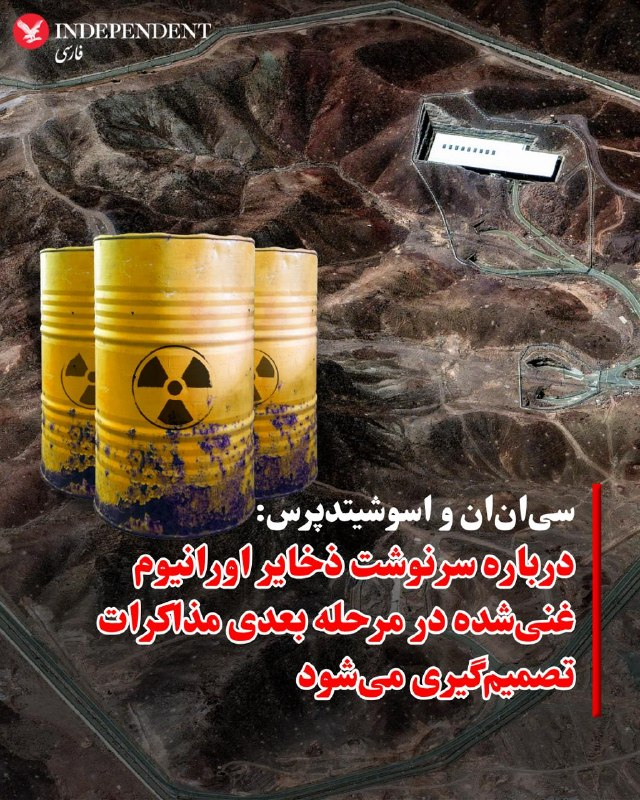

♦️درحالی که دونالد ترامپ، رئیس‌جمهوری آمریکا همواره بر خارج کردن ذخایر اورانیوم غنی‌شده از ایران تاکید داشته است، در روایت سی‌ان‌ان از چارچوب توافق احتمالی با تهران آمده است که درباره چگونگی نابودی ذخایر اورانیوم غنی‌شده ایران در مرحله بعدی مذاکرات تصمیم‌گیری می‌شود. براساس این گزارش، در صورت توافق، بازه زمانی ۶۰ روزه برای به تفاهم رسیدن درباره جزئیات باقی مانده در نظر گرفته شده است. یکی از مقامات که مستقیما در جریان مذاکرات قرار دارد نیز به اسوشیتدپرس گفت: نحوه واگذاری اورانیوم از سوی ایران، در طول یک دوره ۶۰ روزه به مذاکرات بیشتر موکول خواهد شد. به گفته او، احتمالا بخشی از این مواد رقیق خواهد شد و بقیه به کشور ثالث منتقل می‌شود. روسیه پیشنهاد داده است این مواد را تحویل بگیرد.
بر اساس گزارش آژانس بین‌المللی انرژی اتمی، ایران ۴۴۰.۹ کیلوگرم اورانیوم با غنای تا ۶۰ درصد در اختیار دارد؛ سطحی که از نظر فنی تنها یک گام کوتاه تا غنای ۹۰ درصدی مورد نیاز برای ساخت سلاح هسته‌ای فاصله دارد.
‌🇸🇦 Indypersian

🤖 @VahidOOnLine

## VahidOOnLine — post 242065

  <a href="telegram/content/VahidOOnLine_242065_1779685788.mp4" target="_blank">🎬 Download video</a>

♦️به گزارش فاکس نیوز، مراسم فارغ‌التحصیلی دبیرستان سنتنیال در شهر فرانکلین ایالت تنسی با وجود بارش شدید باران و وقوع صاعقه، در فضای باز برگزار شد و موجی از انتقاد خانواده‌ها را به‌دنبال داشت.

مسئولان مدرسه با اجرای سیاست «باران یا آفتاب» تصمیم گرفتند برنامه از پیش تعیین‌شده را تغییر ندهند؛ با وجود آنکه از قبل از وضعیت آب‌وهوا اطلاع داشتند و حتی برای بارندگی برنامه جایگزین نیز در نظر گرفته بودند.

بر اساس گزارش‌ها، مسئولان امیدوار بودند مراسم پیش از آغاز بارندگی به پایان برسد و به همین دلیل آن را به سالن سرپوشیده منتقل نکردند. نگرانی درباره جا نشدن همه حاضران در سالن ورزشی نیز یکی از دلایل ادامه مراسم در فضای باز عنوان شده است.
‌🇸🇦 Indypersian

🤖 @VahidOOnLine

## VahidOOnLine — post 242064

♦️مارکو روبیو، وزیر خارجه آمریکا، روز دوشنبه در جریان سفر به هند گفت مذاکرات میان آمریکا و رژیم ایران «هنوز در حال پیشرفت و شکل‌گیری» است.
روبیو پیش از ترک دهلی‌نو برای بازدید از تاج‌محل در شهر آگرا، به خبرنگاران گفت: «فکر می‌کردیم شاید دیشب خبرهایی داشته باشیم. خیلی نباید در این مورد برداشت خاصی کرد. دریافت پاسخ کمی زمان می‌برد.»
او گفت درباره توانایی ایران برای باز نگه داشتن تنگه هرمز و ورود به «مذاکراتی واقعی، مهم و محدود از نظر زمانی درباره مسائل هسته‌ای»، «پیشنهاد نسبتا محکمی روی میز» قرار دارد. روبیو افزود که توافق احتمالی از حمایت گسترده کشورهای خلیج فارس و همچنین حمایت جهانی برخوردار است.
وزیر خارجه آمریکا همچنین تاکید کرد که دونالد ترامپ، رئیس‌جمهوری آمریکا، «عجله‌ای ندارد» و «قرار نیست توافق بدی امضا کند.»
روبیو گفت: «یا به یک توافق خوب می‌رسیم یا باید از راه دیگری با این مسئله برخورد کنیم.»
او در پاسخ به این پرسش که آیا لبنان بخشی از توافق خواهد بود یا نه، گفت گفت‌وگوها با اسرائیل و لبنان همچنان ادامه دارد.
‌🇸🇦 Indypersian

🤖 @VahidOOnLine

## VahidOOnLine — post 242063

  

روزنامه نیویورک‌پست به نقل از «یک مقام ارشد دولت آمریکا» نوشت که نهایی شدن توافق صلح با حکومت ایران برای بازگشایی تنگه هرمز ممکن است تا یک هفته طول بکشد، اما اگر تهران به شرایط دونالد ترامپ متعهد نشود، ممکن است رییس‌جمهوری ایالات متحده، از آن خارج شود.

یک مقام ارشد آمریکا گفت پس از آن‌که ترامپ اعلام کرد مذاکرات بر سر جنگ و برنامه هسته‌ای تهران در مرحله نهایی خود قرار دارد، وضعیت حکومت ایران باعث شده است که روند نهایی به کندی پیش برود.

این منبع اشاره کرد که ممکن است چند روز طول بکشد تا توافق نهایی به دست مجتبی خامنه‌ای، رهبر جمهوری اسلامی، برسد.

در همین ارتباط، شماری از رسانه‌ها گزارش داده‌اند که او درمکانی نامعلوم مخفی شده و امکان دسترسی به او برای مقام‌‌های حکومت ایران دشوار است.

به نوشته نیویورک‌پست، مقام ارشد آمریکایی گفت بازگشایی واقعی تنگه هرمز و پایان محاصره بنادر ایران توسط آمریکا حدود هفت روز طول خواهد کشید و ایالات متحده تنها زمانی تحریم‌ها را لغو خواهد کرد که ایران اورانیوم غنی‌شده خود را تحویل دهد.
‌🏁 🇬🇧 IranintlTV

🤖 @VahidOOnLine

## VahidOOnLine — post 242062

  

♦️مقام‌های اسرائیلی هشدار داده‌اند که توافق در حال شکل‌گیری میان رژیم ایران و ایالات متحده «توافقی بد» است، زیرا تهدیدهای اصلی جمهوری اسلامی فراتر از برنامه هسته‌ای را نادیده می‌گیرد.
یکی از این مقام‌ها به اورشلیم پست گفت: «توافق چارچوبی خوب نیست و حتی اگر توافق نهایی امضا شود و همه اورانیوم غنی‌شده از ایران خارج شود ــ که خود محل تردید جدی است ــ این توافق به برنامه موشکی ایران یا شبکه نیروهای نیابتی منطقه‌ای آن نمی‌پردازد.»
مقام‌های اسرائیلی همچنین نگران‌اند که این توافق آزادی عمل اسرائیل در لبنان را محدود کند و احتمالا توانایی این کشور برای اقدام علیه تهدیدهای جمهوری اسلامی در سراسر منطقه را کاهش دهد.
یک مقام اسرائیلی دیگر نیز گفت: «هنوز هیچ چیز نهایی نشده، اما این توافق می‌تواند بر اینکه آیا و چگونه قادر به اقدام خواهیم بود، تاثیر بگذارد.»
ارزیابی اسرائیل این است که دونالد ترامپ، رئیس‌جمهوری آمریکا، در حال حاضر خواهان دستیابی به توافق با ایران است و تنها فردی که ممکن است در نهایت مانع آن شود، مجتبی خامنه‌ای، رهبر جمهوری اسلامی، است.
یک مقام اسرائیلی گفت: «در نهایت، تصمیم به او بستگی دارد. همان‌طور که پدرش در آخرین لحظه در سال ۲۰۲۲ توافق جدید هسته‌ای را رد کرد، ممکن است او نیز همان مسیر را در پیش بگیرد.»
براساس این گزارش، فرض اصلی نهادهای امنیتی اسرائیل این است که حکومت کنونی ایران هرگز به‌طور کامل از برنامه هسته‌ای خود دست نخواهد کشید. به باور مقام‌های اسرائیلی، تهران به‌دنبال توافق‌هایی است که بتواند از آن‌ها برای خرید زمان و به تعویق انداختن رویارویی‌هایی استفاده کند که ممکن است توانایی‌هایش را تضعیف کند.
به گفته کارشناسان، اگر ایران با واگذاری ۴۶۰ کیلوگرم اورانیوم ۶۰ درصد غنی‌شده موافقت کند، انتقال این مواد به طرف ثالثی مانند آمریکا یا روسیه بخش ساده‌تر ماجرا خواهد بود. چالش بزرگ‌تر، ایجاد سازوکاری قابل اعتماد برای بازرسی و نظارت بر تاسیسات هسته‌ای ایران، به‌ویژه در زمینه بازسازی یا تولید سانتریفیوژها، خواهد بود.
همچنین هنوز مشخص نیست که با زیرساخت‌های هسته‌ای که در حملات ارتش اسرائیل و ارتش آمریکا آسیب جدی دیده‌اند چه خواهد شد.
در اسرائیل، هر توافقی که به ایران اجازه دهد زیرساخت هسته‌ای خود را تحت عنوان «پروژه غیرنظامی» حفظ کند، شکست این کارزار تلقی خواهد شد.
علاوه بر این، مقام‌های دفاعی به وب‌سایت «والا» تایید کردند که یکی از نقاط اختلاف در توافق، درخواست حکومت تهران برای گنجاندن حزب‌الله در توافق آتش‌بس و جلوگیری از ادامه عملیات نظامی اسرائیل است.
‌🇸🇦 Indypersian

🤖 @VahidOOnLine

## VahidOOnLine — post 242061

  

♦️قوه قضائیه جمهوری اسلامی روز دوشنبه چهارم خرداد اعلام کرد عباس اکبری فیض‌‌آبادی به‌اتهام «به اتهام محاربه، تخریب عمدی اموال عمومی به قصد مقابله با نظام مقدس جمهوری اسلامی ایران و اخلال در نظم و امنیت جامعه، اجتماع و تبانی برای ارتکاب جرم علیه امنیت داخلی کشور» محاکمه و اعدام شد.

میزان، خبرگزاری قوه قضائیه با اعلام این خبر نوشت: متهم «نقش مهمی در حمله به فرمانداری شهرستان و مراکز تامین امنیت و همچنین مراکز خدماتی» شهرستان نائین استان اصفهان داشت.

جمهوری اسلامی از زمان آغاز جنگ در اسفندماه سال گذشته دست‌کم ۲۵ نفر را به اتهام‌های سیاسی و امنیتی اعدام کرده است.
‌🇸🇦 Indypersian

🤖 @VahidOOnLine

## VahidOOnLine — post 242060

  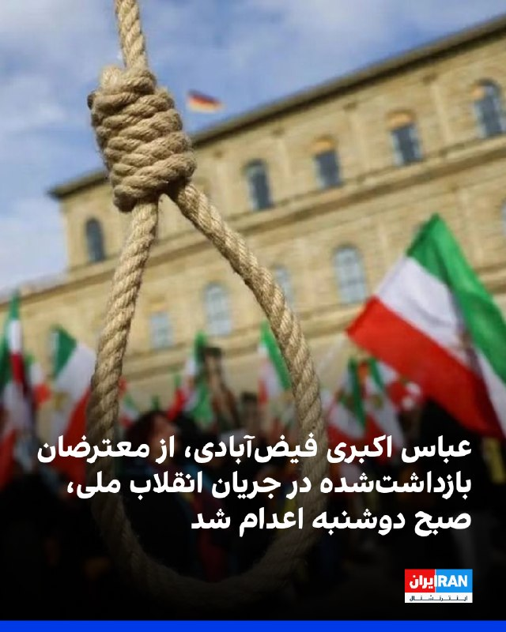

حکم اعدام عباس اکبری فیض‌آبادی، از بازداشت‌شدگان دی‌ماه در شهرستان نائین اصفهان، صبح دوشنبه، چهارم خرداد پس از تایید دیوان عالی کشور اجرا شد.

بر اساس گزارش خبرگزاری میزان، وابسته به قوه قضاییه جمهوری اسلامی، عباس اکبری فیض‌آبادی، فرزند علی، با اتهام‌هایی از جمله «محاربه»، «تخریب عمدی اموال عمومی به قصد مقابله با نظام جمهوری اسلامی»، «اخلال در نظم و امنیت جامعه» و «اجتماع و تبانی برای ارتکاب جرم علیه امنیت داخلی کشور» محاکمه شده بود.

در این گزارش آمده است که دادگاه پس از برگزاری جلسات رسیدگی و دریافت دفاعیات متهم و وکیل او، با استناد به آنچه «اقاریر متهم» درباره همراه داشتن کلت کمری جنگی، حضور در خیابان و تیراندازی عنوان شده، اتهام محاربه را محرز دانست.

قوه قضاییه همچنین اعلام کرد فیلمی از لحظه تیراندازی و گزارش مرجع انتظامی درباره کشف سلاح از منزل متهم، از جمله مستندات پرونده بوده است.

بر اساس این گزارش حکم اعدام عباس اکبری فیض‌آبادی در دیوان عالی کشور تایید و اعلام شد حکم صادرشده بر پایه مدارک، مستندات و اظهارات متهم بوده و ایرادی به آن وارد نیست.
‌🏁 🇬🇧 IranintlTV

🤖 @VahidOOnLine

## VahidOOnLine — post 242059

  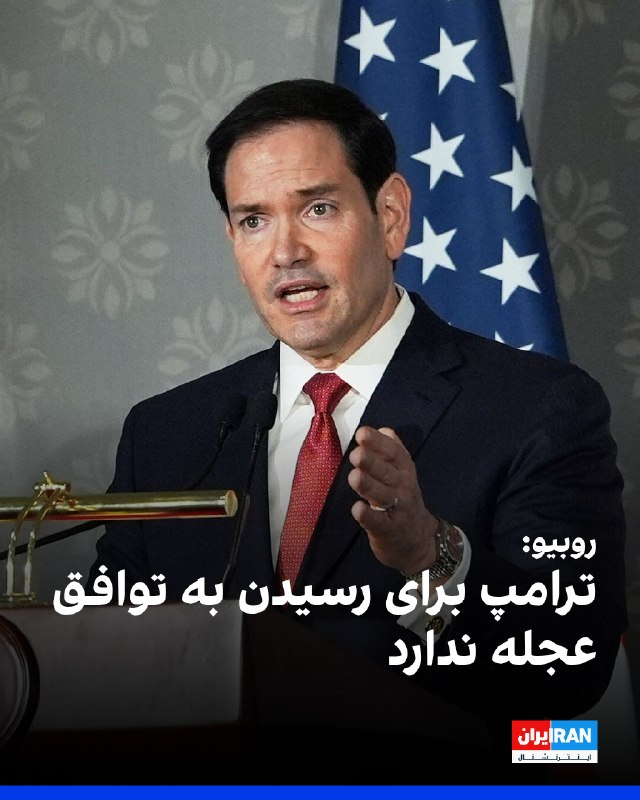

مارکو روبیو، وزیر خارجه ایالات متحده، صبح دوشنبه چهارم خرداد اعلام کرد که توافق آمریکا و حکومت ایران «همچنان پیش می‌رود.»

به‌گزارش خبرگزاری رویترز، او افزود که در مورد «توانایی ایران برای باز کردن» تنگه هرمز و «ورود به مذاکراتی واقعی، مهم و محدود از نظر زمانی درباره مسائل هسته‌ای»، پیشنهادی «نسبتا محکم» روی میز است.

روبیو اضافه کرد: «امیدواریم که بتوانیم آن را عملی کنیم. این طرح در خلیج فارس حمایت زیادی دارد. در سطح جهانی نیز از حمایت زیادی برخوردار است.»

او گفت که هر کشوری درک می‌کند که «این نه تنها بسیار منطقی است، بلکه کار درستی است که جهان باید انجام دهد.»

روبیو که در جریان سفر به هند با خبرنگاران گفت‌وگو می‌کرد، افزود که ترامپ عجله‌ای برای رسیدن به توافق ندارد.

او تاکید کرد: «قرار نیست که رییس‌جمهور توافق بدی انجام دهد. بنابراین بیایید ببینیم چه اتفاقی می‌افتد. ما قبل از بررسی گزینه‌ها، به دیپلماسی، فرصت موفقیت را می‌دهیم.»
‌🏁 🇬🇧 IranintlTV

🤖 @VahidOOnLine

## VahidOOnLine — post 242058

  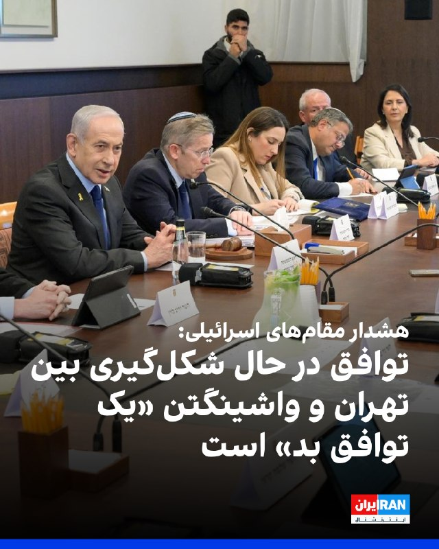

مقام‌های اسرائیلی هشدار دادند که توافق در حال شکل‌گیری بین حکومت ایران و ایالات متحده «یک توافق بد» است و می‌گویند که این توافق به تهدیدات کلیدی تهران فراتر از برنامه هسته‌ای‌اش نمی‌پردازد.

یک مقام اسرائیلی به روزنامه اورشلیم‌پست گفت: «چارچوب توافق خوب نیست و حتی اگر توافق نهایی امضا شود و تمام اورانیوم غنی‌شده از ایران خارج شود، که یک «اگر» بزرگ است، این توافق به موضوع برنامه موشکی ایران یا شبکه نیروهای نیابتی منطقه‌ای آن نمی‌پردازد.»

بر اساس این گزارش، مقام‌ها در اورشلیم همچنین نگرانند که این توافق بتواند آزادی عمل اسرائیل در لبنان را محدود کند و به‌طور بالقوه، توانایی آن را برای اقدام علیه تهدیدهای تهران در سراسر منطقه محدود کند.

یک مقام اسرائیلی به اورشلیم‌پست گفت: «هنوز هیچ چیز نهایی نیست، اما این توافقی است که می‌تواند بر توانایی و نحوه عملکرد ما تأثیر بگذارد.»

این گزارش حاکی از آن است که بنیامین نتانیاهو، نخست وزیر اسرائیل، عصر یکشنبه گروه کوچکی از وزرا و مقامات ارشد امنیتی را برای بحث در مورد توافق در حال شکل‌گیری تشکیل داد.
‌🏁 🇬🇧 IranintlTV

🤖 @VahidOOnLine

## VahidOOnLine — post 242057

♦️حسین انتظامی، سخنگوی سابق دبیرخانه شورای عالی امنیت ملی، در گفتگو با فارس، خبرگزاری وابسته به سپاه، درباره آخرین اقدام علی لاریجانی پیش از مرگ گفت: «کار بزرگی که او انجام داد این بود که درست ۲۴ ساعت قبل از مرگ، طرح صلح را در شورای عالی امنیت ملی به تصویب رساند. چهارچوبی که مسیر مذاکرات شامل آتش‌بس و صلح را به امضای تک‌تک اعضای این شورا رساند و برای رهبری فرستاد». علی لاریجانی بامداد ۲۶ اسفند ۱۴۰۴ در جریان حملات هوایی اسرائیل به تهران، به همراه فرزندش مرتضی و رئیس دفترش کشته شد.
‌🇸🇦 Indypersian

🤖 @VahidOOnLine

## VahidOOnLine — post 242056

♦️مارکو روبیو، وزیر خارجه آمریکا، روز یکشنبه در جریان سفر به هند، در مراسمی غافلگیرکننده در دهلی‌نو جشن تولد ۵۵ سالگی‌اش را برگزار کرد؛ مراسمی که با اجرای گروه موسیقی «ویلیج پیپل» همراه بود.

این مراسم در محوطه «بهارات ماندپام» و همزمان با جشن دویست‌وپنجاهمین سال استقلال آمریکا برگزار شد. سرجیو گور، سفیر آمریکا در هند، روبیو را به روی صحنه دعوت کرد و همزمان صفحه‌نمایشی بزرگ با پیام «تولدت مبارک مارکو روبیو» روشن شد.

در ادامه، یک کیک چهارطبقه برای وزیر خارجه آمریکا آورده شد و گروه «ویلیج پیپل» ترانه «تولدت مبارک» را برای او اجرا کرد. این گروه سپس اجرای خود را با ترانه مشهور «وای‌ام‌سی‌ای» ادامه داد.

سوبرامانیام جایشانکا، وزیر خارجه هند، و شماری دیگر از مقام‌های آمریکایی و هندی نیز در این مراسم حضور داشتند.

ترانه «وای‌ام‌سی‌ای» که از مشهورترین آثار موسیقی دیسکو به شمار می‌رود، در سال‌های اخیر بارها در مراسم و گردهمایی‌های دونالد ترامپ نیز پخش شده است.
‌🇸🇦 Indypersian

🤖 @VahidOOnLine

## VahidOOnLine — post 242055

  

شبکه خبری سی‌ان‌ان گزارش داد در چارچوب پیش‌نویس نوافق‌نامه آمریکا و حکومت ایران، ۶۰ روز برای نهایی‌کردن این توافق، فرصت داده شده و کاهش تحریم‌ها نیز به واگذاری ذخایر اورانیوم با غنای بالا از سوی تهران مشروط شده است.

یک مقام ارشد دولت دونالد ترامپ در گفت‌وگو با سی‌ان‌ان تاکید کرد: «بدون تحویل گردو غبار [اورانیوم]، پولی در کار نخواهد بود.»
‌🏁 🇬🇧 IranintlTV

🤖 @VahidOOnLine

## VahidOOnLine — post 242054

  

روزنامه دنیای اقتصاد گزارش داد: «بر اساس پیش‌بینی‌ها، درآمد‌های مالیاتی با عدم تحقق ۲۵ درصدی در بودجه سال جاری مواجه خواهد شد.»

این روزنامه اشاره کرد که این کاهش درآمد‌ها می‌تواند کسری بودجه را تشدید کند و افزود اقتصاد ایران در سال ۱۴۰۵ با مجموعه‌ای از نااطمینانی‌ها و فشار‌های همزمان مواجه شده است.

دنیای اقتصاد به «اختلال‌های گسترده اینترنت، کاهش دسترسی بسیاری از کسب‌وکار‌ها به بازار، افت فروش در بخش خدمات و تجارت آن‌لاین، افزایش هزینه‌های تولید، کاهش قدرت خرید خانوار‌ها و نگرانی‌های ناشی از تشدید تنش‌های منطقه‌ای» اشاره کرد؛ عواملی که بسیاری از بنگاه‌ها را در وضعیت نیمه‌تعطیل یا رکودی قرار داده‌اند.

بر اساس این گزارش، علی افضلی، مدیرکل دفتر سیاستگذاری بخش عمومی وزارت اقتصاد، در همایش «چشم‌انداز اقتصاد ایران ۱۴۰۵» گفته است احتمال دارد «حدود ۲۵ درصد از درآمد‌های مالیاتی امسال وصول نشود.»

دنیای اقتصاد نوشت اگر یک‌چهارم درآمد‌های مالیاتی محقق نشود، دولت یا باید هزینه‌ها را کاهش دهد، یا به سمت استقراض و چاپ پول برود، یا فشار مالیاتی بیشتری بر مؤدیان وارد کند؛ مسیرهایی که هر سه تبعات اقتصادی آسیب‌زا دارند.
ht
‌🏁 🇬🇧 IranintlTV

🤖 @VahidOOnLine

## VahidOOnLine — post 242053

  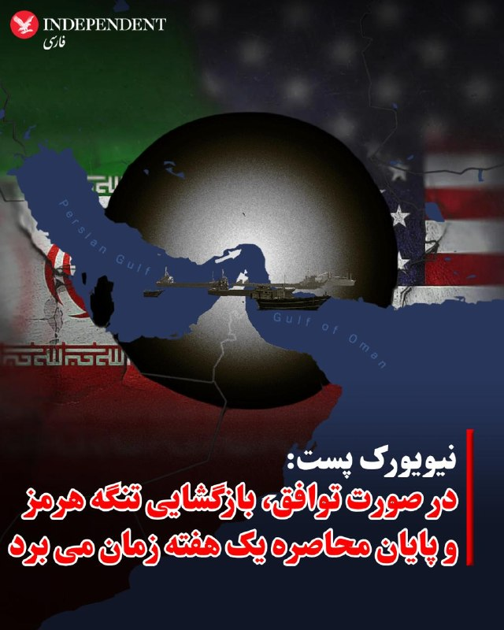

♦️یک مقام ارشد دولت آمریکا روز یکشنبه به نیویورک پست گفت ممکن است نهایی شدن توافق تا یک هفته طول بکشد، اما دونالد ترامپ ممکن است در صورت نپذیرفتن شرایطش از سوی تهران، از این روند خارج شود.
یک‌مقام ارشد به این. روزنامه آمریکایی گفت، وضعیت حکومت تهران باعث شده روند نهایی شدن توافق کند پیش برود.
این منبع اعلام کرد ممکن است چند روز طول بکشد تا متن نهایی توافق به دست رهبر جمهوری اسلامی، مجتبی خامنه‌ای، برسد که از زمان آغاز جنگ در مخفیگاه به سر می‌برد و گفته می‌شود زخمی است.
او افزود، بازگشایی واقعی تنگه هرمز و پایان محاصره آمریکا علیه بنادر ایران حدود هفت روز زمان خواهد برد و آمریکا تنها زمانی تحریم‌ها را لغو می‌کند که ایران اورانیوم غنی‌شده خود را تحویل بدهد.
با وجود این نگاه مثبت، ترامپ گفته است عجله‌ای برای رسیدن به توافق ندارد و مذاکرات را تا زمان تعیین شرایط ایده‌آل ادامه خواهد داد.
‌🇸🇦 Indypersian

🤖 @VahidOOnLine

## VahidOOnLine — post 242052

  

نشریه اکونومیست گزارش داد که ریاض از دونالد ترامپ خواسته است هرگونه حمله جدید به ایران را تا پس از مراسم سالانه حج به تعویق بیندازد.

به نوشته اکونومیست، این نگرانی وجود دارد که اگر درگیری دوباره آغاز و حریم هوایی منطقه بسته شود، زائران در عربستان سعودی گیر بیفتند.
‌🏁 🇬🇧 IranintlTV

🤖 @VahidOOnLine

## VahidOOnLine — post 242051

  

داده‌های کشتیرانی نشان می‌دهد که یک نفتکش گاز طبیعی مایع دوشنبه از تنگه هرمز به سمت پاکستان در حرکت بود، در حالی که یک ابر

این کشتی‌ها جزو معدود ابرنفتکش‌هایی هستند که این ماه از طریق مسیری ترانزیتی که ایران به کشتی‌ها دستور استفاده از آن را داده است، از خلیج فارس خارج می‌شوند.

هفته گذشته، سه نفتکش بسیار بزرگ با ۶ میلیون بشکه نفت خام به چین و کره جنوبی رفتند. داده‌های کشتیرانی ال‌اس‌ای‌جی و کپلر نشان داد که نفتکش حامل گاز مایع فویریت دوشنبه از تنگه هرمز عبور می‌کند و انتظار می‌رود سه‌شنبه محموله خود را در پاکستان تخلیه کند.

این کشتی که با پرچم باهاما حرکت می‌کرد، حدود ۲۸ مارس، هشتم فروردین، در بندر راس‌لفان قطر گاز مایع بارگیری کرد.

شرکت کشتیرانی میتسویی او. اس. کی. لاینز ژاپن که مالک کشتی فویریت است، برای اظهار نظر در خارج از ساعات اداری در دسترس نبود.
‌🏁 🇬🇧 IranintlTV

🤖 @VahidOOnLine

## VahidOOnLine — post 242050

  

روزنامه اسرائیلی هاآرتص خبر داد که شهرداران و روسای شوراهای محلی مناطق مرزی اسرائیل و لبنان، هشدار داده‌اند که توافق احتمالی آمریکا با حکومت ایران در صورت باقی ماندن حزب‌الله «ضربه‌ای مرگبار» خواهد بود.

به نوشته هاآرتص، این رهبران جوامع مرزی در شمال اسرائیل، دولت بنیامین نتانیاهو را متهم کردند که تاکنون آن‌ها را از روند شکل‌گیری این توافق یا پیامدهای امنیتی احتمالی آن در شمال کشور، مطلع نکرده است.
‌🏁 🇬🇧 IranintlTV

🤖 @VahidOOnLine

## VahidOOnLine — post 242049

  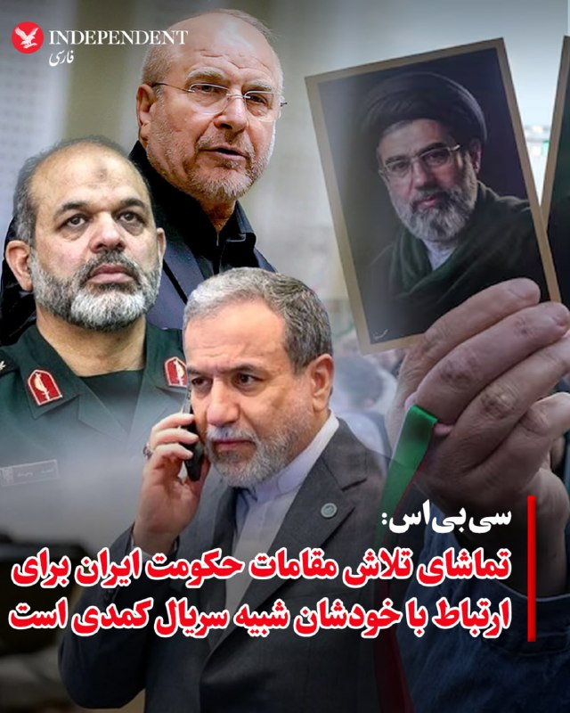

♦️سی‌بی‌اس به نقل از مقامات آمریکایی و منابع مطلع با اشاره به دشواری ارتباط مقامات جمهوری اسلامی با یکدیگر باتوجه به اینکه همه مقامات ارشد در پناهگاه زیرزمینی به‌سر می‌برند نوشت: «تماشای تلاش آنها برای ارتباط گرفتن با هم شبیه یک سریال کمدی است. کاملا کلافه شده است.» در این گزارش آمده است که مقامات جمهوری اسلامی در پناهگاه‌های مستحکم به‌سر می‌برند و برای هفته‌ها زیر زمین می‌مانند و فقط در موارد اضطراری با هم تماس دارند. سی‌بی‌اس می‌افزاید: مقامات جمهوری اسلامی در داخل ساختار حکومتی خودشان هم برای هماهنگی با مشکل جدی رو‌به‌رو هستند. این درحالی است که به سومین رهبر جمهوری اسلامی هم دسترسی بسیار محدودی وجود دارد و حتی بسیاری از مقامات بلندپایه حکومت هم نمی‌دانند او کجاست. از سوی دیگر پیام‌ها از طریق «قاصدها» به او منتقل می‌شود و همین موضوع روند انتقال پیام و تصمیم‌گیری را طولانی‌تر کرده است.
‌🇸🇦 Indypersian

🤖 @VahidOOnLine

## VahidOOnLine — post 242048

  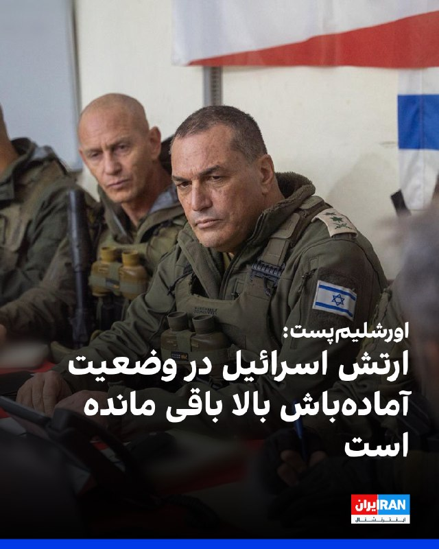

روزنامه اورشلیم‌پست گزارش داد در حالی که اخبار حاکی از ادامه مذاکرات میان آمریکا و حکومت ایران است، ارتش اسرائیل در وضعیت «آماده‌باش بالا» باقی مانده است.

بر اساس این گزارش، ارتش اسرائیل در صورت شکست گفت‌وگوها، احتمال ازسرگیری درگیری‌ها را در نظر خواهد گرفت.
‌🏁 🇬🇧 IranintlTV

🤖 @VahidOOnLine

## VahidOOnLine — post 242047

  

روزنامه اورشلیم‌پست گزارش داد در حالی که اخبار حاکی از ادامه مذاکرات میان آمریکا و حکومت ایران است، ارتش اسرائیل در وضعیت «آماده‌باش بالا» باقی مانده است.

بر اساس این گزارش، ارتش اسرائیل در صورت شکست گفت‌وگوها، احتمال ازسرگیری درگیری‌ها را در نظر خواهد گرفت.
‌🏁 🇬🇧 IranintlTV

🤖 @VahidOOnLine

## FoxNewsTwitter — post 342192

Fox News (Twitter/X)

An emotional night for NASCAR.

For the first time since Kyle Busch's death, his wife Samantha and son Brexton appeared publicly for a powerful remembrance of the late driver's life.

Then, on lap 8, the crowd stood as one — cheering, crying, and saluting the legacy "Rowdy" left behind.

The message was clear: Kyle Busch's impact on NASCAR will never be forgotten.

## FoxNewsTwitter — post 342191

  <a href="telegram/content/FoxNewsTwitter_342191_1779685804.mp4" target="_blank">🎬 Download video</a>

Fox News (Twitter/X)

A graduation ceremony in Franklin, Tennessee turned into a soaking wet controversy after officials decided to keep the event outdoors during a torrential downpour.

Footage from the ceremony shows graduates crossing the stage in heavy rain while families sat drenched in the stands as the storm moved through the area.

Now some parents are demanding answers, saying students deserved better and arguing the conditions became unsafe.

## pm_afshaa — post 91426

🔴یک مقام آمریکایی به شبکه «فاکس‌نیوز» گفت دونالد ترامپ، رئیس‌جمهوری آمریکا ممکن است به ایران هفت روز مهلت دهد تا به یک توافق «قابل‌قبول» برسن

💧 Rainbet.com the #1 Non-KYC Crypto Casino & Sportsbook @rainbetcom

😁 @Pm_Afshaa

## pm_afshaa — post 91425

  <a href="telegram/content/pm_afshaa_91425_1779685807.webm" target="_blank">🎬 Download video</a>

🔴قلهکی، فعال رسانه‌ای اصولگرا: دلیل اینکه تفاهم اسلام آباد هنوز امضا نشده اینه که نتانیاهو زنگ زده به ترامپ و پُرش کرده، آمريکا هم زده زیرش و گفته تا قبل اینکه 400 کیلو اورانیوم رو تحویل ندید، خبری از پول‌های بلوکه شده نیست! 
💧 Rainbet.com the #1 Non-KYC…

## mamlekate — post 103578

📝 سلام ساعت ۳ بامداد تاریخ ۴خرداد. قشم سوزا هستیم به فاصله ده دقیقه دوبار طوری زدن که تموم خونه لرزید نمیدونم کجا بود فکر کنم شروع شد دوباره

📝 جنوب از ساعت ۱۲ شب تا الان درگیری و سروصداست تا الان. من جزیره هنگامم.

@mamlekate

## IranIntlTV — post 338858

  <a href="telegram/content/IranIntlTV_338858_1779685808.mp4" target="_blank">🎬 Download video</a>

شبکه خبری سی‌بی‌اس در گزارشی نوشت مجتبی خامنه‌ای «عملا در مکانی نامعلوم با دسترسی محدود به دنیای خارج پنهان شده است» و مقام‌های حکومتی «تنها از طریق شبکه‌ای پیچیده از پیک‌ها و واسطه‌ها» با او در ارتباط هستند.

گفت‌وگو با کامیار بهرنگ، عضو تحریریه ایران‌اینترنشنال
@iranintltv

## IranIntlTV — post 338857

  <a href="telegram/content/IranIntlTV_338857_1779685811.mp4" target="_blank">🎬 Download video</a>

یک منبع آگاه به ایران‌اینترنشنال گفت مذاکره‌کنندگان جمهوری اسلامی آزادسازی فوری ۱۲ میلیارد دلار از دارایی‌های مسدودشده ایران در قطر را پیش‌شرط پیشبرد مذاکرات با ایالات متحده اعلام کردند.

گفت‌وگو با امیر گیتی، خبرنگار ایران‌اینترنشنال
@iranintltv

## IranIntlTV — post 338856

  <a href="telegram/content/IranIntlTV_338856_1779685813.mp4" target="_blank">🎬 Download video</a>

هم‌زمان با ادامه تجمع‌های اعتراضی ایرانیان در اروپا، گروهی از معترضان، یکشنبه مقابل سفارت جمهوری اسلامی در استکهلم تجمع کردند.

مهران عباسیان، خبرنگار ایران‌اینترنشنال، گزارش می‌دهد
@iranintltv

## IranIntlTV — post 338855

  

روزنامه نیویورک‌پست به نقل از «یک مقام ارشد دولت آمریکا» نوشت که نهایی شدن توافق صلح با حکومت ایران برای بازگشایی تنگه هرمز ممکن است تا یک هفته طول بکشد، اما اگر تهران به شرایط دونالد ترامپ متعهد نشود، ممکن است رییس‌جمهوری ایالات متحده، از آن خارج شود.

یک مقام ارشد آمریکا گفت پس از آن‌که ترامپ اعلام کرد مذاکرات بر سر جنگ و برنامه هسته‌ای تهران در مرحله نهایی خود قرار دارد، وضعیت حکومت ایران باعث شده است که روند نهایی به کندی پیش برود.

این منبع اشاره کرد که ممکن است چند روز طول بکشد تا توافق نهایی به دست مجتبی خامنه‌ای، رهبر جمهوری اسلامی، برسد.

در همین ارتباط، شماری از رسانه‌ها گزارش داده‌اند که او درمکانی نامعلوم مخفی شده و امکان دسترسی به او برای مقام‌‌های حکومت ایران دشوار است.

به نوشته نیویورک‌پست، مقام ارشد آمریکایی گفت بازگشایی واقعی تنگه هرمز و پایان محاصره بنادر ایران توسط آمریکا حدود هفت روز طول خواهد کشید و ایالات متحده تنها زمانی تحریم‌ها را لغو خواهد کرد که ایران اورانیوم غنی‌شده خود را تحویل دهد.
https://iranintl.com/202605246577

## IranIntlTV — post 338854

  <a href="telegram/content/IranIntlTV_338854_1779685816.mp4" target="_blank">🎬 Download video</a>

سرخط خبرهای دوشنبه ۴ خرداد
@iranintltv

## IranIntlTV — post 338853

  

حکم اعدام عباس اکبری فیض‌آبادی، از بازداشت‌شدگان دی‌ماه در شهرستان نائین اصفهان، صبح دوشنبه، چهارم خرداد پس از تایید دیوان عالی کشور اجرا شد.

بر اساس گزارش خبرگزاری میزان، وابسته به قوه قضاییه جمهوری اسلامی، عباس اکبری فیض‌آبادی، فرزند علی، با اتهام‌هایی از جمله «محاربه»، «تخریب عمدی اموال عمومی به قصد مقابله با نظام جمهوری اسلامی»، «اخلال در نظم و امنیت جامعه» و «اجتماع و تبانی برای ارتکاب جرم علیه امنیت داخلی کشور» محاکمه شده بود.

در این گزارش آمده است که دادگاه پس از برگزاری جلسات رسیدگی و دریافت دفاعیات متهم و وکیل او، با استناد به آنچه «اقاریر متهم» درباره همراه داشتن کلت کمری جنگی، حضور در خیابان و تیراندازی عنوان شده، اتهام محاربه را محرز دانست.

قوه قضاییه همچنین اعلام کرد فیلمی از لحظه تیراندازی و گزارش مرجع انتظامی درباره کشف سلاح از منزل متهم، از جمله مستندات پرونده بوده است.

بر اساس این گزارش حکم اعدام عباس اکبری فیض‌آبادی در دیوان عالی کشور تایید و اعلام شد حکم صادرشده بر پایه مدارک، مستندات و اظهارات متهم بوده و ایرادی به آن وارد نیست.
https://iranintl.com/202605255098

## IranIntlTV — post 338852

  <a href="telegram/content/IranIntlTV_338852_1779685818.mp4" target="_blank">🎬 Download video</a>

جاویدنامان انقلاب ملی ایرانیان
«کیان پورصفر دلشاد» در ۱۹ دی‌ماه در بندرانزلی بر اثر اصابت گلوله نیروهای سرکوب جمهوری اسلامی به شدت مجروح شد و پس از ۱۲ روز بستری، در اول بهمن‌ماه ۱۴۰۴ جان خود را از دست داد. نامش در حافظه‌ی این سرزمین می‌ماند و یادش چراغ راه آزادی‌خواهان است.
@iranintltv

## IranIntlTV — post 338851

  

مارکو روبیو، وزیر خارجه ایالات متحده، صبح دوشنبه چهارم خرداد اعلام کرد که توافق آمریکا و حکومت ایران «همچنان پیش می‌رود.»

به‌گزارش خبرگزاری رویترز، او افزود که در مورد «توانایی ایران برای باز کردن» تنگه هرمز و «ورود به مذاکراتی واقعی، مهم و محدود از نظر زمانی درباره مسائل هسته‌ای»، پیشنهادی «نسبتا محکم» روی میز است.

روبیو اضافه کرد: «امیدواریم که بتوانیم آن را عملی کنیم. این طرح در خلیج فارس حمایت زیادی دارد. در سطح جهانی نیز از حمایت زیادی برخوردار است.»

او گفت که هر کشوری درک می‌کند که «این نه تنها بسیار منطقی است، بلکه کار درستی است که جهان باید انجام دهد.»

روبیو که در جریان سفر به هند با خبرنگاران گفت‌وگو می‌کرد، افزود که ترامپ عجله‌ای برای رسیدن به توافق ندارد.

او تاکید کرد: «قرار نیست که رییس‌جمهور توافق بدی انجام دهد. بنابراین بیایید ببینیم چه اتفاقی می‌افتد. ما قبل از بررسی گزینه‌ها، به دیپلماسی، فرصت موفقیت را می‌دهیم.»
https://iranintl.com/202605252808

## IranIntlTV — post 338850

  

مقام‌های اسرائیلی هشدار دادند که توافق در حال شکل‌گیری بین حکومت ایران و ایالات متحده «یک توافق بد» است و می‌گویند که این توافق به تهدیدات کلیدی تهران فراتر از برنامه هسته‌ای‌اش نمی‌پردازد.

یک مقام اسرائیلی به روزنامه اورشلیم‌پست گفت: «چارچوب توافق خوب نیست و حتی اگر توافق نهایی امضا شود و تمام اورانیوم غنی‌شده از ایران خارج شود، که یک «اگر» بزرگ است، این توافق به موضوع برنامه موشکی ایران یا شبکه نیروهای نیابتی منطقه‌ای آن نمی‌پردازد.»

بر اساس این گزارش، مقام‌ها در اورشلیم همچنین نگرانند که این توافق بتواند آزادی عمل اسرائیل در لبنان را محدود کند و به‌طور بالقوه، توانایی آن را برای اقدام علیه تهدیدهای تهران در سراسر منطقه محدود کند.

یک مقام اسرائیلی به اورشلیم‌پست گفت: «هنوز هیچ چیز نهایی نیست، اما این توافقی است که می‌تواند بر توانایی و نحوه عملکرد ما تأثیر بگذارد.»

این گزارش حاکی از آن است که بنیامین نتانیاهو، نخست وزیر اسرائیل، عصر یکشنبه گروه کوچکی از وزرا و مقامات ارشد امنیتی را برای بحث در مورد توافق در حال شکل‌گیری تشکیل داد.
https://iranintl.com/202605256432

## IranIntlTV — post 338849

  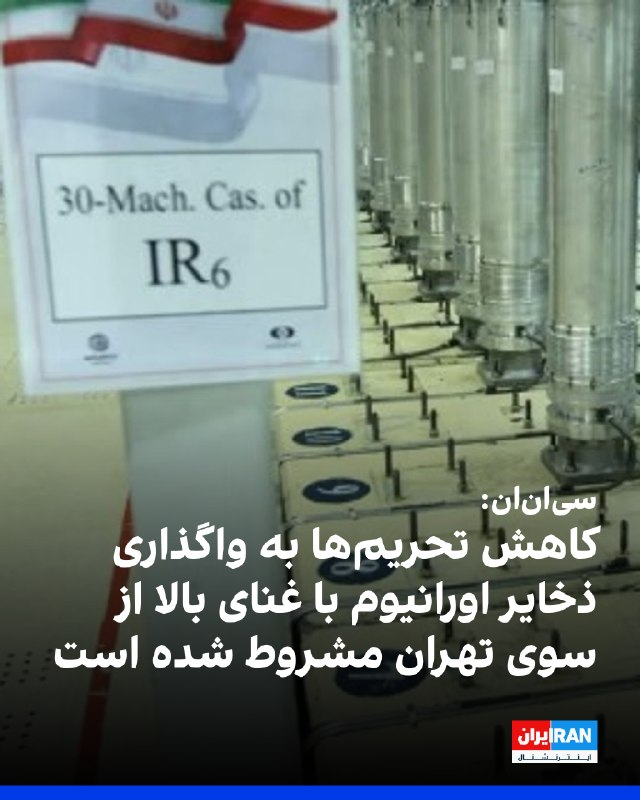

شبکه خبری سی‌ان‌ان گزارش داد در چارچوب پیش‌نویس نوافق‌نامه آمریکا و حکومت ایران، ۶۰ روز برای نهایی‌کردن این توافق، فرصت داده شده و کاهش تحریم‌ها نیز به واگذاری ذخایر اورانیوم با غنای بالا از سوی تهران مشروط شده است.

یک مقام ارشد دولت دونالد ترامپ در گفت‌وگو با سی‌ان‌ان تاکید کرد: «بدون تحویل گردو غبار [اورانیوم]، پولی در کار نخواهد بود.»
https://iranintl.com/202605257610

## IranIntlTV — post 338848

  

روزنامه دنیای اقتصاد گزارش داد: «بر اساس پیش‌بینی‌ها، درآمد‌های مالیاتی با عدم تحقق ۲۵ درصدی در بودجه سال جاری مواجه خواهد شد.»

این روزنامه اشاره کرد که این کاهش درآمد‌ها می‌تواند کسری بودجه را تشدید کند و افزود اقتصاد ایران در سال ۱۴۰۵ با مجموعه‌ای از نااطمینانی‌ها و فشار‌های همزمان مواجه شده است.

دنیای اقتصاد به «اختلال‌های گسترده اینترنت، کاهش دسترسی بسیاری از کسب‌وکار‌ها به بازار، افت فروش در بخش خدمات و تجارت آن‌لاین، افزایش هزینه‌های تولید، کاهش قدرت خرید خانوار‌ها و نگرانی‌های ناشی از تشدید تنش‌های منطقه‌ای» اشاره کرد؛ عواملی که بسیاری از بنگاه‌ها را در وضعیت نیمه‌تعطیل یا رکودی قرار داده‌اند.

بر اساس این گزارش، علی افضلی، مدیرکل دفتر سیاستگذاری بخش عمومی وزارت اقتصاد، در همایش «چشم‌انداز اقتصاد ایران ۱۴۰۵» گفته است احتمال دارد «حدود ۲۵ درصد از درآمد‌های مالیاتی امسال وصول نشود.»

دنیای اقتصاد نوشت اگر یک‌چهارم درآمد‌های مالیاتی محقق نشود، دولت یا باید هزینه‌ها را کاهش دهد، یا به سمت استقراض و چاپ پول برود، یا فشار مالیاتی بیشتری بر مؤدیان وارد کند؛ مسیرهایی که هر سه تبعات اقتصادی آسیب‌زا دارند.
ht

## IranIntlTV — post 338847

  

نشریه اکونومیست گزارش داد که ریاض از دونالد ترامپ خواسته است هرگونه حمله جدید به ایران را تا پس از مراسم سالانه حج به تعویق بیندازد.

به نوشته اکونومیست، این نگرانی وجود دارد که اگر درگیری دوباره آغاز و حریم هوایی منطقه بسته شود، زائران در عربستان سعودی گیر بیفتند.
https://iranintl.com/202605253745

## IranIntlTV — post 338846

  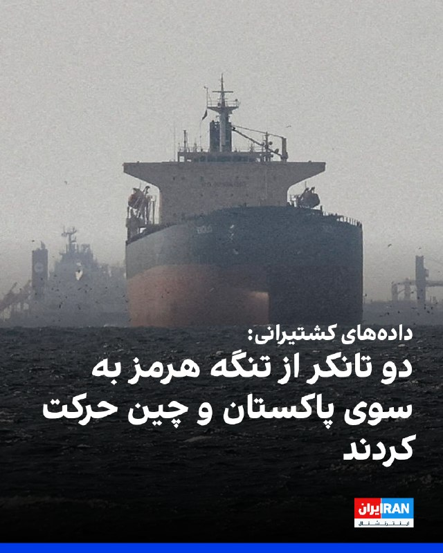

داده‌های کشتیرانی نشان می‌دهد که یک نفتکش گاز طبیعی مایع دوشنبه از تنگه هرمز به سمت پاکستان در حرکت بود، در حالی که یک ابرنفتکش حامل نفت خام عراق به مقصد چین، شنبه پس از حدود سه ماه سرگردانی، خلیج فارس را ترک کرد.

این کشتی‌ها جزو معدود ابرنفتکش‌هایی هستند که این ماه از طریق مسیری ترانزیتی که ایران به کشتی‌ها دستور استفاده از آن را داده است، از خلیج فارس خارج می‌شوند.

هفته گذشته، سه نفتکش بسیار بزرگ با ۶ میلیون بشکه نفت خام به چین و کره جنوبی رفتند. داده‌های کشتیرانی ال‌اس‌ای‌جی و کپلر نشان داد که نفتکش حامل گاز مایع فویریت دوشنبه از تنگه هرمز عبور می‌کند و انتظار می‌رود سه‌شنبه محموله خود را در پاکستان تخلیه کند.

این کشتی که با پرچم باهاما حرکت می‌کرد، حدود ۲۸ مارس، هشتم فروردین، در بندر راس‌لفان قطر گاز مایع بارگیری کرد.

شرکت کشتیرانی میتسویی او. اس. کی. لاینز ژاپن که مالک کشتی فویریت است، برای اظهار نظر در خارج از ساعات اداری در دسترس نبود.
https://iranintl.com/202605259354

## IranIntlTV — post 338845

  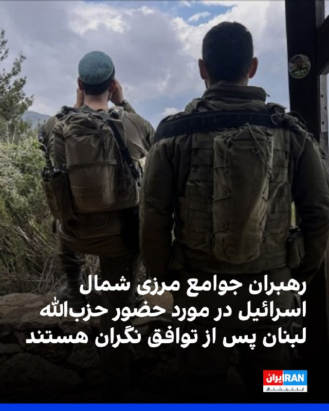

روزنامه اسرائیلی هاآرتص خبر داد که شهرداران و روسای شوراهای محلی مناطق مرزی اسرائیل و لبنان، هشدار داده‌اند که توافق احتمالی آمریکا با حکومت ایران در صورت باقی ماندن حزب‌الله «ضربه‌ای مرگبار» خواهد بود.

به نوشته هاآرتص، این رهبران جوامع مرزی در شمال اسرائیل، دولت بنیامین نتانیاهو را متهم کردند که تاکنون آن‌ها را از روند شکل‌گیری این توافق یا پیامدهای امنیتی احتمالی آن در شمال کشور، مطلع نکرده است.
https://iranintl.com/202605259251

## IranIntlTV — post 338842

  

روزنامه اورشلیم‌پست گزارش داد در حالی که اخبار حاکی از ادامه مذاکرات میان آمریکا و حکومت ایران است، ارتش اسرائیل در وضعیت «آماده‌باش بالا» باقی مانده است.

بر اساس این گزارش، ارتش اسرائیل در صورت شکست گفت‌وگوها، احتمال ازسرگیری درگیری‌ها را در نظر خواهد گرفت.
https://iranintl.com/202605253185

## IranIntlTV — post 338841

  <a href="https://t.me/IranintlTV/338841" target="_blank">📎 Download file</a>

🎧نسخه صوتی سیاست با مراد ویسی: نیاز به راهکارهای نو در راه درست سرنگونی
@iranintlTV

## IranIntlTV — post 338840

  

سناتور کریس مورفی، نماینده دموکرات مجلس سنای آمریکا، اعلام کرد اگر توافق با تهران واقعی باشد، از آن استقبال می‌کند.

او در شبکه اجتماعی ایکس عنوان کرد که با ادامه جنگ، «آمریکا ضعیف‌تر می‌شود» و نوشت: «پایان دادن به جنگ دراولویت است.»

مورفی با اشاره به گزارش‌های منتشر شده در مورد مفاد توافق احتمالی افزود: «ما میلیاردها دلار به ایران می‌دهیم تا به جایی که قبل از جنگ بودیم برگردیم. و گزارش‌ها حاکی از آن است که این توافق ممکن است حق ایران برای کنترل تنگه هرمز را تثبیت کند.»

او در مورد پرونده هسته‌ای جمهوری اسلامی نیز احتمال داد که تهران «تمام مسائل هسته‌ای را به تعویق می‌اندازد» و در خصوص احتمال لغو تحریم‌ها هم اضافه کرد که در این صورت،‌ «اهرم کمتری برای وادار کردن آن‌ها [جمهوری اسلامی] به دادن امتیاز بیشتر در مذاکرات آینده داریم.»

مورفی برخلاف سخنان دونالد ترامپ، رییس‌جمهوری آمریکا، در مورد نابودی توان نظامی جمهوری اسلامی، افزود: «ایران هنوز برنامه موشک‌های بالستیک و پهپاد خود را دارد. آنها هنوز نیروی دریایی دارند که می‌تواند تنگه هرمز را ببندد. یک رژیم تندرو هنوز در راس امور است.»
https://iranintl.com/20

## IranIntlTV — post 338839

  

روزنامه نیویورک‌پست به نقل از «یک مقام ارشد دولت آمریکا» نوشت که نهایی شدن توافق صلح با حکومت ایران برای بازگشایی تنگه هرمز ممکن است تا یک هفته طول بکشد، اما اگر تهران به شرایط دونالد ترامپ متعهد نشود، ممکن است رییس‌جمهوری ایالات متحده، از آن خارج شود.

یک مقام ارشد آمریکا گفت پس از آن‌که ترامپ اعلام کرد مذاکرات بر سر جنگ و برنامه هسته‌ای تهران در مرحله نهایی خود قرار دارد، وضعیت حکومت ایران باعث شده است که روند نهایی به کندی پیش برود.

این منبع اشاره کرد که ممکن است چند روز طول بکشد تا توافق نهایی به دست مجتبی خامنه‌ای، رهبر جمهوری اسلامی، برسد.

در همین ارتباط، شماری از رسانه‌ها گزارش داده‌اند که او درمکانی نامعلوم مخفی شده و امکان دسترسی به او برای مقام‌‌های حکومت ایران دشوار است.

به نوشته نیویورک‌پست، مقام ارشد آمریکایی گفت بازگشایی واقعی تنگه هرمز و پایان محاصره بنادر ایران توسط آمریکا حدود هفت روز طول خواهد کشید و ایالات متحده تنها زمانی تحریم‌ها را لغو خواهد کرد که ایران اورانیوم غنی‌شده خود را تحویل دهد.
https://iranintl.com/202605253993

## IranIntlTV — post 338838

  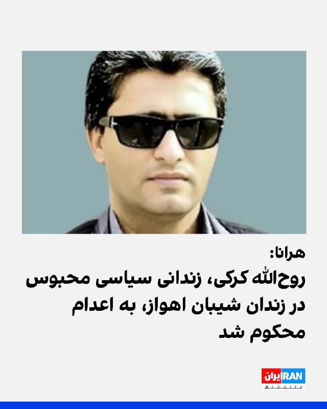

وب‌سایت حقوق بشری هرانا گزارش داد که روح‌الله کرکی، زندانی سیاسی محبوس در زندان شیبان اهواز، به اعدام محکوم شد.

بر اساس این گزارش، چندی پیش، کیفرخواست پرونده کرکی بابت اتهامات «انتشار و افشای اسناد محرمانه»، «همکاری با سازمان مجاهدین خلق»، «جاسوسی برای اسرائیل و تبادل اطلاعات نظامی و امنیتی»، «توهین به مقدسات و مقامات» و «اقدام علیه امنیت ملی» صادر و به دادگاه کیفری دو اهواز ارجاع شده بود.

به نوشته هرانا، این زندانی سیاسی دهم مهر سال گذشته به زندان شیبان اهواز منتقل شد. او ۱۴ مرداد سال گذشته به دست نیروهای امنیتی در اندیمشک بازداشت شده بود.

این وب‌سایت اشاره کرد روح‌الله کرکی، برادر امین کرکی، از بازداشت‌شدگان اعتراضات سراسری دی‌ ۹۶ است، و افزود: «امین کرکی در فروردین ۹۷ پس از بازداشت مجدد، در شرایطی پرابهام درگذشت.»
https://iranintl.com/202605256245

## IranIntlTV — post 338837

  

مسعود رسولی، دبیر انجمن صنعت بسته‌بندی گوشت و مواد پروتیینی، اعلام کرد که بازار تقاضا برای گوشت قرمز نسبت به سال گذشته حدود ۵۰ درصد کاهش یافته است.

او به دلایل این کاهش ۵۰ درصدی اشاره نکرد اما وب‌سایت اقتصاد آنلاین با اشاره به سخنان رسولی نوشت: «طی چند سال اخیر با کاهش قدرت خرید مردم سرانه مصرف گوشت کاهش یافته است.»

در همین ارتباط، برخی گزارش‌های منتشر شده در رسانه‌های ایران حاکی از افزایش بی‌سابقه اقلام خوراکی و مصرفی از آغاز سال تاکنون است.

مخاطبان ایران‌اینترنشنال نیز با ارسال پیام‌هایی نوشته‌اند نه‌تنها سفره‌ها کوچک شده، بلکه مردم از تامین ابتدایی‌ترین نیازهای زندگی‌شان درمانده‌اند.
https://iranintl.com/202605253577

## FarsiVOA — post 218587

  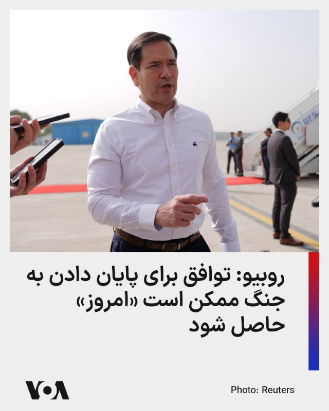

مارکو روبیو، وزیر امور خارجه آمریکا، اعلام کرد که توافقی برای پایان دادن به جنگ علیه جمهوری اسلامی ممکن است «امروز» حاصل شود و افزود که اسرائیل حق دارد از خود در برابر حمله دفاع کند.

آقای روبیو که در پایان یک سفر رسمی، دهلی‌نو، پایتخت هند را ترک می‌کرد، به خبرنگاران گفت: «فکر می‌کردیم شاید دیشب خبری داشته باشیم، شاید امروز.»

او افزود: «ما چیزی را روی میز داریم که به نظر من، در مورد توانایی آن‌ها برای باز کردن تنگه‌ها و باز نگه داشتن تنگه‌ها، کاملا محکم است.»

روبیو همچنین ابراز اطمینان کرد که حکومت ایران «وارد یک مذاکره واقعی، مهم و زمان‌محدود درباره مسئله هسته‌ای خواهد شد.»

روز یکشنبه، دونالد ترامپ، رئیس‌جمهور آمریکا، اعلام کرد که به مذاکره‌کنندگان خود گفته است «عجله نکنند.»
@FarsiVOA

## FarsiVOA — post 218586

  

🔺اعدام یکی از بازداشت‌شدگان دی‌ماه، همزمان با هشدارها درباره موج تازه احکام امنیتی

◾️قوه قضائیه اعلام کرد حکم اعدام عباس اکبری فیض‌آبادی، از بازداشت‌شدگان رویدادهای دی ۱۴۰۴ در نائین، اجرا شده است.

◾️آقای اکبری به «محاربه، تخریب عمدی اموال عمومی، اخلال در نظم و امنیت جامعه و اجتماع و تبانی علیه امنیت داخلی» متهم و ادعا شده در جریان حمله به فرمانداری نائین، با کلت کمری به سوی مأموران شلیک کرده است.

◾️با این حال، جزئیات مستقلی درباره روند دادرسی، نحوه دسترسی به وکیل، امکان دفاع مؤثر، بررسی ادعای احتمالی فشار در بازجویی و راستی‌آزمایی مستقل ادله منتشر نشده است.

◾️همچنین روشن نیست فیلم، گزارش انتظامی و اقرارهای مورد استناد دادگاه، در روندی علنی و قابل بررسی ارزیابی شده‌اند یا نه.

⬇️ بیشتر بخوانید:
https://ir.voanews.com/a/8153572.html

## FarsiVOA — post 218585

🔺آمریکا با اشاره به اقدامات حکومت ایران از عدم اجماع در کنفرانس منع گسترش سلاح‌های هسته‌ای ابراز تأسف کرد

◾️ایالات متحده با ابراز تأسف از ناکامی «کنفرانس بررسی ۲۰۲۶ معاهده منع گسترش سلاح‌های هسته‌ای» در دستیابی به اجماع بر سر سند نهایی، اعلام کرد ناتوانی برخی کشورهای عضو در جدی گرفتن تهدید جمهوری اسلامی ایران علیه نظام جهانی منع اشاعه تسلیحات کشتار جمعی، در تعاملات آینده واشنگتن مورد توجه قرار خواهد گرفت.

⬇️ بیشتر بخوانید:
https://ir.voanews.com/a/8153571.html
@FarsiVOA

## FarsiVOA — post 218584

  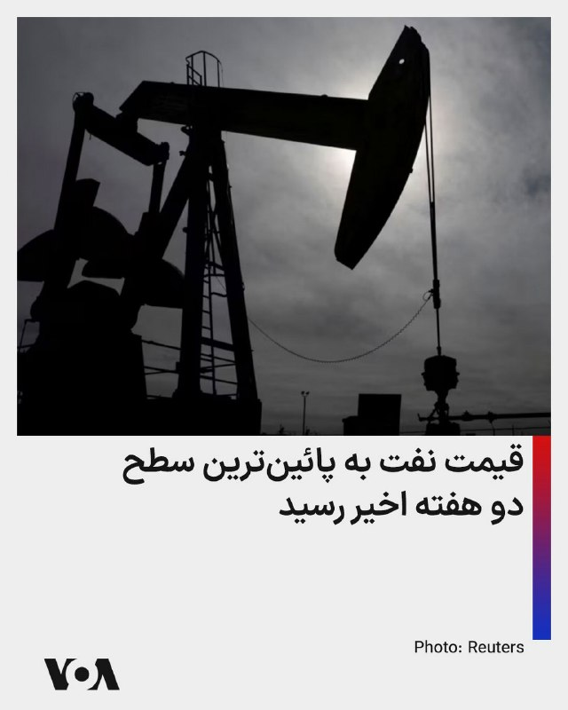

⚡️در پی خوش‌بینی‌های بازار نفت نسبت به نزدیک‌تر شدن ایالات متحده و جمهوری اسلامی به یک توافق صلح، قیمت نفت در معاملات روز دوشنبه (به وقت شرق آسیا) به پایین‌ترین سطح خود در دو هفته گذشته رسید. این کاهش قیمت در حالی است که دو طرف همچنان بر سر مسائل مهمی، از جمله وضعیت تنگه هرمز که همچنان عرضه نفت از خاورمیانه را مختل می‌کند، اختلاف دارند. به گزارش رویترز، قیمت نفت خام برنت تا ساعت ۲۲:۳۴ به وقت گرینویچ با کاهش ۴ دلار و ۷۱ سنتی (۴.۵۵ درصد) به ۹۸ دلار و ۸۳ سنت در هر بشکه رسید. نفت خام وست تگزاس اینترمدیت آمریکا نیز با ۴ دلار و ۵۷ سنت کاهش، معادل ۴.۷۳ درصد، به قیمت ۹۲ دلار و ۳ سنت در هر بشکه رسید.
@FarsiVOA

## FarsiVOA — post 218583

  

⚡️مارک لوین، مفسر مشهور رادیویی آمریکایی و از حامیان دونالد ترامپ رئیس جمهوری آمریکا، روز یکشنبه با انتشار مطلبی در شبکه اجتماعی ایکس، گفت: «در اینترنت مطالب زیادی درباره یک توافق احتمالی [با جمهوری اسلامی] وجود دارد. اما من هیچ چیزی درباره خود مردم ایران ندیدم.»
@FarsiVOA

## FarsiVOA — post 218582

  

⚡️دونالد ترامپ، رئیس جمهوری آمریکا، روز یکشنبه تصویری از یک بمب متصل به یک هواپیمای نظامی منتشر کرد که روی آن جمله معروفی که در پایان پیام‌های آنلاین خود می‌نویسد دیده می‌شد: «از توجه شما به این موضوع سپاسگزارم!»
@FarsiVOA

## FarsiVOA — post 218580

⚡️اهداف جمهوری اسلامی از أوردن زنان بدون حجاب به تجمعات شبانه؛ گفت‌وگو با پگاه بنی‌هاشمی
@FarsiVOA

## Persian_Trend_Official — post 14906

  <a href="telegram/content/Persian_Trend_Official_14906_1779685835.mp4" target="_blank">🎬 Download video</a>

💢حزب‌الله فیلمی منتشر کرد که هدف قرار دادن یک تانک مرکاوا اسرائیلی در شهر طیبه، جنوب لبنان، توسط یک پهپاد ابابیل را نشان می‌دهد

🫆:Tony

📌 @persian_trend_official
پرشین ترند | متفاوت‌ترین کانال نظامی

## Persian_Trend_Official — post 14905

  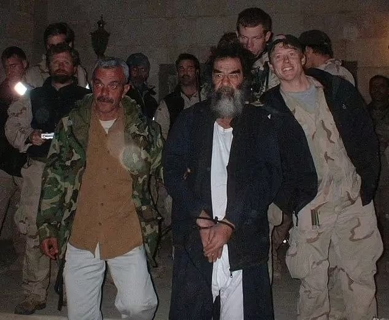

صبحتون بخیر ☕️🤍

📝 Nick
📌 @persian_trend_official
پرشین ترند | متفاوت‌ترین کانال نظامی

## Persian_Trend_Official — post 14904

  <a href="telegram/content/Persian_Trend_Official_14904_1779685837.mp4" target="_blank">🎬 Download video</a>

🔴ویدئویی از مقیاس ساخت فرودگاه اتیوپی، رسانه‌های اجتماعی را شوکه کرد

💢 انتظار می‌رود فرودگاه بیشوفتو، در حومه پایتخت اتیوپی، به یکی از بزرگترین قطب‌های لجستیک جهان تبدیل شود و سالانه 110 میلیون مسافر را جابجا کند.

💢 ساخت و ساز در ژانویه 2026 آغاز شد و انتظار می‌رود فاز اول آن تا سال 2030 تکمیل شود.

🫆:Tony

📌 @persian_trend_official
پرشین ترند | متفاوت‌ترین کانال نظامی

## Persian_Trend_Official — post 14903

  <a href="telegram/content/Persian_Trend_Official_14903_1779685838.webm" target="_blank">🎬 Download video</a>

🔴فاکس‌نیوز مدعی «پیشرفت ۹۵ درصدی تفاهم اولیه بین ایران و آمریکا» شد

♦️شبکه آمریکایی فاکس‌نیوز مدعی شد که تفاهم اولیه درباره حدود ۹۵ درصد مفاد یک توافق‌نامه حاصل شده است.

🫆:Tony

📌 @persian_trend_official
پرشین ترند | متفاوت‌ترین کانال نظامی

## RadioFarda — post 157527

  

🔸خبرگزاری میزان، وابسته به قوه قضاییه، صبح روز دوشنبه چهارم خرداد از اعدام عباس اکبری، از بازداشت‌شدگان اعتراضات ۱۴۰۴ در اصفهان، خبر داد.

🔸در گزارش میزان این معترض با نام کامل «عباس اکبری فیض‌آبادی» و «یکی از لیدرهای مسلح» در اعتراضات شهرستان نائین معرفی و گفته شده که او «نقش مهمی در حمله به فرمانداری شهرستان و مراکز تأمین امنیت و همچنین مراکز خدماتی» داشته است.

🔸میزان اتهامات آقای اکبری را «محاربه، تخریب عمدی اموال عمومی به قصد مقابله با نظام و اخلال در نظم و امنیت جامعه، اجتماع و تبانی برای ارتکاب جرم علیه امنیت داخلی» اعلام کرده و مدعی شده که او با کلت کمری جنگی اقدام به تیراندازی در خیابان کرده است.

🔸ایران در ماه‌های اخیر با موج تازه‌ای از اعدام‌ها، بازداشت‌ها و صدور احکام سنگین روبه‌رو بوده است؛ موجی که به گفتهٔ نهادها و سازمان‌های حقوق بشری، در فضای جنگ، بحران امنیتی و اعتراضات، به‌عنوان ابزاری برای ایجاد ترس و کنترل جامعه عمل می‌کند.

@RadioFarda

## RadioFarda — post 157526

  <a href="https://t.me/radiofarda/157526" target="_blank">📎 Download file</a>

📻بشنوید: سرخط خبرها با رادیوفردا، چهارم خرداد ۱۴۰۵‌

@RadioFarda

## IranianMinds — post 20702

🔴 نیویورک‌پست:

احتمال رسیدن به توافق بین آمریکا و ایران به طور فزاینده‌ای کاهش یافته. هر دو طرف در ابتدا موافقت کردن که برخی از خواسته‌های حداکثری رو کنار بذارن، اما 24 ساعت بعد پس از فشار شدید اسرائیلی‌ها و دیگر طرفداران اسرائیل نزدیک به ترامپ، او لحن خودش رو به طور چشمگیری تغییر داده و خواستار آن شده که ایرانی‌ها برای هرگونه رفع تحریم و دارایی‌های مسدود شده، کل ذخیره اورانیوم خود را کنار بذارن، در حالی که در ابتدا قرار بود که بخشی از دارایی‌ها به عنوان بخشی از تفاهمنامه آزاد بشه.

تفاهمنامه روز جمعه، تحت فشار شدید است و احتمال فرو پاشیدن آن زیاده، مگه اینکه یکی از طرفین عقب‌نشینی کنه.

@IranianMinds

## IranianMinds — post 20701

💯 اگر هنوز ۵۰۰ هزارتومان رو نگرفتی همین الان عضو شو‌ و جایزتو بگیر
نیازی هم به واریز نیست

👍 تنها سایت مورد #تایید ما با بونوس های واقعی

🌐 Winro.io

## IranianMinds — post 20700

  <a href="telegram/content/IranianMinds_20700_1779685840.webm" target="_blank">🎬 Download video</a>

⭕️ تنها جایی که در لحظه عضویت بهت 500 هزارتومان موجودی میده اینجاس 
❌

🎉 کافیه فقط عضو بشی تا #وینرو بهت 
🤩 
🤩 
🤩 هزارتومان جایزه بده ، نیازی هم به واریز نیست.

⌛ پشتیبانی 24 ساعته

🍆تنها سایت مورد اعتماد ما با بونوس های کاملا واقعی و رویایی:

🌐 Winro.io

🌐 Winro.io
کانال بونوس های رایگان a3

📱 @winro_io

## BBCPersian — post 281982

  

خبرگزاری‌های رسمی در ایران از اجرای حکم اعدام عباس اکبری در بامداد روز دوشنبه خبر دادند و از او به عنوان «لیدر مسلح کودتای دی» نام برده‌اند.
خبرگزاری میزان، رسانه رسمی قوه‌قضاییه ایران، صبح دوشنبه - ۴ خرداد نوشت: «عباس اکبری فیض‌آبادی یکی از لیدرهای مسلح اغتشاشات در شهرستان نائین اصفهان بود که نقش مهمی در حمله به فرمانداری شهرستان و مراکز تأمین امنیت و همچنین مراکز خدماتی داشت.»
این خبرگزاری به اتهام اصلی عباس اکبری در پرونده اشاره کرده و‌آن را «شلیک به سوی ماموران» عنوان کرده است اما جزییاتی از فرد یا افرادی که احتمالا قربانی یا مجروح این «تیراندازی» شده‌اند، منتشر نکرده است.

نهادهای حقوق بشر از دادرسی‌های ناعادلانه و نقض حقوق متهم و موج اعدام‌ بر اساس «اعترافات» زیر شکنجه و فشار ابراز نگرانی کرده‌اند.

از شروع جنگ آمریکا و اسرائیل با ایران، دستگاه قضائی ایران حدود ۳۰ نفر را با اتهام‌های مختلف اعدام کرده است.
📷Reuters

https://bbc.in/49liIfb
@BBCPersian

## BBCPersian — post 281981

قيمت نفت به شدت کاهش يافته و بازارهای سهام آسيايی در پی اميدها به توافقی که می‌تواند به جنگ ميان آمريکا، اسرائيل و ايران پايان دهد، صعود کرده‌اند.

دونالد ترامپ، رئيس جمهوری آمريکا، روز شنبه گفت توافق با تهران «تا حد زيادی مذاکره شده» و جزئيات آن به زودی اعلام خواهد شد، اما يک روز بعد از تيم مذاکره کننده خود خواست برای رسيدن به توافق عجله نکنند.

صبح دوشنبه در آسيا، نفت برنت، شاخص جهانی نفت، با کاهش ۵ درصدی به ۹۸ دلار و ۳۶ سنت رسيد، در حالی که نفت خام معامله شده در آمريکا با افت ۵/۳ درصدی به ۹۱ دلار و ۵۰ سنت کاهش يافت.

آقای ترامپ پيشتر گفته بود اين توافق شامل بازگشايی تنگه راهبردی هرمز خواهد بود، اما جزئيات بيشتری ارائه نکرد.

اين آبراه باريک که معمولا حدود يک پنجم نفت و گاز طبيعی مايع جهان از آن عبور می کند، از زمان آغاز درگيری ها در ۲۸ فوريه عملا بسته شده است.

شاخص نيکی ۲۲۵ ژاپن نيز با افزايش ۲.۵ درصدی برای نخستين بار از سطح ۶۵ هزار واحد عبور کرد؛ افزايشی که ناشی از اميدها به بازگشايی قريب الوقوع تنگه هرمز عنوان شده است.

ژاپن، مانند کره جنوبی، به دليل وابستگی شديد به انرژی وارداتی از خليج فارس، به طور ويژه از اين درگيری ها آسيب ديده است.

بازارهای انرژی و مالی بريتانيا و آمريکا روز دوشنبه به دليل تعطيلات رسمی بسته هستند.
https://bbc.in/3RrLdl7
@BBCPersian

## BBCPersian — post 281980

  

‌
در حالیکه ماموران آتش‌نشانی در منطقه اورنج کانتی در جنوب لس‌آنجلس با پاشیدن آب در تلاش برای خنک کردن یک مخزن حاوی مواد شیمیایی هستند، مسئولان از پیدا شدن یک شکاف در این مخزن خبر دادند. این مخزن در یک مرکز هوافضا قرار دارد و از چند روز پیش دمای آن به طرز غیرعادی رو به افزایش گذاشت.

گوین نیوسام، فرماندار کالیفرنیا وضعیت اضطراری اعلام کرده است.

از روز جمعه گزارش شد که این مخزن که حاوی بیش از ۲۶ هزار لیتر ماده متیل متا آکریلات است، به شدت در حال داغ شدن است. این ماده‌ بسیار فرار و قابل اشتعال که برای ساخت پلاستیک استفاده می‌شود،‌ در صورت انتشار در هوا می‌تواند مشکلات جدی تنفسی ایجاد کند.

در یک اقدام احتیاطی،‌ دستور تخلیه هزاران نفر از ساکنان شهر گاردن گروو صادر شده است و پس از اینکه مسئولان هشدار دادند که انفجار این مخزن می‌تواند باعث ایجاد یک توده سمی در هوا شود،‌ حدود ۵۰ هزار نفر مجبور به ترک خانه‌های خود شدند.

سخنگوی اداره آتش‌نشانی اورنج کانتی گفت که وجود این شکاف می‌تواند باعث کاهش فشار مخزن شود و خطر وقوع یک انفجار بزرگ را کمتر کند.

📷Reuters
@BBCPersian

## BBCPersian — post 281979

یک روز پس از آنکه شلیک چندین گلوله در نزدیکی کاخ‌سفید خبرساز و اعلام شد که مهاجم مسلح با شلیک ماموران مخفی کشته شده است، رسانه‌ها آمریکایی از هویت و تاریخچه مهاجم خبر دادند.

شبکه سی‌بی‌اس، شریک رسانه‌ای بی‌بی‌سی در آمریکا، مظنون تیراندازی را «ناصر بست» ۲۱ ساله معرفی کرد؛ فردی که برای نهادهای امنیتی شناخته‌شده بود و سابقه ثبت‌شده مشکلات سلامت روان داشت.

صدای تیراندازی اندکی پس از ساعت ۱۸ به وقت محلی (۲۳:۰۰ به وقت گرینویچ) روز شنبه - دوم خرداد - شنیده شد؛ به‌طوری که خبرنگارانی که بیرون کاخ سفید مشغول فیلم‌برداری بودند، خود را به زمین انداختند و برای در امان ماندن به داخل ساختمان پناه بردند.

ماموران سرویس مخفی آمریکا که در گوشه خیابان مستقر بودند، به تیراندازی پاسخ دادند و مهاجم را هدف قرار دادند.

فرد مهاجم سپس به بیمارستان منتقل شد، اما در آنجا مرگ او اعلام شد.

در این تیراندازی، یک رهگذر نیز زخمی شد، اما سرویس مخفی جزئیات بیشتری درباره وضعیت او ارائه نکرد. همچنین هیچ‌یک از ماموران در این حمله زخمی نشدند.

به گفته منابع آگاه، او در جریان تیراندازی از یک هفت‌تیر استفاده کرده بود.

یک منبع آگاه از روند تحقیقات به شبکه سی‌بی‌اس گفت ناصر بست پیش‌تر در ژوئیه ۲۰۲۵ تلاش کرده بود وارد کاخ سفید شود و پس از بازداشت توسط ماموران در نزدیکی این ساختمان، مدتی را در یک مرکز روان‌پزشکی سپری کرده بود.

بر اساس این گزارش، او طی ۱۸ ماه گذشته در واشینگتن دی‌سی زندگی می‌کرد.

https://bbc.in/3RrLdl7
@BBCPersian

## BBCPersian — post 281978

  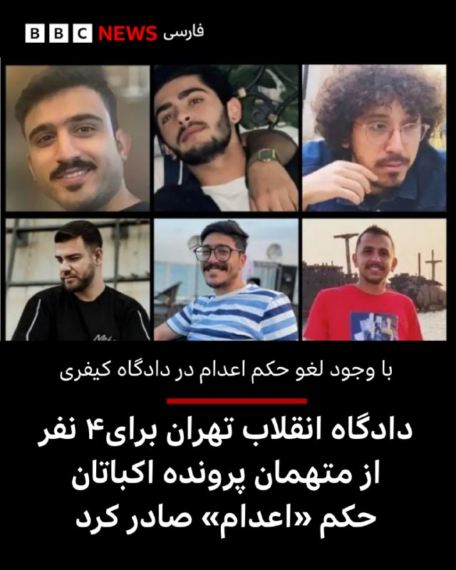

رسانه‌ها در ایران در خبری مبهم از صدور حکم دیگری برای متهمان پرونده قتل آرمان علی‌وردی، طلبه بسیجی، در جریان اعتراضات سال ۱۴۰۱ خبر داده‌اند که این بار در جریان یک «محاکمه موازی» در دادگاه انقلاب تهران روی داده است.

خبرگزاری‌های ایران روز یکشنبه نوشته‌اند این دادگاه برای ۴ نفر از متهمان این پرونده حکم اعدام صادر کرده و برای دیگر متهمان احکامی بین یک تا پنج سال زندان تعیین کرده است.
این در حالی است که چند روز پیش گزارش شد دادگاه تجدیدنظر در حکمی درباره متهمان این پرونده گفته است میلاد آرمون، علیرضا کفایی، امیرمحمد خوش اقبال به پنج سال حبس و پرداخت دیه محکوم شده‌اند.
همچنین حسین نعمتی به پرداخت دﯾﻪ ﺻﺪﻣﺎت به خانواده آرمان علی وردی محکوم شد اما به‌همراه نوید نجاران و علیرضا برمز پورناک از سایر اتهامات تبرئه شدند.

با این حال، روز یکشنبه - سوم خرداد - خبرگزاری‌های ایران در خبری با متن مشابه از صدور این حکم خبر دادند.

خبرگزاری‌های ایران از «رسیدگی موازی» این پرونده در دادگاه انقلاب تهران نوشتند.

آن‌طور که گزارش شده این حکم هم قابل فرجام خواهی است.
بیشتر بخوانید:

https://bbc.in/3RjDPZ8
@BBCPersian

## BBCPersian — post 281977

  

‌
دونالد ترامپ جونیور، پسر رئیس جمهور آمریکا، از توافق احتمالی با ایران دفاع کرده و آن را «یک پیروزی بزرگ برای آمریکا» توصیف کرده است.

او روز یکشنبه در شبکه ایکس نوشت: «این یک پیروزی بزرگ برای آمریکاست. باید افرادی را نادیده بگیریم که تا زمانی که حمله زمینی به ایران انجام نشود، راضی نخواهند شد. پدرم قول داده بود مانع دستیابی ایران به سلاح هسته‌ای شود و دقیقا همین کار را انجام می‌دهد.»

اعلام دونالد ترامپ، رئیس جمهور آمریکا مبنی بر «تا حد زیادی مذاکره شدن» توافق با ایران، که به گفته او شامل بازگشایی تنگه هرمز نیز می‌شود، واکنش‌های متفاوتی را در میان جمهوری‌خواهان و متحدان سیاسی او در آمریکا برانگیخته است.

این اظهارات با استقبال شماری از متحدان ترامپ روبه‌رو شد. اما همزمان، چند چهره بانفوذ جمهوری‌خواه و نزدیک به جریان ترامپ نسبت به مفاد احتمالی این توافق ابراز نگرانی کرده‌اند.

📷EPA/Shutterstock

https://bbc.in/3RrLdl7
@BBCPersian

<!-- MSG END -->

<!-- NAV START -->

<a href="https://github.com/ERAGON007/aio-downloader-testing/blob/main/telegram/content/archive_1.md" style="display:inline-block; padding:6px 12px; margin:0 4px; background-color:#2ea44f; color:white; text-decoration:none; border-radius:4px; font-weight:bold;">صفحه بعد</a>

<!-- NAV END -->
