# خواننده تلگرام

<!-- TOP_NAV START -->

<a href="https://github.com/ERAGON007/aio-downloader-testing/blob/main/telegram/content/archive_1.md" style="display:inline-block; padding:6px 12px; margin:0 4px; background-color:#2ea44f; color:white; text-decoration:none; border-radius:4px; font-weight:bold;">صفحه بعد</a>

<!-- TOP_NAV END -->

<!-- MSG START -->

---
📅 بروزرسانی: 1405/03/07 08:24
---

## VahidOOnLine — post 242524

  <a href="telegram/content/VahidOOnLine_242524_1779944087.mp4" target="_blank">🎬 Download video</a>

♦️فدراسیون شطرنج نروژ، ویدیویی را از لحظات پایانی رقابت علیرضا فیروزجا، استاد بزرگ ایرانی‌تبار شطرنج فرانسه با گوکش دی، حریف هندی را منتشر کرده است.

به گفته فدراسیون شطرنج نروژ، پس از تساوی دو حریف در رقابت کلاسیک، فیروزجا با تکنیک آخر‌الزمانی (آرماگدون) و با چند حرکت سریع حریف صاحب‌نام هندی را شکست داد.

فیروزجا در اسلو با پای شکسته و آتل‌بندی شده به مصاف حریفان می‌رود.
‌🇸🇦 Indypersian

🤖 @VahidOOnLine

## VahidOOnLine — post 242523

  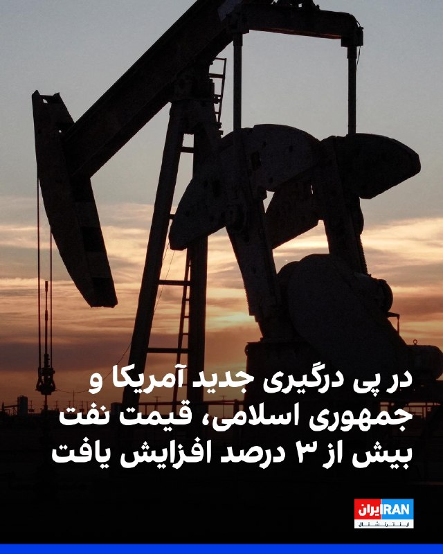

در پی درگیری جدید آمریکا و جمهوری اسلامی و افزایش نگرانی‌ها درباره اختلال در کشتیرانی تجاری در تنگه هرمز، قیمت جهانی نفت افزایش یافت. قیمت نفت برنت با بیش از ۳ درصد افزایش به ۹۷ دلار و ۲۹ سنت به ازای هر بشکه رسید.
قیمت نفت خام وست تگزاس اینترمدیت نیز با رشد ۳.۴۲ درصدی به ۹۱ دلار و ۷۱ سنت برای هر بشکه رسید.
سپاه اعلام کرد در واکنش به حمله‌ پرتابه‌های هوایی آمریکا در سحرگاه پنج‌شنبه به نقطه‌ای در حاشیه فرودگاه بندرعباس، یک پایگاه هوایی آمریکا را که مبدا این حملات بود، هدف قرار داده است.

‌🏁 🇬🇧 IranintlTV

🤖 @VahidOOnLine

## VahidOOnLine — post 242522

  

دفتر دادستانی آمریکا در ناحیه جنوبی نیویورک اعلام کرد مردی به نام جاناتان لودهولت، ۳۷ ساله از استاتن‌آیلند، به دلیل نقش داشتن در طرحی به دستور جمهوری اسلامی برای کشتن مسیح علینژاد در سال ۲۰۲۴ در بروکلین، به ۱۰ سال زندان محکوم شد.
جیمز بارنکل، رییس دفتر اف‌بی‌آی در نیویورک، در بیانیه‌ای گفت لودهولت از سوی حکومت ایران مامور شده بود علینژاد را زیر نظر بگیرد و در نهایت او را بکشد، اما اف‌بی‌آی پیش از اجرای این نقشه او را بازداشت کرد.
جی کلیتون، دادستان ایالات متحده، گفت جمهوری اسلامی «تلاش کرد علینژاد را به دلیل تلاش‌هایش برای ایستادگی در برابر حکومت ایران و افشای رفتار تبعیض‌آمیز با زنان، فساد و نقض حقوق بشر ساکت کند.»
مسیح علینژاد سال گذشته نیز در دادگاه دو مردی که به طراحی نقشه ربودن او از خانه‌اش در بروکلین و کشتن او در سال ۲۰۲۲ متهم شده بودند، شهادت داد. یک دادستان گفت جمهوری اسلامی برای کشتن علینژاد ۵۰۰ هزار دلار جایزه تعیین کرده بود. این دو متهم که هر دو اهل جمهوری آذربایجان بودند، مجرم شناخته شدند و به ۲۵ سال زندان محکوم شدند.

‌🏁 🇬🇧 IranintlTV

🤖 @VahidOOnLine

## VahidOOnLine — post 242521

  <a href="telegram/content/VahidOOnLine_242521_1779944091.mp4" target="_blank">🎬 Download video</a>

♦️روابط عمومی سپاه پاسداران، ساعت هفت صبح پنج‌شنبه همزمان با گزارش خبرگزاری‌های کویت از مقابله پدافند هوایی این کشور با یک حمله موشکی و پهپادی اعلام کرد که سپاه، یک پایگاه هوایی آمریکا را به عنوان «مبدا تجاوز» به نقطه‌ای در حاشیه فرودگاه بندرعباس، هدف گرفته است. همزمان با این تحولات کانال وحید آنلاین تصاویری را تحت عنوان «رد موشک شلیک شده در آسمان امیدیه خوزستان» منتشر کرده است که بر اساس گزارش‌ها در ساعات آغازین روز پنج‌شنبه ۷ خرداد رؤیت شده است.
‌🇸🇦 Indypersian

🤖 @VahidOOnLine

## VahidOOnLine — post 242520

  

وزارت خزانه‌داری آمریکا «نهاد مدیریت آبراه خلیج فارس» را تحریم کرد و هشدار داد هر فرد یا نهادی که با این سازمان همکاری کند، ممکن است در حال ارائه حمایت یا دریافت خدمات از سپاه باشد و در نتیجه مشمول تحریم شود.

اسکات بسنت، وزیر خزانه‌داری آمریکا، گفت: «آخرین تلاش ارتش جمهوری اسلامی برای اخاذی از تجارت دریایی جهانی نشان می‌دهد که کارزار خشم اقتصادی آمریکا حکومت ایران را برای تامین پول مستاصل کرده است.»
‌🏁 🇬🇧 IranintlTV

🤖 @VahidOOnLine

## VahidOOnLine — post 242519

  

سپاه اعلام کرد در واکنش به حمله‌های پرتابه‌های هوایی آمریکا در سحرگاه پنج‌شنبه به نقطه‌ای در حاشیه فرودگاه بندرعباس، یک پایگاه هوایی آمریکا را که مبدا این حملات بود در ساعت ۴:۵۰ هدف قرار داده است.
سپاه تاکید کرد در صورت تکرار حمله‌های آمریکا، پاسخ جمهوری اسلامی «قاطع‌تر» خواهد بود.

‌🏁 🇬🇧 IranintlTV

🤖 @VahidOOnLine

## VahidOOnLine — post 242517

  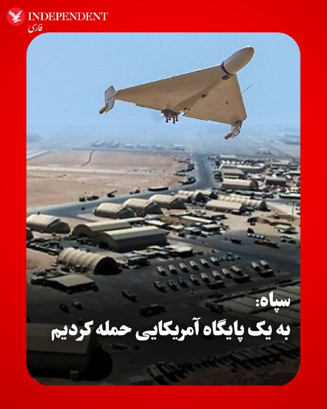

♦️روابط عمومی سپاه پاسداران، ساعت هفت صبح پنجشنبه همزمان با گزارش خبرگزاری‌های کویت از مقابله پدافند هوایی این کشور با یک حمله موشکی و پهپادی اعلام کرد که سپاه، یک پایگاه هوایی آمریکا را به عنوان «مبدا تجاوز» به نقطه‌ای در حاشیه فرودگاه بندرعباس، هدف گرفته است. در این بیانیه به نام این پایگاه و اینکه در چه کشوری قرار دارد اشاره نشده است. ساعاتی قبل صدای سه انفجار در شرق بندرعباس شنیده شد و پس از آن رویترز به نقل از یک مقام آمریکایی گزارش داد که ارتش آمریکا به یک سایت نظامی در ایران حمله کرده است. بعدا اسوشیتدپرس گزارش داد که سنتکام پس از سرنگون کردن چهار پهپاد ایرانی، به پرتابگری که در حال شلیک پهپاد پنج بوده حمله کرده است. خبرگزاری‌های حکومتی از جمله تسنیم می‌گویند که «نفتکش آمریکایی» قصد داشته از تنگه هرمز عبور کند که به ‌سوی آن شلیک شده و پس از آن حمله ارتش آمریکا در بندرعباس انجام شده است.
‌🇸🇦 Indypersian

🤖 @VahidOOnLine

## VahidOOnLine — post 242516

  

♦️به گزارش اسوشیتدپرس، دولت ترامپ روز چهارشنبه در چارچوب کارزار گسترده فشار اقتصادی، تحریم‌های بیشتری علیه حکومت ایران اعمال کرد؛ این بار با هدف قرار دادن آژانس تازه‌تأسیس رژیم ایران که تلاش می‌کند کشتیرانی از طریق تنگه را کنترل و عوارض دریافت کند.
 به‌طور معمول یک‌پنجم نفت و گاز طبیعی جهان از تنگه هرمز عبور می‌کند.
اسکات بسنت، وزیر خزانه‌داری، در بیانیه‌ای گفت: «آخرین تلاش ارتش ایران برای باج‌گیری از تجارت دریایی جهانی نشان می‌دهد که سیاست “خشم اقتصادی” این رژیم را به سمت استیصال برای تأمین نقدینگی سوق داده است.»
این تحریم‌ها «سازمان تنگه هرمز خلیج فارس ایران» و هر فرد یا نهادی را که با این آژانس همکاری کند هدف قرار می‌دهد. این نهاد که اوایل ماه جاری اعلام شده بود، مسئول تأیید عبور از تنگه و دریافت عوارضی است که می‌تواند تا دو میلیون دلار برای هر کشتی برسد.
سپاه پاسداران انقلاب اسلامی از این سازوکار حمایت می‌کند و می‌گوید تنها مسیر امن عبور از این آبراه حیاتی همان کریدوری است که خود تعیین کرده و هر کشتی‌ که از آن منحرف شود با مجموعه‌ای از اقدامات مواجه خواهد شد.
‌🇸🇦 Indypersian

🤖 @VahidOOnLine

## VahidOOnLine — post 242515

  

♦️اسوشیتدپرس در توضیح حمله اوایل بامداد پنجشنبه ارتش آمریکا در بندرعباس به نقل از مقامات آمریکایی گزارش داد که نیروهای فرماندهی مرکزی آمریکا چهار پهپاد تهاجمی یک‌طرفه ایران را که در نزدیکی تنگه هرمز تهدیدی ایجاد کرده بودند سرنگون کردند و یک ایستگاه کنترل زمینی را در بندر عباس هدف گرفتند که در آستانه پرتاب پنجمین پهپاد بود.
‌🇸🇦 Indypersian

🤖 @VahidOOnLine

## VahidOOnLine — post 242514

  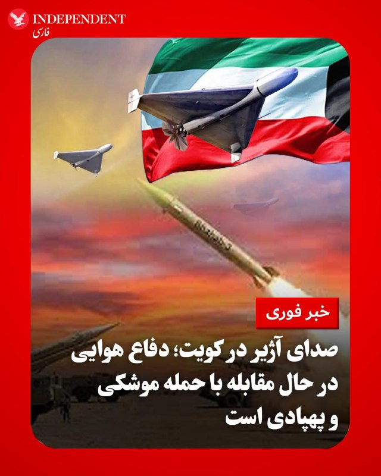

♦️در نخستین ساعات بامداد پنجشنبه، رسانه‌های کویت از شنیده شدن صدای آژیر در این کشور خبر دادند. همزمان گزارش شد که سیستم دفاع هوایی کویت در مقابله با یک حمله موشکی و پهپادی متخاصم فعال شده است.
‌🇸🇦 Indypersian

🤖 @VahidOOnLine

## VahidOOnLine — post 242513

  

در پی شنیده شدن صداهای انفجار در کویت، ارتش این کشور اعلام کرد این صداها ناشی از رهگیری حملات موشکی و پهپادهای متخاصم از سوی سامانه‌های پدافند هوایی کویت بوده است. پیش‌تر رسانه‌ها از شنیده شدن صداهای انفجار و فعال شدن آژیرهای خطر در کویت خبر دادند.
‌🏁 🇬🇧 IranintlTV

🤖 @VahidOOnLine

## VahidOOnLine — post 242512

  

♦️در ساعات اولیه بامداد پنجشنبه، در حالی که خبرگزارش فارس از شنیده شدن سه انفجار در شرق بندرعباس خبر داده و رویترز نیز می‌گوید ارتش آمریکا به هدف نظامی در ایران حمله کرده است، تسنیم وابسته به سپاه گزارش داد که نیروی دریایی سپاه به سمت یک نفتکش (آمریکایی) در تنگه هرمز شلیک کرده است. تسنیم مدعی است که به دنبال هشدار، ۴ شناور مجبور به بازگشت شدند. در این گزارش آمده است که در مقابل «ارتش آمریکا به زمین سوخته‌ای در اطراف بندرعباس شلیک کرد.» در خبر ساعاتی قبل رویترز آمده است که ارتش آمریکا به یک هدف نظامی در ایران که امنیت نیروهای آمریکایی را به خطر انداخته شلیک کرده و چند پهپاد ایرانی را نیز رهگیری کرده است.
یک مقام آمریکایی نیز پیش‌تر به سی‌ان‌ان گفته بود که ارتش آمریکا چهار پهپاد ایرانی را سرنگون کرده و یک ایستگاه کنترل زمینی ایران در بندرعباس را هدف قرار داده است؛ ایستگاهی که در آستانه پرتاب پنجمین پهپاد بود.
سی‌ان‌ان برای دریافت توضیح، با فرماندهی مرکزی آمریکا درباره گزارش‌های رسانه‌های حکومتی ایران که می‌گویند حملات آمریکا در پاسخ به اقدام ایران انجام شده، تماس گرفته است.
‌🇸🇦 Indypersian

🤖 @VahidOOnLine

## VahidOOnLine — post 242511

  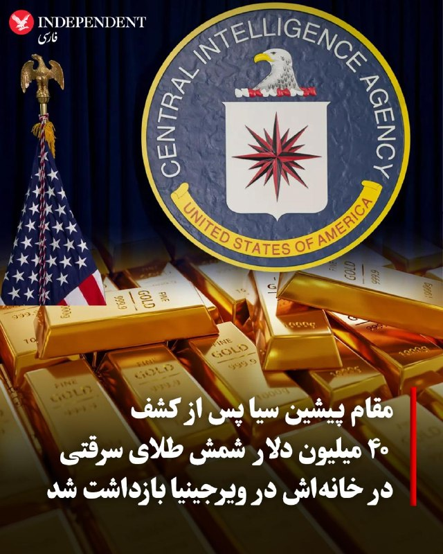

♦️یک مقام پیشین سیا پس از کشف ده‌ها میلیون دلار شمش طلا، پول نقد و ساعت‌های لوکس در خانه‌اش در ایالت ویرجینیا بازداشت شد.
به گزارش نیویورک تایمز، ماموران اف‌بی‌آی در جریان بازرسی خانه دیوید راش، مقام ارشد پیشین سیا، ۳۰۳ شمش طلا به ارزش حدود ۴۰ میلیون دلار، حدود دو میلیون دلار پول نقد و ده‌ها ساعت لوکس رولکس کشف کردند.
بر اساس اسناد دادگاه، راش که تا همین اواخر در سطح مدیران ارشد سیا فعالیت می‌کرد، بین آبان تا اسفند ۱۴۰۴ درخواست دریافت طلا و ارز خارجی برای «هزینه‌های کاری» کرده بود، اما بازرسی داخلی سیا نشان داد بخشی از این دارایی‌ها از محل نگهداری رسمی ناپدید شده‌اند.
اف‌بی‌آی اعلام کرد این پرونده پس از تحقیقات داخلی سیا و ارجاع آن از سوی مدیر این سازمان به نهادهای فدرال آغاز شده و تحقیقات همچنان ادامه دارد.
‌🇸🇦 Indypersian

🤖 @VahidOOnLine

## VahidOOnLine — post 242510

♦️دونالد ترامپ، رئیس‌جمهوری آمریکا، روز چهارشنبه ۶ خردادماه در نشست کاخ سفید اعلام کرد که کشورهایی مانند عربستان سعودی و قطر باید به «پیمان ابراهیم» بپیوندند و این اقدام را یک رویداد تاریخی خواند. ترامپ با بیان اینکه این کشورها به خاطر کارهایی که برایشان انجام شده به آمریکا مدیون هستند، تاکید کرد که اگر آن‌ها این پیمان را امضا نکنند، مشخص نیست واشنگتن توافقی را با ایران انجام دهد یا خیر.
رئیس‌جمهوری آمریکا اضافه کرد کشورهای امضاکننده فعلی این توافق، از جمله امارات متحده عربی، نتایج مثبتی از آن گرفته‌اند و این توافق «بسیار موثر» بوده است.
‌🇸🇦 Indypersian

🤖 @VahidOOnLine

## VahidOOnLine — post 242509

  

♦️به گزارش فاکس‌نیوز، یک مقام وزارت کشور بنگلادش اعلام کرد که یک گاومیش سفید نادر «آلبینو» که به دلیل موهای طلایی «دونالد ترامپ» نام‌گذاری شده بود، با دخالت مستقیم و به‌موقع دولت از قربانی شدن در روز عید قربان نجات یافت.
بر اساس این گزارش، این گاومیش که پیش‌تر برای قربانی فروخته شده بود، پس از انتشار گسترده ویدیوهایش به جاذبه‌ای ملی تبدیل شد و هجوم جمعیت به محل نگهداری آن، مقام‌های دولتی را وادار به مداخله و جلوگیری از ذبح آن کرد. در نهایت با این تصمیم دولت، مقرر شد این گاومیش به جای کشتارگاه، به باغ‌وحش ملی در داکا منتقل شود.
‌🇸🇦 Indypersian

🤖 @VahidOOnLine

## VahidOOnLine — post 242508

  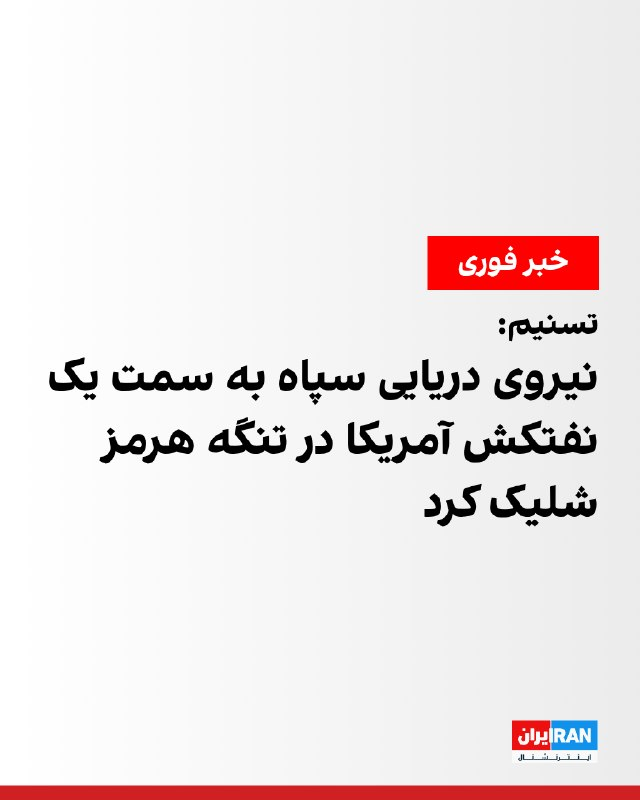

تسنیم به نقل از یک منبع آگاه نظامی گزارش داد ساعاتی پیش یک نفتکش آمریکایی با خاموش کردن سیستم راداری خود قصد عبور از تنگه هرمز را داشت، اما پس از شلیک نیروی دریایی سپاه، این نفتکش مجبور به توقف و بازگشت شد.
پیش‌ترآکسیوس به نقل از یک مقام ارشد آمریکایی گزارش داد جمهوری اسلامی چهار پهپاد انتحاری را به سوی یک کشتی نیروی دریایی آمریکا و یک کشتی تجاری شلیک کرد، اما نیروهای آمریکا این پهپادها را سرنگون کردند.

‌🏁 🇬🇧 IranintlTV

🤖 @VahidOOnLine

## VahidOOnLine — post 242507

♦️تیم ملی فوتبال عربستان سعودی که برای برپایی مرحله پایانی برنامه آماده‌سازی خود برای جام جهانی ۲۰۲۶ وارد آمریکا شده است، تمرینات آمادگی خود را در شهر نیویورک آغاز کرد. بر اساس برنامه اعلام‌شده، این اردو تا ۱۰ خرداد در نیویورک ادامه خواهد داشت و ملی‌پوشان عربستان سعودی در جریان آن، روز شنبه ۹ خرداد در یک مسابقه دوستانه به مصاف تیم ملی اکوادور خواهند رفت.
‌🇸🇦 Indypersian

🤖 @VahidOOnLine

## VahidOOnLine — post 242506

♦️دونالد ترامپ، رئیس‌جمهوری ایالات متحده، در نشست کابینه در کاخ سفید گفت هیچ کشوری تنگه هرمز را کنترل نخواهد کرد و این آبراه، آب‌های بین‌المللی محسوب می‌شود.
ترامپ گفت: «هیچ‌کس قرار نیست آن را کنترل کند. ما مراقب آن خواهیم بود، اما کسی کنترلش نخواهد کرد.» او افزود باز بودن تنگه هرمز برای همه، بخشی از مذاکرات جاری است.
رئیس‌جمهوری آمریکا همچنین با اشاره به عمان گفت این کشور نیز «مانند دیگران رفتار خواهد کرد.»
‌🇸🇦 Indypersian

🤖 @VahidOOnLine

## VahidOOnLine — post 242497

هشت روایت کوتاه از هشت زندگی ناتمام.<
از شاهین‌شهر تا تهرانپارس، از کرج تا زنجان؛ جوانانی که بعضی تازه وارد زندگی مشترک، کار یا آینده‌ای تازه شده بودند، در خیابان‌های ایران هدف گلوله قرار گرفتند. بعضی در آغوش خانواده جان دادند، بعضی با تیر خلاص کشته شدند و بعضی حتی پس از مرگ، حقیقت کشته‌شدنشان انکار شد.<
روزبه صفری هلیسادی، مجتبی انصاری‌فرد، اشکان شهبازی، ساینا نظام‌دوست، صفا فرزانفر، رضا کاووسی حیدری، عرشیا براری و آرمین سلطان‌محمدی؛
جاویدنامان انقلاب ملی ایرانیان.<
این نام‌ها سند خشونتی است که بر مردم ایران گذشت؛ و یادشان بخشی از راهی است که تا آزادی ادامه دارد.<
#جاویدنامان_انقلاب_ملی_ایرانیان
‌🏁 🇬🇧 IranintlTV

🤖 @VahidOOnLine

## WithYashar — post 12768

مقام آمریکایی به شبکه CBS نیوز گفت : آتش‌بس با ایران پس از حملات امشب همچنان در حال اجرا در نظر گرفته می‌شود.
@withyashar

## WithYashar — post 12767

«رویترز» به نقل از یک مقام آمریکایی گزارش داد: ارتش آمریکا حملات هوایی جدیدی را علیه یک سایت نظامی ایران انجام داد که تهدیدی برای نیروها و ناوبری ما در تنگه هرمز محسوب می‌ شد @withyashar

## FoxNewsTwitter — post 342335

  <a href="telegram/content/FoxNewsTwitter_342335_1779944100.mp4" target="_blank">🎬 Download video</a>

Fox News (Twitter/X)

NOW: VP Vance and Second Lady Usha Vance deboard from Air Force Two.

The vice president will speak at the United States Air Force Academy's 68th graduation ceremony on Thursday.

Hundreds of cadets will be commissioned as officers during the ceremony, and the Air Force Thunderbirds are scheduled to perform a flyover, the U.S. Air Force Academy says.

## FoxNewsTwitter — post 342334

  <a href="telegram/content/FoxNewsTwitter_342334_1779944101.mp4" target="_blank">🎬 Download video</a>

Fox News (Twitter/X)

Jill Biden is now admitting she feared something was seriously wrong with Joe Biden during his 2024 debate against Donald Trump.

“I thought, ‘Oh, my God, he’s having a stroke,’” the former first lady recalled in a new interview. She said she'd never seen him like that before, and hasn't seen him like that since.

Her alarm is a sharp contrast to her public reaction immediately after the debate, when she praised Biden for doing "such a great job" and answering "every question."

The debate meltdown ultimately triggered weeks of panic inside the Democratic Party, which resulted in Biden dropping out of the race.

## FoxNewsTwitter — post 342333

Fox News (Twitter/X)

WATCH LIVE: Texas Senate nominee James Talarico holds general election kick-off rally in Houston https://twitter.com/i/broadcasts/1qKVmmwNMjVxB

## FoxNewsTwitter — post 342332

  

Fox News (Twitter/X)

BREAKING: The U.S. struck an Iranian ground control station in Bandar Abbas that was about to launch an attack drone, officials tell FOX News.

Four other Iranian one-way attack drones that posed a threat in the Strait of Hormuz were also shot down, the officials said.

"These actions were measured, purely defensive, and intended to maintain the ceasefire."

## pm_afshaa — post 91706

vless://406d8436-0eb9-4eb2-84fb-960e076ffba6@104.17.121.71:443?mode=stream-one&path=%2Fde&security=tls&encryption=none&insecure=0&fp=chrome&type=xhttp&allowInsecure=0&sni=de.lezzatzone.ir#PMTV%20NEWS%F0%9F%A6%81%E2%98%80%EF%B8%8F

💧 Rainbet.com the #1 Non-KYC Crypto Casino & Sportsbook @rainbetcom

😁 @Pm_Afshaa

## pm_afshaa — post 91705

ss://Y2hhY2hhMjAtaWV0Zi1wb2x5MTMwNTpvWklvQTY5UTh5aGNRVjhrYTNQYTNB@82.38.31.149:8080#PMTV%20NEWS%F0%9F%A6%81%E2%98%80%EF%B8%8F

💧 Rainbet.com the #1 Non-KYC Crypto Casino & Sportsbook @rainbetcom

😁 @Pm_Afshaa

## pm_afshaa — post 91704

vless://406d8436-0eb9-4eb2-84fb-960e076ffba6@104.17.121.71:443?mode=stream-one&path=%2Fde&security=tls&encryption=none&insecure=0&host=de.lezzatzone.ir&fp=chrome&type=xhttp&allowInsecure=0&sni=de.lezzatzone.ir#PMTV%20NEWS%F0%9F%A6%81%E2%98%80%EF%B8%8F

نامحدود پرسرعت

💧 Rainbet.com the #1 Non-KYC Crypto Casino & Sportsbook @rainbetcom

😁 @Pm_Afshaa

## VahidOnline — post 75766

  <a href="telegram/content/VahidOnline_75766_1779944104.mp4" target="_blank">🎬 Download video</a>

ویدیوی دریافتی: 'رد موشک شلیک شده در آسمان #امیدیه خوزستان، پنج‌شنبه ۷ خرداد'
Vahid

☄️سپاه اعلام کرد در واکنش به حمله‌های پرتابه‌های هوایی آمریکا در سحرگاه پنج‌شنبه به نقطه‌ای در حاشیه فرودگاه بندرعباس، یک پایگاه هوایی آمریکا را که مبدا این حملات بود در ساعت ۴:۵۰ هدف قرار داده است.
سپاه تاکید کرد در صورت تکرار حمله‌های آمریکا، پاسخ جمهوری اسلامی «قاطع‌تر» خواهد بود.
@VahidOOnLine
رسانه‌هایی که بیانیه سپاه رو نقل کردند، از جمله خبرگزاری رسمی جمهوری اسلامی، ایرنا، نوشتند "ساعت ۴/۵۰" حمله کردند که یعنی چهار و نیم ولی با توجه به اینکه با دو رقم اعشار نوشتند احتمالا منظورشون چهار و پنجاه دقیقه بوده.
اما این هم عجیبه چون آژیر در کویت و پیام‌ها از امیدیه مربوط به ساعت ۵:۵۰ بودند!
📡 @VahidOnline

## VahidOnline — post 75763

از #امیدیه در خوزستان پیام‌ها و تصاویری دریافت می‌کنم که میگن حدود ساعت ۵:۵۰ موشکی شلیک شده و سمت تونل امیدیه میانکوه صدای انفجاری شنیده شده.
یکی نوشته لانچر هدف گرفته شده.

دقیقا میشه هم‌زمان با شنیده شدن آژیر در کویت

📡 @VahidOnline

## VahidOnline — post 75762

  

پیام‌های دریافتی:

سلام وحید الان کویت رو زد ۵/۲۰

وحيد همين الان اژير كويت فعال شد

سلام صدای پدافند و تقریبا ۲ تا انفجار در کویت

درود وحید🙋🏻‍♂️
اینجا ساعت ۵:۲۰ به وقت کویت صدای اژیر اومد و رو گوشی ها هشدار اومد
ولی هنوز هیچ رسانه‌ی کویتیی دلیل این اتفاقو نگفته

آپدیت:
ارتش کویت اعلام کرد سامانه‌های پدافند هوایی این کشور حملات موشکی و پهپادی «متخاصم» را رهگیری کرده‌اند، اما مشخص نکرد این تهدیدها از کجا منشأ گرفته‌اند.

ارتش کویت در بیانیه‌ای اعلام کرد صداهای انفجاری که در کشور شنیده شده است، ناشی از رهگیری این تهدیدها توسط سامانه‌های دفاع هوایی بوده است.
@VahidHeadline

📡 @VahidOnline

## IranIntlTV — post 339340

  

در پی درگیری جدید آمریکا و جمهوری اسلامی و افزایش نگرانی‌ها درباره اختلال در کشتیرانی تجاری در تنگه هرمز، قیمت جهانی نفت افزایش یافت. قیمت نفت برنت با بیش از ۳ درصد افزایش به ۹۷ دلار و ۲۹ سنت به ازای هر بشکه رسید.
قیمت نفت خام وست تگزاس اینترمدیت نیز با رشد ۳.۴۲ درصدی به ۹۱ دلار و ۷۱ سنت برای هر بشکه رسید.
سپاه اعلام کرد در واکنش به حمله‌ پرتابه‌های هوایی آمریکا در سحرگاه پنج‌شنبه به نقطه‌ای در حاشیه فرودگاه بندرعباس، یک پایگاه هوایی آمریکا را که مبدا این حملات بود، هدف قرار داده است.

https://iranintl.com/202605283892

## IranIntlTV — post 339339

  

دفتر دادستانی آمریکا در ناحیه جنوبی نیویورک اعلام کرد مردی به نام جاناتان لودهولت، ۳۷ ساله از استاتن‌آیلند، به دلیل نقش داشتن در طرحی به دستور جمهوری اسلامی برای کشتن مسیح علینژاد در سال ۲۰۲۴ در بروکلین، به ۱۰ سال زندان محکوم شد.
جیمز بارنکل، رییس دفتر اف‌بی‌آی در نیویورک، در بیانیه‌ای گفت لودهولت از سوی حکومت ایران مامور شده بود علینژاد را زیر نظر بگیرد و در نهایت او را بکشد، اما اف‌بی‌آی پیش از اجرای این نقشه او را بازداشت کرد.
جی کلیتون، دادستان ایالات متحده، گفت جمهوری اسلامی «تلاش کرد علینژاد را به دلیل تلاش‌هایش برای ایستادگی در برابر حکومت ایران و افشای رفتار تبعیض‌آمیز با زنان، فساد و نقض حقوق بشر ساکت کند.»
مسیح علینژاد سال گذشته نیز در دادگاه دو مردی که به طراحی نقشه ربودن او از خانه‌اش در بروکلین و کشتن او در سال ۲۰۲۲ متهم شده بودند، شهادت داد. یک دادستان گفت جمهوری اسلامی برای کشتن علینژاد ۵۰۰ هزار دلار جایزه تعیین کرده بود. این دو متهم که هر دو اهل جمهوری آذربایجان بودند، مجرم شناخته شدند و به ۲۵ سال زندان محکوم شدند.

https://iranintl.com/202605282003

## IranIntlTV — post 339338

  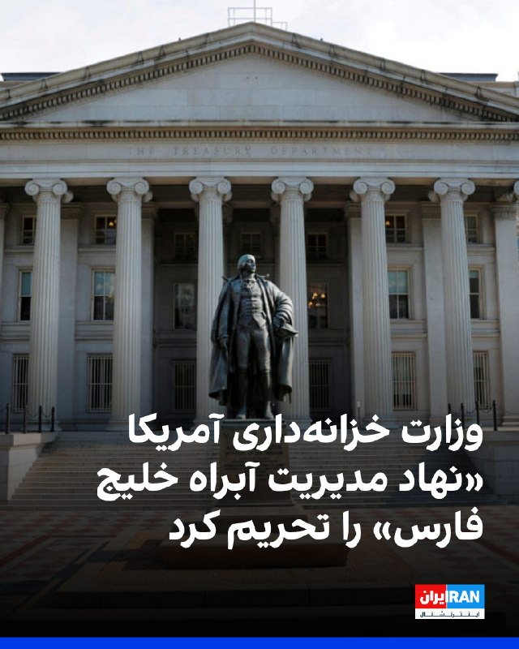

وزارت خزانه‌داری آمریکا «نهاد مدیریت آبراه خلیج فارس» را تحریم کرد و هشدار داد هر فرد یا نهادی که با این سازمان همکاری کند، ممکن است در حال ارائه حمایت یا دریافت خدمات از سپاه باشد و در نتیجه مشمول تحریم شود.

اسکات بسنت، وزیر خزانه‌داری آمریکا، گفت: «آخرین تلاش ارتش جمهوری اسلامی برای اخاذی از تجارت دریایی جهانی نشان می‌دهد که کارزار خشم اقتصادی آمریکا حکومت ایران را برای تامین پول مستاصل کرده است.»
https://iranintl.com/202605280657

## IranIntlTV — post 339337

  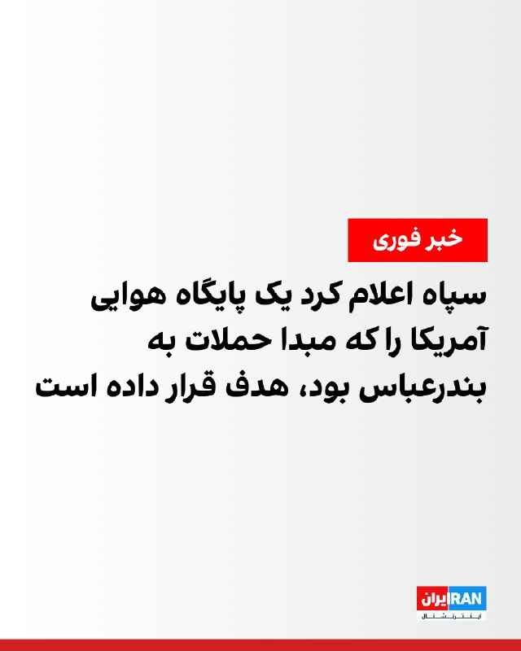

سپاه اعلام کرد در واکنش به حمله‌های پرتابه‌های هوایی آمریکا در سحرگاه پنج‌شنبه به نقطه‌ای در حاشیه فرودگاه بندرعباس، یک پایگاه هوایی آمریکا را که مبدا این حملات بود در ساعت ۴:۵۰ هدف قرار داده است.
سپاه تاکید کرد در صورت تکرار حمله‌های آمریکا، پاسخ جمهوری اسلامی «قاطع‌تر» خواهد بود.

https://iranintl.com/202605287903

## IranIntlTV — post 339336

  

سپاه اعلام کرد در واکنش به حمله‌های پرتابه‌های هوایی آمریکا در سحرگاه پنج‌شنبه به نقطه‌ای در حاشیه فرودگاه بندرعباس، یک پایگاه هوایی آمریکا را که مبدا این حملات بود در ساعت ۴:۵۰ هدف قرار داده است.
سپاه تاکید کرد در صورت تکرار حمله‌های آمریکا، پاسخ جمهوری اسلامی «قاطع‌تر» خواهد بود.

https://iranintl.com/202605287903

## IranIntlTV — post 339335

  

در پی شنیده شدن صداهای انفجار در کویت، ارتش این کشور اعلام کرد این صداها ناشی از رهگیری حملات موشکی و پهپادهای متخاصم از سوی سامانه‌های پدافند هوایی کویت بوده است. پیش‌تر رسانه‌ها از شنیده شدن صداهای انفجار و فعال شدن آژیرهای خطر در کویت خبر دادند.
https://iranintl.com/202605286737

## IranIntlTV — post 339334

  

تسنیم به نقل از یک منبع آگاه نظامی گزارش داد ساعاتی پیش یک نفتکش آمریکایی با خاموش کردن سیستم راداری خود قصد عبور از تنگه هرمز را داشت، اما پس از شلیک نیروی دریایی سپاه، این نفتکش مجبور به توقف و بازگشت شد.
پیش‌ترآکسیوس به نقل از یک مقام ارشد آمریکایی گزارش داد جمهوری اسلامی چهار پهپاد انتحاری را به سوی یک کشتی نیروی دریایی آمریکا و یک کشتی تجاری شلیک کرد، اما نیروهای آمریکا این پهپادها را سرنگون کردند.

https://iranintl.com/202605282248

## Shin_Persian — post 6267

Shin ✓ @hey_itsmyturn
Thu, 28 May 2026 01:49:46 UTC

Treasury's Economic Fury campaign targets Iran's Persian Gulf Strait Authority (PGSA), a new IRGC extortion scheme charging illegitimate "tolls" for vessels transiting the Strait of Hormuz.

𝐃𝐄𝐒𝐈𝐆𝐍𝐀𝐓𝐄𝐃 𝐄𝐍𝐓𝐈𝐓𝐘:

• 𝐏𝐞𝐫𝐬𝐢𝐚𝐧 𝐆𝐮𝐥𝐟 𝐒𝐭𝐫𝐚𝐢𝐭 𝐀𝐮𝐭𝐡𝐨𝐫𝐢𝐭𝐲 (𝐏𝐆𝐒𝐀) - Iranian government agency that coordinates with IRGC and IRGC Navy to extort commercial vessels through forced route compliance, information submission requirements, and passage fees that fund the designated Foreign Terrorist Organization IRGC.

𝐊𝐄𝐘 𝐎𝐏𝐄𝐑𝐀𝐓𝐈𝐎𝐍𝐀𝐋 𝐃𝐄𝐓𝐀𝐈𝐋𝐒:

- Vessels must submit requested information to receive "permission" from PGSA to transit the Strait of Hormuz
- PGSA forces vessels to follow Iranian-designated routes near Iran's coast under IRGC instructions
- Extortion payments accepted via fiat currency, digital assets, offsets, informal swaps, or in-kind payments including nominally charitable donations
- All toll revenues are funneled directly to the IRGC

𝐄𝐂𝐎𝐍𝐎𝐌𝐈𝐂 𝐅𝐔𝐑𝐘 𝐂𝐀𝐌𝐏𝐀𝐈𝐆𝐍 𝐈𝐌𝐏𝐀𝐂𝐓:

- Treasury has disrupted tens of billions of dollars in Iranian regime revenue
- Nearly $500 million in regime-linked cryptocurrency frozen
- Targeted shadow banking networks, weapons supply chains, and shadow fleet operations
- Secondary sanctions risk for foreign financial institutions facilitating Iranian activities

𝐒𝐀𝐍𝐂𝐓𝐈𝐎𝐍𝐒 𝐈𝐌𝐏𝐋𝐈𝐂𝐀𝐓𝐈𝐎𝐍𝐒:

- Designated under E.O. 13224 for materially assisting the IRGC
- All U.S. persons prohibited from transactions involving PGSA
- Foreign entities cooperating with the strait authority face sanctions exposure
- Secondary sanctions possible for foreign financial institutions conducting significant transactions with PGSA
- Violations may result in civil or criminal penalties on strict liability basis

𝐂𝐎𝐌𝐏𝐋𝐈𝐀𝐍𝐂𝐄 𝐖𝐀𝐑𝐍𝐈𝐍𝐆:

Any cooperation with the Persian Gulf Strait Authority may constitute providing support to the IRGC and expose parties to U.S. sanctions risk, regardless of payment method or justification.

ترجمه فارسی در بخش نظرات

𝕏 · @shin_persian

## Iliaen — post 4437

بامداد پنجشنبه؛ زیرنویس صدا و سیما: چند صدای انفجار در بندعباس شنیده شد؛ رویترز به نقل از یک مقام آمریکایی مدعی حمله به یک موقعیت نظامی در بندرعباس شد.

همچنین خبرگزاری CBS به نقل از مقامات ایالات متحده می‌گوید یک سایت نظامی در خاک ایران هدف حمله قرار گرفت.

@iliaen

## FarsiVOA — post 218862

  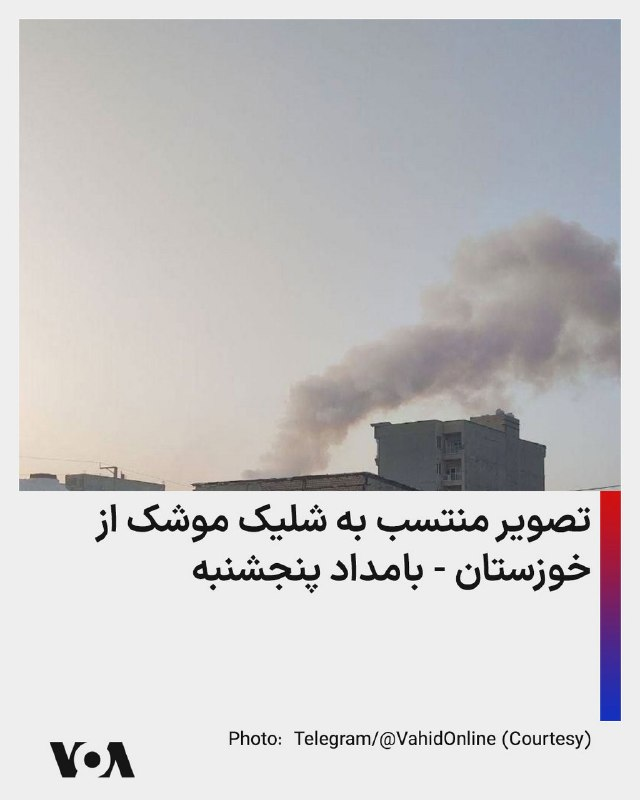

⚡️تصویر منتسب به شلیک موشک از خوزستان - بامداد پنجشنبه
@FarsiVOA

## FarsiVOA — post 218861

  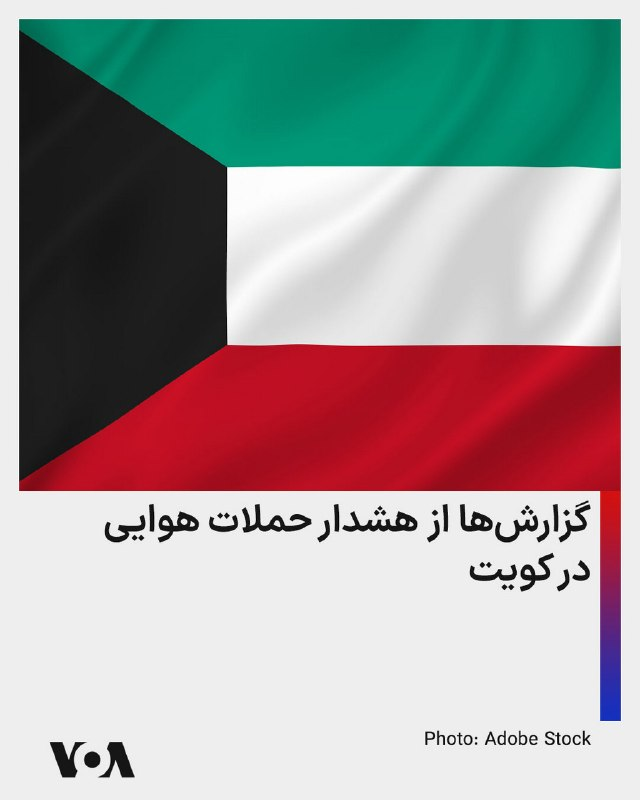

⚡️سایت‌های خبری و کاربران شبکه‌های اجتماعی از هشدار حمله هوایی در کویت خبر دادند. این هشدارها پس از حملات پهپادی جمهوری اسلامی و پاسخ نظامی نیروهای آمریکایی به آن حملات در بامداد پنج‌شنبه، گزارش می‌شود. ارتش کویت هم در بیانیه‌ای که دقایقی قبل منتشر کرد گفت پدافند هوایی کویت در حال حاضر «با حملات موشکی و پهپادی خصمانه» مقابله می‌کند.
@FarsiVOA

## FarsiVOA — post 218860

🔺آمریکا نهاد تازه تاسیس جمهوری اسلامی برای «مدیریت» تنگه هرمز را تحریم کرد

▪️وزارت خزانه‌داری آمریکا روز چهارشنبه ۶ خرداد اعلام کرد دفتر کنترل دارایی‌های خارجی این وزارتخانه (اوفک) نهاد موسوم به «مدیریت آبراه خلیج فارس» را که جمهوری اسلامی برای کنترل بر تنگه هرمز ایجاد کرده است، تحریم‌ کرد.

⬇️ بیشتر بخوانید:
https://ir.voanews.com/a/8154809.html
@FarsiVOA

## FarsiVOA — post 218859

  

⚡️سایت تسنیم، نزدیک به سپاه پاسداران، به نقل از فردی که او را یک «منبع آگاه نظامی» خواند، اوایل روز پنج‌شنبه به وقت محلی گزارش داد که نیروهای سپاه به یک «نفتکش آمریکایی» که قصد داشت از تنگه هرمز عبور کند، حمله کردند. پیشتر یک مقام ایالات متحده به صدای آمریکا گفته بود که نیروهای آمریکایی در اقدامی دفاعی چهار پهپاد شلیک‌شده جمهوری اسلامی را منهدم و یک سایت پهپادی را نیز پیش از شلیک پنجمین پهپاد هدف قرار دادند. این تحولات هم‌زمان با گزارش‌های مردمی از وقوع انفجارهایی در بندرعباس گزارش می‌شود. باراک راوید خبرنگار آکسیوس نیز پیشتر گزارش داد که یک مقام ارشد آمریکایی گفته بود جمهوری اسلامی چهار پهپاد انتحاری را به سمت یک کشتی تجاری آمریکایی شلیک کرد و ارتش آمریکا این پهپادها را سرنگون کرد.
@FarsiVOA

## FarsiVOA — post 218858

🔺انفجارها در بندرعباس؛ مقام آمریکایی به صدای آمریکا: حملات ایالات متحده به پهپادها و مرکز پهپادی جمهوری اسلامی «سنجیده» و «دفاعی» بود

▪️کاربران شبکه‌های اجتماعی از وقوع چندین انفجار در ساعات اولیه روز پنج‌شنبه ۷ خرداد در بندرعباس خبر دادند. طبق اطلاعات کانال تلگرامی وحیدآنلاین، این انفجارها بین حدود ساعت ۱:۳۰ بامداد تا نزدیک به ۲ بامداد شنیده شد.

⬇️ بیشتر بخوانید:
https://ir.voanews.com/a/8154603.html
@FarsiVOA

## FarsiVOA — post 218857

🔺دونالد ترامپ از انتخاب شدن مجدد نیکول پاشینیان حمایت کامل کرد؛ رئيس جمهوری آمریکا: «ارمنستان را دوباره با عظمت کنیم»

▪️دونالد ترامپ، رئیس جمهوری آمریکا، روز چهارشنبه اعلام کرد که از انتخاب شدن مجدد نیکول پاشینیان، نخست‌وزیر عربستان در انتخابات ۷ ژوئن ۲۰۲۶، حمایت کامل و تمام می‌کند.

⬇️ بیشتر بخوانید:
https://ir.voanews.com/a/8154808.html
@FarsiVOA

## FarsiVOA — post 218856

⚡️اختلاف و دوگانگی میان کشورهای اتحادیه اروپا در مهار غول‌های فناوری؛ نگرانی از تنش با آمریکا
@FarsiVOA

## FarsiVOA — post 218855

🔺انفجارها در بندرعباس؛ گزارش‌ها از دور تازه‌ای از حملات ارتش آمریکا به اهدافی در ایران و مقابله آن‌ با حملات پهپادی جمهوری اسلامی

▪️کاربران شبکه‌های اجتماعی از وقوع چندین انفجار در ساعات اولیه روز پنج‌شنبه ۷ خرداد در بندرعباس خبر دادند. طبق اطلاعات کانال تلگرامی وحیدآنلاین، این انفجارها بین حدود ساعت ۱:۳۰ بامداد تا نزدیک به ۲ بامداد شنیده شد.

⬇️ بیشتر بخوانید:
https://ir.voanews.com/a/8154603.html
@FarsiVOA

## Persian_Trend_Official — post 15156

  <a href="telegram/content/Persian_Trend_Official_15156_1779944109.webm" target="_blank">🎬 Download video</a>

تسنیم: امریکا به یک زمین سوخته در حوالی بندرعباس حمله کرده!

تسنیم از نقل یک مقام نظامی می‌گوید: ساعاتی پیش یک نفتکش آمریکایی با خاموش کردن سیستم راداری خود قصد عبور از تنگه هرمز را داشت که با اقدام سریع و قاطع نیروی دریایی سپاه و شلیک به سمت آن، مجبور به توقف و بازگشت شد.

در مقابل، ارتش امریکا به زمین سوخته‌ای در اطراف بندرعباس شلیک کرد که صدای انفجارها مربوط به این ماجرا بوده است؛ این شلیک هیچ خسارت جانی یا مالی به همراه نداشته است.

📝 Amir

📌 @persian_trend_official
پرشین ترند | متفاوت‌ترین کانال نظامی

## Persian_Trend_Official — post 15155

  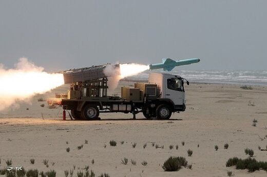

یک مقام دیگر آمریکایی در گفتگو با شبکه ان‌بی‌سی نیوز گفته است که پس از مجموعه‌ای از حملات موشکی، پهپادی و قایق‌های کوچک توسط سپاه پاسداران، امشب حملات بسیار محدود و بسیار دقیقی توسط ارتش ایالات متحده انجام شده است.

این حملات محدود ولی بسیار دقیق ارتش ایالات متحده در نزدیکی شهر بندرعباس در جنوب ایران انجام شده.

📝 Amir

📌 @persian_trend_official
پرشین ترند | متفاوت‌ترین کانال نظامی

## Persian_Trend_Official — post 15154

  

در همین حین یک پهپاد اسرائیلی خودرویی را در نزدیکی شهر عدلون در جنوب لبنان مورد هدف حمله خود قرار داد.

📝 Amir

📌 @persian_trend_official
پرشین ترند | متفاوت‌ترین کانال نظامی

## Persian_Trend_Official — post 15153

  <a href="telegram/content/Persian_Trend_Official_15153_1779944111.mp4" target="_blank">🎬 Download video</a>

صداوسیما پس از تایید خبر حمله امریکا توسط رسانه های خبری متعدد: نشانه‌ایی از انفجار در بندر عباس دیده نشده است!

صداوسیما می‌گوید برخی از مردم صدای این انفجار را شنیده اند(!) و هیچ یک از مقام‌های رسمی پیرو این موضوع هیچ اطلاعیه رسمی نداده اند.

📝 Amir

📌 @persian_trend_official
پرشین ترند | متفاوت‌ترین کانال نظامی

## Persian_Trend_Official — post 15152

  

خبرهایی که از ترور علی عظمایی جانشین سردار تنگسیری دست به دست می‌شود برای اولین بار توسط منابع خبری نامعتبر و زرد منتشر شده.

📝 Amir

📌 @persian_trend_official
پرشین ترند | متفاوت‌ترین کانال نظامی

## Persian_Trend_Official — post 15151

یک مقام آمریکایی در مصاحبه با شبکه سی‌بی‌اس نیوز ادعا کرد با وجود حملاتی که امشب انجام شده آتش بس همچنان پابرجا تلقی می‌شود.

📝 Amir

📌 @persian_trend_official
پرشین ترند | متفاوت‌ترین کانال نظامی

## IranianMinds — post 20923

  <a href="telegram/content/IranianMinds_20923_1779944112.mp4" target="_blank">🎬 Download video</a>

به یاد آنان که جسارت بیشتری از ما داشتند، حرف ما را بلندتر فریاد زدند و اکنون در کنار ما نیستند…

ما هیچوقت پا پس نمیکشیم و تا پایان این حکومت و گرفتن انتقام عزیزانمون مبارزه میکنیم و در آخر فراموش نکنید , ما پیروزیم !

@IranianMinds

## IranianMinds — post 20922

ثبت نام کن ۵۰۰ هزارتومان جایزه بگیر
نیازی هم به واریز نیست
تنها سایت مورد #تایید ما با بونوس های واقعی:

🌐
🌐 Winro.io

## IranianMinds — post 20921

  <a href="telegram/content/IranianMinds_20921_1779944114.webm" target="_blank">🎬 Download video</a>

🎯شانستو #رایگان امتحان کن 
⚠️

🤔 میدونستی توی #وینرو میتونی رایگان شرط ببندی؟

👍تنها کاری که باید بکنی اینه که عضو سایتش بشید و 
🤩
🤩
🤩 هزارتومان جایزه بگیرید بدون نیاز به واریز

💖تنها سایت مورد اعتماد ما با بونوس های کاملا واقعی و رویایی:

🌐 Winro.io

🌐 Winro.io
کانال بونوس های رایگان a6

📱 @winro_io

## BBCPersian — post 282232

🔻اطلاعیه سپاه پاسداران در واکنش به حمله هوایی آمریکا به حوالی فرودگاه بندرعباس

سپاه پاسداران در واکنش به حمله هوایی آمریکا به نقاطی در حومه بندرعباس اعلام کرده «پایگاه مبداء» این حملات را مورد حمله قرار داده است.

در بیانیه سپاه پاسداران که خبرگزاری ایرنا بامداد پنجشنبه - هفتم خرداد - منتشر کرده آمده است: «به دنبال تعرض سحرگاه امروز پنجشنبه ارتش متجاوز آمریکا به نقطه‌ای در حاشیه فرودگاه بندر عباس با پرتابه‌های هوایی، پایگاه هوایی آمریکایی مبدا تجاوز در ساعت ۴/۵۰ دقیقه هدف قرار گرفت. این پاسخ یک اخطار جدی است تا دشمن بداند، تجاوز بدون پاسخ نخواهد ماند و در صورت تکرار، پاسخ ما قاطع تر خواهد بود. مسئولیت عواقب آن با متجاوز است.»

اطلاعیه سپاه درباره هدف قرار دادن «پایگاه مبداء» حمله آمریکا همزمان با گزارش خبرگزاری رسمی کویت است که از به صدا در آمدن آژيرهای خطر و فعال شدن سیستم ضدهوایی این کشور در مقابله با حملات موشکی و پهپادی خبر داده بود.

با این حال، هنوز معلوم نیست که حمله مورد اشاره سپاه پاسداران و آنچه کویت گزارش کرده به هم مرتبط باشند.

فرماندهی مرکزی ارتش آمریکا - سنتکام - بامداد پنجشنبه - در بیانیه‌ای اعلام کرد چهار پهپاد ایران و یک سایت پرتاب پهپاد این کشور را در حملاتی که مدعی شده برای «مقابله با تهدید» صورت گرفته، هدف قرار داده است.

در برابر، خبرگزاری تسنیم به نقل از یک منبع نظامی نوشته بود که نیروهای ایرانی قصد جلوگیری از «عبور بدون هماهنگی» شناورهای امریکایی را داشته‌اند.

https://bbc.in/4fGu4y8
@BBCPersian

## BBCPersian — post 282231

  

🔻ارتش کویت اعلام کرد سامانه‌های پدافند هوایی این کشور حملات موشکی و پهپادی «متخاصم» را رهگیری کرده‌اند، اما مشخص نکرد این تهدیدها از کجا منشأ گرفته‌اند.

ارتش کویت در بیانیه‌ای اعلام کرد صداهای انفجاری که در کشور شنیده شده است، ناشی از رهگیری این تهدیدها توسط سامانه‌های دفاع هوایی بوده است.

از شهروندان خواسته شده است دستورالعمل‌های امنیتی و ایمنی صادر شده از سوی مقام‌های رسمی را دنبال کنند.

این بیانیه پس از حملات آمریکا در بامداد پنج‌شنبه منتشر شد، حملاتی که واشنگتن گفته است علیه یک عملیات پهپادی ایران انجام شده که نیروهای آمریکایی و کشتی‌های تجاری در تنگه هرمز را تهدید می‌کرده است.

ایران هم این حمله آمریکا را تایید و اعلام کرد که دربامداد امروز یک پایگاه هوایی آمریکا را هدف قرار داده است؛ اقدامی که به گفته تهران در واکنش به حمله بامدادی آمریکا در نزدیکی فرودگاه بندرعباس انجام شد. با این حال، ایران محل این پایگاه را اعلام نکرد.

کویت که میزبان یک پایگاه هوایی آمریکا است، در بیانیه خود اشاره‌ای نکرد که تهدیدها از سوی ایران بوده‌اند.

📷 Getty Images
https://bbc.in/4fGu4y8
@BBCPersian

## BBCPersian — post 282225

🖋سانتیاگو وانگاس
بی‌بی‌سی موندو

در سال ۲۰۱۸ زنی به «آزمایشگاه ژنتیک جمعیت و تشخیص هویت» دانشگاه ملی کلمبیا مراجعه کرد و گفت دو سال پیش صاحب پسران دوقلویی شده است و می‌خواست مشخص شود پدر دو پسر دوقلوی دوساله‌اش چه کسی است.

آنها آزمایش معمول در این زمینه را انجام دادند و ناچار شدند دوباره آزمایش را تکرار کنند. نتیجه چنان شگفت‌آور بود که آنها نیاز داشتند تا مطمئن شوند. دوقلو‌ها از یک مادر اما از دو پدر بودند.

این پدیده نادری است که به عنوان لقاح هم‌زمان از دو مرد متفاوت شناخته می‌شود. در میان منابع علمی حدود ۲۰ مورد در سراسر جهان گزارش شده است.

هرچند آنها می‌دانستند چنین پدیده‌ای ممکن است اما متخصصان دانشگاه ملی هرگز با چنین موردی برخورد نکرده بودند.

و البته این موضوع علاقه علمی آنها را برانگیخت.

آلبوم را ورق بزنید و ادامه مطلب را از لینک زیر در وبسایت بی‌بی‌سی فارسی بخوانید.

📷 Getty Images
https://bbc.in/4tVZy6R
@BBCPersian

## BBCPersian — post 282224

  

🔻جيل بايدن، بانوی اول پيشين آمريکا، در مصاحبه جدیدی گفته است هنگام مناظره جنجالی و ضعيف جو بايدن در جریان انتخابات رياست جمهوری ۲۰۲۴، تصور کرده بود همسرش دچار سکته مغزی شده است.

اشاره همسر رئیس‌جمهور سابق آمریکا به مناظره‌ای است که نقطه عطف انتقادها به جو بایدن و اوج گیری درخواست‌ها برای کناره‌گیری از رقابت با دونالد ترامپ شد.

جیل بایدن در گفت‌وگو با شبکه سی‌بی‌اس، شریک کاری آمريکايی بی‌بی‌سی، گفت: «وحشت کرده بودم، چون هرگز پيش از آن يا بعد از آن، جو را آن طور نديده بودم. هرگز.»

خانم بايدن افزود: «نمی‌دانم چه اتفاقی افتاد. وقتی داشتم مناظره را تماشا می‌کردم، با خودم گفتم: "خدای من، او سکته کرده." و اين موضوع مرا تا سرحد مرگ ترساند.»

ادامه خبر را از لینک زیر در وبسایت بی‌بی‌سی فارسی بخوانید.

📷 Bloomberg via Getty Images
https://bbc.in/3PPN3Mf
@BBCPersian

## BBCPersian — post 282223

🔻گزارش‌های مردمی و رسانه‌های داخل ایران از شنیدن صدای دست کم سه انفجار در ساعات اولیه بامداد پنجشنبه در شرق بندرعباس حکایت دارد. خبرگزاری فارس، بامداد پنجشنبه نوشت: «حوالی ساعت ۱:۳۰ بامداد صدای ۳ انفجار از شرق شهر بندرعباس شنیده شد. هنوز محل دقیق و منشأ این…

## BBCPersian — post 282222

  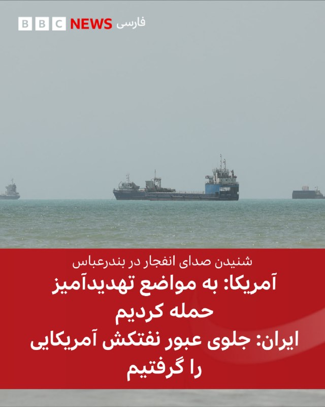

🔻گزارش‌های مردمی و رسانه‌های داخل ایران از شنیدن صدای دست کم سه انفجار در ساعات اولیه بامداد پنجشنبه در شرق بندرعباس حکایت دارد.

خبرگزاری فارس، بامداد پنجشنبه نوشت: «حوالی ساعت ۱:۳۰ بامداد صدای ۳ انفجار از شرق شهر بندرعباس شنیده شد. هنوز محل دقیق و منشأ این صداها مشخص نیست و پیگیری‌ها برای مشخص شدن آن ادامه دارد.»

گزارش‌های کاربرانی که برای کانال وحید آنلاین پیام فرستاده‌اند هم از شنیدن صدای دست کم سه انفجار در شرق بندرعباس حکایت دارد.

همزمان فرماندهی مرکزی ارتش آمریکا - سنتکام - با انتشار بیانیه‌ای گفته است: «نيروهای آمریکایی امروز چهار پهپاد انتحاری ايرانی را که در اطراف تنگه هرمز تهديد ايجاد کرده بودند، سرنگون کردند. نيروهای آمريکايی همچنين يک ايستگاه کنترل زمينی ايران در بندرعباس را که در آستانه پرتاب پنجمين پهپاد بود، هدف قرار دادند.»

📷 Reuters
https://bbc.in/4f6UBEC
@BBCPersian

## alonews — post 123194

  <a href="telegram/content/alonews_123194_1779944116.webm" target="_blank">🎬 Download video</a>

👈آمریکا «نهاد مدیریت آبراه خلیج فارس» را تحریم کرد

🔴وزارت خزانه‌داری آمریکا اعلام کرد سازمان تازه تأسیس ایرانی «نهاد مدیریت آبراه خلیج فارس» را به فهرست تحریم‌های خود اضافه کرده است.

✅ @AloNews خبر جنگ

## alonews — post 123193

  <a href="telegram/content/alonews_123193_1779944116.webm" target="_blank">🎬 Download video</a>

👈گویا مبدا حمله کویت بوده.

🔴سر همین قضیه قیمت نفت هم داره میره بالا.

✅ @AloNews خبر جنگ

## alonews — post 123192

  <a href="telegram/content/alonews_123192_1779944116.webm" target="_blank">🎬 Download video</a>

👈سپاه یک پایگاه هوایی آمریکایی را هدف قرار داد

روابط عمومی سپاه طی اطلاعیه‌ای اعلام کرد:

🔴به دنبال تعرض سحرگاه امروز ارتش متجاوز آمریکا به نقطه‌ای در حاشیه فرودگاه بندر عباس با پرتابه‌های هوایی، پایگاه هوایی آمریکایی به عنوان مبدا تجاوز، در ساعت ۴/۵۰ دقیقه هدف قرار گرفت.

🔴بسم الله القاسم الجبارین.

🔴فمن اعتدی علیکم فاعتدوا علیه بمثل ما اعتدی علیکم.

🔴به دنبال تعرض سحرگاه امروز ارتش متجاوز آمریکا به نقطه ای در حاشیه فرودگاه بندر عباس با پرتابه‌های هوایی، پایگاه هوایی آمریکایی مبدا تجاوز، در ساعت ۴/۵۰ دقیقه هدف قرار گرفت.

🔴این پاسخ یک اخطار جدی است تا دشمن بداند، تجاوز بدون پاسخ نخواهد ماند و در صورت تکرار، پاسخ ما قاطع تر خواهد بود.

🔴مسئولیت عواقب آن با متجاوز است.

✅ @AloNews خبر جنگ

## alonews — post 123191

  <a href="telegram/content/alonews_123191_1779944117.webm" target="_blank">🎬 Download video</a>

‌
👈فاکس نیوز: آمریکا یه ایستگاه کنترل زمینی ایران رو تو بندرعباس زده؛ همون جایی که قرار بوده یه پهپاد تهاجمی ازش بلند شه. 

🔴به گفتهٔ مقام‌های آمریکایی، چهار تا پهپاد انتحاری دیگه هم که تو تنگه هرمز تهدید محسوب می‌شدن، زده شدن.

✅ @AloNews خبر جنگ

## alonews — post 123190

  <a href="telegram/content/alonews_123190_1779944117.webm" target="_blank">🎬 Download video</a>

👈خبرگزاری CBS: "یک سایت نظامی در خاک ایران هدف حمله قرار گرفت."

✅ @AloNews خبر جنگ

## alonews — post 123189

  <a href="telegram/content/alonews_123189_1779944117.webm" target="_blank">🎬 Download video</a>

👈یک مقام آمریکایی به سی‌بی‌اس گفت ایالات متحده حملات جدیدی را علیه یک سایت نظامی ایران انجام داده ولی آتش‌بس همچنان برقرار است.

🔴یک مقام آمریکایی در گفت‌وگو با رویترز از حملات جدید آمریکا به یک سایت نظامی در ایران خبر داد و گفت ارتش آمریکا همچنین چندین پهپاد ایرانی را رهگیری و سرنگون کرده است.

✅ @AloNews خبر جنگ

## alonews — post 123188

  <a href="telegram/content/alonews_123188_1779944117.webm" target="_blank">🎬 Download video</a>

👈یک منبع آگاه نظامی به خبرگزاری تسنیم گفت: ساعاتی پیش یک نفتکش آمریکایی با خاموش کردن سیستم راداری خود قصد عبور از تنگه هرمز را داشت که با اقدام سریع و قاطع نیروی دریایی سپاه و شلیک به سمت آن، مجبور به توقف و بازگشت شد.

🔴در مقابل، ارتش آمریکا به زمین سوخته‌ای در اطراف بندرعباس شلیک کرده‌اند که صدای انفجارها مربوط به این ماجرا بوده است؛ این شلیک هیچ خسارت جانی یا مالی به همراه نداشته است

✅ @AloNews خبر جنگ

<!-- MSG END -->

<!-- NAV START -->

<a href="https://github.com/ERAGON007/aio-downloader-testing/blob/main/telegram/content/archive_1.md" style="display:inline-block; padding:6px 12px; margin:0 4px; background-color:#2ea44f; color:white; text-decoration:none; border-radius:4px; font-weight:bold;">صفحه بعد</a>

<!-- NAV END -->
